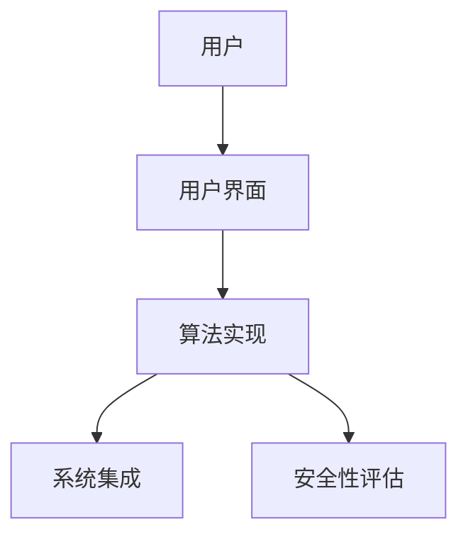
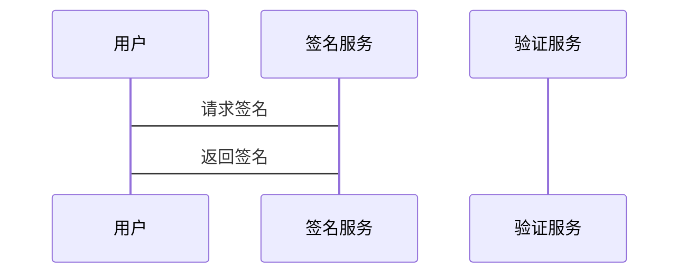
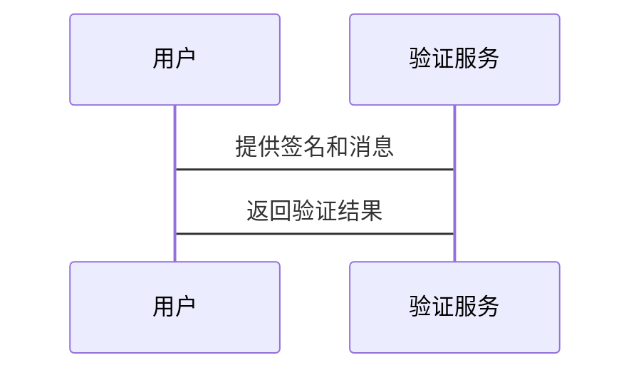

                 


# 巴菲特-芒格的量子互联网安全投资：后量子密码学的商业化

> 关键词：后量子密码学, 巴菲特, 芒格, 量子安全, 投资策略, 商业化

> 摘要：本文探讨了后量子密码学的商业化潜力及其在量子安全领域的应用，结合巴菲特和芒格的投资理念，分析了后量子密码学的技术发展、市场机会和投资策略。通过深入的技术分析和商业案例，本文为投资者和技术从业者提供了关于后量子密码学商业化的重要洞察。

---

## 第一部分: 后量子密码学的背景与现状

### 第1章: 后量子密码学的背景与现状

#### 1.1 量子计算与传统密码学的威胁

##### 1.1.1 量子计算的基本原理
量子计算是一种基于量子力学原理的计算方式，利用量子叠加和量子纠缠等特性，可以在某些特定问题上比经典计算机高效得多。量子计算机的核心是量子位（qubit），它可以同时表示0和1，这使得量子计算机在处理某些复杂问题时具有指数级的计算优势。

##### 1.1.2 量子计算机对传统密码学的威胁
传统密码学主要依赖于RSA、椭圆曲线加密（ ECC）等基于大数分解和离散对数问题的算法。然而，量子计算机可以通过Shor算法在多项式时间内解决这些问题，这意味着一旦量子计算机达到一定的计算能力，传统的加密算法将被破解，从而对全球信息安全造成巨大威胁。

##### 1.1.3 后量子密码学的定义与目标
后量子密码学（Post-Quantum Cryptography, PQC）是研究能够在量子计算机时代仍然安全的加密算法。其目标是提供一种抗量子攻击的加密方案，保护现有的数字通信和数据安全。

---

#### 1.2 后量子密码学的核心概念

##### 1.2.1 后量子密码学的数学基础
后量子密码学的核心算法基于数学结构，如格（Lattice）、编码理论（Code-based）、哈希函数（Hash-based）等。这些数学结构在经典计算和量子计算中都具有抗性，从而确保加密算法的安全性。

##### 1.2.2 后量子密码学的主要技术路线
目前，后量子密码学的主要技术路线包括：
1. **基于格的密码学（Lattice-based Cryptography）**：利用格的数学结构设计加密算法，如NIST候选算法中的Lattice-based签名方案。
2. **基于编码的密码学（Code-based Cryptography）**：利用纠错码的性质设计加密算法，如McEliece密码方案。
3. **基于哈希的签名方案（Hash-based Signatures）**：通过哈希函数生成签名，如SPHINCS算法。

##### 1.2.3 后量子密码学的标准化进展
2022年，美国国家标准与技术研究院（NIST）宣布了四个推荐的后量子加密算法：NIST PQC1、NIST PQC2、NIST PQC3 和 NIST PQC4。这些算法包括签名和加密方案，为后量子密码学的商业化奠定了基础。

---

### 第2章: 巴菲特与芒格的投资理念

#### 2.1 巴菲特与芒格的投资哲学

##### 2.1.1 巴菲特的价值投资理念
巴菲特的价值投资理念强调长期投资、安全边际和企业内在价值。他认为，投资的核心是找到具有强大护城河和持续盈利能力的企业。

##### 2.1.2 芒格的多元思维模型
芒格的多元思维模型强调跨学科思考，将各个领域的知识相互连接，以形成对问题的全面理解。他认为，投资者应该通过多个角度分析问题，避免单一思维的局限性。

##### 2.1.3 巴菲特与芒格投资理念的结合
巴菲特和芒格的投资理念结合了长期价值和跨学科分析，强调对企业和市场的深刻理解。这种理念为后量子密码学的商业化提供了重要的指导。

---

#### 2.2 投资理念与后量子密码学的结合

##### 2.2.1 后量子密码学的商业潜力
后量子密码学是量子时代信息安全的核心技术，其市场需求将随着量子计算机的发展而迅速增长。未来，后量子密码学将在通信、金融、医疗、能源等领域发挥重要作用。

##### 2.2.2 后量子密码学领域的投资机会
随着NIST标准的确定，后量子密码学的商业化进程将加速。投资者可以关注技术领先的企业、标准化机构和相关服务提供商。

##### 2.2.3 巴菲特与芒格投资理念对后量子密码学商业化的影响
巴菲特和芒格的投资理念强调长期价值和企业护城河。在后量子密码学领域，投资者应关注具有技术领先性和市场潜力的企业，同时注重风险管理和长期收益。

---

## 第二部分: 后量子密码学的核心技术

### 第3章: 后量子密码学的数学基础

#### 3.1 后量子密码学的核心算法

##### 3.1.1 基于格的密码学
基于格的密码学是后量子密码学的重要分支，其安全性基于格的最短向量问题（SVP）和最近向量问题（CVP）。NIST推荐的Lattice-based签名方案（如Dilithium）是基于格结构的典型算法。

##### 3.1.2 基于编码的密码学
基于编码的密码学利用纠错码的性质设计加密算法，如McEliece密码方案。其安全性基于纠错码的解码难度。

##### 3.1.3 哈希签名方案
哈希签名方案（如SPHINCS）通过哈希函数生成签名，具有简洁性和抗量子攻击的特点。

#### 3.2 后量子密码学的数学模型

##### 3.2.1 格的数学结构
格是由一组基向量张成的高维空间，其最短向量问题（SVP）是基于格的密码学的核心问题。

##### 3.2.2 哈希函数的数学特性
哈希函数具有单向性、碰撞 resistance 和确定性输出的特点，是哈希签名方案的核心。

##### 3.2.3 后量子签名算法的数学推导
以SPHINCS算法为例，其签名过程涉及对消息哈希后的签名生成，利用Merkle树结构确保签名的抗量子攻击性。

---

### 第4章: 后量子密码学的算法实现

#### 4.1 NIST后量子密码学标准化进展

##### 4.1.1 NIST的标准化流程
NIST通过公开征集、安全性评估和性能测试，最终确定了四个推荐的后量子加密算法。

##### 4.1.2 NIST推荐的后量子算法
推荐的后量子算法包括Lattice-based签名方案、Code-based加密方案等。

##### 4.1.3 后量子算法的性能对比
不同后量子算法在安全性、计算效率和通信开销方面存在差异，需根据具体应用场景选择合适的算法。

#### 4.2 后量子密码学的算法实现

##### 4.2.1 基于格的加密算法实现
以Dilithium算法为例，其签名生成和验证过程涉及格的数学运算。

##### 4.2.2 基于代码的签名算法实现
以McEliece方案为例，其加密和解密过程基于纠错码的性质。

##### 4.2.3 哈希签名方案的实现
以SPHINCS算法为例，其签名过程利用Merkle树结构生成签名。

---

## 第三部分: 后量子密码学的商业化应用

### 第5章: 后量子密码学的商业化潜力

#### 5.1 后量子密码学的市场需求

##### 5.1.1 量子计算机的商业化进程
随着量子计算机的发展，后量子密码学的需求将快速增长。

##### 5.1.2 后量子密码学的市场空间
后量子密码学的市场空间包括企业安全、政府通信、金融支付等领域。

##### 5.1.3 后量子密码学的行业应用
后量子密码学将在通信、金融、医疗等领域发挥重要作用。

#### 5.2 后量子密码学的商业化模式

##### 5.2.1 技术授权与服务模式
后量子密码学技术可以通过技术授权和咨询服务实现商业化。

##### 5.2.2 产品化与标准化路线
后量子密码学的标准化进程将推动其产品的开发和商业化。

##### 5.2.3 后量子密码学的生态建设
后量子密码学的生态建设需要技术供应商、行业应用方和标准机构的共同努力。

---

### 第6章: 后量子密码学的产业链分析

#### 6.1 后量子密码学的产业链构成

##### 6.1.1 技术研发层
技术研发层包括学术机构、研究团队和技术创新企业。

##### 6.1.2 标准化与认证层
标准化与认证层包括NIST等标准机构和认证机构。

##### 6.1.3 应用与服务层
应用与服务层包括企业用户、政府机构和第三方服务提供商。

#### 6.2 后量子密码学的商业生态

##### 6.2.1 技术供应商的角色
技术供应商提供后量子密码学算法和相关服务。

##### 6.2.2 行业应用的需求方
行业应用的需求方包括通信、金融、医疗等领域的企业和机构。

##### 6.2.3 投资机构的角色
投资机构通过投资后量子密码学领域的技术公司和项目，推动其商业化进程。

---

## 第四部分: 后量子密码学的系统架构与实现

### 第7章: 后量子密码学的系统架构与实现

#### 7.1 问题场景介绍
随着量子计算机的快速发展，传统密码学的安全性受到严重威胁。后量子密码学的商业化需求迫切。

#### 7.2 系统功能设计

##### 7.2.1 后量子密码学平台架构
后量子密码学平台包括算法实现、系统集成和用户界面三个主要模块。

##### 7.2.2 系统功能模块
1. **算法实现模块**：实现后量子密码学的核心算法，如Lattice-based签名方案和Code-based加密方案。
2. **系统集成模块**：将后量子密码学算法集成到现有系统中，确保其与传统密码学的兼容性。
3. **用户界面模块**：提供用户友好的界面，方便用户使用后量子密码学服务。

#### 7.3 系统架构设计

##### 7.3.1 后量子密码学平台的架构图


##### 7.3.2 系统接口设计
系统接口包括：
1. **签名生成接口**：生成后量子签名。
2. **签名验证接口**：验证后量子签名。
3. **加密/解密接口**：实现后量子加密和解密。

#### 7.4 系统交互流程

##### 7.4.1 用户请求签名


##### 7.4.2 用户验证签名


---

## 第五部分: 项目实战

### 第8章: 后量子密码学的项目实战

#### 8.1 环境安装

##### 8.1.1 安装必要的工具和库
安装Python、C++编译器和相关数学库。

#### 8.2 系统核心实现源代码

##### 8.2.1 Lattice-based签名方案实现
```python
import numpy as np

def lattice_sign(message):
    # 简化的Lattice-based签名生成
    # 这里仅展示基本思路，具体实现需参考NIST推荐算法
    message_hash = np.array(message)
    signature = np.random.randn(len(message_hash))
    return signature

def lattice_verify(message, signature):
    # 简化的Lattice-based签名验证
    message_hash = np.array(message)
    # 验证签名是否与消息匹配
    return np.allclose(signature, message_hash)
```

##### 8.2.2 Code-based加密方案实现
```python
def code_encrypt(message, public_key):
    # 简化的Code-based加密
    message_bits = message
    cipher = public_key.encrypt(message_bits)
    return cipher

def code_decrypt(cipher, private_key):
    # 简化的Code-based解密
    message_bits = private_key.decrypt(cipher)
    return message_bits
```

#### 8.3 代码应用解读与分析
以上代码展示了后量子密码学算法的基本实现思路，具体实现需参考NIST推荐的算法。

#### 8.4 实际案例分析和详细讲解剖析
以通信领域的实际应用为例，后量子密码学可以用于保护通信过程中的数据安全。

#### 8.5 项目小结
后量子密码学的实现需要结合具体应用场景，选择合适的算法和实现方案。

---

## 第六部分: 后量子密码学的商业化与投资策略

### 第9章: 后量子密码学的商业化与投资策略

#### 9.1 投资策略与风险管理

##### 9.1.1 后量子密码学的投资策略
投资者应关注NIST标准化的进展、后量子算法的性能和企业的技术实力。

##### 9.1.2 风险管理
投资者应评估技术风险、市场风险和政策风险，制定合理的风险管理策略。

#### 9.2 后量子密码学的未来展望

##### 9.2.1 技术发展
后量子密码学的技术发展将围绕算法优化、标准化和商业化展开。

##### 9.2.2 市场趋势
随着量子计算机的商业化，后量子密码学的市场需求将快速增长。

##### 9.2.3 投资机会
投资者应关注后量子密码学领域的技术创新和市场应用机会。

---

## 第七部分: 结语

### 第10章: 结语

#### 10.1 后量子密码学的商业化总结
后量子密码学是量子时代信息安全的核心技术，其商业化潜力巨大。

#### 10.2 投资策略与未来展望
投资者应结合巴菲特和芒格的投资理念，关注后量子密码学的技术发展和市场机会。

#### 10.3 作者总结
后量子密码学的商业化需要技术、市场和政策的多方合作，投资者和技术从业者应共同努力，推动后量子密码学的广泛应用。

---

## 作者：AI天才研究院/AI Genius Institute & 禅与计算机程序设计艺术 /Zen And The Art of Computer Programming

