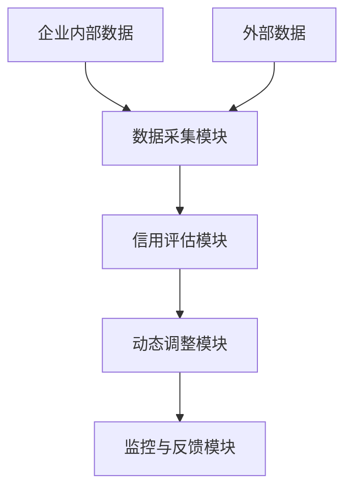
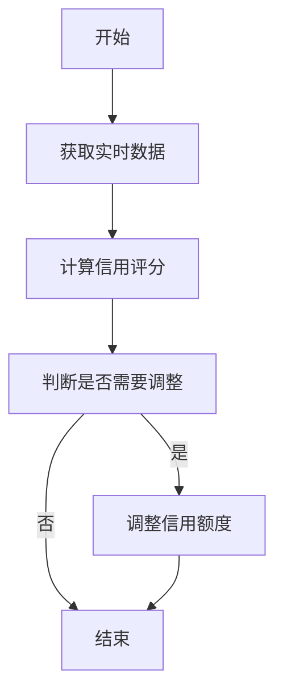
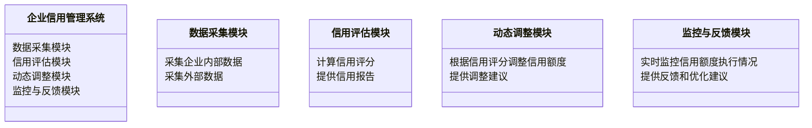
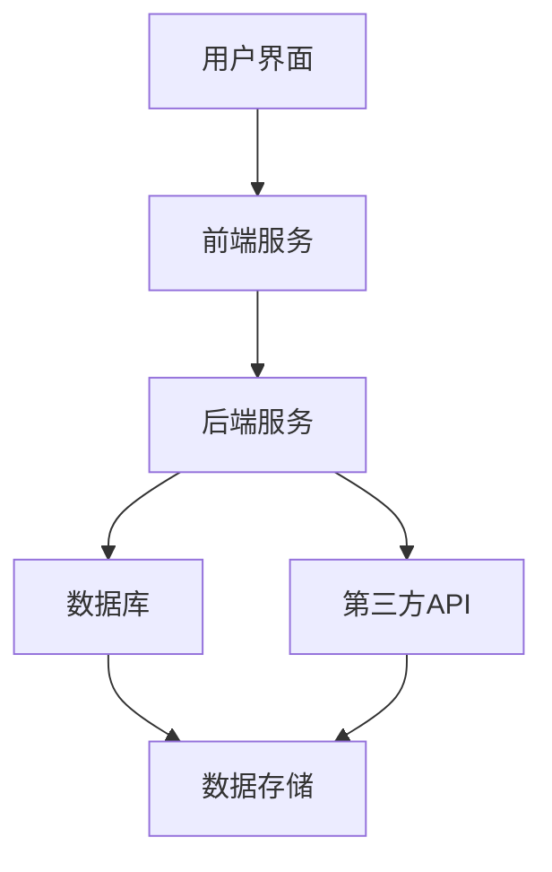
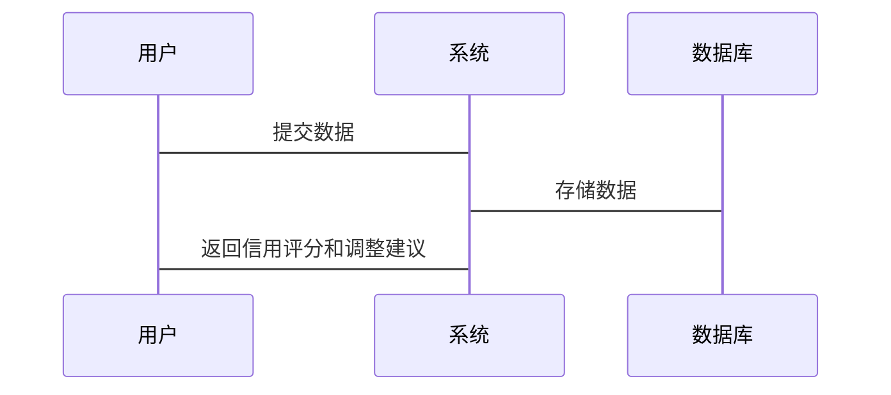

                 


# 智能企业信用额度动态调整与控制系统

> 关键词：智能信用额度管理、动态调整、机器学习、系统架构、企业信用评分、实时监控

> 摘要：本文深入探讨智能企业信用额度动态调整与控制系统的构建与实现。从背景与挑战出发，详细阐述核心概念与理论，分析动态调整的算法原理，设计系统的架构方案，并通过项目实战展示具体实现。最后，总结优化与实践要点，展望未来发展方向。

---

# 第一部分: 智能企业信用额度动态调整与控制系统概述

## 第1章: 企业信用额度管理的背景与挑战

### 1.1 企业信用额度管理的重要性

#### 1.1.1 信用额度管理的基本概念
企业信用额度管理是企业在赊销、信贷等业务中，根据客户或供应商的信用状况，核定其可使用的信用金额。信用额度管理是企业风险管理的重要组成部分，直接影响企业的财务健康和业务发展。

#### 1.1.2 信用额度管理在企业中的作用
信用额度管理能够帮助企业控制风险、优化现金流、提升客户满意度，并在一定程度上促进企业与合作伙伴的长期稳定合作。

#### 1.1.3 传统信用额度管理的局限性
传统的信用额度管理通常基于静态的评估方法，缺乏实时数据的支持，难以适应市场环境的快速变化。此外，传统方法往往依赖人工经验，存在主观性强、效率低、风险控制不及时等问题。

### 1.2 智能信用额度动态调整的必要性

#### 1.2.1 企业信用管理的痛点
- 信用额度核定不准确，可能导致企业面临坏账风险。
- 传统信用管理缺乏实时性，无法及时应对市场变化。
- 人工审批效率低，难以满足快速业务发展的需求。

#### 1.2.2 动态调整信用额度的优势
动态调整信用额度能够根据企业的实时经营状况和市场环境变化，自动优化信用额度，降低风险，提高资金利用效率。

#### 1.2.3 智能化管理的未来趋势
随着人工智能和大数据技术的快速发展，智能信用额度动态调整将成为企业信用管理的重要趋势，能够实现更精准、更高效的信用管理。

### 1.3 本章小结
本章通过分析企业信用额度管理的重要性及其在传统模式中的局限性，提出了智能信用额度动态调整的必要性，并展望了其未来发展趋势。

---

## 第2章: 智能信用额度动态调整的核心概念

### 2.1 智能信用控制系统的定义与特点

#### 2.1.1 系统定义
智能信用控制系统是一种基于人工智能、大数据分析和实时数据监控的信用管理工具，能够根据企业的实时经营状况和市场环境，动态调整信用额度。

#### 2.1.2 系统特点
- **实时性**：基于实时数据进行信用评估和调整。
- **智能化**：利用机器学习算法自动优化信用额度。
- **精准性**：通过数据分析实现精准的信用评估。
- **可扩展性**：能够适应不同规模和行业的企业需求。

### 2.2 动态调整机制的原理

#### 2.2.1 调整触发条件
- **信用评分变化**：当企业的信用评分低于设定阈值时，触发信用额度调整。
- **市场环境变化**：如行业景气度下降或原材料价格上涨时，触发调整。
- **企业经营状况变化**：如销售额下降或利润率显著波动时，触发调整。

#### 2.2.2 调整规则
- **风险控制规则**：根据企业的信用风险等级调整信用额度。
- **业务需求规则**：根据企业的业务规模和发展需求调整信用额度。
- **动态优化规则**：基于历史数据和预测模型优化信用额度。

#### 2.2.3 调整算法概述
动态调整算法通常基于机器学习模型，如线性回归、支持向量机（SVM）或随机森林（Random Forest），结合实时数据进行预测和调整。

### 2.3 系统架构的核心要素

#### 2.3.1 数据流分析
系统需要整合企业内部数据（如财务数据、销售数据）和外部数据（如行业指数、市场数据），形成完整的数据流。

#### 2.3.2 模块划分
- **数据采集模块**：负责采集企业内外部数据。
- **信用评估模块**：基于数据计算信用评分。
- **动态调整模块**：根据信用评分和调整规则动态调整信用额度。
- **监控与反馈模块**：实时监控信用额度执行情况并提供反馈。

#### 2.3.3 功能模块之间的关系
通过数据流图（Data Flow Diagram，DFD）可以清晰地展示各模块之间的关系。以下是系统的DFD图：



### 2.4 本章小结
本章详细阐述了智能信用控制系统的定义、特点、动态调整机制及其系统架构的核心要素，为后续章节的算法设计和系统实现奠定了基础。

---

## 第3章: 智能信用额度动态调整的数学模型与算法原理

### 3.1 信用评分模型的构建

#### 3.1.1 信用评分的基本概念
信用评分是衡量企业信用风险的重要指标，通常基于财务数据、经营数据和市场数据进行评估。

#### 3.1.2 信用评分的数学模型
常用的信用评分模型包括线性回归模型和逻辑回归模型。以下是一个简化的信用评分模型示例：

$$ \text{信用评分} = \alpha \times \text{净利润率} + \beta \times \text{应收账款周转率} + \gamma \times \text{行业景气度} $$

其中，$\alpha$、$\beta$和$\gamma$是模型的系数，需要通过训练数据进行优化。

#### 3.1.3 模型训练与优化
通过机器学习算法（如梯度下降）对模型进行训练，优化模型的系数，提高预测准确性。

### 3.2 动态调整算法的设计

#### 3.2.1 动态调整的基本逻辑
动态调整算法基于实时信用评分和预设规则，自动调整信用额度。以下是算法的流程图：



#### 3.2.2 基于机器学习的预测模型
动态调整算法通常基于机器学习模型进行预测，例如使用随机森林模型预测企业的信用风险等级。以下是随机森林模型的预测流程：

1. **数据预处理**：对实时数据进行清洗和特征提取。
2. **特征选择**：选择对信用评分影响最大的特征。
3. **模型训练**：使用历史数据训练随机森林模型。
4. **预测与调整**：基于实时数据，使用训练好的模型进行预测，并根据预测结果调整信用额度。

### 3.3 本章小结
本章详细介绍了信用评分模型的构建和动态调整算法的设计，重点讲解了机器学习算法在信用额度动态调整中的应用。

---

## 第4章: 智能信用额度动态调整系统的架构设计

### 4.1 系统功能设计

#### 4.1.1 领域模型
以下是系统的核心领域模型，展示了各模块之间的关系：



### 4.2 系统架构设计

#### 4.2.1 系统架构图
以下是系统的整体架构图：



#### 4.2.2 模块划分与功能说明
- **用户界面**：提供友好的操作界面，供用户查看信用额度和调整建议。
- **前端服务**：接收用户请求并转发给后端服务。
- **后端服务**：处理业务逻辑，调用数据采集、信用评估和动态调整模块。
- **数据库**：存储企业数据和调整记录。
- **第三方API**：获取外部数据，如行业指数和市场数据。

### 4.3 系统接口设计

#### 4.3.1 数据接口
- **输入接口**：接收企业内部数据和外部数据。
- **输出接口**：提供信用评分和调整建议。

#### 4.3.2 交互接口
- **用户交互**：用户可以通过界面查看信用额度和调整建议。
- **系统反馈**：系统实时反馈信用额度调整结果。

### 4.4 系统交互流程

#### 4.4.1 信用额度调整流程
以下是信用额度调整的交互流程图：



### 4.5 本章小结
本章详细描述了智能信用额度动态调整系统的架构设计，包括功能模块划分、系统架构图和交互流程图。

---

## 第5章: 智能信用额度动态调整系统的项目实战

### 5.1 环境安装与配置

#### 5.1.1 开发环境
- **操作系统**：Windows 10 或 macOS 10.15以上
- **编程语言**：Python 3.8以上
- **开发框架**：Django 或 Flask
- **数据库**：MySQL 或 PostgreSQL
- **机器学习库**：scikit-learn、xgboost
- **数据可视化工具**：Matplotlib、Seaborn

### 5.2 核心代码实现

#### 5.2.1 数据采集模块
以下是一个简单的数据采集模块代码示例：

```python
import requests
import json

def fetch_data(url):
    response = requests.get(url)
    if response.status_code == 200:
        return json.loads(response.text)
    else:
        return None
```

#### 5.2.2 信用评估模块
以下是基于逻辑回归的信用评分模型代码示例：

```python
from sklearn.linear_model import LogisticRegression
from sklearn.metrics import accuracy_score

# 假设X是特征矩阵，y是标签
model = LogisticRegression()
model.fit(X, y)

# 预测信用评分
y_pred = model.predict(X_test)
print("Accuracy:", accuracy_score(y_test, y_pred))
```

#### 5.2.3 动态调整模块
以下是动态调整模块的代码示例：

```python
def adjust_credit_limit(credit_score):
    if credit_score < 0.6:
        return "降低信用额度"
    elif 0.6 <= credit_score < 0.8:
        return "保持信用额度"
    else:
        return "增加信用额度"
```

### 5.3 项目实战案例分析

#### 5.3.1 案例背景
某制造企业因原材料价格上涨，导致利润率下降，信用评分从0.75降至0.65。系统触发信用额度调整机制。

#### 5.3.2 数据分析
- 原信用额度：100万元
- 新信用额度：根据信用评分调整为80万元

#### 5.3.3 系统反馈
系统实时监控信用额度执行情况，发现调整后企业经营状况有所改善，信用评分逐步回升。

### 5.4 本章小结
本章通过实际案例展示了智能信用额度动态调整系统的实现过程，包括环境配置、核心代码实现和案例分析。

---

## 第6章: 智能信用额度动态调整系统的优化与实践

### 6.1 系统优化要点

#### 6.1.1 数据质量优化
- 数据清洗：去除冗余数据和异常值。
- 特征工程：提取关键特征，提升模型性能。

#### 6.1.2 模型优化
- 算法优化：尝试不同的机器学习算法，选择最优模型。
- 超参数调优：通过网格搜索优化模型参数。

#### 6.1.3 系统性能优化
- 优化数据存储结构，提升查询效率。
- 使用分布式计算框架（如Spark）处理大数据量。

### 6.2 风险控制与注意事项

#### 6.2.1 风险控制
- 设置信用额度调整的上限和下限，避免过度调整。
- 建立多层次的信用评估体系，降低模型风险。

#### 6.2.2 注意事项
- 定期更新模型，避免过时数据影响信用评分。
- 建立监控机制，实时预警信用风险。

### 6.3 未来发展趋势

#### 6.3.1 技术趋势
- 更加智能化：结合自然语言处理（NLP）和知识图谱，提升信用评估的准确性。
- 更加实时化：基于流数据处理技术，实现信用额度的实时调整。

#### 6.3.2 应用场景扩展
- 信用额度动态调整在供应链金融中的应用。
- 智能信用管理在国际贸易中的应用。

### 6.4 本章小结
本章总结了智能信用额度动态调整系统的优化要点，提出了风险控制的注意事项，并展望了未来的发展趋势。

---

## 第7章: 总结与展望

### 7.1 核心要点总结

#### 7.1.1 核心概念总结
智能信用额度动态调整系统是一种基于人工智能和大数据技术的信用管理工具，能够实现信用额度的实时调整和风险控制。

#### 7.1.2 关键技术总结
- 数据采集与处理
- 信用评分模型构建
- 动态调整算法设计
- 系统架构与实现

### 7.2 未来展望

#### 7.2.1 技术进步
随着人工智能和大数据技术的不断进步，智能信用额度动态调整系统将更加智能化和精准化。

#### 7.2.2 应用领域扩展
智能信用管理将在更多行业和场景中得到应用，如供应链金融、国际贸易等。

### 7.3 本章小结
本章总结了智能信用额度动态调整系统的的核心要点，并展望了其未来的发展方向。

---

## 作者：AI天才研究院/AI Genius Institute & 禅与计算机程序设计艺术 /Zen And The Art of Computer Programming

---

以上是《智能企业信用额度动态调整与控制系统》的技术博客文章的完整目录和内容框架。

