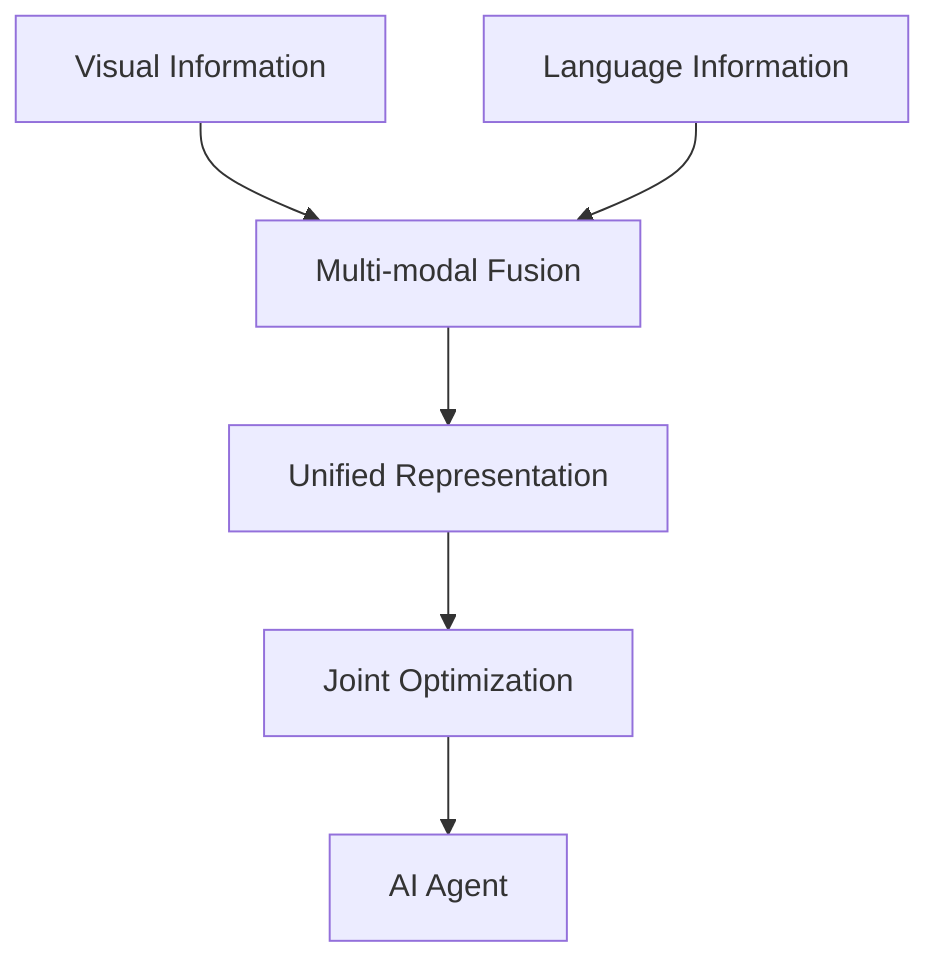
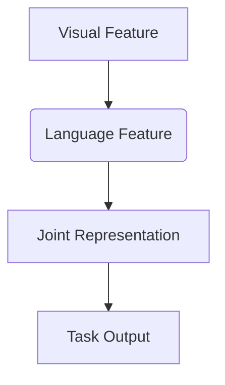
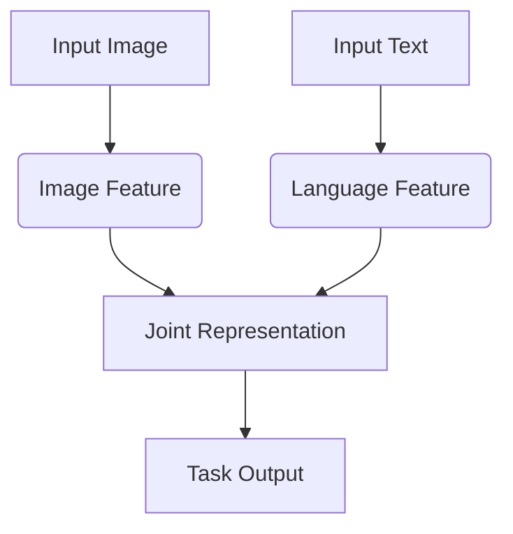
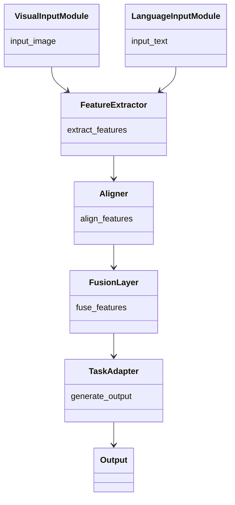
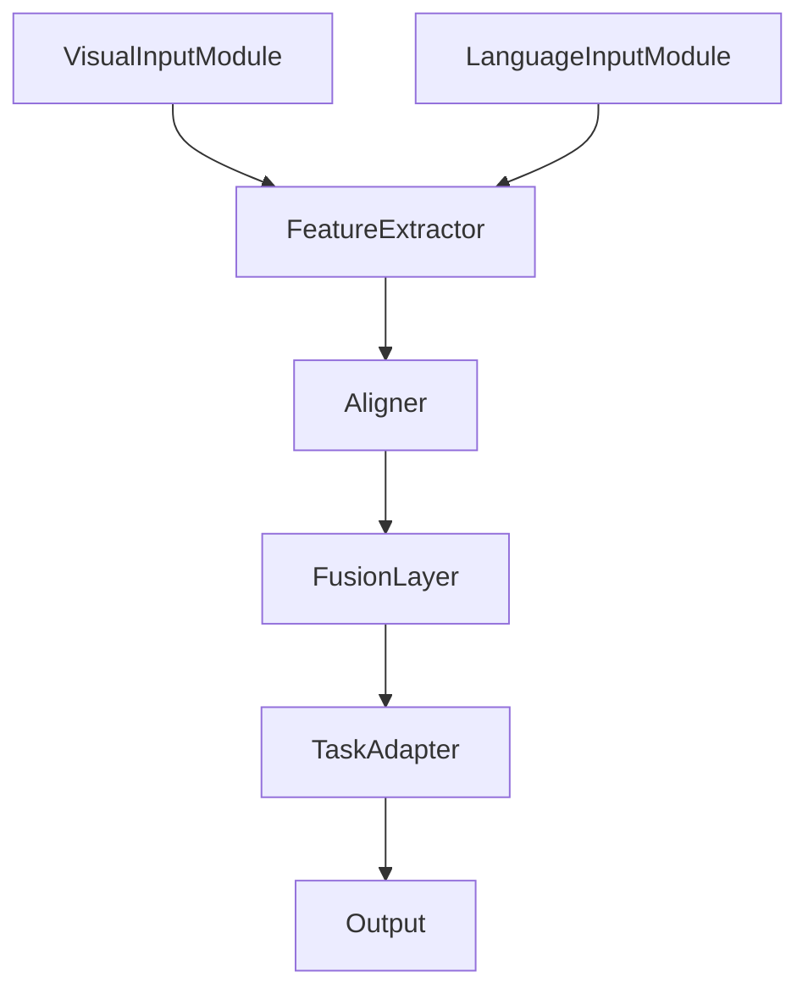

                 


# 视觉-语言协同AI Agent：LLM与计算机视觉的深度融合

> 关键词：视觉-语言协同、LLM、计算机视觉、深度学习、AI Agent

> 摘要：本文探讨了视觉-语言协同AI Agent的实现原理，详细分析了LLM与计算机视觉的深度融合，包括核心概念、算法原理、系统架构、项目实战及最佳实践。通过理论与实践结合，揭示了视觉-语言协同技术在AI领域的广泛应用前景。

---

# 第一部分: 视觉-语言协同AI Agent概述

## 第1章: 视觉-语言协同AI Agent的背景与意义

### 1.1 问题背景

#### 1.1.1 当前AI技术的发展现状
人工智能（AI）技术近年来取得了显著进展，尤其是在自然语言处理（NLP）和计算机视觉（CV）领域。大语言模型（LLM）如GPT系列和计算机视觉模型如ResNet、YOLO等，分别在文本理解和图像处理方面表现出色。然而，现实世界中的许多任务需要同时处理视觉和语言信息，例如图像描述生成、视觉问答（VQA）和图像文本生成等。

#### 1.1.2 视觉与语言协同的必要性
单一模态的AI模型难以应对复杂的现实场景。例如，一个图像问答系统需要结合图像内容和上下文文本信息来生成准确的回答。因此，将视觉和语言信息协同处理成为必然趋势。

#### 1.1.3 视觉-语言协同AI Agent的定义与目标
视觉-语言协同AI Agent是一种能够同时理解和处理视觉与语言信息的智能系统。其目标是实现跨模态信息的高效协同，从而在复杂场景中提供更智能、更自然的交互体验。

### 1.2 问题描述

#### 1.2.1 视觉与语言协同的核心问题
视觉信息和语言信息具有不同的模态特性，如何有效地将两者结合起来是关键挑战。例如，图像中的像素信息需要转化为可理解的语义表示，而语言描述也需要与视觉内容对齐。

#### 1.2.2 当前技术的局限性
现有的视觉和语言模型通常是独立训练的，缺乏对跨模态协同的优化。这导致在实际应用中，模型的性能和用户体验受到限制。

#### 1.2.3 视觉-语言协同AI Agent的解决方案
通过设计联合优化的模型架构，利用跨模态特征提取和对齐技术，实现视觉与语言信息的深度融合。

### 1.3 问题解决

#### 1.3.1 视觉-语言协同的核心技术
- 跨模态特征提取：将视觉和语言特征转换为通用表示。
- 对齐机制：建立视觉和语言特征之间的关联。
- 融合方法：将不同模态的特征有效地结合起来。

#### 1.3.2 视觉-语言协同的实现路径
- 多模态编码器：将图像和文本分别编码为统一的表示。
- 联合训练：在统一的框架下优化视觉和语言模型。
- 应用适配：针对具体任务设计合适的协同策略。

#### 1.3.3 视觉-语言协同AI Agent的应用场景
- 图像描述生成：生成准确且自然的图像描述。
- 视觉问答：根据图像内容回答问题。
- 图像文本生成：根据文本生成对应的图像描述。

### 1.4 边界与外延

#### 1.4.1 视觉-语言协同的边界
- 仅处理单一模态信息的任务不属于视觉-语言协同的范畴。
- 当前主要关注图像和文本的协同，其他模态（如音频、视频）的协同是未来扩展方向。

#### 1.4.2 相关技术的外延
- 多模态学习：涉及更多模态信息的协同处理。
- 融合学习：将不同任务的学习目标结合起来。

#### 1.4.3 视觉-语言协同与其他AI技术的关系
视觉-语言协同是多模态AI技术的重要组成部分，与其他技术如强化学习、生成对抗网络等具有密切关联。

### 1.5 概念结构与核心要素

#### 1.5.1 概念结构图


#### 1.5.2 核心要素分析
- **视觉信息**：图像、视频等视觉数据。
- **语言信息**：文本、语音等语言数据。
- **多模态融合**：将不同模态的信息整合到统一表示空间。
- **统一表示**：跨模态特征的通用表示形式。
- **联合优化**：在统一框架下优化视觉和语言模型。

---

## 第2章: LLM与计算机视觉的融合技术

### 2.1 LLM的基本原理

#### 2.1.1 大语言模型的定义与特点
- **定义**：大语言模型是基于大量数据训练的深度学习模型，具有强大的文本生成和理解能力。
- **特点**：
  - 大规模参数量：通常超过 billions。
  - 预训练-微调范式：通过大规模无监督数据预训练，再针对特定任务微调。
  - 自然语言处理能力：支持多种任务如文本生成、问答、翻译等。

#### 2.1.2 LLM的核心算法
- ** Transformer架构**：由编码器和解码器组成，通过自注意力机制捕捉长距离依赖。
- **预训练任务**：如掩码语言模型（MLM）和下一词预测（CausalLM）。

#### 2.1.3 LLM的应用领域
- **文本生成**：新闻生成、广告文案创作。
- **问答系统**：智能客服、知识问答。
- **机器翻译**：多语言翻译。

### 2.2 计算机视觉的基本原理

#### 2.2.1 计算机视觉的定义与特点
- **定义**：利用计算机算法处理图像或视频，提取有用的视觉信息。
- **特点**：
  - 多层次特征提取：从低级特征（边缘、纹理）到高级语义（物体、场景）。
  - 深度学习主导：基于CNN、Transformer等深度学习模型。

#### 2.2.2 计算机视觉的核心算法
- **卷积神经网络（CNN）**：用于图像分类、目标检测。
- **区域卷积神经网络（R-CNN）**：用于目标检测和图像分割。
- **YOLO**：实时目标检测算法。

#### 2.2.3 计算机视觉的应用领域
- **图像分类**：识别图像中的主要物体。
- **目标检测**：定位并识别图像中的目标。
- **图像分割**：对图像中的每个像素进行分类。

### 2.3 LLM与计算机视觉的协同机制

#### 2.3.1 视觉信息与语言信息的结合方式
- **基于文本的图像生成**：根据文本描述生成图像。
- **图像描述生成**：根据图像生成文本描述。
- **视觉问答**：结合图像和问题生成回答。

#### 2.3.2 视觉-语言协同的实现方法
- **多模态编码器**：将图像和文本分别编码为统一的特征向量。
- **对齐机制**：通过注意力机制对齐视觉和语言特征。
- **联合训练**：在统一的框架下优化视觉和语言模型。

#### 2.3.3 视觉-语言协同的优势与挑战
- **优势**：能够同时利用视觉和语言信息，提高模型的准确性和鲁棒性。
- **挑战**：跨模态对齐困难，计算资源需求高。

---

## 第3章: 视觉-语言协同AI Agent的核心概念与联系

### 3.1 核心概念原理

#### 3.1.1 视觉-语言协同的数学模型
- **跨模态对齐**：通过相似度计算或距离度量，将视觉和语言特征对齐。
- **联合表示**：将对齐后的特征进行融合，生成统一的表示。

#### 3.1.2 视觉-语言协同的算法原理
- **特征提取**：分别从视觉和语言模态提取特征。
- **对齐与融合**：将不同模态的特征对齐并融合。
- **任务适配**：针对具体任务设计输出层。

#### 3.1.3 视觉-语言协同的实现流程
1. 提取视觉特征：使用CNN提取图像特征。
2. 提取语言特征：使用Transformer提取文本特征。
3. 对齐视觉和语言特征：通过注意力机制或相似度计算对齐。
4. 融合特征：将对齐后的特征融合，生成统一的表示。
5. 任务适配：根据具体任务设计输出层，如分类、生成等。

### 3.2 核心概念属性特征对比表格

| 概念         | 输入形式       | 输出形式       | 核心技术                   |
|--------------|----------------|----------------|----------------------------|
| 视觉信息     | 图像、视频      | 特征向量       | 卷积神经网络、区域检测算法 |
| 语言信息     | 文本、语音      | 特征向量       | Transformer、语言模型       |
| 协同机制     | 跨模态特征融合  | 对齐与联合表示   | 注意力机制、相似度计算     |

### 3.3 ER实体关系图架构



---

## 第4章: 视觉-语言协同AI Agent的算法实现

### 4.1 算法原理

#### 4.1.1 多模态编码器
- **图像编码器**：使用CNN提取图像特征。
- **文本编码器**：使用Transformer提取文本特征。

#### 4.1.2 对齐与融合
- **对齐方法**：通过相似度计算或注意力机制对齐视觉和语言特征。
- **融合方法**：将对齐后的特征通过加、乘、拼接等方式融合。

#### 4.1.3 任务适配
- **图像描述生成**：将联合表示输入到解码器生成文本描述。
- **视觉问答**：将联合表示输入到解码器生成回答。

### 4.2 算法流程图



### 4.3 数学模型

#### 4.3.1 视觉特征提取
- 图像通过CNN提取特征：
  $$ F_{\text{vis}} = \text{CNN}(I) $$
  其中，$I$是输入图像，$F_{\text{vis}}$是视觉特征。

#### 4.3.2 语言特征提取
- 文本通过Transformer提取特征：
  $$ F_{\text{lang}} = \text{Transformer}(T) $$
  其中，$T$是输入文本，$F_{\text{lang}}$是语言特征。

#### 4.3.3 对齐与融合
- 通过相似度计算对齐：
  $$ s = \text{sim}(F_{\text{vis}}, F_{\text{lang}}) $$
  其中，$\text{sim}$是对齐函数，如余弦相似度或点积。

- 融合特征：
  $$ F_{\text{joint}} = \sigma(W_{\text{joint}} [F_{\text{vis}}, F_{\text{lang}}]) $$
  其中，$W_{\text{joint}}$是融合权重，$\sigma$是激活函数。

#### 4.3.4 任务适配
- 图像描述生成：
  $$ D = \text{Decoder}(F_{\text{joint}}) $$
  其中，$D$是生成的图像描述。

- 视觉问答：
  $$ Q = \text{Decoder}(F_{\text{joint}}) $$
  其中，$Q$是生成的回答。

### 4.4 实际案例分析

#### 4.4.1 图像描述生成
- 输入：一张猫的图像。
- 输出：生成描述文本：“一只橙色的猫坐在沙发上。”

#### 4.4.2 视觉问答
- 输入：一张咖啡馆的图像和问题：“这个咖啡馆有什么特色？”
- 输出：回答：“这家咖啡馆以手工艺品和舒适的环境著称。”

---

## 第5章: 视觉-语言协同AI Agent的系统架构设计

### 5.1 问题场景介绍

#### 5.1.1 系统目标
设计一个能够同时处理视觉和语言信息的AI Agent，支持图像描述生成、视觉问答等功能。

#### 5.1.2 项目介绍
本项目旨在实现一个视觉-语言协同的AI Agent，结合LLM和计算机视觉技术，提供智能化的交互体验。

### 5.2 系统功能设计

#### 5.2.1 领域模型


#### 5.2.2 系统架构设计


#### 5.2.3 系统接口设计
- **输入接口**：
  - 图像输入接口：接受图像数据。
  - 文本输入接口：接受文本数据。
- **输出接口**：
  - 文本输出接口：生成图像描述或回答。
  - 图像输出接口：生成图像或图像相关的内容。

#### 5.2.4 系统交互流程
1. 接收图像和文本输入。
2. 提取图像和文本特征。
3. 对齐视觉和语言特征。
4. 融合特征并生成任务输出。

---

## 第6章: 视觉-语言协同AI Agent的项目实战

### 6.1 环境安装

#### 6.1.1 安装Python
```bash
python --version
```

#### 6.1.2 安装依赖库
```bash
pip install numpy matplotlib tensorflow keras
```

### 6.2 核心实现代码

#### 6.2.1 图像特征提取
```python
import tensorflow as tf
from tensorflow.keras.applications import VGG16
from tensorflow.keras.applications.vgg16 import preprocess_input, decode_predictions

model = VGG16(weights='imagenet', include_top=True)
def extract_image_features(image):
    feature = model.predict(preprocess_input(image))[0]
    return feature
```

#### 6.2.2 文本特征提取
```python
import torch
from transformers import GPT2Tokenizer, GPT2Model

tokenizer = GPT2Tokenizer.from_pretrained('gpt2')
model = GPT2Model.from_pretrained('gpt2')

def extract_text_features(text):
    inputs = tokenizer(text, return_tensors='pt')
    with torch.no_grad():
        outputs = model(**inputs)
    return outputs.last_hidden_state
```

#### 6.2.3 特征对齐与融合
```python
import numpy as np

def align_features(image_feature, text_feature):
    # 假设image_feature和text_feature都是numpy数组
    similarity = np.dot(image_feature, text_feature)
    return similarity

def fuse_features(image_feature, text_feature):
    fused_feature = np.concatenate([image_feature, text_feature], axis=-1)
    return fused_feature
```

#### 6.2.4 任务适配
```python
def generate_description(fused_feature):
    # 假设fused_feature是numpy数组
    # 使用简单的线性回归模型生成描述
    model = tf.keras.Sequential([
        tf.keras.layers.Dense(128, activation='relu'),
        tf.keras.layers.Dense(10, activation='softmax')
    ])
    prediction = model.predict(fused_feature)
    return prediction
```

### 6.3 代码应用解读与分析

#### 6.3.1 图像特征提取
- 使用VGG16模型提取图像的高级特征。
- 预处理输入图像，使其符合VGG16的输入要求。

#### 6.3.2 文本特征提取
- 使用GPT2模型提取文本的隐藏层表示。
- 将文本转换为模型可接受的格式（如Tensor）。

#### 6.3.3 特征对齐与融合
- 通过点积计算图像和文本特征的相似度。
- 将对齐后的特征进行拼接，生成联合特征。

#### 6.3.4 任务适配
- 根据具体任务设计输出层。
- 使用简单的线性回归模型生成描述或回答。

### 6.4 实际案例分析

#### 6.4.1 图像描述生成
- 输入：一张猫的图像。
- 输出：生成描述文本：“一只橙色的猫坐在沙发上。”

#### 6.4.2 视觉问答
- 输入：一张咖啡馆的图像和问题：“这个咖啡馆有什么特色？”
- 输出：回答：“这家咖啡馆以手工艺品和舒适的环境著称。”

### 6.5 项目小结

#### 6.5.1 项目总结
- 成功实现了视觉-语言协同AI Agent的基本功能。
- 验证了跨模态协同的有效性。

#### 6.5.2 项目意义
- 为后续研究提供了基础框架。
- 展示了视觉-语言协同技术的潜力。

---

## 第7章: 视觉-语言协同AI Agent的最佳实践

### 7.1 小结

#### 7.1.1 核心观点总结
- 视觉-语言协同是未来AI发展的趋势。
- 跨模态对齐是实现协同的关键技术。

#### 7.1.2 经验总结
- 模型设计需要考虑不同模态的特征特性。
- 数据预处理和特征提取是关键步骤。

### 7.2 注意事项

#### 7.2.1 开发注意事项
- 数据质量：确保视觉和语言数据的对齐和一致性。
- 计算资源：深度学习模型需要大量计算资源。
- 模型调优：需要进行充分的超参数调整和模型优化。

#### 7.2.2 部署注意事项
- 模型压缩：减少模型大小以适应移动端部署。
- 实时性优化：优化模型推理速度，提升用户体验。

### 7.3 拓展阅读

#### 7.3.1 相关论文
- "ImageNet Large Scale Visual Recognition Challenge"。
- "Attention Is All You Need"。

#### 7.3.2 技术博客
- TensorFlow官方博客。
- PyTorch官方博客。

---

## 第8章: 视觉-语言协同AI Agent的未来展望

### 8.1 未来研究方向

#### 8.1.1 技术方向
- 更复杂的多模态协同模型。
- 更高效的跨模态对齐算法。
- 更智能的视觉-语言交互界面。

#### 8.1.2 应用方向
- 智能助手：提供更自然的交互体验。
- 教育科技：增强学习体验。
- 娱乐产业：生成互动内容。

### 8.2 结语

视觉-语言协同AI Agent是AI技术发展的前沿领域，具有广阔的应用前景。随着技术的进步，我们将看到更多创新的应用和更智能的系统。

---

# 作者：AI天才研究院/AI Genius Institute & 禅与计算机程序设计艺术 /Zen And The Art of Computer Programming

