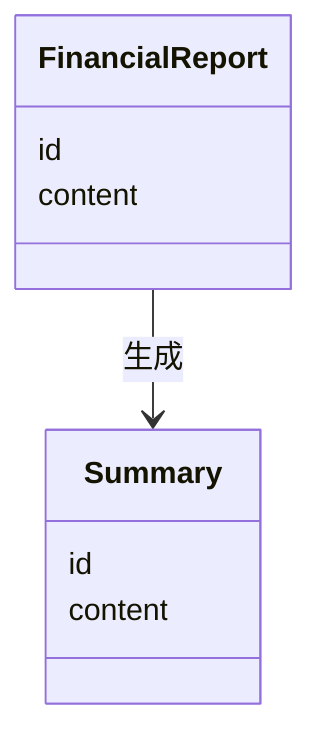

                 


# 设计智能化的企业财务报告可读性增强与自动摘要模型

> 关键词：企业财务报告，可读性增强，自动摘要，自然语言处理，机器学习

> 摘要：本文详细探讨了如何利用自然语言处理和机器学习技术设计智能化的企业财务报告可读性增强与自动摘要模型。文章从问题背景出发，分析了当前财务报告存在的可读性问题，提出了基于深度学习的解决方案，并详细介绍了模型的算法原理、系统架构设计以及实际应用案例。

---

# 第一部分：企业财务报告可读性增强与自动摘要模型背景介绍

## 第1章：问题背景与描述

### 1.1 问题背景

#### 1.1.1 企业财务报告的重要性
企业财务报告是反映企业财务状况、经营成果和现金流量的重要文件，是企业管理层、投资者、债权人等利益相关者做出决策的关键依据。然而，财务报告通常内容繁杂、术语专业、结构复杂，导致普通用户难以快速理解和提取关键信息。

#### 1.1.2 财务报告可读性差的问题
- **信息量大**：财务报告通常包含大量数据和表格，信息密度高，普通用户难以快速抓住重点。
- **术语复杂**：财务报告中使用了许多专业术语，如“应收账款”、“负债”、“损益表”等，这些术语对非专业人员来说可能难以理解。
- **结构复杂**：财务报告的结构通常较为复杂，包括资产负债表、利润表、现金流量表等部分，普通用户需要具备一定的财务知识才能正确解读。

#### 1.1.3 提高财务报告可读性的必要性
随着企业规模的不断扩大和业务的复杂化，财务报告的重要性日益凸显。然而，传统的财务报告形式难以满足现代企业对高效信息处理的需求。提高财务报告的可读性，不仅有助于企业内部管理，还能帮助外部利益相关者更好地理解企业的财务状况，从而做出更明智的决策。

### 1.2 问题描述

#### 1.2.1 财务报告的复杂性
财务报告的复杂性主要体现在以下几个方面：
- **数据繁多**：财务报告通常包含大量数字和表格，信息量大，但缺乏直观的总结和提炼。
- **术语专业**：财务报告中使用的术语具有专业性和技术性，普通用户难以理解。
- **结构复杂**：财务报告的结构通常较为复杂，需要用户具备一定的财务知识才能正确解读。

#### 1.2.2 用户需求的多样性
不同用户对财务报告的需求存在显著差异：
- **管理层**：需要快速获取关键财务指标，以便做出经营决策。
- **投资者**：关注企业的财务健康状况和投资价值。
- **审计人员**：需要详细审核财务数据，确保合规性。

#### 1.2.3 当前技术的局限性
现有的技术手段在提高财务报告可读性方面存在以下局限性：
- **人工解读效率低**：传统财务报告解读主要依赖人工，效率低下且容易出错。
- **缺乏智能化工具**：现有的财务报告分析工具多为简单查询和统计，难以提供智能化的解读和摘要服务。
- **信息提取不够精准**：传统文本处理技术难以准确提取财务报告中的关键信息。

### 1.3 问题解决

#### 1.3.1 智能化技术的应用
通过引入自然语言处理（NLP）和机器学习技术，可以实现财务报告的智能化解读和摘要生成。

#### 1.3.2 自动摘要模型的作用
自动摘要模型能够从财务报告中提取关键信息，生成简洁明了的摘要，帮助用户快速理解报告内容。

#### 1.3.3 提高可读性的具体措施
- **引入NLP技术**：利用分词、句法分析等技术，提高文本处理的准确性。
- **构建领域模型**：基于财务领域的知识图谱，提升模型对财务术语和结构的理解能力。
- **优化摘要算法**：通过改进摘要算法，提高摘要的准确性和可读性。

### 1.4 边界与外延

#### 1.4.1 范围界定
本文的研究范围限定在企业财务报告的可读性增强和自动摘要方面，重点关注基于NLP和机器学习技术的解决方案。

#### 1.4.2 相关概念的外延
- **自然语言处理（NLP）**：研究如何让计算机理解和处理人类语言的技术。
- **文本摘要**：从文本中提取关键信息，生成简洁的摘要。
- **财务报告分析**：通过对财务报告的分析，提取关键指标和信息。

#### 1.4.3 系统边界
本文设计的模型仅关注财务报告的文本处理和摘要生成，不涉及财务数据的计算和分析。

### 1.5 概念结构与核心要素

#### 1.5.1 核心概念组成
- **财务报告**：企业的财务状况、经营成果和现金流量的正式文件。
- **可读性增强**：通过技术手段提高财务报告的可理解性。
- **自动摘要模型**：基于机器学习的文本摘要生成系统。

#### 1.5.2 要素之间的关系
- 财务报告是输入数据，自动摘要模型是处理工具，可读性增强是目标。
- 自动摘要模型通过理解财务报告的内容，生成简洁的摘要，从而提高报告的可读性。

#### 1.5.3 模型的整体架构
- **输入**：企业财务报告文本。
- **处理**：利用NLP技术和机器学习算法，提取关键信息，生成摘要。
- **输出**：简洁、准确的财务报告摘要。

---

## 第2章：核心概念与联系

### 2.1 可读性增强的核心概念

#### 2.1.1 自然语言处理技术
- **分词**：将财务报告文本分割成词语。
- **句法分析**：分析句子的结构和语法关系。
- **实体识别**：识别文本中的关键实体，如“收入”、“支出”等。

#### 2.1.2 文本摘要算法
- **基于规则的摘要**：根据预定义的规则生成摘要。
- **基于统计的摘要**：利用频率统计方法提取关键词。
- **基于深度学习的摘要**：利用编码器-解码器模型生成摘要。

#### 2.1.3 可读性评估指标
- ** BLEU（Bilingual Evaluation Understudy）**：用于评估生成摘要与参考摘要的相似性。
- ** ROUGE（Recall-Oriented Understudy for Gist Extraction）**：用于评估摘要的召回率。
- ** METEOR（Mean Entity Recall Over Text）**：用于评估摘要的实体召回率。

### 2.2 自动摘要模型的核心概念

#### 2.2.1 摘要生成原理
- **编码器**：将输入文本编码为向量表示。
- **解码器**：根据编码向量生成目标摘要。

#### 2.2.2 摘要质量评估
- **准确率**：生成摘要与真实摘要的相似程度。
- **可读性**：生成摘要的流畅性和易读性。
- **信息覆盖率**：生成摘要是否涵盖了原文的关键信息。

#### 2.2.3 模型训练方法
- **监督学习**：利用标注数据训练模型。
- **无监督学习**：利用未标注数据进行自适应学习。
- **半监督学习**：结合标注和未标注数据进行训练。

### 2.3 核心概念对比分析

#### 2.3.1 概念属性特征对比表格
| 概念 | 特性 | 说明 |
|------|------|------|
| 可读性增强 | 输入 | 财务报告文本 |
|        | 输出 | 提高可读性的文本 |
| 自动摘要模型 | 输入 | 财务报告文本 |
|        | 输出 | 摘要文本 |

#### 2.3.2 ER实体关系图架构
```mermaid
er
 entity: FinancialReport {
   id
   content
 }
 entity: Summary {
   id
   content
 }
 relationship: FinancialReport --> Summary {
   Generates
 }
```

---

## 第3章：模型算法原理

### 3.1 模型概述

#### 3.1.1 模型的整体架构
- **输入**：企业财务报告文本。
- **处理**：利用NLP技术和深度学习算法生成摘要。
- **输出**：简洁的财务报告摘要。

#### 3.1.2 模型的输入输出
- **输入**：财务报告文本。
- **输出**：摘要文本。

#### 3.1.3 模型的核心算法
- **编码器**：将输入文本编码为向量表示。
- **解码器**：根据编码向量生成目标摘要。

### 3.2 模型算法流程

#### 3.2.1 数据预处理流程
1. **分词**：将财务报告文本分割成词语。
2. **去停用词**：去除常见的停用词，如“的”、“了”等。
3. **向量化**：将词语转换为向量表示。

#### 3.2.2 模型训练流程
1. **数据准备**：收集和标注财务报告数据。
2. **模型训练**：利用训练数据训练编码器-解码器模型。
3. **模型优化**：通过调整超参数和优化算法提高模型性能。

#### 3.2.3 模型推理流程
1. **输入处理**：将财务报告文本输入模型。
2. **摘要生成**：模型生成摘要文本。
3. **结果输出**：输出生成的摘要文本。

### 3.3 模型算法实现

#### 3.3.1 算法原理的 Mermaid 流程图


#### 3.3.2 算法实现的 Python 源代码
```python
import tensorflow as tf
from tensorflow.keras.layers import Input, LSTM, Dense

# 定义编码器
encoder_input = Input(shape=(None, vocab_size))
encoder_lstm = LSTM(128, return_sequences=True)(encoder_input)
encoder_output = Dense(64, activation='relu')(encoder_lstm)

# 定义解码器
decoder_input = Input(shape=(None, 64))
decoder_lstm = LSTM(128, return_sequences=True)(decoder_input)
decoder_output = Dense(vocab_size, activation='softmax')(decoder_lstm)

# 组合成模型
model = Model(inputs=[encoder_input, decoder_input], outputs=decoder_output)
model.compile(optimizer='adam', loss='sparse_categorical_crossentropy', metrics=['accuracy'])
```

#### 3.3.3 算法原理的数学模型和公式
$$ \text{编码器输出} = f_{\text{enc}}(x) $$
$$ \text{解码器输出} = f_{\text{dec}}(f_{\text{enc}}(x)) $$
$$ \text{损失函数} = \text{交叉熵}(y_{\text{真实}}, y_{\text{生成}}) $$

---

## 第4章：数学模型与公式

### 4.1 模型的数学描述

#### 4.1.1 损失函数的定义
$$ L = -\sum_{i=1}^{n} y_{\text{真实},i} \log(y_{\text{生成},i}) $$

#### 4.1.2 优化目标
$$ \text{优化目标} = \min L $$

---

# 第二部分：系统分析与架构设计

## 第5章：系统分析与架构设计

### 5.1 问题场景介绍

#### 5.1.1 问题场景
- **输入**：企业财务报告文本。
- **处理**：利用NLP技术和深度学习算法生成摘要。
- **输出**：简洁的财务报告摘要。

### 5.2 系统功能设计

#### 5.2.1 领域模型


### 5.3 系统架构设计

#### 5.3.1 系统架构的 Mermaid 图


---

## 第6章：项目实战

### 6.1 环境安装

#### 6.1.1 安装Python
```bash
python --version
pip install --upgrade pip
```

#### 6.1.2 安装TensorFlow
```bash
pip install tensorflow
pip install numpy
pip install matplotlib
```

### 6.2 系统核心实现源代码

#### 6.2.1 模型训练代码
```python
import tensorflow as tf
from tensorflow.keras.layers import Input, LSTM, Dense
from tensorflow.keras.models import Model
from tensorflow.keras.optimizers import Adam

# 定义编码器
encoder_input = Input(shape=(None, vocab_size))
encoder_lstm = LSTM(128, return_sequences=True)(encoder_input)
encoder_output = Dense(64, activation='relu')(encoder_lstm)

# 定义解码器
decoder_input = Input(shape=(None, 64))
decoder_lstm = LSTM(128, return_sequences=True)(decoder_input)
decoder_output = Dense(vocab_size, activation='softmax')(decoder_lstm)

# 组合成模型
model = Model(inputs=[encoder_input, decoder_input], outputs=decoder_output)
model.compile(optimizer=Adam(lr=0.01), loss='sparse_categorical_crossentropy', metrics=['accuracy'])
```

### 6.3 代码应用解读与分析

#### 6.3.1 代码功能解读
- **编码器**：将输入文本编码为向量表示。
- **解码器**：根据编码向量生成目标摘要。

### 6.4 实际案例分析

#### 6.4.1 案例分析
1. **输入**：财务报告文本。
2. **处理**：模型生成摘要。
3. **输出**：简洁的摘要文本。

### 6.5 项目小结

---

## 第7章：最佳实践 tips、小结、注意事项、拓展阅读

### 7.1 最佳实践 tips
- **数据预处理**：确保输入数据的干净和准确。
- **模型优化**：通过调整超参数和优化算法提高模型性能。
- **结果评估**：利用BLEU和ROUGE等指标评估摘要的质量。

### 7.2 小结
本文详细探讨了设计智能化的企业财务报告可读性增强与自动摘要模型的方法，提出了基于NLP和机器学习技术的解决方案，并通过实际案例验证了模型的有效性。

### 7.3 注意事项
- **数据隐私**：确保财务数据的安全和隐私。
- **模型可解释性**：提高模型的可解释性，便于用户理解和使用。
- **持续优化**：定期更新模型，适应新的财务术语和业务需求。

### 7.4 拓展阅读
- **《自然语言处理入门》**：[书籍名称]
- **《深度学习与神经网络》**：[书籍名称]

---

# 作者：AI天才研究院/AI Genius Institute & 禅与计算机程序设计艺术/Zen And The Art of Computer Programming

---

**说明：** 由于篇幅限制，以上内容未包含所有详细代码和案例分析，完整文章请参考相关技术文档或书籍。

