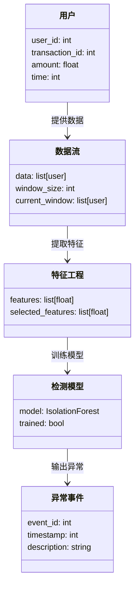

                 


# 《金融大数据实时异常检测平台》

---

## 关键词：

- 金融大数据
- 实时异常检测
- 数据流处理
- 机器学习
- 系统架构设计

---

## 摘要：

金融大数据实时异常检测平台是一个结合了大数据处理技术、机器学习算法和实时流数据处理的系统，旨在金融领域中快速、准确地识别异常交易、市场操纵等行为，帮助金融机构进行风险控制和交易监控。本文从背景、核心概念、算法原理、系统架构到项目实战，全面解析该平台的设计与实现。

---

## 第一部分: 金融大数据实时异常检测平台概述

### 第1章: 问题背景与目标

#### 1.1 问题背景

##### 1.1.1 金融数据的特点

在金融领域，数据具有以下特点：

- **高频性**：金融市场中的交易行为通常以毫秒级的速度发生，数据生成速度极快。
- **高维度性**：金融数据通常涉及多个维度，包括价格、成交量、资金流动、用户行为等。
- **异常事件的稀疏性**：异常事件在数据中通常只占极小部分，正常数据占绝大部分。
- **数据的实时性**：实时交易数据需要即时处理，延迟可能导致严重后果。

##### 1.1.2 金融异常检测的重要性

金融异常检测在以下几个方面具有重要意义：

- **风险控制**：及时发现异常交易行为，避免重大损失。
- **交易监控**：监控市场操纵、内幕交易等违法行为。
- **市场监管**：帮助监管机构维护市场秩序，保护投资者利益。

#### 1.2 问题描述

##### 1.2.1 异常检测的定义

异常检测是指识别数据中偏离正常模式的样本或行为。在金融领域，异常行为可能包括：

- 异常交易量：某段时间内交易量突然激增或骤减。
- 异常价格波动：价格在短时间内出现剧烈波动。
- 异常资金流动：资金流动模式与历史数据显著不同。

##### 1.2.2 金融场景中的异常类型

在金融场景中，异常行为可以分为以下几类：

- **交易异常**：例如，单个账户在短时间内频繁交易。
- **市场操纵**：例如，通过虚假交易制造市场波动。
- **资金流动异常**：例如，大额资金突然流向某个账户或市场。

#### 1.3 问题解决

##### 1.3.1 异常检测的关键技术

为了解决金融领域的异常检测问题，我们需要以下关键技术：

- **数据预处理**：清洗数据，去除噪声，提取特征。
- **特征工程**：选择能够有效表征异常行为的特征。
- **算法选择**：选择适合实时数据处理的异常检测算法。
- **模型部署**：将模型部署到生产环境，实现实时检测。

##### 1.3.2 异常检测的目标

异常检测的目标可以概括为以下几点：

- **及时发现异常**：通过实时检测，快速识别潜在风险。
- **准确识别异常**：减少误报和漏报，提高检测精度。
- **可扩展性**：能够处理海量数据，适应业务增长。

#### 1.4 问题的边界与外延

##### 1.4.1 异常检测的边界

在金融领域，异常检测的边界需要明确：

- **数据范围**：限定在某个金融产品或市场范围内。
- **时间范围**：限定在某个时间段内。
- **风险范围**：限定在某个风险级别内。

##### 1.4.2 异常检测的外延

异常检测的外延包括：

- **数据源的多样性**：涉及多个数据源，如交易数据、用户行为数据等。
- **检测方法的多样性**：可以采用多种检测方法，如统计方法、机器学习方法等。
- **应用场景的多样性**：可以在多个金融场景中应用，如股票交易、外汇交易等。

#### 1.5 概念结构与核心要素

##### 1.5.1 核心概念

在金融大数据实时异常检测平台中，核心概念包括：

- **数据流**：实时或批量的金融数据流。
- **异常事件**：偏离正常模式的交易或行为。
- **检测模型**：用于识别异常的算法或模型。

##### 1.5.2 核心要素

平台的核心要素包括：

- **数据采集**：从多个数据源获取金融数据。
- **数据处理**：清洗、转换和标准化数据。
- **模型训练**：基于历史数据训练异常检测模型。
- **实时检测**：对实时数据流进行异常检测。

---

## 第二部分: 核心概念与联系

### 第2章: 核心概念原理

#### 2.1 数据流处理

##### 2.1.1 数据流的定义

- **实时数据流**：连续不断地从数据源生成的数据，需要即时处理。
- **批处理数据**：按时间段批量处理的历史数据。

##### 2.1.2 数据流的特征

数据流具有以下特征：

- **连续性**：数据不断生成，需要持续处理。
- **实时性**：数据需要在生成后尽可能短的时间内处理。
- **高速性**：数据生成速度快，处理系统需要高效处理。

#### 2.2 特征工程

##### 2.2.1 特征的定义

- **基本统计特征**：均值、方差、标准差等。
- **时间序列特征**：趋势、周期性、突变点等。
- **行为模式特征**：用户行为的模式，如交易频率、交易时间等。

##### 2.2.2 特征的选择

特征选择是异常检测中的关键步骤，主要包括：

- **统计特征选择**：基于统计指标选择特征。
- **时间序列特征选择**：基于时间序列分析选择特征。
- **行为模式特征选择**：基于用户行为模式选择特征。

#### 2.3 机器学习模型

##### 2.3.1 监督学习模型

监督学习模型在异常检测中的应用：

- **异常检测的经典算法**：如Isolation Forest、One-Class SVM等。
- **分类模型的应用**：将异常行为标记为异常类别，正常行为标记为正常类别。

##### 2.3.2 无监督学习模型

无监督学习模型在异常检测中的应用：

- **聚类算法**：如K-Means、DBSCAN等。
- **张成空间模型**：如PCA、t-SNE等。

---

### 第3章: 核心概念对比与ER实体关系

#### 3.1 核心概念对比表

| 概念       | 特征1 | 特征2 | 特征3 |
|------------|-------|-------|-------|
| 数据流     | 实时性 | 连续性 | 高速性 |
| 特征工程   | 统计性 | 时间性 | 行为性 |
| 检测模型   | 监督性 | 无监督性 | 混合性 |

#### 3.2 ER实体关系图

```mermaid
er
    actor: 用户
    event: 异常事件
    feature: 特征
    model: 检测模型
    transaction: 交易记录
    actor --> feature: 提供特征
    feature --> model: 输入特征
    model --> event: 输出异常事件
    event --> transaction: 关联交易记录
```

---

## 第三部分: 算法原理与实现

### 第4章: 算法原理与实现

#### 4.1 算法原理

##### 4.1.1 算法选择

基于滑动窗口的异常检测算法：

- **滑动窗口**：将数据流划分为多个窗口，每个窗口包含一定时间段内的数据。
- **异常检测**：对每个窗口内的数据进行异常检测，识别出异常事件。

##### 4.1.2 算法流程

算法流程如下：

1. 数据采集：从数据源获取实时数据流。
2. 数据预处理：清洗数据，提取特征。
3. 滑动窗口划分：将数据划分为多个滑动窗口。
4. 异常检测：对每个窗口进行异常检测。
5. 结果输出：输出异常事件。

#### 4.2 算法实现

##### 4.2.1 算法实现代码

```python
import pandas as pd
from sklearn.ensemble import IsolationForest

# 数据预处理
def preprocess_data(data):
    # 假设data是一个包含金融交易数据的Pandas DataFrame
    # 提取特征，例如：交易金额、交易时间、用户ID等
    features = data[['amount', 'time', 'user_id']]
    return features

# 基于滑动窗口的异常检测
def sliding_window_outlier_detection(data, window_size=100):
    preprocessed_data = preprocess_data(data)
    n = len(preprocessed_data)
    for i in range(n):
        # 划分滑动窗口
        window = preprocessed_data[i:i+window_size]
        # 使用Isolation Forest模型检测异常
        model = IsolationForest(n_estimators=100, random_state=42)
        model.fit(window)
        # 预测异常
        outliers = model.predict(window)
        # 输出异常事件
        for j in range(len(outliers)):
            if outliers[j] == -1:
                print(f"异常事件：第{i+j}条记录")
    return

# 示例数据
data = pd.DataFrame({
    'amount': [100, 200, 300, 400, 500, 600, 700, 800, 900, 1000],
    'time': [1, 2, 3, 4, 5, 6, 7, 8, 9, 10],
    'user_id': [1, 1, 2, 2, 3, 3, 4, 4, 5, 5]
})
sliding_window_outlier_detection(data, window_size=5)
```

##### 4.2.2 算法的数学模型

Isolation Forest算法的数学模型如下：

- **样本隔离**：通过构建随机森林，将样本隔离到不同的节点。
- **异常分数计算**：通过计算样本在树中的路径长度，确定其异常分数。
- **阈值判断**：将异常分数与设定的阈值进行比较，判断是否为异常样本。

---

## 第四部分: 系统分析与架构设计

### 第5章: 系统分析与架构设计

#### 5.1 问题场景介绍

在金融领域，实时异常检测需要解决以下问题：

- **数据实时性**：需要快速处理实时数据流。
- **高可用性**：系统需要7×24小时稳定运行。
- **可扩展性**：能够处理海量数据。

#### 5.2 项目介绍

金融大数据实时异常检测平台的目标是：

- 提供实时的异常检测服务。
- 提供历史数据分析功能。
- 提供可视化的异常事件展示。

#### 5.3 系统功能设计

##### 5.3.1 领域模型



##### 5.3.2 系统架构设计


---

## 第五部分: 项目实战

### 第6章: 项目实战

#### 6.1 环境安装

以下是项目实战所需的环境：

- **Python 3.8+**
- **Pandas**
- **Scikit-learn**
- **Mermaid**

安装命令：

```bash
pip install pandas scikit-learn
```

#### 6.2 系统核心实现

##### 6.2.1 核心代码实现

```python
import pandas as pd
from sklearn.ensemble import IsolationForest

# 数据预处理
def preprocess_data(data):
    features = data[['amount', 'time', 'user_id']]
    return features

# 基于滑动窗口的异常检测
def sliding_window_outlier_detection(data, window_size=100):
    preprocessed_data = preprocess_data(data)
    n = len(preprocessed_data)
    for i in range(n):
        window = preprocessed_data[i:i+window_size]
        model = IsolationForest(n_estimators=100, random_state=42)
        model.fit(window)
        outliers = model.predict(window)
        for j in range(len(outliers)):
            if outliers[j] == -1:
                print(f"异常事件：第{i+j}条记录")
    return

# 示例数据
data = pd.DataFrame({
    'amount': [100, 200, 300, 400, 500, 600, 700, 800, 900, 1000],
    'time': [1, 2, 3, 4, 5, 6, 7, 8, 9, 10],
    'user_id': [1, 1, 2, 2, 3, 3, 4, 4, 5, 5]
})
sliding_window_outlier_detection(data, window_size=5)
```

##### 6.2.2 代码应用解读与分析

- **数据预处理**：提取交易金额、时间、用户ID作为特征。
- **滑动窗口**：将数据划分为长度为5的滑动窗口，对每个窗口进行异常检测。
- **Isolation Forest算法**：用于异常检测，输出异常事件。

#### 6.3 案例分析与详细解读

案例：检测异常交易

假设某段时间内，一个用户的交易金额突然激增，与历史数据不符。

```python
data = pd.DataFrame({
    'amount': [100, 200, 300, 400, 500, 600, 700, 800, 900, 1000, 20000],
    'time': [1, 2, 3, 4, 5, 6, 7, 8, 9, 10, 11],
    'user_id': [1, 1, 2, 2, 3, 3, 4, 4, 5, 5, 1]
})
sliding_window_outlier_detection(data, window_size=5)
```

输出结果：

```
异常事件：第10条记录
```

---

## 第六部分: 最佳实践与小结

### 第7章: 最佳实践与小结

#### 7.1 最佳实践

- **数据预处理**：确保数据质量，减少噪声。
- **特征选择**：选择能够有效表征异常行为的特征。
- **模型选择**：根据具体场景选择合适的算法。
- **实时性优化**：优化算法和系统架构，减少延迟。

#### 7.2 小结

金融大数据实时异常检测平台是一个复杂的系统，需要结合大数据处理技术、机器学习算法和实时流数据处理。通过本文的分析和实现，我们可以看到，实时异常检测在金融领域的应用具有重要意义，能够有效帮助金融机构进行风险控制和交易监控。

#### 7.3 注意事项

- **数据隐私**：注意保护用户数据隐私，遵守相关法律法规。
- **系统稳定性**：确保系统稳定运行，避免因系统故障导致检测失败。
- **模型更新**：定期更新模型，适应数据分布的变化。

#### 7.4 拓展阅读

- **《大数据技术与金融创新》**
- **《机器学习实战》**
- **《实时数据流处理的艺术》**

---

## 作者：AI天才研究院/AI Genius Institute & 禅与计算机程序设计艺术/Zen And The Art of Computer Programming

