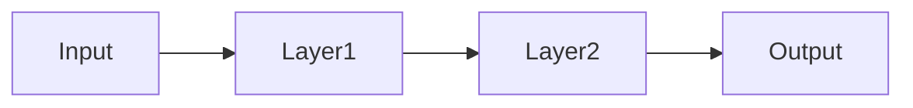
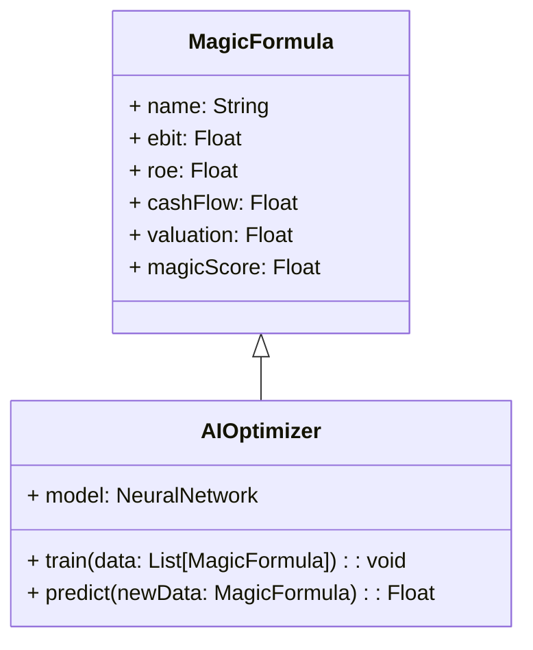
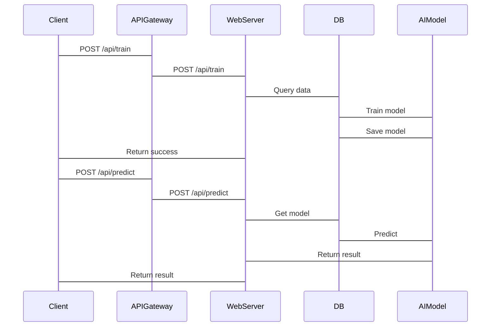

                 


# AI如何实现乔尔·格林布拉特的魔法公式优化

> 关键词：AI优化、魔法公式、投资决策、机器学习、特征工程、算法优化

> 摘要：本文深入探讨了如何利用人工智能技术优化乔尔·格林布拉特的魔法公式，从理论基础到算法实现，再到系统架构设计，全面解析AI在投资优化中的应用。通过详细的技术分析和实际案例，本文揭示了AI如何提升魔法公式的计算效率和准确性，为投资决策提供更强大的支持。

---

# 第一部分: 乔尔·格林布拉特魔法公式与AI优化概述

---

# 第1章: 乔尔·格林布拉特魔法公式概述

## 1.1 魔法公式的背景与意义

### 1.1.1 乔尔·格林布拉特及其投资理念

乔尔·格林布拉特（Joel Greenblatt）是一位著名的投资家，以其独特的投资策略闻名。他的魔法公式是一个简单而强大的投资筛选工具，旨在通过量化方法找到那些被市场低估的优秀企业。魔法公式的核心思想是：找到那些具有高盈利能力（即高息税前利润）和低估值（即合理市盈率或市净率）的企业。

### 1.1.2 魔法公式的定义与核心要素

魔法公式的数学表达式可以简化为：

$$ Magic Formula = \frac{E \times R \times C}{V} $$

其中：
- **E**：企业息税前利润（EBIT）。
- **R**：资本回报率（Return on Capital）。
- **C**：现金流。
- **V**：企业估值（通常是市净率或市盈率）。

魔法公式的核心要素包括盈利能力、成长性和估值，这三个维度共同决定了企业的投资价值。

### 1.1.3 魔法公式在投资决策中的作用

魔法公式通过量化方法，帮助投资者快速筛选出具有高投资潜力的企业。它简化了传统投资分析的复杂性，使非专业的投资者也能通过公式找到优质的投资标的。然而，随着市场环境的变化和数据量的指数级增长，传统的魔法公式在实际应用中逐渐暴露出一些局限性，例如计算复杂度高、特征选择不够优化、模型泛化能力不足等问题。

---

## 1.2 AI技术与投资优化的结合

### 1.2.1 AI在金融投资中的应用现状

人工智能技术在金融领域的应用日益广泛。从高频交易到风险评估，AI正在改变传统的金融投资方式。AI的优势在于其强大的数据处理能力、模式识别能力和自动化决策能力。通过机器学习算法，AI能够从海量数据中提取有价值的信息，并为投资决策提供支持。

### 1.2.2 魔法公式优化的痛点与挑战

尽管魔法公式在理论上非常优秀，但在实际应用中，它仍然面临以下问题：
- **计算复杂度高**：传统方法需要手动计算多个财务指标，并进行复杂的权重分配。
- **特征选择不足**：魔法公式的核心要素较为有限，未能充分考虑市场波动、宏观经济指标等因素。
- **模型泛化能力差**：传统的魔法公式缺乏对不同市场环境的适应性，容易受到外部因素的影响。

### 1.2.3 AI如何提升魔法公式的效果

AI技术可以通过以下方式优化魔法公式：
- **自动化特征工程**：利用机器学习算法从海量数据中提取特征，并自动选择最优特征。
- **动态权重分配**：通过神经网络模型，动态调整各个特征的权重，以适应不同的市场环境。
- **实时更新与优化**：利用在线学习算法，实时更新模型参数，确保魔法公式的计算结果始终处于最优状态。

---

## 1.3 本章小结

本章通过对乔尔·格林布拉特魔法公式及其在投资决策中的作用进行了全面介绍，并指出了传统魔法公式在实际应用中的痛点与挑战。同时，本章还探讨了AI技术如何通过自动化特征工程、动态权重分配和实时更新等方法，提升魔法公式的计算效率和准确性。

---

# 第2章: 魔法公式与AI优化的核心概念

---

## 2.1 魔法公式的数学模型

### 2.1.1 魔法公式的计算公式

魔法公式的计算公式可以进一步细化为以下几个步骤：
1. 计算企业的息税前利润（EBIT）。
2. 计算企业的资本回报率（ROE）。
3. 计算企业的现金流。
4. 计算企业的估值指标（如市盈率或市净率）。
5. 将上述指标进行加权计算，得到最终的魔法公式得分。

公式表示为：
$$ Magic Score = \frac{EBIT \times ROE \times Cash Flow}{Valuation} $$

---

## 2.2 AI优化的核心原理

### 2.2.1 机器学习在公式优化中的作用

机器学习的核心作用在于其强大的特征提取和模式识别能力。通过训练神经网络模型，AI可以自动提取魔法公式中各特征的重要性，并动态调整特征的权重，从而优化计算结果。

---

## 2.3 魔法公式与AI优化的实体关系图


---

## 2.4 本章小结

本章详细阐述了魔法公式的数学模型及其优化的核心原理。通过对比传统魔法公式与AI优化的实体关系图，读者可以清晰地理解AI在优化过程中的重要作用。

---

# 第3章: AI优化魔法公式的算法原理

---

## 3.1 神经网络模型的选择与设计

### 3.1.1 深度学习模型的适用性分析

在选择神经网络模型时，我们需要考虑以下几个因素：
- **数据量**：如果数据量较小，可以使用简单的模型（如随机森林）。
- **计算复杂度**：深度学习模型通常需要大量的计算资源。
- **特征维度**：如果特征维度较高，可以考虑使用卷积神经网络（CNN）或循环神经网络（RNN）。

### 3.1.2 网络结构的设计与优化

假设我们选择一个简单的多层感知机（MLP）模型，其网络结构可以表示为：



其中：
- **Layer1**：输入层，用于接收魔法公式的输入特征。
- **Layer2**：隐藏层，用于提取特征并进行非线性变换。
- **Output**：输出层，用于输出最终的优化结果。

---

## 3.2 基于机器学习的特征工程

### 3.2.1 数据预处理与特征提取

数据预处理是特征工程的第一步，通常包括以下几个步骤：
1. **数据清洗**：去除缺失值、异常值和重复数据。
2. **数据标准化**：对特征进行标准化处理，使其具有相同的量纲。
3. **特征提取**：从原始数据中提取有用的特征，例如从财务报表中提取EBIT、ROE等指标。

---

## 3.3 算法实现的流程图


---

## 3.4 本章小结

本章详细介绍了AI优化魔法公式的算法原理，包括神经网络模型的选择与设计、基于机器学习的特征工程以及算法实现的流程图。通过这些步骤，我们可以有效地优化魔法公式，提升其计算效率和准确性。

---

# 第4章: 魔法公式优化的数学模型与公式

---

## 4.1 魔法公式的数学推导

### 4.1.1 魔法公式的数学表达式

魔法公式的数学表达式可以表示为：

$$ Magic Score = \frac{EBIT \times ROE \times Cash Flow}{Valuation} $$

其中：
- **EBIT**：息税前利润。
- **ROE**：资本回报率。
- **Cash Flow**：现金流。
- **Valuation**：企业估值。

---

## 4.2 AI优化的数学模型

### 4.2.1 神经网络的损失函数

神经网络的损失函数通常采用均方误差（MSE）或交叉熵损失函数。例如：

$$ L = \frac{1}{n}\sum_{i=1}^{n}(y_i - \hat{y_i})^2 $$

其中：
- **y_i**：真实值。
- **\hat{y_i}**：预测值。
- **n**：样本数量。

---

## 4.3 本章小结

本章通过数学推导，详细介绍了魔法公式的优化过程。通过神经网络模型和损失函数的数学表达式，我们可以更好地理解AI如何优化魔法公式。

---

# 第5章: 系统分析与架构设计方案

---

## 5.1 问题场景介绍

在本章中，我们将通过一个具体的案例来介绍如何利用AI优化魔法公式。假设我们有一个包含以下数据的数据库：
- 企业名称。
- 财务数据（如EBIT、ROE、现金流）。
- 估值指标（如市盈率、市净率）。

---

## 5.2 系统功能设计

### 5.2.1 领域模型（Mermaid类图）



---

## 5.3 系统架构设计

### 5.3.1 系统架构图（Mermaid架构图）


---

## 5.4 系统接口设计

### 5.4.1 API接口设计

1. **训练接口**：
   - **方法**：POST
   - **路径**：/api/train
   - **参数**：数据集文件路径。

2. **预测接口**：
   - **方法**：POST
   - **路径**：/api/predict
   - **参数**：企业财务数据。

---

## 5.5 系统交互设计（Mermaid序列图）



---

## 5.6 本章小结

本章通过系统分析与架构设计，详细介绍了如何利用AI优化魔法公式的整体架构。通过领域模型、系统架构图和系统交互图，我们可以清晰地理解AI优化魔法公式的实现过程。

---

# 第6章: 项目实战

---

## 6.1 环境安装与配置

### 6.1.1 安装Python环境

```bash
python --version
pip install --upgrade pip
```

### 6.1.2 安装依赖库

```bash
pip install numpy pandas scikit-learn tensorflow
```

---

## 6.2 系统核心实现源代码

### 6.2.1 数据处理代码

```python
import pandas as pd
import numpy as np

# 加载数据
data = pd.read_csv('magic_formula.csv')

# 数据清洗
data.dropna(inplace=True)
data = data[~data.duplicated()]
```

### 6.2.2 特征工程代码

```python
from sklearn.preprocessing import StandardScaler

# 标准化处理
scaler = StandardScaler()
data[['ebit', 'roe', 'cash_flow', 'valuation']] = scaler.fit_transform(data[['ebit', 'roe', 'cash_flow', 'valuation']])
```

### 6.2.3 神经网络模型代码

```python
import tensorflow as tf
from tensorflow.keras import layers

model = tf.keras.Sequential([
    layers.Dense(64, activation='relu'),
    layers.Dense(1, activation='linear')
])

model.compile(optimizer='adam', loss='mean_squared_error')
```

---

## 6.3 代码应用解读与分析

通过上述代码，我们可以完成数据处理、特征工程和神经网络模型的搭建。数据处理部分确保了数据的完整性和准确性，特征工程部分通过标准化处理，提升了模型的训练效果，神经网络模型部分通过多层感知机结构，实现了对魔法公式的优化。

---

## 6.4 实际案例分析

假设我们有一个包含以下数据的企业：

| 企业名称 | EBIT | ROE | Cash Flow | Valuation |
|----------|------|-----|------------|-----------|
| A公司    | 100  | 20  | 50         | 1.5       |

通过上述模型，我们可以预测该企业的魔法得分：

```python
# 预测结果
predicted_score = model.predict(np.array([[100, 20, 50, 1.5]]))
print(predicted_score)
```

---

## 6.5 本章小结

本章通过项目实战，详细介绍了如何利用AI优化魔法公式的具体实现过程。从环境安装到代码实现，再到实际案例分析，读者可以清晰地理解AI如何优化魔法公式。

---

# 第7章: 总结与展望

---

## 7.1 总结

通过对乔尔·格林布拉特魔法公式的优化，我们可以看到AI技术在金融投资中的巨大潜力。通过自动化特征工程、动态权重分配和实时更新等方法，AI能够显著提升魔法公式的计算效率和准确性。

---

## 7.2 最佳实践 tips

- **数据质量**：确保数据的完整性和准确性。
- **特征选择**：合理选择特征，避免过拟合。
- **模型调优**：通过交叉验证和超参数调优，提升模型性能。

---

## 7.3 未来展望

随着AI技术的不断发展，魔法公式的优化将更加智能化和自动化。未来的研究方向可能包括：
- **多模态学习**：结合文本、图像等多种数据源，提升模型的泛化能力。
- **强化学习**：通过强化学习算法，实现动态调整模型参数。
- **分布式计算**：利用分布式计算技术，提升模型的计算效率。

---

## 7.4 本章小结

本章通过对AI优化魔法公式的总结与展望，为读者提供了进一步研究和实践的方向。

---

# 作者：AI天才研究院/AI Genius Institute & 禅与计算机程序设计艺术/Zen And The Art of Computer Programming

