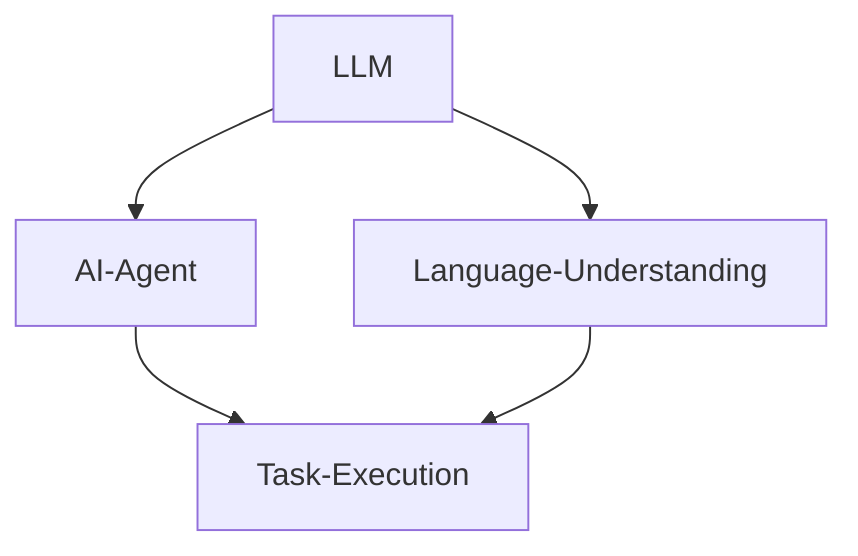
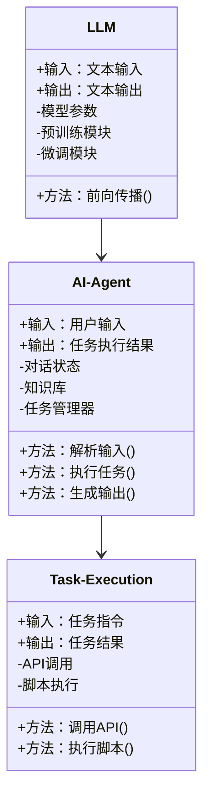
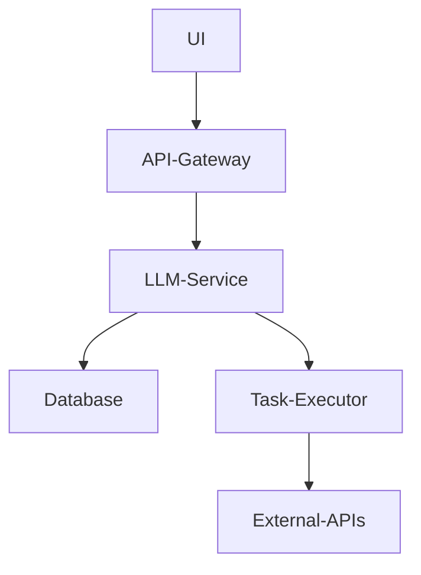
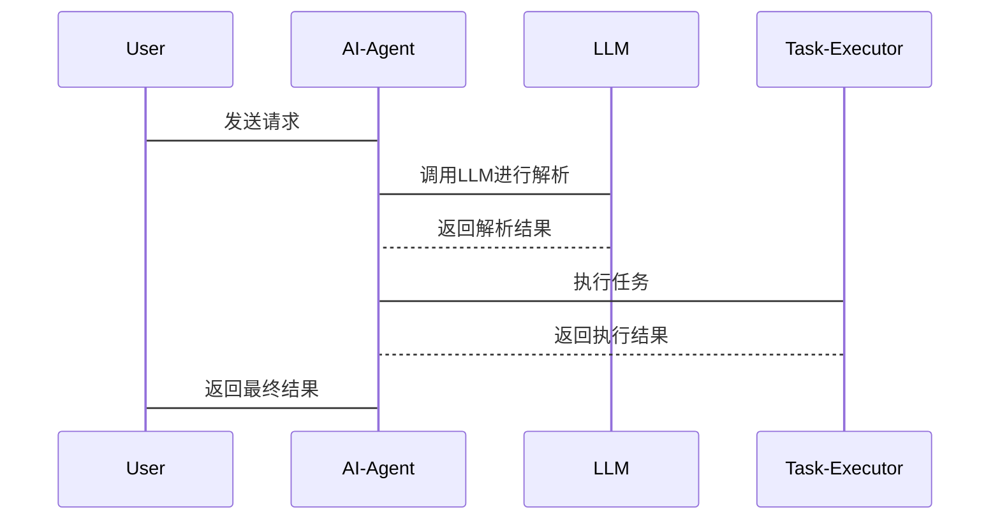

                 


# LLM在AI Agent语言理解深度上的提升

## 关键词
- 大语言模型（LLM）
- AI Agent
- 语言理解
- 系统架构
- 项目实战
- 最佳实践

## 摘要
本文深入探讨了大语言模型（LLM）在AI Agent语言理解能力提升中的应用。从理论基础、算法原理、系统架构到项目实战，系统性地分析了如何通过LLM优化AI Agent的语言理解能力。文章首先介绍了LLM和AI Agent的基本概念，然后深入分析了LLM的核心算法原理及其在AI Agent中的具体应用。接着，通过系统架构设计和项目实战，展示了如何将LLM集成到AI Agent中，实现语言理解能力的深度提升。最后，结合实际案例，总结了最佳实践经验和未来研究方向。

---

# 第1章: LLM与AI Agent概述

## 1.1 什么是LLM
### 1.1.1 大语言模型的定义
大语言模型（Large Language Model，LLM）是一种基于深度学习的自然语言处理模型，通常基于Transformer架构，通过大量真实文本数据进行预训练，能够理解和生成人类语言。LLM的核心目标是通过大规模数据训练，掌握语言的语义、语法和上下文关系，从而实现类似人类的语言理解和生成能力。

### 1.1.2 LLM的核心特点
- **大规模训练数据**：通常基于数百万甚至数十亿的文本数据进行训练。
- **深度学习架构**：主要基于Transformer模型，具有自注意力机制（Self-attention）。
- **多任务能力**：经过预训练后，可以通过微调（Fine-tuning）完成多种NLP任务，如文本生成、问答系统、文本分类等。
- **上下文理解**：能够通过自注意力机制捕捉上下文信息，理解语言的语义和意图。

### 1.1.3 LLM与传统NLP模型的区别
| 特性 | 传统NLP模型 | LLM |
|------|--------------|------|
| 模型结构 | 基于RNN或CNN | 基于Transformer |
| 训练数据 | 数据量较小，任务导向 | 数据量极大，通用导向 |
| 任务处理 | 单任务为主 | 多任务能力突出 |

## 1.2 什么是AI Agent
### 1.2.1 AI Agent的定义
AI Agent（人工智能代理）是指能够感知环境、执行任务、与用户交互的智能系统。AI Agent的核心目标是通过理解和执行用户的指令，完成特定任务，提供智能化的服务。

### 1.2.2 AI Agent的核心功能
- **感知能力**：通过输入（如文本、语音、图像）理解用户的需求和意图。
- **推理能力**：根据输入信息进行逻辑推理，生成解决方案。
- **执行能力**：根据推理结果执行具体任务，如调用API、操作数据库等。
- **交互能力**：通过自然语言与用户进行多轮对话，提供交互式服务。

### 1.2.3 AI Agent的应用场景
- **智能客服**：通过自然语言处理技术，为用户提供自动化服务。
- **智能助手**：帮助用户完成日常任务，如日程管理、信息查询等。
- **智能推荐**：根据用户需求推荐相关内容或服务。
- **智能对话系统**：实现复杂对话任务，如教育、医疗等领域的专业对话。

## 1.3 LLM在AI Agent中的作用
### 1.3.1 LLM如何提升AI Agent的语言理解能力
- **语义理解**：LLM通过预训练掌握了丰富的语义知识，能够准确理解用户的意图。
- **上下文感知**：通过自注意力机制，LLM能够捕捉对话中的上下文信息，实现更自然的多轮对话。
- **多任务能力**：LLM可以同时支持多种NLP任务，如问答、文本生成、实体识别等，为AI Agent提供全面的语言处理能力。

### 1.3.2 LLM在AI Agent中的应用场景
- **智能客服**：通过LLM实现自动问答、意图识别和问题分类。
- **智能助手**：利用LLM进行日程管理、信息查询和任务提醒。
- **智能对话系统**：结合LLM的生成能力，实现更复杂的对话任务，如专业咨询、多轮对话等。

### 1.3.3 LLM与AI Agent结合的必要性
- **提升用户体验**：通过LLM的深度语义理解，AI Agent能够更准确地理解用户需求，提供更智能的服务。
- **降低开发成本**：LLM的通用性和多任务能力，减少了AI Agent的定制化开发需求。
- **提升系统性能**：通过LLM的强大语言处理能力，AI Agent可以更高效地完成复杂任务。

## 1.4 本章小结
本章介绍了大语言模型（LLM）和AI Agent的基本概念，分析了LLM在AI Agent中的作用和应用场景。通过对比LLM与传统NLP模型的差异，阐述了LLM在AI Agent语言理解能力提升中的独特优势。

---

## 第2章: LLM与AI Agent的核心概念

## 2.1 LLM的训练原理
### 2.1.1 基于Transformer的模型结构
Transformer模型由编码器（Encoder）和解码器（Decoder）组成。编码器负责将输入序列转换为上下文向量，解码器则根据编码器输出生成目标序列。

- **编码器**：通过自注意力机制（Self-attention）捕捉输入序列中的长距离依赖关系，生成上下文向量。
- **解码器**：在解码过程中，通过自注意力机制生成目标序列，同时通过交叉注意力（Cross-attention）利用编码器输出的上下文信息。

### 2.1.2 预训练任务与目标函数
- **预训练任务**：通常采用Masked Language Model（遮蔽语言模型）任务，即随机遮蔽输入序列中的部分词，通过预测这些词来学习语言表示。
- **目标函数**：交叉熵损失函数（Cross-entropy Loss），用于衡量模型预测结果与真实结果之间的差异。

$$ \text{损失} = -\sum_{i=1}^{n} \log P(y_i|x_{\text{条件}}) $$

### 2.1.3 模型的可扩展性与适应性
- **可扩展性**：通过增加模型层数和参数量，可以提升模型的表达能力。
- **适应性**：通过微调（Fine-tuning）和提示工程（Prompt Engineering），可以将LLM应用于不同任务和领域。

## 2.2 AI Agent的交互机制
### 2.2.1 多轮对话的实现原理
AI Agent通过与用户进行多轮对话，逐步理解用户需求并提供服务。多轮对话的核心是对话状态管理（Dialogue State Management），包括对话历史、用户意图和系统状态。

### 2.2.2 任务分解与执行流程
- **任务分解**：将复杂任务分解为多个子任务，逐步执行。
- **执行流程**：根据任务分解结果，调用相应的API或执行脚本完成任务。

### 2.2.3 知识库的构建与管理
AI Agent需要依赖知识库（Knowledge Base）来完成特定任务。知识库可以是结构化的数据库，也可以是非结构化的文本库。

## 2.3 LLM与AI Agent的结合模型
### 2.3.1 模型融合的实现方式
- **端到端模型**：将LLM与AI Agent的交互逻辑整合到一个模型中，实现端到端的对话生成。
- **分阶段模型**：先通过LLM理解用户需求，再通过AI Agent执行任务。

### 2.3.2 深度语言理解的实现路径
- **上下文感知**：通过LLM的自注意力机制，捕捉对话中的上下文信息。
- **意图识别**：通过LLM的语义理解能力，准确识别用户的意图。
- **多轮对话管理**：通过对话状态管理，实现自然的多轮对话。

### 2.3.3 模型优化与调优策略
- **数据增强**：通过数据增强技术，增加训练数据的多样性。
- **微调优化**：在特定任务上对LLM进行微调，提升模型的性能。
- **提示工程**：通过设计有效的提示（Prompt），引导模型生成符合要求的输出。

## 2.4 核心概念对比表格
| 概念 | LLM | AI Agent |
|------|------|----------|
| 核心功能 | 语言生成与理解 | 任务执行与交互 |
| 输入输出 | 文本 | 文本+任务 |
| 优势 | 强大的语言理解能力 | 多任务执行能力 |

## 2.5 ER实体关系图


## 2.6 本章小结
本章详细分析了LLM和AI Agent的核心概念，探讨了LLM在AI Agent中的应用路径和优化策略。通过对比分析，明确了LLM与AI Agent在功能和优势上的差异，为后续的系统架构设计和项目实战奠定了理论基础。

---

## 第3章: LLM的算法原理与数学模型

## 3.1 基于Transformer的模型结构
### 3.1.1 Transformer的编码器与解码器
- **编码器**：由多个编码层（Encoder Layer）堆叠而成，每个编码层包括多头自注意力（Multi-Head Self-Attention）和前馈网络（Feed-Forward Network）。
- **解码器**：由多个解码层（Decoder Layer）堆叠而成，每个解码层包括多头自注意力和交叉注意力（Cross-Attention）。

### 3.1.2 Self-attention机制
Self-attention机制通过计算输入序列中每个词与其他词的相关性，生成注意力权重，从而捕捉序列中的长距离依赖关系。

$$ \text{Attention}(Q, K, V) = \text{softmax}\left(\frac{QK^T}{\sqrt{d_k}}\right)V $$

### 3.1.3 前馈神经网络层
前馈神经网络层通过参数化的线性变换和非线性激活函数，对输入向量进行非线性变换。

$$ \text{FFN}(x) = \text{ReLU}(W_1x + b_1)W_2 + b_2 $$

## 3.2 LLM的训练过程
### 3.2.1 预训练任务与目标函数
- **预训练任务**：Masked Language Model（遮蔽语言模型）。
- **目标函数**：交叉熵损失函数。

### 3.2.2 交叉熵损失函数
交叉熵损失函数用于衡量模型预测结果与真实结果之间的差异。

$$ \text{损失} = -\sum_{i=1}^{n} \log P(y_i|x_{\text{条件}}) $$

### 3.2.3 梯度下降优化
梯度下降优化用于更新模型参数，最小化损失函数。

$$ \theta = \theta - \eta \frac{\partial L}{\partial \theta} $$

## 3.3 算法实现步骤
### 3.3.1 环境安装
```bash
pip install torch transformers
```

### 3.3.2 核心代码实现
```python
import torch
import torch.nn as nn
import torch.nn.functional as F

class Transformer(nn.Module):
    def __init__(self, d_model, nhead, dropout=0.1):
        super().__init__()
        self.encoder = nn.TransformerEncoder(
            nn.TransformerEncoderLayer(d_model=d_model, nhead=nhead, dropout=dropout),
            num_layers=6
        )
        self.decoder = nn.TransformerDecoder(
            nn.TransformerDecoderLayer(d_model=d_model, nhead=nhead, dropout=dropout),
            num_layers=6
        )

    def forward(self, src, tgt):
        enc_out = self.encoder(src)
        dec_out = self.decoder(tgt, enc_out)
        return dec_out
```

### 3.3.3 模型训练与推理
```python
# 训练过程
optimizer = torch.optim.Adam(model.parameters(), lr=1e-4)
criterion = nn.CrossEntropyLoss()

for epoch in range(num_epochs):
    for batch in dataloader:
        inputs, targets = batch
        outputs = model(inputs, targets)
        loss = criterion(outputs, targets)
        optimizer.zero_grad()
        loss.backward()
        optimizer.step()

# 推理过程
with torch.no_grad():
    inputs = torch.tensor([[1, 2, 3]])
    outputs = model(inputs, targets)
    print(outputs)
```

## 3.4 本章小结
本章详细探讨了LLM的算法原理和数学模型，通过代码实现展示了模型的训练和推理过程。通过对Self-attention机制和Transformer架构的分析，明确了LLM的核心算法实现路径。

---

## 第4章: 系统架构设计与实现

## 4.1 问题场景介绍
AI Agent需要与用户进行自然语言交互，理解用户意图并执行任务。为了实现这一目标，需要设计一个高效的系统架构，将LLM与AI Agent的功能模块有机结合。

## 4.2 项目介绍
本项目旨在通过集成大语言模型（LLM）提升AI Agent的语言理解能力，实现更智能的交互体验。项目包括以下几个部分：
- **模型训练**：基于Transformer架构训练大语言模型。
- **系统设计**：设计AI Agent的系统架构，集成LLM模块。
- **功能实现**：实现对话管理、任务执行等功能。

## 4.3 系统功能设计
### 4.3.1 领域模型（领域模型图）


### 4.3.2 系统架构设计


### 4.3.3 系统接口设计
- **输入接口**：用户输入（文本）。
- **输出接口**：生成文本或任务结果。
- **内部接口**：LLM与AI Agent之间的交互接口。

### 4.3.4 系统交互流程


## 4.4 本章小结
本章通过系统架构设计，展示了如何将LLM集成到AI Agent中。通过领域模型图和系统架构图，明确了各模块之间的关系和交互流程。系统设计部分为后续的项目实战奠定了基础。

---

## 第5章: 项目实战与案例分析

## 5.1 环境安装与配置
```bash
pip install torch transformers
```

## 5.2 核心代码实现
### 5.2.1 LLM模块实现
```python
import torch
from transformers import AutoTokenizer, AutoModelForCausalLM

tokenizer = AutoTokenizer.from_pretrained("gpt2")
model = AutoModelForCausalLM.from_pretrained("gpt2")
```

### 5.2.2 AI Agent模块实现
```python
class AI-Agent:
    def __init__(self):
        self.llm = LLM()
        self.task_manager = TaskManager()
    
    def process_request(self, input_text):
        intent = self.llm.parse_intent(input_text)
        response = self.llm.generate_response(input_text)
        return response
```

### 5.2.3 任务执行模块实现
```python
class TaskManager:
    def __init__(self):
        pass
    
    def execute_task(self, task):
        pass
```

## 5.3 代码应用解读与分析
- **LLM模块**：通过调用大语言模型，实现文本生成和语义理解。
- **AI Agent模块**：通过LLM模块解析用户输入，生成自然语言输出。
- **任务执行模块**：根据解析结果，调用API或执行脚本完成任务。

## 5.4 实际案例分析
### 5.4.1 案例背景
以智能客服系统为例，用户向AI Agent提出一个问题，AI Agent通过LLM模块理解用户意图，调用知识库提供答案。

### 5.4.2 案例实现
```python
# 用户输入
input_text = "如何重置我的密码？"

# AI Agent处理
agent = AI-Agent()
response = agent.process_request(input_text)
print(response)
```

## 5.5 本章小结
本章通过项目实战，展示了如何将LLM集成到AI Agent中。通过具体代码实现和案例分析，明确了系统设计和实现的具体步骤。

---

## 第6章: 总结与展望

## 6.1 总结
本文深入探讨了大语言模型（LLM）在AI Agent语言理解能力提升中的应用。从理论基础、算法原理到系统架构和项目实战，系统性地分析了如何通过LLM优化AI Agent的语言理解能力。通过对比分析和案例研究，明确了LLM在AI Agent中的核心作用和应用价值。

## 6.2 最佳实践 tips
- **数据质量**：确保训练数据的多样性和质量，避免偏见。
- **模型调优**：根据具体任务需求，对LLM进行微调和优化。
- **系统设计**：在系统设计阶段，充分考虑模块之间的交互和协作。
- **用户体验**：通过多轮对话管理和上下文感知，提升用户体验。

## 6.3 小结
本章总结了文章的主要观点，并提出了未来的研究方向和优化建议。通过不断优化LLM和AI Agent的结合方式，可以进一步提升系统的语言理解能力和任务执行效率。

## 6.4 注意事项
- **数据隐私**：在实际应用中，需要注意数据隐私和安全问题。
- **模型性能**：在资源受限的情况下，需要权衡模型的性能和计算资源。

## 6.5 拓展阅读
- **推荐书籍**：《Deep Learning》、《Effective Python》
- **推荐论文**：《Attention Is All You Need》、《BERT: Pre-training of Deep Bidirectional Transformers for NLP》

---

## 作者信息
作者：AI天才研究院/AI Genius Institute  
联系邮箱：contact@ai-genius.org  

---

本文通过系统性地分析和探讨，详细阐述了LLM在AI Agent语言理解能力提升中的应用。从理论到实践，为读者提供了一个全面的视角，帮助读者深入理解LLM与AI Agent的结合方式和优化策略。希望本文能够为相关领域的研究和实践提供有价值的参考和启发。

