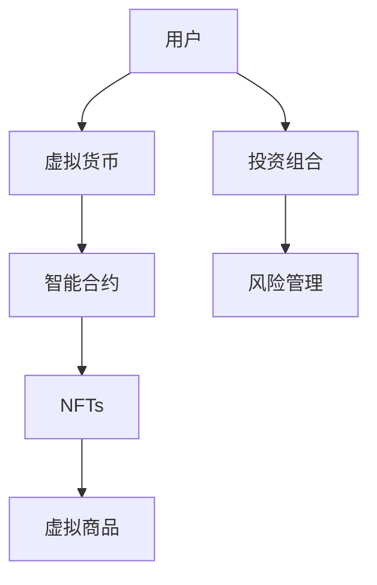
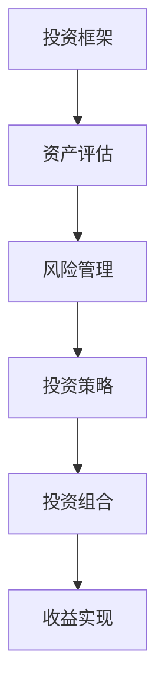
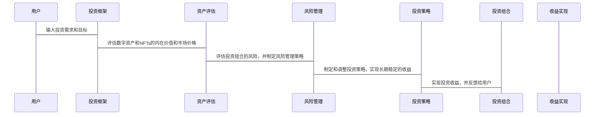

                 


# 巴菲特的价值投资在元宇宙经济中的应用

> **关键词**: 巴菲特, 价值投资, 元宇宙, 经济模型, 数字资产, 投资策略

> **摘要**: 本文探讨了巴菲特的价值投资理念在元宇宙经济中的应用，分析了元宇宙经济的基本概念、资产类型、评估方法和风险管理策略。通过实际案例分析和数学模型的构建，本文详细阐述了如何将价值投资的原则应用于元宇宙经济中，以实现长期稳定的收益。文章还提供了系统架构设计和投资框架，为投资者提供了实用的指导。

---

## 第1章 巴菲特价值投资的核心理念

### 1.1 巴菲特投资哲学概述

#### 1.1.1 价值投资的定义与核心原则
- **价值投资**：通过深入分析企业的基本面，寻找那些市场价格低于其内在价值的股票进行投资。核心原则包括注重内在价值、长期投资、安全边际和集中投资。
- **核心原则**：
  1. 买入并持有优质资产。
  2. 专注于企业的基本面，而非短期市场波动。
  3. 寻找具有强大护城河和竞争优势的企业。
  4. 保持投资组合的分散化以降低风险。

#### 1.1.2 巴菲特投资成功的关键因素
- **关键因素**：
  1. **长期视角**：巴菲特强调长期投资，而非短期交易。
  2. **基本面分析**：深入研究企业的财务状况、管理层和行业地位。
  3. **安全边际**：确保买入价格低于内在价值，以降低投资风险。
  4. **集中投资**：将资金集中在少数优质资产上，以提高收益。

#### 1.1.3 价值投资在现代经济中的应用
- **现代经济中的应用**：
  - 在传统金融市场的应用：如股票、债券等。
  - 在新兴领域的应用：如科技初创公司、加密货币等。
  - 在数字资产中的潜力：如NFTs、元宇宙经济中的虚拟货币。

### 1.2 元宇宙经济的基本概念

#### 1.2.1 元宇宙的定义与特征
- **元宇宙的定义**：元宇宙是一个虚拟的三维空间，用户可以在其中进行社交、交易、创造内容等。它是一个去中心化的、持续运行的虚拟生态系统。
- **元宇宙的特征**：
  1. 去中心化：基于区块链技术，没有中央控制机构。
  2. 持续性：元宇宙是一个持续运行的虚拟世界，不受现实世界的时间限制。
  3. 可编程性：通过智能合约实现自动化的交易和交互。
  4. 虚拟资产：包括虚拟货币、NFTs等。

#### 1.2.2 元宇宙经济体系的构成
- **经济体系的构成**：
  1. **虚拟货币**：如比特币、以太坊等，用于元宇宙内的交易。
  2. **NFTs**：非同质化代币，用于表示虚拟资产的所有权。
  3. **虚拟商品**：如虚拟土地、虚拟物品等，具有一定的经济价值。
  4. **智能合约**：用于自动执行交易和协议，确保经济体系的透明性和安全性。

#### 1.2.3 元宇宙经济与传统经济的对比
- **对比分析**：
  1. **市场结构**：元宇宙经济是去中心化的，而传统经济是中心化的。
  2. **交易方式**：元宇宙经济基于区块链技术，交易透明且不可篡改，而传统经济依赖于中介机构。
  3. **资产类型**：元宇宙经济中的资产主要是虚拟货币和NFTs，而传统经济中的资产包括实物资产和金融资产。

### 1.3 巴菲特价值投资与元宇宙经济的结合

#### 1.3.1 价值投资在数字资产中的应用
- **数字资产**：如比特币、以太坊等，具有较高的流动性和全球性。
- **价值投资的应用**：
  - 选择具有强大技术支撑和广泛应用场景的数字资产。
  - 关注项目的团队背景、技术实现和社区支持。
  - 评估项目的长期发展潜力。

#### 1.3.2 元宇宙经济中的投资机会
- **投资机会**：
  1. **虚拟货币**：如用于元宇宙内交易的稳定币。
  2. **NFTs**：用于表示虚拟资产的所有权，具有较高的收藏价值和投资价值。
  3. **虚拟商品**：如虚拟土地、虚拟物品等，具有一定的经济价值和升值潜力。

#### 1.3.3 价值投资在元宇宙经济中的潜力
- **潜力分析**：
  - 元宇宙经济的市场规模巨大，具有广阔的发展前景。
  - 数字资产和NFTs的市场需求持续增长，为价值投资提供了丰富的标的。
  - 元宇宙经济的去中心化特性，使得投资者可以更加自由地选择和管理自己的资产。

---

## 第2章 元宇宙经济中的资产评估与定价

### 2.1 元宇宙经济中的主要资产类型

#### 2.1.1 数字货币与代币
- **数字货币**：如比特币、以太坊等，用于元宇宙内的交易和支付。
- **代币**：代表特定项目或服务的权益，如治理代币、收益代币等。

#### 2.1.2 NFTs（非同质化代币）
- **NFTs的定义**：NFTs是基于区块链技术的非同质化代币，用于表示独特的虚拟资产。
- **NFTs的特征**：
  1. 不可分割：每个NFT都是唯一的，不可分割。
  2. 不可替代：NFTs具有独特的属性，无法被其他资产替代。
  3. 可验证性：通过区块链技术可以验证NFTs的真伪和所有权。

#### 2.1.3 元宇宙中的虚拟商品与服务
- **虚拟商品**：如虚拟土地、虚拟物品等，具有一定的经济价值。
- **虚拟服务**：如虚拟社交、虚拟娱乐等，通过NFTs或代币进行支付。

### 2.2 巴菲特价值投资中的资产评估方法

#### 2.2.1 资产的内在价值评估
- **内在价值的定义**：资产的内在价值是指其未来现金流的现值。
- **评估方法**：
  1. 现金流折现法：通过预测未来现金流并将其折现，计算资产的内在价值。
  2. 市盈率法：通过比较资产的市盈率与行业平均水平，判断其估值是否合理。

#### 2.2.2 市场情绪与资产价格的关系
- **市场情绪的影响**：市场情绪会影响资产的价格，但长期来看，资产价格会回归其内在价值。
- **市场情绪的分析**：
  1. 投资者情绪：如贪婪和恐惧情绪。
  2. 市场趋势：如价格波动、交易量等。

#### 2.2.3 资产的长期价值与短期波动
- **长期价值**：资产的长期价值取决于其基本面，如盈利能力、成长潜力等。
- **短期波动**：资产价格的短期波动受到市场情绪和外部环境的影响，但长期来看，价格会回归其内在价值。

### 2.3 元宇宙经济中的资产定价模型

#### 2.3.1 基于供需关系的定价
- **供需关系**：资产价格由市场供需关系决定。
- **模型分析**：
  1. 需求曲线：随着价格下降，需求量增加。
  2. 供给曲线：随着价格上升，供给量增加。

#### 2.3.2 基于项目基本面的定价
- **项目基本面**：包括团队背景、技术实现、用户基础、商业模式等。
- **模型分析**：
  1. 项目团队：强大的团队背景和丰富的经验可以提高项目的成功概率。
  2. 技术实现：先进的技术实现和良好的架构设计可以提高项目的可持续性和扩展性。
  3. 用户基础：庞大的用户基础可以提高项目的市场影响力和资产价值。

#### 2.3.3 基于用户行为的定价
- **用户行为**：用户的交易行为和互动行为可以影响资产的价格。
- **模型分析**：
  1. 交易量：资产的交易量可以反映市场的活跃度和资产的流动性。
  2. 用户参与度：用户的积极参与可以提高资产的价值和市场影响力。

---

## 第3章 元宇宙经济中的风险管理与投资策略

### 3.1 巴菲特价值投资中的风险管理

#### 3.1.1 风险的定义与分类
- **风险的定义**：投资过程中可能遇到的不确定性和损失。
- **风险的分类**：
  1. 系统性风险：影响整个市场的风险，如市场波动、经济衰退等。
  2. 非系统性风险：影响特定资产或项目的风险，如项目失败、管理不当等。

#### 3.1.2 巴菲特风险管理的核心原则
- **核心原则**：
  1. **分散投资**：通过分散投资降低非系统性风险。
  2. **长期视角**：关注长期价值，避免短期波动的影响。
  3. **安全边际**：确保买入价格低于内在价值，以降低投资风险。
  4. **持续学习**：保持对市场的敏感性和对新知识的学习。

#### 3.1.3 风险控制在投资决策中的作用
- **风险控制的作用**：
  1. 降低投资损失：通过分散投资和风险控制，降低投资组合的波动性。
  2. 提高投资收益：通过识别和规避高风险项目，提高投资收益。
  3. 增强投资者信心：通过有效的风险管理，增强投资者对市场的信心。

### 3.2 元宇宙经济中的投资风险

#### 3.2.1 技术风险
- **技术风险**：如区块链技术的不稳定、智能合约的安全性问题等。
- **应对策略**：
  1. 关注项目的技术实现和团队背景。
  2. 选择技术成熟且有良好社区支持的项目。

#### 3.2.2 市场风险
- **市场风险**：如市场价格的波动、市场参与者的理性行为等。
- **应对策略**：
  1. 保持长期视角，避免短期波动的影响。
  2. 通过分散投资降低市场风险。

#### 3.2.3 法律与政策风险
- **法律与政策风险**：如政策监管、法律法规的不确定性等。
- **应对策略**：
  1. 关注政策变化和法律法规的动态。
  2. 选择合规且有良好法律支持的项目。

### 3.3 巴菲特价值投资在元宇宙经济中的策略应用

#### 3.3.1 长期投资策略
- **长期投资策略**：
  - 选择具有长期发展潜力的项目。
  - 关注项目的基本面和技术实现。
  - 保持长期持有的耐心和信心。

#### 3.3.2 价值发现策略
- **价值发现策略**：
  - 深入分析项目的内在价值。
  - 识别市场价格低于内在价值的项目。
  - 选择具有安全边际的项目。

#### 3.3.3 风险分散策略
- **风险分散策略**：
  - 通过分散投资降低非系统性风险。
  - 选择不同类型的资产进行配置。
  - 关注不同项目的风险特征和市场表现。

---

## 第4章 元宇宙经济中的投资案例分析

### 4.1 元宇宙经济中的经典投资案例

#### 4.1.1 某知名元宇宙项目的价值评估
- **项目背景**：如Decentraland或The Sandbox，这些项目在元宇宙经济中具有较高的知名度和市场影响力。
- **价值评估**：
  1. **内在价值**：分析项目的财务状况、团队背景和市场前景。
  2. **市场价格**：比较市场价格与内在价值的差异，判断是否存在投资机会。
  3. **市场风险**：评估项目的市场风险和政策风险，制定相应的风险管理策略。

#### 4.1.2 投资者如何通过价值投资获利
- **投资策略**：
  1. **选择优质项目**：通过基本面分析和内在价值评估，选择具有长期发展潜力的项目。
  2. **分散投资**：通过分散投资降低风险，提高投资组合的稳定性。
  3. **长期持有**：保持长期视角，避免短期波动的影响，实现长期稳定的收益。

#### 4.1.3 案例分析的启示
- **启示**：
  1. **价值投资的核心**：通过基本面分析和内在价值评估，选择具有长期发展潜力的项目。
  2. **风险管理的重要性**：通过分散投资和风险控制，降低投资风险，提高投资收益。
  3. **长期视角的应用**：保持长期视角，关注项目的长期发展潜力，避免短期波动的影响。

### 4.2 巴菲特价值投资在元宇宙中的实际应用

#### 4.2.1 如何识别优质项目
- **识别优质项目的标准**：
  1. **团队背景**：选择具有丰富经验和良好声誉的团队。
  2. **技术实现**：选择技术成熟且有良好架构设计的项目。
  3. **用户基础**：选择具有庞大用户基础和良好市场前景的项目。

#### 4.2.2 如何进行资产配置
- **资产配置的策略**：
  1. **分散投资**：选择不同类型的资产进行配置，降低投资风险。
  2. **集中投资**：将资金集中在少数优质项目上，提高投资收益。
  3. **动态调整**：根据市场变化和项目发展，动态调整投资组合。

#### 4.2.3 如何管理投资组合
- **投资组合管理的策略**：
  1. **风险控制**：通过分散投资和风险控制，降低投资组合的波动性。
  2. **长期视角**：保持长期视角，关注项目的长期发展潜力，避免短期波动的影响。
  3. **持续学习**：保持对市场的敏感性和对新知识的学习，提高投资决策的科学性和准确性。

---

## 第5章 元宇宙经济中的系统架构与价值投资框架

### 5.1 元宇宙经济系统的架构设计

#### 5.1.1 元宇宙经济的参与者与角色
- **参与者**：
  1. **用户**：参与元宇宙经济的个人或组织。
  2. **开发者**：开发元宇宙经济中的虚拟商品和服务。
  3. **投资者**：投资元宇宙经济中的数字资产和NFTs。
  4. **平台**：提供元宇宙经济的基础设施和技术支持。

#### 5.1.2 元宇宙经济的运行机制
- **运行机制**：
  1. **虚拟货币**：用于元宇宙内的交易和支付。
  2. **NFTs**：用于表示虚拟资产的所有权。
  3. **智能合约**：用于自动执行交易和协议，确保经济体系的透明性和安全性。

#### 5.1.3 元宇宙经济的特征
- **特征**：
  1. **去中心化**：基于区块链技术，没有中央控制机构。
  2. **可编程性**：通过智能合约实现自动化的交易和交互。
  3. **虚拟资产**：包括虚拟货币、NFTs等，具有一定的经济价值和升值潜力。

### 5.2 元宇宙经济的价值投资框架

#### 5.2.1 价值投资框架的设计
- **设计原则**：
  1. **基本面分析**：通过基本面分析和内在价值评估，选择具有长期发展潜力的项目。
  2. **风险控制**：通过分散投资和风险控制，降低投资风险，提高投资收益。
  3. **长期视角**：保持长期视角，关注项目的长期发展潜力，避免短期波动的影响。

#### 5.2.2 投资框架的实现
- **实现步骤**：
  1. **选择优质项目**：通过基本面分析和内在价值评估，选择具有长期发展潜力的项目。
  2. **分散投资**：通过分散投资降低风险，提高投资组合的稳定性。
  3. **长期持有**：保持长期视角，避免短期波动的影响，实现长期稳定的收益。

#### 5.2.3 投资框架的优势
- **优势**：
  1. **降低风险**：通过分散投资和风险控制，降低投资风险，提高投资收益。
  2. **提高收益**：通过选择优质项目和长期持有，实现长期稳定的收益。
  3. **增强信心**：通过基本面分析和内在价值评估，增强投资者对市场的信心。

---

## 第6章 元宇宙经济中的系统分析与架构设计方案

### 6.1 问题场景介绍

#### 6.1.1 问题背景
- **问题背景**：元宇宙经济中的投资风险和不确定性较高，需要通过系统化的分析和设计，构建一个稳定可靠的投资框架。

#### 6.1.2 问题描述
- **问题描述**：如何在元宇宙经济中应用巴菲特的价值投资理念，构建一个稳定可靠的投资框架，实现长期稳定的收益。

#### 6.1.3 问题解决
- **问题解决**：通过系统化的分析和设计，构建一个基于价值投资理念的投资框架，实现长期稳定的收益。

#### 6.1.4 边界与外延
- **边界**：仅考虑元宇宙经济中的数字资产和NFTs，不涉及其他类型的资产。
- **外延**：可以扩展到其他类型的数字资产和虚拟商品。

### 6.2 项目介绍

#### 6.2.1 项目目标
- **项目目标**：在元宇宙经济中应用巴菲特的价值投资理念，构建一个稳定可靠的投资框架，实现长期稳定的收益。

#### 6.2.2 项目范围
- **项目范围**：包括元宇宙经济中的数字资产和NFTs，以及相关的投资策略和风险管理。

#### 6.2.3 项目预期成果
- **预期成果**：
  1. 构建一个基于价值投资理念的投资框架。
  2. 提供具体的数学模型和算法实现。
  3. 提供实际的投资案例和最佳实践。

### 6.3 系统功能设计

#### 6.3.1 领域模型设计
- **领域模型设计**：通过Mermaid图展示元宇宙经济中的主要领域和其之间的关系。



#### 6.3.2 系统架构设计
- **系统架构设计**：通过Mermaid图展示系统的整体架构和各模块之间的关系。



### 6.4 系统接口设计

#### 6.4.1 接口描述
- **接口描述**：
  1. **资产评估接口**：用于评估数字资产和NFTs的内在价值和市场价格。
  2. **风险管理接口**：用于评估投资组合的风险，并制定相应的风险管理策略。
  3. **投资策略接口**：用于制定和调整投资策略，实现长期稳定的收益。

#### 6.4.2 接口实现
- **接口实现**：
  1. **资产评估接口**：通过基本面分析和数学模型，评估数字资产和NFTs的内在价值和市场价格。
  2. **风险管理接口**：通过风险评估和数学模型，制定和调整风险管理策略，降低投资风险。
  3. **投资策略接口**：通过分析市场趋势和项目基本面，制定和调整投资策略，实现长期稳定的收益。

### 6.5 系统交互设计

#### 6.5.1 交互流程
- **交互流程**：
  1. 用户输入投资需求和目标。
  2. 系统评估数字资产和NFTs的内在价值和市场价格。
  3. 系统评估投资组合的风险，并制定相应的风险管理策略。
  4. 系统制定和调整投资策略，实现长期稳定的收益。
  5. 系统实现投资收益，并反馈给用户。

#### 6.5.2 交互序列图
- **交互序列图**：通过Mermaid图展示系统的交互流程和各模块之间的关系。



---

## 第7章 项目实战

### 7.1 环境安装

#### 7.1.1 系统要求
- **系统要求**：
  1. 操作系统：支持Linux、Windows或macOS。
  2. 开发工具：安装Python、Jupyter Notebook等。
  3. 区块链平台：安装以太坊钱包、Solidity编译器等。

#### 7.1.2 安装步骤
- **安装步骤**：
  1. 安装Python和必要的库：如pandas、numpy、scipy等。
  2. 安装Jupyter Notebook：用于数据分析和可视化。
  3. 安装区块链开发工具：如以太坊钱包、Solidity编译器等。

### 7.2 系统核心实现源代码

#### 7.2.1 数学模型和算法实现
- **数学模型**：现金流折现法、市盈率法等。
- **算法实现**：通过Python代码实现数学模型和算法。

```python
import numpy as np
import pandas as pd

def discounted_cash_flow(cf, discount_rate):
    return cf / (1 + discount_rate)

def value_at_risk(p, mu, sigma):
    return p * np.percentile(p, 5)

def main():
    cf = 1000000
    discount_rate = 0.05
    print("内在价值:", discounted_cash_flow(cf, discount_rate))
    p = np.array([100, 200, 300, 400, 500])
    mu = np.mean(p)
    sigma = np.std(p)
    print("VaR:", value_at_risk(p, mu, sigma))

if __name__ == "__main__":
    main()
```

#### 7.2.2 代码应用解读与分析
- **代码解读**：
  1. `discounted_cash_flow`函数：计算现金流的现值。
  2. `value_at_risk`函数：计算价值-at-风险。
  3. `main`函数：调用上述函数，计算内在价值和风险价值。

#### 7.2.3 代码实现的扩展
- **代码实现的扩展**：
  1. 将代码应用于具体的元宇宙项目，计算其内在价值和风险价值。
  2. 根据计算结果，制定相应的投资策略和风险管理策略。

### 7.3 实际案例分析和详细讲解剖析

#### 7.3.1 案例分析
- **案例分析**：
  1. 选择一个具体的元宇宙项目，如Decentraland。
  2. 使用数学模型和算法，计算其内在价值和风险价值。
  3. 根据计算结果，制定相应的投资策略和风险管理策略。

#### 7.3.2 详细讲解剖析
- **详细讲解剖析**：
  1. 分析项目的基本面：团队背景、技术实现、用户基础等。
  2. 计算项目的内在价值：使用现金流折现法和市盈率法。
  3. 评估项目的市场风险和政策风险。
  4. 制定相应的投资策略和风险管理策略。

### 7.4 项目小结

#### 7.4.1 项目成果
- **项目成果**：
  1. 构建了一个基于价值投资理念的投资框架。
  2. 提供了具体的数学模型和算法实现。
  3. 提供了实际的投资案例和最佳实践。

#### 7.4.2 经验总结
- **经验总结**：
  1. 价值投资的核心是基本面分析和内在价值评估。
  2. 风险管理是投资成功的关键，通过分散投资和风险控制，降低投资风险。
  3. 长期视角是实现长期稳定收益的重要因素。

---

## 第8章 最佳实践 tips、小结、注意事项、拓展阅读

### 8.1 最佳实践 tips
- **最佳实践 tips**：
  1. **分散投资**：通过分散投资降低风险，提高投资收益。
  2. **长期视角**：保持长期视角，关注项目的长期发展潜力。
  3. **价值评估**：通过基本面分析和内在价值评估，选择具有长期发展潜力的项目。

### 8.2 小结
- **小结**：
  本文系统地探讨了巴菲特的价值投资在元宇宙经济中的应用，分析了元宇宙经济的基本概念、资产类型、评估方法和风险管理策略。通过实际案例分析和数学模型的构建，本文详细阐述了如何将价值投资的原则应用于元宇宙经济中，以实现长期稳定的收益。文章还提供了系统架构设计和投资框架，为投资者提供了实用的指导。

### 8.3 注意事项
- **注意事项**：
  1. **市场风险**：元宇宙经济中的市场价格波动较大，投资者需注意市场风险。
  2. **政策风险**：政策监管和法律法规的变化可能对元宇宙经济产生重大影响，投资者需注意政策风险。
  3. **技术风险**：区块链技术和智能合约的安全性可能影响投资收益，投资者需注意技术风险。

### 8.4 拓展阅读
- **拓展阅读**：
  1. 巴菲特的《巴菲特写给股东的信》：深入了解巴菲特的价值投资理念。
  2. 加拉格尔的《The Mathematics of Financial Markets》：学习金融市场中的数学模型和算法。
  3. 加入元宇宙经济的相关论坛和社区，关注最新的市场动态和投资机会。

---

## 作者信息

**作者：AI天才研究院/AI Genius Institute & 禅与计算机程序设计艺术 /Zen And The Art of Computer Programming**

---

通过以上详细的分析和设计，我们可以看到，巴菲特的价值投资理念在元宇宙经济中的应用具有广阔的发展前景。通过基本面分析和内在价值评估，选择具有长期发展潜力的项目，结合分散投资和风险管理策略，投资者可以在元宇宙经济中实现长期稳定的收益。

