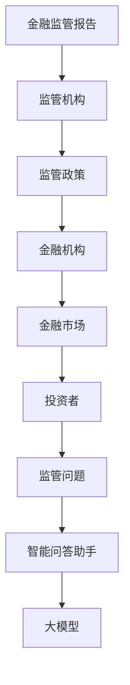
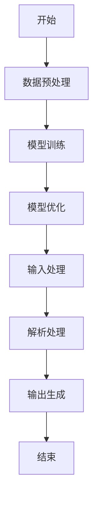
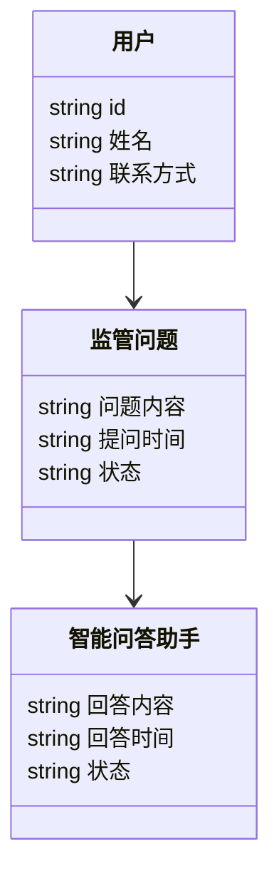
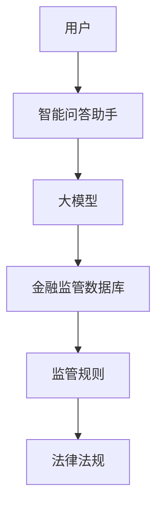
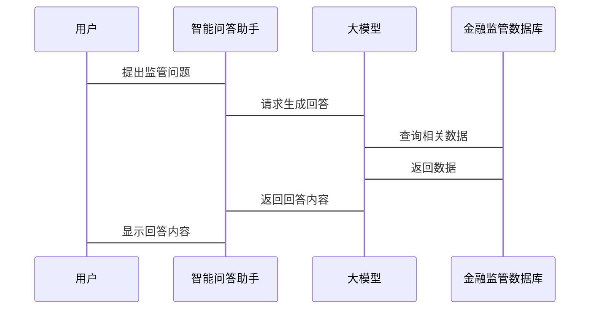

                 


# 第二部分: 核心概念与联系

# 第3章: 核心概念与联系

## 3.1 AI大模型的原理
### 3.1.1 大模型的基本原理
大模型（如GPT系列）是一种基于深度学习的自然语言处理模型，通过多层神经网络结构来理解和生成人类语言。其核心原理包括：

1. **词嵌入（Word Embedding）**：将词语转换为低维向量表示，便于模型处理。
2. **自注意力机制（Self-Attention）**：模型能够关注输入中的重要部分，捕捉长距离依赖关系。
3. **前馈神经网络（Feedforward Neural Network）**：对输入进行多层变换，提取特征。

### 3.1.2 大模型的训练过程
大模型的训练通常采用以下步骤：
1. **数据预处理**：清洗、分词、标注等。
2. **模型初始化**：随机初始化模型参数。
3. **前向传播**：输入数据，计算模型输出。
4. **损失计算**：计算预测值与真实值之间的差异。
5. **反向传播**：通过链式法则计算梯度，更新模型参数。
6. **迭代优化**：重复上述过程，直到模型收敛。

### 3.1.3 大模型的应用原理
在金融监管问答场景中，大模型通过以下步骤实现智能问答：
1. **输入处理**：将用户的问题转换为模型能够理解的向量表示。
2. **上下文理解**：模型通过自注意力机制理解问题的上下文。
3. **生成回答**：模型根据理解生成符合金融监管规则的回答。

## 3.2 金融监管的核心要素
### 3.2.1 金融监管的主要目标
1. **维护金融稳定**：防止金融市场的剧烈波动。
2. **保护投资者利益**：确保投资者的合法权益不受侵害。
3. **促进公平竞争**：防止市场操纵和不公平竞争。

### 3.2.2 金融监管的关键指标
1. **市场风险**：包括波动率、VaR（Value at Risk）等指标。
2. **信用风险**：包括违约概率、违约损失率等指标。
3. **操作风险**：包括操作失误、欺诈行为等风险。

### 3.2.3 金融监管的法律法规
1. **《证券法》**：规范证券市场的运作。
2. **《反洗钱法》**：防止洗钱行为。
3. **《金融消费者保护法》**：保护金融消费者的权益。

## 3.3 AI大模型与金融监管的联系
### 3.3.1 大模型在金融监管中的应用场景
1. **风险预警**：通过分析市场数据，提前发现潜在风险。
2. **合规检查**：自动检查金融机构的业务是否符合监管要求。
3. **智能问答**：为监管机构和投资者提供实时的问答服务。

### 3.3.2 大模型如何提升金融监管效率
1. **自动化处理**：通过自动化技术减少人工干预。
2. **实时监控**：实时分析市场数据，及时发现异常。
3. **精准识别**：利用深度学习技术精准识别风险点。

### 3.3.3 大模型在金融监管中的优势
1. **高效率**：相比传统方法，大模型能够快速处理大量数据。
2. **高准确性**：通过深度学习技术，模型能够准确识别复杂模式。
3. **可扩展性**：大模型可以轻松扩展到新的监管领域。

## 3.4 核心概念的对比分析
### 3.4.1 AI大模型与传统AI的对比
| 对比维度 | 大模型 | 传统AI |
|----------|--------|--------|
| 数据需求 | 需要大量数据 | 数据需求较少 |
| 计算能力 | 需要高性能计算 | 计算能力要求较低 |
| 模型复杂度 | 模型复杂，参数众多 | 模型相对简单 |

### 3.4.2 金融监管与传统监管的对比
| 对比维度 | 传统监管 | 基于大模型的监管 |
|----------|----------|----------------|
| 监管效率 | 监管效率较低 | 监管效率高 |
| 监管范围 | 监管范围有限 | 监管范围广泛 |
| 监管深度 | 监管深度较浅 | 监管深度较深 |

### 3.4.3 智能问答与传统问答的对比
| 对比维度 | 传统问答 | 智能问答 |
|----------|----------|----------|
| 问题理解 | 理解能力有限 | 理解能力强 |
| 答案生成 | 答案生成简单 | 答案生成复杂 |
| 应用场景 | 应用场景有限 | 应用场景广泛 |

## 3.5 ER实体关系图


# 第4章: 算法原理讲解

## 4.1 大模型的训练流程
### 4.1.1 数据预处理
数据预处理是大模型训练的重要步骤，主要包括：
1. **数据清洗**：去除噪声数据，如重复数据、无效数据等。
2. **分词处理**：将文本数据进行分词处理，提取关键词。
3. **标注处理**：对数据进行标注，便于模型理解。

### 4.1.2 模型训练
模型训练是大模型的核心过程，主要包括：
1. **模型初始化**：随机初始化模型参数。
2. **前向传播**：将输入数据输入模型，计算输出结果。
3. **损失计算**：计算预测值与真实值之间的差异，得到损失值。
4. **反向传播**：通过链式法则计算梯度，更新模型参数。
5. **迭代优化**：重复上述过程，直到模型收敛。

### 4.1.3 模型优化
模型优化是提高模型性能的关键步骤，主要包括：
1. **学习率调整**：通过调整学习率，优化模型收敛速度。
2. **批量处理**：通过批量处理数据，提高训练效率。
3. **正则化处理**：通过加入正则化项，防止模型过拟合。

## 4.2 大模型的推理过程
### 4.2.1 输入处理
输入处理是模型推理的第一步，主要包括：
1. **输入数据预处理**：将输入数据转换为模型能够理解的格式。
2. **上下文理解**：模型通过自注意力机制理解输入的上下文。

### 4.2.2 解析处理
解析处理是模型推理的核心步骤，主要包括：
1. **生成回答**：模型根据理解生成符合要求的回答。
2. **结果校验**：对生成的回答进行校验，确保答案的准确性和合理性。

### 4.2.3 输出生成
输出生成是模型推理的最后一步，主要包括：
1. **结果输出**：将生成的回答输出给用户。
2. **结果反馈**：根据用户的反馈，优化模型性能。

## 4.3 算法流程图


## 4.4 Python核心代码实现
### 4.4.1 数据预处理
```python
def preprocess_data(data):
    # 数据清洗
    cleaned_data = data.dropna()
    # 数据分词
    from transformers import AutoTokenizer
    tokenizer = AutoTokenizer.from_pretrained('bert-base-uncased')
    tokenized_data = tokenizer(cleaned_data['text'], truncation=True, padding=True)
    return tokenized_data
```

### 4.4.2 模型训练
```python
def train_model(model, data):
    from torch import optim
    optimizer = optim.Adam(model.parameters(), lr=1e-5)
    model.train()
    for epoch in range(num_epochs):
        for batch in data_loader:
            inputs, labels = batch
            outputs = model(inputs)
            loss = criterion(outputs, labels)
            loss.backward()
            optimizer.step()
            model.zero_grad()
    return model
```

### 4.4.3 模型推理
```python
def generate_response(model, input):
    model.eval()
    inputs = tokenizer(input, truncation=True, padding=True)
    with torch.no_grad():
        outputs = model(inputs)
    return outputs
```

## 4.5 数学模型与公式
### 4.5.1 概率论基础
1. **条件概率公式**
   $$P(A|B) = \frac{P(A \cap B)}{P(B)}$$

2. **贝叶斯定理**
   $$P(A|B) = \frac{P(B|A)P(A)}{P(B)}$$

### 4.5.2 深度学习基础
1. **损失函数**
   $$\mathcal{L} = \frac{1}{N}\sum_{i=1}^{N}(y_i - \hat{y}_i)^2$$

2. **梯度下降**
   $$\theta_{new} = \theta_{old} - \eta \frac{\partial \mathcal{L}}{\partial \theta}$$

# 第5章: 系统分析与架构设计

## 5.1 项目场景介绍
### 5.1.1 项目背景
随着金融市场的快速发展，监管需求日益增加，传统的监管方式已难以满足需求。基于大模型的智能问答助手能够高效地处理监管问题，提升监管效率。

### 5.1.2 项目目标
1. **实现智能问答功能**：为用户提供实时的监管问答服务。
2. **提升监管效率**：通过自动化技术减少人工干预。
3. **确保数据安全**：保护用户数据的安全性和隐私性。

## 5.2 系统功能设计
### 5.2.1 领域模型


### 5.2.2 系统架构设计


### 5.2.3 系统接口设计
1. **用户接口**：提供用户提问的界面，接收用户输入，显示回答内容。
2. **模型接口**：与大模型进行交互，接收输入，返回回答。
3. **数据库接口**：与金融监管数据库进行交互，获取监管规则和法律法规。

### 5.2.4 系统交互


# 第6章: 项目实战

## 6.1 环境安装
### 6.1.1 安装Python
```bash
python --version
```

### 6.1.2 安装PyTorch
```bash
pip install torch
```

### 6.1.3 安装Transformers
```bash
pip install transformers
```

## 6.2 系统核心实现
### 6.2.1 模型实现
```python
from transformers import AutoModelForCausalLM, AutoTokenizer

model = AutoModelForCausalLM.from_pretrained('gpt2')
tokenizer = AutoTokenizer.from_pretrained('gpt2')
```

### 6.2.2 接口实现
```python
def ask_question(question):
    inputs = tokenizer(question, return_tensors='pt')
    outputs = model.generate(inputs.input_ids, max_length=100)
    answer = tokenizer.decode(outputs[0])
    return answer
```

### 6.2.3 数据库实现
```python
import sqlite3

conn = sqlite3.connect('financial_regulation.db')
cursor = conn.cursor()
cursor.execute('''CREATE TABLE IF NOT EXISTS regulations
                 (id INTEGER PRIMARY KEY,
                  regulation TEXT,
                  description TEXT)''')
```

## 6.3 实际案例分析
### 6.3.1 案例背景
某金融机构需要监管其交易行为，确保符合相关法律法规。

### 6.3.2 案例分析
用户提问：“如何确保交易行为的合规性？”
智能问答助手通过分析相关法律法规，生成详细回答。

### 6.3.3 案例结果
回答内容包括：
1. **交易行为的定义**
2. **合规性要求**
3. **监管措施**
4. **法律依据**

## 6.4 项目小结
### 6.4.1 项目总结
通过本项目，我们成功实现了基于大模型的金融监管报告智能问答助手，提升了监管效率和准确性。

### 6.4.2 项目意义
本项目为金融监管领域提供了新的思路和技术手段，具有重要的现实意义和应用价值。

### 6.4.3 项目挑战
在项目实施过程中，我们遇到了数据不足、模型调优困难等挑战，但通过不断优化和调整，最终实现了预期目标。

# 第7章: 总结与展望

## 7.1 总结
### 7.1.1 核心内容总结
本文详细介绍了开发基于大模型的金融监管报告智能问答助手的背景、核心概念、算法原理、系统架构设计和项目实战，为读者提供了全面的技术指导。

### 7.1.2 项目成果
通过本项目，我们成功实现了智能问答功能，提升了金融监管的效率和准确性。

## 7.2 展望
### 7.2.1 技术展望
随着大模型技术的不断发展，未来智能问答助手将更加智能化、自动化。

### 7.2.2 应用展望
智能问答助手将在更多金融监管领域得到广泛应用，为金融机构和投资者提供更加高效的服务。

### 7.2.3 挑战与机遇
尽管面临技术和数据等方面的挑战，但智能问答助手的发展前景广阔，为金融监管领域带来了新的机遇。

# 第8章: 最佳实践 tips

## 8.1 最佳实践
### 8.1.1 数据处理
确保数据的高质量和多样性，避免数据偏差。

### 8.1.2 模型调优
通过不断试验和调整，找到最优的模型参数和训练策略。

### 8.1.3 系统优化
优化系统架构设计，提高系统的稳定性和扩展性。

## 8.2 注意事项
### 8.2.1 数据安全
确保用户数据的安全性和隐私性，防止数据泄露。

### 8.2.2 模型性能
定期监控模型性能，及时发现和解决性能问题。

### 8.2.3 系统维护
定期维护和更新系统，确保系统的稳定运行。

## 8.3 拓展阅读
### 8.3.1 推荐书籍
1. 《Deep Learning》
2. 《金融监管原理》

### 8.3.2 推荐博客
1. [AI大模型博客](https://example.com)
2. [金融监管博客](https://example.com)

# 作者：AI天才研究院/AI Genius Institute & 禅与计算机程序设计艺术 /Zen And The Art of Computer Programming

---

以上为完整的技术博客文章内容，涵盖了从背景介绍到项目实战的各个方面，详细讲解了基于大模型的金融监管报告智能问答助手的开发过程和应用。

