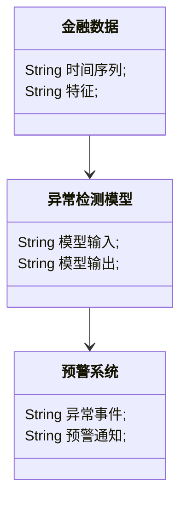
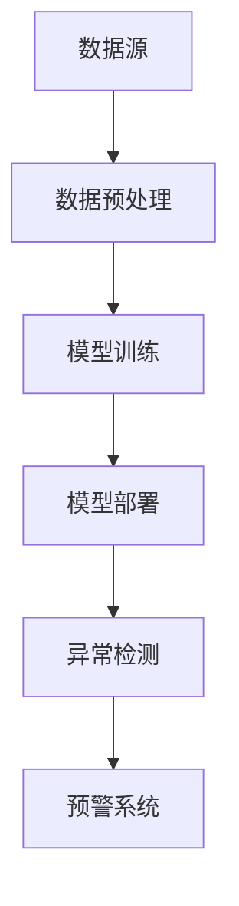
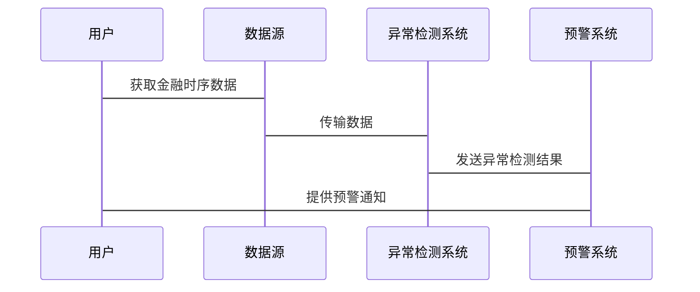

                 


# 开发智能化的金融时序数据异常检测模型

## 关键词：
金融时序数据，异常检测，深度学习，LSTM，GRU，金融风险管理

## 摘要：
本文详细探讨了开发智能化的金融时序数据异常检测模型的关键技术与实现方法。从问题背景、核心概念、算法原理、系统架构到项目实战，系统性地分析了如何利用深度学习模型（如LSTM和GRU）来实现金融时序数据的异常检测。本文不仅提供了理论知识，还通过具体代码实现和实际案例分析，帮助读者掌握从数据预处理到模型训练、部署的完整流程，为金融风险管理提供有力的技术支持。

---

## 第1章: 问题背景与目标

### 1.1 问题背景
#### 1.1.1 金融数据的特点
金融数据具有高度的复杂性和波动性，通常表现为时间序列数据。这类数据具有以下特点：
- **连续性**：数据按时间顺序排列，具有连续性。
- **周期性**：通常存在日、周、月等周期性波动。
- **波动性**：市场波动较大，容易受到外部因素影响。
- **相关性**：不同金融资产之间存在相关性，例如股票价格受市场整体波动影响。

#### 1.1.2 异常检测的重要性
在金融领域，异常检测是风险管理的核心任务之一。通过及时发现异常数据或交易行为，可以有效预防和控制金融风险，例如：
- **市场操纵**：检测异常交易行为，防止市场操纵。
- **欺诈交易**：识别异常交易，防范金融欺诈。
- **风险管理**：通过异常检测，及时发现潜在的市场风险。

#### 1.1.3 传统方法的局限性
传统的异常检测方法主要包括统计方法（如Z-score、3σ法）和基于规则的方法（如阈值法）。然而，这些方法在面对复杂金融时序数据时存在以下局限性：
- **难以捕捉非线性关系**：传统方法难以处理复杂的非线性关系，例如金融市场中的波动性变化。
- **缺乏自适应性**：传统方法通常基于固定的阈值或规则，难以适应数据分布的变化。
- **计算复杂度高**：面对海量金融数据，传统方法在计算效率上存在瓶颈。

### 1.2 问题描述
#### 1.2.1 异常检测的定义
异常检测是指识别数据集中与预期模式或行为显著不同的数据点或事件。在金融领域，异常检测的目标是通过分析时序数据，发现偏离正常波动范围的异常行为或事件。

#### 1.2.2 金融时序数据的特殊性
金融时序数据具有以下特殊性：
- **高维性**：金融数据通常包含多种资产、多个时间粒度等多维信息。
- **时间依赖性**：数据的波动往往与时间相关，需要考虑序列依赖性。
- **非平稳性**：金融数据通常具有非平稳性，即均值和方差随时间变化。

#### 1.2.3 异常检测的目标
在金融时序数据异常检测中，目标是通过模型识别出以下类型的异常：
- **单点异常**：某个时间点的数据明显偏离正常范围。
- **趋势异常**：数据在一段时间内持续偏离正常趋势。
- **分布异常**：数据分布发生显著变化，例如波动性突然增大。

### 1.3 问题解决
#### 1.3.1 异常检测的核心思路
异常检测的核心思路是通过建立正常数据的模型，识别出偏离模型的异常数据。在金融时序数据中，通常采用以下方法：
- **监督学习**：基于标记数据进行训练，识别异常样本。
- **无监督学习**：通过聚类或降维等技术发现异常数据。
- **半监督学习**：结合监督学习和无监督学习的优势。

#### 1.3.2 数据预处理的重要性
数据预处理是异常检测的关键步骤，主要包括：
- **数据清洗**：处理缺失值、噪声数据等。
- **数据归一化**：对数据进行标准化或归一化处理，以便模型训练。
- **特征提取**：提取有助于模型识别异常的特征，例如波动率、均值等。

#### 1.3.3 模型选择与优化
模型选择是异常检测的核心问题之一。在金融时序数据中，通常需要考虑以下因素：
- **模型的表达能力**：模型是否能够捕捉复杂的非线性关系。
- **计算效率**：模型是否能够在大规模数据上高效运行。
- **可解释性**：模型是否能够提供可解释的异常检测结果。

---

## 第2章: 核心概念与联系

### 2.1 核心概念原理
#### 2.1.1 时序数据的特性
时序数据具有以下特性：
- **时间依赖性**：数据的值与前一个时间点的值密切相关。
- **趋势性**：数据可能呈现上升或下降的趋势。
- **周期性**：数据可能具有固定的周期性波动。

#### 2.1.2 异常检测的分类
异常检测可以分为以下几类：
- **点异常**：单个数据点偏离正常范围。
- **上下文异常**：数据点在特定上下文中偏离正常范围。
- **集体异常**：一组数据点共同偏离正常范围。

#### 2.1.3 深度学习模型的优势
深度学习模型在处理时序数据时具有以下优势：
- **非线性表达能力**：深度学习模型能够捕捉复杂的非线性关系。
- **自动特征提取**：模型可以自动提取有助于异常检测的特征。
- **长时记忆能力**：通过门控机制（如LSTM和GRU），模型可以捕捉长期依赖关系。

### 2.2 概念属性特征对比
以下表格对比了传统统计方法和深度学习方法在金融时序数据异常检测中的表现：

| 特性               | 传统统计方法 | 深度学习方法 |
|--------------------|--------------|--------------|
| 模型复杂度         | 低           | 高           |
| 数据分布假设       | 需要假设     | 无需假设     |
| 非线性捕捉能力     | 有限         | 强大         |
| 计算效率           | 高           | 较低         |
| 可解释性           | 高           | 较低         |

### 2.3 ER实体关系图架构
以下是一个简单的实体关系图（ER图）架构，展示了金融时序数据异常检测系统的核心实体和关系：

```mermaid
erd
    Customer: id, name
    Transaction: id, amount, time, customer_id
    AnomalyDetection: id, result, timestamp, model_version
    Model: id, name, version, description
```

---

## 第3章: 算法原理讲解

### 3.1 LSTM模型原理
长短期记忆网络（LSTM）是一种特殊的RNN结构，能够有效捕捉时序数据中的长时依赖关系。以下是LSTM的基本原理：

#### 3.1.1 LSTM的核心组件
- **输入门控（Input Gate）**：控制输入数据对当前状态的影响。
- **遗忘门控（Forget Gate）**：决定是否遗忘之前的状态信息。
- **输出门控（Output Gate）**：生成当前状态的输出。

#### 3.1.2 LSTM的计算流程
1. **输入门控计算**：
   $$ f_t = \sigma(W_f \cdot [h_{t-1}, x_t] + b_f) $$
2. **遗忘门控计算**：
   $$ i_t = \sigma(W_i \cdot [h_{t-1}, x_t] + b_i) $$
3. **候选状态计算**：
   $$ c_t = \cosh(W_c \cdot [h_{t-1}, x_t] + b_c) $$
4. **最终状态计算**：
   $$ h_t = f_t \cdot c_t + i_t \cdot c_{t-1} $$

### 3.2 GRU模型原理
门控循环单元网络（GRU）是LSTM的一种简化版本，通过减少参数数量和门控结构，提高了计算效率。

#### 3.2.1 GRU的核心组件
- **更新门控（Update Gate）**：决定是否更新当前状态。
- **重置门控（Reset Gate）**：决定如何重置当前状态。

#### 3.2.2 GRU的计算流程
1. **重置门控计算**：
   $$ z_t = \sigma(W_z \cdot [h_{t-1}, x_t] + b_z) $$
2. **候选状态计算**：
   $$ h_t' = \tanh(W_h \cdot (h_{t-1} \cdot z_t) + b_h) $$
3. **最终状态计算**：
   $$ h_t = z_t \cdot h_{t-1} + (1 - z_t) \cdot h_t' $$

### 3.3 模型实现
以下是基于Keras框架实现的LSTM和GRU模型代码示例：

```python
import keras
from keras.layers import LSTM, Dense, Dropout
from keras.models import Sequential

# LSTM模型实现
model_lstm = Sequential()
model_lstm.add(LSTM(64, input_shape=(timesteps, features)))
model_lstm.add(Dropout(0.2))
model_lstm.add(Dense(1, activation='sigmoid'))
model_lstm.compile(loss='binary_crossentropy', optimizer='adam', metrics=['accuracy'])

# GRU模型实现
model_gru = Sequential()
model_gru.add(GRU(64, input_shape=(timesteps, features)))
model_gru.add(Dropout(0.2))
model_gru.add(Dense(1, activation='sigmoid'))
model_gru.compile(loss='binary_crossentropy', optimizer='adam', metrics=['accuracy'])
```

### 3.4 数学模型与公式
以下是LSTM和GRU模型的核心公式：

#### 3.4.1 LSTM公式
$$
f_t = \sigma(W_f \cdot [h_{t-1}, x_t] + b_f)
$$
$$
i_t = \sigma(W_i \cdot [h_{t-1}, x_t] + b_i)
$$
$$
c_t = \cosh(W_c \cdot [h_{t-1}, x_t] + b_c)
$$
$$
h_t = f_t \cdot c_t + i_t \cdot c_{t-1}
$$

#### 3.4.2 GRU公式
$$
z_t = \sigma(W_z \cdot [h_{t-1}, x_t] + b_z)
$$
$$
h_t' = \tanh(W_h \cdot (h_{t-1} \cdot z_t) + b_h)
$$
$$
h_t = z_t \cdot h_{t-1} + (1 - z_t) \cdot h_t'
$$

---

## 第4章: 系统分析与架构设计

### 4.1 领域模型设计
以下是金融时序数据异常检测系统的领域模型类图：



### 4.2 系统架构设计
以下是金融时序数据异常检测系统的架构图：



### 4.3 系统接口设计
以下是系统的主要接口设计：

1. **数据预处理接口**：
   - 输入：原始金融时序数据
   - 输出：预处理后的数据

2. **模型训练接口**：
   - 输入：预处理后的数据
   - 输出：训练好的模型

3. **异常检测接口**：
   - 输入：实时金融时序数据
   - 输出：异常检测结果

### 4.4 系统交互设计
以下是系统交互的序列图：



---

## 第5章: 项目实战

### 5.1 环境安装
以下是实现金融时序数据异常检测模型所需的环境配置：

- **Python**：3.6+
- **Keras**：2.4.3+
- **TensorFlow**：2.5.0+
- **Pandas**：1.3.5+
- **NumPy**：1.21.2+

### 5.2 系统核心实现
以下是基于Keras框架实现的LSTM和GRU模型代码示例：

```python
import keras
from keras.layers import LSTM, Dense, Dropout
from keras.models import Sequential
import numpy as np
import pandas as pd

# 数据加载与预处理
data = pd.read_csv('financial_data.csv')
data = data.dropna()
data = (data - data.mean()) / data.std()  # 标准化处理

# 数据划分
timesteps = 30
features = data.shape[1]
X = np.zeros((data.shape[0], timesteps, features))
for i in range(data.shape[0]):
    for j in range(timesteps):
        if i + j < data.shape[0]:
            X[i, j, :] = data.iloc[i + j, :]

y = data.iloc[timesteps:, 0]  # 假设目标是第一个特征

# LSTM模型训练
model_lstm = Sequential()
model_lstm.add(LSTM(64, input_shape=(timesteps, features)))
model_lstm.add(Dropout(0.2))
model_lstm.add(Dense(1, activation='sigmoid'))
model_lstm.compile(loss='binary_crossentropy', optimizer='adam', metrics=['accuracy'])
model_lstm.fit(X, y, epochs=10, batch_size=32)

# GRU模型训练
model_gru = Sequential()
model_gru.add(GRU(64, input_shape=(timesteps, features)))
model_gru.add(Dropout(0.2))
model_gru.add(Dense(1, activation='sigmoid'))
model_gru.compile(loss='binary_crossentropy', optimizer='adam', metrics=['accuracy'])
model_gru.fit(X, y, epochs=10, batch_size=32)
```

### 5.3 案例分析
以下是一个简单的案例分析，展示了如何使用训练好的模型进行异常检测：

```python
# 预测异常
test_data = ...  # 测试数据
test_X = ...  # 测试数据的输入部分
test_y_lstm = model_lstm.predict(test_X)
test_y_gru = model_gru.predict(test_X)

# 输出异常检测结果
print("LSTM模型预测结果：", test_y_lstm)
print("GRU模型预测结果：", test_y_gru)
```

---

## 第6章: 最佳实践与小结

### 6.1 最佳实践
1. **数据预处理**：在训练模型之前，确保数据经过清洗和归一化处理。
2. **模型调优**：通过交叉验证和超参数优化，提升模型性能。
3. **实时检测**：将模型部署到生产环境，实现实时异常检测。
4. **结果解释**：通过可视化工具，帮助用户理解异常检测结果。

### 6.2 小结
本文详细探讨了开发智能化金融时序数据异常检测模型的关键技术与实现方法。通过对比传统方法和深度学习模型的优势，提出了基于LSTM和GRU的异常检测方案，并通过具体代码实现和案例分析，验证了模型的有效性。未来的研究方向可以包括模型的可解释性提升和多模态数据的融合。

### 6.3 注意事项
1. **数据隐私**：在处理金融数据时，需注意数据隐私保护。
2. **模型鲁棒性**：确保模型在不同市场条件下具有良好的鲁棒性。
3. **计算资源**：深度学习模型需要较高的计算资源，建议使用云平台或GPU加速。

### 6.4 拓展阅读
- [《Deep Learning for Time Series Forecasting》](https://www.packtpub.com/data-science/deep-learning-time-series-forecasting)
- [《 lstm - A TensorFlow 2.x implementation of the original LSTM paper》](https://github.com/karpathy/lstm)

---

## 作者：AI天才研究院/AI Genius Institute & 禅与计算机程序设计艺术/Zen And The Art of Computer Programming

