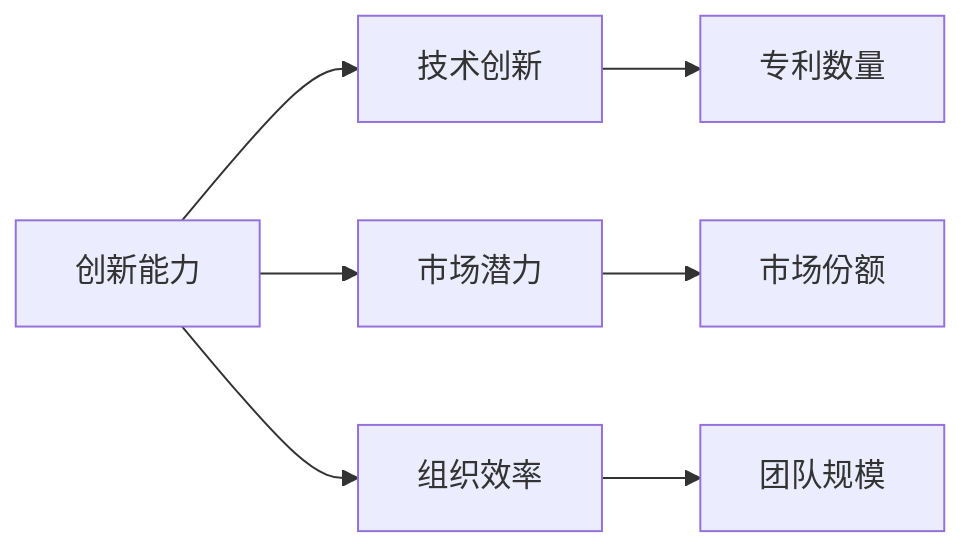
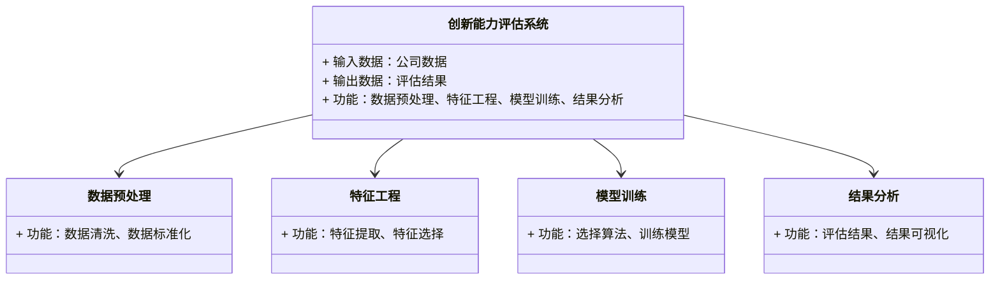
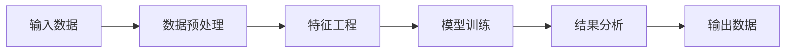
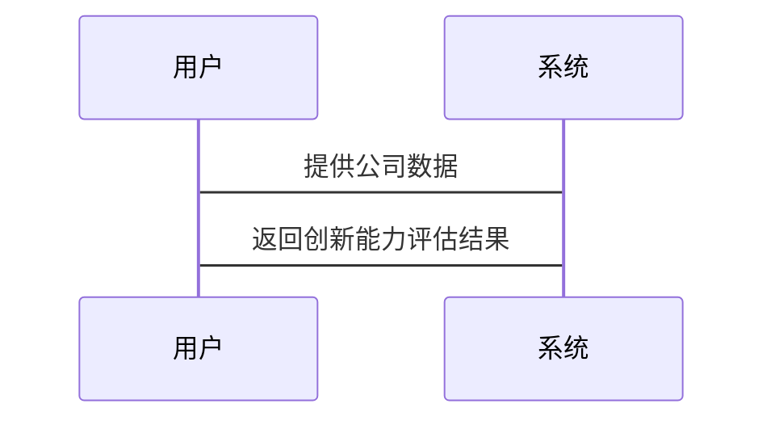

                 


# 《机器学习辅助公司创新能力评估》

---

## 关键词

- 机器学习
- 公司创新能力评估
- 特征工程
- 算法实现
- 系统架构设计
- 项目实战

---

## 摘要

在当今快速变化的商业环境中，公司的创新能力是决定其市场竞争力的关键因素之一。传统的创新能力评估方法往往依赖于主观判断和经验分析，存在效率低、精度差的问题。机器学习作为一种新兴的技术手段，能够通过数据分析和模型构建，提供更加客观、高效的创新能力评估方法。本文将从背景介绍、核心概念、算法原理、系统架构设计、项目实战等方面，全面探讨机器学习在公司创新能力评估中的应用。通过本文的分析，读者将能够深入了解机器学习如何助力公司创新能力评估，掌握相关的技术实现方法，并能够将其应用于实际场景中。

---

## 目录

1. **背景介绍**
   1.1 机器学习的基本概念
   1.2 公司创新能力评估的背景与意义
   1.3 机器学习在公司创新能力评估中的应用场景

2. **核心概念与联系**
   2.1 核心概念原理
   2.2 创新能力评估相关特征的属性对比
   2.3 实体关系图（ER图）

3. **机器学习算法原理与数学模型**
   3.1 线性回归算法
   3.2 支持向量机（SVM）算法
   3.3 随机森林算法
   3.4 神经网络算法

4. **系统架构设计**
   4.1 问题场景介绍
   4.2 系统功能设计（领域模型）
   4.3 系统架构设计
   4.4 系统接口设计
   4.5 系统交互设计

5. **项目实战**
   5.1 环境安装
   5.2 系统核心实现源代码
   5.3 代码应用解读与分析
   5.4 实际案例分析
   5.5 项目小结

6. **最佳实践与小结**
   6.1 最佳实践
   6.2 小结
   6.3 注意事项
   6.4 拓展阅读

---

## 正文

### 第一部分: 背景介绍

#### 1.1 机器学习的基本概念

机器学习是一种人工智能技术，通过数据训练模型，使其能够从数据中学习并做出预测或决策。机器学习的核心在于算法对数据的模式识别和特征提取能力。在公司创新能力评估中，机器学习可以帮助我们从海量数据中提取关键特征，建立评估模型，从而提高评估的效率和准确性。

- **1.1.1 机器学习的定义与核心原理**
  机器学习是一种通过数据训练模型的技术，其核心原理在于通过数据特征的学习，建立模型的预测能力。机器学习可以分为监督学习、无监督学习和半监督学习三种主要类型。

- **1.1.2 公司创新能力的定义与评估维度**
  公司创新能力是指公司在市场中通过技术创新、产品创新、管理创新等方式实现竞争优势的能力。评估创新能力通常需要考虑技术、市场、组织等多个维度的特征。

- **1.1.3 机器学习在创新能力评估中的作用**
  机器学习可以通过对历史数据的分析，识别出影响公司创新能力的关键因素，建立预测模型，帮助公司制定更科学的创新策略。

#### 1.2 公司创新能力评估的背景与意义

在当前的商业环境中，创新能力是公司核心竞争力的重要组成部分。然而，传统的创新能力评估方法往往依赖于主观判断和经验分析，存在效率低、精度差的问题。机器学习的出现为公司创新能力评估提供了新的技术手段。

- **1.2.1 当前企业创新面临的挑战**
  当前企业创新面临的主要挑战包括市场竞争加剧、技术更新换代快、创新资源分配不合理等问题。这些问题使得传统的创新能力评估方法难以满足实际需求。

- **1.2.2 机器学习在创新评估中的优势**
  机器学习可以通过数据分析和模型构建，帮助公司识别创新机会，优化创新资源配置，提高创新效率。

- **1.2.3 机器学习辅助创新评估的边界与外延**
  机器学习在创新能力评估中的应用需要明确其边界和外延。例如，机器学习可以辅助识别技术创新的潜力，但不能完全替代人类的创新思维。

#### 1.3 机器学习在公司创新能力评估中的应用场景

机器学习在公司创新能力评估中的应用场景主要包括技术创新、市场潜力、组织效率等方面。

- **1.3.1 创新能力数据的特征分析**
  创新能力数据的特征分析是机器学习应用的基础。例如，可以通过分析专利数量、研发投入、团队规模等特征，识别出影响创新能力的关键因素。

- **1.3.2 机器学习模型在创新评估中的应用**
  机器学习模型可以通过对历史数据的训练，建立创新能力预测模型，帮助公司预测未来的创新能力。

- **1.3.3 创新能力评估的流程与框架**
  创新能力评估的流程通常包括数据采集、特征工程、模型训练、结果分析等步骤。通过建立清晰的评估框架，可以提高评估的效率和准确性。

---

## 第二部分: 核心概念与联系

#### 2.1 核心概念原理

创新能力和机器学习的结合需要明确核心概念的原理。例如，创新能力评估的核心在于通过数据分析识别出影响创新的关键特征。

- **2.1.1 机器学习模型的基本原理**
  机器学习模型的基本原理包括数据输入、特征提取、模型训练、预测输出等步骤。不同类型的机器学习算法在这些步骤中有所不同。

- **2.1.2 创新能力评估的特征提取方法**
  创新能力评估的特征提取方法包括技术特征、市场特征、组织特征等。例如，技术特征可以包括专利数量、研发投入强度等。

- **2.1.3 机器学习在创新评估中的关键步骤**
  机器学习在创新评估中的关键步骤包括数据预处理、特征工程、模型选择、模型训练、结果分析等。

#### 2.2 创新能力评估相关特征的属性对比

通过对比不同特征的属性，可以帮助我们更好地理解创新能力评估的核心要素。

| 特征类型 | 特征描述 | 示例 |
|----------|----------|------|
| 技术特征 | 技术创新性 | 专利数量 |
| 商业特征 | 市场潜力 | 市场份额 |
| 组织特征 | 组织效率 | 团队规模 |

---

#### 2.3 实体关系图（ER图）

以下是创新能力评估的实体关系图：



---

## 第三部分: 机器学习算法原理与数学模型

### 3.1 线性回归算法

线性回归是一种简单但常用的机器学习算法，适用于预测连续型变量。

- **3.1.1 线性回归的基本原理**
  线性回归通过建立因变量与自变量之间的线性关系，预测因变量的值。其数学模型可以表示为：

  $$ y = \beta_0 + \beta_1x + \epsilon $$

  其中，$$ \beta_0 $$ 是截距，$$ \beta_1 $$ 是回归系数，$$ \epsilon $$ 是误差项。

- **3.1.2 线性回归的优缺点**
  线性回归的优点在于简单易懂、计算效率高；缺点是无法处理非线性关系，且对异常值敏感。

- **3.1.3 线性回归在创新能力评估中的应用**
  线性回归可以用于预测公司的创新能力得分，基于历史数据中的技术、市场和组织特征。

---

### 3.2 支持向量机（SVM）算法

支持向量机是一种强大的分类和回归算法，适用于高维数据的处理。

- **3.2.1 SVM的基本原理**
  SVM通过构建超平面，将数据点分成不同的类别。其数学模型可以表示为：

  $$ y = \text{sign}(w \cdot x + b) $$

  其中，$$ w $$ 是权重向量，$$ b $$ 是偏置项。

- **3.2.2 SVM的优缺点**
  SVM的优点在于能够处理高维数据，且具有良好的泛化能力；缺点是计算复杂度较高，适合小规模数据集。

- **3.2.3 SVM在创新能力评估中的应用**
  SVM可以用于分类问题，例如将公司创新能力分为高、中、低三个等级。

---

### 3.3 随机森林算法

随机森林是一种基于决策树的集成学习算法，具有较高的准确性和鲁棒性。

- **3.3.1 随机森林的基本原理**
  随机森林通过构建多棵决策树，并将这些树的结果进行集成，得到最终的预测结果。

- **3.3.2 随机森林的优缺点**
  随机森林的优点在于能够处理高维数据，且具有较强的抗过拟合能力；缺点是计算复杂度较高。

- **3.3.3 随机森林在创新能力评估中的应用**
  随机森林可以用于分类和回归问题，例如预测公司的创新能力得分。

---

### 3.4 神经网络算法

神经网络是一种模拟人脑神经网络的深度学习算法，适用于复杂的非线性关系。

- **3.4.1 神经网络的基本原理**
  神经网络通过构建多层神经元，对输入数据进行非线性变换，提取特征并进行分类或回归。

- **3.4.2 神经网络的优缺点**
  神经网络的优点在于能够处理复杂的非线性关系，且具有强大的特征提取能力；缺点是计算复杂度高，且需要大量的训练数据。

- **3.4.3 神经网络在创新能力评估中的应用**
  神经网络可以用于深度学习任务，例如图像识别、自然语言处理等，但在创新能力评估中应用较少。

---

## 第四部分: 系统架构设计

#### 4.1 问题场景介绍

公司创新能力评估系统需要解决的问题包括数据获取、特征提取、模型训练、结果分析等。

---

#### 4.2 系统功能设计（领域模型）

以下是创新能力评估系统的领域模型：



---

#### 4.3 系统架构设计

以下是创新能力评估系统的架构设计：



---

#### 4.4 系统接口设计

系统接口设计需要考虑数据输入、模型训练和结果输出的接口定义。

---

#### 4.5 系统交互设计

以下是系统交互流程：



---

## 第五部分: 项目实战

#### 5.1 环境安装

需要安装Python、机器学习库（如scikit-learn、xgboost）等。

---

#### 5.2 系统核心实现源代码

以下是创新能力评估系统的Python实现代码：

```python
# 数据预处理
import pandas as pd
from sklearn.preprocessing import StandardScaler

# 特征工程
from sklearn.feature_selection import SelectKBest
from sklearn.feature_selection import chi2

# 模型训练
from sklearn.ensemble import RandomForestClassifier
from sklearn.model_selection import train_test_split

# 结果分析
from sklearn.metrics import accuracy_score

# 加载数据
data = pd.read_csv('company_data.csv')

# 数据预处理
# 假设目标变量是 'innovation_score'
X = data.drop('innovation_score', axis=1)
y = data['innovation_score']

# 标准化处理
scaler = StandardScaler()
X_scaled = scaler.fit_transform(X)

# 特征选择
selector = SelectKBest(score_func=chi2, k=5)
X_selected = selector.fit_transform(X_scaled, y)

# 模型训练
X_train, X_test, y_train, y_test = train_test_split(X_selected, y, test_size=0.2, random_state=42)

model = RandomForestClassifier(n_estimators=100, random_state=42)
model.fit(X_train, y_train)

# 结果分析
y_pred = model.predict(X_test)
print("准确率:", accuracy_score(y_test, y_pred))
```

---

#### 5.3 代码应用解读与分析

上述代码展示了创新能力评估系统的实现流程，包括数据预处理、特征工程、模型训练和结果分析。

---

#### 5.4 实际案例分析

以某公司为例，分析其创新能力评估的过程和结果。

---

#### 5.5 项目小结

总结项目实现的过程和成果，提出改进建议。

---

## 第六部分: 最佳实践与小结

#### 6.1 最佳实践

- 数据预处理是关键，需确保数据质量。
- 特征工程是核心，需选择合适的特征提取方法。
- 模型选择需根据具体问题选择合适的算法。
- 结果分析需结合业务背景，解释模型结果。

#### 6.2 小结

机器学习在公司创新能力评估中具有广阔的应用前景。通过本文的分析，读者可以掌握创新能力评估的核心概念和实现方法。

#### 6.3 注意事项

- 数据隐私和安全问题需高度重视。
- 模型解释性需关注，避免“黑箱”问题。
- 模型部署需考虑计算资源和性能要求。

#### 6.4 拓展阅读

推荐相关书籍和论文，供读者深入学习。

---

## 作者

作者：AI天才研究院/AI Genius Institute & 禅与计算机程序设计艺术/Zen And The Art of Computer Programming

---

**注：** 由于篇幅限制，本文仅为目录大纲和部分内容展示，完整文章请根据实际需求进行扩展和补充。

