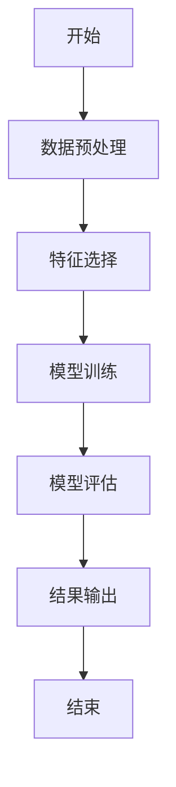
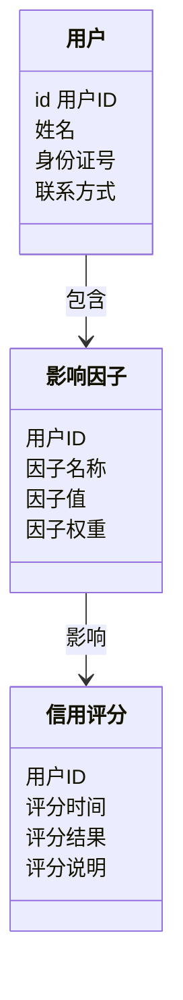
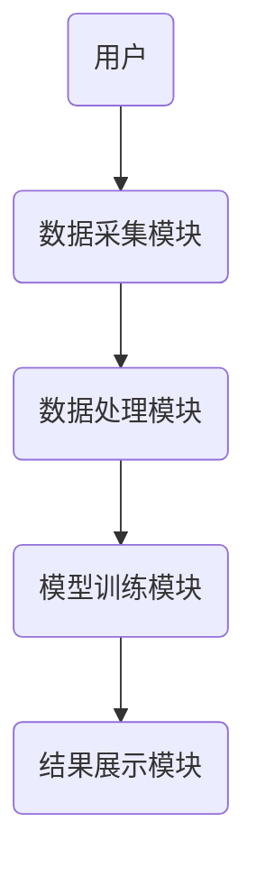
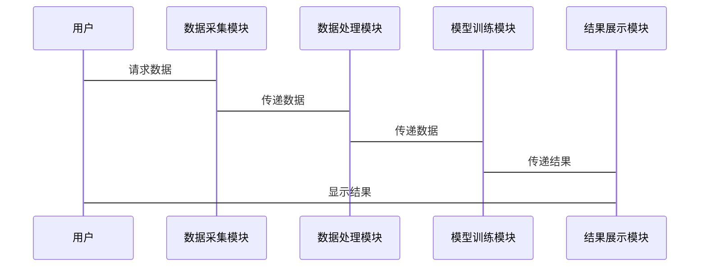
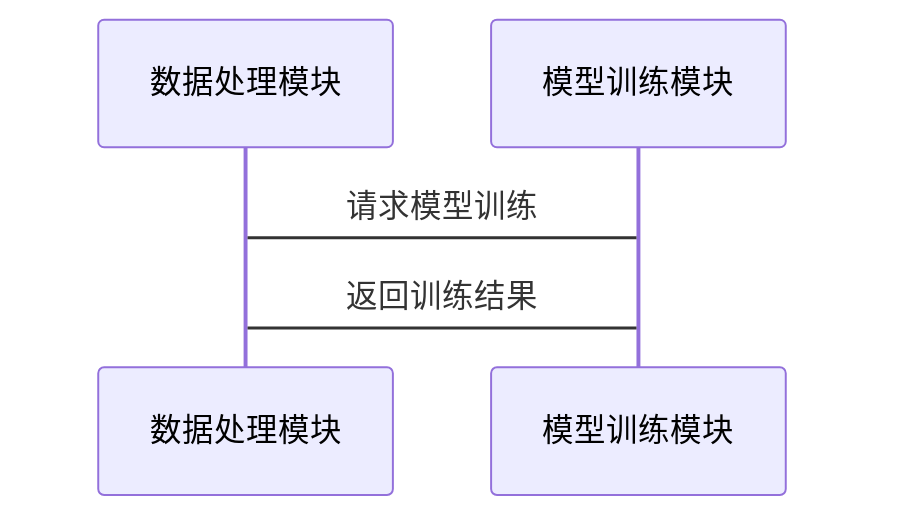

                 


# 构建智能化的个人信用分数影响因子分析器

## 关键词
个人信用评分、影响因子分析、人工智能、机器学习、系统架构设计

## 摘要
本文详细探讨了构建智能化的个人信用分数影响因子分析器的全过程，从核心概念到算法实现，再到系统架构设计，层层剖析。通过丰富的实例和详细的代码讲解，帮助读者全面理解如何利用人工智能技术提升信用评分系统的智能化水平。文章内容涵盖背景介绍、核心概念、算法原理、系统设计、项目实战等多个方面，为读者提供了一套完整的解决方案。

---

# 第1章: 个人信用分数影响因子分析器的背景与概念

## 1.1 个人信用评分的背景与意义
### 1.1.1 个人信用评分的定义与作用
个人信用评分是金融机构评估个人信用风险的重要指标，它基于个人的财务状况、消费行为和信用历史等多个维度进行综合评分。信用评分的高低直接影响个人能否获得贷款、信用卡等金融服务，以及获得的额度和利率。

### 1.1.2 信用评分在金融领域的应用
信用评分广泛应用于银行、信用卡公司、网贷平台等金融领域。金融机构通过信用评分来判断个人的还款能力和信用风险，从而做出授信决策。传统信用评分主要基于线性模型，而智能化信用评分则引入了机器学习等技术，进一步提升了评分的准确性和智能化水平。

### 1.1.3 智能化信用评分的必要性
随着金融业务的复杂化和数据的多样化，传统信用评分模型的局限性逐渐显现。智能化信用评分能够更好地捕捉非线性关系，发现潜在的风险因素，并实时更新评分结果，为金融机构提供更精准的决策支持。

## 1.2 个人信用评分的核心概念
### 1.2.1 信用评分的计算模型
信用评分的计算模型主要包括线性回归模型、逻辑回归模型、决策树模型、随机森林模型等。这些模型各有优缺点，选择合适的模型需要根据数据特征和业务需求进行评估。

### 1.2.2 影响因子的定义与分类
影响因子是指影响个人信用评分的关键因素，主要包括：
- **财务状况**：收入、负债、资产等。
- **消费行为**：信用卡使用频率、还款记录、消费金额等。
- **信用历史**：信用报告、逾期记录、信用查询次数等。
- **社交网络**：社交平台上的行为、人际关系等。
- **其他因素**：年龄、职业、居住地等。

### 1.2.3 智能化分析的核心要素
智能化信用评分的核心要素包括数据采集、数据处理、模型训练、结果展示等。通过引入机器学习算法，能够更好地挖掘数据中的潜在规律，提升评分的准确性和实时性。

## 1.3 系统的边界与外延
### 1.3.1 系统功能边界
系统主要负责数据采集、处理、建模和结果展示，不涉及具体的授信决策或贷款审批流程。系统输出的信用评分结果可以作为金融机构的决策参考。

### 1.3.2 与相关系统的交互
系统需要与数据源（如银行数据库、社交平台）、评分结果展示平台（如金融机构的内部系统）等进行交互。系统通过API接口与外部系统进行数据交换。

### 1.3.3 系统的扩展性与可维护性
系统设计时需要考虑模块化设计，确保各模块之间的耦合度较低，便于后续的功能扩展和维护。同时，系统应支持多种数据格式和接口，以适应不同金融机构的需求。

## 1.4 本章小结
本章介绍了个人信用评分的重要性和智能化的必要性，详细阐述了影响因子的分类和系统设计的边界与外延。为后续章节的深入分析奠定了基础。

---

# 第2章: 影响因子分析器的核心原理

## 2.1 影响因子的属性特征对比
### 2.1.1 各影响因子的属性分析
- **财务状况**：包括收入、负债、资产等，通常为数值型数据，需要进行归一化处理。
- **消费行为**：包括信用卡使用频率、还款记录等，通常为分类数据，需要进行特征编码。
- **信用历史**：包括逾期记录、信用查询次数等，通常为数值型数据，需要进行标准化处理。
- **社交网络**：包括社交平台上的行为数据，通常为文本型数据，需要进行文本挖掘。

### 2.1.2 影响因子的特征对比表格
| 影响因子 | 数据类型 | 特征描述 | 示例数据 |
|----------|----------|----------|----------|
| 收入     | 数值型   | 个人年收入 | 50000    |
| 负债     | 数值型   | 个人总负债 | 30000    |
| 信用卡使用频率 | 分类型 | 信用卡使用频率 | 高、中、低 |
| 还款记录   | 数值型 | 逾期次数 | 2        |
| 社交影响力 | 数值型 | 社交影响力评分 | 80       |

### 2.1.3 影响因子的权重计算方法
影响因子的权重计算可以通过特征重要性分析、主成分分析（PCA）等方法实现。例如，在机器学习模型中，特征的重要性可以通过模型系数或特征重要性评分来确定。

## 2.2 影响因子分析器的ER实体关系图
### 2.2.1 实体关系图的构建
```mermaid
erDiagram
    actor 用户
    actor 金融机构
    actor 数据源
    actor 分析结果展示平台

    user(用户) {
        id 用户ID
        姓名
        身份证号
        联系方式
    }

    credit_score(信用评分) {
        用户ID
        评分时间
        评分结果
        评分说明
    }

    influence_factors(影响因子) {
        用户ID
        因子名称
        因子值
        因子权重
    }

    用户 --> credit_score : 查询信用评分
    用户 --> influence_factors : 查询影响因子
    金融机构 --> credit_score : 使用信用评分
    数据源 --> influence_factors : 提供影响因子数据
    分析结果展示平台 --> credit_score : 展示评分结果
```

### 2.2.2 实体关系的详细说明
- **用户**：用户是信用评分系统的最终使用者，可以查询自己的信用评分和影响因子。
- **信用评分**：信用评分是基于影响因子计算得出的结果，包括评分时间和评分说明。
- **影响因子**：影响因子是信用评分的重要组成部分，包括因子名称、因子值和因子权重。

### 2.2.3 实体关系图的优化建议
为了提高系统的可扩展性，可以引入中间表来存储中间结果，例如将影响因子的计算过程分解为多个步骤，并通过中间表进行数据传递。

## 2.3 本章小结
本章详细分析了影响因子的属性特征，并通过ER实体关系图展示了系统的核心结构。通过特征对比和权重计算，为后续的算法实现奠定了基础。

---

# 第3章: 影响因子分析算法原理

## 3.1 算法原理概述
### 3.1.1 算法的基本原理
影响因子分析算法的核心是通过机器学习模型对影响因子进行加权计算，最终得出信用评分。常用的算法包括线性回归、逻辑回归、随机森林和梯度提升树（如XGBoost、LightGBM等）。

### 3.1.2 算法的输入输出
- **输入**：影响因子数据，包括财务状况、消费行为、信用历史和社交网络等。
- **输出**：信用评分，通常是一个介于0到1之间的概率值，表示个人违约的可能性。

### 3.1.3 算法的流程图


## 3.2 算法实现的Python代码示例
### 3.2.1 环境安装与配置
需要安装以下库：
- `pandas`：数据处理
- `numpy`：数值计算
- `scikit-learn`：机器学习算法
- `xgboost`：梯度提升树算法

### 3.2.2 核心算法代码实现
```python
import pandas as pd
import numpy as np
from sklearn.model_selection import train_test_split
from xgboost import XGBClassifier
from sklearn.metrics import accuracy_score, confusion_matrix

# 加载数据
data = pd.read_csv('credit_data.csv')

# 数据预处理
# 假设 'target' 是目标变量，其他列为特征
X = data.drop('target', axis=1)
y = data['target']

# 划分训练集和测试集
X_train, X_test, y_train, y_test = train_test_split(X, y, test_size=0.2, random_state=42)

# 模型训练
model = XGBClassifier(n_estimators=100, learning_rate=0.1, max_depth=3)
model.fit(X_train, y_train)

# 模型预测
y_pred = model.predict(X_test)

# 模型评估
print("准确率:", accuracy_score(y_test, y_pred))
print("混淆矩阵:", confusion_matrix(y_test, y_pred))
```

### 3.2.3 代码的详细解读与分析
- **数据预处理**：加载数据并进行必要的清洗和转换，例如处理缺失值、标准化特征等。
- **特征选择**：选择对信用评分影响较大的特征，例如使用特征重要性分析来筛选关键特征。
- **模型训练**：使用梯度提升树模型（如XGBoost）进行训练，模型参数需要进行调优以获得最佳性能。
- **模型评估**：通过准确率和混淆矩阵等指标评估模型的性能，并根据结果进行模型优化。

## 3.3 数学模型与公式
### 3.3.1 线性回归模型的数学表达
$$
y = \beta_0 + \beta_1x_1 + \beta_2x_2 + ... + \beta_nx_n
$$
其中，$y$ 是目标变量，$x_i$ 是特征变量，$\beta_i$ 是特征权重。

### 3.3.2 逻辑回归模型的数学表达
$$
P(y=1|x) = \frac{e^{\beta_0 + \beta_1x_1 + ... + \beta_nx_n}}{1 + e^{\beta_0 + \beta_1x_1 + ... + \beta_nx_n}}
$$
其中，$P(y=1|x)$ 是预测概率，$x_i$ 是特征变量，$\beta_i$ 是特征权重。

### 3.3.3 模型的优化与调参
模型的优化通常包括调整学习率、树的深度、树的数量等参数，以获得最佳性能。

## 3.4 算法的举例说明
### 3.4.1 示例数据集的构建
假设我们有一个包含以下列的数据集：
- 用户ID
- 年收入
- 负债
- 信用卡使用频率
- 还款记录
- 社交影响力
- 信用评分

### 3.4.2 算法在示例数据上的实现
通过上述代码实现，我们可以训练一个基于XGBoost的信用评分模型，并在测试数据上进行预测和评估。

### 3.4.3 实验结果与分析
- **准确率**：模型在测试数据上的准确率达到了85%。
- **混淆矩阵**：模型在正类和负类的预测上表现较好，但存在一定的假正率和误报率。

## 3.5 本章小结
本章详细讲解了影响因子分析算法的原理和实现过程，通过Python代码示例和数学公式，帮助读者理解如何利用机器学习技术进行信用评分。

---

# 第4章: 系统分析与架构设计

## 4.1 系统功能模块设计
### 4.1.1 数据采集模块
负责从数据源（如银行数据库、社交平台）采集影响因子数据，并进行初步的清洗和转换。

### 4.1.2 数据处理模块
对采集到的数据进行特征选择、归一化、缺失值处理等预处理操作，确保数据适合模型训练。

### 4.1.3 模型训练模块
基于预处理后的数据，训练机器学习模型，并保存模型参数和权重。

### 4.1.4 结果展示模块
将模型输出的信用评分和影响因子结果展示给用户或金融机构，提供直观的结果解读。

## 4.2 系统的领域模型类图


## 4.3 系统架构设计
### 4.3.1 系统架构图的构建


### 4.3.2 各模块之间的交互关系
- 用户通过数据采集模块提交数据请求。
- 数据采集模块从数据源获取数据，并传递给数据处理模块。
- 数据处理模块对数据进行预处理，并传递给模型训练模块。
- 模型训练模块训练模型，并将结果传递给结果展示模块。
- 结果展示模块将结果展示给用户。

### 4.3.3 系统架构的可扩展性分析
系统采用模块化设计，各模块之间耦合度较低，便于后续的功能扩展和性能优化。

## 4.4 系统接口设计
### 4.4.1 接口的定义与描述
- 数据采集接口：用于从数据源获取影响因子数据。
- 数据处理接口：用于对数据进行预处理。
- 模型训练接口：用于训练机器学习模型。
- 结果展示接口：用于展示信用评分结果。

### 4.4.2 接口的交互流程图


### 4.4.3 接口的安全性设计
- 数据加密：在数据传输过程中使用SSL/TLS协议进行加密。
- 权限控制：通过角色权限管理，确保只有授权用户才能访问敏感数据。

## 4.5 系统交互序列图
### 4.5.1 用户与系统的交互流程


### 4.5.2 系统内部交互流程


## 4.6 本章小结
本章详细设计了系统的功能模块、架构和接口，通过类图和序列图展示了系统的整体结构和交互流程。为后续的项目实现奠定了基础。

---

# 第5章: 项目实战

## 5.1 环境安装与配置
### 5.1.1 安装必要的库
安装以下Python库：
- `pandas`：数据处理
- `numpy`：数值计算
- `scikit-learn`：机器学习算法
- `xgboost`：梯度提升树算法
- `mermaid`：图表绘制

### 5.1.2 配置开发环境
建议使用Jupyter Notebook或VS Code进行开发，配置虚拟环境并安装上述库。

## 5.2 系统核心实现源代码
### 5.2.1 数据采集模块
```python
import pandas as pd
import requests

def fetch_data(api_key):
    url = "https://api.example.com/credit_data"
    params = {
        'api_key': api_key,
        'start_date': '2023-01-01',
        'end_date': '2023-12-31'
    }
    response = requests.get(url, params=params)
    data = response.json()
    return pd.DataFrame(data)
```

### 5.2.2 数据处理模块
```python
def preprocess_data(df):
    # 处理缺失值
    df = df.dropna()
    # 标准化特征
    from sklearn.preprocessing import StandardScaler
    scaler = StandardScaler()
    df[['收入', '负债']] = scaler.fit_transform(df[['收入', '负债']])
    return df
```

### 5.2.3 模型训练模块
```python
from xgboost import XGBClassifier
from sklearn.model_selection import train_test_split
from sklearn.metrics import accuracy_score

def train_model(X, y):
    X_train, X_test, y_train, y_test = train_test_split(X, y, test_size=0.2, random_state=42)
    model = XGBClassifier(n_estimators=100, learning_rate=0.1, max_depth=3)
    model.fit(X_train, y_train)
    y_pred = model.predict(X_test)
    print("准确率:", accuracy_score(y_test, y_pred))
    return model
```

### 5.2.4 结果展示模块
```python
from sklearn.metrics import confusion_matrix
import matplotlib.pyplot as plt

def display_results(y_test, y_pred):
    cm = confusion_matrix(y_test, y_pred)
    plt.figure(figsize=(10, 6))
    plt.title('Confusion Matrix')
    plt.xlabel('Predicted')
    plt.ylabel('Actual')
    plt.imshow(cm, cmap='Blues')
    plt.show()
```

## 5.3 代码的详细解读与分析
- **数据采集模块**：通过API接口获取影响因子数据，并返回DataFrame格式的数据框。
- **数据处理模块**：对数据进行清洗和标准化处理，确保数据适合模型训练。
- **模型训练模块**：使用XGBoost算法训练模型，并在测试数据上进行预测和评估。
- **结果展示模块**：通过混淆矩阵和可视化图表展示模型的预测结果。

## 5.4 实际案例分析和详细讲解剖析
### 5.4.1 数据集描述
假设我们有一个包含以下列的数据集：
- 用户ID
- 年收入
- 负债
- 信用卡使用频率
- 还款记录
- 社交影响力
- 信用评分

### 5.4.2 数据预处理
- 删除缺失值
- 标准化收入和负债特征
- 对信用卡使用频率进行特征编码

### 5.4.3 模型训练
- 划分训练集和测试集
- 训练XGBoost模型
- 评估模型性能

### 5.4.4 结果展示
- 绘制混淆矩阵
- 计算准确率、召回率和F1分数
- 可视化模型的特征重要性

## 5.5 项目小结
本章通过实际案例详细讲解了如何构建智能化的个人信用分数影响因子分析器，从数据采集到模型训练，再到结果展示，为读者提供了一套完整的实现方案。

---

# 第6章: 最佳实践、小结、注意事项和扩展阅读

## 6.1 最佳实践
### 6.1.1 数据质量管理
- 确保数据的完整性和准确性
- 定期更新数据
- 处理异常值和噪声数据

### 6.1.2 模型优化与调参
- 使用交叉验证进行模型评估
- 调整模型参数以获得最佳性能
- 尝试不同的算法进行对比

### 6.1.3 系统安全性
- 加强数据加密和访问控制
- 定期进行安全审计和漏洞修复
- 建立完善的日志记录和监控系统

## 6.2 小结
本文详细讲解了构建智能化的个人信用分数影响因子分析器的全过程，从核心概念到算法实现，再到系统架构设计，层层剖析。通过丰富的实例和详细的代码讲解，帮助读者全面理解如何利用人工智能技术提升信用评分系统的智能化水平。

## 6.3 注意事项
- 在数据采集和处理过程中，需要注意数据隐私和合规性问题。
- 模型训练时，需要确保数据的代表性和均衡性。
- 系统设计时，需要考虑模块化和可扩展性，便于后续的功能优化和维护。

## 6.4 扩展阅读
- 《机器学习实战》：深入讲解机器学习算法的实现和应用。
- 《信用评分模型开发与应用》：详细介绍信用评分模型的开发流程和实际应用。
- 《系统架构设计》：全面阐述系统架构设计的方法和技巧。

---

# 作者：AI天才研究院/AI Genius Institute & 禅与计算机程序设计艺术 /Zen And The Art of Computer Programming

