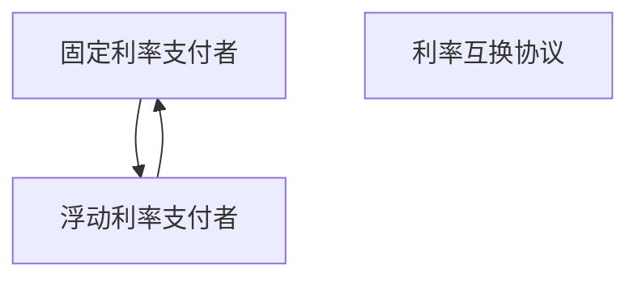
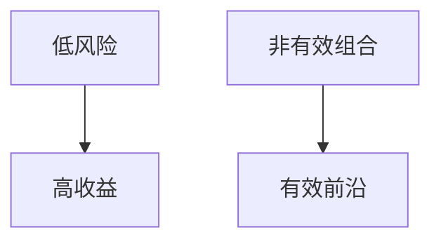
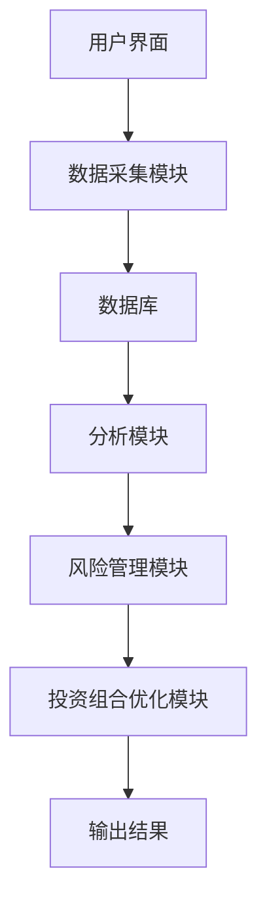
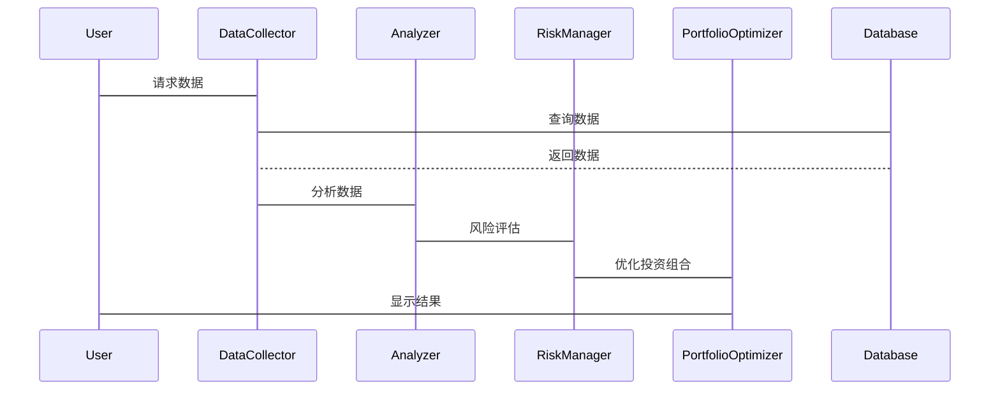

                 


# 格雷厄姆·多德的固定收益证券分析方法

> 关键词：固定收益证券、价值投资、风险管理、信用分析、投资组合优化

> 摘要：本文深入探讨了格雷厄姆·多德在固定收益证券分析领域的经典方法，结合现代投资理论，详细分析了固定收益证券的核心概念、分析方法、风险管理策略以及投资组合优化的实战案例。文章通过逻辑清晰的结构，系统性地介绍了如何运用格雷厄姆·多德的投资理念在当前市场环境下进行有效的固定收益证券分析与投资决策。

---

# 第一部分: 格雷厄姆·多德的固定收益证券分析方法基础

## 第1章: 固定收益证券的基本概念

### 1.1 固定收益证券的定义与特点

#### 1.1.1 固定收益证券的定义
固定收益证券是指那些能够提供固定或可预测现金流的金融工具，主要包括债券、优先股、中期票据等。这些证券的发行人承诺按固定时间表支付利息和本金，具有较高的确定性和较低的波动性。

#### 1.1.2 固定收益证券的核心特点
- **本金固定**：投资者在购买固定收益证券时，通常会获得明确的本金承诺。
- **利息固定**：利息支付通常按照预先约定的利率计算，确保投资者获得稳定的收益。
- **风险可控**：相对于股票等权益类资产，固定收益证券的风险较低，尤其在信用评级较高的情况下。

#### 1.1.3 固定收益证券的分类与外延
- **政府债券**：由政府发行，通常风险最低，收益稳定。
- **企业债券**：由企业发行，信用风险较高，但收益也相对更高。
- **抵押贷款相关证券**：基于抵押贷款池的证券化产品，如MBS和Mortgage Bonds。
- **其他固定收益工具**：包括可转换债券、优先股等。

### 1.2 格雷厄姆·多德投资理念的背景

#### 1.2.1 格雷厄姆与多德的投资哲学
本杰明·格雷厄姆和戴维·多德是价值投资的鼻祖，他们的投资理念强调以内在价值为导向，寻找市场价格低于内在价值的证券进行投资。格雷厄姆尤其偏爱固定收益证券，认为它们是实现长期稳健投资收益的重要工具。

#### 1.2.2 价值投资的核心理念
价值投资的核心在于寻找市场先生的错误定价。格雷厄姆强调安全边际的重要性，即在购买证券时，市场价格应显著低于其内在价值，从而为投资者提供足够的安全空间。

#### 1.2.3 固定收益证券在价值投资中的地位
格雷厄姆认为，固定收益证券是价值投资的重要组成部分，尤其是那些信用评级高、收益率合理的债券，能够在提供稳定收益的同时，为投资者的资产组合提供稳定性。

### 1.3 本章小结
本章介绍了固定收益证券的基本概念，强调了格雷厄姆·多德投资理念的核心思想，即通过分析债券的内在价值和市场价格差异，寻找具有安全边际的投资机会。

---

## 第2章: 固定收益证券的基本面分析

### 2.1 债务偿还能力的评估

#### 2.1.1 债务偿还能力的定义
债务偿还能力是指发行人在债券到期时，能够按时偿还本金和利息的能力。这一能力直接影响债券的信用评级和市场价格。

#### 2.1.2 主要财务指标分析
- **杠杆比率**：衡量公司负债与资产的比例，过高杠杆可能增加违约风险。
- **流动比率**：衡量公司短期偿债能力，通常大于2较为安全。
- **利息覆盖倍数**：衡量公司偿还利息的能力，通常要求倍数大于3。

#### 2.1.3 企业信用评级的影响
信用评级是衡量企业债务偿还能力的重要指标，通常由评级机构（如穆迪、标普）进行评估。评级越高，债券的风险越低，利率也越低。

### 2.2 利率风险的量化分析

#### 2.2.1 利率风险的定义与分类
利率风险是指债券价格因市场利率变化而产生波动的风险。主要分为再投资风险和价格风险两类。

#### 2.2.2 利率波动对债券价格的影响
债券价格与市场利率呈负相关关系。当市场利率上升时，债券价格下跌；反之，市场利率下降时，债券价格上涨。

#### 2.2.3 利率风险的度量方法
- **久期分析**：衡量债券价格对利率变化的敏感程度，久期越长，价格波动越大。
- **凸性分析**：考虑债券价格在利率变化时的非线性波动，凸性越高，久期分析越准确。

### 2.3 信用风险的评估与管理

#### 2.3.1 信用风险的定义与来源
信用风险是指债券发行人因财务状况恶化或违约而导致投资者损失的风险。主要来源包括企业经营不善、行业衰退、经济周期波动等。

#### 2.3.2 信用评级的分析方法
通过分析发行人的财务状况、行业地位、管理团队等因素，评估其信用风险。常用指标包括违约概率（PD）、违约损失率（LGD）等。

#### 2.3.3 信用风险的控制策略
- **分散投资**：通过投资不同发行人、不同行业的债券，降低信用风险。
- **设定信用门槛**：只投资于信用评级较高的债券，避免高风险债券。

### 2.4 本章小结
本章详细探讨了固定收益证券的基本面分析方法，重点分析了债务偿还能力、利率风险和信用风险，并提供了相应的度量和管理策略。

---

## 第3章: 固定收益证券的技术分析方法

### 3.1 技术分析的基本原理

#### 3.1.1 技术分析的定义与特点
技术分析是通过分析历史价格和成交量数据，预测未来价格走势的方法。其核心假设是市场行为包含一切信息。

#### 3.1.2 技术分析与基本面分析的区别
- **分析对象**：技术分析关注价格和成交量，基本面分析关注财务数据和行业因素。
- **分析方法**：技术分析注重图形和模式识别，基本面分析注重数据计算和模型构建。

#### 3.1.3 技术分析在固定收益证券中的应用
技术分析可以帮助投资者识别价格趋势、发现交易机会，尤其是在债券二级市场中。

### 3.2 常用的技术分析指标

#### 3.2.1 移动平均线（MA）
移动平均线是将一段时间内的价格平均值连接成的曲线，用于判断价格趋势。

```mermaid
graph TD
    MA5 -> "5日移动平均线"
    MA10 -> "10日移动平均线"
    MA20 -> "20日移动平均线"
```

#### 3.2.2 相对强弱指数（RSI）
RSI用于衡量价格的超买或超卖状态，通常在0-100之间波动。

```mermaid
graph TD
    RSI -> "相对强弱指数"
    RSI(30) -> "超卖区域"
    RSI(70) -> "超买区域"
```

#### 3.2.3 麦克劳林指标（MACD）
MACD用于判断价格趋势的变化，由短期和长期均线的差值组成。

```mermaid
graph TD
    MACD -> "MACD线"
    signal_line -> "信号线"
    MACD Histogram -> "MACD柱状图"
```

### 3.3 技术分析的应用策略

#### 3.3.1 技术分析在债券交易中的应用
- **趋势跟踪**：通过识别价格趋势，进行顺势交易。
- **支撑与阻力**：识别价格的支撑位和阻力位，制定买卖策略。

#### 3.3.2 技术分析与市场周期的关系
技术分析可以帮助投资者把握市场周期，例如在债券价格上涨趋势中进行波段操作。

#### 3.3.3 技术分析的局限性与改进方向
技术分析无法完全预测市场波动，尤其是在突发事件和极端情况下。因此，结合基本面分析和技术分析可以提高准确性。

### 3.4 本章小结
本章介绍了技术分析在固定收益证券中的应用，重点分析了移动平均线、RSI和MACD等常用指标，并探讨了其在实际交易中的策略应用。

---

## 第4章: 固定收益证券的风险管理与投资组合优化

### 4.1 风险管理的基本概念

#### 4.1.1 风险管理的定义与目标
风险管理是通过识别、评估和控制风险，以最小化潜在损失的过程。其目标是在风险可控的前提下，实现投资收益的最大化。

#### 4.1.2 风险管理的主要方法
- **风险分散**：通过投资多元化资产降低风险。
- **风险对冲**：通过衍生工具（如期货、期权）对冲价格波动风险。
- **风险规避**：通过选择低风险资产降低风险。

### 4.2 利率风险的对冲策略

#### 4.2.1 利率风险的对冲工具
- **利率期货**：通过期货市场对冲债券价格波动风险。
- **利率互换**：通过互换协议锁定固定或浮动利率。

#### 4.2.2 利率互换的原理与应用
利率互换是指双方约定在未来一定期限内，互相交换利息支付的协议。常用作对冲利率风险的工具。



#### 4.2.3 利率期货的原理与应用
利率期货是基于债券价格波动的衍生品，投资者可以通过做空或做多期货对冲价格波动风险。

### 4.3 信用风险的分散策略

#### 4.3.1 信用风险的分散方法
- **投资分散化**：通过投资不同发行人、不同行业的债券降低信用风险。
- **信用衍生品**：通过信用违约互换（CDS）等工具对冲信用风险。

#### 4.3.2 信用评级的分散策略
通过选择不同信用评级的债券，构建多元化的投资组合，降低信用风险。

### 4.4 投资组合优化策略

#### 4.4.1 投资组合优化的基本原理
投资组合优化是指通过调整资产配置，使得在给定风险水平下收益最大化，或在给定收益下风险最小化。

#### 4.4.2 马科维茨的有效前沿理论
马科维茨的有效前沿理论指出，最优投资组合应位于所有可能组合的前沿线上，该前沿线代表了在相同风险下收益最高或在相同收益下风险最小的组合。



#### 4.4.3 固定收益证券在投资组合中的作用
固定收益证券通常用于构建稳健的资产组合，尤其是在市场波动较大时提供稳定性收益。

### 4.5 本章小结
本章详细探讨了固定收益证券的风险管理策略，重点分析了利率风险和信用风险的对冲方法，并介绍了投资组合优化的基本原理和应用。

---

## 第5章: 固定收益证券分析方法的实战应用

### 5.1 实战案例分析

#### 5.1.1 案例背景介绍
假设我们面临一个固定收益证券投资组合的选择问题，目标是在风险可控的前提下，实现较高的投资收益。

#### 5.1.2 数据收集与处理
- **市场数据**：收集债券的市场价格、收益率、久期等数据。
- **信用数据**：收集债券的信用评级、违约概率等信息。

#### 5.1.3 分析与决策
- **基本面分析**：筛选信用评级高、收益率合理的债券。
- **技术分析**：识别价格趋势和交易机会。
- **风险管理**：构建多元化的投资组合，控制总体风险。

### 5.2 系统架构设计方案

#### 5.2.1 系统功能设计
- **数据采集模块**：收集市场数据和信用数据。
- **分析模块**：包括基本面分析和技术分析功能。
- **风险管理模块**：提供风险评估和对冲策略。
- **投资组合优化模块**：根据分析结果生成最优投资组合。

#### 5.2.2 系统架构设计


#### 5.2.3 系统接口设计
- **数据接口**：与数据源（如金融数据供应商）对接，获取实时市场数据。
- **用户接口**：提供友好的用户界面，方便用户进行操作和查询。

#### 5.2.4 系统交互流程


### 5.3 本章小结
本章通过实战案例和系统架构设计，展示了如何将格雷厄姆·多德的分析方法应用于实际投资中，构建高效、稳健的投资组合。

---

## 第6章: 固定收益证券分析的当前市场环境与未来趋势

### 6.1 当前市场环境分析

#### 6.1.1 全球经济与固定收益市场
当前全球经济不确定性增加，固定收益证券的需求上升，尤其是政府债券和高评级企业债券。

#### 6.1.2 低利率环境下的投资策略
在低利率环境下，固定收益投资者需要更加谨慎，寻找收益与风险的最佳平衡点。

### 6.2 未来趋势与展望

#### 6.2.1 数字化与智能化投资
随着人工智能和大数据技术的发展，固定收益证券的分析将更加依赖于算法和自动化工具。

#### 6.2.2 可持续投资与ESG因素
未来，可持续投资（ESG）将成为固定收益分析的重要组成部分，投资者将更加关注环保、社会责任等因素。

#### 6.2.3 全球化与多元化投资
随着全球市场的互联互通，投资者将更加注重跨国投资，分散化策略将更加重要。

### 6.3 本章小结
本章分析了固定收益证券分析的当前市场环境，并展望了未来的发展趋势，强调了技术创新和可持续投资的重要性。

---

## 第7章: 格雷厄姆·多德分析方法的现代应用与挑战

### 7.1 格雷厄姆·多德方法的现代应用

#### 7.1.1 量化分析与价值投资的结合
现代投资者可以通过量化模型，将格雷厄姆·多德的价值投资理念转化为可执行的交易策略。

#### 7.1.2 系统化投资策略
通过系统化的方法，将格雷厄姆·多德的分析方法应用于投资组合管理，提高投资效率和效果。

### 7.2 现实挑战与解决方案

#### 7.2.1 市场环境的变化
随着市场环境的变化，固定收益证券的分析需要不断调整和优化。

#### 7.2.2 技术进步的推动
技术进步为固定收益证券的分析提供了新的工具和方法，但也带来了新的挑战。

### 7.3 本章小结
本章总结了格雷厄姆·多德分析方法的现代应用，并探讨了在实际投资中面临的挑战和解决方案。

---

## 第8章: 格雷厄姆·多德固定收益证券分析方法的总结与展望

### 8.1 本研究的主要结论

#### 8.1.1 核心观点总结
- 格雷厄姆·多德的价值投资理念在固定收益证券分析中具有重要的现实意义。
- 综合运用基本面分析和风险管理策略，可以有效提高投资收益和降低风险。

#### 8.1.2 方法论总结
- 通过系统的分析方法和优化的投资组合策略，可以在固定收益证券市场中实现稳健投资。

### 8.2 未来研究方向

#### 8.2.1 技术创新与应用
进一步研究人工智能和大数据技术在固定收益证券分析中的应用。

#### 8.2.2 市场动态与策略调整
根据市场环境的变化，不断优化分析方法和投资策略。

#### 8.2.3 全球化与多元化投资
探索跨国投资和多元化资产配置的策略，降低整体投资风险。

### 8.3 本章小结
本章总结了格雷厄姆·多德固定收益证券分析方法的核心观点，并展望了未来的研究方向和投资策略。

---

## 作者：AI天才研究院/AI Genius Institute & 禅与计算机程序设计艺术 /Zen And The Art of Computer Programming

---

这篇文章通过系统性地介绍格雷厄姆·多德的固定收益证券分析方法，结合现代投资理论和实际案例，为投资者提供了全面的指导和启示。文章内容详实，结构清晰，既有理论分析，又有实战应用，适合广大投资从业者和爱好者阅读参考。

