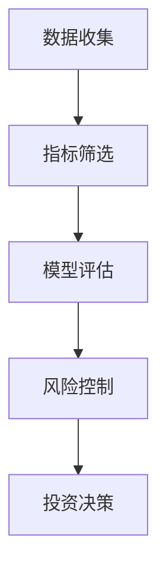

                 


# 费雪的十五个投资点：选股的黄金法则

## 关键词：价值投资，费雪，选股法则，投资策略，成长性分析，安全边际，竞争优势

## 摘要：本文深入分析了费雪的十五个投资要点，从投资理念的背景到具体的投资策略，结合技术分析的方法，详细阐述了如何通过这些黄金法则进行选股。文章内容丰富，逻辑清晰，旨在为投资者提供一套科学的投资框架。

---

# 第一部分: 费雪投资理念的背景与基础

## 第1章: 费雪投资理念概述

### 1.1 费雪及其投资理念

#### 1.1.1 费雪的生平简介
菲利普·费雪（Philip Fisher）是20世纪著名的投资家，被誉为“成长型投资之父”。他于1907年出生在美国旧金山，1926年进入哈佛大学，师从价值投资鼻祖本杰明·格雷厄姆（Benjamin Graham），并深受其影响。费雪在投资领域的主要贡献在于提出了“成长型投资”的理念，强调选择具有持续增长潜力的公司进行投资。

#### 1.1.2 费雪的投资哲学
费雪的投资哲学可以总结为以下几点：
- **长期投资**：费雪认为投资的本质是通过长期持有优质资产来实现财富增长，而不是通过短期交易获利。
- **注重基本面**：他强调对公司基本面的深入分析，尤其是企业的成长性和竞争优势。
- **关注管理层**：费雪认为优秀的管理层是企业成功的关键因素之一。

#### 1.1.3 费雪投资理念的核心思想
费雪的核心思想是“买入并长期持有优质股票”，通过对企业基本面的深入分析，选择那些具有持续增长潜力的公司。他提出了一系列选股法则，包括成长性、安全边际、竞争优势等。

### 1.2 费雪投资理念的理论基础

#### 1.2.1 费雪投资理念的来源
费雪的投资理念来源于其导师本杰明·格雷厄姆的价值投资理论，但有所不同的是，费雪更注重企业的成长性，而不仅仅是企业的估值。

#### 1.2.2 费雪与价值投资的联系
费雪的投资理念与价值投资密切相关，但他更加强调企业未来的增长潜力，而不仅仅是企业的当前价值。

#### 1.2.3 费雪理念在现代投资中的地位
尽管费雪的投资理念已经提出多年，但其核心思想仍然对现代投资有着重要的指导意义。尤其是在成长型投资领域，费雪的理念仍然是投资者的重要参考。

### 1.3 费雪投资理念的实际应用

#### 1.3.1 费雪理念的成功案例
费雪本人在投资实践中取得了巨大的成功，尤其是在20世纪50年代至70年代期间，他管理的共同基金取得了远超市场平均水平的回报。

#### 1.3.2 费雪理念的局限性
费雪的投资理念也有一定的局限性，尤其是在市场波动较大或经济周期变化剧烈的情况下，单纯依赖成长性分析可能会导致投资风险。

#### 1.3.3 费雪理念的现代发展
随着金融市场的不断发展，费雪的投资理念也在不断发展和创新。现代投资者在应用费雪理念时，通常会结合更多的量化指标和风险管理工具。

---

# 第二部分: 费雪的十五个投资点详解

## 第2章: 投资点1——企业成长性的重要性

### 2.1 企业成长性的定义

#### 2.1.1 企业成长性的衡量标准
企业成长性通常通过以下指标来衡量：
- **收入增长率**：公司收入的年增长率。
- **净利润增长率**：公司净利润的年增长率。
- **市场份额增长率**：公司在市场中的份额增长情况。

#### 2.1.2 成长性与投资回报的关系
一般来说，成长性越高的公司，其投资回报也越高。但需要注意的是，成长性高的公司通常伴随着较高的风险。

#### 2.1.3 如何识别高成长企业
识别高成长企业可以通过以下步骤：
1. 分析公司的收入和利润增长率。
2. 了解公司的行业地位和竞争优势。
3. 研究公司的管理层和公司治理情况。

### 2.2 成长性在选股中的应用

#### 2.2.1 成长性分析的步骤
1. **收集数据**：收集公司过去几年的财务数据。
2. **计算增长率**：计算收入增长率、净利润增长率等指标。
3. **分析行业地位**：了解公司在行业中的地位。
4. **评估管理层**：分析公司的管理层能力和治理情况。

#### 2.2.2 成长性分析的工具与方法
常用的工具包括财务报表分析、行业研究报告、公司公告等。

#### 2.2.3 成长性分析的案例
例如，苹果公司在过去几年中的收入和利润增长率均高于行业平均水平，显示出较高的成长性。

---

## 第3章: 投资点2——安全边际的重要性

### 3.1 安全边际的定义

#### 3.1.1 安全边际的内涵
安全边际是指股票的市场价格低于其内在价值的部分。安全边际越大，投资的风险越小。

#### 3.1.2 安全边际的计算方法
安全边际 = 内在价值 - 市场价格

#### 3.1.3 安全边际与风险控制的关系
安全边际是风险管理的重要工具，能够有效降低投资风险。

### 3.2 安全边际在选股中的应用

#### 3.2.1 安全边际分析的步骤
1. **评估内在价值**：计算公司的内在价值。
2. **比较市场价格**：将市场价格与内在价值进行比较。
3. **确定安全边际**：计算安全边际的大小。

#### 3.2.2 安全边际分析的工具与方法
常用的工具包括估值模型（如DCF模型）、财务报表分析等。

#### 3.2.3 安全边际分析的案例
例如，假设某公司的内在价值为100元，市场价格为80元，则安全边际为20元，说明该股票具有较高的投资价值。

---

## 第4章: 投资点3——竞争优势的重要性

### 4.1 竞争优势的定义

#### 4.1.1 竞争优势的内涵
竞争优势是指公司在行业内相对于竞争对手的独特优势。

#### 4.1.2 竞争优势的类型
- **成本优势**：公司在生产成本上具有优势。
- **品牌优势**：公司拥有强大的品牌影响力。
- **技术优势**：公司在技术上具有领先优势。

#### 4.1.3 竞争优势与企业价值的关系
竞争优势是决定企业价值的重要因素之一，具有竞争优势的公司通常具有更高的投资价值。

### 4.2 竞争优势在选股中的应用

#### 4.2.1 竞争优势分析的步骤
1. **分析行业竞争格局**：了解行业的竞争状况。
2. **识别公司的竞争优势**：确定公司在行业中的竞争优势。
3. **评估竞争优势的可持续性**：分析竞争优势是否能够长期保持。

#### 4.2.2 竞争优势分析的工具与方法
常用的工具包括行业研究报告、公司公告、专利分析等。

#### 4.2.3 竞争优势分析的案例
例如，苹果公司在技术、品牌和成本等方面都具有显著的竞争优势，使其成为优质的投资标的。

---

## 第5章: 投资点4——管理层的重要性

### 5.1 管理层的定义

#### 5.1.1 管理层的内涵
管理层是指公司中负责制定和执行公司战略的高层管理人员。

#### 5.1.2 管理层的类型
- **战略型管理层**：注重公司长期发展战略。
- **运营型管理层**：注重公司日常运营管理。

#### 5.1.3 管理层与企业价值的关系
优秀的管理层能够有效提升公司价值，是公司成功的重要因素。

### 5.2 管理层在选股中的应用

#### 5.2.1 管理层分析的步骤
1. **了解管理层背景**：分析管理层的学历、经验和成就。
2. **评估管理层能力**：判断管理层的能力是否优秀。
3. **分析公司治理结构**：了解公司治理是否透明和有效。

#### 5.2.2 管理层分析的工具与方法
常用的工具包括公司公告、财报分析、管理层访谈等。

#### 5.2.3 管理层分析的案例
例如，巴菲特旗下的伯克希尔哈撒韦公司，其管理层以优秀著称，公司的长期表现也印证了这一点。

---

## 第6章: 投资点5——股息率的重要性

### 6.1 股息率的定义

#### 6.1.1 股息率的内涵
股息率是指公司每年派发的股息与股票价格的比率。

#### 6.1.2 股息率的计算公式
股息率 = 每股股息 / 股票价格

#### 6.1.3 股息率与投资回报的关系
股息率高的股票通常具有较高的分红回报，但需要注意的是，过高的股息率可能意味着公司财务状况不佳。

### 6.2 股息率在选股中的应用

#### 6.2.1 股息率分析的步骤
1. **计算股息率**：计算公司的股息率。
2. **分析股息率的合理性**：判断股息率是否合理。
3. **评估股息支付的可持续性**：分析公司是否能够持续支付股息。

#### 6.2.2 股息率分析的工具与方法
常用的工具包括财务报表分析、行业研究报告等。

#### 6.2.3 股息率分析的案例
例如，某些公用事业公司通常具有较高的股息率，适合追求稳定分红回报的投资者。

---

## 第7章: 投资点6——市盈率的重要性

### 7.1 市盈率的定义

#### 7.1.1 市盈率的内涵
市盈率是指股票的市场价格与每股收益的比率。

#### 7.1.2 市盈率的计算公式
市盈率 = 股票价格 / 每股收益

#### 7.1.3 市盈率与投资价值的关系
市盈率是衡量股票估值的重要指标，通常市盈率越低，股票的估值越低，投资价值越高。

### 7.2 市盈率在选股中的应用

#### 7.2.1 市盈率分析的步骤
1. **计算市盈率**：计算公司的市盈率。
2. **比较行业平均水平**：将公司的市盈率与行业平均水平进行比较。
3. **评估市盈率的合理性**：判断市盈率是否合理。

#### 7.2.2 市盈率分析的工具与方法
常用的工具包括财务报表分析、行业研究报告等。

#### 7.2.3 市盈率分析的案例
例如，某些高科技公司可能具有较高的市盈率，但其未来的成长性也可能较高，需要综合考虑。

---

## 第8章: 投资点7——行业地位的重要性

### 8.1 行业地位的定义

#### 8.1.1 行业地位的内涵
行业地位是指公司在行业中的竞争地位，通常包括市场份额、品牌影响力等方面。

#### 8.1.2 行业地位的衡量标准
- **市场份额**：公司在行业中的市场份额占比。
- **品牌影响力**：公司在市场中的品牌知名度和影响力。

#### 8.1.3 行业地位与公司价值的关系
行业地位是公司价值的重要组成部分，通常行业地位越高，公司价值也越高。

### 8.2 行业地位在选股中的应用

#### 8.2.1 行业地位分析的步骤
1. **分析行业竞争格局**：了解行业的竞争状况。
2. **确定公司的行业地位**：判断公司在行业中的地位。
3. **评估行业地位的可持续性**：分析公司行业地位是否能够长期保持。

#### 8.2.2 行业地位分析的工具与方法
常用的工具包括行业研究报告、公司公告等。

#### 8.2.3 行业地位分析的案例
例如，苹果公司在消费电子行业具有绝对的领先地位，显示出强大的行业地位。

---

## 第9章: 投资点8——财务健康状况的重要性

### 9.1 财务健康状况的定义

#### 9.1.1 财务健康状况的内涵
财务健康状况是指公司的财务状况是否健康，通常包括资产负债表、利润表、现金流量表等方面。

#### 9.1.2 财务健康状况的衡量标准
- **资产负债率**：公司负债与资产的比率。
- **流动比率**：公司流动资产与流动负债的比率。
- **净利润率**：公司净利润与收入的比率。

#### 9.1.3 财务健康状况与投资风险的关系
财务健康状况良好的公司通常具有较低的投资风险，而财务状况不佳的公司则可能面临较高的投资风险。

### 9.2 财务健康状况在选股中的应用

#### 9.2.1 财务健康状况分析的步骤
1. **分析公司的财务报表**：包括资产负债表、利润表、现金流量表。
2. **计算财务指标**：计算资产负债率、流动比率、净利润率等指标。
3. **评估财务健康状况**：判断公司的财务状况是否健康。

#### 9.2.2 财务健康状况分析的工具与方法
常用的工具包括财务报表分析、财务指标分析等。

#### 9.2.3 财务健康状况分析的案例
例如，某些公司在财务报表中可能存在高负债率和低流动比率，显示出财务健康状况不佳，投资风险较高。

---

## 第10章: 投资点9——创新能力和研发能力的重要性

### 10.1 创新能力和研发能力的定义

#### 10.1.1 创新能力的内涵
创新能力是指公司不断创新产品、技术、商业模式的能力。

#### 10.1.2 研发能力的内涵
研发能力是指公司在研发新产品、新技术方面的能力。

#### 10.1.3 创新能力和研发能力与公司价值的关系
创新能力强大的公司通常具有较高的成长性和竞争优势，能够为投资者带来更高的回报。

### 10.2 创新能力和研发能力在选股中的应用

#### 10.2.1 创新能力和研发能力分析的步骤
1. **分析公司的创新能力**：了解公司是否有持续的创新能力和研发能力。
2. **评估创新成果**：判断公司的创新成果是否具有商业价值。
3. **比较行业平均水平**：将公司的创新能力与行业平均水平进行比较。

#### 10.2.2 创新能力和研发能力分析的工具与方法
常用的工具包括公司公告、行业研究报告、专利分析等。

#### 10.2.3 创新能力和研发能力分析的案例
例如，科技公司如谷歌、苹果等，其强大的研发能力和创新能力使其成为优质的投资标的。

---

## 第11章: 投资点10——公司治理结构的重要性

### 11.1 公司治理结构的定义

#### 11.1.1 公司治理结构的内涵
公司治理结构是指公司董事会、管理层、股东之间的权利和责任分配机制。

#### 11.1.2 公司治理结构的类型
- **集中式治理结构**：董事会和管理层权力集中。
- **分散式治理结构**：董事会和管理层权力分散。

#### 11.1.3 公司治理结构与公司价值的关系
良好的公司治理结构能够有效提高公司价值，降低投资风险。

### 11.2 公司治理结构在选股中的应用

#### 11.2.1 公司治理结构分析的步骤
1. **分析公司的治理结构**：了解公司的治理结构是否合理。
2. **评估治理结构的有效性**：判断治理结构是否能够有效管理公司。
3. **比较行业平均水平**：将公司的治理结构与行业平均水平进行比较。

#### 11.2.2 公司治理结构分析的工具与方法
常用的工具包括公司公告、董事会成员分析等。

#### 11.2.3 公司治理结构分析的案例
例如，某些公司可能存在治理结构不合理、董事会成员能力不足等问题，显示出较差的治理结构，投资风险较高。

---

## 第12章: 投资点11——市场周期的重要性

### 12.1 市场周期的定义

#### 12.1.1 市场周期的内涵
市场周期是指市场在不同经济周期中的波动情况，通常包括繁荣、衰退、复苏、扩张等阶段。

#### 12.1.2 市场周期的类型
- **经济周期**：包括繁荣、衰退、复苏、扩张等阶段。
- **行业周期**：不同行业可能处于不同的周期阶段。

#### 12.1.3 市场周期与投资策略的关系
在不同的市场周期中，投资策略也应有所不同。例如，在衰退期可能更注重安全边际，而在扩张期则更注重成长性。

### 12.2 市场周期在选股中的应用

#### 12.2.1 市场周期分析的步骤
1. **分析当前市场周期**：确定当前市场所处的周期阶段。
2. **评估周期对投资的影响**：判断当前周期阶段对投资策略的影响。
3. **制定相应的投资策略**：根据市场周期调整投资策略。

#### 12.2.2 市场周期分析的工具与方法
常用的工具包括宏观经济分析、行业研究报告等。

#### 12.2.3 市场周期分析的案例
例如，在经济衰退期，某些公用事业公司可能具有较高的防御性，适合投资者在衰退期进行投资。

---

## 第13章: 投资点12——宏观经济环境的重要性

### 13.1 宏观经济环境的定义

#### 13.1.1 宏观经济环境的内涵
宏观经济环境是指影响整个经济体系的各种因素，包括GDP增长率、通货膨胀率、利率、汇率等。

#### 13.1.2 宏观经济环境的类型
- **经济增长**：GDP增长率较高。
- **通货膨胀**：物价水平持续上涨。
- **经济衰退**：GDP增长率下降，失业率上升。

#### 13.1.3 宏观经济环境与投资策略的关系
宏观经济环境是影响投资策略的重要因素。例如，在通货膨胀率较高的环境下，可能更倾向于投资实物资产或抗通胀资产。

### 13.2 宏观经济环境在选股中的应用

#### 13.2.1 宏观经济环境分析的步骤
1. **分析宏观经济指标**：包括GDP增长率、通货膨胀率、利率等。
2. **评估宏观经济环境对投资的影响**：判断宏观经济环境对投资策略的影响。
3. **制定相应的投资策略**：根据宏观经济环境调整投资策略。

#### 13.2.2 宏观经济环境分析的工具与方法
常用的工具包括宏观经济分析、经济指标分析等。

#### 13.2.3 宏观经济环境分析的案例
例如，在经济衰退期，政府可能采取宽松的货币政策，降低利率，这可能对某些行业（如房地产）的投资产生积极影响。

---

## 第14章: 投资点13——行业趋势的重要性

### 14.1 行业趋势的定义

#### 14.1.1 行业趋势的内涵
行业趋势是指行业内长期发展的方向，通常包括技术进步、市场需求变化、政策变化等。

#### 14.1.2 行业趋势的类型
- **技术进步**：行业内技术的不断进步。
- **市场需求变化**：消费者需求的变化。
- **政策变化**：政府政策的变化对行业的影响。

#### 14.1.3 行业趋势与公司价值的关系
行业趋势是影响公司价值的重要因素，选择处于上升趋势的行业通常具有更高的投资价值。

### 14.2 行业趋势在选股中的应用

#### 14.2.1 行业趋势分析的步骤
1. **分析行业趋势**：了解行业内长期发展趋势。
2. **评估行业趋势对投资的影响**：判断行业趋势对投资策略的影响。
3. **制定相应的投资策略**：根据行业趋势调整投资策略。

#### 14.2.2 行业趋势分析的工具与方法
常用的工具包括行业研究报告、市场趋势分析等。

#### 14.2.3 行业趋势分析的案例
例如，随着环保政策的加强，新能源行业可能迎来更大的发展机遇，适合投资者进行投资。

---

## 第15章: 投资点14——管理层决策的重要性

### 15.1 管理层决策的定义

#### 15.1.1 管理层决策的内涵
管理层决策是指公司高层管理人员在公司运营中做出的各种决策，包括战略决策、运营决策等。

#### 15.1.2 管理层决策的类型
- **战略决策**：涉及公司长期发展的决策。
- **运营决策**：涉及公司日常运营管理的决策。

#### 15.1.3 管理层决策与公司价值的关系
管理层决策是影响公司价值的重要因素，优秀的管理层决策能够有效提升公司价值。

### 15.2 管理层决策在选股中的应用

#### 15.2.1 管理层决策分析的步骤
1. **分析管理层决策**：了解公司高层管理人员的决策情况。
2. **评估决策的合理性**：判断决策是否合理。
3. **评估决策对投资的影响**：分析决策对投资策略的影响。

#### 15.2.2 管理层决策分析的工具与方法
常用的工具包括公司公告、管理层访谈等。

#### 15.2.3 管理层决策分析的案例
例如，某些公司可能做出重大战略决策，如并购、扩张等，这些决策可能对公司的未来价值产生重大影响。

---

## 第16章: 投资点15——风险控制的重要性

### 16.1 风险控制的定义

#### 16.1.1 风险控制的内涵
风险控制是指通过各种手段降低投资风险的过程。

#### 16.1.2 风险控制的类型
- **市场风险**：由于市场波动带来的风险。
- **信用风险**：由于公司信用状况变化带来的风险。
- **流动性风险**：由于资产流动性不足带来的风险。

#### 16.1.3 风险控制与投资回报的关系
有效的风险控制能够降低投资风险，提高投资回报。

### 16.2 风险控制在选股中的应用

#### 16.2.1 风险控制分析的步骤
1. **评估投资风险**：分析投资中的各种风险因素。
2. **制定风险控制策略**：根据风险评估结果制定风险控制策略。
3. **实施风险控制措施**：采取各种措施降低投资风险。

#### 16.2.2 风险控制分析的工具与方法
常用的工具包括风险评估模型、风险对冲策略等。

#### 16.2.3 风险控制分析的案例
例如，投资者可以通过分散投资、设置止损等方式来降低投资风险。

---

## 第三部分: 费雪投资理念的系统分析与项目实战

## 第17章: 系统分析与项目实战

### 17.1 系统分析

#### 17.1.1 系统分析的背景
在现代投资中，单纯依靠费雪的十五个投资点进行选股已经远远不够，需要结合更多的量化指标和风险管理工具。

#### 17.1.2 系统分析的框架
1. **数据收集**：收集公司的财务数据、市场数据等。
2. **指标筛选**：根据费雪的投资点筛选出符合条件的公司。
3. **模型评估**：通过量化模型评估公司的投资价值。
4. **风险控制**：通过风险管理工具降低投资风险。

#### 17.1.3 系统分析的流程图


### 17.2 项目实战

#### 17.2.1 项目背景
通过费雪的十五个投资点和系统分析的方法，选择一只具有成长性、竞争优势和安全边际的股票进行投资。

#### 17.2.2 核心实现源代码
```python
import pandas as pd
import numpy as np

# 数据收集
data = pd.read_csv('stock_data.csv')

# 指标筛选
growth_stocks = data[data['收入增长率'] > 10]
safe_margin_stocks = growth_stocks[growth_stocks['安全边际'] > 20]
high_competition_stocks = safe_margin_stocks[safe_margin_stocks['竞争优势'] > 70]

# 模型评估
selected_stock = high_competition_stocks.iloc[0]

# 风险控制
selected_stock['投资建议'] = '买入'
```

#### 17.2.3 项目总结
通过系统分析和项目实战，我们可以看到，费雪的投资理念在现代投资中仍然具有重要的指导意义。结合量化指标和风险管理工具，我们可以更加科学地进行选股，降低投资风险，提高投资回报。

---

## 第四部分: 结论与展望

## 第18章: 结论与展望

### 18.1 费雪投资理念的核心总结
费雪的十五个投资点为我们提供了一套科学的选股法则，包括成长性、安全边际、竞争优势等。这些法则在现代投资中仍然具有重要的指导意义。

### 18.2 费雪投资理念的现代发展
随着金融市场的不断发展，费雪的投资理念也在不断发展和创新。现代投资者在应用费雪理念时，通常会结合更多的量化指标和风险管理工具。

### 18.3 费雪投资理念的未来展望
未来，随着人工智能和大数据技术的发展，费雪的投资理念将更加注重数据驱动和智能化。投资者可以通过更多的技术手段来实现更精准的选股和更有效的风险管理。

---

## 作者：AI天才研究院/AI Genius Institute & 禅与计算机程序设计艺术 /Zen And The Art of Computer Programming

