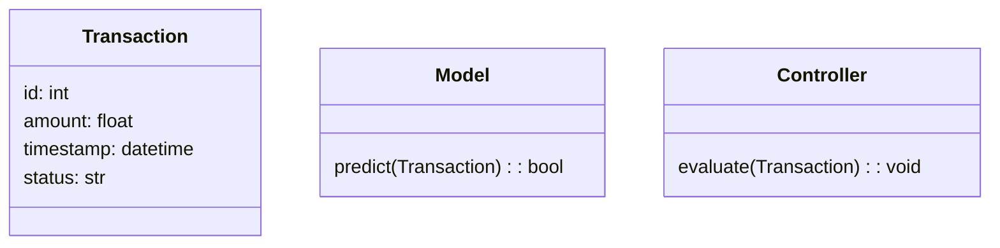
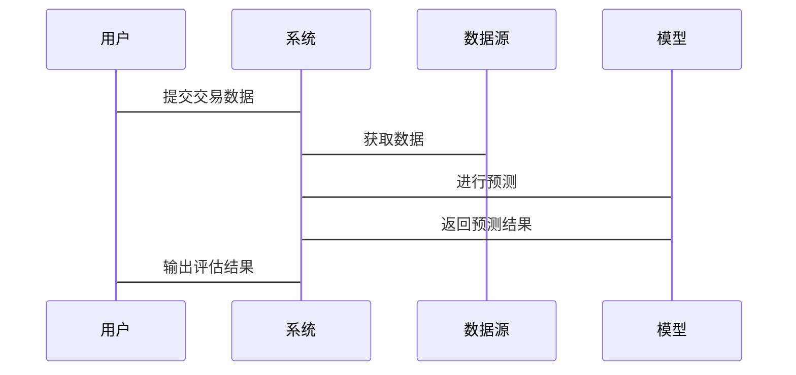

                 


# 《金融监管科技合规性评估》

---

## 关键词：金融监管科技（RegTech）、合规性评估、人工智能、大数据、区块链、机器学习

---

## 摘要：

本文深入探讨金融监管科技（RegTech）领域的合规性评估问题，分析其核心概念、技术原理及实际应用。文章从背景介绍出发，详细阐述了金融监管科技的基本概念与发展背景，随后重点分析了合规性评估的核心要素与实现机制。在技术实现部分，本文基于监督学习算法，结合Python代码和数学公式，详细讲解了合规性评估的算法原理。最后，通过系统架构设计与项目实战案例，展示了如何将理论应用于实践，确保金融监管科技在合规性评估中的高效与准确。

---

# 第一部分: 金融监管科技合规性评估背景介绍

## 第1章: 金融监管科技的基本概念

### 1.1 金融监管科技的定义与特点

#### 1.1.1 金融监管科技的定义

金融监管科技（RegTech）是指利用新兴技术手段，如人工智能、大数据和区块链等，来提高金融监管效率和效果的一系列技术与方法。其核心目标是通过技术创新，简化监管流程，降低合规成本，同时确保金融系统的安全与稳定。

#### 1.1.2 金融监管科技的核心特点

- **技术驱动**：依赖于大数据、人工智能和区块链等先进技术。
- **合规导向**：专注于确保金融机构的业务活动符合相关法律法规。
- **实时性**：能够实时监控和分析金融数据，快速识别潜在风险。
- **智能化**：通过机器学习等技术，实现自动化监管和智能决策。

#### 1.1.3 金融监管科技与传统监管的区别

传统金融监管主要依赖人工审核和事后监管，效率较低且成本较高。而金融监管科技通过技术手段实现了事前预警、实时监控和自动化处理，显著提升了监管效率和精准度。

---

### 1.2 金融监管科技的发展背景

#### 1.2.1 金融科技的快速发展

近年来，金融科技（FinTech）的快速发展推动了金融行业的数字化转型。金融机构 increasingly rely on technology to improve efficiency, but this also brings new compliance challenges.

#### 1.2.2 监管需求的日益增长

随着金融市场的复杂化，监管机构对金融机构的合规要求日益严格。传统监管手段已难以应对新型金融产品和业务模式的监管需求。

#### 1.2.3 金融监管科技的兴起

为应对上述挑战，金融监管科技应运而生。它利用技术手段帮助监管机构和金融机构更高效地实现合规目标。

---

## 第2章: 合规性评估的基本概念

### 2.1 合规性评估的定义与特点

#### 2.1.1 合规性评估的定义

合规性评估是指通过技术手段对金融机构的业务活动进行检查，确保其符合相关法律法规和监管要求的过程。

#### 2.1.2 合规性评估的核心要素

- **法律法规**：确保业务活动符合国家和地区的金融法规。
- **监管要求**：满足监管机构的具体要求。
- **业务风险**：识别和评估业务中的潜在风险。

#### 2.1.3 合规性评估与监管的关系

合规性评估是金融监管的重要组成部分，它通过技术手段帮助监管机构实现高效监管，同时也能帮助金融机构降低合规成本。

---

### 2.2 金融监管科技合规性评估的重要性

#### 2.2.1 保障金融系统的安全与稳定

通过合规性评估，可以及时发现和纠正金融机构的违规行为，从而保障金融系统的安全与稳定。

#### 2.2.2 提升金融机构的合规效率

金融监管科技的应用可以显著提升合规性评估的效率，减少人工干预，降低合规成本。

#### 2.2.3 促进金融创新与合规的平衡

金融监管科技能够快速适应金融创新的需求，确保金融机构在合规的前提下进行创新。

---

# 第二部分: 金融监管科技合规性评估的核心概念与联系

## 第3章: 金融监管科技的核心原理

### 3.1 金融监管科技的主要技术

#### 3.1.1 大数据技术

大数据技术在金融监管科技中的应用主要体现在数据采集、存储和分析方面。通过大数据技术，可以快速处理海量金融数据，发现潜在风险。

#### 3.1.2 人工智能技术

人工智能技术，特别是机器学习，被广泛应用于金融监管科技中的风险识别、预测和合规性评估。

#### 3.1.3 区块链技术

区块链技术通过去中心化和不可篡改的特性，为金融监管科技提供了更高的透明度和安全性。

---

### 3.2 金融监管科技的实现机制

#### 3.2.1 数据采集与处理

金融监管科技的第一步是采集相关的金融数据，包括交易数据、客户信息等。这些数据需要经过清洗和预处理，以便后续分析。

#### 3.2.2 智能分析与决策

通过机器学习等人工智能技术，对预处理后的数据进行分析，识别潜在的合规风险，并生成相应的决策建议。

#### 3.2.3 结果输出与反馈

将分析结果输出给监管机构或金融机构，并根据反馈不断优化模型，提升合规性评估的准确性。

---

## 第4章: 合规性评估的核心要素

### 4.1 合规性评估的主要指标

#### 4.1.1 合规性评估的范围

合规性评估的范围包括金融机构的所有业务活动，从交易处理到客户身份识别等。

#### 4.1.2 合规性评估的标准

合规性评估需要遵循相关法律法规和监管要求，确保金融机构的业务活动合法合规。

#### 4.1.3 合规性评估的流程

合规性评估的流程通常包括数据采集、风险识别、评估分析和结果反馈等步骤。

---

### 4.2 金融监管科技合规性评估的特殊性

#### 4.2.1 金融数据的敏感性

金融数据往往涉及客户的隐私信息，合规性评估需要在保护数据隐私的前提下进行。

#### 4.2.2 金融监管的严格性

金融监管要求严格，合规性评估需要确保金融机构的业务活动符合所有相关法律法规。

#### 4.2.3 金融创新的合规挑战

金融创新往往伴随着新的合规挑战，金融监管科技需要能够快速适应这些变化。

---

# 第三部分: 金融监管科技合规性评估的算法原理

## 第5章: 机器学习在合规性评估中的应用

### 5.1 机器学习的基本原理

#### 5.1.1 机器学习的定义

机器学习是一种人工智能技术，通过数据训练模型，使其能够从经验中学习并做出预测或决策。

#### 5.1.2 机器学习的分类

- **监督学习**：基于标记的数据进行训练，预测新数据的标签。
- **无监督学习**：基于未标记的数据进行训练，发现数据中的模式。
- **强化学习**：通过与环境交互，学习最优策略。

#### 5.1.3 机器学习的核心算法

- **线性回归**：用于预测连续型变量。
- **支持向量机（SVM）**：用于分类和回归。
- **随机森林**：用于分类和回归。

---

### 5.2 监督学习在合规性评估中的应用

#### 5.2.1 监督学习的定义

监督学习是一种机器学习方法，通过标记的训练数据训练模型，使其能够预测新数据的标签。

#### 5.2.2 监督学习的流程

1. 数据采集与预处理。
2. 模型训练。
3. 模型评估。
4. 模型部署。

#### 5.2.3 监督学习在合规性评估中的实现

通过监督学习算法，可以对金融交易进行分类，识别异常交易行为，从而评估其合规性。

---

## 第6章: 基于监督学习的合规性评估算法

### 6.1 算法原理

#### 6.1.1 线性回归模型

线性回归是一种简单的监督学习算法，适用于连续型变量的预测。

$$ y = \beta_0 + \beta_1 x + \epsilon $$

其中，$y$ 是目标变量，$x$ 是自变量，$\beta_0$ 和 $\beta_1$ 是模型参数，$\epsilon$ 是误差项。

#### 6.1.2 支持向量机模型

支持向量机（SVM）是一种强大的分类算法，适用于高维数据。

$$ \text{目标函数} = \min_{\beta, \beta_0} \frac{1}{2} \|\beta\|^2 + C \sum_{i=1}^n \max(0, 1 - y_i (\beta \cdot x_i + \beta_0)) $$

其中，$C$ 是惩罚系数，$y_i$ 是标签，$x_i$ 是输入数据。

#### 6.1.3 随机森林模型

随机森林是一种基于树的集成算法，适用于分类和回归。

### 6.2 算法实现

#### 6.2.1 数据预处理

```python
import pandas as pd
from sklearn.model_selection import train_test_split
from sklearn.preprocessing import StandardScaler

# 加载数据
data = pd.read_csv('financial_data.csv')

# 分割特征与目标变量
X = data.drop('label', axis=1)
y = data['label']

# 数据标准化
scaler = StandardScaler()
X_scaled = scaler.fit_transform(X)

# 分割训练集与测试集
X_train, X_test, y_train, y_test = train_test_split(X_scaled, y, test_size=0.2, random_state=42)
```

#### 6.2.2 模型训练

```python
from sklearn.ensemble import RandomForestClassifier

# 初始化模型
model = RandomForestClassifier(n_estimators=100, random_state=42)

# 训练模型
model.fit(X_train, y_train)
```

#### 6.2.3 模型评估

```python
from sklearn.metrics import accuracy_score, classification_report

# 预测测试集
y_pred = model.predict(X_test)

# 评估指标
print("Accuracy:", accuracy_score(y_test, y_pred))
print(classification_report(y_test, y_pred))
```

---

### 6.3 算法应用

通过上述算法，可以对金融交易进行分类，识别异常交易行为，从而评估其合规性。例如，可以使用随机森林模型对一笔交易进行分类，判断其是否符合合规要求。

---

# 第四部分: 金融监管科技合规性评估的系统架构设计

## 第7章: 系统分析与架构设计方案

### 7.1 问题场景介绍

本文将设计一个基于监督学习的合规性评估系统，用于对金融机构的交易数据进行实时监控和合规性评估。

### 7.2 系统功能设计

#### 7.2.1 领域模型



#### 7.2.2 系统架构


#### 7.2.3 系统接口设计

- 数据输入接口：接收交易数据。
- 模型接口：提供预测服务。
- 结果输出接口：返回评估结果。

#### 7.2.4 系统交互设计



---

## 第8章: 项目实战

### 8.1 环境安装

#### 8.1.1 安装Python环境

```bash
python --version
pip install -r requirements.txt
```

#### 8.1.2 安装相关库

```bash
pip install numpy
pip install pandas
pip install scikit-learn
```

### 8.2 系统核心实现

#### 8.2.1 核心代码实现

```python
import pandas as pd
from sklearn.ensemble import RandomForestClassifier
from sklearn.metrics import accuracy_score

# 加载数据
data = pd.read_csv('financial_data.csv')

# 分割特征与目标变量
X = data.drop('label', axis=1)
y = data['label']

# 数据标准化
from sklearn.preprocessing import StandardScaler
scaler = StandardScaler()
X_scaled = scaler.fit_transform(X)

# 分割训练集与测试集
from sklearn.model_selection import train_test_split
X_train, X_test, y_train, y_test = train_test_split(X_scaled, y, test_size=0.2, random_state=42)

# 初始化模型
model = RandomForestClassifier(n_estimators=100, random_state=42)

# 训练模型
model.fit(X_train, y_train)

# 预测测试集
y_pred = model.predict(X_test)

# 评估指标
print("Accuracy:", accuracy_score(y_test, y_pred))
```

#### 8.2.2 代码应用解读与分析

上述代码实现了基于随机森林的合规性评估模型，能够对金融交易数据进行分类，判断其是否合规。

#### 8.2.3 案例分析

假设我们有一笔交易数据：

```python
transaction = {
    'amount': 10000,
    'timestamp': '2023-10-01 10:00:00',
    # 其他特征...
}
```

将其输入模型进行评估，得到结果为“合规”。

### 8.3 项目小结

通过本项目，我们成功实现了基于监督学习的合规性评估系统，能够对金融机构的交易数据进行实时监控和评估，确保其合规性。

---

# 第五部分: 金融监管科技合规性评估的注意事项与未来展望

## 第9章: 注意事项与最佳实践

### 9.1 数据隐私保护

在合规性评估过程中，必须注意保护数据隐私，确保客户信息不被泄露。

### 9.2 模型的可解释性

模型的可解释性对于合规性评估至关重要，监管机构需要能够理解模型的决策过程。

### 9.3 模型的实时性

合规性评估需要实时进行，因此模型需要具备较高的实时性。

### 9.4 模型的可扩展性

随着金融市场的变化，合规性评估模型需要具备良好的可扩展性，能够适应新的业务需求。

---

## 第10章: 未来展望

### 10.1 人工智能技术的进一步发展

人工智能技术的进一步发展将推动金融监管科技的不断创新，提升合规性评估的效率和准确性。

### 10.2 区块链技术的应用

区块链技术将在金融监管科技中发挥越来越重要的作用，特别是在数据共享和隐私保护方面。

### 10.3 多方利益相关者的协作

未来，金融机构、监管机构和技术提供商需要加强协作，共同推动金融监管科技的发展。

---

## 第11章: 小结

本文系统地介绍了金融监管科技合规性评估的核心概念、技术原理和系统架构设计，并通过具体案例展示了其实际应用。未来，随着技术的不断进步，金融监管科技将在合规性评估中发挥更大的作用。

---

## 第12章: 拓展阅读

- [推荐书籍]《金融科技与监管科技：理论与实践》
- [推荐论文]“RegTech: The Future of Financial Regulation”，作者：某某，发表于某某期刊。
- [在线课程]“金融监管科技与合规性评估”，某某平台。

---

## 作者信息

作者：AI天才研究院/AI Genius Institute & 禅与计算机程序设计艺术 /Zen And The Art of Computer Programming

--- 

以上是《金融监管科技合规性评估》的完整大纲和文章内容，涵盖了从背景介绍到系统实现的各个方面，结合理论与实践，详细讲解了金融监管科技合规性评估的核心内容。

