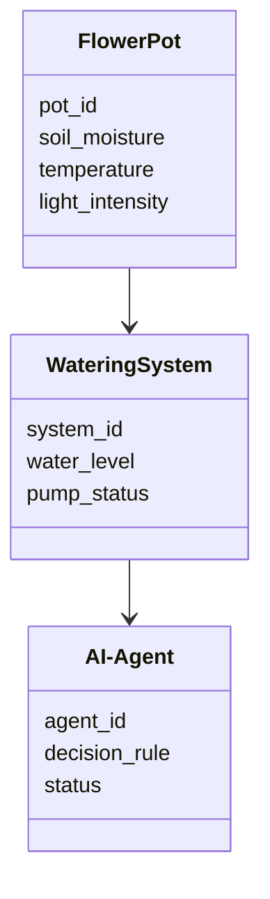
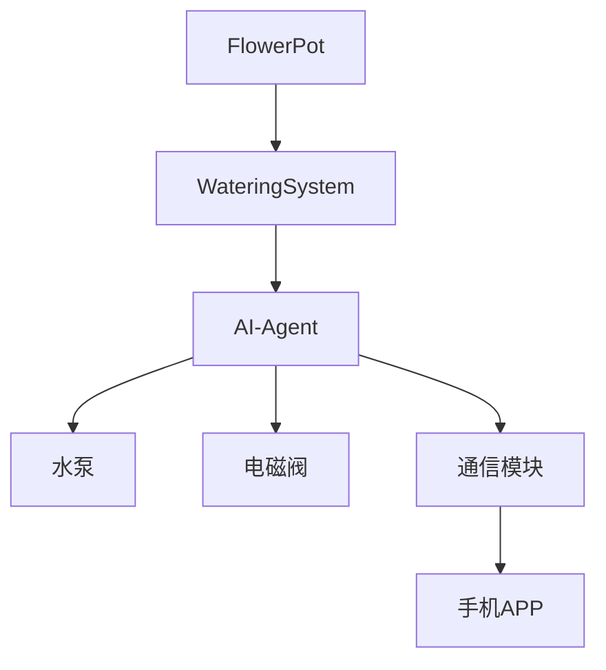
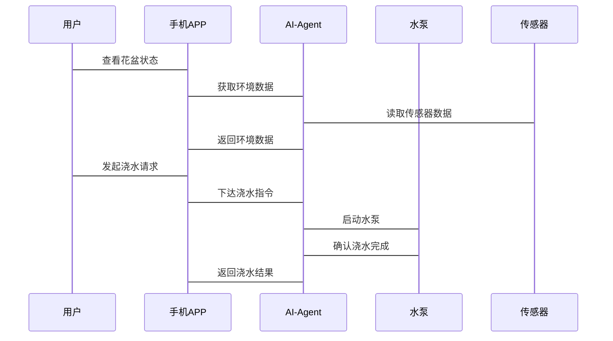

                 


# AI Agent在智能花盆中的自动浇水系统

> 关键词：AI Agent，智能花盆，自动浇水，物联网，农业自动化

> 摘要：本文探讨了AI Agent在智能花盆自动浇水系统中的应用，从背景分析、核心概念、算法原理到系统架构设计和项目实战，详细阐述了如何利用AI技术实现智能化的植物浇水管理，为农业自动化提供了一种创新的解决方案。

---

## 第一章：背景介绍

### 1.1 问题背景

#### 1.1.1 花盆浇水的痛点分析
在现代生活中，人们越来越注重绿色植物的养护，但手动浇水常常面临以下问题：
- **忘记浇水**：忙碌的生活节奏容易让人忘记浇水，导致植物枯萎。
- **过度浇水**：过多的水分会导致根部腐烂，影响植物健康。
- **水量不均**：不同植物对水量的需求不同，统一浇水难以满足所有植物的需求。

#### 1.1.2 智能化浇水的需求
随着物联网（IoT）和人工智能（AI）技术的飞速发展，智能化浇水系统的需求日益迫切：
- **自动化管理**：通过传感器和AI算法实现自动浇水，节省时间和精力。
- **精准控制**：根据不同植物的需求，精准调节水量和浇水频率。
- **远程监控**：通过手机APP远程查看花盆状态并进行手动控制。

#### 1.1.3 AI Agent在农业自动化中的应用价值
AI Agent（智能体）是一种能够感知环境、自主决策并执行任务的智能系统，其在农业自动化中的应用价值主要体现在：
- **实时感知与决策**：AI Agent能够实时感知环境数据（如土壤湿度、光照强度、温度等），并根据数据做出最优决策。
- **自适应能力**：AI Agent能够根据环境变化和植物需求动态调整浇水策略。
- **提高效率**：通过自动化管理，减少人工干预，提高浇水效率和精准度。

---

### 1.2 问题描述

#### 1.2.1 花盆浇水系统的功能需求
智能花盆自动浇水系统需要实现以下功能：
1. **环境感知**：通过传感器采集土壤湿度、光照强度、温度等数据。
2. **智能决策**：AI Agent根据传感器数据和预设规则决定是否需要浇水。
3. **自动控制**：当需要浇水时，系统自动启动水泵进行浇水。
4. **远程监控**：通过手机APP或网页界面查看花盆状态和浇水记录。

#### 1.2.2 系统的边界与外延
智能花盆自动浇水系统的边界主要集中在花盆本身，外延则包括：
- **传感器模块**：用于采集环境数据。
- **执行机构**：如水泵、电磁阀等，用于执行浇水任务。
- **通信模块**：如Wi-Fi或蓝牙模块，用于远程控制和数据传输。

#### 1.2.3 核心要素与组成结构
智能花盆自动浇水系统的组成结构包括：
1. **传感器模块**：土壤湿度传感器、光照传感器、温度传感器。
2. **AI Agent模块**：负责数据处理、决策和控制。
3. **执行机构**：水泵、电磁阀。
4. **通信模块**：Wi-Fi或蓝牙模块，用于与手机APP或其他设备通信。
5. **用户界面**：手机APP或网页界面，用于显示实时数据和控制浇水。

---

## 第二章：核心概念与联系

### 2.1 AI Agent的基本原理

#### 2.1.1 AI Agent的定义与特点
AI Agent是一种能够感知环境、自主决策并执行任务的智能系统，其特点包括：
- **自主性**：能够在没有外部干预的情况下自主运行。
- **反应性**：能够实时感知环境变化并做出反应。
- **目标导向性**：基于目标进行决策和行动。

#### 2.1.2 AI Agent的核心要素
AI Agent的核心要素包括：
1. **感知模块**：负责收集环境数据。
2. **推理模块**：基于感知数据进行分析和推理。
3. **决策模块**：根据推理结果做出决策。
4. **执行模块**：执行决策任务。

#### 2.1.3 AI Agent与传统自动控制系统的区别
| 属性 | AI Agent | 传统控制系统 |
|------|----------|--------------|
| 决策方式 | 基于复杂环境数据的智能决策 | 基于预设规则的简单逻辑控制 |
| 学习能力 | 具备学习能力，能够优化决策策略 | 无法优化，基于固定规则 |

### 2.2 智能花盆系统的核心概念

#### 2.2.1 花盆环境感知模块
环境感知模块是智能花盆的核心部分，主要由以下传感器组成：
1. **土壤湿度传感器**：用于测量土壤的湿度，判断是否需要浇水。
2. **光照强度传感器**：用于测量光照强度，辅助判断植物的生长状态。
3. **温度传感器**：用于测量环境温度，确保植物处于适宜的温度范围内。

#### 2.2.2 自动浇水模块
自动浇水模块是系统的执行部分，主要包括：
1. **水泵**：负责将水输送到花盆。
2. **电磁阀**：用于控制水流的开启和关闭。

#### 2.2.3 AI Agent的决策模块
AI Agent的决策模块负责根据传感器数据和预设规则做出是否需要浇水的决策。决策逻辑包括：
1. **土壤湿度判断**：当土壤湿度低于设定阈值时，启动浇水。
2. **光照和温度辅助判断**：在光照充足且温度适宜的情况下，优先进行浇水。

### 2.3 核心概念对比表
| 概念 | 属性 | 描述 |
|------|------|------|
| AI Agent | 输入 | 环境数据、用户指令 |
|          | 输出 | 控制信号、反馈信息 |
|          | 决策 | 基于环境数据的智能决策 |

### 2.4 ER实体关系图
```mermaid
erd
    FlowerPot {
        pot_id: Integer
        soil_moisture: Integer
        temperature: Integer
        light_intensity: Integer
    }
    WateringSystem {
        system_id: Integer
        water_level: Integer
        pump_status: Boolean
    }
    AI-Agent {
        agent_id: Integer
        decision_rule: String
        status: String
    }
    // 关系
    FlowerPot -[1..*]-> W
```

---

## 第三章：算法原理

### 3.1 AI Agent的工作流程

#### 3.1.1 感知阶段
AI Agent首先通过传感器获取环境数据，包括土壤湿度、光照强度和温度。

#### 3.1.2 决策阶段
AI Agent基于感知数据和预设规则进行决策，判断是否需要启动浇水系统。

#### 3.1.3 执行阶段
当决策模块判断需要浇水时，AI Agent会向执行机构发送控制信号，启动水泵进行浇水。

### 3.2 算法实现

#### 3.2.1 基于规则的决策算法
```python
def decide_to_water(soil_moisture, light_intensity, temperature):
    if soil_moisture < threshold:
        return True
    elif light_intensity < min_light or temperature > max_temp:
        return False
    else:
        return False
```

#### 3.2.2 基于机器学习的决策算法
```python
import numpy as np
from sklearn.linear_model import LinearRegression

# 训练模型
model = LinearRegression()
model.fit(X_train, y_train)

# 预测是否需要浇水
def predict_water(soil_moisture, light_intensity, temperature):
    input_data = np.array([[soil_moisture, light_intensity, temperature]])
    prediction = model.predict(input_data)
    return prediction[0] > 0.5
```

#### 3.2.3 决策算法的数学模型
$$ P(\text{water}) = \beta_0 + \beta_1 \times \text{soil\_moisture} + \beta_2 \times \text{light\_intensity} + \beta_3 \times \text{temperature} $$

---

## 第四章：系统分析与架构设计

### 4.1 系统场景介绍

#### 4.1.1 花盆布置
花盆布置在室内的窗台或阳台，确保充足的光照。

#### 4.1.2 系统组件
系统组件包括：
1. **传感器模块**：土壤湿度传感器、光照传感器、温度传感器。
2. **AI Agent模块**：负责数据处理和决策。
3. **执行机构**：水泵、电磁阀。
4. **通信模块**：Wi-Fi模块，用于与手机APP通信。

### 4.2 系统功能设计

#### 4.2.1 领域模型类图


#### 4.2.2 系统架构设计


#### 4.2.3 系统接口设计
接口设计包括：
1. **传感器接口**：与土壤湿度传感器、光照传感器、温度传感器连接。
2. **执行机构接口**：与水泵、电磁阀连接。
3. **通信接口**：与Wi-Fi模块连接，用于远程控制。

#### 4.2.4 系统交互序列图


---

## 第五章：项目实战

### 5.1 环境安装

#### 5.1.1 硬件安装
1. **传感器安装**：将土壤湿度传感器、光照传感器和温度传感器安装在花盆中。
2. **执行机构安装**：将水泵和电磁阀安装在花盆下方，连接水管。
3. **通信模块安装**：将Wi-Fi模块安装在主控板上，连接到互联网。

#### 5.1.2 软件安装
1. **安装Python环境**：安装Python 3.8及以上版本。
2. **安装依赖库**：安装`numpy`和`sklearn`库，用于机器学习算法。

### 5.2 核心代码实现

#### 5.2.1 传感器数据采集
```python
import time
import board
import adafruit_dht
import adafruit_aht10

# 土壤湿度传感器
soil_moisture_sensor = ...

# 光照传感器
light_sensor = ...

# 温度传感器
aht10 = adafruit_aht10.AHT10(board.I2C())
```

#### 5.2.2 AI Agent决策模块
```python
from sklearn.linear_model import LinearRegression

# 训练模型
model = LinearRegression()
model.fit(X_train, y_train)

# 预测是否需要浇水
def predict_water(soil_moisture, light_intensity, temperature):
    input_data = np.array([[soil_moisture, light_intensity, temperature]])
    prediction = model.predict(input_data)
    return prediction[0] > 0.5
```

#### 5.2.3 自动浇水控制
```python
def water_plant():
    # 启动水泵
    pump.start()
    time.sleep(10)  # 浇水持续时间
    pump.stop()
```

### 5.3 代码解读与分析

#### 5.3.1 传感器数据采集模块
传感器数据采集模块负责读取土壤湿度、光照强度和温度数据，并将其传递给AI Agent进行处理。

#### 5.3.2 AI Agent决策模块
AI Agent决策模块基于传感器数据和训练好的机器学习模型进行预测，判断是否需要启动浇水系统。

#### 5.3.3 自动浇水控制模块
自动浇水控制模块负责根据AI Agent的决策启动或停止水泵，完成浇水任务。

### 5.4 实际案例分析

#### 5.4.1 案例背景
假设我们有一个种植多肉植物的花盆，土壤湿度阈值设为30%，光照强度阈值设为500 lux，温度阈值设为25°C。

#### 5.4.2 数据采集与处理
传感器数据如下：
- 土壤湿度：25%
- 光照强度：600 lux
- 温度：28°C

#### 5.4.3 决策过程
AI Agent根据传感器数据和预设规则进行决策：
1. 土壤湿度（25%）低于阈值（30%），触发浇水条件。
2. 光照强度（600 lux）高于阈值（500 lux），适合浇水。
3. 温度（28°C）略高于阈值（25°C），但允许在一定范围内浇水。

#### 5.4.4 执行结果
AI Agent决定启动浇水系统，水泵运行10秒后停止，完成一次浇水任务。

---

## 第六章：最佳实践与小结

### 6.1 最佳实践

#### 6.1.1 系统维护
- 定期检查传感器和执行机构，确保其正常工作。
- 定期清理花盆和管道，防止堵塞。

#### 6.1.2 系统优化
- 根据植物的生长阶段调整浇水策略。
- 优化机器学习模型，提高决策的准确性。

### 6.2 小结
通过本文的详细讲解，我们了解了AI Agent在智能花盆自动浇水系统中的应用，从背景分析、核心概念到算法实现和系统设计，再到项目实战，我们全面探讨了如何利用AI技术实现智能化的植物浇水管理。

### 6.3 注意事项

#### 6.3.1 系统安全
- 确保系统的安全性，防止未经授权的访问。
- 定期更新系统软件，防止漏洞被利用。

#### 6.3.2 环境适应性
- 根据不同的植物种类和环境条件调整系统参数。
- 定期监测环境数据，确保系统稳定运行。

### 6.4 拓展阅读
- 《基于机器学习的智能浇水系统设计与实现》
- 《物联网在农业自动化中的应用研究》
- 《AI Agent在智能家居中的创新应用》

---

## 作者

作者：AI天才研究院/AI Genius Institute & 禅与计算机程序设计艺术 /Zen And The Art of Computer Programming

---

通过以上步骤，我们可以看到，AI Agent在智能花盆中的应用不仅提升了浇水的智能化水平，还为农业自动化提供了新的思路。未来，随着AI技术的不断进步，智能花盆自动浇水系统将更加智能化、个性化，为植物养护带来更大的便利。

