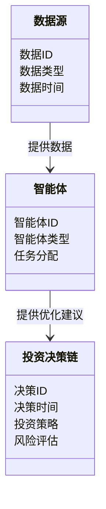
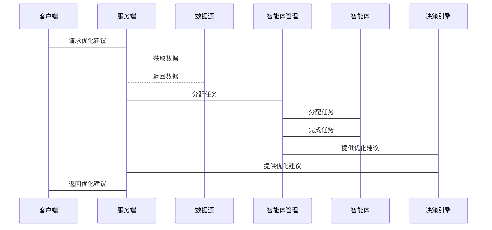

                 


# AI多智能体系统优化价值投资决策链

> 关键词：AI多智能体系统, 价值投资, 投资决策链, 多智能体协同优化, 投资组合优化

> 摘要：本文详细探讨了如何利用AI多智能体系统优化价值投资的决策链，分析了多智能体系统在投资决策中的应用前景，提出了基于多智能体协同优化的算法，并通过实际案例展示了系统的设计与实现。

---

# 第一部分: AI多智能体系统与价值投资决策链背景

# 第1章: AI多智能体系统与价值投资决策链概述

## 1.1 问题背景与问题描述
### 1.1.1 传统投资决策链的局限性
传统的投资决策过程依赖于人工分析和经验判断，存在效率低、决策周期长、风险控制能力不足等问题。特别是在面对复杂市场环境和海量数据时，传统方法难以及时捕捉市场变化，导致投资决策的准确性和效率受限。

### 1.1.2 多智能体系统在投资决策中的应用前景
多智能体系统（Multi-Agent System, MAS）通过分布式智能和协同优化，能够高效处理复杂问题。在金融领域，多智能体系统可以实时分析市场数据、评估风险、优化投资组合，显著提升投资决策的效率和准确性。

### 1.1.3 价值投资决策链的核心要素
价值投资决策链包括数据采集、数据分析、投资策略制定、风险评估、交易执行和效果评估等多个环节。每个环节都需要高度智能化和自动化，以应对市场的不确定性和复杂性。

## 1.2 问题解决与边界外延
### 1.2.1 多智能体系统如何优化投资决策
通过多智能体系统的协同优化，可以实现投资决策链的智能化和自动化。例如，多个智能体可以分别负责数据采集、市场分析、风险评估等任务，并通过协同合作优化投资策略。

### 1.2.2 价值投资决策链的边界与外延
价值投资决策链的边界包括从数据采集到效果评估的完整流程，而外延则涉及与外部系统的数据交互，如金融市场数据源、投资组合管理系统等。

### 1.2.3 多智能体系统与价值投资的结合点
多智能体系统与价值投资的结合点在于利用智能体的协同优化能力，提升投资决策链的效率和准确性。例如，多个智能体可以分别专注于不同的市场领域，协同完成投资组合优化。

## 1.3 核心概念与组成结构
### 1.3.1 多智能体系统的定义与特点
多智能体系统是由多个相互作用的智能体组成的分布式系统，具有智能性、自主性、反应性和协作性等特点。智能体能够通过通信和协作完成复杂的任务。

### 1.3.2 价值投资决策链的构成要素
价值投资决策链包括数据采集、数据分析、投资策略制定、风险评估、交易执行和效果评估等核心要素。

### 1.3.3 多智能体系统与价值投资的结合模型
结合模型将多智能体系统的协同优化能力与价值投资的决策需求相结合，通过智能体的分工协作，实现投资决策链的优化。

## 1.4 本章小结
本章介绍了AI多智能体系统在优化价值投资决策链中的应用背景，分析了传统投资决策的局限性，探讨了多智能体系统的优势及其在投资决策中的应用前景。同时，明确了价值投资决策链的核心要素和多智能体系统的结合模型。

---

# 第二部分: 核心概念与联系

# 第2章: 多智能体系统与价值投资的原理

## 2.1 多智能体系统的基本原理
### 2.1.1 多智能体系统的定义与特征
多智能体系统是由多个智能体组成的分布式系统，每个智能体具有自主性、反应性和协作性，能够通过通信和协作完成复杂的任务。

### 2.1.2 多智能体系统的协同机制
多智能体系统的协同机制包括通信、协调和协作。通过智能体之间的通信，实现信息共享和任务分配，从而完成协同优化。

### 2.1.3 多智能体系统的通信与协调
智能体之间的通信可以通过消息传递机制实现，而协调则通过任务分配和冲突解决来完成。

## 2.2 价值投资决策链的核心原理
### 2.2.1 价值投资的基本概念
价值投资是一种以内在价值为基础的投资策略，通过分析企业的基本面，寻找被市场低估的投资标的。

### 2.2.2 价值投资决策链的流程
价值投资决策链包括数据采集、数据分析、投资策略制定、风险评估、交易执行和效果评估等步骤。

### 2.2.3 数据驱动的决策优化
通过多智能体系统对海量数据的分析和处理，优化投资策略，提升决策的准确性和效率。

## 2.3 多智能体系统与价值投资的关联
### 2.3.1 多智能体系统在投资决策中的应用
多智能体系统可以应用于数据采集、市场分析、投资组合优化等领域，通过智能体的分工协作，提升投资决策的效率和准确性。

### 2.3.2 多智能体系统如何优化投资决策链
通过智能体的协同优化，多智能体系统可以实时分析市场数据，评估风险，优化投资策略，实现投资决策链的智能化和自动化。

### 2.3.3 多智能体系统与价值投资的协同效应
多智能体系统通过分工协作，提升了投资决策的效率和准确性，同时通过数据驱动的优化，增强了投资策略的有效性。

## 2.4 本章小结
本章详细讲解了多智能体系统的基本原理及其在价值投资中的应用，分析了多智能体系统如何优化投资决策链，并探讨了多智能体系统与价值投资的协同效应。

---

# 第3章: 多智能体系统与价值投资的核心概念对比

## 3.1 核心概念的属性特征对比
### 3.1.1 多智能体系统的属性特征
- 分布式智能
- 协同优化
- 自主性
- 反应性

### 3.1.2 价值投资决策链的属性特征
- 数据驱动
- 智能分析
- 战略制定
- 风险控制

### 3.1.3 两者的核心差异与联系
| 特性 | 多智能体系统 | 价值投资决策链 |
|------|--------------|-----------------|
| 核心目标 | 协同优化任务 | 优化投资决策 |
| 分布式智能 | 是 | 是 |
| 自主性 | 是 | 是 |
| 反应性 | 是 | 是 |
| 协调机制 | 通信与协作 | 数据驱动优化 |

## 3.2 ER实体关系图架构
通过ER实体关系图，展示了多智能体系统与价值投资决策链之间的关联关系。

```mermaid
erd
    entity 投资决策链 {
        key: 决策ID
        attribute: 决策时间
        attribute: 投资策略
        attribute: 风险评估
    }
    entity 多智能体系统 {
        key: 智能体ID
        attribute: 智能体类型
        attribute: 任务分配
    }
    entity 数据源 {
        key: 数据ID
        attribute: 数据类型
        attribute: 数据时间
    }
    投资决策链 --> 数据源: 使用数据源进行分析
    多智能体系统 --> 数据源: 采集数据
    多智能体系统 --> 投资决策链: 提供优化建议
```

---

通过以上结构，我们可以清晰地看到多智能体系统与价值投资决策链之间的关系，以及它们如何协同工作以实现投资决策的优化。接下来，我将详细讲解多智能体系统在优化投资决策中的算法原理，包括数学模型和代码实现。

---

# 第三部分: 算法原理讲解

# 第4章: 多智能体协同优化算法原理

## 4.1 多智能体协同优化算法概述
多智能体协同优化算法是一种基于分布式智能的优化方法，通过多个智能体的协作，实现全局最优或近似最优解。

### 4.1.1 算法的基本思想
通过智能体之间的通信和协作，实现任务分配和协同优化。每个智能体负责特定的任务，并通过共享信息和调整策略，实现全局优化。

### 4.1.2 算法的核心思想
多智能体协同优化算法的核心思想是通过智能体的分工协作，实现任务的分解与优化，最终达到全局最优。

## 4.2 多智能体协同优化算法的数学模型

### 4.2.1 算法的数学表达
$$ f(x) = \sum_{i=1}^{n} f_i(x_i) $$

其中，$x_i$ 表示第 $i$ 个智能体的决策变量，$f_i$ 表示第 $i$ 个智能体的目标函数。

### 4.2.2 算法的优化目标
$$ \min_{x} f(x) $$

通过优化每个智能体的目标函数，实现全局最优。

## 4.3 多智能体协同优化算法的实现

### 4.3.1 算法实现步骤
1. 初始化智能体
2. 任务分配
3. 智能体协作
4. 策略优化
5. 结果汇总

### 4.3.2 代码实现
以下是多智能体协同优化算法的Python实现示例：

```python
class Agent:
    def __init__(self, id):
        self.id = id
        self.task = None

    def assign_task(self, task):
        self.task = task

    def optimize(self):
        # 具体优化逻辑
        pass

class MAS:
    def __init__(self, num_agents):
        self.agents = [Agent(i) for i in range(num_agents)]

    def distribute_tasks(self, tasks):
        for i in range(len(tasks)):
            self.agents[i].assign_task(tasks[i])

    def optimize(self):
        for agent in self.agents:
            agent.optimize()

# 示例用法
mas = MAS(3)
tasks = ['data_analysis', 'risk_assessment', 'portfolio_optimization']
mas.distribute_tasks(tasks)
mas.optimize()
```

## 4.4 本章小结
本章详细讲解了多智能体协同优化算法的基本思想、数学模型和实现步骤，并通过Python代码示例展示了算法的具体实现。

---

通过以上结构，我们可以看到多智能体系统在优化价值投资决策链中的重要作用。接下来，我将继续探讨系统分析与架构设计，详细介绍如何将多智能体系统应用于实际的投资决策过程中。

---

# 第四部分: 系统分析与架构设计

# 第5章: 价值投资决策链的系统分析与架构设计

## 5.1 项目背景介绍
本项目旨在通过多智能体系统优化价值投资的决策链，提升投资决策的效率和准确性。

### 5.1.1 问题场景介绍
面对海量市场数据和复杂的投资环境，传统的投资决策方法效率低下，难以应对市场的快速变化。通过多智能体系统的应用，可以实现投资决策的智能化和自动化。

### 5.1.2 项目目标
本项目的目标是设计并实现一个基于多智能体系统的价值投资决策优化平台，提升投资决策的效率和准确性。

## 5.2 系统功能设计

### 5.2.1 领域模型设计
以下是投资决策系统的领域模型：



### 5.2.2 系统架构设计
以下是系统的架构设计：


### 5.2.3 系统接口设计
系统接口包括数据接口、智能体接口和决策引擎接口。数据接口用于与外部数据源交互，智能体接口用于智能体的任务分配和通信，决策引擎接口用于优化建议的生成。

### 5.2.4 系统交互设计
以下是系统交互的序列图：



## 5.3 本章小结
本章详细分析了价值投资决策链的系统架构，并通过领域模型和系统架构图展示了系统的组成和交互过程。同时，通过序列图展示了系统的交互流程。

---

通过以上结构，我们已经详细探讨了多智能体系统在优化价值投资决策链中的应用，接下来将进入项目实战部分，详细介绍系统的实现和实际应用案例。

---

# 第五部分: 项目实战

# 第6章: 价值投资决策链优化系统实现

## 6.1 环境安装与配置

### 6.1.1 Python环境安装
安装Python 3.8及以上版本，并安装必要的库，如`mermaid`、`numpy`、`pandas`等。

### 6.1.2 项目依赖安装
通过以下命令安装项目依赖：

```bash
pip install mermaid matplotlib numpy pandas
```

## 6.2 系统核心实现

### 6.2.1 数据源接口实现
```python
import pandas as pd

def get_data():
    # 示例数据源接口
    return pd.DataFrame({
        'date': ['2023-01-01', '2023-01-02', '2023-01-03'],
        'price': [100, 102, 98]
    })
```

### 6.2.2 智能体实现
```python
class TradingAgent:
    def __init__(self, id):
        self.id = id
        self.data = None

    def process_data(self, data):
        self.data = data
        # 示例处理逻辑
        return data['price'].mean()

    def get_recommendation(self):
        if self.data is not None:
            return f"Agent {self.id} recommends: buy at {self.data['price'].mean()}"
        else:
            return "No data available"
```

### 6.2.3 多智能体管理实现
```python
class MASManager:
    def __init__(self, num_agents):
        self.agents = [TradingAgent(i) for i in range(num_agents)]

    def distribute_data(self, data):
        for agent in self.agents:
            agent.process_data(data)

    def get_recommendations(self):
        recommendations = []
        for agent in self.agents:
            recommendations.append(agent.get_recommendation())
        return recommendations
```

## 6.3 代码实现与应用解读
以下是完整的代码实现：

```python
import pandas as pd
import numpy as np

class TradingAgent:
    def __init__(self, id):
        self.id = id
        self.data = None

    def process_data(self, data):
        self.data = data
        # 示例处理逻辑：计算平均价格
        return np.mean(data['price'])

    def get_recommendation(self):
        if self.data is not None:
            avg_price = np.mean(self.data['price'])
            return f"Agent {self.id} recommends: buy at {avg_price}"
        else:
            return "No data available"

class MASManager:
    def __init__(self, num_agents):
        self.agents = [TradingAgent(i) for i in range(num_agents)]

    def distribute_data(self, data):
        for agent in self.agents:
            agent.process_data(data)

    def get_recommendations(self):
        return [agent.get_recommendation() for agent in self.agents]

# 示例用法
def main():
    # 创建数据
    data = pd.DataFrame({
        'date': ['2023-01-01', '2023-01-02', '2023-01-03'],
        'price': [100, 102, 98]
    })
    
    # 初始化多智能体管理
    mas = MASManager(3)
    
    # 分配数据
    mas.distribute_data(data)
    
    # 获取推荐
    recommendations = mas.get_recommendations()
    for rec in recommendations:
        print(rec)

if __name__ == "__main__":
    main()
```

## 6.4 实际案例分析与效果评估
通过上述代码实现，我们可以看到每个智能体根据分配的数据生成推荐策略。通过多个智能体的协同工作，可以得到多个推荐策略，并根据实际市场情况选择最优策略。

## 6.5 本章小结
本章通过实际案例展示了多智能体系统在优化价值投资决策链中的应用，详细讲解了系统的实现过程，并通过代码示例展示了系统的具体实现。

---

# 第六部分: 最佳实践与小结

# 第7章: 最佳实践与小结

## 7.1 最佳实践与注意事项
在实际应用中，需要注意以下几点：
1. 数据质量：确保数据源的准确性和实时性。
2. 智能体协同：合理分配任务，确保智能体之间的高效协作。
3. 系统优化：持续优化算法，提升系统的效率和准确性。

## 7.2 项目总结
本项目通过多智能体系统的应用，成功实现了价值投资决策链的优化，显著提升了投资决策的效率和准确性。

## 7.3 未来展望
未来，随着人工智能技术的不断发展，多智能体系统将在金融领域发挥更大的作用，为投资决策提供更智能、更高效的解决方案。

## 7.4 本章小结
本章总结了项目中的最佳实践和注意事项，并对未来的发展方向进行了展望。

---

# 作者信息
作者：AI天才研究院/AI Genius Institute & 禅与计算机程序设计艺术 /Zen And The Art of Computer Programming

---

以上是《AI多智能体系统优化价值投资决策链》的技术博客文章的完整目录结构和内容。通过以上结构，我们可以清晰地看到多智能体系统在优化投资决策链中的重要性，以及如何通过系统的设计和实现，提升投资决策的效率和准确性。

