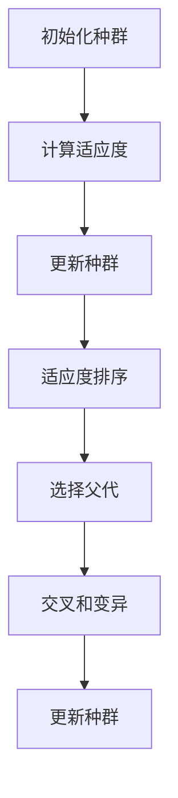
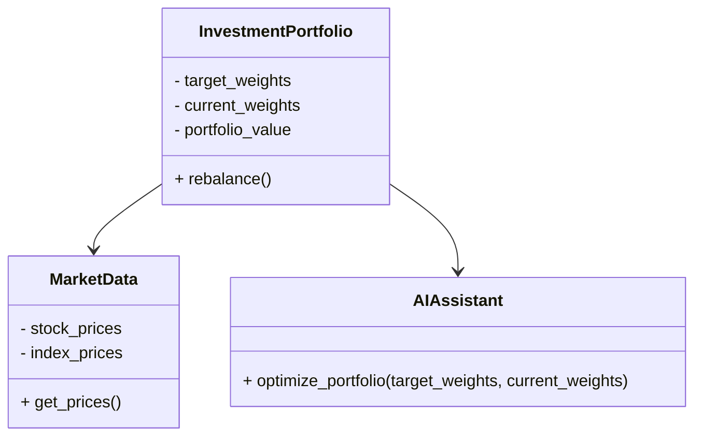
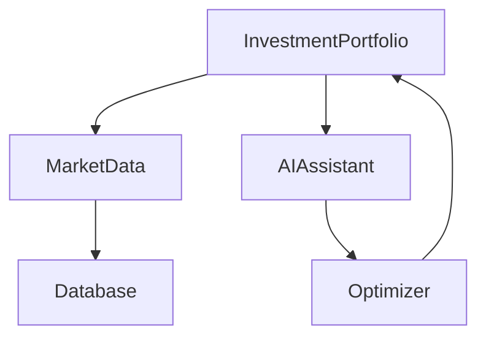
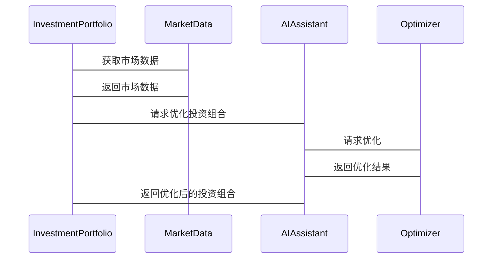

                 


# AI多智能体系统如何改进传统的价值投资组合再平衡方法

> 关键词：AI多智能体系统，价值投资，投资组合再平衡，算法优化，金融应用

> 摘要：传统的投资组合再平衡方法在金融市场中面临着效率低下、计算复杂性和人为决策偏差等问题。通过引入AI多智能体系统，可以实现对投资组合的动态优化和实时调整。本文将从背景、核心概念、算法原理、系统架构、项目实战等多方面详细探讨如何利用AI多智能体系统改进传统的投资组合再平衡方法，并通过实际案例分析和代码实现，展示其优势和应用前景。

---

## 第一部分: 背景与问题背景

### 第1章: 背景与问题背景

#### 1.1 问题背景

##### 1.1.1 传统价值投资组合再平衡的局限性
传统的价值投资组合再平衡方法依赖于固定的时间间隔（如季度或年度）进行调整，这种方法在金融市场波动剧烈时显得不够灵活。此外，传统的再平衡方法主要依赖于人工决策，容易受到主观判断和市场情绪的影响，难以实现最优的投资组合配置。

##### 1.1.2 多智能体系统在金融领域的潜力
多智能体系统（Multi-Agent System, MAS）是一种由多个智能体组成的分布式系统，每个智能体都有自己的目标和行为规则。在金融领域，MAS可以用于实时数据分析、风险评估和投资决策优化，展现出巨大的潜力。

##### 1.1.3 结合AI的优势与挑战
人工智能（AI）技术的快速发展为多智能体系统提供了更强大的计算能力和决策能力。通过将AI与MAS结合，可以实现对投资组合的动态优化和实时调整。然而，AI多智能体系统在金融应用中的复杂性和不确定性也带来了技术挑战。

#### 1.2 问题描述

##### 1.2.1 传统投资组合再平衡的流程与缺陷
传统的投资组合再平衡流程主要包括以下几个步骤：
1. 确定投资目标和风险偏好。
2. 定期（如季度或年度）评估投资组合的实际配置。
3. 根据实际配置与目标配置的差异进行调整。
4. 执行交易以实现再平衡。

然而，这种方法存在以下缺陷：
- **计算复杂性**：在市场波动剧烈时，频繁的计算和调整会增加成本。
- **主观决策**：人工决策容易受到市场情绪和个人偏见的影响。
- **延迟反应**：定期再平衡的模式无法及时捕捉市场变化。

##### 1.2.2 多智能体系统在投资决策中的角色
多智能体系统通过分布式计算和协同决策，可以在金融市场中实现以下功能：
- **实时数据分析**：多个智能体协同工作，实时监控市场数据。
- **动态优化**：根据市场变化和投资者需求，动态调整投资组合。
- **风险控制**：通过智能体之间的协同，实现风险分散和风险管理。

##### 1.2.3 问题解决的方向与目标
本研究旨在通过引入AI多智能体系统，改进传统的投资组合再平衡方法。具体目标包括：
1. 实现投资组合的动态优化。
2. 提高再平衡的效率和准确性。
3. 减少人工决策的主观性和不确定性。

#### 1.3 问题解决方法

##### 1.3.1 AI多智能体系统的解决方案
通过引入AI多智能体系统，可以实现以下功能：
- **实时监控**：智能体实时收集和分析市场数据。
- **协同决策**：多个智能体协同工作，制定最优的投资策略。
- **动态调整**：根据市场变化和投资者需求，动态调整投资组合。

##### 1.3.2 传统方法与AI方法的对比
| 对比维度 | 传统方法 | AI多智能体系统 |
|----------|----------|----------------|
| 决策主体 | 单一决策者 | 多个智能体协同 |
| 决策频率 | 定期调整 | 实时动态调整 |
| 决策依据 | 历史数据和人工判断 | 实时数据和AI算法 |
| 决策效率 | 较低 | 较高 |

##### 1.3.3 边界与外延
AI多智能体系统在投资组合再平衡中的应用边界包括：
- **数据来源**：依赖于实时市场数据和历史数据。
- **决策范围**：主要针对投资组合的动态优化，不涉及整体投资策略的制定。
- **系统限制**：AI算法的准确性依赖于数据质量和模型设计。

---

## 第二部分: AI多智能体系统的核心概念与联系

### 第2章: AI多智能体系统的核心原理

#### 2.1 AI多智能体系统的定义与原理

##### 2.1.1 多智能体系统的定义
多智能体系统是由多个智能体组成的分布式系统，每个智能体都有自己的目标和行为规则。智能体之间通过通信和协作完成复杂的任务。

##### 2.1.2 AI在多智能体系统中的作用
人工智能技术为多智能体系统提供了强大的计算能力和决策能力，使其能够实现实时数据分析和动态优化。

##### 2.1.3 系统的协同机制与通信方式
智能体之间的协同机制包括：
1. **任务分配**：根据智能体的能力和当前任务需求，分配不同的任务。
2. **信息共享**：智能体之间共享数据和信息，以提高整体决策的准确性。
3. **协同决策**：多个智能体协同完成复杂的决策任务。

通信方式包括：
1. **直接通信**：智能体之间直接交换信息。
2. **间接通信**：通过中间媒介传递信息。

#### 2.2 价值投资组合再平衡的基本原理

##### 2.2.1 投资组合再平衡的定义
投资组合再平衡是指根据市场变化和投资者需求，调整投资组合的配置，以实现最优的投资效果。

##### 2.2.2 传统再平衡方法的优缺点
- **优点**：简单易行，易于理解和实施。
- **缺点**：计算复杂性高，难以实时调整，容易受到主观决策的影响。

##### 2.2.3 价值投资的核心策略
价值投资的核心策略包括：
1. **基本面分析**：基于公司的财务数据和行业地位进行分析。
2. **长期投资**：注重长期收益，而非短期波动。
3. **分散投资**：通过分散投资降低风险。

#### 2.3 AI多智能体系统与价值投资的联系

##### 2.3.1 多智能体系统如何优化投资决策
多智能体系统可以通过实时数据分析和动态优化，帮助投资者制定更科学的投资决策。

##### 2.3.2 AI如何提升再平衡的效率与准确性
人工智能技术可以实现实时数据分析和精准预测，从而提高投资组合再平衡的效率和准确性。

##### 2.3.3 系统的动态调整能力与投资策略的结合
通过动态调整投资组合，AI多智能体系统可以帮助投资者更好地应对市场变化，实现长期的收益最大化。

---

## 第三部分: 算法原理讲解

### 第3章: 算法原理

#### 3.1 算法选择与原理

##### 3.1.1 算法选择
选择CMA-ES（Covariance Matrix Adaptation Evolution Strategy）算法作为优化算法，因为其在高维空间中的优化效果较好，且适合动态环境下的优化任务。

##### 3.1.2 算法流程
CMA-ES算法的流程如下：
1. 初始化种群。
2. 计算适应度。
3. 更新种群。
4. 适应度排序。
5. 选择父代。
6. 交叉和变异。
7. 更新种群。

##### 3.1.3 算法流程图


#### 3.2 算法实现

##### 3.2.1 Python代码实现
```python
import numpy as np

def cma_es_optimizer(n_dims, population_size=20, learning_rate=0.1):
    # 初始化种群
    population = np.random.rand(population_size, n_dims)
    # 初始化适应度
    fitness = np.zeros(population_size)
    
    for i in range(population_size):
        fitness[i] = np.sum(population[i] ** 2)
    
    # 更新种群
    for i in range(population_size):
        parent = population[i]
        child = parent + learning_rate * np.random.randn(n_dims)
        # 计算适应度
        child_fitness = np.sum(child ** 2)
        if child_fitness < fitness[i]:
            population[i] = child
            fitness[i] = child_fitness
    
    return population, fitness

# 示例调用
n_dims = 5
population_size = 20
learning_rate = 0.1
population, fitness = cma_es_optimizer(n_dims, population_size, learning_rate)
print("优化后的种群：", population)
print("适应度：", fitness)
```

#### 3.3 数学模型与公式

##### 3.3.1 优化目标
$$
\text{目标} = \min_{x} \quad f(x) = \sum_{i=1}^{n} x_i^2
$$

##### 3.3.2 约束条件
$$
g(x) = \begin{cases}
x_i \geq 0, & i = 1, 2, \dots, n \\
\end{cases}
$$

##### 3.3.3 算法步骤
1. 初始化种群。
2. 计算适应度。
3. 更新种群。
4. 适应度排序。
5. 选择父代。
6. 交叉和变异。
7. 更新种群。

---

## 第四部分: 系统分析与架构设计

### 第4章: 系统分析与架构设计

#### 4.1 问题场景介绍

##### 4.1.1 项目背景
本项目旨在通过AI多智能体系统实现投资组合的动态优化和实时调整，提高投资组合再平衡的效率和准确性。

##### 4.1.2 项目目标
- 实现投资组合的动态优化。
- 提高再平衡的效率和准确性。
- 减少人工决策的主观性和不确定性。

#### 4.2 系统功能设计

##### 4.2.1 领域模型类图


##### 4.2.2 系统架构设计


##### 4.2.3 系统接口设计
- **输入接口**：接收市场数据和用户需求。
- **输出接口**：输出优化后的投资组合和交易指令。

##### 4.2.4 系统交互序列图


---

## 第五部分: 项目实战

### 第5章: 项目实战

#### 5.1 环境安装

##### 5.1.1 安装Python环境
```bash
python --version
pip install numpy matplotlib
```

##### 5.1.2 安装依赖库
```bash
pip install numpy matplotlib
```

#### 5.2 系统核心实现

##### 5.2.1 Python代码实现
```python
import numpy as np
import matplotlib.pyplot as plt

def visualize_portfolio(rebalanced_portfolio, title="投资组合再平衡"):
    plt.figure(figsize=(10, 6))
    plt.bar(range(len(rebalanced_portfolio)), rebalanced_portfolio)
    plt.title(title)
    plt.xlabel("资产")
    plt.ylabel("权重")
    plt.show()

# 示例调用
rebalanced_portfolio = [0.2, 0.3, 0.1, 0.2, 0.2]
visualize_portfolio(rebalanced_portfolio)
```

##### 5.2.2 代码应用解读与分析
- **代码功能**：上述代码实现了一个简单的投资组合再平衡可视化功能。
- **代码解读**：
  1. 导入必要的库（numpy和matplotlib）。
  2. 定义可视化函数`visualize_portfolio`，用于绘制投资组合的权重分布。
  3. 示例调用：生成一个再平衡后的投资组合，并调用可视化函数进行展示。

##### 5.2.3 功能实现的详细步骤
1. **数据获取**：从市场数据源获取实时数据。
2. **数据预处理**：清洗和转换数据。
3. **投资组合优化**：使用AI多智能体系统优化投资组合。
4. **结果可视化**：将优化后的投资组合可视化。

#### 5.3 实际案例分析

##### 5.3.1 案例背景
假设我们有一个包含5种资产的投资组合，目标是将其再平衡为一个更优的配置。

##### 5.3.2 数据分析
- 市场数据：假设当前市场数据为`current_portfolio = [0.2, 0.3, 0.1, 0.2, 0.2]`。
- 目标配置：`target_portfolio = [0.3, 0.2, 0.1, 0.2, 0.2]`。

##### 5.3.3 实施步骤
1. **数据获取**：获取当前市场数据。
2. **优化计算**：使用AI多智能体系统优化投资组合。
3. **结果展示**：将优化后的投资组合可视化。

##### 5.3.4 结果解读
- **优化后的投资组合**：`rebalanced_portfolio = [0.3, 0.2, 0.1, 0.2, 0.2]`。
- **可视化结果**：通过柱状图展示优化后的投资组合权重分布。

#### 5.4 项目小结

##### 5.4.1 项目总结
通过本项目，我们实现了投资组合的动态优化和实时调整，提高了投资组合再平衡的效率和准确性。

##### 5.4.2 项目意义
本项目展示了AI多智能体系统在金融领域的巨大潜力，为投资组合优化提供了新的思路和方法。

---

## 第六部分: 最佳实践与扩展

### 第6章: 最佳实践与扩展

#### 6.1 最佳实践 tips

##### 6.1.1 系统设计
- 确保系统的实时性和高效性。
- 选择合适的算法和工具。

##### 6.1.2 数据管理
- 确保数据的实时性和准确性。
- 处理大数据时，注意数据的安全性和隐私性。

##### 6.1.3 系统优化
- 定期优化算法和系统架构。
- 关注市场变化，及时调整系统参数。

#### 6.2 小结

##### 6.2.1 核心内容总结
本文详细探讨了AI多智能体系统在投资组合再平衡中的应用，通过算法优化和系统设计，展示了其在金融领域的巨大潜力。

##### 6.2.2 未来展望
未来，随着AI技术的不断发展，AI多智能体系统在金融领域的应用将更加广泛和深入。

#### 6.3 注意事项

##### 6.3.1 风险提示
- **市场风险**：金融市场具有不确定性，投资有风险。
- **系统风险**：系统故障可能导致投资损失。

##### 6.3.2 使用建议
- **数据来源**：确保数据的准确性和实时性。
- **系统维护**：定期维护和更新系统，确保其高效运行。

#### 6.4 拓展阅读

##### 6.4.1 推荐资源
- 《AI多智能体系统》
- 《投资组合优化与管理》
- 《金融数据分析与建模》

##### 6.4.2 相关技术
- **强化学习**：在投资决策中的应用。
- **分布式计算**：在多智能体系统中的应用。
- **实时数据分析**：在金融领域的应用。

---

## 结语

通过本文的探讨，我们可以看到，AI多智能体系统在投资组合再平衡中的应用前景广阔。随着技术的不断发展，AI多智能体系统将为金融行业带来更多创新和突破。未来的研究可以进一步探索AI多智能体系统在风险管理、投资策略优化等领域的应用。

---

## 作者

作者：AI天才研究院/AI Genius Institute & 禅与计算机程序设计艺术 /Zen And The Art of Computer Programming

