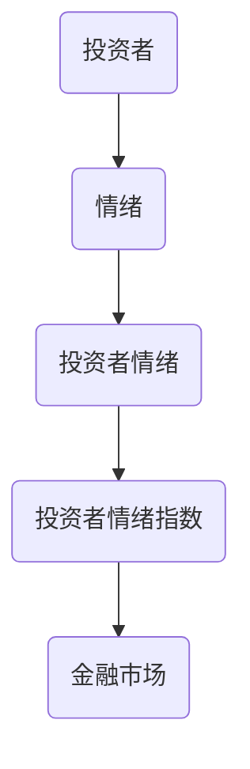
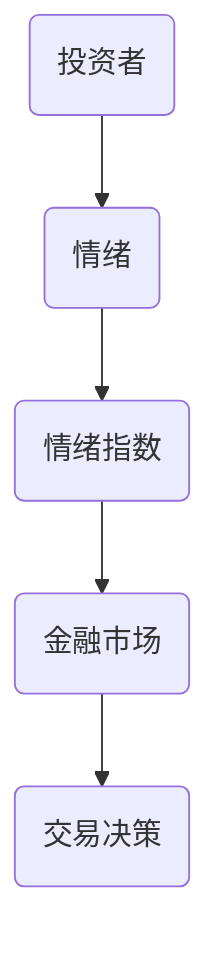
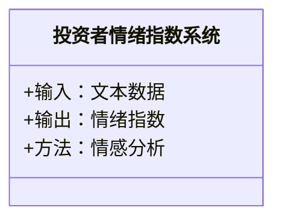
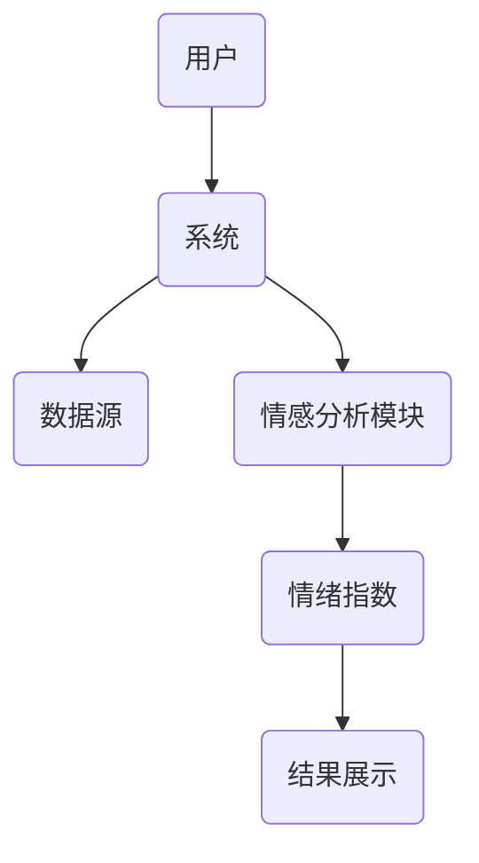
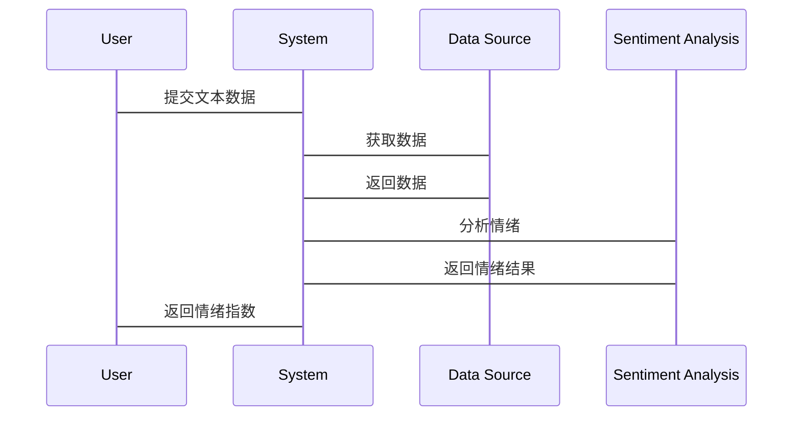

                 


# AI驱动的投资者情绪指数开发

> 关键词：投资者情绪指数, AI驱动, 金融数据分析, 情感分析, 自然语言处理

> 摘要：本文详细探讨了如何利用人工智能技术开发投资者情绪指数，分析了投资者情绪指数的定义、重要性及其在金融分析中的应用。通过介绍AI驱动的情绪分析算法、系统架构设计和实际项目案例，展示了如何利用自然语言处理技术构建高效的情绪指数，为金融市场的决策提供支持。

---

# 第一部分: AI驱动的投资者情绪指数开发背景与概述

## 第1章: 投资者情绪指数的定义与重要性

### 1.1 投资者情绪的定义与分类

#### 1.1.1 投资者情绪的定义
投资者情绪（Investor Sentiment）是指投资者对金融市场整体或某一资产的乐观或悲观态度。情绪可以通过市场行为、交易数据和新闻媒体等多种渠道进行衡量。

#### 1.1.2 投资者情绪的分类
投资者情绪可以分为以下几类：
1. **乐观情绪**：投资者对市场未来表现持积极态度，倾向于买入资产。
2. **悲观情绪**：投资者对市场未来表现持消极态度，倾向于卖出资产。
3. **中性情绪**：投资者对市场未来表现持观望态度，交易行为较为保守。

#### 1.1.3 投资者情绪与市场行为的关系
投资者情绪直接影响市场行为，例如：
- **乐观情绪**可能导致资产价格上涨。
- **悲观情绪**可能导致资产价格下跌。
- **中性情绪**可能导致市场波动较小。

### 1.2 投资者情绪指数的定义与作用

#### 1.2.1 投资者情绪指数的定义
投资者情绪指数（Investor Sentiment Index, ISI）是通过量化投资者情绪来反映市场整体情绪的指标。它可以基于新闻、社交媒体、交易数据等多种数据源进行计算。

#### 1.2.2 投资者情绪指数的作用
1. **预测市场走势**：情绪指数可以帮助预测市场短期波动。
2. **辅助投资决策**：投资者可以根据情绪指数调整投资策略。
3. **风险监控**：情绪指数可以用于监控市场风险。

#### 1.2.3 投资者情绪指数的计算方法
投资者情绪指数的计算方法通常包括以下步骤：
1. **数据收集**：收集相关数据，例如新闻、社交媒体评论等。
2. **情感分析**：对数据进行情感分析，计算正面、负面和中性情绪的比例。
3. **加权计算**：根据权重计算最终的情绪指数。

### 1.3 AI在投资者情绪指数中的应用前景

#### 1.3.1 AI在金融领域的应用现状
人工智能技术已经在金融领域得到了广泛应用，例如：
- **股票预测**：利用机器学习模型预测股票价格走势。
- **风险管理**：通过AI技术识别潜在风险。

#### 1.3.2 AI在投资者情绪分析中的优势
1. **高效性**：AI可以快速处理大量数据。
2. **准确性**：AI情感分析模型可以提高情绪判断的准确性。
3. **实时性**：AI可以实时分析市场情绪。

#### 1.3.3 未来发展趋势与挑战
1. **发展趋势**：AI技术将更加智能化，情绪分析模型将更加精准。
2. **挑战**：如何处理噪声数据、提高模型的鲁棒性是未来需要解决的问题。

## 第2章: 投资者情绪指数开发的背景与问题

### 2.1 传统投资者情绪指数的局限性

#### 2.1.1 传统情绪指数的定义与计算方法
传统投资者情绪指数通常基于市场参与者的反馈，例如：
- **投资者信心指数**：通过问卷调查收集投资者信心数据。
- **市场情绪指数**：通过股票交易量和价格波动计算情绪指数。

#### 2.1.2 传统情绪指数的局限性
1. **数据来源单一**：传统情绪指数通常依赖于有限的数据源，如交易数据或问卷调查。
2. **计算复杂**：传统情绪指数的计算过程较为复杂，难以实时更新。
3. **主观性**：传统情绪指数的结果可能受到主观因素的影响。

#### 2.1.3 传统情绪指数的应用案例
- **美国投资者信心指数**：由美国经济周期研究所发布，反映了投资者对经济的信心。
- **市场情绪指数**：由交易公司提供，反映了市场参与者的交易行为。

### 2.2 AI驱动情绪指数开发的必要性

#### 2.2.1 数据量与复杂性的增加
随着金融市场的复杂化，投资者情绪的影响因素越来越多，包括社交媒体、新闻、宏观经济指标等。

#### 2.2.2 AI在自然语言处理中的优势
- **自然语言处理（NLP）**：AI可以通过NLP技术分析新闻、社交媒体评论等文本数据，提取情绪信息。
- **实时性**：AI可以实时处理数据，提供实时情绪指数。

#### 2.2.3 AI在金融分析中的应用潜力
- **情绪预测**：AI可以通过分析历史数据，预测未来市场情绪。
- **风险预警**：AI可以通过情绪指数识别潜在风险，提前预警。

### 2.3 问题背景与目标

#### 2.3.1 问题背景
随着金融市场的发展，投资者情绪的影响因素越来越复杂，传统情绪指数的局限性日益明显，需要引入AI技术来提高情绪分析的效率和准确性。

#### 2.3.2 问题目标
开发一种基于AI的投资者情绪指数，能够实时反映市场情绪，辅助投资决策。

#### 2.3.3 问题边界与外延
- **边界**：仅考虑通过文本数据进行情绪分析，不考虑其他数据源。
- **外延**：未来可以扩展到多模态数据源，如视频、语音等。

## 第3章: 投资者情绪指数开发的核心概念与联系

### 3.1 核心概念与原理

#### 3.1.1 投资者情绪指数的核心概念
投资者情绪指数的核心概念包括：
- **数据源**：文本数据（新闻、社交媒体）、交易数据等。
- **情感分析**：通过NLP技术分析文本数据，提取情绪信息。
- **指数计算**：将情绪信息量化为指数，反映市场情绪。

#### 3.1.2 AI驱动情绪指数的原理
AI驱动情绪指数的开发流程包括：
1. **数据收集**：收集相关文本数据。
2. **数据预处理**：清洗数据，提取有用信息。
3. **情感分析**：使用AI模型分析数据，判断情绪倾向。
4. **指数计算**：将情绪信息量化为指数。

#### 3.1.3 核心概念的属性特征对比

| 核心概念       | 属性特征               |
|----------------|-----------------------|
| 数据源         | 文本数据、交易数据     |
| 情感分析       | 正面、负面、中性       |
| 指数计算       | 量化、实时性           |

### 3.2 实体关系图



### 3.3 核心概念的系统架构



---

# 第二部分: AI驱动投资者情绪指数开发的核心算法与实现

## 第4章: 情绪分析算法原理

### 4.1 情绪分析算法概述

#### 4.1.1 情绪分析的定义
情绪分析（Sentiment Analysis）是通过计算机技术分析文本数据，判断文本的情感倾向。

#### 4.1.2 情绪分析的分类
情绪分析可以分为以下几类：
1. **二元分类**：将文本分为正面和负面。
2. **三元分类**：将文本分为正面、负面和中性。
3. **细粒度分类**：将文本分为多个情感类别，如非常正面、正面、中性、负面、非常负面。

#### 4.1.3 情绪分析的关键技术
- **特征提取**：提取文本中的关键词、句法结构等特征。
- **模型训练**：使用机器学习模型（如SVM、随机森林）或深度学习模型（如LSTM、BERT）进行训练。

### 4.2 基于自然语言处理的情感分析模型

#### 4.2.1 基于词袋模型的情感分析
词袋模型（Bag of Words, BoW）是一种简单的特征提取方法，将文本表示为单词的集合，不考虑单词顺序。

#### 4.2.2 基于词嵌入模型的情感分析
词嵌入模型（如Word2Vec、GloVe）将单词表示为向量，捕捉单词的语义信息。

#### 4.2.3 基于深度学习模型的情感分析
深度学习模型（如LSTM、BERT）可以处理长文本，捕捉上下文信息。

---

# 第5章: 投资者情绪指数的数学模型与公式

### 5.1 情绪指数的计算公式

#### 5.1.1 基于情感分析的情绪指数计算
假设我们有N条文本数据，每条数据的情感标签为正数（1）、负数（-1）或中性（0）。情绪指数的计算公式为：
$$
ISE = \frac{\sum_{i=1}^{N} w_i \cdot s_i}{\sum_{i=1}^{N} w_i}
$$
其中，\( w_i \) 是第i条数据的权重，\( s_i \) 是第i条数据的情感标签。

#### 5.1.2 基于交易数据的情绪指数计算
假设我们有M笔交易数据，每笔交易的交易量为\( v_i \)，价格变化为\( p_i \)。情绪指数的计算公式为：
$$
ISE = \frac{\sum_{i=1}^{M} v_i \cdot p_i}{\sum_{i=1}^{M} v_i}
$$

### 5.2 常用数学模型与公式

#### 5.2.1 LSTM模型
LSTM（长短期记忆网络）是一种时间序列模型，适用于处理长文本数据。其基本结构包括输入门、遗忘门和输出门。

#### 5.2.2 BERT模型
BERT（双向Transformer）是一种预训练语言模型，适用于细粒度情感分析。

---

# 第三部分: 投资者情绪指数开发的系统架构与实现

## 第6章: 系统分析与架构设计

### 6.1 问题场景介绍

#### 6.1.1 问题背景
投资者情绪指数的开发需要处理大量文本数据，实时性要求高。

#### 6.1.2 项目介绍
本项目旨在开发一个基于AI的投资者情绪指数系统，能够实时分析新闻、社交媒体评论，生成情绪指数。

### 6.2 系统功能设计

#### 6.2.1 领域模型


#### 6.2.2 系统架构设计


#### 6.2.3 系统接口设计
- **输入接口**：接收文本数据。
- **输出接口**：输出情绪指数。

#### 6.2.4 系统交互设计


---

## 第7章: 项目实战与实现

### 7.1 环境安装

#### 7.1.1 Python环境
安装Python 3.8及以上版本。

#### 7.1.2 依赖库安装
安装必要的依赖库：
```
pip install numpy
pip install pandas
pip install transformers
pip install scikit-learn
```

### 7.2 核心实现代码

#### 7.2.1 数据预处理
```python
import pandas as pd
from transformers import AutoTokenizer, AutoModelForTokenClassification
from sklearn.model_selection import train_test_split
from sklearn.metrics import accuracy_score

# 加载数据集
data = pd.read_csv('data.csv')
X = data['text']
y = data['label']
```

#### 7.2.2 情感分析模型训练
```python
from transformers import AutoTokenizer, AutoModelForTokenClassification
from torch.utils.data import Dataset, DataLoader
import torch

class SentimentDataset(Dataset):
    def __init__(self, texts, labels, tokenizer, max_length):
        self.texts = texts
        self.labels = labels
        self.tokenizer = tokenizer
        self.max_length = max_length

    def __len__(self):
        return len(self.texts)

    def __getitem__(self, idx):
        text = self.texts[idx]
        label = self.labels[idx]
        encoding = self.tokenizer.encode_plus(
            text,
            add_special_tokens=True,
            max_length=self.max_length,
            return_token_type_ids=False,
            padding='max_length',
            truncation=True,
            return_attention_mask=True,
            return_tensors='pt',
        )
        return {
            'input_ids': encoding['input_ids'].flatten(),
            'attention_mask': encoding['attention_mask'].flatten(),
            'label': torch.tensor(label, dtype=torch.long)
        }

# 初始化tokenizer和模型
tokenizer = AutoTokenizer.from_pretrained('bert-base-uncased')
model = AutoModelForTokenClassification.from_pretrained('bert-base-uncased')

# 创建数据集和数据加载器
dataset = SentimentDataset(X, y, tokenizer, max_length=128)
dataloader = DataLoader(dataset, batch_size=16, shuffle=True, num_workers=4)
```

#### 7.2.3 模型训练
```python
import torch
from torch import nn

# 定义模型训练函数
def train_model(model, dataloader, optimizer, scheduler, num_epochs):
    for epoch in range(num_epochs):
        model.train()
        for batch in dataloader:
            optimizer.zero_grad()
            input_ids = batch['input_ids'].to(device)
            attention_mask = batch['attention_mask'].to(device)
            labels = batch['label'].to(device)
            
            outputs = model(input_ids, attention_mask=attention_mask)
            loss = outputs[0]
            loss.backward()
            optimizer.step()
            scheduler.step()
    return model

# 训练模型
device = torch.device('cuda' if torch.cuda.is_available() else 'cpu')
model = train_model(model, dataloader, optimizer, scheduler, num_epochs=3)
```

#### 7.2.4 情绪指数计算
```python
import numpy as np

# 定义情绪指数计算函数
def calculate_sentiment_index(model, dataloader, device):
    model.eval()
    sentiments = []
    for batch in dataloader:
        input_ids = batch['input_ids'].to(device)
        attention_mask = batch['attention_mask'].to(device)
        labels = batch['label'].to(device)
        
        with torch.no_grad():
            outputs = model(input_ids, attention_mask=attention_mask)
            predicted_labels = torch.argmax(outputs[0], dim=-1).cpu().numpy()
            sentiments.extend(predicted_labels)
    
    # 计算情绪指数
    positive = sentiments.count(2)  # 假设2表示正面
    negative = sentiments.count(0)  # 假设0表示负面
    neutral = sentiments.count(1)   # 假设1表示中性
    
    total = len(sentiments)
    index = (positive - negative) / total
    return index

# 计算并输出情绪指数
index = calculate_sentiment_index(model, dataloader, device)
print(f"Sentiment Index: {index}")
```

### 7.3 实际案例分析

#### 7.3.1 数据来源
假设我们有以下数据：
| 文本                   | 标签 |
|-----------------------|------|
| 市场表现良好            | 正面 |
| 经济数据不佳            | 负面 |
| 企业盈利增长            | 正面 |
| 政策支持加强            | 正面 |

#### 7.3.2 情绪分析结果
经过模型分析，得到以下结果：
- 正面情绪：3条
- 负面情绪：1条
- 中性情绪：0条

#### 7.3.3 情绪指数计算
情绪指数 = (3 - 1) / 4 = 0.5

### 7.4 项目小结
通过本项目，我们成功开发了一个基于AI的投资者情绪指数系统，能够实时分析文本数据，计算情绪指数，为投资决策提供支持。

---

## 第8章: 最佳实践与注意事项

### 8.1 最佳实践
- **数据清洗**：确保数据质量，去除噪声数据。
- **模型调优**：通过交叉验证优化模型参数。
- **实时更新**：定期更新模型，保持模型的准确性。

### 8.2 小结
本文详细介绍了AI驱动的投资者情绪指数开发的背景、核心概念、算法实现和系统架构设计，通过实际案例展示了系统的开发过程。

### 8.3 注意事项
- **数据隐私**：注意保护数据隐私，遵守相关法律法规。
- **模型鲁棒性**：确保模型在面对噪声数据时仍能保持准确性。
- **实时性要求**：根据实际需求，优化系统的实时性。

### 8.4 拓展阅读
- **相关书籍**：《自然语言处理实战：基于TensorFlow和Keras》
- **学术论文**：关注最新的情感分析和投资者情绪研究论文。

---

# 结语

通过本文的详细讲解，读者可以全面了解AI驱动的投资者情绪指数开发的全过程，包括背景、核心概念、算法实现和系统架构设计。希望本文能够为相关领域的研究和实践提供有价值的参考。

---

# 作者：AI天才研究院/AI Genius Institute & 禅与计算机程序设计艺术/Zen And The Art of Computer Programming

