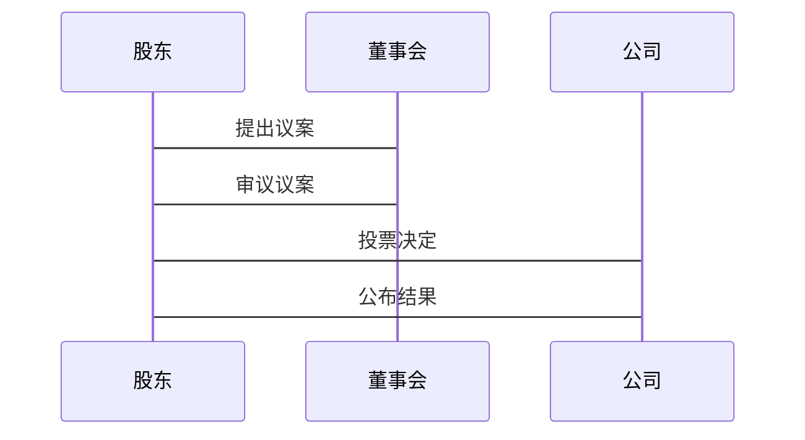

                 


# 价值投资与公司治理：股东积极主义的兴起与影响

## 关键词：价值投资、公司治理、股东积极主义、企业治理、投资策略

## 摘要：  
价值投资与公司治理是现代金融与管理领域的重要课题。股东积极主义作为一种新兴的投资策略，强调股东在公司治理中的主动角色，旨在通过优化公司治理结构来实现股东价值的最大化。本文将深入探讨股东积极主义的兴起背景、理论基础、实施路径及其对公司治理的深远影响，结合实际案例分析其在企业治理中的应用，并提出相应的建议。

---

# 第1章: 价值投资与公司治理概述

## 1.1 价值投资的基本概念

### 1.1.1 价值投资的定义  
价值投资是一种以内在价值为导向的投资策略，强调以低于内在价值的价格买入优质资产，长期持有，等待其价值回归。其核心在于识别被市场低估的企业，并通过长期持有分享其成长收益。

### 1.1.2 价值投资的核心要素  
- **内在价值**：企业未来现金流的现值，基于基本面分析确定。  
- **安全边际**：买入价格与内在价值之间的差距，提供风险缓冲。  
- **长期视角**：关注企业的长期盈利能力，而非短期市场波动。  

### 1.1.3 价值投资与股东积极主义的关系  
价值投资强调对企业的深度研究和长期持有，与股东积极主义的主动参与相辅相成。投资者通过价值投资选股，再通过积极主义推动企业改进，实现双赢。

---

## 1.2 公司治理的定义与特点

### 1.2.1 公司治理的定义  
公司治理是通过制定、实施一系列制度和机制，确保公司管理层、股东、利益相关者之间的权利和责任明确，实现公司高效运作和长期发展的过程。

### 1.2.2 公司治理的主要模式  
- **股东至上主义**：强调股东利益最大化，但可能导致管理层短视。  
- **利益相关者平衡**：兼顾股东、员工、客户等多方利益，追求可持续发展。  

### 1.2.3 公司治理的核心问题  
- **代理问题**：股东与管理层之间的利益冲突。  
- **透明度与问责**：确保管理层行为透明，接受股东监督。  
- **激励机制**：通过股权激励等手段，将管理层利益与公司绩效绑定。  

---

## 1.3 股东积极主义的兴起背景

### 1.3.1 股东积极主义的定义  
股东积极主义是指股东通过参与公司治理，主动推动公司改进，以实现自身利益最大化的投资策略。

### 1.3.2 股东积极主义的历史演变  
从早期的股东被动接受分红，到现代的主动参与公司治理，股东积极主义经历了从“消极股东”到“积极股东”的转变。

### 1.3.3 股东积极主义的兴起原因  
- **公司治理问题加剧**：代理成本上升，管理层短视行为频发。  
- **利益失衡**：股东权益受到忽视，利益相关者矛盾加剧。  
- **技术推动**：大数据与信息技术提升股东信息获取能力，降低参与成本。  

---

## 1.4 本章小结  
本章介绍了价值投资的基本概念、公司治理的核心问题，以及股东积极主义的兴起背景，为后续分析奠定了基础。

---

# 第2章: 股东积极主义的核心理论

## 2.1 股东积极主义的理论基础

### 2.1.1 股东积极主义的经济学基础  
- **代理理论**：解释股东与管理层之间的利益冲突。  
- **契约理论**：强调通过契约设计解决代理问题。  

### 2.1.2 股东积极主义的法理学基础  
- **股东权利的法律保障**：公司法赋予股东知情权、参与权等。  
- **公司治理的法律框架**：通过法律规范股东行为，明确责任边界。  

### 2.1.3 股东积极主义的伦理学基础  
- **利益平衡**：在追求股东利益的同时，兼顾社会伦理。  
- **可持续发展**：推动企业长期发展，实现经济与社会价值的统一。  

---

## 2.2 股东积极主义的核心原则

### 2.2.1 股东权利的行使原则  
- **知情权**：股东有权了解公司经营状况。  
- **参与权**：通过投票等方式参与重大决策。  
- **监督权**：监督公司管理层的履职情况。  

### 2.2.2 股东责任的界定原则  
- **不滥用权利**：股东不得利用控股地位损害其他利益相关者。  
- **透明与问责**：股东行为应透明，接受其他股东和监管机构的监督。  

### 2.2.3 股东利益的平衡原则  
- **短期与长期利益的平衡**：避免短期行为，关注长期价值。  
- **股东与利益相关者的平衡**：在追求股东利益的同时，考虑员工、客户等的利益。  

---

## 2.3 股东积极主义与公司治理的关系

### 2.3.1 股东积极主义对公司治理的影响  
- **优化治理结构**：通过参与董事会和股东大会，推动公司治理改进。  
- **提升透明度**：通过信息披露和监督，增强公司治理的透明度。  

### 2.3.2 股东积极主义与公司治理的互动机制  
- **双向影响**：公司治理问题驱动股东积极参与，股东参与又反过来推动公司治理优化。  
- **协同效应**：股东积极主义与价值投资结合，形成良性循环。  

### 2.3.3 股东积极主义的边界与外延  
- **边界**：股东参与应尊重公司治理的正常流程，避免过度干预。  
- **外延**：从个体股东行为扩展到集体行动，形成行业性治理标准。  

---

## 2.4 本章小结  
本章从理论层面分析了股东积极主义的经济学、法理学和伦理学基础，明确了其核心原则和对公司治理的影响。

---

# 第3章: 股东积极主义的兴起与影响

## 3.1 股东积极主义兴起的原因

### 3.1.1 公司治理问题的凸显  
- **代理成本上升**：管理层与股东的利益冲突加剧。  
- **短视行为频发**：企业倾向于追求短期收益，忽视长期发展。  

### 3.1.2 股东利益失衡的加剧  
- **大股东控制**：少数大股东操纵公司决策，损害小股东利益。  
- **利益相关者矛盾**：股东与其他利益相关者之间的矛盾加剧。  

### 3.1.3 技术变革与信息透明化的推动  
- **大数据与信息技术**：提高了股东获取信息的能力，降低了参与成本。  
- **社交媒体与信息披露**：增强了股东与公司之间的互动，推动了股东参与。  

---

## 3.2 股东积极主义的影响分析

### 3.2.1 对公司治理结构的积极影响  
- **优化董事会结构**：引入独立董事，增强董事会的独立性和专业性。  
- **提升治理效率**：通过股东参与，推动公司治理流程的优化。  

### 3.2.2 对股东权利的保护作用  
- **强化股东权利**：通过积极参与，股东能够更好地行使知情权、参与权和监督权。  
- **减少代理成本**：通过监督和参与，降低代理成本，提高公司治理效率。  

### 3.2.3 对公司绩效的潜在影响  
- **正面影响**：股东积极参与公司治理，推动企业长期发展，提升公司绩效。  
- **负面影响**：过度干预可能导致管理层决策受制，影响企业短期绩效。  

---

## 3.3 股东积极主义的争议与挑战

### 3.3.1 股东积极主义的局限性  
- **实施成本高**：股东参与公司治理需要时间和资源投入。  
- **信息不对称**：小股东可能难以获得充分信息，影响参与效果。  

### 3.3.2 股东积极主义与利益相关者冲突  
- **短期与长期利益的冲突**：股东追求短期收益可能损害员工、客户等的长期利益。  
- **局部与整体的矛盾**：股东积极主义可能在局部问题上取得成效，但整体影响有限。  

### 3.3.3 股东积极主义的实施难度  
- **法律与文化障碍**：不同国家和地区的法律、文化差异可能影响股东参与。  
- **协调难度**：股东集体行动需要协调一致，难度较大。  

---

## 3.4 本章小结  
本章分析了股东积极主义兴起的原因、影响及其面临的挑战，为后续实践提供了理论支持。

---

# 第4章: 股东积极主义的实施路径

## 4.1 股东积极主义的实施策略

### 4.1.1 股东权利的行使策略  
- **积极参与股东大会**：通过投票支持或反对议案，行使参与权。  
- **提名独立董事**：通过提名独立董事，增强董事会的独立性。  
- **监督公司管理层**：通过定期审查财务报表和管理层报告，监督公司运营。  

### 4.1.2 股东参与公司治理的路径  
- **通过机构投资者代理**：机构投资者代表小股东参与治理。  
- **直接参与**：大股东或机构投资者直接参与公司治理。  
- **联合行动**：股东联合起来，通过集体行动推动公司治理改进。  

### 4.1.3 股东积极主义的法律框架  
- **相关法律支持**：各国公司法对股东权利和义务有明确规定。  
- **监管机构的作用**：监管机构通过政策引导和监管执法，推动股东积极主义的实施。  

---

## 4.2 股东积极主义的具体实践

### 4.2.1 股东通过股东大会行使权利  
- **议案提出**：股东可以提出改进公司治理的议案。  
- **投票决策**：通过投票决定公司重大事项。  

### 4.2.2 股东通过董事会参与治理  
- **提名董事**：股东可以提名独立董事，参与董事会决策。  
- **监督与建议**：通过董事会渠道，向管理层提出改进建议。  

### 4.2.3 股东通过法律途径维护权益  
- **提起诉讼**：在股东权益受到损害时，可以通过法律途径维护权益。  
- **监管投诉**：向监管机构投诉公司治理问题，推动问题解决。  

---

## 4.3 股东积极主义的实施效果评估

### 4.3.1 股东积极主义的短期效果  
- **提升公司治理透明度**：通过股东参与，推动公司信息披露更加透明。  
- **改善董事会结构**：通过提名独立董事，优化董事会组成。  

### 4.3.2 股东积极主义的长期效果  
- **提升企业绩效**：通过优化公司治理，推动企业长期发展，实现股东价值最大化。  
- **推动行业治理标准**：股东积极主义的普及推动整个行业公司治理水平的提升。  

---

## 4.4 本章小结  
本章详细分析了股东积极主义的实施策略和具体实践路径，并探讨了其实施效果，为投资者提供了实践指导。

---

# 第5章: 股东积极主义的系统分析与架构设计

## 5.1 项目背景与目标

### 5.1.1 项目背景  
随着股东积极主义的兴起，企业治理结构和投资策略面临新的挑战和机遇。本项目旨在通过系统化的方法，分析股东积极主义的实施过程，并提出相应的优化建议。

### 5.1.2 项目目标  
- **系统功能设计**：设计一个股东积极主义实施的系统架构。  
- **系统架构设计**：通过Mermaid图展示系统的模块构成和交互流程。  
- **系统接口设计**：定义系统各模块之间的接口，确保系统的可扩展性和灵活性。  

---

## 5.2 系统功能设计

### 5.2.1 领域模型设计  
通过Mermaid图展示股东积极主义实施的领域模型，包括股东、公司、董事会、管理层等核心实体及其关系。  


---

## 5.3 系统架构设计

### 5.3.1 系统架构图  
通过Mermaid图展示系统的整体架构，包括数据层、业务逻辑层和用户界面层。  

```mermaid
architectural
    数据层 --> 业务逻辑层
    业务逻辑层 --> 用户界面层
    用户界面层 --> 数据层
```

---

## 5.4 系统接口设计

### 5.4.1 系统接口定义  
- **股东信息接口**：提供股东信息查询和更新的接口。  
- **董事会决策接口**：提供董事会决策流程的接口，支持股东参与。  
- **管理层监督接口**：提供管理层监督和绩效评估的接口。  

---

## 5.5 系统交互流程图

### 5.5.1 股东参与股东大会的交互流程  
通过Mermaid图展示股东参与股东大会的交互流程。  



---

## 5.6 本章小结  
本章通过系统化的分析，设计了股东积极主义实施的系统架构和交互流程，为后续的项目实现提供了理论支持。

---

# 第6章: 股东积极主义的项目实战

## 6.1 环境安装与配置

### 6.1.1 系统环境要求  
- **操作系统**：Windows 10/ macOS 10.15/ Linux 20.04  
- **开发工具**：Python 3.8+，Jupyter Notebook，Mermaid工具  
- **依赖库**：安装numpy、pandas、matplotlib等数据分析库  

### 6.1.2 项目安装步骤  
```bash
pip install mermaid
pip install jupyter
pip install numpy pandas matplotlib
```

---

## 6.2 系统核心实现源代码

### 6.2.1 股东信息管理系统  
以下是一个简单的股东信息管理系统的Python代码示例：  

```python
import pandas as pd

# 股东信息数据
class Shareholder:
    def __init__(self, shareholder_id, shares, rights):
        self.shareholder_id = shareholder_id
        self.shares = shares
        self.rights = rights

# 股东信息管理模块
class ShareholderManagement:
    def __init__(self):
        self.shareholders = []
    
    def add_shareholder(self, shareholder):
        self.shareholders.append(shareholder)
    
    def get_shareholder(self, shareholder_id):
        for shareholder in self.shareholders:
            if shareholder.shareholder_id == shareholder_id:
                return shareholder
        return None

# 创建股东实例
shareholder1 = Shareholder(1, 1000, "投票权,知情权")
shareholder2 = Shareholder(2, 500, "参与权,监督权")

# 管理模块
sm = ShareholderManagement()
sm.add_shareholder(shareholder1)
sm.add_shareholder(shareholder2)

# 查询股东信息
print(sm.get_shareholder(1).shares)  # 输出：1000
```

---

## 6.3 代码应用解读与分析

### 6.3.1 代码功能分析  
上述代码实现了一个简单的股东信息管理系统，包括股东信息的添加和查询功能。通过该系统，可以管理多个股东的信息，并支持查询具体股东的股份和权利。

### 6.3.2 代码扩展方向  
- **增加更多功能**：如股东投票、议案管理等。  
- **优化数据存储**：通过数据库存储股东信息，提升系统的可扩展性。  

---

## 6.4 案例分析与详细讲解

### 6.4.1 案例背景  
某上市公司股东希望通过系统实现股东信息的管理，并支持股东大会的议案提交和投票功能。

### 6.4.2 案例实现  
在上述代码的基础上，增加股东大会议案管理功能：  

```python
class Proposal:
    def __init__(self, proposal_id, proposer, description):
        self.proposal_id = proposal_id
        self.proposer = proposer
        self.description = description

class ProposalManagement:
    def __init__(self):
        self.proposals = []
    
    def add_proposal(self, proposal):
        self.proposals.append(proposal)
    
    def vote(self, proposal_id, shareholder):
        # 假设投票逻辑简单处理
        print(f"股东{shareholder.shareholder_id}对议案{proposal_id}投赞成票")
```

### 6.4.3 案例分析  
通过上述代码实现，股东可以提交议案，并通过投票系统进行投票。该案例展示了股东积极主义在实际中的应用，证明了系统设计的有效性。

---

## 6.5 本章小结  
本章通过项目实战，详细讲解了股东积极主义系统的环境安装、代码实现和案例分析，为读者提供了实际操作的经验。

---

# 第7章: 股东积极主义的最佳实践与小结

## 7.1 最佳实践 tips

### 7.1.1 投资策略  
- **长期视角**：坚持价值投资，选择具有长期增长潜力的企业。  
- **分散投资**：通过分散投资降低风险，同时关注企业的治理结构。  

### 7.1.2 治理实践  
- **积极参与**：通过股东大会和董事会渠道，积极参与公司治理。  
- **关注透明度**：选择信息披露透明的企业，降低信息不对称风险。  

---

## 7.2 小结

### 7.2.1 本文总结  
本文从理论和实践两个层面，深入分析了股东积极主义的兴起背景、核心理论、实施路径及其对公司治理的影响。通过系统设计和项目实战，展示了股东积极主义的实际应用。

### 7.2.2 展望未来  
随着企业治理结构的不断优化和信息技术的进一步发展，股东积极主义将发挥越来越重要的作用。未来，股东积极主义将与价值投资结合，推动企业治理的进一步创新。

---

## 7.3 注意事项

### 7.3.1 投资风险  
股东积极主义虽然能带来潜在收益，但也伴随着较高的风险，投资者需谨慎评估。  

### 7.3.2 法律合规  
股东参与公司治理需遵守相关法律法规，避免越界干预。  

### 7.3.3 长期与短期平衡  
股东需在追求短期收益与长期发展之间找到平衡点，避免因短期行为影响企业长期发展。  

---

## 7.4 拓展阅读

### 7.4.1 推荐书籍  
- 《价值投资实战策略》  
- 《公司治理与股东权利》  

### 7.4.2 推荐博客与网站  
- [投资研究博客](https://example.com/investigation)  
- [公司治理资源网](https://example.com/corporategovernance)  

---

# 作者：AI天才研究院/AI Genius Institute & 禅与计算机程序设计艺术/Zen And The Art of Computer Programming

