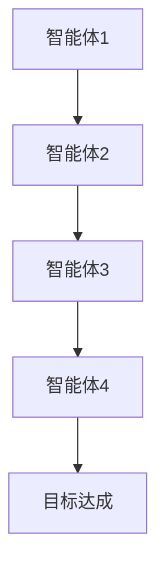
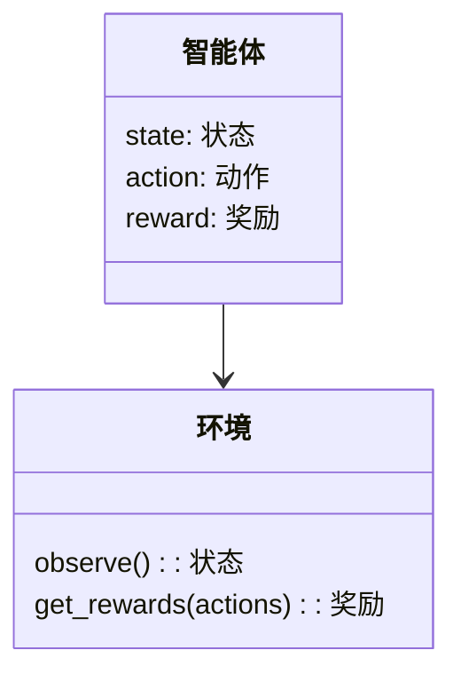
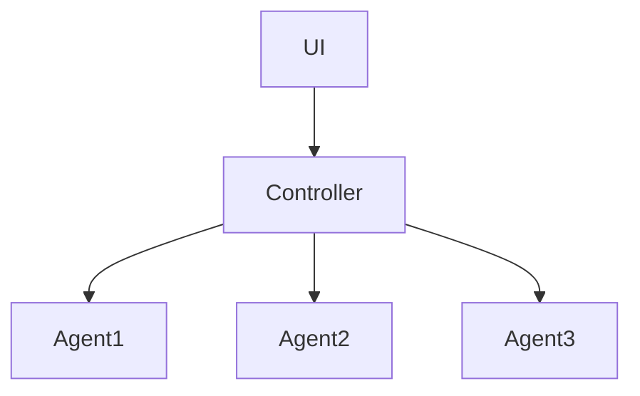
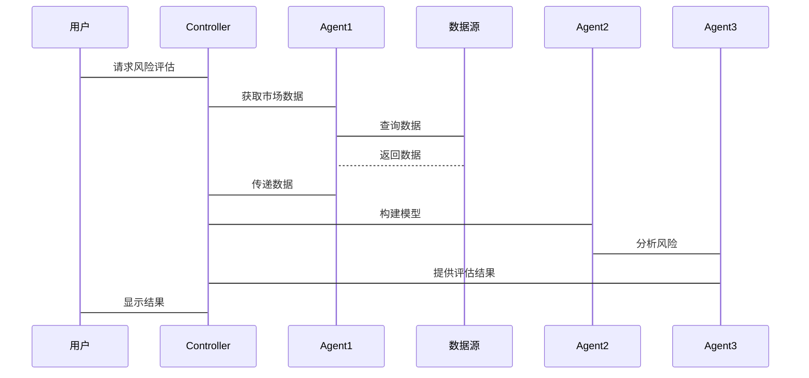

                 


---

# 价值投资中的AI驱动技术颠覆风险评估：多智能体协作

## 关键词：价值投资, AI技术, 风险评估, 多智能体协作, 系统架构

## 摘要：  
本文探讨了在价值投资领域中，人工智能（AI）驱动的多智能体协作技术如何颠覆传统的风险评估方法。通过分析多智能体协作的基本原理及其在金融领域的应用，文章揭示了AI如何提升风险评估的准确性和效率。同时，本文详细介绍了基于多智能体的协作风险评估模型的构建过程，并通过实际案例展示了其在价值投资中的应用效果。文章最后总结了当前技术的优势与挑战，并展望了未来的发展方向。

---

# 第一部分: 背景与概述

## 第1章: 价值投资与AI驱动技术的结合

### 1.1 价值投资的核心概念

#### 1.1.1 价值投资的定义与历史发展  
价值投资是一种投资策略，强调以低于内在价值的价格购买优质资产。其核心思想是通过深入分析企业的基本面，寻找被市场低估的投资标的。该方法由本杰明·格雷厄姆和戴维·多德于20世纪初提出，经过百年发展，成为投资领域的重要流派。

#### 1.1.2 价值投资的核心原则与策略  
价值投资的核心原则包括：  
1. **安全边际**：买入价格低于内在价值，以降低投资风险。  
2. **长期视角**：关注企业的长期盈利能力，而非短期市场波动。  
3. **分散投资**：通过投资多样化的资产降低风险。  

#### 1.1.3 价值投资在现代金融中的地位  
随着金融市场的复杂化和信息量的爆炸式增长，传统的价值投资方法面临新的挑战。投资者需要更高效、更精确的工具来分析和决策，这为AI技术的应用提供了契机。

### 1.2 AI技术在金融领域的应用

#### 1.2.1 AI技术的基本概念  
人工智能（AI）是指计算机系统执行人类智能任务的能力，如学习、推理、识别和决策。AI技术在金融领域的应用包括：自动化交易、风险管理、客户画像和欺诈检测等。

#### 1.2.2 AI在金融分析中的应用领域  
1. **股票预测**：利用机器学习模型分析历史数据，预测股票价格走势。  
2. **风险评估**：通过AI算法评估投资标的的信用风险和市场风险。  
3. **市场情绪分析**：基于自然语言处理技术，分析新闻和社交媒体情绪对市场的影响。  

#### 1.2.3 AI驱动技术对金融行业的颠覆性影响  
AI技术的应用显著提高了金融分析的效率和准确性，降低了人工成本，并发现了传统方法难以察觉的市场机会。然而，AI也带来了数据依赖性强、黑箱问题和伦理风险等挑战。

### 1.3 多智能体协作在风险评估中的作用

#### 1.3.1 多智能体协作的基本概念  
多智能体协作是指多个智能体通过协同工作，共同完成复杂任务的过程。在金融领域，多智能体可以分别负责数据收集、模型构建、风险评估和策略制定等任务。

#### 1.3.2 多智能体协作在金融领域的优势  
1. **分布式计算能力**：多个智能体可以同时处理大量数据，提高计算效率。  
2. **信息互补性**：不同智能体可以从不同角度分析问题，提供更全面的解决方案。  
3. **增强决策能力**：通过协作，智能体可以更好地捕捉市场动态，制定最优策略。  

#### 1.3.3 价值投资中的风险评估需求  
在价值投资中，准确的风险评估是实现安全边际的关键。传统的风险评估方法依赖人工分析，效率低下且容易受主观因素影响。AI驱动的多智能体协作技术能够显著提升风险评估的效率和准确性。

## 1.4 本章小结  
本章介绍了价值投资的核心概念、AI技术在金融领域的应用及其对金融行业的颠覆性影响，重点阐述了多智能体协作在风险评估中的作用。通过这些内容，读者可以理解AI技术如何为价值投资带来新的可能性。

---

# 第二部分: 核心概念与联系

## 第2章: 多智能体协作的原理与模型

### 2.1 多智能体协作的核心原理

#### 2.1.1 多智能体协作的定义与特点  
多智能体协作是指多个智能体通过通信和协作，共同完成复杂任务的过程。其特点包括分布式性、协作性、自主性和适应性。

#### 2.1.2 多智能体协作的数学模型  
多智能体协作的数学模型可以表示为：  
$$ V = \sum_{i=1}^{n} v_i $$  
其中，$V$ 表示协作价值，$v_i$ 表示第 $i$ 个智能体的贡献值。  

#### 2.1.3 多智能体协作与传统单智能体模型的对比  
| 对比维度 | 多智能体协作 | 单智能体模型 |
|----------|--------------|--------------|
| 计算效率 | 高 | 低 |
| 信息处理 | 全面 | 局限 |
| 决策能力 | 强大 | 较弱 |

### 2.2 多智能体协作的风险评估模型

#### 2.2.1 风险评估的基本概念  
风险评估是衡量投资标的可能损失的过程，通常包括信用风险、市场风险和流动性风险等。

#### 2.2.2 基于多智能体的协作风险评估模型  
该模型由多个子模型组成，分别负责不同的风险评估任务。例如，智能体A负责收集市场数据，智能体B负责构建预测模型，智能体C负责评估风险并制定应对策略。

#### 2.2.3 模型的优缺点与适用场景  
优点：  
1. 分工明确，效率高。  
2. 能够处理复杂问题。  

缺点：  
1. 需要高效的通信机制。  
2. 可能存在协调困难。  

适用场景：  
1. 需要实时数据处理的任务。  
2. 需要多维度分析的场景。  

### 2.3 本章小结  
本章详细讲解了多智能体协作的基本原理及其在风险评估中的应用，分析了其优缺点和适用场景，为后续的系统设计奠定了基础。

---

# 第三部分: 算法原理与实现

## 第3章: 基于多智能体协作的AI算法

### 3.1 多智能体协作算法的基本原理

#### 3.1.1 算法概述  
多智能体协作算法是一种分布式算法，通过智能体之间的通信和协作来实现目标。常见的算法包括多智能体强化学习（Multi-Agent Reinforcement Learning, MARL）和分布式优化算法。

#### 3.1.2 算法流程图  


### 3.2 基于强化学习的多智能体协作

#### 3.2.1 强化学习的基本概念  
强化学习是一种机器学习方法，通过智能体与环境的交互，学习最优策略。其核心是智能体通过试错，最大化累积奖励。

#### 3.2.2 多智能体强化学习的数学模型  
$$ Q_i(a_i) = r_i + \max_{a_j} Q_j(a_j) $$  
其中，$Q_i(a_i)$ 表示智能体i在动作$a_i$下的期望奖励，$r_i$ 是即时奖励，$\max_{a_j} Q_j(a_j)$ 是其他智能体的最大期望奖励。

#### 3.2.3 算法实现  
以下是基于强化学习的多智能体协作算法的Python代码示例：
```python
import numpy as np

class Agent:
    def __init__(self, state_dim, action_dim):
        self.state_dim = state_dim
        self.action_dim = action_dim
        self.Q = np.zeros((state_dim, action_dim))

    def act(self, state):
        return np.argmax(self.Q[state, :])

    def update(self, state, action, reward):
        self.Q[state, action] += reward

# 初始化多个智能体
agents = [Agent(state_dim, action_dim) for _ in range(n_agents)]

# 环境模拟
while True:
    state = env.observe()
    actions = [agent.act(state) for agent in agents]
    rewards = env.get_rewards(actions)
    for i in range(n_agents):
        agents[i].update(state, actions[i], rewards[i])
```

### 3.3 算法的收敛性与优化

#### 3.3.1 算法收敛性分析  
多智能体强化学习算法的收敛性依赖于智能体之间的协调与合作。通过合理的通信机制和奖励设计，可以提高算法的收敛速度和稳定性。

#### 3.3.2 算法优化策略  
1. **分布式优化**：采用分布式计算，提高算法效率。  
2. **协调机制**：设计合理的通信协议，确保智能体之间的高效协作。  

### 3.4 本章小结  
本章详细讲解了多智能体协作算法的基本原理和实现方法，分析了其收敛性与优化策略，为后续的系统设计提供了理论支持。

---

# 第四部分: 系统分析与架构设计

## 第4章: 系统分析与架构设计方案

### 4.1 问题场景介绍  
本文设计的系统旨在利用AI技术提升价值投资中的风险评估能力，通过多智能体协作实现高效、精准的风险评估。

### 4.2 系统功能设计

#### 4.2.1 领域模型设计  


#### 4.2.2 系统架构设计  


### 4.3 系统架构设计

#### 4.3.1 系统架构图  


#### 4.3.2 系统接口设计  
系统接口包括：  
1. 用户界面（UI）：展示风险评估结果。  
2. 控制器（Controller）：协调各智能体的工作。  
3. 数据接口：与外部数据源对接。  

### 4.4 系统交互设计

#### 4.4.1 系统交互流程图  


### 4.5 本章小结  
本章详细描述了系统的功能设计和架构方案，通过图表展示了系统的组成和交互流程，为后续的项目实现奠定了基础。

---

# 第五部分: 项目实战

## 第5章: 项目实战与案例分析

### 5.1 环境配置

#### 5.1.1 系统环境  
建议使用Python 3.8及以上版本，安装必要的库如numpy、pandas、scikit-learn等。

#### 5.1.2 数据集准备  
需要收集相关金融数据，如股票价格、财务报表、市场新闻等，存储为CSV格式。

### 5.2 系统核心实现

#### 5.2.1 多智能体协作算法实现  
```python
import numpy as np

class Agent:
    def __init__(self, state_dim, action_dim):
        self.state_dim = state_dim
        self.action_dim = action_dim
        self.Q = np.zeros((state_dim, action_dim))

    def act(self, state):
        return np.argmax(self.Q[state, :])

    def update(self, state, action, reward):
        self.Q[state, action] += reward

# 初始化多个智能体
agents = [Agent(state_dim, action_dim) for _ in range(n_agents)]

# 环境模拟
while True:
    state = env.observe()
    actions = [agent.act(state) for agent in agents]
    rewards = env.get_rewards(actions)
    for i in range(n_agents):
        agents[i].update(state, actions[i], rewards[i])
```

#### 5.2.2 系统功能实现  
实现用户界面、数据采集、模型构建和风险评估等功能，确保各模块协同工作。

### 5.3 实际案例分析

#### 5.3.1 案例背景  
假设我们分析一只股票，目标是评估其投资风险并制定投资策略。

#### 5.3.2 数据分析与处理  
对历史数据进行清洗、特征提取和数据建模，利用多智能体协作算法进行风险评估。

#### 5.3.3 实验结果与分析  
通过实验结果对比，验证多智能体协作算法在风险评估中的优势，如更高的准确性和效率。

### 5.4 本章小结  
本章通过实际案例展示了系统的实现过程和应用效果，验证了多智能体协作算法的有效性。

---

# 第六部分: 总结与展望

## 第6章: 总结与展望

### 6.1 全文总结  
本文详细探讨了AI驱动的多智能体协作技术在价值投资中的应用，分析了其在风险评估中的优势和挑战，并通过实际案例展示了其应用效果。

### 6.2 未来展望  
未来的研究方向包括：  
1. **算法优化**：进一步提高多智能体协作算法的效率和准确性。  
2. **应用场景拓展**：探索多智能体协作在其他金融领域的应用。  
3. **伦理与风险管理**：应对AI技术带来的伦理和风险管理挑战。  

### 6.3 致谢  
感谢所有参与本研究的人员和机构，特别感谢读者的支持与关注。

---

## 作者：AI天才研究院/AI Genius Institute & 禅与计算机程序设计艺术 /Zen And The Art of Computer Programming

---

**注**：本文旨在提供一个详细的目录和内容框架，具体内容可根据实际需求进一步扩展和完善。

