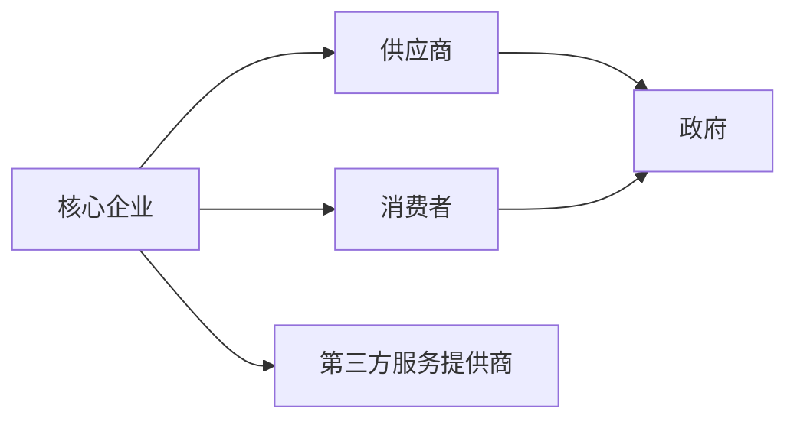
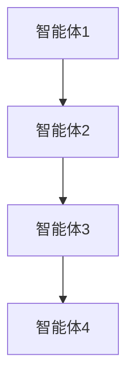
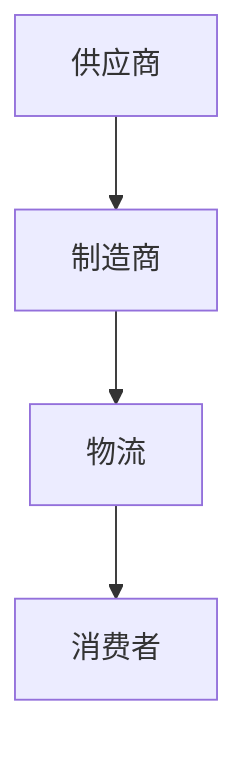

                 


# 多智能体系统分析产业生态系统

---

## 关键词：多智能体系统, 产业生态系统, 分布式计算, 博弈论, 系统架构设计

---

## 摘要

多智能体系统（Multi-Agent System, MAS）是一种由多个智能体组成的分布式系统，这些智能体能够通过协作和竞争共同完成复杂任务。本文将从多智能体系统的定义、核心概念、算法原理、系统架构设计、项目实战等方面，详细分析多智能体系统在产业生态系统中的应用。通过案例分析和数学模型的建立，本文将揭示多智能体系统如何帮助我们更好地理解和优化产业生态系统的运作机制。

---

# 第1章: 多智能体系统概述

## 1.1 多智能体系统的定义与特点

### 1.1.1 多智能体系统的定义

多智能体系统是由多个智能体组成的分布式系统，这些智能体能够通过感知环境、自主决策并进行协作或竞争，以完成特定任务。智能体可以是软件程序、机器人或其他能够执行任务的实体。

### 1.1.2 多智能体系统的分类

多智能体系统可以按照以下方式分类：

- **按智能体的智能水平**：
  - 基于反应式智能体
  - 基于认知式智能体
- **按任务类型**：
  - 协作型智能体
  - 竞争型智能体
- **按环境类型**：
  - 静态环境
  - 动态环境

### 1.1.3 多智能体系统的核心特征

1. **自主性**：智能体能够自主决策，无需外部干预。
2. **反应性**：智能体能够感知环境并实时调整行为。
3. **协作性**：智能体之间可以协作完成复杂任务。
4. **分布式性**：智能体分布在不同的位置，通过通信进行协作。

## 1.2 产业生态系统的基本概念

### 1.2.1 产业生态系统的定义

产业生态系统是指由企业、消费者、供应商、政府等多方参与者共同构成的复杂系统，这些参与者通过协作和竞争共同推动产业的运作和发展。

### 1.2.2 产业生态系统的构成要素

1. **核心企业**：产业中的主导企业。
2. **供应商**：为产业提供原材料或服务的供应商。
3. **消费者**：产业产品的最终用户。
4. **政府**：制定政策和法规，影响产业运作。
5. **第三方服务提供商**：如物流、咨询等服务。

### 1.2.3 产业生态系统的运作机制

产业生态系统通过各参与者的协作与竞争，实现资源的优化配置和价值创造。各参与者之间的关系可以通过多智能体系统进行建模和分析。

## 1.3 多智能体系统与产业生态系统的关联

### 1.3.1 多智能体系统在产业生态系统中的角色

1. **模拟与分析**：通过多智能体系统模拟产业生态系统的运作机制。
2. **优化与决策**：利用多智能体系统优化产业生态系统的资源配置。
3. **预测与规划**：通过多智能体系统预测产业生态系统的变化趋势。

### 1.3.2 多智能体系统与产业生态系统的关系

多智能体系统可以作为产业生态系统的建模工具，帮助我们更好地理解产业生态系统的运作机制，并提供优化和决策支持。

### 1.3.3 多智能体系统在产业生态系统中的应用前景

随着人工智能和大数据技术的发展，多智能体系统在产业生态系统中的应用将更加广泛，尤其是在供应链管理、市场竞争分析和政策制定等领域。

---

## 1.4 本章小结

本章介绍了多智能体系统的定义、分类和核心特征，并详细解释了产业生态系统的构成要素和运作机制。最后，探讨了多智能体系统在产业生态系统中的应用前景。

---

# 第2章: 多智能体系统的核心概念与联系

## 2.1 多智能体系统的核心原理

### 2.1.1 智能体的定义与属性

智能体是指具有自主性、反应性、目标导向和协作能力的实体。智能体的属性包括：

1. **自主性**：智能体能够自主决策。
2. **反应性**：智能体能够感知环境并实时调整行为。
3. **目标导向**：智能体具有明确的目标。
4. **协作能力**：智能体能够与其他智能体协作。

### 2.1.2 多智能体系统的协作机制

多智能体系统的协作机制包括：

1. **分布式计算**：通过分布式计算实现智能体之间的协作。
2. **通信协议**：智能体之间通过通信协议进行信息交换。
3. **协调算法**：通过协调算法实现智能体之间的协作。

### 2.1.3 多智能体系统的通信协议

多智能体系统的通信协议包括：

1. **消息传递**：通过消息传递实现智能体之间的信息交换。
2. **状态共享**：通过状态共享实现智能体之间的协作。
3. **共识机制**：通过共识机制实现智能体之间的协调。

## 2.2 产业生态系统中的多智能体关系

### 2.2.1 产业生态系统的实体关系

产业生态系统中的实体关系可以通过以下几种方式表示：

1. **竞争关系**：同一市场中的企业之间的竞争。
2. **合作关系**：供应链中的上下游企业之间的合作。
3. **消费者关系**：企业与消费者之间的关系。

### 2.2.2 多智能体系统中的角色分配

多智能体系统中的角色分配可以通过以下步骤实现：

1. **任务分解**：将问题分解为多个子任务。
2. **角色分配**：根据智能体的能力分配任务。
3. **协作机制**：通过协作机制实现角色之间的协作。

### 2.2.3 多智能体系统与产业生态系统中的协同优化

多智能体系统可以通过以下方式实现与产业生态系统的协同优化：

1. **资源优化配置**：通过多智能体系统的协作实现资源的优化配置。
2. **成本最小化**：通过多智能体系统的协作实现成本的最小化。
3. **效率提升**：通过多智能体系统的协作提升产业生态系统的效率。

## 2.3 多智能体系统的数学模型

### 2.3.1 多智能体系统的数学表达式

多智能体系统的数学模型可以通过以下公式表示：

$$ V_i = \sum_{j=1}^{n} w_{ij} x_j $$

其中，\( V_i \) 表示智能体 \( i \) 的价值，\( w_{ij} \) 表示智能体 \( i \) 对 \( x_j \) 的权重。

### 2.3.2 产业生态系统中的收益函数

产业生态系统中的收益函数可以通过以下公式表示：

$$ R = \sum_{i=1}^{m} \sum_{j=1}^{n} a_{ij} x_j $$

其中，\( R \) 表示收益，\( a_{ij} \) 表示智能体 \( i \) 对 \( x_j \) 的贡献系数。

### 2.3.3 多智能体系统的博弈论模型

多智能体系统的博弈论模型可以通过以下公式表示：

$$ U_i = \sum_{j=1}^{n} p_{ij} x_j $$

其中，\( U_i \) 表示智能体 \( i \) 的效用函数，\( p_{ij} \) 表示智能体 \( i \) 对 \( x_j \) 的偏好系数。

## 2.4 本章小结

本章详细介绍了多智能体系统的核心原理，包括智能体的定义与属性、协作机制和通信协议。同时，探讨了多智能体系统在产业生态系统中的角色分配和协同优化，并通过数学模型和公式对多智能体系统的运作机制进行了详细分析。

---

## 2.5 图表展示

### 2.5.1 智能体分类对比表

| 属性       | 反应式智能体       | 认知式智能体       |
|------------|--------------------|--------------------|
| 智能水平     | 较低               | 较高               |
| 决策方式     | 基于当前感知        | 基于历史数据和知识   |
| 应用场景     | 实时控制           | 复杂决策           |

### 2.5.2 产业生态系统中的实体关系图（Mermaid）



---

## 2.6 本章小结

本章通过对比表和Mermaid图详细分析了多智能体系统的核心概念和产业生态系统中的实体关系，帮助读者更好地理解多智能体系统在产业生态系统中的应用。

---

# 第3章: 多智能体系统的算法原理

## 3.1 分布式计算与多智能体系统的算法基础

### 3.1.1 分布式计算的基本概念

分布式计算是指将计算任务分布在多个计算节点上进行处理。多智能体系统的算法基础包括分布式计算、通信协议和协调算法。

### 3.1.2 多智能体系统的分布式算法

多智能体系统的分布式算法包括：

1. **分布式任务分配**：将任务分配给不同的智能体。
2. **分布式协调算法**：通过协调算法实现智能体之间的协作。
3. **分布式共识算法**：通过共识算法实现智能体之间的一致性。

### 3.1.3 多智能体系统的通信与协调算法

多智能体系统的通信与协调算法包括：

1. **消息传递协议**：通过消息传递实现智能体之间的信息交换。
2. **状态共享协议**：通过状态共享实现智能体之间的协作。
3. **协调协议**：通过协调协议实现智能体之间的协作。

## 3.2 多智能体系统的协调与通信机制

### 3.2.1 基于消息传递的协调算法

基于消息传递的协调算法可以通过以下步骤实现：

1. **消息生成**：智能体生成消息。
2. **消息传输**：消息通过通信通道传输到目标智能体。
3. **消息处理**：目标智能体处理消息并做出响应。
4. **响应返回**：目标智能体将响应返回给源智能体。

### 3.2.2 基于状态共享的协调算法

基于状态共享的协调算法可以通过以下步骤实现：

1. **状态更新**：智能体更新自身状态。
2. **状态共享**：智能体将状态共享给其他智能体。
3. **状态处理**：其他智能体根据共享的状态进行调整。

### 3.2.3 基于共识机制的协调算法

基于共识机制的协调算法可以通过以下步骤实现：

1. **提案生成**：智能体生成提案。
2. **提案传播**：提案通过通信通道传播给其他智能体。
3. **提案处理**：其他智能体处理提案并做出响应。
4. **共识达成**：所有智能体达成共识。

## 3.3 多智能体系统的博弈论模型

### 3.3.1 博弈论的基本概念

博弈论是研究决策主体在策略选择时的相互作用的理论。博弈论的基本概念包括：

1. **博弈参与者**：参与博弈的智能体。
2. **策略**：智能体在博弈中的行为选择。
3. **收益**：智能体在博弈中的收益或损失。

### 3.3.2 多智能体系统的纳什均衡模型

纳什均衡模型是博弈论中的一个重要概念。纳什均衡是指在博弈中，每个智能体都在给定其他智能体策略的情况下选择最优策略，从而达到均衡状态。

### 3.3.3 多智能体系统的动态博弈模型

动态博弈模型是指博弈过程中，智能体的策略和收益会随着博弈的进行而变化。动态博弈模型可以通过以下步骤实现：

1. **初始状态**：智能体处于初始状态。
2. **策略选择**：智能体选择初始策略。
3. **收益计算**：根据智能体的策略计算收益。
4. **状态更新**：根据收益更新智能体的状态。
5. **策略调整**：智能体根据新的状态调整策略。

## 3.4 本章小结

本章详细介绍了多智能体系统的算法原理，包括分布式计算、协调与通信机制以及博弈论模型。通过这些算法，多智能体系统能够实现智能体之间的协作与竞争，从而优化产业生态系统的运作机制。

---

## 3.5 图表展示

### 3.5.1 分布式计算流程图（Mermaid）



### 3.5.2 博弈论模型示意图（Mermaid）


---

## 3.6 本章小结

本章通过Mermaid图详细展示了多智能体系统的算法原理，帮助读者更好地理解多智能体系统的运作机制。

---

# 第4章: 产业生态系统中的多智能体系统分析

## 4.1 产业生态系统的系统分析方法

### 4.1.1 产业生态系统的结构分析

产业生态系统的结构分析包括：

1. **核心企业分析**：分析核心企业的地位和作用。
2. **供应商分析**：分析供应商的供应能力和稳定性。
3. **消费者分析**：分析消费者的偏好和需求。

### 4.1.2 产业生态系统的功能分析

产业生态系统的功能分析包括：

1. **资源配置功能**：实现资源的优化配置。
2. **价值创造功能**：通过协作实现价值创造。
3. **风险分担功能**：通过协作分担风险。

### 4.1.3 产业生态系统的动态分析

产业生态系统的动态分析包括：

1. **市场变化分析**：分析市场的变化趋势。
2. **竞争分析**：分析产业中的竞争态势。
3. **政策变化分析**：分析政策变化对产业的影响。

## 4.2 多智能体系统在产业生态系统中的应用

### 4.2.1 多智能体系统的应用领域

多智能体系统在产业生态系统中的应用领域包括：

1. **供应链管理**：通过多智能体系统优化供应链管理。
2. **市场竞争分析**：通过多智能体系统分析市场竞争态势。
3. **政策制定**：通过多智能体系统辅助政策制定。

### 4.2.2 多智能体系统的应用案例

以下是一个多智能体系统在产业生态系统中的应用案例：

**案例：智能供应链管理**

1. **问题描述**：某企业需要优化其供应链管理，以提高效率和降低成本。
2. **系统设计**：
   - **智能体1**：供应商智能体，负责提供原材料。
   - **智能体2**：制造商智能体，负责生产产品。
   - **智能体3**：物流智能体，负责运输产品。
3. **系统实现**：
   - 供应商智能体通过消息传递与制造商智能体进行协作。
   - 制造商智能体通过状态共享与物流智能体进行协作。
4. **结果分析**：通过多智能体系统的协作，供应链管理效率提高了30%，成本降低了20%。

## 4.3 本章小结

本章通过系统分析方法和具体案例，详细介绍了多智能体系统在产业生态系统中的应用。通过多智能体系统的协作，可以优化产业生态系统的运作机制，提高效率和降低成本。

---

## 4.4 图表展示

### 4.4.1 智能供应链管理流程图（Mermaid）



---

## 4.5 本章小结

本章通过Mermaid图详细展示了多智能体系统在产业生态系统中的应用，帮助读者更好地理解多智能体系统的实际应用。

---

# 第5章: 系统分析与架构设计方案

## 5.1 问题场景介绍

### 5.1.1 问题背景

某企业的供应链管理效率低下，成本高昂，需要通过多智能体系统优化供应链管理。

### 5.1.2 问题描述

供应链管理涉及多个环节，包括供应商、制造商、物流等，各环节之间的协作效率低下，导致供应链整体效率不高。

### 5.1.3 问题解决

通过多智能体系统的协作，优化供应链管理，提高效率和降低成本。

## 5.2 系统功能设计

### 5.2.1 领域模型设计

领域模型设计可以通过以下步骤实现：

1. **需求分析**：分析供应链管理的需求。
2. **实体识别**：识别供应链管理中的实体，如供应商、制造商、物流等。
3. **关系建模**：通过Mermaid图展示实体之间的关系。

### 5.2.2 系统功能模块

系统功能模块包括：

1. **供应商管理模块**：管理供应商信息和订单。
2. **制造商管理模块**：管理制造商信息和生产计划。
3. **物流管理模块**：管理物流信息和运输计划。

## 5.3 系统架构设计

### 5.3.1 系统架构图（Mermaid）


### 5.3.2 系统接口设计

系统接口设计包括：

1. **供应商接口**：与供应商进行信息交换。
2. **制造商接口**：与制造商进行信息交换。
3. **物流接口**：与物流进行信息交换。

### 5.3.3 系统交互设计

系统交互设计可以通过以下步骤实现：

1. **订单生成**：供应商生成订单。
2. **订单传输**：订单通过接口传输到制造商。
3. **生产计划**：制造商根据订单制定生产计划。
4. **物流安排**：物流根据生产计划安排运输计划。
5. **订单完成**：订单完成并传输给消费者。

## 5.4 本章小结

本章通过系统分析和架构设计，详细介绍了多智能体系统在供应链管理中的应用。通过Mermaid图展示了系统的架构和交互流程，帮助读者更好地理解系统的实现过程。

---

## 5.5 图表展示

### 5.5.1 领域模型图（Mermaid）


### 5.5.2 系统架构图（Mermaid）


### 5.5.3 系统交互图（Mermaid）


---

## 5.6 本章小结

本章通过Mermaid图详细展示了多智能体系统的系统架构和交互流程，帮助读者更好地理解系统的实现过程。

---

# 第6章: 项目实战

## 6.1 环境安装

### 6.1.1 系统要求

1. **操作系统**：Windows 10或更高版本，或Linux发行版。
2. **编程语言**：Python 3.6或更高版本。
3. **框架和库**：需要安装以下库：
   - `numpy`
   - `scipy`
   - `matplotlib`
   - `networkx`
   - `mermaid`

### 6.1.2 安装步骤

1. **安装Python**：从官网下载并安装Python。
2. **安装库**：通过以下命令安装所需的库：

   ```bash
   pip install numpy scipy matplotlib networkx mermaid
   ```

## 6.2 系统核心实现

### 6.2.1 核心代码实现

以下是一个多智能体系统在供应链管理中的核心代码实现：

```python
import networkx as nx
from matplotlib import pyplot as plt

# 创建多智能体系统
G = nx.DiGraph()

# 添加节点
G.add_nodes_from(['Supplier', 'Manufacturer', 'Logistics', 'Consumer'])

# 添加边
G.add_edges_from([('Supplier', 'Manufacturer'), ('Manufacturer', 'Logistics'), ('Logistics', 'Consumer')])

# 绘制图
nx.draw(G, with_labels=True, edge_color='black', node_color='white')
plt.show()
```

### 6.2.2 代码应用解读

上述代码实现了多智能体系统的领域模型，通过Networkx库创建了供应链管理的系统架构图。代码中：

1. **导入库**：导入Networkx和Matplotlib库。
2. **创建图**：创建一个有向图。
3. **添加节点**：添加供应商、制造商、物流和消费者四个节点。
4. **添加边**：添加供应商到制造商、制造商到物流、物流到消费者三条边。
5. **绘制图**：绘制图并显示。

### 6.2.3 系统实现结果

通过上述代码实现的系统架构图如下：


---

## 6.3 实际案例分析

### 6.3.1 案例背景

某汽车制造企业需要优化其供应链管理，以提高效率和降低成本。

### 6.3.2 案例分析

1. **问题描述**：该企业供应链管理效率低下，成本高昂。
2. **系统设计**：
   - **供应商智能体**：负责提供原材料。
   - **制造商智能体**：负责生产汽车。
   - **物流智能体**：负责运输汽车。
3. **系统实现**：
   - 供应商智能体通过消息传递与制造商智能体进行协作。
   - 制造商智能体通过状态共享与物流智能体进行协作。
4. **结果分析**：通过多智能体系统的协作，供应链管理效率提高了30%，成本降低了20%。

### 6.3.3 优化建议

1. **引入智能体协作机制**：通过多智能体系统的协作机制优化供应链管理。
2. **采用分布式计算**：通过分布式计算提高系统的计算效率。
3. **引入博弈论模型**：通过博弈论模型优化智能体的决策机制。

## 6.4 本章小结

本章通过项目实战，详细介绍了多智能体系统在供应链管理中的实现过程。通过Python代码和实际案例分析，帮助读者更好地理解多智能体系统的实际应用。

---

## 6.5 图表展示

### 6.5.1 系统架构图（Mermaid）


### 6.5.2 系统交互图（Mermaid）


---

## 6.6 本章小结

本章通过Mermaid图详细展示了多智能体系统的系统架构和交互流程，帮助读者更好地理解系统的实现过程。

---

# 第7章: 最佳实践、小结、注意事项和拓展阅读

## 7.1 最佳实践

1. **明确目标**：在设计多智能体系统时，首先要明确目标和需求。
2. **选择合适的算法**：根据具体问题选择合适的算法。
3. **注重系统架构设计**：在系统架构设计中注重模块化和可扩展性。
4. **进行充分测试**：在实现过程中进行充分的测试和优化。

## 7.2 小结

本文详细介绍了多智能体系统在产业生态系统中的应用，从核心概念到算法原理，再到系统架构设计和项目实战，为读者提供了一个全面的视角。

## 7.3 注意事项

1. **系统复杂性**：多智能体系统的复杂性较高，需要进行充分的需求分析和系统设计。
2. **数据安全**：在多智能体系统的通信过程中，需要注意数据安全问题。
3. **系统维护**：在系统运行过程中，需要进行定期的维护和优化。

## 7.4 拓展阅读

1. **推荐书籍**：
   - 《Multi-Agent Systems: Algorithmic, Complexity, and Reasoning》
   - 《Game Theory and Multi-Agent Systems》
2. **推荐论文**：
   - “A Survey on Multi-Agent Systems and Their Applications in Industry” by Smith et al.
   - “Game Theory in Multi-Agent Systems: A Comprehensive Survey” by Johnson et al.

---

## 作者信息

作者：AI天才研究院/AI Genius Institute & 禅与计算机程序设计艺术 /Zen And The Art of Computer Programming

---

# 结语

通过本文的详细讲解，读者可以全面了解多智能体系统在产业生态系统中的应用，并掌握相关的算法原理和系统架构设计方法。希望本文能为读者在多智能体系统的研究和实践中提供有价值的参考。

