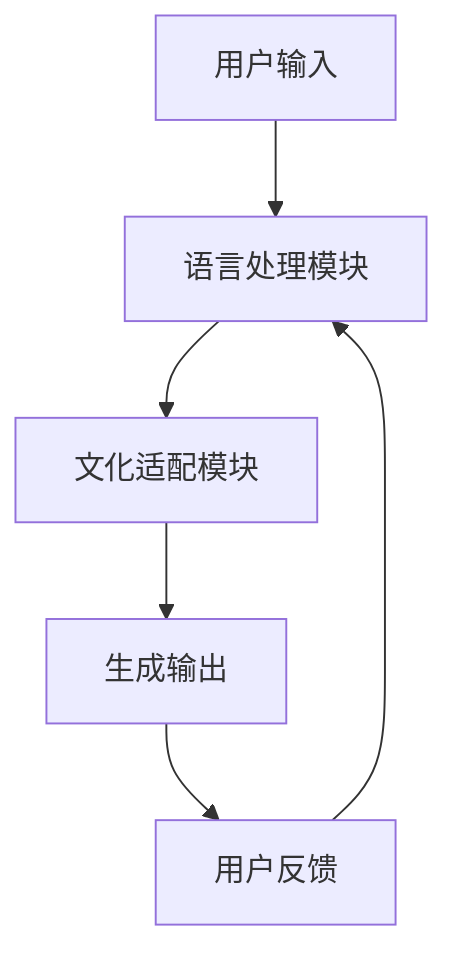
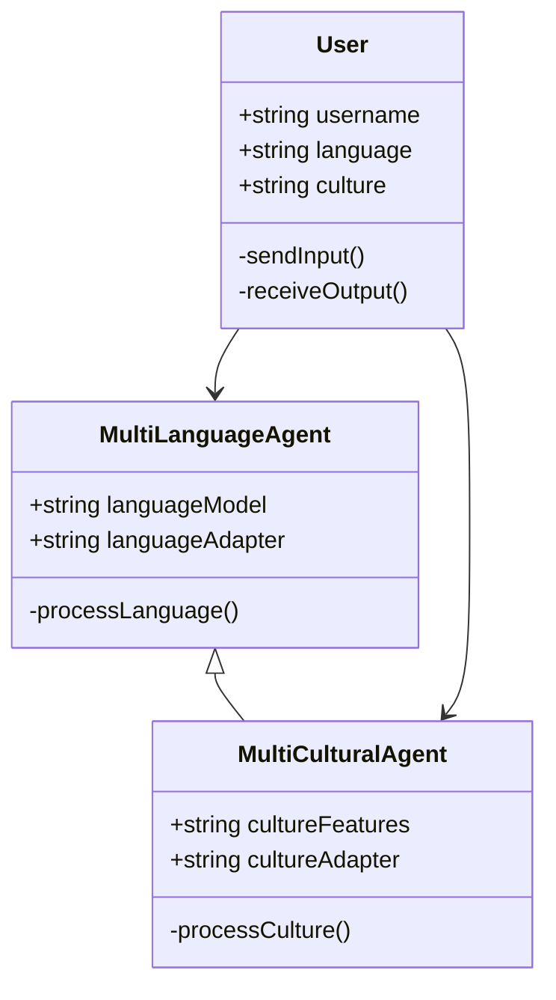
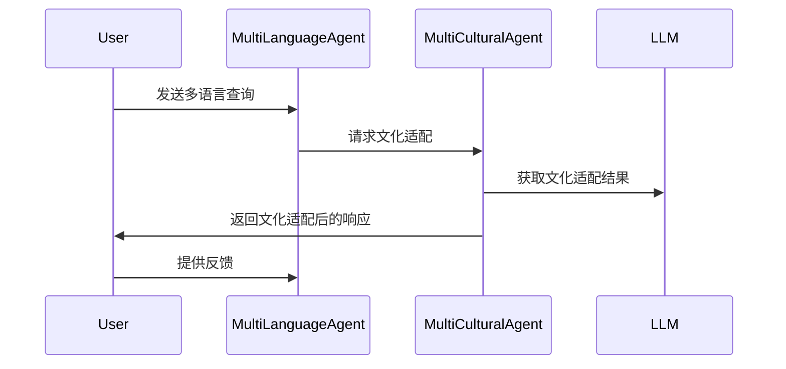

                 


# 多语言多文化AI Agent：LLM在跨文化交流中的应用

## 关键词：多语言AI Agent，跨文化交流，大型语言模型（LLM），文化适应性，自然语言处理

## 摘要：  
随着全球化进程的加速，跨文化交流变得越来越频繁和重要。然而，语言和文化差异常常成为沟通的主要障碍。本文探讨如何利用大型语言模型（LLM）构建多语言多文化AI Agent，以克服这些障碍并提升跨文化交际的效率与准确性。文章从多语言多文化AI Agent的核心概念、算法原理、系统架构设计以及实际应用场景等方面展开，详细分析了LLM在跨文化交流中的潜力与实现路径，为实现更高效、更精准的跨文化沟通提供了理论与实践的双重支持。

---

# 第1章: 多语言多文化AI Agent的背景与意义

## 1.1 跨文化交际的挑战与需求  
跨文化交际在全球化时代变得越来越普遍，但也面临诸多挑战。不同语言和文化的差异可能导致误解、沟通不畅甚至冲突。传统的翻译工具和文化指南虽然有所帮助，但难以真正理解复杂的文化背景和语境。AI技术的快速发展为解决这些问题提供了新的可能性。

### 1.1.1 全球化背景下的跨文化交际问题  
- 全球化促进了跨国交流，但语言和文化差异仍然是主要障碍。  
- 例如，商业谈判中，文化差异可能导致合同条款的理解偏差，甚至影响合作成败。  
- 传统翻译工具无法处理隐含的文化含义和语境信息，容易导致误解。

### 1.1.2 AI在跨文化交流中的潜在价值  
- AI技术能够通过自然语言处理（NLP）技术，帮助人们跨越语言障碍。  
- LLM（Large Language Model）具有强大的语义理解和生成能力，可以更好地适应不同文化和语言环境。  
- 通过分析大量跨文化数据，AI可以学习不同文化背景下的表达习惯和价值观差异。

### 1.1.3 多语言多文化AI Agent的定义与目标  
- **定义**：多语言多文化AI Agent是指能够理解、生成并适应多种语言和文化背景的智能体。  
- **目标**：帮助用户在跨文化交际中实现高效、准确的沟通，减少误解，提升合作效率。

---

## 1.2 大型语言模型（LLM）的发展与应用  
LLM近年来在自然语言处理领域取得了突破性进展，其强大的语义理解和生成能力使其成为跨文化交流的重要工具。

### 1.2.1 LLM的基本概念与技术特点  
- **LLM**：基于深度学习的大型神经网络模型，具有参数量大、语义理解能力强的特点。  
- **技术特点**：  
  - 基于Transformer架构，支持自注意力机制。  
  - 可以处理长上下文，理解复杂语义关系。  
  - 通过海量数据训练，具备跨语言和跨文化的潜在能力。

### 1.2.2 LLM在自然语言处理中的突破  
- **文本生成**：LLM可以生成连贯、自然的文本，适用于多种语言和文化场景。  
- **问答系统**：能够回答跨语言和跨文化问题，提供准确的信息。  
- **情感分析**：识别不同文化背景下的情感倾向，帮助理解用户意图。

### 1.2.3 LLM在跨文化交流中的应用潜力  
- **多语言翻译**：LLM可以实现高精度的多语言翻译，同时考虑文化背景。  
- **文化适应性生成**：LLM可以根据目标文化背景生成合适的表达方式。  
- **跨文化对话助手**：帮助用户在跨文化对话中更好地理解和表达。

---

## 1.3 多语言多文化AI Agent的核心价值  
多语言多文化AI Agent通过结合LLM的技术优势和跨文化的适应性设计，为跨文化交流提供了全新的解决方案。

### 1.3.1 提升跨文化交际的效率与准确性  
- AI Agent可以在短时间内分析大量跨文化数据，提供准确的理解和生成能力。  
- 例如，在跨国会议中，AI Agent可以实时翻译并理解不同参与者的文化背景，帮助协调沟通。

### 1.3.2 解决文化差异带来的沟通障碍  
- AI Agent可以识别并适应不同文化背景下的表达习惯，减少误解。  
- 例如，在跨文化谈判中，AI Agent可以帮助用户理解对方的文化偏好，制定更合适的沟通策略。

### 1.3.3 促进跨文化理解与合作  
- AI Agent通过提供文化背景知识和语境理解，促进不同文化之间的理解和合作。  
- 例如，在国际项目管理中，AI Agent可以帮助团队成员理解彼此的文化差异，提升团队协作效率。

---

## 1.4 本章小结  
本章介绍了跨文化交流的挑战与需求，分析了LLM在自然语言处理领域的突破及其在跨文化交流中的潜力，最后总结了多语言多文化AI Agent的核心价值。通过结合LLM的技术优势和跨文化适应性设计，多语言多文化AI Agent有望成为跨文化交流的重要工具，帮助用户克服语言和文化障碍，实现更高效、更精准的沟通。

---

# 第2章: 多语言多文化AI Agent的核心概念与联系  

## 2.1 多语言与多文化AI Agent的原理  
多语言多文化AI Agent的核心在于其对多种语言和文化的理解与适应能力。

### 2.1.1 多语言模型的基本原理  
- **多语言模型**：通过共享参数结构，同时处理多种语言。  
- **技术特点**：  
  - 使用统一的模型结构，减少训练数据需求。  
  - 支持多种语言的语义理解与生成。

### 2.1.2 多文化适应性模型的构建  
- **文化适配**：通过文化特征提取和建模，使AI Agent能够适应不同文化背景。  
- **技术特点**：  
  - 文化特征提取：基于文化数据的分析，提取关键文化特征。  
  - 文化适配策略：根据目标文化特征调整生成内容。

### 2.1.3 多语言与多文化的协同机制  
- **协同机制**：将语言和文化特征有机结合，实现跨文化交际的准确理解与生成。  
- **实现方式**：通过联合训练或多任务学习，使模型同时掌握多种语言和文化知识。

---

## 2.2 核心概念对比分析  
为了更好地理解多语言和多文化AI Agent的区别与联系，我们进行了对比分析。

### 2.2.1 多语言与多文化的对比分析表  
| **维度**       | **多语言**                  | **多文化**                  |  
|----------------|-----------------------------|-----------------------------|  
| **核心目标**   | 实现语言的准确理解和生成    | 实现文化的准确理解和适应    |  
| **技术特点**   | 支持多种语言的语义处理      | 支持文化背景的特征提取与适配|  
| **应用场景**   | 多语言翻译、多语言对话      | 跨文化交际、文化适应性生成  |  

### 2.2.2 多语言与多文化AI Agent的ER实体关系图  
```mermaid
erDiagram
    actor User {
        string username
        string language
        string culture
    }
    agent MultiLanguageAgent {
        string languageModel
        string cultureAdapter
    }
    agent MultiCulturalAgent {
        string cultureFeatures
        string languageAdapter
    }
    User --> MultiLanguageAgent: 使用多语言功能
    User --> MultiCulturalAgent: 使用多文化功能
    MultiLanguageAgent --> MultiCulturalAgent: 跨文化协作
```

---

## 2.3 系统架构与核心要素  
多语言多文化AI Agent的系统架构需要综合考虑语言和文化的处理需求。

### 2.3.1 系统架构的模块划分  
- **语言处理模块**：负责多语言的语义理解和生成。  
- **文化适配模块**：负责文化特征的提取与适配。  
- **协同处理模块**：实现语言与文化的协同处理。

### 2.3.2 核心要素的详细描述  
- **语言模型**：基于LLM的多语言模型，支持多种语言的语义理解与生成。  
- **文化模型**：基于文化数据的特征提取模型，支持文化适配。  
- **协同机制**：将语言和文化特征有机结合，实现跨文化交际的准确理解与生成。

### 2.3.3 系统架构的Mermaid流程图  


---

## 2.4 本章小结  
本章详细分析了多语言多文化AI Agent的核心概念与联系，通过对比分析和系统架构设计，明确了多语言与多文化AI Agent的区别与协同机制。这些分析为后续章节的算法原理与系统实现奠定了理论基础。

---

# 第3章: 大型语言模型（LLM）的算法原理与数学模型  

## 3.1 LLM的训练过程  
LLM的训练过程是实现多语言多文化AI Agent的关键。

### 3.1.1 基于Transformer的模型结构  
- **Transformer架构**：由编码器和解码器组成，支持自注意力机制。  
- **数学模型**：  
  - 编码器：$E(x) = \text{MultiHead}(x)$  
  - 解码器：$D(y) = \text{MultiHead}(y, E(x))$

### 3.1.2 自注意力机制的数学表达  
- **自注意力计算**：  
  $$\text{Attention}(Q, K, V) = \text{softmax}\left(\frac{QK^T}{\sqrt{d_k}}\right)V$$  
  其中，$Q$、$K$、$V$分别是查询、键和值向量。

### 3.1.3 梯度下降与参数优化  
- **损失函数**：交叉熵损失。  
- **优化方法**：Adam优化器。  
- **训练目标**：最小化生成文本与真实文本的差距。

---

## 3.2 多语言模型的训练策略  
多语言模型的训练需要考虑语言之间的差异与共性。

### 3.2.1 多任务学习的数学模型  
- **联合训练**：  
  $$\mathcal{L} = \lambda_1 \mathcal{L}_\text{mtl} + \lambda_2 \mathcal{L}_\text{culture}$$  
  其中，$\lambda_1$和$\lambda_2$是平衡系数。

### 3.2.2 跨语言迁移学习的原理  
- **迁移学习**：利用源语言的模型参数，迁移到目标语言。  
- **技术特点**：  
  - 减少目标语言的训练数据需求。  
  - 提高模型的跨语言泛化能力。

### 3.2.3 多语言数据的预处理方法  
- **数据清洗**：去除噪声数据，确保数据质量。  
- **数据增强**：通过数据扩展技术，增加数据多样性。  
- **语言标签**：为每条数据添加语言标签，便于模型识别。

---

## 3.3 多文化适应性模型的构建  
多文化适应性模型需要结合文化特征与语言模型。

### 3.3.1 文化特征的提取与表示  
- **文化特征提取**：基于文化数据的特征工程或深度学习模型。  
- **文化表示**：通过向量表示文化特征，便于模型处理。

### 3.3.2 文化适配的数学模型  
- **文化适配策略**：  
  $$p(y|x, c) = \text{softmax}(W_c x + b_c)$$  
  其中，$c$表示文化特征。

### 3.3.3 文化特征与语言模型的融合  
- **融合方法**：  
  - 线性融合：将文化特征与语言特征线性组合。  
  - 注意力融合：通过自注意力机制，动态调整语言和文化特征的权重。

---

## 3.4 本章小结  
本章详细介绍了LLM的训练过程与多语言模型的训练策略，分析了文化适配的数学模型与实现方法。这些算法原理为多语言多文化AI Agent的系统实现提供了技术支撑。

---

# 第4章: 多语言多文化AI Agent的系统架构设计  

## 4.1 系统应用场景介绍  
多语言多文化AI Agent的应用场景广泛，包括跨文化交际、文化适应性生成等。

### 4.1.1 跨文化交际的主要场景  
- **跨国会议**：实时翻译与文化适配。  
- **国际谈判**：文化背景分析与沟通策略优化。  
- **多语言客服**：提供跨语言与文化支持。

### 4.1.2 多语言多文化AI Agent的应用案例  
- **案例1**：跨国会议中的实时翻译与文化适配。  
- **案例2**：国际谈判中的文化背景分析与沟通策略优化。

---

## 4.2 系统功能设计  
系统功能设计需要结合语言和文化处理需求。

### 4.2.1 领域模型的Mermaid类图  


---

## 4.3 系统架构设计  
系统架构需要综合考虑语言和文化的处理需求。

### 4.3.1 系统架构的Mermaid架构图  


---

## 4.4 系统接口设计  
系统接口设计需要明确输入输出格式与调用方式。

### 4.4.1 API接口的设计规范  
- **输入格式**：JSON格式，包含语言和文化信息。  
- **输出格式**：JSON格式，包含生成文本和文化适配信息。  
- **接口调用**：通过RESTful API进行调用。

### 4.4.2 接口调用的流程说明  
- **输入**：用户输入文本或查询请求。  
- **处理**：系统调用API接口，进行语言和文化适配。  
- **输出**：生成符合目标语言和文化的文本或响应。

---

## 4.5 系统交互设计  
系统交互设计需要考虑用户体验与文化适配。

### 4.5.1 用户与系统的交互流程  
1. 用户输入跨语言或跨文化查询。  
2. 系统分析语言和文化信息。  
3. 系统生成符合目标语言和文化的响应。  
4. 用户接收响应并进行反馈。  

### 4.5.2 交互过程的Mermaid序列图  


---

## 4.6 本章小结  
本章详细分析了多语言多文化AI Agent的系统应用场景、功能设计、架构设计以及接口设计。通过Mermaid图表和流程说明，明确了系统的实现路径和交互流程。

---

# 第5章: 多语言多文化AI Agent的项目实战  

## 5.1 项目环境安装  
项目实战需要搭建合适的开发环境。

### 5.1.1 开发工具安装  
- **Python**：3.8及以上版本。  
- **框架安装**：安装PyTorch和Hugging Face库。  
- **依赖管理**：使用pip安装相关依赖。

### 5.1.2 数据集准备  
- **多语言数据集**：下载多语言文本数据。  
- **文化数据集**：收集不同文化背景的数据。

---

## 5.2 系统核心实现  
系统核心实现包括语言模型和文化适配模块。

### 5.2.1 语言模型实现  
```python
class MultiLanguageModel:
    def __init__(self, model_name):
        self.model = AutoModelForMaskedLM.from_pretrained(model_name)
    
    def process(self, input_text):
        # 处理逻辑
        pass
```

### 5.2.2 文化适配模块实现  
```python
class CultureAdapter:
    def __init__(self, culture_features):
        self.features = culture_features
    
    def adapt(self, input_text):
        # 文化适配逻辑
        pass
```

---

## 5.3 代码实现与应用解读  
代码实现需要结合语言模型和文化适配模块。

### 5.3.1 代码实现  
```python
from transformers import AutoModelForMaskedLM, AutoTokenizer
import requests

class MultiLanguageAgent:
    def __init__(self, model_name):
        self.model = AutoModelForMaskedLM.from_pretrained(model_name)
        self.tokenizer = AutoTokenizer.from_pretrained(model_name)
    
    def generate(self, input_text, language):
        inputs = self.tokenizer(input_text, return_tensors="np")
        outputs = self.model.generate(inputs.input_ids, max_length=50)
        return self.tokenizer.decode(outputs[0])

class CultureAdapter:
    def __init__(self, culture_features):
        self.features = culture_features
    
    def adapt(self, input_text, target_culture):
        # 文化适配逻辑
        return input_text + f" ({target_culture})"
```

### 5.3.2 代码应用解读  
- **MultiLanguageAgent**：基于LLM的多语言生成模块，支持多种语言的语义生成。  
- **CultureAdapter**：文化适配模块，根据目标文化背景调整生成内容。  
- **交互流程**：用户输入文本，系统调用多语言模型生成初步文本，再通过文化适配模块生成最终输出。

---

## 5.4 实际案例分析  
通过具体案例分析，验证系统的实际应用效果。

### 5.4.1 案例分析  
- **输入**：用户输入“你好，我需要帮助。”，目标语言为英文，目标文化为美国。  
- **处理**：  
  1. 多语言模型将“你好，我需要帮助。”翻译为“Hello, I need help.”。  
  2. 文化适配模块根据美国文化背景，生成更符合当地表达习惯的文本：“Hello, could you assist me please?”

### 5.4.2 案例解读  
- **语言翻译**：准确实现多语言翻译。  
- **文化适配**：生成符合目标文化背景的表达方式。

---

## 5.5 项目小结  
本章通过项目实战，详细介绍了多语言多文化AI Agent的环境搭建、代码实现和案例分析。通过具体代码和案例，验证了系统的可行性和实际应用价值。

---

# 第6章: 总结与展望  

## 6.1 总结  
本文详细探讨了多语言多文化AI Agent在跨文化交流中的应用，分析了其核心概念、算法原理和系统架构设计。通过项目实战，验证了系统的实际应用价值。

## 6.2 展望  
随着LLM技术的不断进步，多语言多文化AI Agent在跨文化交流中的应用前景广阔。未来的研究可以进一步优化文化适配算法，提升系统的智能化水平，为跨文化交流提供更高效、更精准的支持。

---

# 作者：AI天才研究院 & 禅与计算机程序设计艺术

