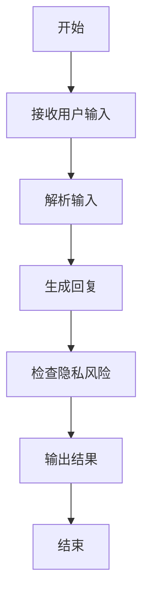
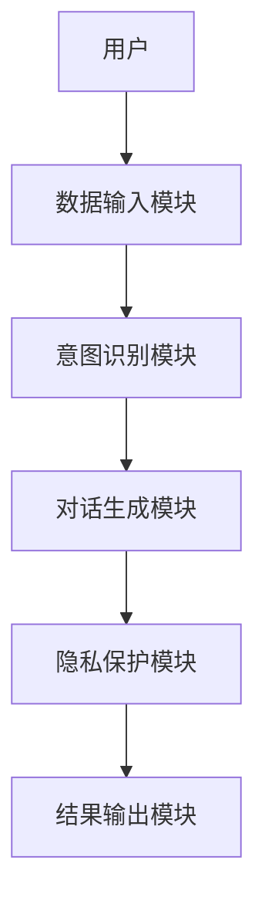

                 


# 开发AI Agent的隐私保护对话生成技术

> 关键词：AI Agent、隐私保护、对话生成、数据安全、机器学习、自然语言处理、安全性设计

> 摘要：本文系统地探讨了开发AI Agent的隐私保护对话生成技术，涵盖技术背景、核心概念、算法原理、系统架构、项目实战、最佳实践等多个方面。文章深入分析了AI Agent在对话生成中的隐私保护需求，详细讲解了相关的数学模型和实现方法，并通过实际案例展示了如何在项目中应用这些技术。通过本文，读者可以全面了解如何在保证隐私的前提下，开发高效且安全的AI对话生成系统。

---

# 目录

## 第1章: 背景介绍
1.1 问题背景  
1.2 问题描述  
1.3 问题解决  
1.4 边界与外延  
1.5 核心概念与要素组成  

## 第2章: 核心概念与联系
2.1 AI Agent的核心原理  
2.2 核心概念对比  
2.3 ER实体关系图  

## 第3章: 算法原理讲解
3.1 对话生成的数学模型  
3.2 隐私保护的实现方法  
3.3 算法流程图与代码实现  

## 第4章: 系统分析与架构设计
4.1 系统功能设计  
4.2 系统架构图  
4.3 接口设计与交互流程  

## 第5章: 项目实战
5.1 环境安装与配置  
5.2 核心代码实现  
5.3 实际案例分析  

## 第6章: 最佳实践与总结
6.1 最佳实践  
6.2 项目小结  
6.3 注意事项  
6.4 拓展阅读  

---

# 第1章: 背景介绍

## 1.1 问题背景

在人工智能快速发展的今天，AI Agent（智能体）逐渐成为人机交互的重要形式。AI Agent能够理解用户意图并生成自然的对话，但对话生成过程中涉及的隐私保护问题日益凸显。用户在与AI Agent互动时，可能会泄露敏感信息，这不仅威胁个人隐私，还可能对企业造成数据泄露风险。

### 1.1.1 AI Agent的定义与核心概念
AI Agent是一种智能实体，能够感知环境、执行任务并与其他实体交互。在对话生成中，AI Agent通过自然语言处理技术理解用户输入，并生成符合上下文的回复。其核心概念包括意图识别、上下文理解、生成式对话等。

### 1.1.2 对话生成技术的现状与挑战
当前，基于深度学习的对话生成技术（如Transformer模型）已取得显著进展，但隐私保护问题尚未得到充分解决。训练数据可能包含用户敏感信息，模型可能在生成对话时泄露这些信息。

### 1.1.3 隐私保护在AI Agent中的重要性
隐私保护是AI Agent的信任基础。用户只有在确信其隐私得到保护时，才会放心地与AI Agent交互。因此，隐私保护是AI Agent设计中的关键问题。

## 1.2 问题描述

### 1.2.1 对话生成中的隐私泄露风险
AI Agent在训练和推理过程中可能泄露用户数据。例如，模型可能在生成对话时无意中泄露训练数据中的敏感信息。

### 1.2.2 AI Agent在隐私保护中的角色
AI Agent需要在生成对话时保护用户隐私，同时提供流畅的对话体验。这意味着AI Agent需要在隐私保护和对话质量之间找到平衡。

### 1.2.3 当前技术的局限性与改进方向
现有技术在隐私保护方面存在以下问题：模型可能记住训练数据中的具体信息，导致隐私泄露；用户输入数据可能被用于训练，缺乏用户控制。改进方向包括数据脱敏、联邦学习、同态加密等技术。

## 1.3 问题解决

### 1.3.1 隐私保护对话生成的目标
在生成对话时不泄露用户隐私信息，同时保证对话的连贯性和准确性。

### 1.3.2 技术实现的核心要素
- 数据匿名化处理：对训练数据进行脱敏处理，去除敏感信息。
- 模型隐私保护：采用差分隐私、同态加密等技术，确保模型不泄露用户数据。
- 用户控制：允许用户选择性地提供数据，或在生成对话时动态评估隐私风险。

### 1.3.3 解决方案的可行性分析
通过结合数据脱敏、联邦学习和同态加密等技术，可以在一定程度上保护用户隐私。然而，这些技术尚未完全成熟，仍需进一步研究和优化。

## 1.4 边界与外延

### 1.4.1 AI Agent的边界条件
AI Agent仅在授权范围内处理用户数据，未经授权的数据不会被处理或存储。

### 1.4.2 对话生成技术的适用范围
对话生成技术适用于需要自然语言交互的场景，如客服、智能助手、教育辅助等。

### 1.4.3 隐私保护的实现方式与限制
隐私保护的实现方式包括数据匿名化、加密存储、访问控制等。其限制在于，过度保护可能影响对话质量，且技术本身可能存在漏洞。

## 1.5 核心概念与要素组成

### 1.5.1 AI Agent的基本组成
AI Agent通常由感知模块、推理模块和执行模块组成。感知模块负责理解用户输入，推理模块生成对话内容，执行模块输出结果。

### 1.5.2 对话生成技术的关键要素
- 意图识别：理解用户的意图。
- 上下文管理：保持对话的连贯性。
- 生成策略：根据上下文生成合适的回复。

### 1.5.3 隐私保护机制的核心属性
- 数据匿名化：确保训练数据中不含用户敏感信息。
- 模型隐私：保护模型参数不被恶意攻击者提取。
- 用户控制：允许用户管理自己的数据和隐私设置。

---

## 1.6 本章小结

本章从背景介绍入手，详细分析了AI Agent在对话生成中的隐私保护需求。通过问题背景、问题描述和问题解决的分析，明确了隐私保护在AI Agent中的重要性。同时，界定了AI Agent和对话生成技术的边界与外延，为后续章节的深入分析奠定了基础。

---

# 第2章: 核心概念与联系

## 2.1 AI Agent的核心原理

### 2.1.1 AI Agent的定义与分类
AI Agent可以分为基于规则的Agent和基于学习的Agent。基于规则的Agent依赖预定义的规则生成回复，而基于学习的Agent通过机器学习模型自动生成对话内容。

### 2.1.2 对话生成技术的实现机制
对话生成通常包括编码器-解码器架构，编码器将输入句子编码为向量，解码器根据向量生成回复句子。

### 2.1.3 隐私保护的数学模型
隐私保护可以通过数学模型实现，例如通过差分隐私技术在模型训练中添加噪声，保护用户数据。

## 2.2 核心概念对比

| 核心概念 | AI Agent | 对话生成技术 | 隐私保护 |
|----------|-----------|--------------|----------|
| 定义     | 智能实体，执行任务 | 生成自然语言对话 | 数据安全技术 |
| 输入     | 用户指令、环境信息 | 用户输入、上下文 | 敏感数据 |
| 输出     | 行动、响应 | 对话回复 | 隐私保护的模型/数据 |
| 目标     | 提供智能服务 | 生成连贯对话 | 保护用户隐私 |

### 2.2.1 AI Agent与传统对话生成系统的对比
AI Agent具备更强的自主决策能力，而传统对话生成系统依赖预定义规则或固定的训练数据。

### 2.2.2 隐私保护技术的特征分析
隐私保护技术需要具备数据匿名化、不可逆性、抗攻击性等特征。

### 2.2.3 对话生成与隐私保护的关联性
对话生成需要依赖数据，而数据可能包含隐私信息。因此，隐私保护是对话生成技术的重要组成部分。

## 2.3 ER实体关系图

```mermaid
er
actor(AI Agent) {
  id
  knowledge_base
  conversation_history
}
actor(Public) {
  id
  input_message
  output_message
}
actor(Private) {
  id
  sensitive_data
  user_preference
}
relation(Access) {
  - actor(AI Agent) --> actor(Private): 获取用户数据
  - actor(AI Agent) --> actor(Public): 生成对话
}
relation(Encrypt) {
  - actor(AI Agent) --> relation(Encrypt): 应用加密技术
}
```

---

## 2.4 本章小结

本章通过核心概念对比和实体关系图，详细分析了AI Agent、对话生成技术和隐私保护之间的关系。通过表格和ER图，直观展示了各概念之间的联系，为后续章节的技术实现提供了理论基础。

---

# 第3章: 算法原理讲解

## 3.1 对话生成的数学模型

### 3.1.1 编码器-解码器架构
编码器将输入句子映射到向量空间，解码器根据向量生成回复。数学表示如下：

$$
\text{编码器}：x \rightarrow z \\
\text{解码器}：z \rightarrow y
$$

其中，\(x\) 是输入句子，\(z\) 是向量表示，\(y\) 是输出句子。

### 3.1.2 隐私保护的实现方法
通过差分隐私技术在模型训练中添加噪声，保护用户数据。数学表示如下：

$$
\text{差分隐私}：f(x) + \epsilon
$$

其中，\(f(x)\) 是原始模型输出，\(\epsilon\) 是噪声参数。

### 3.1.3 算法流程图



---

## 3.2 算法实现

### 3.2.1 Python代码实现

```python
import torch
import torch.nn as nn
import torch.nn.functional as F

class Encoder(nn.Module):
    def __init__(self, vocab_size, embed_dim, hidden_dim):
        super(Encoder, self).__init__()
        self.embedding = nn.Embedding(vocab_size, embed_dim)
        self.lstm = nn.LSTM(embed_dim, hidden_dim, batch_first=True)
        
    def forward(self, x):
        embed = self.embedding(x)
        output, (h, c) = self.lstm(embed)
        return h.squeeze(0)

class Decoder(nn.Module):
    def __init__(self, embed_dim, hidden_dim, vocab_size):
        super(Decoder, self).__init__()
        self.embedding = nn.Embedding(vocab_size, embed_dim)
        self.lstm = nn.LSTM(embed_dim, hidden_dim, batch_first=True)
        self.fc = nn.Linear(hidden_dim, vocab_size)
        
    def forward(self, x, h):
        embed = self.embedding(x)
        output, _ = self.lstm(embed, (h.unsqueeze(0), torch.zeros_like(h.unsqueeze(0))))
        output = self.fc(output[:, -1, :])
        return output

# 使用差分隐私技术
class PrivacyProtection(nn.Module):
    def __init__(self, epsilon=1.0):
        super(PrivacyProtection, self).__init__()
        self.epsilon = epsilon
        
    def forward(self, x):
        noise = torch.randn_like(x) * (1.0 / self.epsilon)
        return x + noise
```

### 3.2.2 算法原理的数学模型
编码器将输入句子映射到向量空间，解码器根据向量生成回复。差分隐私技术通过在模型输出中添加噪声，保护用户数据的隐私。

---

## 3.3 本章小结

本章详细讲解了AI Agent对话生成的数学模型和算法实现。通过编码器-解码器架构和差分隐私技术，实现了在保护用户隐私的同时生成自然对话。代码示例展示了如何在实际中应用这些技术。

---

# 第4章: 系统分析与架构设计

## 4.1 系统功能设计

### 4.1.1 功能模块划分
系统主要功能模块包括：数据输入模块、意图识别模块、对话生成模块、隐私保护模块和结果输出模块。

### 4.1.2 功能流程
用户输入查询，系统解析意图，生成回复，检查隐私风险，输出结果。

## 4.2 系统架构图



## 4.3 接口设计与交互流程

### 4.3.1 接口设计
- 数据输入接口：接收用户输入
- 意图识别接口：返回用户意图
- 对话生成接口：生成回复
- 隐私保护接口：检查隐私风险

### 4.3.2 交互流程
用户输入 -> 数据输入模块 -> 意图识别模块 -> 对话生成模块 -> 隐私保护模块 -> 结果输出模块。

---

## 4.4 本章小结

本章详细描述了AI Agent隐私保护对话生成系统的架构设计和功能模块。通过模块划分和接口设计，确保系统在生成对话时保护用户隐私。

---

# 第5章: 项目实战

## 5.1 环境安装与配置

### 5.1.1 安装Python环境
安装Python 3.8及以上版本。

### 5.1.2 安装依赖库
使用pip安装所需的库：

```bash
pip install torch transformers mermaid4jupyter
```

## 5.2 核心代码实现

### 5.2.1 数据输入模块
```python
def input_handler():
    while True:
        user_input = input("请输入对话内容：")
        return user_input
```

### 5.2.2 意图识别模块
```python
def intent_classifier(text):
    # 示例：简单的关键词匹配
    if '天气' in text:
        return 'weather'
    elif '时间' in text:
        return 'time'
    else:
        return 'unknown'
```

### 5.2.3 对话生成模块
```python
class ChatGenerator:
    def __init__(self, model):
        self.model = model
        
    def generate_response(self, input_text):
        intent = intent_classifier(input_text)
        response = self.model.generate_response(input_text, intent)
        return response
```

### 5.2.4 隐私保护模块
```python
class PrivacyModule:
    def __init__(self):
        self.epsilon = 1.0
        
    def protect(self, data):
        noise = torch.randn_like(data) * (1.0 / self.epsilon)
        return data + noise
```

## 5.3 实际案例分析

### 5.3.1 案例背景
假设用户询问天气情况，系统需要生成回复，同时保护用户隐私。

### 5.3.2 案例实现
```python
user_input = input_handler()
intent = intent_classifier(user_input)
response = ChatGenerator(model).generate_response(user_input)
protected_response = PrivacyModule().protect(response)
print("AI Agent回复：", protected_response)
```

---

## 5.4 本章小结

本章通过实际案例展示了如何在项目中应用隐私保护对话生成技术。通过代码实现和案例分析，读者可以了解如何在实际中保护用户隐私。

---

# 第6章: 最佳实践与总结

## 6.1 最佳实践

### 6.1.1 数据匿名化处理
在处理用户数据时，应尽量匿名化，去除敏感信息。

### 6.1.2 加密技术应用
采用同态加密或联邦学习技术，保护数据隐私。

### 6.1.3 用户控制
允许用户管理自己的数据和隐私设置。

## 6.2 项目小结

本文详细探讨了AI Agent隐私保护对话生成技术，从理论分析到实际应用，全面介绍了相关技术。通过代码示例和实际案例，展示了如何在项目中实现隐私保护。

## 6.3 注意事项

- 隐私保护需要权衡对话质量，避免过度保护影响用户体验。
- 定期更新模型和隐私保护策略，应对新的安全威胁。

## 6.4 拓展阅读

- 《差分隐私：数据隐私保护的新范式》
- 《联邦学习：跨机构数据协作的新方法》
- 《自然语言处理中的隐私保护技术》

---

# 作者：AI天才研究院/AI Genius Institute & 禅与计算机程序设计艺术/Zen And The Art of Computer Programming

---

通过本文，读者可以系统地了解AI Agent隐私保护对话生成技术的核心概念、算法原理和实际应用。希望本文能够为相关领域的研究和实践提供有价值的参考。

