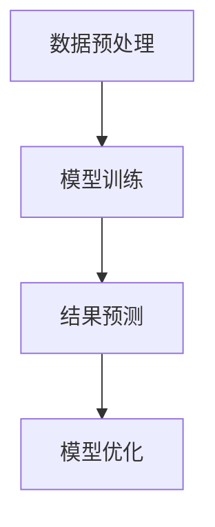
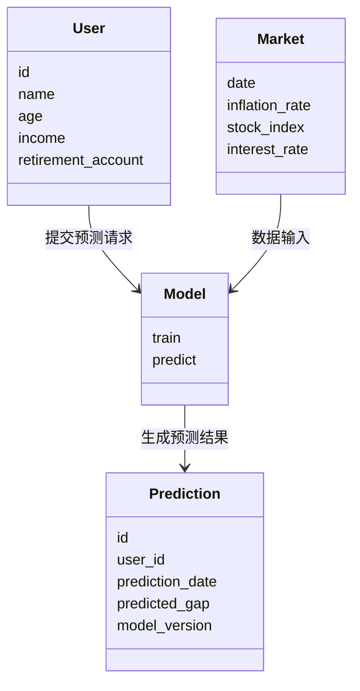
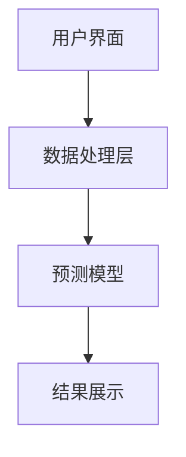
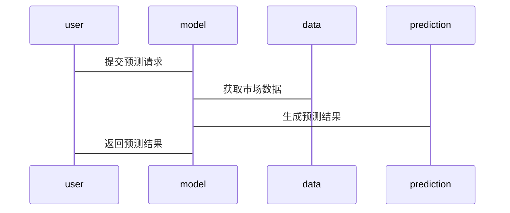

                 


# 构建智能化的个人退休金缺口动态预测助手

> 关键词：退休金缺口、动态预测、人工智能、时间序列分析、机器学习、系统架构

> 摘要：随着全球人口老龄化加剧，退休金缺口问题日益突出。本文系统地介绍了如何利用人工智能技术构建智能化的个人退休金缺口动态预测助手，涵盖背景分析、核心概念、算法原理、系统架构、项目实战等多个方面，提供了一套完整的解决方案。

---

# 第一部分：智能化个人退休金缺口动态预测助手的背景与核心概念

## 第1章：退休金缺口预测的背景与问题描述

### 1.1 退休金缺口问题的背景

#### 1.1.1 全球人口老龄化趋势
全球范围内，人口老龄化问题日益严重，退休人口比例不断增加。退休金作为老年人生活的重要保障，其充足性直接影响生活质量。然而，传统退休金体系面临资金不足、通货膨胀等多种挑战。

#### 1.1.2 退休金体系的现状与挑战
当前退休金体系主要依赖政府补贴和企业年金，但随着经济波动和人口结构变化，退休金缺口问题逐渐显现。许多人在退休后发现，现有的退休金不足以覆盖基本生活需求。

#### 1.1.3 个人退休规划的重要性
个人退休规划是确保退休后生活质量的重要手段。然而，传统的静态规划方法难以应对动态变化的经济环境和个体差异。

### 1.2 退休金缺口预测的核心问题

#### 1.2.1 缺口预测的基本概念
退休金缺口是指退休后实际需求与实际可获得退休金之间的差距。准确预测缺口是制定合理退休规划的基础。

#### 1.2.2 退休金需求与供给的动态平衡
退休金需求受通货膨胀、医疗支出、生活成本等多种因素影响，供给则依赖于投资收益和政策变化。两者动态平衡是实现精准预测的关键。

#### 1.2.3 缺口预测的边界与外延
预测的边界包括数据范围、时间范围和人群范围。外延则涉及政策调整、市场变化等外部因素对预测结果的影响。

### 1.3 传统退休金缺口预测方法的局限性

#### 1.3.1 基于固定公式的方法
传统方法通常采用固定公式计算，缺乏对个体差异和动态变化的考虑，导致预测结果偏差较大。

#### 1.3.2 统计模型的局限性
统计模型虽然能够捕捉部分趋势，但难以应对非线性变化和复杂场景，且对数据质量和数量要求较高。

#### 1.3.3 传统方法的不足与改进方向
传统方法缺乏实时性、个性化和适应性，难以满足智能化预测的需求。

### 1.4 智能化预测的核心优势

#### 1.4.1 人工智能技术的引入
人工智能技术能够处理海量数据，挖掘非线性关系，提高预测精度。

#### 1.4.2 数据驱动的动态预测能力
通过实时数据更新和模型优化，智能化预测能够动态调整结果，适应变化的经济环境。

#### 1.4.3 提高预测精度与个性化水平
人工智能技术能够根据个体特征和市场变化，提供个性化的预测结果，帮助用户制定更合理的退休计划。

### 1.5 本章小结

---

## 第2章：智能化退休金缺口预测的核心概念与联系

### 2.1 核心概念的定义与属性

#### 2.1.1 退休金缺口的定义
退休金缺口是指退休后实际需求与实际可获得退休金之间的差距。

#### 2.1.2 动态预测的内涵
动态预测是指在时间序列上，根据历史数据和当前状态，预测未来的变化趋势。

#### 2.1.3 智能化预测的特征
智能化预测具有实时性、个性化和自适应性，能够根据输入数据动态调整预测模型。

### 2.2 核心概念的对比分析

#### 2.2.1 传统方法与智能化方法的对比
| 方法类型 | 优点 | 缺点 |
|----------|------|------|
| 传统方法 | 简单易懂 | 精度低，缺乏动态性 |
| 智能化方法 | 精度高，动态性强 | 实施成本高，需要大量数据 |

#### 2.2.2 不同预测模型的优劣势分析
| 模型类型 | 优点 | 缺点 |
|----------|------|------|
| 时间序列 | 易实现，适合线性变化 | 难应对非线性变化 |
| 机器学习 | 高精度，适应性强 | 需大量数据 |
| 深度学习 | 能捕捉复杂模式 | 计算资源需求高 |

#### 2.2.3 数据驱动与规则驱动的对比
| 驱动类型 | 优点 | 缺点 |
|----------|------|------|
| 数据驱动 | 精度高，适应性强 | 需大量数据，缺乏可解释性 |
| 规则驱动 | 可解释性强 | 精度低，难以应对复杂场景 |

### 2.3 实体关系图（ER图）分析

#### 2.3.1 实体关系图的构建
```mermaid
erDiagram
    user {
        id
        name
        age
        income
        retirement_account
    }
    market {
        date
        inflation_rate
        stock_index
        interest_rate
    }
    prediction {
        id
        user_id
        prediction_date
        predicted_gap
        model_version
    }
    user --> prediction: 提交预测请求
    market --> prediction: 数据输入
```

#### 2.3.2 关键实体与关系的描述
- `user`：用户信息，包括年龄、收入、退休账户等。
- `market`：市场数据，包括通胀率、股票指数等。
- `prediction`：预测结果，包括预测缺口、模型版本等。

#### 2.3.3 ER图的流程图展示（Mermaid）
```mermaid
erDiagram
    user {
        id
        name
        age
        income
        retirement_account
    }
    market {
        date
        inflation_rate
        stock_index
        interest_rate
    }
    prediction {
        id
        user_id
        prediction_date
        predicted_gap
        model_version
    }
    user --> prediction: 提交预测请求
    market --> prediction: 数据输入
```

### 2.4 本章小结

---

## 第3章：智能化退休金缺口预测的算法原理

### 3.1 算法原理概述

#### 3.1.1 时间序列分析
时间序列分析是一种基于历史数据预测未来趋势的方法，常用于处理具有时间依赖性的数据。

#### 3.1.2 机器学习模型
机器学习模型通过学习数据特征，建立预测模型，适用于复杂场景。

#### 3.1.3 深度学习方法
深度学习通过多层神经网络捕捉数据的复杂模式，适用于非线性预测任务。

### 3.2 算法实现流程

#### 3.2.1 数据预处理
- 数据清洗：处理缺失值、异常值。
- 特征提取：提取影响预测结果的关键特征。

#### 3.2.2 模型训练
- 数据分割：将数据分为训练集和测试集。
- 模型选择：选择合适的算法并进行参数调优。

#### 3.2.3 结果预测与优化
- 预测结果：生成预测缺口。
- 模型优化：通过反馈不断优化模型。

### 3.3 算法流程图（Mermaid）


### 3.4 数学公式解析

#### 3.4.1 时间序列分析模型
- ARIMA模型：$$ ARIMA(p, d, q) $$
- LSTM模型：$$ LSTM(input, hidden, cell) $$

#### 3.4.2 机器学习模型
- 线性回归模型：$$ y = \beta_0 + \beta_1x + \epsilon $$
- 随机森林回归：$$ y = \sum_{i=1}^{n} \text{tree}_i(x) $$

#### 3.4.3 深度学习模型
- Transformer模型：$$ \text{Attention}(Q, K, V) $$

### 3.5 本章小结

---

## 第4章：系统分析与架构设计方案

### 4.1 问题场景介绍

#### 4.1.1 退休金缺口预测的典型场景
用户希望根据当前的收入、投资情况和生活需求，预测退休后是否会有资金缺口。

### 4.2 项目介绍

#### 4.2.1 项目目标
构建一个智能化的退休金缺口动态预测系统，提供个性化的预测结果和优化建议。

#### 4.2.2 项目范围
涵盖数据收集、模型训练、结果预测和用户交互等环节。

### 4.3 系统功能设计

#### 4.3.1 功能模块
- 数据输入模块：用户输入个人信息和财务数据。
- 模型预测模块：基于输入数据生成预测结果。
- 结果展示模块：以可视化形式呈现预测结果和优化建议。

#### 4.3.2 领域模型（Mermaid类图）


### 4.4 系统架构设计

#### 4.4.1 系统架构图（Mermaid）


#### 4.4.2 系统接口设计
- 用户输入接口：接收用户信息和财务数据。
- 模型调用接口：调用预测模型进行计算。
- 结果展示接口：将预测结果以友好的形式呈现给用户。

### 4.5 系统交互流程（Mermaid序列图）


### 4.6 本章小结

---

## 第5章：项目实战与优化

### 5.1 环境安装

#### 5.1.1 系统需求
- Python 3.8+
- 数据库：MySQL或MongoDB
- 开发工具：PyCharm或VS Code

#### 5.1.2 依赖安装
```bash
pip install numpy pandas scikit-learn tensorflow keras
```

### 5.2 核心实现源代码

#### 5.2.1 数据预处理代码
```python
import pandas as pd
import numpy as np

# 加载数据
data = pd.read_csv('retirement.csv')

# 数据清洗
data.dropna(inplace=True)
data = data[~data['income'].isnull()]
```

#### 5.2.2 模型训练代码
```python
from sklearn.model_selection import train_test_split
from sklearn.ensemble import RandomForestRegressor

# 分割数据
X = data[['age', 'income', 'retirement_account']]
y = data['gap']

X_train, X_test, y_train, y_test = train_test_split(X, y, test_size=0.2)

# 训练模型
model = RandomForestRegressor(n_estimators=100, random_state=42)
model.fit(X_train, y_train)
```

#### 5.2.3 结果预测代码
```python
# 预测结果
y_pred = model.predict(X_test)
```

### 5.3 代码应用解读与分析

#### 5.3.1 数据预处理解读
数据预处理是确保模型准确性的基础，包括清洗缺失值和异常值。

#### 5.3.2 模型训练解读
随机森林回归模型是一种基于树的集成方法，适用于非线性关系的预测。

#### 5.3.3 结果预测解读
预测结果是基于模型训练后的参数，对测试数据进行预测得出的。

### 5.4 实际案例分析

#### 5.4.1 案例背景
假设一位用户，40岁，年收入10万元，当前退休账户余额50万元。

#### 5.4.2 模型预测
模型预测结果显示，该用户的退休金缺口为20万元。

#### 5.4.3 优化建议
建议用户增加每月储蓄，或者选择更高收益的投资方式。

### 5.5 本章小结

---

## 第6章：总结与展望

### 6.1 本文总结
本文详细介绍了智能化个人退休金缺口动态预测助手的构建过程，涵盖了背景分析、核心概念、算法原理、系统架构和项目实战等多个方面。

### 6.2 未来展望
随着人工智能技术的发展，退休金缺口预测将更加精准和个性化，未来的优化方向包括引入强化学习和实时数据更新。

### 6.3 最佳实践 tips
- 数据是预测的基础，确保数据质量和完整性。
- 选择合适的算法，根据具体场景进行调整。
- 定期更新模型，以应对市场变化。

### 6.4 小结
智能化退休金缺口动态预测助手的应用将极大提升个人退休规划的科学性和可行性，为应对老龄化社会提供有力支持。

### 6.5 注意事项
- 数据隐私保护是系统设计中的重要部分。
- 模型的可解释性需要在实际应用中加以考虑。

### 6.6 拓展阅读
- 时间序列分析的经典教材：《Forecasting: principles and practice》
- 机器学习领域的经典书籍：《Hands-On Machine Learning with Scikit-Learn, Keras, and TensorFlow》

---

作者：AI天才研究院/AI Genius Institute & 禅与计算机程序设计艺术 /Zen And The Art of Computer Programming

