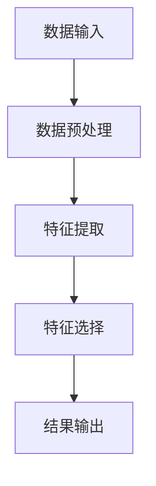
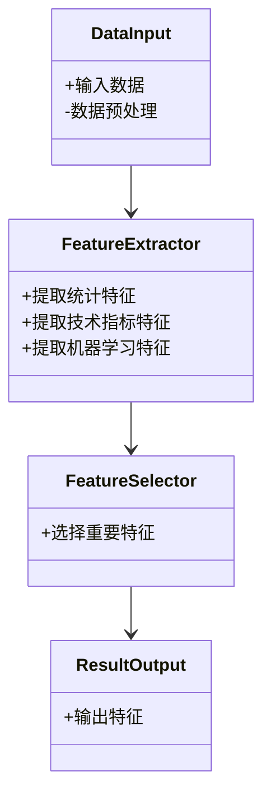
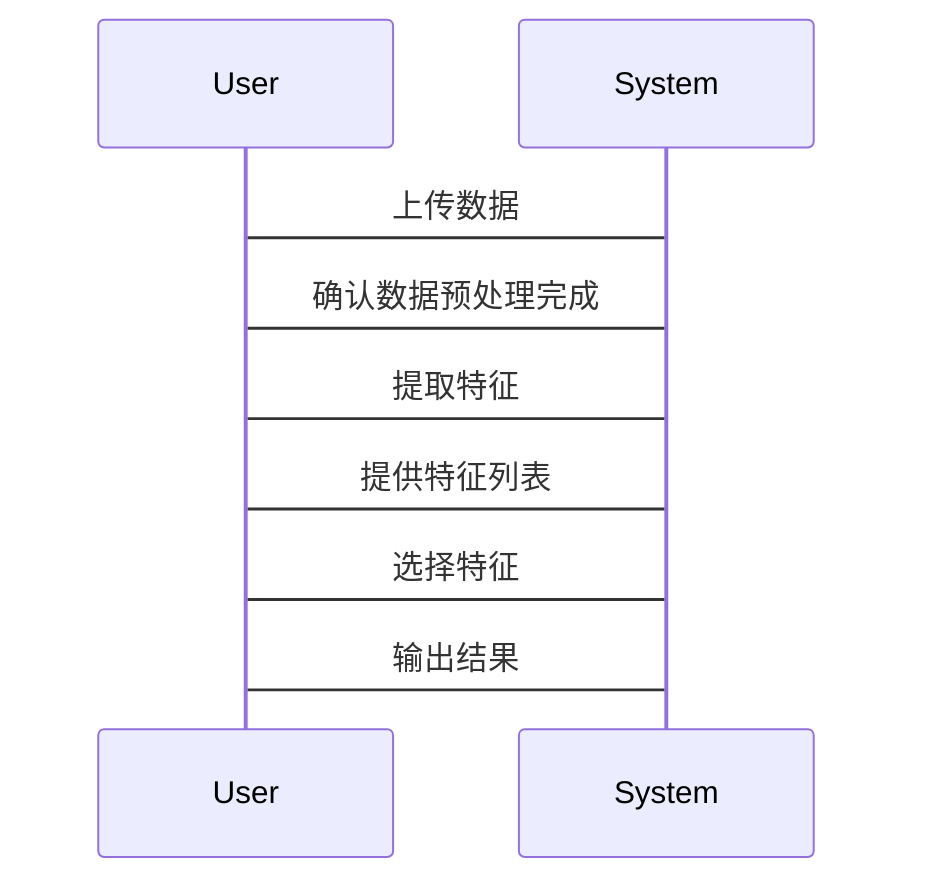

                 


# 金融时间序列特征提取工具集

> 关键词：时间序列，特征提取，金融数据分析，机器学习，深度学习，统计特征，金融预测

> 摘要：  
本文系统地探讨了金融时间序列特征提取的核心概念、方法及其工具集的构建。通过结合统计学、机器学习和深度学习等多学科知识，详细分析了金融时间序列数据的特征提取过程，包括统计特征、技术指标、机器学习特征和深度学习特征的提取方法，并提出了基于这些特征的金融时间序列分析工具集的设计与实现方案。本文还通过实际案例展示了如何利用这些工具进行金融数据分析和预测，为金融领域的研究者和从业者提供了理论支持和实践指导。

---

# 第一部分: 金融时间序列特征提取背景与基础

# 第1章: 时间序列与金融数据分析概述

## 1.1 时间序列的基本概念

### 1.1.1 时间序列的定义与特点

时间序列是指按照时间顺序排列的数据序列，通常表示为 $x_1, x_2, \ldots, x_n$，其中 $x_i$ 表示第 $i$ 个时间点的观测值。时间序列数据具有以下特点：

1. **有序性**：数据按时间顺序排列，相邻数据点之间存在相关性。
2. **趋势性**：数据可能表现出长期向上的或向下的趋势。
3. **周期性**：数据可能在固定的时间间隔内重复某种模式。
4. **随机性**：数据中可能包含不可预测的随机波动。

### 1.1.2 金融时间序列的独特性

金融时间序列数据具有以下独特性：

1. **波动性**：金融市场的数据通常表现出较大的波动性。
2. **非线性**：金融市场的价格波动往往具有非线性特征。
3. **异质性**：不同金融资产或市场的数据可能表现出不同的特征。
4. **噪声干扰**：金融数据中通常夹杂着噪声，如市场操纵、突发事件等。

### 1.1.3 时间序列分析的常见应用场景

1. **金融预测**：如股票价格预测、汇率预测等。
2. **风险管理**：如波动率预测、信用风险评估等。
3. **异常检测**：如市场操纵检测、异常交易检测等。
4. **投资组合优化**：如资产配置、风险控制等。

---

## 1.2 金融数据分析的挑战与机遇

### 1.2.1 金融数据的复杂性

金融数据的复杂性主要体现在以下几个方面：

1. **高维性**：金融数据通常涉及多个资产、市场、时间维度等，导致数据维度较高。
2. **非平稳性**：金融时间序列数据通常是非平稳的，难以直接使用线性模型进行分析。
3. **噪声干扰**：金融数据中夹杂着大量噪声，如市场操纵、突发事件等。
4. **数据稀疏性**：某些金融数据可能较为稀疏，难以直接进行分析。

### 1.2.2 数据量与数据频率的挑战

1. **数据量**：金融数据通常具有较大的数据量，尤其是高频交易数据，对计算能力和存储空间提出了较高要求。
2. **数据频率**：金融数据可以以分钟、小时、天、周等不同频率存在，不同频率的数据需要不同的分析方法。

### 1.2.3 金融数据分析的创新方向

1. **多模态数据融合**：结合文本、图像等多模态数据进行金融分析。
2. **实时分析**：基于流数据处理技术，实现实时金融数据分析。
3. **强化学习应用**：将强化学习应用于金融交易策略的优化。

---

## 1.3 特征提取在金融时间序列分析中的重要性

### 1.3.1 特征提取的基本概念

特征提取是指从原始数据中提取能够反映数据本质特征的低维表示。在金融时间序列分析中，特征提取的目的是将复杂的时序数据转化为一组简洁且有意义的特征，以便后续的分析和建模。

### 1.3.2 金融时间序列特征提取的难点

1. **特征选择**：如何选择能够有效表征金融时间序列特征的统计指标或模型。
2. **特征工程**：如何对原始数据进行预处理和特征构建，以提高特征的区分度和模型的性能。
3. **特征解释性**：如何解释提取的特征背后的意义，以便更好地理解金融市场的规律。

### 1.3.3 特征提取在金融预测中的价值

1. **提高模型性能**：通过提取有意义的特征，可以减少模型的维度，提高模型的泛化能力。
2. **降低计算成本**：降低模型训练和预测的计算复杂度。
3. **增强解释性**：帮助分析人员更好地理解金融市场的规律和趋势。

---

# 第2章: 金融时间序列特征提取的核心概念

## 2.1 统计特征与时间序列分析

### 2.1.1 统计特征的计算

统计特征是时间序列分析中最常用的特征类型，包括均值、方差、偏度、峰度等。

#### 均值
均值表示时间序列的平均值，公式为：
$$ \mu = \frac{1}{n}\sum_{i=1}^{n}x_i $$

#### 方差
方差表示时间序列数据的离散程度，公式为：
$$ \sigma^2 = \frac{1}{n-1}\sum_{i=1}^{n}(x_i - \mu)^2 $$

#### 偏度
偏度表示时间序列数据的偏斜程度，公式为：
$$ \text{Skewness} = \frac{\sum_{i=1}^{n}(x_i - \mu)^3}{(n-1)\sigma^3} $$

#### 峰度
峰度表示时间序列数据的尖峰程度，公式为：
$$ \text{Kurtosis} = \frac{\sum_{i=1}^{n}(x_i - \mu)^4}{(n-1)\sigma^4} $$

### 2.1.2 时间序列的自相关性分析

自相关函数（ACF）和偏自相关函数（PACF）是时间序列分析中常用的工具，用于检测时间序列的周期性、趋势性等特征。

#### 自相关函数
$$ \rho_k = \frac{\sum_{i=1}^{n-k}(x_i - \mu)(x_{i+k} - \mu)}{\sum_{i=1}^{n}(x_i - \mu)^2} $$

#### 偏自相关函数
偏自相关函数是在控制了中间 $k-1$ 个时间点的影响后，计算时间序列的自相关性。

### 2.1.3 金融时间序列的周期性特征

金融时间序列通常具有周期性特征，例如日间周期、周周期、月周期等。可以通过傅里叶变换或周期ograms等方法检测周期性。

---

## 2.2 金融时间序列的模式识别

### 2.2.1 时间序列的相似性度量

时间序列的相似性度量方法包括：

1. **动态时间 warping (DTW)**：用于衡量两条时间序列的相似性，公式为：
   $$ \text{DTW}(X, Y) = \sum_{i=1}^{n}\sum_{j=1}^{m}w(i, j) \cdot |x_i - y_j| $$
2. **余弦相似性**：用于衡量两条时间序列的相似性，公式为：
   $$ \text{Cosine Similarity} = \frac{\sum_{i=1}^{n}x_i y_i}{\sqrt{\sum_{i=1}^{n}x_i^2} \cdot \sqrt{\sum_{i=1}^{n}y_i^2}} $$

### 2.2.2 基于模式识别的特征提取方法

1. **基于聚类分析的特征提取**：通过聚类分析将相似的时间序列聚类，提取每个聚类的特征。
2. **基于分类的特征提取**：通过训练分类模型，提取能够区分不同类别的特征。

### 2.2.3 金融时间序列的聚类分析

聚类分析可以用于将相似的金融资产或市场状态进行分组，提取每个聚类的特征。

---

## 2.3 机器学习与深度学习在特征提取中的应用

### 2.3.1 传统机器学习模型的特征提取

1. **支持向量机 (SVM)**：通过 SVM 的核函数提取高维特征。
2. **随机森林 (Random Forest)**：通过特征重要性分析提取关键特征。

### 2.3.2 深度学习模型的特征提取优势

深度学习模型（如 LSTM、Transformer）可以直接从原始时间序列数据中提取高层次特征。

### 2.3.3 基于神经网络的时间序列特征提取

1. **长短期记忆网络 (LSTM)**：通过 LSTM 的隐藏层提取时间序列的特征。
2. **Transformer 模型**：通过自注意力机制提取时间序列的全局特征。

---

# 第3章: 金融时间序列特征提取工具集的构建

## 3.1 工具集的选择与配置

### 3.1.1 数据处理工具的选择

推荐使用 Python 的 pandas 库进行数据处理，代码示例如下：

```python
import pandas as pd

# 读取数据
df = pd.read_csv('financial_data.csv')

# 查看数据前几行
print(df.head())
```

### 3.1.2 特征提取算法的选择

推荐使用 scikit-learn 库中的特征提取算法，代码示例如下：

```python
from sklearn.feature_selection import SelectKBest
from sklearn.preprocessing import StandardScaler

# 标准化数据
scaler = StandardScaler()
df_scaled = scaler.fit_transform(df)

# 选择最重要的 K 个特征
selector = SelectKBest(k=5)
selected_features = selector.fit_transform(df_scaled, target)
```

### 3.1.3 可视化工具的配置

推荐使用 matplotlib 或 seaborn 库进行数据可视化，代码示例如下：

```python
import matplotlib.pyplot as plt

# 绘制时间序列图
plt.plot(df['date'], df['price'])
plt.xlabel('Time')
plt.ylabel('Price')
plt.title('Financial Time Series')
plt.show()
```

---

## 3.2 数据预处理与特征工程

### 3.2.1 数据清洗与标准化

1. **数据清洗**：处理缺失值、异常值等。
2. **标准化**：使用归一化方法将数据标准化，公式为：
   $$ z = \frac{x - \mu}{\sigma} $$

### 3.2.2 时间序列数据的特征工程

1. **滑动窗口特征**：提取滑动窗口内的统计特征，如均值、方差等。
2. **技术指标特征**：如移动平均线（MA）、相对强弱指数（RSI）等。

### 3.2.3 基于统计与机器学习的特征选择

1. **统计方法**：如卡方检验、ANOVA 检验等。
2. **机器学习方法**：如 LASSO 回归、随机森林特征重要性分析等。

---

## 3.3 工具集的系统架构设计

### 3.3.1 系统模块划分

1. **数据输入模块**：读取原始数据。
2. **数据预处理模块**：清洗和标准化数据。
3. **特征提取模块**：提取统计特征、技术指标特征、机器学习特征等。
4. **特征选择模块**：选择最重要的特征。
5. **结果输出模块**：输出提取的特征。

### 3.3.2 系统功能流程图



### 3.3.3 系统接口设计

1. **数据输入接口**：接收原始数据文件。
2. **特征提取接口**：接收预处理后的数据，输出提取的特征。
3. **特征选择接口**：接收特征矩阵，输出选择的特征。

---

# 第4章: 统计特征提取方法

## 4.1 基于统计学的特征提取

### 4.1.1 统计特征的计算

1. **均值**：表示时间序列的平均值。
2. **方差**：表示时间序列的波动程度。
3. **偏度**：表示时间序列的偏斜程度。
4. **峰度**：表示时间序列的尖峰程度。

### 4.1.2 时间序列的自相关性分析

1. **自相关函数 (ACF)**：用于检测时间序列的周期性。
2. **偏自相关函数 (PACF)**：用于检测时间序列的阶数。

### 4.1.3 金融时间序列的周期性特征

1. **傅里叶变换**：用于检测时间序列的周期性。
2. **周期ograms**：用于可视化时间序列的周期性。

---

## 4.2 统计特征提取的数学模型

### 4.2.1 均值的计算公式

$$ \mu = \frac{1}{n}\sum_{i=1}^{n}x_i $$

### 4.2.2 方差的计算公式

$$ \sigma^2 = \frac{1}{n-1}\sum_{i=1}^{n}(x_i - \mu)^2 $$

---

# 第5章: 金融时间序列技术指标特征提取方法

## 5.1 技术指标特征的计算

### 5.1.1 移动平均线 (MA)

移动平均线是将过去一定时间内的平均价格作为当前价格的预测值，公式为：
$$ MA_n = \frac{1}{n}\sum_{i=1}^{n}p_i $$

### 5.1.2 相对强弱指数 (RSI)

相对强弱指数用于衡量市场的超买或超卖状态，公式为：
$$ RSI = \frac{100}{1 + \frac{\text{Upward Movements}}{\text{Downward Movements}}} $$

### 5.1.3 移动平均收敛散度 (MACD)

移动平均收敛散度用于衡量价格趋势的强度，公式为：
$$ MACD = EMA_{12} - EMA_{26} $$

---

## 5.2 技术指标特征的应用

### 5.2.1 信号生成

1. **交叉信号**：当短期移动平均线与长期移动平均线交叉时，生成买卖信号。
2. **超买超卖信号**：当 RSI 高于 70 或低于 30 时，生成买卖信号。

### 5.2.2 状态识别

1. **趋势识别**：通过技术指标判断市场是处于上升趋势、下降趋势还是震荡趋势。
2. **强度识别**：通过技术指标判断市场趋势的强弱。

---

## 5.3 技术指标特征的优缺点

### 优点

1. **简单易懂**：技术指标通常基于简单的计算公式，易于理解和应用。
2. **实践性强**：技术指标在实际交易中被广泛使用，具有较强的可操作性。

### 缺点

1. **滞后性**：技术指标通常基于过去的价格数据计算，存在一定的滞后性。
2. **虚假信号**：技术指标可能会产生虚假的买卖信号，尤其是在市场剧烈波动时。

---

# 第6章: 机器学习特征提取方法

## 6.1 传统机器学习模型的特征提取

### 6.1.1 支持向量机 (SVM)

支持向量机通过最大化类别间隔来提取特征，公式为：
$$ \text{Maximize} \frac{1}{2}\sum_{i=1}^{n} \alpha_i^2 $$
$$ \text{Subject to} \sum_{i=1}^{n}\alpha_i y_i x_i = 0, \alpha_i \geq 0 $$

### 6.1.2 随机森林 (Random Forest)

随机森林通过特征重要性分析提取关键特征，公式为：
$$ \text{Feature Importance} = \frac{\text{Total Decrease in Impurity}}{\text{Total Impurity}} $$

---

## 6.2 基于神经网络的特征提取

### 6.2.1 长短期记忆网络 (LSTM)

LSTM 通过隐藏层提取时间序列的特征，公式为：
$$ f_t = \text{LSTM}(x_t, f_{t-1}) $$

### 6.2.2 Transformer 模型

Transformer 模型通过自注意力机制提取时间序列的全局特征，公式为：
$$ \text{Attention}(Q, K, V) = \text{softmax}\left(\frac{QK^T}{\sqrt{d_k}}\right)V $$

---

## 6.3 机器学习特征提取的优缺点

### 优点

1. **非线性特征提取**：机器学习模型可以提取非线性特征，捕捉复杂的市场规律。
2. **高维特征提取**：机器学习模型可以处理高维数据，提取深层次特征。

### 缺点

1. **计算复杂度高**：机器学习模型通常需要较高的计算资源。
2. **特征解释性差**：机器学习模型提取的特征往往缺乏直观的解释性。

---

# 第7章: 深度学习特征提取方法

## 7.1 基于 LSTM 的特征提取

### 7.1.1 LSTM 模型的结构

LSTM 模型由输入门控、遗忘门控和输出门控组成，公式为：
$$ i_t = \sigma(W_i x_t + U_i h_{t-1}) $$
$$ f_t = \sigma(W_f x_t + U_f h_{t-1}) $$
$$ o_t = \sigma(W_o x_t + U_o h_{t-1}) $$
$$ h_t = i_t \cdot \tilde{h}_t + f_t \cdot h_{t-1} $$

### 7.1.2 LSTM 的应用

1. **时间序列预测**：利用 LSTM 模型预测未来的金融价格。
2. **特征提取**：利用 LSTM 的隐藏层提取时间序列的特征。

---

## 7.2 基于 Transformer 的特征提取

### 7.2.1 Transformer 模型的结构

Transformer 模型由编码器和解码器组成，公式为：
$$ \text{Encoder}(x) = \text{LayerNorm}(\text{SelfAttention}(x) + \text{FFN}(x)) $$
$$ \text{Decoder}(y) = \text{LayerNorm}(\text{SelfAttention}(y) + \text{CrossAttention}(x, y)) $$

### 7.2.2 Transformer 的应用

1. **时间序列预测**：利用 Transformer 模型预测未来的金融价格。
2. **特征提取**：利用 Transformer 的自注意力机制提取时间序列的全局特征。

---

## 7.3 深度学习特征提取的优缺点

### 优点

1. **强大的特征提取能力**：深度学习模型可以提取深层次的特征，捕捉复杂的市场规律。
2. **自动特征工程**：深度学习模型可以自动进行特征工程，减少人工干预。

### 缺点

1. **计算资源需求高**：深度学习模型需要大量的计算资源进行训练和推理。
2. **模型解释性差**：深度学习模型的特征提取过程往往缺乏直观的解释性。

---

# 第8章: 金融时间序列特征提取工具集的系统架构设计

## 8.1 系统功能设计

### 8.1.1 领域模型



### 8.1.2 系统架构设计


---

## 8.2 系统接口设计

### 8.2.1 数据输入接口

1. **输入数据格式**：支持 CSV、Excel 等格式。
2. **数据预处理接口**：包括数据清洗、标准化等功能。

### 8.2.2 特征提取接口

1. **统计特征提取接口**：提取均值、方差等统计特征。
2. **技术指标特征提取接口**：提取移动平均线、相对强弱指数等技术指标特征。
3. **机器学习特征提取接口**：提取基于 LSTM、Transformer 的深度学习特征。

### 8.2.3 特征选择接口

1. **统计特征选择接口**：基于卡方检验、ANOVA 检验等方法选择重要特征。
2. **机器学习特征选择接口**：基于随机森林、LASSO 回归等方法选择重要特征。

---

## 8.3 系统交互设计

### 8.3.1 用户交互流程

1. **用户输入数据**：用户上传金融时间序列数据。
2. **系统预处理数据**：系统对数据进行清洗和标准化。
3. **系统提取特征**：系统基于统计、技术指标和机器学习方法提取特征。
4. **系统选择特征**：系统基于特征选择算法选择重要特征。
5. **系统输出结果**：系统输出提取的特征。

### 8.3.2 系统交互图



---

# 第9章: 金融时间序列特征提取工具集的实战案例

## 9.1 实战案例背景

### 9.1.1 案例目标

通过提取股票价格的统计特征、技术指标特征和机器学习特征，构建一个股票价格预测模型。

### 9.1.2 数据集选择

选择某股票的历史价格数据，包括开盘价、收盘价、最高价、最低价、成交量等。

---

## 9.2 实战案例实现

### 9.2.1 环境安装

1. **安装 Python**：确保安装 Python 3.8 或更高版本。
2. **安装依赖库**：
   ```bash
   pip install numpy pandas scikit-learn matplotlib
   ```

### 9.2.2 核心代码实现

```python
import pandas as pd
import numpy as np
from sklearn.feature_selection import SelectKBest
from sklearn.preprocessing import StandardScaler
import matplotlib.pyplot as plt

# 读取数据
df = pd.read_csv('stock_price.csv')

# 数据预处理
scaler = StandardScaler()
df_scaled = scaler.fit_transform(df)

# 提取统计特征
statistical_features = df.describe().T

# 提取技术指标特征
def calculate_technical_indicators(df):
    # 移动平均线
    df['MA_5'] = df['Close'].rolling(5).mean()
    df['MA_10'] = df['Close'].rolling(10).mean()
    # 相对强弱指数
    df['RSI'] = (100 / (1 + df['Close'].diff().mean() / df['Close'].std()))
    return df

df = calculate_technical_indicators(df)

# 提取机器学习特征
from sklearn.ensemble import RandomForestClassifier
model = RandomForestClassifier()
model.fit(df_scaled, target)
feature_importance = model.feature_importances_

# 选择重要特征
selector = SelectKBest(k=5)
selected_features = selector.fit_transform(df_scaled, target)

# 可视化特征重要性
plt.bar(range(len(feature_importance)), feature_importance)
plt.show()
```

---

## 9.3 案例分析与结果解读

### 9.3.1 特征提取结果

通过上述代码，我们可以提取出统计特征、技术指标特征和机器学习特征，并选择最重要的 5 个特征。

### 9.3.2 模型预测结果

基于提取的特征，可以训练一个股票价格预测模型，例如：
```python
from sklearn.linear_model import LinearRegression

model = LinearRegression()
model.fit(selected_features, target)
print(model.score(selected_features, target))
```

---

## 9.4 实战案例总结

通过本案例，我们可以看到，金融时间序列特征提取工具集的应用可以有效提高金融数据分析的效率和准确性，为后续的金融预测和决策提供有力支持。

---

# 第10章: 总结与展望

## 10.1 总结

本文系统地探讨了金融时间序列特征提取的核心概念、方法及其工具集的构建。通过结合统计学、机器学习和深度学习等多学科知识，详细分析了金融时间序列数据的特征提取过程，并提出了基于这些特征的金融时间序列分析工具集的设计与实现方案。

---

## 10.2 展望

未来的研究方向包括：

1. **多模态特征提取**：结合文本、图像等多模态数据进行金融特征提取。
2. **实时特征提取**：基于流数据处理技术，实现实时金融特征提取。
3. **自监督学习应用**：探索自监督学习在金融时间序列特征提取中的应用。

---

# 作者

**作者：AI天才研究院/AI Genius Institute & 禅与计算机程序设计艺术 /Zen And The Art of Computer Programming**

---

**注**：本文内容仅用于学术研究和知识分享，不构成任何投资建议。

