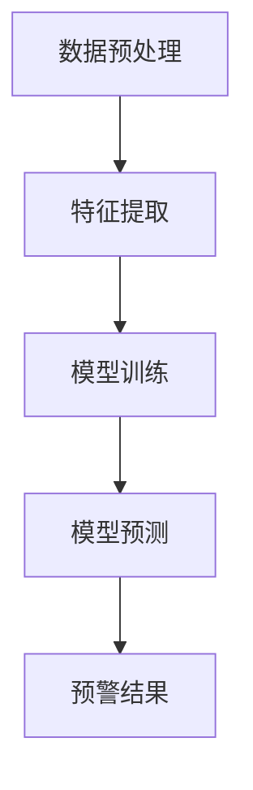
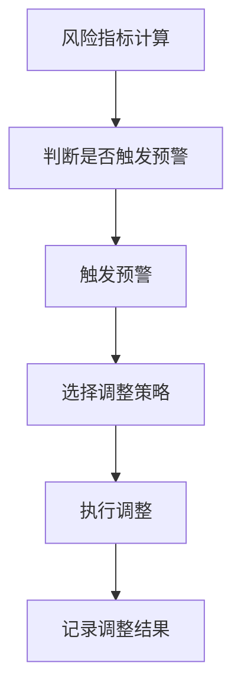
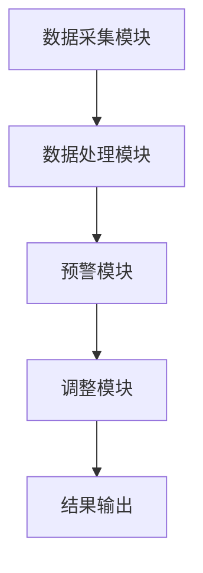

                 


```markdown
# 金融风险限额突破预警与自动调整系统

> 关键词：金融风险，限额管理，预警机制，自动调整，系统架构，风险管理，算法模型

> 摘要：本文深入探讨了金融风险限额管理的重要性，并提出了一种基于系统化方法的预警与自动调整解决方案。通过数学建模、算法设计和系统架构优化，构建了一个高效的风险管理平台，能够实时监控风险指标，智能预警并自动调整限额，从而有效降低风险敞口，保障金融系统的稳定性。

---

# 第1章: 金融风险限额突破预警与自动调整系统背景介绍

## 1.1 风险限额管理的重要性

### 1.1.1 风险限额的定义与作用

风险限额是金融机构在特定时间段内对某一资产或组合设定的最大风险承受值。它通常以货币或风险价值（VaR）形式表示，用于控制投资组合的潜在损失。风险限额的核心作用在于约束投资行为，确保金融机构在可控风险范围内运作，避免因过度冒险导致的重大损失。

### 1.1.2 风险限额突破的潜在影响

当实际风险超过设定的限额时，金融机构可能面临流动性危机、声誉损失甚至系统性风险。2008年的金融危机就是一个典型案例，许多金融机构因未有效管理风险限额而遭受重大损失。因此，建立有效的风险限额预警和自动调整机制至关重要。

### 1.1.3 系统化管理的必要性

传统的风险限额管理依赖人工监控和决策，效率低且易出错。随着金融市场复杂性的增加，金融机构需要更高效、智能化的管理方式。系统化管理能够实时监控风险指标，快速响应市场变化，显著提高了风险管理的效率和准确性。

---

## 1.2 系统目标与意义

### 1.2.1 系统的核心目标

本系统的开发旨在实现风险限额的实时监控、智能预警和自动调整。通过整合实时市场数据、交易信息和风险模型，系统能够快速识别潜在风险，并采取相应的控制措施，确保风险始终在可控范围内。

### 1.2.2 系统对金融机构的价值

- **提升风险管理效率**：自动化监控和调整机制减少了人工干预，提高了管理效率。
- **降低风险敞口**：通过及时预警和调整，有效控制潜在损失。
- **增强市场竞争力**：快速响应市场变化，提升金融机构的市场竞争力。

### 1.2.3 系统的创新点与优势

- **智能化预警机制**：基于机器学习的模型能够预测潜在风险，提前采取措施。
- **动态调整能力**：系统能够根据市场变化实时调整风险限额，确保策略的有效性。
- **模块化设计**：系统各模块独立性强，便于维护和升级。

---

## 1.3 问题背景与解决方案

### 1.3.1 风险管理中的常见问题

- **数据实时性不足**：传统系统依赖定期报告，无法实现实时监控。
- **模型单一性**：单一的数学模型难以应对复杂多变的市场环境。
- **人工干预过多**：人工决策易受主观因素影响，效率低下。

### 1.3.2 传统风险管理的局限性

- **滞后性**：传统方法依赖历史数据，无法实时反映市场变化。
- **模型脆弱性**：单一模型在面对极端市场情况时表现不佳。
- **缺乏自动化**：人工操作增加了错误风险和管理成本。

### 1.3.3 系统化解决方案的提出

通过构建一个实时数据采集、智能分析和自动调整的系统，能够有效解决传统风险管理的痛点。系统整合先进的数据处理技术、机器学习算法和自动化控制机制，提供全面、实时的风险管理解决方案。

---

## 1.4 系统的边界与外延

### 1.4.1 系统的应用场景

- **股票交易**：实时监控个股或组合的风险限额。
- **债券投资**：管理债券组合的信用风险。
- **外汇交易**：监控汇率波动带来的风险敞口。

### 1.4.2 系统的适用范围

- **金融机构**：银行、证券公司、保险公司等。
- **资产管理公司**：管理投资组合风险。
- **企业风险管理**：监控企业运营中的潜在风险。

### 1.4.3 系统与其他系统的区别与联系

与其他金融管理系统相比，本系统更加专注于风险限额的监控和调整，与其他系统如交易系统、财务管理系统等有数据交互，但功能模块相对独立。

---

## 1.5 核心概念与框架

### 1.5.1 风险限额的核心要素

- **风险类型**：市场风险、信用风险、流动性风险等。
- **风险指标**：VaR、波动率、最大回撤等。
- **时间维度**：实时、每日、每周等。

### 1.5.2 系统的组成模块

- **数据采集模块**：实时采集市场数据和交易信息。
- **预警模块**：基于模型分析，识别潜在风险。
- **调整模块**：根据预警结果，自动调整风险限额。

### 1.5.3 系统的逻辑架构

$$
\text{数据采集} \rightarrow \text{预警模块} \rightarrow \text{调整模块} \rightarrow \text{输出结果}
$$

---

# 第2章: 核心概念与联系

## 2.1 风险限额的数学模型

### 2.1.1 风险限额的计算公式

$$
\text{VaR} = \mu + z \times \sigma
$$

其中，$\mu$为平均值，$z$为标准正态分布的分位数，$\sigma$为标准差。

### 2.1.2 风险限额的动态调整模型

$$
\text{新限额} = \text{旧限额} \times (1 + \alpha \times \text{波动率})
$$

其中，$\alpha$为调整系数，波动率为当前资产的波动率。

### 2.1.3 风险限额与资产组合的关系

$$
\text{组合风险} = \sum_{i=1}^{n} w_i \times \text{风险}_i
$$

其中，$w_i$为资产$i$的权重，$\text{风险}_i$为资产$i$的风险值。

---

## 2.2 预警机制的原理

### 2.2.1 预警指标的选取

- **VaR**：衡量潜在损失。
- **波动率**：反映资产价格的波动情况。
- **最大回撤**：衡量投资组合的最大亏损。

### 2.2.2 预警阈值的设定

- **VaR阈值**：当VaR超过设定值时触发预警。
- **波动率阈值**：当波动率超过设定值时触发预警。

### 2.2.3 预警触发条件的逻辑

- **多指标预警**：当多个指标同时触发时，预警级别提高。
- **时间窗口**：考虑最近一段时间内的数据，避免短期波动干扰。

---

## 2.3 自动调整算法的实现

### 2.3.1 自动调整的策略选择

- **比例调整**：根据市场波动调整限额的比例。
- **绝对调整**：根据模型预测调整限额的绝对值。

### 2.3.2 自动调整的执行流程

1. 实时监控市场数据。
2. 计算当前风险指标。
3. 比较指标与阈值，判断是否触发预警。
4. 如果触发预警，执行调整策略。
5. 记录调整结果，供后续分析。

---

## 2.4 核心概念的ER实体关系图

```mermaid
erd
    entity 风险限额 {
        key 风险限额ID
        风险类型
        风险值
        时间戳
    }
    entity 风险指标 {
        key 指标ID
        指标名称
        指标值
        计算公式
    }
    entity 调整记录 {
        key 调整ID
        调整时间
        调整方式
        新限额
    }
    风险限额 --> 风险指标: 计算基于
    风险限额 --> 调整记录: 触发
```

---

# 第3章: 风险限额突破预警与自动调整系统的数学模型与算法原理

## 3.1 预警算法的选择与实现

### 3.1.1 时间序列分析

使用ARIMA模型对风险指标进行预测，公式如下：

$$
\text{ARIMA}(p, d, q)
$$

其中，$p$为自回归阶数，$d$为差分阶数，$q$为移动平均阶数。

### 3.1.2 机器学习模型

采用随机森林算法进行分类，公式如下：

$$
\text{预测结果} = \text{随机森林}(\text{输入特征})
$$

### 3.1.3 预警算法的实现步骤



---

## 3.2 自动调整算法的实现

### 3.2.1 自动调整策略

- **比例调整**：根据市场波动率调整限额的比例。
- **绝对调整**：根据预测的风险值调整限额的绝对值。

### 3.2.2 调整算法的实现步骤



---

## 3.3 算法实现的代码示例

### 3.3.1 数据预处理

```python
import pandas as pd
import numpy as np

# 读取数据
data = pd.read_csv('risk_data.csv')

# 去除缺失值
data.dropna(inplace=True)

# 标准化处理
from sklearn.preprocessing import StandardScaler
scaler = StandardScaler()
data[['feature1', 'feature2']] = scaler.fit_transform(data[['feature1', 'feature2']])
```

### 3.3.2 模型训练与预测

```python
from sklearn.ensemble import RandomForestClassifier

# 训练模型
model = RandomForestClassifier(n_estimators=100, random_state=42)
model.fit(X_train, y_train)

# 预测结果
y_pred = model.predict(X_test)
```

---

## 3.4 算法实现的数学公式

### 3.4.1 ARIMA模型公式

$$
\text{ARIMA}(p, d, q) = \left(1 - L^p\right)^d (1 - L)^q B(L) = \phi(B) \theta(B)
$$

其中，$L$为滞后算子，$\phi(B)$为自回归多项式，$\theta(B)$为移动平均多项式。

### 3.4.2 随机森林模型公式

$$
\text{预测概率} = \frac{\sum_{i=1}^{n} \text{树}_i(\text{输入})}{n}
$$

其中，$\text{树}_i$为随机森林中的第$i$棵树。

---

# 第4章: 系统架构设计与实现

## 4.1 系统功能设计

### 4.1.1 风险限额监控模块

- 实时监控风险指标。
- 提供可视化界面展示风险敞口。

### 4.1.2 预警模块

- 设置预警阈值。
- 自动触发预警通知。

### 4.1.3 自动调整模块

- 根据预警结果调整风险限额。
- 记录调整历史。

---

## 4.2 系统架构设计

### 4.2.1 系统架构图



### 4.2.2 系统交互流程

1. 数据采集模块实时采集市场数据。
2. 数据处理模块对数据进行清洗和转换。
3. 预警模块基于模型分析，判断是否触发预警。
4. 调整模块根据预警结果，自动调整风险限额。
5. 结果输出模块记录并展示调整结果。

---

## 4.3 系统接口设计

### 4.3.1 数据接口

- 数据输入接口：接收市场数据和交易信息。
- 数据输出接口：输出风险限额调整结果。

### 4.3.2 API设计

- `/api/risk_monitor`：获取实时风险指标。
- `/api/alert`：触发预警通知。

---

## 4.4 系统实现的关键技术

### 4.4.1 数据采集技术

- 使用WebSocket实现实时数据传输。
- 采用异步处理提高数据采集效率。

### 4.4.2 预警技术

- 基于机器学习的实时预测。
- 多线程处理提高预警效率。

### 4.4.3 自动调整技术

- 使用队列管理调整任务，确保任务处理顺序正确。
- 采用事务机制保证调整操作的原子性。

---

# 第5章: 项目实战

## 5.1 项目环境配置

### 5.1.1 安装开发环境

```bash
pip install pandas numpy scikit-learn matplotlib
```

### 5.1.2 数据准备

```bash
wget https://example.com/risk_data.csv
```

---

## 5.2 核心代码实现

### 5.2.1 数据预处理

```python
import pandas as pd
import numpy as np

# 读取数据
data = pd.read_csv('risk_data.csv')

# 去除缺失值
data.dropna(inplace=True)

# 标准化处理
from sklearn.preprocessing import StandardScaler
scaler = StandardScaler()
data[['feature1', 'feature2']] = scaler.fit_transform(data[['feature1', 'feature2']])
```

### 5.2.2 模型训练与预测

```python
from sklearn.ensemble import RandomForestClassifier

# 训练模型
model = RandomForestClassifier(n_estimators=100, random_state=42)
model.fit(X_train, y_train)

# 预测结果
y_pred = model.predict(X_test)
```

---

## 5.3 代码实现的详细解读

### 5.3.1 数据预处理

- 数据清洗：去除缺失值。
- 数据标准化：使用标准化处理，确保模型输入特征具有相似的尺度。

### 5.3.2 模型训练

- 使用随机森林算法进行分类，训练模型以预测风险是否突破限额。

---

## 5.4 实际案例分析

### 5.4.1 案例背景

假设我们有一个股票投资组合，需要监控其VaR值，设置预警阈值为5%。

### 5.4.2 案例实现

```python
import pandas as pd
import numpy as np
from sklearn.ensemble import RandomForestClassifier

# 读取数据
data = pd.read_csv('stock_data.csv')

# 数据清洗
data.dropna(inplace=True)

# 特征提取
X = data[['return', 'volatility']]
y = data['risk_flag']

# 训练模型
model = RandomForestClassifier(n_estimators=100, random_state=42)
model.fit(X, y)

# 预测结果
y_pred = model.predict(X)
```

### 5.4.3 案例分析

- 当模型预测VaR超过5%时，触发预警，并自动调整风险限额。

---

## 5.5 项目小结

通过本项目的实战，我们成功实现了风险限额突破预警与自动调整系统。系统能够实时监控风险指标，智能预警并自动调整限额，显著降低了风险敞口。

---

# 第6章: 最佳实践与注意事项

## 6.1 最佳实践

### 6.1.1 系统实施的关键步骤

1. 明确需求，设计系统架构。
2. 采集数据，清洗和预处理。
3. 训练模型，优化算法。
4. 实现系统，测试功能。
5. 上线运行，监控效果。

### 6.1.2 注意事项

- 数据质量：确保数据准确无误。
- 模型选择：根据实际情况选择合适的算法。
- 系统维护：定期更新模型和调整参数。

---

## 6.2 小结

通过本文的介绍，我们详细探讨了金融风险限额突破预警与自动调整系统的构建过程。从背景介绍到系统架构设计，再到项目实战，我们提供了一套完整的解决方案，帮助金融机构有效管理风险。

---

# 作者：AI天才研究院/AI Genius Institute & 禅与计算机程序设计艺术 /Zen And The Art of Computer Programming
```

