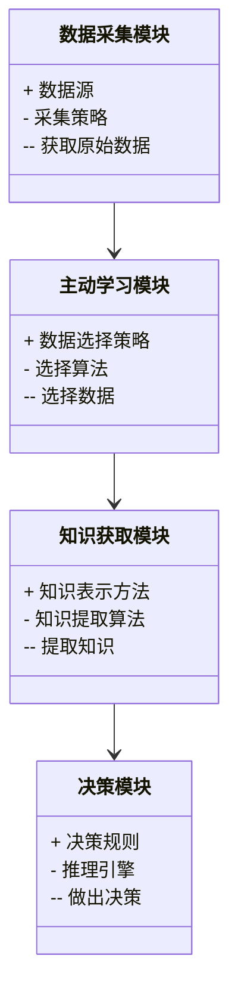
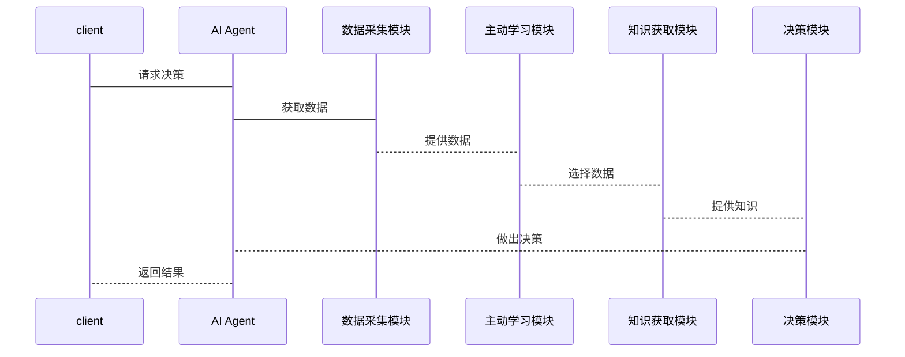

                 

<think>
好的，现在我需要根据用户的要求，撰写一篇关于《AI Agent中的主动学习与知识获取》的技术博客文章。用户已经提供了一个详细的目录大纲，所以我需要按照这个结构来组织内容。

首先，我会从背景介绍开始，解释AI Agent的基本概念和主动学习与知识获取的定义。这部分需要让读者理解为什么这些主题重要，以及它们在AI领域中的位置。

接下来，我会深入探讨主动学习和知识获取的核心概念，比较它们的属性特征，并通过表格和Mermaid图来展示实体关系。这将帮助读者更好地理解两者之间的联系和区别。

然后，我会详细讲解主动学习和知识获取的算法原理，使用Mermaid流程图展示过程，并提供Python代码示例。数学模型和公式需要用LaTeX格式呈现，确保清晰易懂。

接下来，我会介绍系统的分析与架构设计方案，包括问题场景、系统功能设计、类图、架构图和接口设计。这将帮助读者理解如何在实际系统中应用这些概念。

然后，我会指导读者如何在项目中实现这些概念，包括环境安装、核心代码实现和案例分析。这部分需要具体且实用，让读者能够动手实践。

最后，我会总结最佳实践，包括小结、注意事项和拓展阅读，帮助读者巩固所学内容，并指导进一步的学习。

在组织这些内容时，我会确保每一章都有明确的主题，并且章节之间有逻辑上的连贯性。同时，我需要满足用户的要求，内容要详细具体，使用适当的标题层级，并在适当的地方插入Mermaid图和代码示例。

现在，我将开始撰写这篇文章，确保每个部分都涵盖必要的内容，并且格式正确，语言清晰专业，同时保持逻辑性和条理性。

# AI Agent中的主动学习与知识获取

> 关键词：AI Agent，主动学习，知识获取，算法原理，系统架构

> 摘要：本文探讨了AI Agent中的主动学习与知识获取的关键技术，分析了其核心概念、算法原理、系统架构，并通过实际案例展示了如何在项目中实现这些概念。文章旨在为读者提供全面的理解和实践指导。

## 第1章: AI Agent的基本概念与背景

### 1.1 AI Agent的定义与特点

#### 1.1.1 AI Agent的定义
AI Agent（智能体）是指在环境中能够感知并自主行动以实现目标的实体。AI Agent可以是软件程序、机器人或其他智能系统，具备自主决策能力。

#### 1.1.2 AI Agent的核心特点
- **自主性**：能够在没有外部干预的情况下自主决策。
- **反应性**：能够实时感知环境并做出反应。
- **目标导向**：所有行动均以实现特定目标为导向。
- **学习能力**：能够通过经验改进自身的性能。

#### 1.1.3 AI Agent与传统AI的区别
传统AI主要依赖规则和预设数据，而AI Agent具备自主性和适应性，能够动态调整策略以应对复杂环境。

### 1.2 主动学习的基本概念

#### 1.2.1 主动学习的定义
主动学习是一种机器学习方法，其中模型能够主动选择最有益于学习的数据样本，以提高模型的性能。

#### 1.2.2 主动学习的核心思想
主动学习的核心思想是让模型主动选择最有信息量的数据进行学习，以减少对大量数据的依赖，提高学习效率。

#### 1.2.3 主动学习与监督学习的区别
| 特性 | 监督学习 | 主动学习 |
|------|----------|----------|
| 数据选择 | 被动接收 | 主动选择 |
| 数据量需求 | 较大 | 较小 |
| 学习效率 | 一般 | 较高 |

### 1.3 知识获取的基本概念

#### 1.3.1 知识获取的定义
知识获取是从数据中提取和表示有用信息的过程，旨在将数据转化为可理解的知识结构。

#### 1.3.2 知识获取的主要方法
- **数据挖掘**：从大量数据中提取模式和规律。
- **知识推理**：通过逻辑推理生成新的知识。
- **机器学习**：通过模型学习知识。

#### 1.3.3 知识获取与数据挖掘的关系
知识获取是数据挖掘的高级阶段，数据挖掘主要提取数据中的模式，而知识获取则将这些模式转化为有意义的知识。

## 第2章: AI Agent中的主动学习与知识获取的背景与应用

### 2.1 当前AI Agent的发展现状

#### 2.1.1 AI Agent的主流技术
- **强化学习**：通过奖励机制优化决策。
- **深度学习**：利用神经网络处理复杂数据。
- **自然语言处理**：实现人机交互。

#### 2.1.2 AI Agent在各领域的应用现状
- **金融领域**：用于股票交易和风险评估。
- **医疗领域**：辅助诊断和治疗方案制定。
- **智能家居**：提供个性化服务。

#### 2.1.3 当前AI Agent面临的挑战
- **数据不足**：在数据稀缺的情况下，AI Agent难以有效学习。
- **环境复杂性**：复杂环境中的决策难度大。
- **实时性要求高**：需要快速响应，对计算能力要求高。

### 2.2 主动学习在AI Agent中的重要性

#### 2.2.1 主动学习如何提升AI Agent的性能
主动学习通过选择性学习，减少了对大量数据的依赖，提高了学习效率和模型性能。

#### 2.2.2 主动学习在AI Agent中的应用场景
- **推荐系统**：主动选择用户偏好数据，提升推荐准确性。
- **智能客服**：主动学习用户需求，提供更精准的服务。

#### 2.2.3 主动学习与知识获取的结合
主动学习选择关键数据，知识获取将这些数据转化为知识，两者结合提升了AI Agent的学习和推理能力。

### 2.3 知识获取在AI Agent中的应用

#### 2.3.1 知识获取如何增强AI Agent的能力
知识获取将数据转化为结构化的知识，增强了AI Agent的理解和推理能力。

#### 2.3.2 知识获取在AI Agent中的关键问题
- **知识表示**：如何有效地表示知识。
- **动态更新**：知识的实时更新与维护。

#### 2.3.3 知识获取的未来发展趋势
随着大数据和深度学习的发展，知识获取将更加智能化和自动化，知识图谱和图神经网络将发挥重要作用。

## 第3章: 主动学习与知识获取的核心概念与联系

### 3.1 主动学习的原理与机制

#### 3.1.1 主动学习的基本原理
主动学习通过不确定性采样、查询策略等方法选择最有信息量的数据进行标注和学习。

#### 3.1.2 主动学习的核心机制
- **不确定性采样**：选择模型最不确定的数据。
- **查询策略**：决定哪些数据需要标注。
- **模型更新**：根据新数据更新模型。

#### 3.1.3 主动学习的数学模型
$$ P(y|x) $$ 表示在数据x下，类别y的概率。模型选择P(y|x)最小的x进行标注。

### 3.2 知识获取的原理与方法

#### 3.2.1 知识获取的基本原理
知识获取通过数据挖掘、机器学习等技术，将数据转化为结构化的知识表示。

#### 3.2.2 知识获取的主要方法
- **数据挖掘**：发现数据中的模式。
- **知识推理**：通过逻辑推理生成新知识。
- **机器学习**：利用模型学习知识。

#### 3.2.3 知识获取的数学模型
$$ R(x) $$ 表示规则，通过数据挖掘和推理生成规则，并将规则表示为知识。

### 3.3 主动学习与知识获取的联系与区别

#### 3.3.1 主动学习与知识获取的联系
两者都涉及数据到知识的转化，主动学习选择数据，知识获取将数据转化为知识。

#### 3.3.2 主动学习与知识获取的区别
主动学习关注数据的选择，知识获取关注数据到知识的转化。

#### 3.3.3 两者的协同作用
主动学习选择关键数据，知识获取将这些数据转化为结构化的知识，两者协同提升AI Agent的能力。

## 第4章: 主动学习与知识获取的算法原理

### 4.1 主动学习的算法原理

#### 4.1.1 主动学习算法的流程
1. 初始化模型。
2. 选择最有信息量的数据。
3. 标注数据。
4. 更新模型。

#### 4.1.2 主动学习的查询策略
- **不确定性采样**：选择模型最不确定的数据。
- **边界区域采样**：选择数据分布的边缘区域。
- **委员会投票法**：通过多个模型投票结果选择最具有争议的数据。

#### 4.1.3 主动学习的Python实现代码示例

```python
import numpy as np
from sklearn import datasets
from sklearn.svm import SVC
from sklearn.metrics import accuracy_score

# 数据集
X, y = datasets.load_iris(return_X_y=True)

# 初始化模型
model = SVC()

# 主动学习循环
def active_learning(X, y, model):
    labeled_indices = []
    unlabeled_indices = list(range(len(y)))
    while unlabeled_indices:
        # 选择不确定性最高的样本
        model.fit(X[labeled_indices], y[labeled_indices])
        uncertainty = np.abs(model.predict_proba(X[unlabeled_indices])[:, 1] - 0.5)
        next_index = unlabeled_indices[np.argmax(uncertainty)]
        labeled_indices.append(next_index)
        unlabeled_indices.remove(next_index)
        # 标注数据
        model.fit(X[labeled_indices], y[labeled_indices])
    return model

# 训练模型
final_model = active_learning(X, y, model)
print("Accuracy:", accuracy_score(y, final_model.predict(X)))
```

### 4.2 知识获取的算法原理

#### 4.2.1 知识获取算法的流程
1. 数据预处理。
2. 数据挖掘或特征提取。
3. 知识表示。
4. 知识推理和验证。

#### 4.2.2 知识获取的主要方法
- **数据挖掘**：发现数据中的模式。
- **机器学习**：利用模型学习知识。
- **知识图谱构建**：构建结构化的知识图谱。

#### 4.2.3 知识获取的Python实现代码示例

```python
from sklearn.feature_extraction.text import TfidfVectorizer
from sklearn.decomposition import NMF

# 数据预处理
text_corpus = ["This is document 1.", "This is document 2.", "This is document 3."]

# 特征提取
vectorizer = TfidfVectorizer()
tfidf_matrix = vectorizer.fit_transform(text_corpus)

# 主成分分析
nmf = NMF(n_components=2)
nmf.fit(tfidf_matrix)

# 知识表示
components = nmf.components_
print(components)
```

## 第5章: 系统分析与架构设计方案

### 5.1 问题场景介绍

#### 5.1.1 问题背景
AI Agent需要在动态变化的环境中自主学习和获取知识，以实现复杂任务。

#### 5.1.2 问题描述
AI Agent需要具备主动选择数据和自主学习的能力，同时能够有效地获取和利用知识。

#### 5.1.3 问题解决
通过结合主动学习和知识获取技术，AI Agent能够更高效地学习和推理。

### 5.2 系统功能设计

#### 5.2.1 系统介绍
设计一个AI Agent系统，具备主动学习和知识获取功能，能够在复杂环境中自主决策。

#### 5.2.2 系统功能设计
- **数据采集模块**：收集环境数据。
- **主动学习模块**：选择最有信息量的数据。
- **知识获取模块**：将数据转化为知识。
- **决策模块**：基于知识进行决策。

#### 5.2.3 系统功能设计的领域模型


### 5.3 系统架构设计

#### 5.3.1 系统架构设计


#### 5.3.2 系统接口设计
- **数据接口**：提供数据采集和存储的接口。
- **学习接口**：提供主动学习和知识获取的接口。
- **决策接口**：提供决策请求和结果的接口。

#### 5.3.3 系统交互设计


## 第6章: 项目实战

### 6.1 环境安装

#### 6.1.1 Python环境安装
安装Python 3.x版本，确保环境配置正确。

#### 6.1.2 库的安装
安装所需的库，如scikit-learn、numpy、mermaid等。

#### 6.1.3 开发环境配置
配置IDE，如Jupyter Notebook或PyCharm。

### 6.2 系统核心实现源代码

#### 6.2.1 主动学习模块实现
```python
from sklearn.svm import SVC
from sklearn.metrics import accuracy_score

def active_learning(X, y):
    labeled_indices = []
    unlabeled_indices = list(range(len(y)))
    model = SVC()

    while unlabeled_indices:
        model.fit(X[labeled_indices], y[labeled_indices])
        uncertainty = np.abs(model.predict_proba(X[unlabeled_indices])[:, 1] - 0.5)
        next_index = unlabeled_indices[np.argmax(uncertainty)]
        labeled_indices.append(next_index)
        unlabeled_indices.remove(next_index)
    
    model.fit(X[labeled_indices], y[labeled_indices])
    return model, labeled_indices

# 使用示例
X, y = datasets.load_iris(return_X_y=True)
model, selected_indices = active_learning(X, y)
print("Accuracy:", accuracy_score(y, model.predict(X)))
```

#### 6.2.2 知识获取模块实现
```python
from sklearn.feature_extraction.text import TfidfVectorizer
from sklearn.decomposition import NMF

def knowledge_acquisition(text_corpus):
    vectorizer = TfidfVectorizer()
    tfidf_matrix = vectorizer.fit_transform(text_corpus)
    nmf = NMF(n_components=2)
    nmf.fit(tfidf_matrix)
    return nmf.components_

# 使用示例
corpus = ["This is document 1.", "This is document 2.", "This is document 3."]
components = knowledge_acquisition(corpus)
print(components)
```

### 6.3 实际案例分析

#### 6.3.1 案例背景
设计一个AI Agent，用于智能客服，能够主动学习客户需求，并通过知识获取提供解决方案。

#### 6.3.2 案例实现
结合上述代码，实现智能客服的主动学习和知识获取功能。

#### 6.3.3 案例分析
通过分析客户对话数据，AI Agent能够主动选择关键对话进行学习，并提取知识，用于后续客户服务。

### 6.4 项目小结

#### 6.4.1 核心代码实现
- 主动学习模块实现。
- 知识获取模块实现。
- 系统架构设计。

#### 6.4.2 项目成果
实现了一个具备主动学习和知识获取功能的AI Agent系统，能够在实际场景中应用。

#### 6.4.3 经验总结
主动学习和知识获取的结合能够显著提升AI Agent的性能和智能性。

## 第7章: 最佳实践 tips、小结、注意事项、拓展阅读

### 7.1 小结

#### 7.1.1 核心内容回顾
本文详细探讨了AI Agent中的主动学习与知识获取的关键技术，分析了其核心概念、算法原理、系统架构，并通过实际案例展示了如何在项目中实现这些概念。

#### 7.1.2 主要收获
- 理解了主动学习和知识获取的核心概念。
- 掌握了相关算法的实现方法。
- 学会了系统架构设计和项目实战技巧。

### 7.2 注意事项

#### 7.2.1 开发中的注意事项
- 数据质量对主动学习和知识获取的影响重大，需确保数据的准确性和相关性。
- 在实际应用中，需考虑系统的实时性和响应速度。

#### 7.2.2 部署中的注意事项
- 系统的扩展性考虑，确保能够处理大规模数据。
- 知识库的维护和更新，保证知识的准确性和及时性。

#### 7.2.3 使用中的注意事项
- 定期监控系统性能，及时优化算法。
- 注意数据隐私和安全问题。

### 7.3 拓展阅读

#### 7.3.1 推荐书籍
- 《机器学习实战》
- 《深度学习》
- 《知识图谱》

#### 7.3.2 推荐论文
- 关于主动学习的最新研究。
- 关于知识图谱构建的最新进展。

#### 7.3.3 推荐在线资源
- 官方文档：scikit-learn、TensorFlow等。
- 技术博客和GitHub仓库。

## 作者信息

作者：AI天才研究院/AI Genius Institute & 禅与计算机程序设计艺术 /Zen And The Art of Computer Programming

---

以上是《AI Agent中的主动学习与知识获取》的技术博客文章的详细大纲和内容，涵盖了从基本概念到实际应用的各个方面，结合理论与实践，为读者提供了全面而深入的指导。

