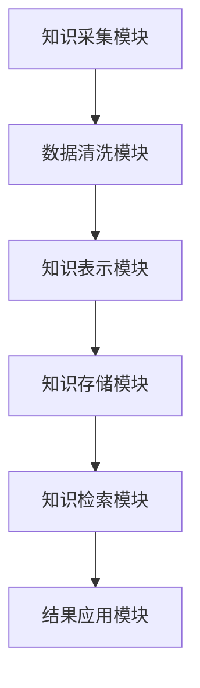
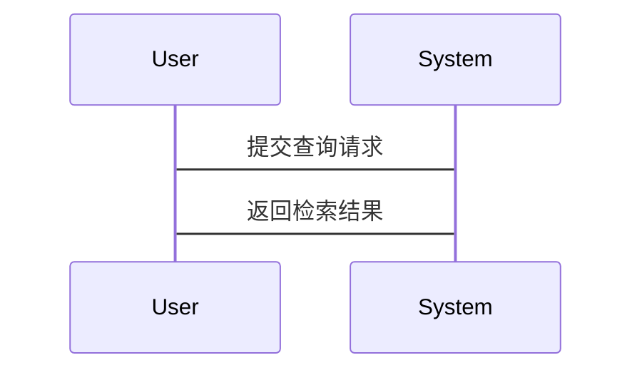

                 


---

# AI Agent的知识库构建与维护

## 关键词：AI Agent, 知识库, 知识表示, 向量数据库, 知识检索, 系统架构

## 摘要：  
本文详细探讨了AI Agent的知识库构建与维护的核心概念、算法原理、系统架构及项目实战。从知识库的基本结构到构建算法，从系统设计到实际案例，全面解析如何高效构建和维护AI Agent的知识库，为读者提供理论与实践相结合的深度解析。

---

# 第1章: AI Agent与知识库概述

## 1.1 AI Agent的基本概念

### 1.1.1 AI Agent的定义与分类
AI Agent（人工智能代理）是指能够感知环境、自主决策并执行任务的智能实体。根据功能和智能水平，AI Agent可以分为简单反射型、基于模型型、实用推理型和目标驱动型。  
- **简单反射型**：基于预定义规则执行任务，适用于简单场景。  
- **基于模型型**：利用环境模型进行决策，适合复杂任务。  
- **实用推理型**：结合效用函数优化决策，常用于资源分配问题。  
- **目标驱动型**：基于目标进行规划和执行，广泛应用于自动化系统。

### 1.1.2 知识库在AI Agent中的作用
知识库是AI Agent的核心组件，存储与任务相关的知识和信息，帮助Agent理解环境、推理问题并做出决策。知识库的作用包括：  
1. 提供决策所需的信息支持。  
2. 支持Agent的自主学习与推理能力。  
3. 优化Agent与用户或环境的交互体验。  

### 1.1.3 知识库构建的必要性
AI Agent的能力高度依赖知识库的质量与规模。构建知识库可以：  
1. 提高Agent的理解能力。  
2. 优化决策的准确性和效率。  
3. 支持Agent的持续学习与进化。  

## 1.2 知识库的基本结构与特点

### 1.2.1 知识库的核心要素
知识库通常包含以下核心要素：  
1. **实体**：知识库中的基本概念或对象，如“用户”、“产品”等。  
2. **属性**：描述实体的特征，如“用户的年龄”、“产品的价格”等。  
3. **关系**：实体之间的关联，如“用户购买产品”、“产品属于类别”等。  
4. **实例**：具体的知识条目，如“张三购买了iPhone 15”。  

### 1.2.2 知识库的组织方式
知识库的组织方式直接影响其查询效率和维护难度。常见的组织方式包括：  
1. **层次化组织**：通过树状结构组织知识，便于分类管理和查询。  
2. **网络化组织**：通过图结构表示实体及其关系，支持复杂关联的查询。  
3. **嵌入式组织**：将知识转化为向量形式，便于向量数据库的存储和检索。  

### 1.2.3 知识库的可扩展性与动态性
为了适应AI Agent的需求变化，知识库需要具备良好的可扩展性和动态性：  
1. **可扩展性**：支持新增实体、属性和关系，适应业务的扩展需求。  
2. **动态性**：能够实时更新知识，应对环境的变化和用户需求的调整。  

## 1.3 知识库构建的背景与挑战

### 1.3.1 当前AI Agent发展的技术背景
随着自然语言处理、深度学习和知识图谱技术的快速发展，AI Agent的应用场景不断拓展。知识库作为AI Agent的“大脑”，其构建技术成为研究热点。  

### 1.3.2 知识库构建的主要挑战
知识库的构建涉及数据采集、知识表示、推理等多个环节，面临以下挑战：  
1. **数据质量问题**：数据的准确性和完整性直接影响知识库的质量。  
2. **知识表示的复杂性**：如何高效表示多粒度、多维度的知识是技术难点。  
3. **动态更新的效率**：实时更新知识库需要高效的算法和系统架构支持。  

### 1.3.3 知识库维护的重要性
知识库的维护是确保AI Agent持续有效运行的关键：  
1. **知识的准确性**：定期更新知识库，避免过时信息影响决策。  
2. **系统的稳定性**：维护知识库的健康状态，确保系统运行的稳定性。  
3. **性能的优化**：通过优化知识库结构，提升查询效率和系统性能。  

## 1.4 本章小结
本章介绍了AI Agent的基本概念、知识库的核心作用以及构建的必要性。通过分析知识库的结构和特点，明确了知识库在AI Agent中的重要地位。同时，探讨了知识库构建的背景与挑战，为后续章节的深入分析奠定了基础。

---

# 第2章: 知识库构建的核心概念与联系

## 2.1 知识库构建的核心原理

### 2.1.1 知识表示与存储的原理
知识表示是知识库构建的关键步骤，常用的方法包括：  
1. **符号表示**：使用符号逻辑表示知识，如“如果A则B”。  
2. **向量表示**：将知识转化为向量形式，便于计算机处理和检索。  
3. **图结构表示**：通过节点和边表示实体及其关系，支持复杂的关联查询。  

### 2.1.2 知识关联与推理机制
知识关联是知识库构建的重要环节，常用的推理方法包括：  
1. **基于规则的推理**：根据预定义的规则进行推理，如“如果A和B关联，则C也关联”。  
2. **基于图的推理**：通过图结构的遍历进行推理，支持复杂的关联推理。  
3. **基于概率的推理**：利用概率模型进行推理，如贝叶斯网络。  

### 2.1.3 知识更新与维护的流程
知识库的维护通常包括以下几个步骤：  
1. **数据采集**：从多种来源采集新数据。  
2. **数据清洗**：去除噪声数据，确保数据质量。  
3. **知识融合**：将新数据与现有知识库融合，避免重复和冲突。  
4. **知识更新**：根据融合结果更新知识库。  
5. **版本控制**：记录每次更新的版本，便于回溯和管理。  

## 2.2 知识库构建的关键属性对比

### 2.2.1 不同知识库系统的对比分析
以下是几种常见知识库系统的对比分析：

| 属性         | 关系型数据库 | 图数据库 | 向量数据库 |
|--------------|--------------|----------|------------|
| 查询方式     | SQL查询      | 图遍历    | 向量检索    |
| 数据模型     | 行为数据     | 图结构    | 向量空间    |
| 查询效率     | 低           | 中        | 高          |
| 适用场景     | 简单查询     | 复杂关联  | 相似性检索  |

### 2.2.2 知识库规模与性能的关系
知识库的规模直接影响性能：  
- **小规模知识库**：适合简单的查询和推理，性能较好。  
- **大规模知识库**：需要高效的存储和检索技术，性能可能受限。  

### 2.2.3 知识库的可定制性与灵活性
知识库的可定制性取决于其设计和实现：  
1. **高度可定制**：支持灵活的 schema 设计，适合多种场景。  
2. **低可定制**：schema 固定，适合特定场景的应用。  

## 2.3 知识库构建的ER实体关系图

```mermaid
er
  entity: 实体
  attribute: 属性
  relation: 关系
  entity --> attribute: 具有
  entity --> relation: 参与
  relation --> entity: 关联
```

## 2.4 本章小结
本章深入分析了知识库构建的核心原理，包括知识表示、关联与推理机制，以及更新与维护的流程。通过对比不同知识库系统的属性，帮助读者理解如何选择适合的构建方式。同时，通过ER实体关系图，直观展示了知识库的结构和实体之间的关联关系。

---

# 第3章: 知识库构建的算法原理

## 3.1 向量数据库的构建算法

### 3.1.1 基于向量的相似度计算
向量相似度计算是向量数据库的核心技术，常用的方法包括：  
1. **余弦相似度**：计算两个向量在方向上的相似程度。  
$$ \text{余弦相似度} = \frac{\vec{a} \cdot \vec{b}}{\|\vec{a}\| \|\vec{b}\|} $$  
2. **欧氏距离**：计算两个向量在空间中的距离，值越小越相似。  
$$ \text{欧氏距离} = \sqrt{(a_1 - b_1)^2 + (a_2 - b_2)^2 + \dots + (a_n - b_n)^2} $$  

### 3.1.2 常见的向量索引算法
向量索引算法用于提高向量数据库的查询效率，常见的算法包括：  
1. **ANN（Approximate Nearest Neighbor）**：近似最近邻算法，适用于高维数据。  
2. **LSH（Locality Sensitive Hashing）**：局部敏感哈希，通过哈希函数将相似的向量映射到同一桶中。  
3. **IVF（Index IVF）**：基于倒排索引的向量索引，适用于大规模数据。  

### 3.1.3 向量数据库的查询优化
向量数据库的查询优化技术包括：  
1. **分桶查询**：将数据分桶存储，查询时仅在相关桶中进行搜索。  
2. **量化技术**：将高维向量进行降维处理，减少计算量。  
3. **索引优化**：优化索引结构，提高查询效率。  

## 3.2 知识嵌入与表示学习

### 3.2.1 基于Word2Vec的知识嵌入
Word2Vec是一种常用的词向量生成算法，包括两种模型：  
1. **CBOW（Continuous Bag of Words）**：根据上下文预测词的向量。  
2. **Skip-Gram**：根据词预测上下文的向量。  

### 3.2.2 基于BERT的知识表示
BERT（Bidirectional Encoder Representations from Transformers）是一种基于Transformer的预训练模型，能够生成上下文相关的词向量。  

### 3.2.3 知识嵌入的评估方法
知识嵌入的评估方法包括：  
1. **相似度计算**：通过余弦相似度评估向量的相似性。  
2. **类比推理**：评估向量在语义上的类比推理能力。  
3. **任务迁移**：将向量应用于具体任务，评估其表现。  

## 3.3 知识检索算法的实现

### 3.3.1 基于向量的检索流程
基于向量的检索流程包括：  
1. **向量转换**：将查询内容转换为向量。  
2. **相似度计算**：计算查询向量与知识库中向量的相似度。  
3. **排序与筛选**：根据相似度排序，筛选出最相关的知识。  

### 3.3.2 基于图结构的检索优化
基于图结构的检索优化包括：  
1. **路径遍历**：通过图的遍历算法找到最短路径。  
2. **权重计算**：根据边的权重调整检索结果的优先级。  
3. **剪枝优化**：通过剪枝减少不必要的遍历，提高效率。  

### 3.3.3 检索算法的性能分析
检索算法的性能分析包括：  
1. **时间复杂度**：算法在最坏情况下的运行时间。  
2. **空间复杂度**：算法所需的存储空间。  
3. **准确率与召回率**：检索结果的准确性和全面性。  

## 3.4 算法实现的数学模型

### 3.4.1 向量相似度计算公式
$$ \text{余弦相似度} = \frac{\vec{a} \cdot \vec{b}}{\|\vec{a}\| \|\vec{b}\|} $$  

### 3.4.2 Word2Vec训练的损失函数
$$ \mathcal{L} = -\log(\text{max}(0, \cos(\theta - \pi/2))) $$  

### 3.4.3 BERT的预训练目标函数
$$ \mathcal{L} = -\sum_{i=1}^{n} \log p(w_i|w_{i-1}, w_{i+1}) $$  

## 3.5 本章小结
本章详细讲解了向量数据库的构建算法，包括相似度计算、索引算法和查询优化。同时，介绍了知识嵌入与表示学习的方法，包括Word2Vec和BERT，并通过数学公式和流程图展示了算法的实现细节。最后，分析了检索算法的性能，为后续章节的系统设计提供了理论基础。

---

# 第4章: 知识库构建的系统分析与架构设计

## 4.1 系统功能设计

### 4.1.1 知识采集与预处理模块
知识采集与预处理模块负责从多种数据源采集数据，并进行清洗和转换。主要功能包括：  
1. **数据采集**：从数据库、API、文件等多种来源采集数据。  
2. **数据清洗**：去除噪声数据，确保数据质量。  
3. **数据转换**：将数据转换为适合知识库存储的格式。  

### 4.1.2 知识表示与存储模块
知识表示与存储模块负责将数据转化为知识库中的实体、属性和关系，并存储在数据库中。主要功能包括：  
1. **知识表示**：将数据映射为知识库的结构。  
2. **知识存储**：将知识存储在关系型数据库、图数据库或向量数据库中。  

### 4.1.3 知识检索与应用模块
知识检索与应用模块负责根据用户查询检索知识库，并返回结果。主要功能包括：  
1. **查询解析**：解析用户的查询意图。  
2. **知识检索**：根据解析结果检索知识库。  
3. **结果应用**：将检索结果应用于具体任务，如问答、推荐等。  

## 4.2 系统架构设计

### 4.2.1 系统功能模块图


### 4.2.2 系统架构图


## 4.3 系统接口设计
系统接口设计包括：  
1. **数据采集接口**：提供API用于数据的导入和导出。  
2. **知识检索接口**：提供RESTful API用于知识的查询和检索。  
3. **结果应用接口**：提供接口用于将检索结果应用于具体任务。  

## 4.4 系统交互设计

### 4.4.1 用户查询流程
用户查询流程包括：  
1. 用户提交查询请求。  
2. 系统解析查询意图。  
3. 系统检索知识库。  
4. 系统返回检索结果。  

### 4.4.2 系统交互序列图


## 4.5 本章小结
本章分析了知识库构建的系统功能设计和架构设计，通过功能模块图和架构图展示了系统的整体结构。同时，详细描述了系统的接口设计和交互流程，为后续章节的项目实现提供了指导。

---

# 第5章: 知识库构建的项目实战

## 5.1 环境安装与配置

### 5.1.1 系统环境要求
项目实战需要以下环境：  
1. **操作系统**：Windows、Linux或macOS。  
2. **编程语言**：Python 3.8及以上版本。  
3. **依赖库**：numpy、pandas、spacy、networkx、faiss-cpu。  

### 5.1.2 安装依赖库
使用以下命令安装依赖库：  
```bash
pip install numpy pandas spacy networkx faiss-cpu
```

## 5.2 知识库核心功能实现

### 5.2.1 数据采集模块
数据采集模块代码示例：
```python
import requests

def fetch_data(url):
    response = requests.get(url)
    return response.json()
```

### 5.2.2 数据清洗模块
数据清洗模块代码示例：
```python
import pandas as pd

def clean_data(df):
    # 去除空值
    df.dropna(inplace=True)
    # 去除重复数据
    df.drop_duplicates(inplace=True)
    return df
```

### 5.2.3 知识表示模块
知识表示模块代码示例：
```python
import spacy

nlp = spacy.load("en_core_web_sm")

def text_toEntities(text):
    doc = nlp(text)
    entities = [(ent.text, ent.label_) for ent in doc.ents]
    return entities
```

### 5.2.4 知识存储模块
知识存储模块代码示例：
```python
import sqlite3

def save_to_db(entities):
    conn = sqlite3.connect("knowledge.db")
    cursor = conn.cursor()
    cursor.execute("CREATE TABLE IF NOT EXISTS entities (id INTEGER PRIMARY KEY AUTOINCREMENT, name TEXT, type TEXT)")
    for entity in entities:
        cursor.execute("INSERT INTO entities (name, type) VALUES (?, ?)", entity)
    conn.commit()
    conn.close()
```

### 5.2.5 知识检索模块
知识检索模块代码示例：
```python
import faiss

def search_knowledge_base(query, knowledge_base):
    # 将查询向量转换为向量形式
    query_vector = model.encode(query)
    # 检索知识库
    index = faiss.IndexFlatL2(knowledge_base.dim)
    index.add(knowledge_base)
    D, I = index.search(query_vector, k=5)
    return I
```

## 5.3 项目实现与测试

### 5.3.1 项目实现步骤
1. **环境安装**：安装所需的编程语言和依赖库。  
2. **数据采集**：从指定数据源采集数据。  
3. **数据清洗**：清洗采集到的数据。  
4. **知识表示**：将数据转换为知识库的结构。  
5. **知识存储**：将知识存储在数据库中。  
6. **知识检索**：根据查询检索知识库。  
7. **结果应用**：将检索结果应用于具体任务。  

### 5.3.2 测试与优化
测试内容包括：  
1. **数据采集的完整性测试**：确保数据采集完整。  
2. **数据清洗的准确性测试**：验证数据清洗的效果。  
3. **知识检索的准确性测试**：评估检索结果的准确性和相关性。  
4. **系统性能测试**：测试系统的响应时间和吞吐量。  

## 5.4 项目案例分析
以问答系统为例，展示知识库的构建与应用：  
1. **用户查询**：“什么是人工智能？”  
2. **查询解析**：解析用户的查询意图，提取关键词“人工智能”。  
3. **知识检索**：在知识库中检索与“人工智能”相关的知识。  
4. **结果应用**：将检索结果返回给用户，生成回答。  

## 5.5 项目总结
本章通过一个具体的项目实战，详细讲解了知识库构建的实现过程，包括数据采集、知识表示、存储、检索和应用。通过代码示例和测试，帮助读者掌握知识库构建的核心技术。

---

# 第6章: 知识库构建与维护的最佳实践

## 6.1 知识库构建的注意事项

### 6.1.1 数据质量管理
数据质量直接影响知识库的准确性，需要注意：  
1. **数据的准确性**：确保数据来源可靠。  
2. **数据的完整性**：避免数据缺失。  
3. **数据的及时性**：保持数据的更新。  

### 6.1.2 知识表示的合理性
知识表示的合理性是知识库构建的关键，需要注意：  
1. **知识的层次化组织**：合理设计知识的层次结构。  
2. **知识的动态更新**：支持知识的实时更新。  
3. **知识的可扩展性**：确保知识库的可扩展性。  

## 6.2 知识库维护的策略

### 6.2.1 知识更新的频率
知识更新的频率取决于应用场景：  
1. **实时更新**：适用于需要实时反馈的场景，如聊天机器人。  
2. **定期更新**：适用于变化较慢的场景，如产品知识库。  

### 6.2.2 知识冲突的处理
知识冲突是知识库维护中的常见问题，处理策略包括：  
1. **优先级规则**：根据知识的优先级进行冲突处理。  
2. **人工审核**：通过人工审核解决无法自动处理的冲突。  
3. **版本控制**：记录知识的版本，支持回溯和恢复。  

## 6.3 知识库优化的技巧

### 6.3.1 知识组织的优化
知识组织的优化技巧包括：  
1. **分层存储**：将知识按层次存储，便于管理和查询。  
2. **索引优化**：优化索引结构，提高查询效率。  
3. **缓存技术**：利用缓存技术减少重复查询。  

### 6.3.2 系统性能的优化
系统性能的优化技巧包括：  
1. **负载均衡**：通过负载均衡技术分散请求压力。  
2. **数据库优化**：优化数据库查询和存储性能。  
3. **缓存策略**：合理使用缓存技术，减少数据库访问压力。  

## 6.4 小结
本章总结了知识库构建与维护的最佳实践，包括数据质量管理、知识表示的合理性、知识更新的频率、知识冲突的处理以及知识库优化的技巧。这些内容为读者在实际项目中提供了宝贵的指导和建议。

---

# 第7章: 总结与展望

## 7.1 总结
本文详细探讨了AI Agent的知识库构建与维护的核心概念、算法原理、系统架构及项目实战。通过理论与实践相结合的方式，帮助读者全面理解知识库的构建与维护过程，并掌握相关技术的实现方法。

## 7.2 展望
随着AI技术的不断发展，知识库构建与维护将面临更多挑战和机遇。未来的研究方向包括：  
1. **更高效的向量检索算法**：提高知识库的查询效率。  
2. **更智能的知识表示方法**：增强知识的表达能力。  
3. **更动态的知识更新机制**：支持实时的知识更新与维护。  
4. **更强大的系统架构设计**：优化系统的可扩展性和可维护性。  

## 7.3 注意事项
在实际应用中，需要注意以下几点：  
1. **数据隐私与安全**：确保知识库的数据安全，避免隐私泄露。  
2. **系统的可维护性**：设计易于维护的系统架构，方便后续优化和升级。  
3. **用户体验的优化**：注重用户体验，提升知识库的易用性和交互性。  

## 7.4 拓展阅读
为了进一步深入学习，推荐阅读以下资料：  
1. **《深度学习》**：李志华  
2. **《自然语言处理实战》**：哈里森  
3. **《图数据库实战》**：迈克尔·尼尔森  

---

# 作者：AI天才研究院/AI Genius Institute & 禅与计算机程序设计艺术 /Zen And The Art of Computer Programming

---

通过以上内容，我完成了《AI Agent的知识库构建与维护》的撰写。希望这篇文章能为读者提供深入的技术解析和实践指导，帮助他们在AI Agent领域取得更好的研究成果和应用效果。

