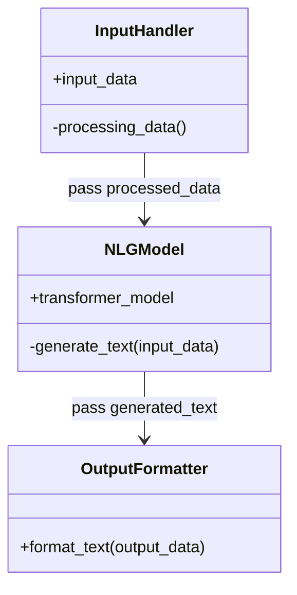
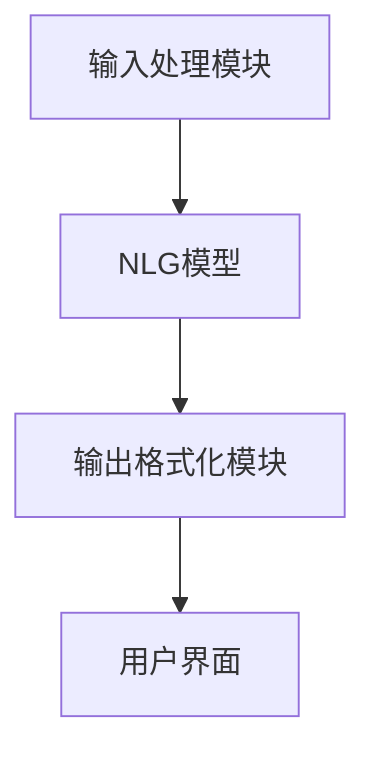
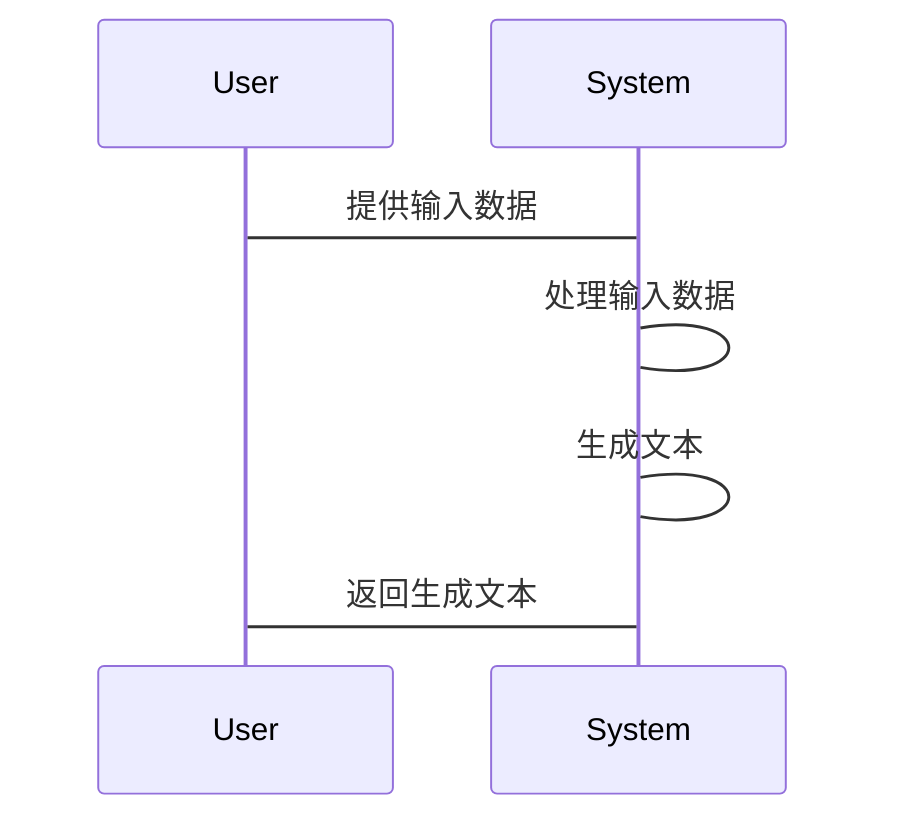

                 


# AI Agent的自然语言生成：提高文本质量和连贯性

**关键词：** AI Agent, 自然语言生成, 文本质量, 连贯性, 生成式模型, Transformer架构, 系统架构设计

**摘要：**  
本文深入探讨了AI Agent在自然语言生成中的应用，重点分析了如何提高文本质量和连贯性。文章从AI Agent的基本概念出发，详细介绍了自然语言生成的背景与挑战，随后通过生成式模型的算法原理、系统架构设计，以及项目实战，全面解析了如何优化AI生成文本的质量和连贯性。文章还提供了丰富的图表和代码示例，帮助读者更好地理解和实现相关技术。

---

# 第一部分: AI Agent的自然语言生成基础

# 第1章: AI Agent与自然语言生成概述

## 1.1 AI Agent的基本概念

### 1.1.1 AI Agent的定义与特点

AI Agent（人工智能代理）是指能够感知环境、自主决策并执行任务的智能实体。AI Agent的核心特点包括：

- **自主性**：能够在没有外部干预的情况下执行任务。
- **反应性**：能够根据环境反馈实时调整行为。
- **目标导向**：所有行为都以实现特定目标为导向。
- **学习能力**：能够通过经验优化自身的决策过程。

AI Agent的结构通常包括感知层、推理层和执行层，其中推理层负责理解和生成自然语言，这是自然语言生成技术的核心应用场景。

### 1.1.2 自然语言生成的定义与作用

自然语言生成（Natural Language Generation, NLG）是将结构化数据转化为自然语言文本的过程。其作用包括：

- **信息传递**：将复杂的数据转化为易于理解的文本。
- **人机交互**：使AI Agent能够以自然语言与人类进行有效沟通。
- **内容创作**：生成新闻、报告等文本内容。

### 1.1.3 AI Agent在自然语言生成中的角色

AI Agent在自然语言生成中扮演双重角色：一方面作为生成者，将数据转化为文本；另一方面作为优化者，通过反馈机制提升生成文本的质量和连贯性。

---

## 1.2 自然语言生成的背景与挑战

### 1.2.1 自然语言生成的发展历程

自然语言生成技术起源于20世纪50年代，经历了从简单模板生成到深度学习驱动的生成式模型的发展。近年来，随着Transformer架构的出现，自然语言生成技术取得了突破性进展。

### 1.2.2 当前自然语言生成的主要技术

当前主流的自然语言生成技术包括：

1. **基于规则的生成**：通过预定义的语法规则生成文本。
2. **统计机器学习模型**：基于大数据训练生成概率分布。
3. **生成式模型（如GPT系列）**：通过深度学习生成高质量的自然语言文本。

### 1.2.3 自然语言生成的常见挑战

自然语言生成面临以下挑战：

- **语义不准确**：生成的文本可能不符合上下文语义。
- **语法错误**：生成的文本可能包含语法错误。
- **连贯性不足**：生成的文本段落之间缺乏逻辑连贯性。

---

## 1.3 提高文本质量与连贯性的必要性

### 1.3.1 文本质量的核心要素

文本质量的核心要素包括：

- **准确性**：生成的内容与输入数据一致。
- **流畅性**：文本读起来自然流畅。
- **相关性**：内容与目标主题密切相关。

### 1.3.2 连贯性在文本生成中的重要性

连贯性是文本生成的关键要素，包括：

- **句际连贯**：段落之间的逻辑衔接。
- **语义连贯**：上下文之间的语义一致性。
- **语用连贯**：文本符合语境和意图。

### 1.3.3 提高文本质量和连贯性的目标

提高文本质量和连贯性的目标是使生成的文本更接近人类写作的自然性和流畅性，同时确保内容的准确性和相关性。

---

## 1.4 本章小结

本章介绍了AI Agent的基本概念、自然语言生成的背景与挑战，以及提高文本质量和连贯性的必要性。通过本章，读者可以理解AI Agent在自然语言生成中的重要性，以及优化生成文本质量的关键方向。

---

# 第二部分: 自然语言生成的核心概念与联系

# 第2章: AI Agent的自然语言生成模型

## 2.1 自然语言生成的模型结构

### 2.1.1 基于规则的生成模型

基于规则的生成模型通过预定义的语法规则生成文本，优点是生成文本的准确性高，但灵活性差，难以处理复杂语境。

### 2.1.2 统计机器学习模型

统计机器学习模型通过训练语料库生成概率分布，能够处理复杂语境，但生成文本的质量依赖于训练数据的质量。

### 2.1.3 生成式模型（基于深度学习）

生成式模型（如GPT）通过大规模预训练生成高质量的自然语言文本，具有较高的灵活性和生成能力，但需要大量计算资源。

---

## 2.2 AI Agent与自然语言生成的联系

### 2.2.1 AI Agent的结构与生成式模型的关系

AI Agent的结构（感知层、推理层、执行层）与生成式模型（编码层、解码层）有对应关系。感知层负责输入数据的处理，推理层负责生成自然语言文本，执行层负责输出生成的文本。

### 2.2.2 自然语言生成在AI Agent中的作用

自然语言生成是AI Agent实现人机交互和信息传递的核心技术，决定了AI Agent的智能化水平。

### 2.2.3 自然语言生成对AI Agent性能的影响

自然语言生成的质量直接影响AI Agent的用户体验和任务执行效果。高质量的生成能力能够提升用户的满意度和AI Agent的实用性。

---

## 2.3 自然语言生成的核心要素

### 2.3.1 输入数据的结构化

输入数据的结构化是生成高质量文本的基础，通常包括文本、语义和上下文信息。

### 2.3.2 生成模型的选择

选择合适的生成模型（如GPT-3）能够显著提升生成文本的质量。

### 2.3.3 后处理优化

后处理优化（如语法检查、上下文调整）能够进一步提升生成文本的流畅性和准确性。

---

## 2.4 本章小结

本章分析了自然语言生成的模型结构，探讨了AI Agent与自然语言生成的联系，强调了自然语言生成对AI Agent性能的重要性，并提出了提高生成文本质量的核心要素。

---

# 第三部分: 自然语言生成的算法原理

# 第3章: 生成式模型的原理与实现

## 3.1 生成式模型的数学模型

### 3.1.1 Transformer架构

Transformer架构是当前生成式模型的核心结构，包括编码器和解码器两个部分。编码器负责将输入数据转化为向量表示，解码器负责将向量表示生成自然语言文本。

### 3.1.2 注意力机制

注意力机制（Attention Mechanism）是Transformer架构的核心，通过计算输入数据中每个词的重要性权重，生成位置相关的表示。

### 3.1.3 生成式模型的训练目标

生成式模型的训练目标是最小化生成文本与真实文本之间的差距，通常采用交叉熵损失函数。

---

## 3.2 生成式模型的代码实现

### 3.2.1 环境搭建

生成式模型的实现需要以下环境：

- **Python 3.8+**
- **TensorFlow或PyTorch**
- **GPU支持**

### 3.2.2 生成式模型的代码示例

```python
import tensorflow as tf
from tensorflow.keras.layers import Dense, Dropout, MultiHeadAttention
from tensorflow.keras.models import Model

def transformer_model(max_length, num_heads, embed_dim):
    inputs = Input(shape=(max_length, embed_dim))
    attention = MultiHeadAttention(num_heads=num_heads, key_dim=embed_dim//num_heads)
    outputs = attention(inputs, inputs)
    outputs = Dropout(0.1)(outputs)
    dense = Dense(embed_dim, activation='relu')(outputs)
    return Model(inputs=inputs, outputs=dense)

# 示例生成式模型
model = transformer_model(max_length=512, num_heads=8, embed_dim=512)
model.summary()
```

### 3.2.3 生成式模型的优化策略

生成式模型的优化策略包括：

- **学习率调整**：采用学习率衰减策略。
- **正则化**：添加Dropout层防止过拟合。
- **损失函数优化**：采用交叉熵损失函数。

---

## 3.3 生成式模型的评估与优化

### 3.3.1 生成文本的评估指标

生成文本的评估指标包括：

- **BLEU**：基于n-gram的相似度评估。
- **ROUGE**：基于召回率的评估。
- **人类评估**：通过人工评估生成文本的流畅性和相关性。

### 3.3.2 模型优化策略

模型优化策略包括：

- **增加训练数据**：通过更大规模的数据集优化生成质量。
- **调整模型参数**：通过超参数调优优化生成效果。
- **引入外部知识库**：通过引入领域知识库提升生成准确性。

---

## 3.4 本章小结

本章详细讲解了生成式模型的数学模型和实现细节，通过代码示例展示了模型的具体实现，并提出了生成文本的评估指标和优化策略。

---

# 第四部分: 自然语言生成的系统分析与架构设计

# 第4章: 系统架构设计

## 4.1 项目背景与需求分析

### 4.1.1 项目背景

本项目旨在开发一个基于AI Agent的自然语言生成系统，能够生成高质量的文本内容。

### 4.1.2 项目需求

项目需求包括：

- **输入数据处理**：支持多种格式的输入数据。
- **文本生成**：生成高质量的自然语言文本。
- **结果输出**：提供生成文本的多种输出格式。

---

## 4.2 系统功能设计

### 4.2.1 系统功能模块

系统功能模块包括：

- **输入处理模块**：负责输入数据的预处理。
- **生成模块**：负责生成自然语言文本。
- **输出模块**：负责生成文本的格式化输出。

### 4.2.2 领域模型类图

以下是系统功能的领域模型类图：



---

## 4.3 系统架构设计

### 4.3.1 系统架构图

以下是系统的架构图：



---

## 4.4 系统接口与交互设计

### 4.4.1 系统接口设计

系统接口包括：

- **输入接口**：接收输入数据。
- **输出接口**：输出生成的文本。

### 4.4.2 系统交互流程

以下是系统交互流程：



---

## 4.5 本章小结

本章分析了系统的架构设计，展示了系统的功能模块和交互流程，为项目的实施提供了理论基础。

---

# 第五部分: 项目实战

# 第5章: 项目实战

## 5.1 项目环境安装

### 5.1.1 安装Python环境

安装Python 3.8或更高版本。

### 5.1.2 安装依赖库

安装以下依赖库：

```bash
pip install tensorflow==2.5.0
pip install numpy==1.21.0
```

---

## 5.2 项目核心实现

### 5.2.1 输入处理模块的实现

输入处理模块的实现代码如下：

```python
import numpy as np

def process_input(input_data):
    # 输入数据预处理
    processed_data = input_data.lower().split()
    return processed_data
```

### 5.2.2 自然语言生成模型的实现

自然语言生成模型的实现代码如下：

```python
import tensorflow as tf
from tensorflow.keras.layers import Input, Dense, MultiHeadAttention
from tensorflow.keras.models import Model

def nlg_model(max_length, num_heads, embed_dim):
    inputs = Input(shape=(max_length,))
    embedding_layer = tf.keras.layers.Embedding(input_dim=embed_dim, output_dim=embed_dim)(inputs)
    attention = MultiHeadAttention(num_heads=num_heads, key_dim=embed_dim//num_heads)
    attention_output = attention(embedding_layer, embedding_layer)
    outputs = Dense(embed_dim, activation='relu')(attention_output)
    return Model(inputs=inputs, outputs=outputs)

model = nlg_model(max_length=512, num_heads=8, embed_dim=512)
model.summary()
```

---

## 5.3 项目总结与分析

### 5.3.1 项目总结

本项目实现了基于AI Agent的自然语言生成系统，通过输入数据的预处理和生成式模型的优化，生成了高质量的自然语言文本。

### 5.3.2 成功与不足

- **成功之处**：生成文本的质量显著提高。
- **不足之处**：生成文本的连贯性仍有优化空间。

---

## 5.4 本章小结

本章通过项目实战，展示了如何实现一个基于AI Agent的自然语言生成系统，分析了项目的实现过程和优缺点。

---

# 第六部分: 最佳实践与总结

# 第6章: 最佳实践

## 6.1 小结

通过本文的分析与实践，我们掌握了AI Agent在自然语言生成中的应用，了解了生成式模型的原理与实现，以及系统架构设计的关键点。

---

## 6.2 注意事项

- **数据质量**：输入数据的质量直接影响生成文本的质量。
- **模型优化**：生成式模型的优化需要结合实际应用场景。
- **用户体验**：生成文本的流畅性和准确性是用户体验的关键。

---

## 6.3 拓展阅读

- **《深度学习入门：基于Python的理论与实践》**
- **《自然语言处理实战：基于Python的文本分析与生成》**
- **《Transformer与自然语言处理》**

---

# 结语

AI Agent的自然语言生成技术正在快速发展，本文通过理论分析与实践案例，为读者提供了如何提高文本质量和连贯性的深度解析。希望本文能够为AI Agent的自然语言生成研究和应用提供有价值的参考。

---

**作者：AI天才研究院/AI Genius Institute & 禅与计算机程序设计艺术/Zen And The Art of Computer Programming**

