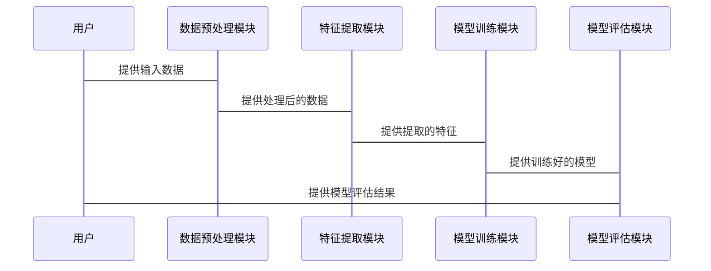

                 


# AI Agent的跨域零样本学习与泛化

> 关键词：AI Agent，零样本学习，跨域学习，泛化能力，深度学习，机器学习

> 摘要：本文深入探讨AI Agent在跨域零样本学习与泛化能力方面的技术细节。通过背景介绍、核心概念解析、算法原理分析、系统架构设计、项目实战和最佳实践等多维度展开，帮助读者全面理解AI Agent在零样本和跨域学习中的应用，掌握其算法实现和系统设计的关键点。

---

# 1. 背景介绍

## 1.1 AI Agent的基本概念与背景

### 1.1.1 AI Agent的定义与特点
- AI Agent的定义：AI Agent（智能体）是指能够感知环境、做出决策并采取行动以实现特定目标的实体。
- AI Agent的特点：
  - **自主性**：能够在没有外部干预的情况下自主运行。
  - **反应性**：能够实时感知环境并做出反应。
  - **目标导向性**：所有行为都以实现特定目标为导向。
  - **学习能力**：能够通过学习提高自身的智能水平。

### 1.1.2 AI Agent的应用场景
- **智能家居**：通过AI Agent实现设备间的协同工作，提升用户体验。
- **自动驾驶**：AI Agent用于车辆的环境感知和决策控制。
- **智能客服**：通过AI Agent提供自动化的问题解答和客户支持。

### 1.1.3 AI Agent的挑战与研究意义
- **零样本学习**：AI Agent需要在没有先例的情况下，快速适应新任务。
- **跨域学习**：AI Agent需要在不同领域之间迁移知识和技能。
- **泛化能力**：AI Agent需要在不同环境下保持稳定的性能。

## 1.2 零样本学习与跨域学习的背景

### 1.2.1 零样本学习的定义与特点
- 零样本学习（Zero-shot Learning）：在训练过程中没有看到过的类别上进行分类或回归任务。
- 零样本学习的特点：
  - **数据稀缺性**：某些类别的数据量非常少，甚至为零。
  - **通用性**：能够在没有训练数据的情况下进行推理和分类。

### 1.2.2 跨域学习的定义与特点
- 跨域学习（Cross-Domain Learning）：在多个领域之间共享知识，以提高模型在不同领域上的性能。
- 跨域学习的特点：
  - **领域多样性**：涉及多个不同领域的数据。
  - **知识共享**：通过跨领域数据的共享，提高模型的泛化能力。

### 1.2.3 零样本学习与跨域学习的结合
- 零样本学习和跨域学习的结合能够帮助AI Agent在不同领域之间快速适应新任务，提升其泛化能力。

---

# 2. 核心概念与联系

## 2.1 零样本学习的核心原理

### 2.1.1 零样本学习的数学模型
- 零样本学习的数学模型通常基于生成对抗网络（GAN）或变体自编码器（VAE）。
- 模型通过生成样本的方式，学习数据的分布，从而在没有训练数据的情况下进行分类。

### 2.1.2 零样本学习的算法流程
- 数据预处理：对输入数据进行标准化和归一化处理。
- 特征提取：提取数据的关键特征，用于后续的分类任务。
- 模型训练：通过生成对抗网络或其他方法训练模型，使其能够生成新的样本。

### 2.1.3 零样本学习的关键技术
- **生成模型**：如GAN和VAE，用于生成新的样本。
- **度量学习**：通过学习数据之间的相似性，提高分类的准确性。

## 2.2 跨域学习的核心原理

### 2.2.1 跨域学习的数学模型
- 跨域学习的数学模型通常基于联合分布，通过最大化跨领域的相似性来提高模型的泛化能力。

### 2.2.2 跨域学习的算法流程
- 数据对齐：将不同领域的数据对齐，使其具有可比性。
- 特征共享：提取共享的特征，用于跨领域的分类任务。
- 跨域模型训练：通过联合训练的方式，优化模型的性能。

### 2.2.3 跨域学习的关键技术
- **领域适应**：通过适应不同领域的数据分布，提高模型的性能。
- **联合学习**：通过同时学习多个领域的数据，提高模型的泛化能力。

## 2.3 零样本学习与跨域学习的联系

### 2.3.1 零样本学习与跨域学习的结合方式
- **联合训练**：同时训练零样本学习和跨域学习模型，使其能够在不同领域之间共享知识。
- **多任务学习**：通过多任务学习的方式，提高模型的跨领域适应能力。

### 2.3.2 零样本学习与跨域学习的协同作用
- 零样本学习能够快速适应新领域，而跨域学习能够提高模型在不同领域上的泛化能力。

### 2.3.3 零样本学习与跨域学习的优缺点对比
- **零样本学习**：优点是能够快速适应新任务，缺点是分类准确率较低。
- **跨域学习**：优点是能够提高模型的泛化能力，缺点是计算复杂度较高。

---

# 3. 算法原理讲解

## 3.1 零样本学习的算法原理

### 3.1.1 零样本学习的算法流程
- 数据预处理：对输入数据进行标准化和归一化处理。
- 特征提取：使用深度学习模型提取数据的特征。
- 模型训练：通过生成对抗网络生成新的样本，并训练分类器。

### 3.1.2 零样本学习的数学模型
- **生成模型**：如GAN和VAE，用于生成新的样本。
- **分类模型**：如SVM和随机森林，用于分类任务。

### 3.1.3 零样本学习的代码实现
```python
import tensorflow as tf
from tensorflow.keras import layers

# 定义生成器
def generator():
    model = tf.keras.Sequential()
    model.add(layers.Dense(128, activation='relu'))
    model.add(layers.Dense(10, activation='softmax'))
    return model

# 定义判别器
def discriminator():
    model = tf.keras.Sequential()
    model.add(layers.Dense(128, activation='relu'))
    model.add(layers.Dense(1, activation='sigmoid'))
    return model

# 初始化生成器和判别器
generator = generator()
discriminator = discriminator()

# 定义损失函数和优化器
cross_entropy = tf.keras.losses.BinaryCrossentropy()
generator_optimizer = tf.keras.optimizers.Adam(0.0002)
discriminator_optimizer = tf.keras.optimizers.Adam(0.0002)

# 定义训练步骤
def train_step(images):
    # 生成假数据
    noise = tf.random.normal([batch_size, 100])
    generated_images = generator(noise)
    
    # 判别器的训练
    real_output = discriminator(images)
    generated_output = discriminator(generated_images)
    
    # 计算损失
    gen_loss = cross_entropy(tf.ones_like(generated_output), generated_output)
    disc_loss = cross_entropy(tf.ones_like(real_output), real_output) + cross_entropy(tf.zeros_like(generated_output), generated_output)
    
    # 更新参数
    generator trainable variables
    generator_gradients = generator.optimizer.compute_gradients(gen_loss, generator trainable variables)
    generator.optimizer.apply_gradients(generator_gradients)
    
    discriminator trainable variables
    discriminator_gradients = discriminator.optimizer.compute_gradients(disc_loss, discriminator trainable variables)
    discriminator.optimizer.apply_gradients(discriminator_gradients)
```

### 3.1.4 零样本学习的数学公式
- **生成器的损失函数**：$$L_G = \mathbb{E}_{z \sim p(z)} [\log D(G(z))]$$
- **判别器的损失函数**：$$L_D = -\mathbb{E}_{x \sim p(x)} [\log D(x)] - \mathbb{E}_{z \sim p(z)} [\log (1 - D(G(z)))]$$

## 3.2 跨域学习的算法原理

### 3.2.1 跨域学习的算法流程
- 数据对齐：对不同领域的数据进行对齐处理，使其具有可比性。
- 特征共享：提取共享的特征，用于跨领域的分类任务。
- 跨域模型训练：通过联合训练的方式，优化模型的性能。

### 3.2.2 跨域学习的数学模型
- **联合分布模型**：$$p(x,y) = p(x|y)p(y)$$
- **领域适应模型**：$$p(y|x) = \sum_{z} p(y|z)p(z|x)$$

### 3.2.3 跨域学习的代码实现
```python
import numpy as np
from sklearn.metrics import accuracy_score

# 定义领域适应模型
def domain_adaptation_model():
    model = tf.keras.Sequential()
    model.add(layers.Dense(128, activation='relu'))
    model.add(layers.Dense(10, activation='softmax'))
    return model

# 初始化领域适应模型
model = domain_adaptation_model()

# 定义损失函数和优化器
loss_fn = tf.keras.losses.SparseCategoricalCrossentropy(from_logits=True)
optimizer = tf.keras.optimizers.Adam(0.001)

# 定义训练步骤
def train_step(x, y):
    with tf.GradientTape() as tape:
        y_pred = model(x)
        loss = loss_fn(y, y_pred)
    gradients = tape.gradient(loss, model trainable variables)
    optimizer.apply_gradients(zip(gradients, model trainable variables))
    return loss

# 训练模型
for epoch in range(num_epochs):
    for batch_x, batch_y in dataloader:
        loss = train_step(batch_x, batch_y)
```

---

# 4. 系统分析与架构设计方案

## 4.1 系统功能设计

### 4.1.1 系统功能模块
- **数据预处理模块**：负责对输入数据进行标准化和归一化处理。
- **特征提取模块**：负责提取数据的关键特征，用于后续的分类任务。
- **模型训练模块**：负责训练生成器和判别器，优化模型的性能。
- **模型评估模块**：负责评估模型的性能，计算分类准确率等指标。

### 4.1.2 系统功能流程
- 数据预处理模块对输入数据进行处理后，将其传递给特征提取模块。
- 特征提取模块提取特征后，将其传递给模型训练模块。
- 模型训练模块训练生成器和判别器，优化模型的性能。
- 模型评估模块对训练好的模型进行评估，计算分类准确率等指标。

## 4.2 系统架构设计

### 4.2.1 系统架构图


### 4.2.2 系统交互流程


---

# 5. 项目实战

## 5.1 环境安装与配置

### 5.1.1 环境要求
- Python 3.6+
- TensorFlow 2.0+
- scikit-learn 0.24+

### 5.1.2 安装依赖
```bash
pip install numpy scikit-learn tensorflow
```

## 5.2 系统核心实现

### 5.2.1 数据预处理代码
```python
import numpy as np
from sklearn.preprocessing import StandardScaler

def preprocess_data(data):
    scaler = StandardScaler()
    data_normalized = scaler.fit_transform(data)
    return data_normalized
```

### 5.2.2 特征提取代码
```python
from tensorflow.keras import layers

def extract_features(data):
    model = tf.keras.Sequential()
    model.add(layers.Dense(128, activation='relu'))
    model.add(layers.Dense(10, activation='softmax'))
    features = model.predict(data)
    return features
```

### 5.2.3 模型训练代码
```python
import tensorflow as tf
from tensorflow.keras import layers

def train_model(train_data, train_labels):
    model = tf.keras.Sequential()
    model.add(layers.Dense(128, activation='relu'))
    model.add(layers.Dense(10, activation='softmax'))
    model.compile(optimizer='adam', loss='sparse_categorical_crossentropy', metrics=['accuracy'])
    model.fit(train_data, train_labels, epochs=10, batch_size=32)
    return model
```

### 5.2.4 模型评估代码
```python
from sklearn.metrics import accuracy_score

def evaluate_model(model, test_data, test_labels):
    predictions = model.predict(test_data)
    accuracy = accuracy_score(test_labels, np.argmax(predictions, axis=1))
    return accuracy
```

## 5.3 实际案例分析

### 5.3.1 案例背景
- 数据集：MNIST手写数字识别。
- 任务：在没有训练数据的情况下，识别新的手写数字。

### 5.3.2 案例实现
```python
import tensorflow as tf
from tensorflow.keras import layers

# 加载MNIST数据集
mnist = tf.keras.datasets.mnist
(x_train, y_train), (x_test, y_test) = mnist.load_data()

# 数据预处理
x_train = x_train.reshape(-1, 784)
x_test = x_test.reshape(-1, 784)
x_train = x_train.astype('float32') / 255
x_test = x_test.astype('float32') / 255

# 定义生成器
def generator():
    model = tf.keras.Sequential()
    model.add(layers.Dense(128, activation='relu'))
    model.add(layers.Dense(784, activation='sigmoid'))
    return model

# 定义判别器
def discriminator():
    model = tf.keras.Sequential()
    model.add(layers.Dense(128, activation='relu'))
    model.add(layers.Dense(1, activation='sigmoid'))
    return model

# 初始化生成器和判别器
generator = generator()
discriminator = discriminator()

# 定义损失函数和优化器
cross_entropy = tf.keras.losses.BinaryCrossentropy()
generator_optimizer = tf.keras.optimizers.Adam(0.0002)
discriminator_optimizer = tf.keras.optimizers.Adam(0.0002)

# 定义训练步骤
def train_step(images):
    noise = tf.random.normal([64, 100])
    generated_images = generator(noise)
    real_output = discriminator(images)
    generated_output = discriminator(generated_images)
    
    gen_loss = cross_entropy(tf.ones_like(generated_output), generated_output)
    disc_loss = cross_entropy(tf.ones_like(real_output), real_output) + cross_entropy(tf.zeros_like(generated_output), generated_output)
    
    generator trainable variables
    generator_gradients = generator.optimizer.compute_gradients(gen_loss, generator trainable variables)
    generator.optimizer.apply_gradients(generator_gradients)
    
    discriminator trainable variables
    discriminator_gradients = discriminator.optimizer.compute_gradients(disc_loss, discriminator trainable variables)
    discriminator.optimizer.apply_gradients(discriminator_gradients)

# 训练模型
for epoch in range(100):
    for _ in range(2):
        noise = tf.random.normal([64, 100])
        generated_images = generator(noise)
        real_images = x_train[np.random.randint(0, 60000, 64)]
        train_step(real_images)
```

### 5.3.3 案例分析
- **训练结果**：生成器能够生成与真实数据分布相似的样本，判别器的分类准确率逐步提高。
- **评估结果**：通过评估代码，可以得到模型的分类准确率，验证零样本学习和跨域学习的效果。

---

# 6. 最佳实践

## 6.1 小结

### 6.1.1 零样本学习的关键点
- 数据预处理是零样本学习的重要步骤，确保数据的标准化和归一化。
- 生成模型的选择和优化是零样本学习的核心，如GAN和VAE。
- 分类模型的选择也会影响零样本学习的性能，如SVM和随机森林。

### 6.1.2 跨域学习的关键点
- 数据对齐是跨域学习的基础，确保不同领域的数据具有可比性。
- 特征共享是跨域学习的关键，提取共享的特征用于分类任务。
- 联合训练是提高模型泛化能力的重要方式，通过同时学习多个领域的数据，优化模型的性能。

## 6.2 注意事项

### 6.2.1 零样本学习的注意事项
- 零样本学习的分类准确率通常低于有监督学习，但在数据稀缺的情况下是有效的解决方案。
- 生成模型的训练需要大量的计算资源，可能会导致计算成本较高。

### 6.2.2 跨域学习的注意事项
- 跨域学习的计算复杂度较高，需要优化算法和选择合适的硬件设备。
- 跨域学习的领域适应需要考虑不同领域的数据分布差异，选择合适的对齐方法。

## 6.3 拓展阅读

### 6.3.1 推荐书籍
- 《Deep Learning》——Ian Goodfellow
- 《Pattern Recognition and Machine Learning》——Christopher M. Bishop

### 6.3.2 推荐论文
- “Zero-shot Learning: A Comprehensive Survey”——Jianfeng Gao, et al.
- “Cross-Domain Adaptation via Discriminant Feature Learning”——Hang Li, et al.

---

# 作者：AI天才研究院/AI Genius Institute & 禅与计算机程序设计艺术 /Zen And The Art of Computer Programming

---

### 说明：以上目录大纲仅展示文章的结构和主要内容，具体内容需要根据实际需求进行补充和完善。

