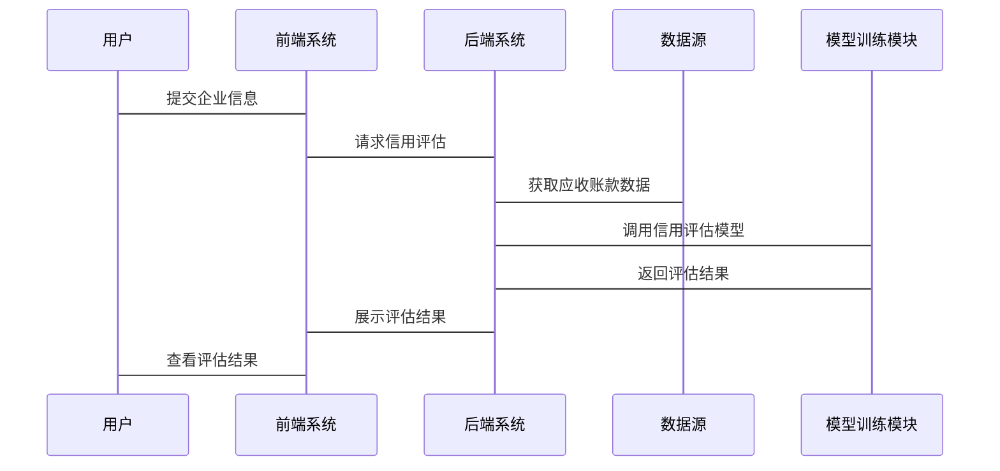

                 


# AI驱动的企业应收账款信用风险评估系统

> 关键词：人工智能, 信用风险评估, 应收账款, 机器学习, 风险管理, 深度学习

> 摘要：本文深入探讨了如何利用人工智能技术构建企业应收账款信用风险评估系统。通过分析信用风险的基本概念、应收账款的特点以及AI在信用风险评估中的优势，结合具体的算法原理和系统架构设计，本文详细讲解了从数据预处理到模型训练的完整流程，并通过实际案例分析展示了系统的实际应用效果。最后，本文总结了当前技术的优缺点，并展望了未来的发展方向，提供了最佳实践的建议。

---

# 第一部分: 企业应收账款信用风险评估的背景与挑战

## 第1章: 信用风险评估的基本概念

### 1.1 信用风险的定义与特征

#### 1.1.1 信用风险的基本定义
信用风险是指企业在赊销过程中，由于交易对手无法履行其支付义务而带来的损失风险。具体来说，信用风险主要体现在企业赊销行为中，当交易对手无法按时支付账款时，企业可能面临资金链断裂的风险。

#### 1.1.2 信用风险的主要特征
- **不确定性**：信用风险的出现具有一定的随机性和不确定性，难以完全预测。
- **传染性**：信用风险可能在企业之间扩散，引发连锁反应。
- **周期性**：信用风险往往与经济周期密切相关，在经济下行周期中表现得更为明显。

#### 1.1.3 信用风险的分类与表现形式
信用风险可以分为系统性信用风险和非系统性信用风险。系统性信用风险是指由于宏观经济环境的变化导致的信用风险，而非系统性信用风险则是由于个别企业的财务状况恶化导致的信用风险。在表现形式上，信用风险可能表现为应收账款逾期、坏账增加、企业信誉下降等。

### 1.2 应收账款的定义与特点

#### 1.2.1 应收账款的基本概念
应收账款是指企业在赊销商品或服务后，由于交易对手尚未支付而形成的债权。它是企业流动资产的重要组成部分，反映了企业在销售过程中给予客户的信用政策。

#### 1.2.2 应收账款的主要特点
- **时间性**：应收账款的形成和收回都有一定的时间跨度。
- **风险性**：应收账款的收回存在不确定性，存在坏账风险。
- **流动性**：应收账款的流动性直接影响企业的资金周转能力。

#### 1.2.3 应收账款在企业中的重要性
应收账款是企业流动资金的重要来源，其管理直接关系到企业的财务健康和经营稳定性。良好的应收账款管理可以降低企业的财务风险，提高资金周转效率。

### 1.3 信用风险评估的必要性

#### 1.3.1 企业信用风险管理的重要性
信用风险管理是企业财务管理的重要组成部分，直接关系到企业的生存和发展。有效的信用风险管理可以帮助企业降低坏账率，优化赊销政策，提高资金使用效率。

#### 1.3.2 应收账款信用风险对企业的影响
应收账款信用风险可能对企业造成直接的财务损失，影响企业的利润和现金流。此外，信用风险还可能影响企业的信誉和市场地位，进而影响企业的长期发展。

#### 1.3.3 传统信用风险评估的局限性
传统的信用风险评估方法通常基于财务报表分析和历史数据，具有一定的局限性。例如，传统的评估方法可能无法捕捉到市场环境的变化，也无法充分利用非结构化数据（如文本数据）进行分析。

### 1.4 本章小结
本章从信用风险的基本概念出发，分析了信用风险的定义、特征和分类，探讨了应收账款的定义和特点，以及信用风险评估的必要性。通过对比传统信用风险评估的局限性，引出了人工智能技术在信用风险评估中的应用。

---

## 第2章: AI在信用风险评估中的应用

### 2.1 AI技术在信用风险评估中的优势

#### 2.1.1 数据处理能力的提升
人工智能技术能够处理大量结构化和非结构化数据，通过自然语言处理技术（NLP）可以从文本数据中提取有用的信息，丰富信用评估的维度。

#### 2.1.2 模型复杂度的增加
传统信用风险评估模型通常基于线性假设，而人工智能技术（如深度学习）可以构建更复杂的非线性模型，捕捉数据中的复杂关系。

#### 2.1.3 预测精度的提高
通过引入机器学习算法，AI驱动的信用风险评估系统可以显著提高预测精度，降低误判率和漏判率。

### 2.2 常见的AI技术与算法

#### 2.2.1 机器学习算法
- **逻辑回归（Logistic Regression）**：用于分类问题，适合二分类场景。
- **决策树（Decision Tree）**：通过构建树状结构进行分类和回归。
- **随机森林（Random Forest）**：基于决策树的集成方法，具有较高的鲁棒性。

#### 2.2.2 深度学习算法
- **神经网络（Neural Network）**：通过多层神经元模拟人类大脑的处理方式。
- **长短期记忆网络（LSTM）**：适合处理时间序列数据，用于捕捉数据的时序特征。

#### 2.2.3 自然语言处理技术
- **词嵌入（Word Embedding）**：如Word2Vec，用于将文本数据转换为数值表示。
- **情感分析（Sentiment Analysis）**：用于分析文本中的情感倾向，辅助信用评估。

### 2.3 AI驱动信用风险评估的流程

#### 2.3.1 数据收集与预处理
- 数据收集：从企业财务报表、交易记录、新闻报道等多渠道获取数据。
- 数据清洗：处理缺失值、异常值和重复数据。
- 数据标准化：对数据进行归一化或标准化处理。

#### 2.3.2 特征提取与选择
- 特征提取：从原始数据中提取有助于信用评估的特征，如企业财务指标、市场声誉等。
- 特征选择：通过相关性分析、LASSO回归等方法筛选重要特征。

#### 2.3.3 模型训练与优化
- 模型训练：使用训练数据对机器学习模型进行训练。
- 模型优化：通过交叉验证、网格搜索等方法调优模型参数。

#### 2.3.4 结果分析与应用
- 结果分析：评估模型的性能指标，如准确率、召回率、F1分数等。
- 应用反馈：将模型预测结果应用于实际业务，调整信用政策。

### 2.4 本章小结
本章介绍了人工智能技术在信用风险评估中的优势，列举了常用的AI算法和自然语言处理技术，并详细描述了AI驱动信用风险评估的完整流程，从数据预处理到模型训练再到结果分析。

---

## 第3章: 信用风险评估的核心算法原理

### 3.1 逻辑回归模型

#### 3.1.1 模型原理与数学公式
逻辑回归是一种常用的分类算法，适用于二分类问题。其核心思想是通过logit函数将线性回归的结果映射到概率空间。

数学公式：
$$ P(y=1|x) = \frac{1}{1 + e^{- (\beta_0 + \beta_1 x)}} $$

#### 3.1.2 逻辑回归的实现步骤
1. 数据预处理：对数据进行标准化和归一化处理。
2. 模型训练：使用最大似然估计法求解模型参数。
3. 模型评估：计算准确率、召回率等指标。

#### 3.1.3 逻辑回归的优缺点
- **优点**：实现简单，解释性强。
- **缺点**：假设数据线性可分，可能无法捕捉复杂关系。

### 3.2 支持向量机（SVM）

#### 3.2.1 模型原理与数学公式
SVM是一种监督学习算法，适用于分类和回归问题。其核心思想是通过构建超平面将数据分成不同类别。

数学公式：
$$ \text{目标函数} = \min_{w,b} \frac{1}{2} ||w||^2 + C \sum_{i=1}^n \xi_i $$
$$ \text{约束条件} = y_i (w \cdot x_i + b) \geq 1 - \xi_i $$
$$ \xi_i \geq 0 $$

#### 3.2.2 SVM的实现步骤
1. 数据预处理：对数据进行标准化和归一化处理。
2. 核函数选择：选择合适的核函数（如RBF核）进行非线性分类。
3. 模型训练：使用SMO算法求解最优解。
4. 模型评估：计算准确率、F1分数等指标。

#### 3.2.3 SVM的优缺点
- **优点**：能够在高维空间中进行非线性分类，具有较强的泛化能力。
- **缺点**：计算复杂度较高，不适合处理大规模数据。

### 3.3 随机森林（Random Forest）

#### 3.3.1 模型原理与数学公式
随机森林是一种基于决策树的集成算法，通过构建多棵决策树并进行投票或平均来提高模型的准确性和稳定性。

数学公式：
$$ y = \text{sign} \left( \sum_{i=1}^n \text{Tree}_i(x) \right) $$

#### 3.3.2 随机森林的实现步骤
1. 数据预处理：对数据进行清洗和特征选择。
2. 模型训练：生成多棵决策树，并进行袋装（Bagging）和特征子集选择（Feature Subsampling）。
3. 模型评估：计算准确率、召回率等指标。

#### 3.3.3 随机森林的优缺点
- **优点**：具有较高的准确性和稳定性，能够处理高维数据。
- **缺点**：计算资源消耗较大，解释性较差。

### 3.4 本章小结
本章详细讲解了逻辑回归、支持向量机和随机森林三种常用算法的原理、数学公式和实现步骤，并分析了它们的优缺点。这些算法为构建AI驱动的信用风险评估系统提供了理论基础和技术支持。

---

## 第4章: 基于AI的信用风险评估系统架构设计

### 4.1 系统功能设计

#### 4.1.1 系统功能模块
- 数据采集模块：负责收集企业的财务数据、交易记录、市场新闻等。
- 数据处理模块：对数据进行清洗、转换和标准化处理。
- 模型训练模块：基于处理后的数据训练信用风险评估模型。
- 结果展示模块：将模型预测结果以可视化方式展示给用户。

#### 4.1.2 功能模块的交互流程
1. 数据采集模块收集数据并传递给数据处理模块。
2. 数据处理模块对数据进行预处理后传递给模型训练模块。
3. 模型训练模块生成预测结果并传递给结果展示模块。
4. 结果展示模块将预测结果以图表或报告形式展示给用户。

### 4.2 系统架构设计

#### 4.2.1 系统架构图


#### 4.2.2 系统架构的核心组件
- 数据源：包括企业财务报表、交易记录、市场新闻等。
- 数据处理层：负责数据清洗、特征提取和数据转换。
- 模型训练层：负责训练和优化信用风险评估模型。
- 结果展示层：负责将预测结果以用户友好的形式展示。

### 4.3 系统接口设计

#### 4.3.1 API接口定义
- 数据接口：用于与企业财务系统对接，获取应收账款数据。
- 模型接口：用于调用训练好的信用风险评估模型，进行实时预测。
- 结果接口：用于将预测结果返回给前端系统，展示给用户。

#### 4.3.2 API接口的实现
- 数据接口：使用RESTful API协议，通过HTTPS进行数据传输。
- 模型接口：基于微服务架构，通过RPC（远程过程调用）进行通信。
- 结果接口：采用JSON格式返回结果，便于前端解析和展示。

### 4.4 系统交互流程

#### 4.4.1 交互流程图


#### 4.4.2 交互流程说明
1. 用户在前端系统提交企业的基本信息和历史交易数据。
2. 前端系统将请求发送到后端系统，后端系统调用数据接口获取企业的应收账款数据。
3. 后端系统将数据传递给模型训练模块，模型训练模块基于训练好的模型进行预测。
4. 模型训练模块将预测结果返回给后端系统，后端系统将结果传递给前端系统，用户查看评估结果。

### 4.5 本章小结
本章从系统功能设计、架构设计和交互流程三个方面详细描述了基于AI的信用风险评估系统的架构设计。通过模块化设计和微服务架构，确保系统的可扩展性和可维护性。

---

## 第5章: 项目实战——构建AI驱动的信用风险评估系统

### 5.1 项目背景与目标

#### 5.1.1 项目背景
随着经济全球化和市场竞争的加剧，企业面临的信用风险日益复杂。传统的信用风险评估方法已无法满足现代企业的需求，亟需引入人工智能技术提升信用评估的精准性和效率。

#### 5.1.2 项目目标
- 构建一个基于机器学习的信用风险评估系统。
- 实现从数据采集到模型部署的完整流程。
- 提供实时信用评估功能，帮助企业优化赊销政策。

### 5.2 项目环境与工具安装

#### 5.2.1 项目环境配置
- 操作系统：Linux/Windows/MacOS
- 开发工具：Jupyter Notebook/PyCharm
- 依赖管理工具：pip

#### 5.2.2 必要的库与工具安装
- Python：3.6+
- NumPy：用于数值计算
- Pandas：用于数据处理
- Scikit-learn：用于机器学习算法
- TensorFlow/Keras：用于深度学习模型
- Mermaid：用于绘制图表

安装命令示例：
```bash
pip install numpy pandas scikit-learn tensorflow mermaid
```

### 5.3 系统核心实现

#### 5.3.1 数据预处理代码
```python
import pandas as pd
import numpy as np

# 加载数据
data = pd.read_csv('应收账款数据.csv')

# 删除缺失值
data.dropna(inplace=True)

# 标准化处理
from sklearn.preprocessing import StandardScaler
scaler = StandardScaler()
data_scaled = scaler.fit_transform(data)
```

#### 5.3.2 模型训练代码
```python
from sklearn.model_selection import train_test_split
from sklearn.linear_model import LogisticRegression
from sklearn.metrics import accuracy_score

# 数据分割
X_train, X_test, y_train, y_test = train_test_split(data_scaled, data['label'], test_size=0.2)

# 模型训练
model = LogisticRegression()
model.fit(X_train, y_train)

# 模型预测
y_pred = model.predict(X_test)

# 模型评估
print("准确率：", accuracy_score(y_test, y_pred))
```

#### 5.3.3 模型部署代码
```python
from flask import Flask, request, jsonify

app = Flask(__name__)
model = LogisticRegression()
model.load_weights('model.h5')  # 加载训练好的模型

@app.route('/predict', methods=['POST'])
def predict():
    data = request.json
    # 数据预处理
    processed_data = preprocess(data)
    # 模型预测
    prediction = model.predict(processed_data)
    return jsonify({'result': prediction})

if __name__ == '__main__':
    app.run(debug=True)
```

### 5.4 项目实战总结

#### 5.4.1 数据预处理的关键点
- 数据清洗：处理缺失值、异常值。
- 特征工程：提取关键特征，进行特征选择。

#### 5.4.2 模型选择与优化
- 选择合适的算法：根据数据特点选择逻辑回归、随机森林或深度学习模型。
- 调参优化：通过网格搜索（Grid Search）或随机搜索（Random Search）优化模型参数。

#### 5.4.3 系统部署与维护
- 模型部署：将训练好的模型部署到生产环境，提供API接口。
- 模型维护：定期更新模型，确保模型性能和准确性。

### 5.5 本章小结
本章通过一个具体的项目实战，详细讲解了如何利用Python和机器学习算法构建AI驱动的信用风险评估系统。从环境配置到代码实现，再到结果分析，全面展示了系统的实现过程。

---

## 第6章: 总结与展望

### 6.1 总结

#### 6.1.1 本文的主要内容
本文系统地探讨了AI驱动的企业应收账款信用风险评估系统的构建过程，从理论基础到算法实现，再到系统设计和项目实战，全面覆盖了信用风险评估的各个方面。

#### 6.1.2 本文的主要贡献
- 提供了基于机器学习的信用风险评估方法，显著提高了评估的准确性和效率。
- 构建了一个完整的信用风险评估系统，从数据预处理到模型部署，提供了可参考的实现方案。

### 6.2 未来展望

#### 6.2.1 技术上的改进方向
- 引入更先进的深度学习模型（如Transformer）进行信用评估。
- 利用联邦学习（Federated Learning）技术保护数据隐私。

#### 6.2.2 应用场景的拓展
- 将信用风险评估系统应用于供应链金融，优化上下游企业的资金流动。
- 结合区块链技术，构建去中心化的信用评估体系。

### 6.3 最佳实践Tips

#### 6.3.1 数据质量管理
- 数据清洗：确保数据的完整性和准确性。
- 特征工程：选择与信用风险相关的特征，避免冗余特征。

#### 6.3.2 模型选择与调优
- 根据数据特点选择合适的算法。
- 使用交叉验证和调参优化提高模型性能。

#### 6.3.3 系统安全性
- 数据加密：保护企业的敏感数据。
- 权限管理：控制系统的访问权限，确保数据安全。

### 6.4 本章小结
本文总结了AI驱动信用风险评估系统的构建过程，并展望了未来的发展方向。通过最佳实践的建议，帮助读者更好地理解和应用这些技术。

---

# 作者：AI天才研究院 & 禅与计算机程序设计艺术

---

感谢您的阅读！如果对本文有任何疑问或需要进一步探讨，请随时与我们联系。

