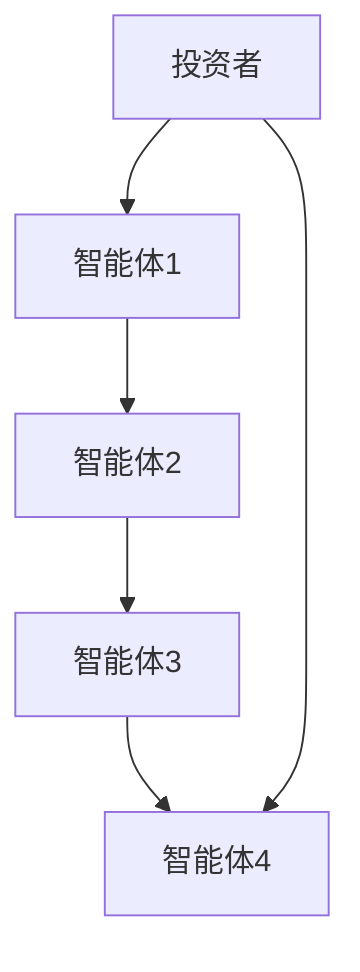

                 


```markdown
# 利用多智能体AI增强价值投资的情景分析能力

> 关键词：多智能体AI，价值投资，情景分析，分布式学习，协作推理

> 摘要：本文探讨了如何利用多智能体人工智能技术来增强价值投资中的情景分析能力。通过分析多智能体AI的核心原理、算法设计以及在价值投资中的应用场景，本文展示了多智能体AI如何通过协作和分布式学习，提升复杂金融市场的分析效率和准确性。文章还结合实际案例，详细讲解了多智能体AI在价值投资中的实现过程，并对未来的发展方向进行了展望。

---

# 第1章: 多智能体AI与价值投资概述

## 1.1 多智能体AI的定义与特点
### 1.1.1 多智能体AI的定义
多智能体AI是指由多个独立但相互协作的智能体组成的系统，每个智能体都有自己的目标、决策能力和知识库。这些智能体通过通信和协作，共同完成复杂任务。

### 1.1.2 多智能体AI的核心特点
- **分布式智能**：任务由多个智能体分担，避免单点故障。
- **协作性**：智能体之间通过通信和协商，协同完成任务。
- **自主性**：每个智能体都能自主决策，适应动态环境。

### 1.1.3 多智能体AI与传统AI的区别
| 特性 | 单智能体AI | 多智能体AI |
|------|------------|------------|
| 结构  | 中央化      | 分布式      |
| 决策  | 单一决策者  | 多决策者协作 |
| 应用场景 | 简单任务    | 复杂任务     |

## 1.2 价值投资的基本概念
### 1.2.1 价值投资的定义
价值投资是一种投资策略，通过分析公司的基本面（如财务状况、盈利能力、管理团队等），寻找市场价格低于其内在价值的股票进行投资。

### 1.2.2 价值投资的核心原则
- **长期视角**：关注长期收益，而非短期波动。
- **安全边际**：购买价格低于内在价值，以降低风险。
- **深度分析**：通过细致的财务和行业分析，识别低估股票。

### 1.2.3 价值投资的场景分析
场景分析是价值投资中的关键步骤，涉及对市场环境、行业趋势、公司基本面等多个因素的综合分析。传统的场景分析依赖人工判断，效率低且易受主观因素影响。

## 1.3 多智能体AI在价值投资中的应用前景
### 1.3.1 多智能体AI在金融领域的潜力
- 提高数据处理效率。
- 实现复杂金融模型的分布式计算。
- 支持实时市场监控和预测。

### 1.3.2 多智能体AI在价值投资中的优势
- **分布式学习**：多个智能体分别学习不同的市场因素，提高分析效率。
- **协作推理**：智能体之间协同推理，提供更全面的分析结果。
- **动态适应**：智能体能够实时调整策略，适应市场变化。

### 1.3.3 多智能体AI应用的挑战与机遇
- **挑战**：通信开销大、协作效率低、系统复杂性高等。
- **机遇**：提升分析深度和广度，发现传统方法难以察觉的投资机会。

---

# 第2章: 多智能体AI的核心概念与联系

## 2.1 多智能体AI的核心原理
### 2.1.1 分布式智能的基本概念
分布式智能是指将智能活动分散到多个独立的智能体中，通过协作完成整体目标。这种架构能够提高系统的容错性和适应性。

### 2.1.2 多智能体协作的机制
- **通信**：智能体之间通过消息传递共享信息。
- **协商**：通过协商确定任务分配和协作方式。
- **协调**：通过协调机制确保各智能体行动一致。

### 2.1.3 多智能体系统的通信与协调
多智能体系统中的通信和协调是实现协作的关键。通信机制定义了智能体之间的信息交换方式，协调机制则确保各智能体的目标一致。

## 2.2 价值投资中的情景分析
### 2.2.1 情景分析的定义与作用
情景分析是通过构建不同的市场假设，评估其对公司价值的影响。在价值投资中，情景分析帮助投资者识别潜在风险和机会。

### 2.2.2 情景分析的关键要素
- **市场假设**：如经济增长、行业趋势等。
- **公司基本面**：如财务状况、竞争优势等。
- **外部因素**：如政策变化、国际局势等。

### 2.2.3 情景分析的复杂性与挑战
情景分析涉及大量复杂因素，传统方法难以全面覆盖。多智能体AI通过分布式学习和协作推理，能够更高效地处理这些复杂因素。

## 2.3 多智能体AI与情景分析的关系
### 2.3.1 多智能体AI如何增强情景分析能力
- **分布式学习**：每个智能体专注于特定市场因素，提高分析效率。
- **协作推理**：智能体之间协同推理，提供更全面的分析结果。
- **动态适应**：智能体能够实时调整分析模型，适应市场变化。

### 2.3.2 多智能体AI在情景分析中的角色
- **数据收集**：智能体负责收集和处理不同来源的数据。
- **模型构建**：智能体协作构建复杂的情景分析模型。
- **结果输出**：智能体协同生成分析报告，提供投资建议。

### 2.3.3 多智能体AI与情景分析的结合方式
- **模块化设计**：将情景分析的不同环节分配给不同的智能体。
- **协同优化**：通过协作优化分析过程，提高效率和准确性。

## 2.4 本章小结
通过本章的介绍，我们了解了多智能体AI的核心原理，以及它在价值投资情景分析中的应用。多智能体AI通过分布式学习和协作推理，能够显著提高情景分析的效率和准确性。

---

# 第3章: 多智能体AI的算法原理

## 3.1 多智能体AI的算法概述
### 3.1.1 分布式学习的基本原理
分布式学习是指多个智能体分别在局部数据上进行学习，然后通过通信共享模型参数。这种机制能够提高学习效率和模型鲁棒性。

### 3.1.2 多智能体协作算法框架
多智能体协作算法通常包括以下几个步骤：
1. 初始化：设置智能体的初始参数和目标。
2. 通信：智能体之间交换信息和数据。
3. 协作推理：基于共享信息进行推理和决策。
4. 行动：智能体根据推理结果采取行动。
5. 评估：评估行动效果，调整参数和策略。

### 3.1.3 多智能体系统的优化算法
多智能体系统的优化算法通常采用分布式优化方法，如分布式梯度下降。通过智能体之间的协作，优化全局目标函数。

## 3.2 多智能体AI的核心算法
### 3.2.1 分布式强化学习算法
分布式强化学习是一种多智能体协作学习方法，通过智能体之间的协作和竞争，优化整体策略。常用算法包括：
- **分布式近端政策优化（DPO）**
- **异步优势_actor-critic（A3C）**

### 3.2.2 多智能体协作推理算法
协作推理算法通过智能体之间的推理协作，生成更准确的分析结果。常用算法包括：
- **分布式贝叶斯推理**
- **协作图模型推理**

### 3.2.3 多智能体通信协议
多智能体系统需要高效的通信协议来支持智能体之间的信息交换。常用协议包括：
- **Gossip协议**
- **广播协议**

## 3.3 算法的数学模型与公式
### 3.3.1 分布式学习的数学模型
$$ L = \frac{1}{N}\sum_{i=1}^{N}L_i $$
其中，$L$ 是总体损失函数，$L_i$ 是第 $i$ 个智能体的损失函数，$N$ 是智能体的数量。

### 3.3.2 多智能体协作的优化公式
$$ \theta_{i} = \theta_{i} - \eta \nabla_{\theta_{i}} J(\theta) $$
其中，$\theta_{i}$ 是第 $i$ 个智能体的参数，$\eta$ 是学习率，$J(\theta)$ 是整体目标函数。

## 3.4 本章小结
通过本章的介绍，我们了解了多智能体AI的核心算法，包括分布式学习、协作推理和通信协议。这些算法为多智能体AI在价值投资中的应用提供了理论基础。

---

# 第4章: 多智能体AI在价值投资中的应用

## 4.1 价值投资情景分析的复杂性
### 4.1.1 传统情景分析的局限性
传统情景分析依赖人工判断，效率低且容易受主观因素影响。

### 4.1.2 价值投资情景分析的复杂性
价值投资情景分析需要考虑多种复杂因素，如市场趋势、公司基本面、行业动态等。

### 4.1.3 传统方法的不足
传统方法难以高效处理复杂因素，容易遗漏重要信息。

## 4.2 多智能体AI在情景分析中的应用
### 4.2.1 分布式学习的应用
通过分布式学习，多个智能体分别分析不同的市场因素，提高分析效率。

### 4.2.2 协作推理的应用
智能体之间通过协作推理，生成更全面的分析结果。

### 4.2.3 动态适应的应用
智能体能够实时调整分析模型，适应市场变化。

## 4.3 多智能体AI的应用案例
### 4.3.1 案例背景
某投资机构利用多智能体AI进行价值投资情景分析，智能体分别负责分析财务数据、市场趋势、行业动态等。

### 4.3.2 实施过程
1. 初始化：设置智能体的初始参数和目标。
2. 通信：智能体之间交换信息和数据。
3. 协作推理：基于共享信息进行推理和决策。
4. 行动：智能体根据推理结果采取行动。
5. 评估：评估行动效果，调整参数和策略。

### 4.3.3 实施效果
通过多智能体AI的应用，该机构的分析效率和准确性显著提高，投资收益明显提升。

## 4.4 本章小结
通过本章的介绍，我们了解了多智能体AI在价值投资情景分析中的应用，包括分布式学习、协作推理和动态适应。这些方法能够显著提高情景分析的效率和准确性。

---

# 第5章: 多智能体AI系统的架构设计

## 5.1 系统架构设计
### 5.1.1 系统功能设计
多智能体AI系统需要具备以下功能：
- 数据采集与处理
- 分布式学习与推理
- 协作决策与行动
- 实时监控与调整

### 5.1.2 系统架构图


### 5.1.3 系统模块划分
系统模块包括：
- 数据采集模块：负责收集市场数据。
- 分布式学习模块：负责智能体的学习和推理。
- 协作决策模块：负责智能体之间的协作决策。
- 实时监控模块：负责系统的实时监控和调整。

## 5.2 系统实现
### 5.2.1 环境安装
需要安装以下工具和库：
- Python
- TensorFlow
- Keras
- Multi-Agent Frameworks（如MADRL）

### 5.2.2 系统核心实现
以下是系统的核心代码示例：
```python
import numpy as np
import tensorflow as tf

class Agent:
    def __init__(self, state_size, action_size):
        self.state_size = state_size
        self.action_size = action_size
        self.model = self.build_model()

    def build_model(self):
        model = tf.keras.Sequential()
        model.add(tf.keras.layers.Dense(64, activation='relu', input_dim=self.state_size))
        model.add(tf.keras.layers.Dense(self.action_size, activation='linear'))
        model.compile(optimizer='adam', loss='mse')
        return model

    def act(self, state):
        prediction = self.model.predict(np.array([state]))[0]
        return np.argmax(prediction)

# 初始化智能体
state_size = 10
action_size = 4
agent = Agent(state_size, action_size)

# 智能体行动
state = np.random.randn(state_size)
action = agent.act(state)
print("Action:", action)
```

### 5.2.3 系统功能实现
系统功能包括：
- 数据采集与处理：智能体收集和处理市场数据。
- 分布式学习：智能体在局部数据上进行学习。
- 协作推理：智能体之间协作推理，生成分析结果。
- 实时监控：系统实时监控市场变化，调整分析策略。

## 5.3 本章小结
通过本章的介绍，我们了解了多智能体AI系统的架构设计和实现过程。系统通过分布式学习和协作推理，能够高效地进行价值投资情景分析。

---

# 第6章: 项目实战

## 6.1 项目背景
### 6.1.1 项目目标
通过多智能体AI技术，实现价值投资情景分析。

### 6.1.2 项目需求
- 数据采集与处理
- 分布式学习与推理
- 协作决策与行动
- 实时监控与调整

## 6.2 核心代码实现
以下是项目的核心代码示例：
```python
import numpy as np
import tensorflow as tf

class Agent:
    def __init__(self, state_size, action_size):
        self.state_size = state_size
        self.action_size = action_size
        self.model = self.build_model()

    def build_model(self):
        model = tf.keras.Sequential()
        model.add(tf.keras.layers.Dense(64, activation='relu', input_dim=self.state_size))
        model.add(tf.keras.layers.Dense(self.action_size, activation='linear'))
        model.compile(optimizer='adam', loss='mse')
        return model

    def act(self, state):
        prediction = self.model.predict(np.array([state]))[0]
        return np.argmax(prediction)

# 初始化智能体
state_size = 10
action_size = 4
agent = Agent(state_size, action_size)

# 智能体行动
state = np.random.randn(state_size)
action = agent.act(state)
print("Action:", action)
```

### 6.2.1 代码解读
- **Agent类**：定义智能体的基本结构，包括模型构建和动作选择。
- **build_model方法**：构建神经网络模型，用于分布式学习。
- **act方法**：根据当前状态，选择最优动作。

## 6.3 案例分析
### 6.3.1 案例背景
假设我们有多个智能体，分别负责分析不同的市场因素。

### 6.3.2 实施过程
1. 初始化智能体。
2. 智能体收集市场数据。
3. 智能体进行分布式学习。
4. 智能体协作推理，生成分析结果。
5. 根据分析结果，进行投资决策。

### 6.3.3 分析结果
通过多智能体AI的应用，分析结果更加全面和准确，投资决策更加科学。

## 6.4 项目总结
通过本章的项目实战，我们了解了多智能体AI在价值投资情景分析中的具体实现过程。项目通过分布式学习和协作推理，显著提高了分析效率和准确性。

---

# 第7章: 结论与展望

## 7.1 结论
通过本文的介绍，我们了解了多智能体AI在价值投资情景分析中的应用。多智能体AI通过分布式学习和协作推理，能够高效地处理复杂因素，显著提高分析效率和准确性。

## 7.2 未来展望
未来，多智能体AI在价值投资中的应用将更加广泛和深入。随着技术的不断发展，多智能体AI将在更多领域发挥重要作用。

---

# 作者：AI天才研究院/AI Genius Institute & 禅与计算机程序设计艺术 /Zen And The Art of Computer Programming
```

