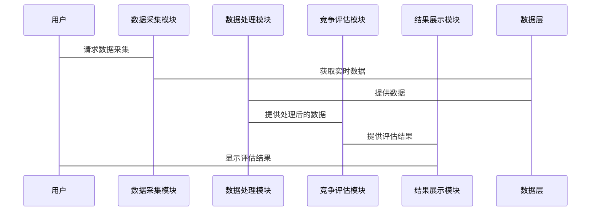

                 


# 利用多智能体AI实现动态竞争格局评估

> **关键词**：多智能体AI、动态竞争格局、竞争态势评估、博弈论、分布式计算、系统架构设计  
> 
> **摘要**：  
> 本文旨在探讨如何利用多智能体人工智能技术实现动态竞争格局的实时评估。通过分析多智能体系统的核心原理、博弈论模型、动态数据处理机制以及系统架构设计，本文提出了一个基于多智能体AI的动态竞争格局评估系统。该系统能够实时分析复杂竞争环境中的多主体行为，预测竞争态势的变化，并为企业制定竞争策略提供数据支持。

---

# 第一部分: 多智能体AI与动态竞争格局评估的背景与概念

## 第1章: 多智能体AI与动态竞争格局评估的背景与概念

### 1.1 多智能体AI的基本概念

#### 1.1.1 多智能体系统的定义与特点
多智能体系统（Multi-Agent System, MAS）是由多个具有自主性、反应性、协作性和社会性的智能体组成的复杂系统。与单一智能体相比，多智能体系统能够通过智能体之间的协作实现更复杂的任务。

- **自主性**：智能体能够自主决策，无需外部干预。
- **反应性**：智能体能够感知环境并实时响应。
- **协作性**：智能体之间通过通信和协作完成共同目标。
- **社会性**：智能体之间存在社会互动，可能涉及竞争与合作。

#### 1.1.2 多智能体系统的核心要素
- **智能体**：系统的最小功能单元，具有感知、决策和行动能力。
- **通信机制**：智能体之间通过消息传递进行协作。
- **协作协议**：定义智能体之间的协作规则和任务分配。
- **环境模型**：描述智能体所处的外部环境和目标。

#### 1.1.3 多智能体AI的应用场景
- **分布式任务分配**：例如物流系统中多个智能体协同完成货物配送。
- **复杂环境决策**：例如自动驾驶中多个车辆协同决策。
- **动态竞争分析**：例如企业竞争分析中多个市场参与者行为的实时评估。

### 1.2 动态竞争格局评估的背景与意义

#### 1.2.1 竞争格局评估的基本概念
竞争格局评估是对市场中各竞争主体的行为、资源、优势和劣势进行分析，以了解市场动态和竞争态势。

- **静态竞争分析**：分析市场结构、市场份额等静态指标。
- **动态竞争分析**：实时跟踪市场变化，预测未来竞争趋势。

#### 1.2.2 动态竞争格局的定义与特征
动态竞争格局是指在竞争环境中，由于各参与者的实时行为变化而导致的竞争态势的变化。其主要特征包括：

- **实时性**：竞争态势需要实时更新。
- **动态性**：竞争环境中的变量不断变化。
- **复杂性**：涉及多个竞争主体的交互作用。

#### 1.2.3 多智能体AI在竞争格局评估中的作用
多智能体AI能够通过实时感知、分析和预测多个竞争主体的行为，提供动态竞争格局的评估支持。

- **实时数据处理**：多智能体AI能够快速处理实时数据，更新竞争态势。
- **协作决策**：多个智能体协同工作，提供全面的竞争分析。
- **预测能力**：基于历史数据和博弈论模型，预测未来竞争趋势。

### 1.3 多智能体AI与动态竞争格局评估的关系

#### 1.3.1 多智能体AI如何支持竞争格局评估
多智能体AI通过以下方式支持动态竞争格局评估：

- **分布式计算**：多智能体系统能够并行处理大量数据，提高计算效率。
- **协作决策**：多个智能体协同分析，提供全面的竞争分析。
- **实时反馈**：智能体能够实时感知环境变化，快速调整分析结果。

#### 1.3.2 动态竞争格局评估的核心问题
动态竞争格局评估的核心问题包括：

- **数据实时性**：如何实时获取和处理竞争环境中的动态数据。
- **多主体行为预测**：如何预测多个竞争主体的实时行为。
- **系统自适应性**：如何根据环境变化动态调整评估模型。

#### 1.3.3 系统边界与外延
动态竞争格局评估系统的边界包括：

- **输入**：竞争环境中的实时数据，如市场数据、企业行为数据等。
- **输出**：动态竞争态势的评估结果，如市场份额预测、竞争风险预警等。
- **外延**：系统可以扩展到更多领域，如金融市场的动态分析、军事对抗的实时评估等。

### 1.4 本章小结
本章介绍了多智能体AI的基本概念和动态竞争格局评估的背景与意义。通过分析多智能体系统的定义、核心要素和应用场景，我们理解了多智能体AI在动态竞争分析中的重要作用。同时，我们明确了动态竞争格局评估的核心问题和系统边界，为后续章节的分析奠定了基础。

---

# 第二部分: 多智能体AI的核心概念与原理

## 第2章: 多智能体系统的核心原理

### 2.1 多智能体系统的组成与架构

#### 2.1.1 多智能体系统的组成要素
多智能体系统由以下要素组成：

- **智能体**：系统的功能单元，具有自主决策能力。
- **通信机制**：智能体之间的信息交互方式。
- **协作协议**：定义智能体之间的协作规则。
- **环境模型**：描述智能体所处的外部环境。

#### 2.1.2 多智能体系统的通信机制
智能体之间的通信机制包括：

- **消息传递**：智能体通过发送消息进行信息交换。
- **广播机制**：多个智能体同时接收同一消息。
- **点对点通信**：两个智能体之间的直接通信。

#### 2.1.3 多智能体系统的协作模型
协作模型是多智能体系统的核心，主要类型包括：

- **任务分配模型**：将任务分配给不同的智能体，每个智能体负责一部分任务。
- **分布式决策模型**：多个智能体共同参与决策过程。
- **社会网络模型**：智能体之间的协作基于社会网络关系。

### 2.2 动态竞争格局评估的核心要素

#### 2.2.1 评估指标体系的构建
动态竞争格局评估的核心指标包括：

- **市场份额**：各竞争主体在市场中的份额占比。
- **竞争强度**：市场竞争的激烈程度。
- **竞争风险**：潜在的竞争风险和威胁。

#### 2.2.2 动态数据的采集与处理
动态数据的采集与处理包括：

- **实时数据采集**：通过传感器、数据库等获取实时数据。
- **数据清洗**：去除噪声数据，确保数据质量。
- **数据融合**：将多个数据源的数据进行融合，提供全面的分析结果。

#### 2.2.3 竞争态势的实时更新机制
竞争态势的实时更新机制包括：

- **实时数据流处理**：对实时数据流进行分析，更新竞争态势。
- **动态模型调整**：根据环境变化调整评估模型。
- **反馈机制**：根据分析结果反馈调整数据采集和处理策略。

### 2.3 多智能体AI与动态竞争格局评估的关联

#### 2.3.1 多智能体AI的决策机制
多智能体AI的决策机制包括：

- **分布式决策**：多个智能体共同参与决策过程。
- **博弈论模型**：基于博弈论的决策优化。
- **实时反馈**：根据环境变化实时调整决策。

#### 2.3.2 动态竞争格局的实时分析
动态竞争格局的实时分析包括：

- **实时数据分析**：对实时数据进行分析，提供动态竞争态势。
- **竞争行为预测**：基于历史数据和博弈论模型预测未来竞争行为。
- **风险预警**：根据分析结果提供竞争风险预警。

#### 2.3.3 系统的自适应能力
多智能体AI系统的自适应能力包括：

- **动态调整**：根据环境变化动态调整系统参数。
- **自我修复**：系统能够自动修复故障，保证系统的稳定运行。
- **学习能力**：系统能够通过机器学习不断优化自身的分析能力。

### 2.4 本章小结
本章详细介绍了多智能体系统的核心原理和动态竞争格局评估的核心要素。通过分析多智能体系统的组成与协作模型，我们理解了多智能体AI在动态竞争分析中的技术基础。同时，我们探讨了动态数据的采集与处理、竞争态势的实时更新机制以及系统的自适应能力，为后续章节的算法实现奠定了理论基础。

---

# 第三部分: 多智能体AI的算法原理与数学模型

## 第3章: 多智能体协作算法

### 3.1 分布式计算与多智能体协作

#### 3.1.1 分布式计算的基本原理
分布式计算是将任务分解成多个部分，分别在不同的计算节点上执行。多智能体协作算法基于分布式计算的思想，通过多个智能体协同完成任务。

#### 3.1.2 多智能体协作的算法框架
多智能体协作的算法框架包括：

- **任务分解**：将整体任务分解成多个子任务。
- **任务分配**：将子任务分配给不同的智能体。
- **协作执行**：智能体协同执行分配的任务。
- **结果汇总**：将各智能体的执行结果汇总，得到最终结果。

#### 3.1.3 分布式计算在动态竞争评估中的应用
在动态竞争评估中，分布式计算可以应用于以下几个方面：

- **数据采集**：多个智能体分别采集不同来源的数据。
- **数据处理**：多个智能体协同处理数据，提高处理效率。
- **结果分析**：多个智能体协同分析数据，提供全面的竞争评估结果。

### 3.2 博弈论模型与多智能体决策

#### 3.2.1 博弈论的基本概念
博弈论是研究多个主体在竞争环境中的策略选择和行为的理论。主要概念包括：

- **玩家**：参与博弈的主体。
- **策略**：玩家在博弈中的行为选择。
- **收益**：玩家在博弈中的收益或损失。
- **纳什均衡**：博弈中的稳定状态，即没有任何玩家能够通过单方面改变策略而获得更高收益。

#### 3.2.2 多智能体博弈模型的构建
多智能体博弈模型的构建包括：

- **玩家定义**：定义参与博弈的主体。
- **策略空间**：定义每个玩家的策略选择范围。
- **收益函数**：定义每个玩家在不同策略组合下的收益。
- **博弈规则**：定义博弈的进行规则，如轮次、信息传递等。

#### 3.2.3 博弈论在竞争格局评估中的应用
在动态竞争格局评估中，博弈论可以应用于以下几个方面：

- **竞争行为预测**：通过分析各竞争主体的策略选择，预测其未来行为。
- **收益分析**：分析各竞争主体在不同策略下的收益情况，评估其竞争优势。
- **纳什均衡分析**：分析竞争环境中的稳定状态，预测竞争格局的变化趋势。

### 3.3 多智能体AI的数学模型

#### 3.3.1 竞争态势评估的数学模型
竞争态势评估的数学模型可以表示为：

$$
S = \sum_{i=1}^{n} w_i x_i
$$

其中，\( S \) 表示竞争态势指数，\( w_i \) 表示各评估指标的权重，\( x_i \) 表示各评估指标的值。

#### 3.3.2 多智能体协作的优化算法
多智能体协作的优化算法可以采用遗传算法或粒子群优化算法。以遗传算法为例，其基本步骤如下：

1. **初始化**：生成初始种群。
2. **适应度评估**：评估每个个体的适应度。
3. **选择**：选择适应度较高的个体进行繁殖。
4. **交叉**：对选中的个体进行基因交叉，生成新个体。
5. **变异**：对新个体进行基因变异，增加种群的多样性。
6. **重复**：重复上述步骤，直到满足终止条件。

#### 3.3.3 动态竞争格局的预测模型
动态竞争格局的预测模型可以采用时间序列分析或机器学习模型。以时间序列分析为例，其基本步骤如下：

1. **数据采集**：采集历史竞争数据。
2. **数据预处理**：对数据进行平滑、差分等预处理。
3. **模型选择**：选择合适的时间序列模型，如ARIMA。
4. **模型训练**：对模型进行训练，得到模型参数。
5. **预测**：利用模型对未来的竞争格局进行预测。

### 3.4 本章小结
本章详细介绍了多智能体协作算法的基本原理和博弈论模型在动态竞争格局评估中的应用。通过分析分布式计算、博弈论模型和数学模型，我们理解了多智能体AI在动态竞争分析中的技术实现。同时，我们探讨了数学模型的构建和优化算法的应用，为后续章节的系统实现奠定了理论基础。

---

# 第四部分: 系统架构与实现

## 第4章: 系统架构设计

### 4.1 系统功能模块划分

#### 4.1.1 数据采集模块
数据采集模块负责采集竞争环境中的实时数据，包括：

- **市场数据**：如市场份额、价格数据等。
- **企业行为数据**：如企业战略调整、投资动向等。
- **外部环境数据**：如政策变化、行业趋势等。

#### 4.1.2 数据处理模块
数据处理模块负责对采集的数据进行清洗、融合和转换，确保数据的准确性和一致性。

#### 4.1.3 竞争评估模块
竞争评估模块负责基于处理后的数据，利用多智能体AI算法进行竞争态势评估，输出动态竞争格局的评估结果。

#### 4.1.4 结果展示模块
结果展示模块负责将评估结果以可视化的方式展示给用户，便于用户理解和分析。

### 4.2 系统架构设计

#### 4.2.1 分层架构设计
系统架构采用分层设计，包括数据层、计算层和应用层。

- **数据层**：负责数据的采集和存储。
- **计算层**：负责数据的处理和分析。
- **应用层**：负责结果的展示和用户交互。

#### 4.2.2 模块间的交互关系
模块间的交互关系如下：

1. 数据采集模块向数据层提供实时数据。
2. 数据处理模块从数据层获取数据，进行清洗和融合。
3. 竞争评估模块从数据处理模块获取数据，进行竞争态势评估。
4. 结果展示模块从竞争评估模块获取评估结果，以可视化的方式展示给用户。

#### 4.2.3 系统的可扩展性设计
系统的可扩展性设计包括：

- **模块化设计**：各模块独立开发，便于后续扩展。
- **接口标准化**：模块间通过标准化接口进行通信，便于功能扩展。
- **分布式部署**：系统可以分布式部署，提高系统的计算能力和稳定性。

### 4.3 系统接口设计

#### 4.3.1 数据接口
数据接口负责与外部数据源进行数据交换，包括：

- **数据输入接口**：接收外部数据源的数据。
- **数据输出接口**：将处理后的数据输出给其他模块。

#### 4.3.2 用户接口
用户接口负责与用户的交互，包括：

- **输入界面**：用户输入参数和指令。
- **输出界面**：显示系统输出的结果和报告。

#### 4.3.3 系统内部接口
系统内部接口负责模块间的通信，包括：

- **模块间通信接口**：模块间通过消息传递进行通信。
- **事件驱动接口**：系统通过事件驱动机制进行协调。

### 4.4 系统交互流程设计

#### 4.4.1 交互流程图
以下是系统交互流程的Mermaid序列图：



### 4.5 本章小结
本章详细介绍了系统的功能模块划分和架构设计。通过分析系统的分层架构和模块间的交互关系，我们理解了多智能体AI系统的实现方式。同时，我们探讨了系统的可扩展性设计和交互流程，为后续章节的系统实现奠定了基础。

---

# 第五部分: 项目实战与应用

## 第5章: 项目实战

### 5.1 环境安装与配置

#### 5.1.1 系统需求
- **操作系统**：Windows 10或更高版本，Linux Ubuntu 18.04或更高版本。
- **编程语言**：Python 3.6或更高版本。
- **框架与库**：NumPy、Pandas、Matplotlib、Flask等。

#### 5.1.2 安装步骤
1. 安装Python和pip。
2. 安装所需的第三方库：
   ```
   pip install numpy pandas matplotlib flask
   ```

### 5.2 核心代码实现

#### 5.2.1 数据采集模块
以下是数据采集模块的Python代码示例：

```python
import requests
import json

def fetch_data(api_url):
    try:
        response = requests.get(api_url)
        data = response.json()
        return data
    except requests.exceptions.RequestException as e:
        print(f"Error fetching data: {e}")
        return None
```

#### 5.2.2 数据处理模块
以下是数据处理模块的Python代码示例：

```python
import pandas as pd

def process_data(data):
    df = pd.DataFrame(data)
    # 数据清洗
    df.dropna(inplace=True)
    # 数据转换
    df['timestamp'] = pd.to_datetime(df['timestamp'])
    return df
```

#### 5.2.3 竞争评估模块
以下是竞争评估模块的Python代码示例：

```python
import numpy as np

def competitive_assessment(data):
    # 计算市场份额
    market_share = data['market_share'].mean()
    # 计算竞争强度
    competition_intensity = np.std(data['market_share'])
    return {
        'market_share': market_share,
        'competition_intensity': competition_intensity
    }
```

#### 5.2.4 结果展示模块
以下是结果展示模块的Python代码示例：

```python
from flask import Flask, render_template

app = Flask(__name__)

@app.route('/')
def index():
    return render_template('index.html')

if __name__ == '__main__':
    app.run(debug=True)
```

### 5.3 案例分析与实际应用

#### 5.3.1 案例分析
假设我们有一个竞争环境，包含三个竞争主体：A、B和C。我们需要评估它们在市场中的竞争态势。

1. 数据采集模块从外部数据源获取实时数据。
2. 数据处理模块对数据进行清洗和转换。
3. 竞争评估模块基于处理后的数据，计算市场份额和竞争强度。
4. 结果展示模块将评估结果以可视化的方式展示给用户。

#### 5.3.2 实际应用
在实际应用中，动态竞争格局评估系统可以应用于多个领域：

- **市场营销**：帮助企业制定市场策略。
- **金融投资**：帮助投资者评估投资风险。
- **军事对抗**：帮助指挥员制定作战策略。

### 5.4 项目小结
本章通过实际案例展示了多智能体AI在动态竞争格局评估中的应用。通过项目的实施，我们理解了系统实现的步骤和关键点。同时，我们探讨了系统的实际应用，为后续章节的拓展阅读奠定了基础。

---

# 第六部分: 最佳实践与总结

## 第6章: 最佳实践与总结

### 6.1 最佳实践

#### 6.1.1 系统设计
- **模块化设计**：确保系统的可扩展性和可维护性。
- **标准化接口**：确保模块间的通信高效可靠。
- **分布式部署**：提高系统的计算能力和稳定性。

#### 6.1.2 算法优化
- **分布式计算**：提高系统的计算效率。
- **博弈论模型**：提高竞争态势评估的准确性。
- **机器学习**：提高系统的自适应能力和学习能力。

### 6.2 小结
通过本文的探讨，我们理解了多智能体AI在动态竞争格局评估中的重要作用。通过系统的实现和项目的实施，我们掌握了多智能体AI的核心技术和应用方法。同时，我们总结了系统的最佳实践，为后续的研究和应用提供了宝贵的参考。

### 6.3 注意事项

#### 6.3.1 数据质量
- 数据质量直接影响评估结果的准确性，需确保数据的准确性和完整性。

#### 6.3.2 系统安全
- 系统的安全性是系统稳定运行的重要保障，需采取有效的安全措施。

#### 6.3.3 系统维护
- 系统的维护是系统长期运行的重要保障，需定期进行系统维护和更新。

### 6.4 拓展阅读

#### 6.4.1 多智能体系统
- 推荐阅读《Multi-Agent Systems: Complexity, Decentralization, and Adapt性》。

#### 6.4.2 动态竞争分析
- 推荐阅读《Dynamic Competitive Analysis: A Multi-Agent Approach》。

#### 6.4.3 机器学习与博弈论
- 推荐阅读《Game Theory and Machine Learning》。

---

# 作者

**作者：AI天才研究院/AI Genius Institute & 禅与计算机程序设计艺术/Zen And The Art of Computer Programming**

---

这篇文章详细介绍了利用多智能体AI实现动态竞争格局评估的核心概念、算法原理和系统实现。通过系统的分析和实际案例的展示，我们理解了多智能体AI在动态竞争分析中的重要作用。同时，我们总结了系统的最佳实践，为后续的研究和应用提供了宝贵的参考。

