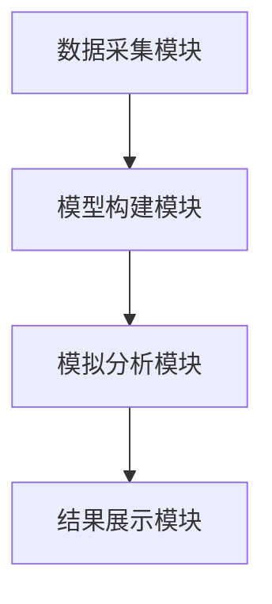
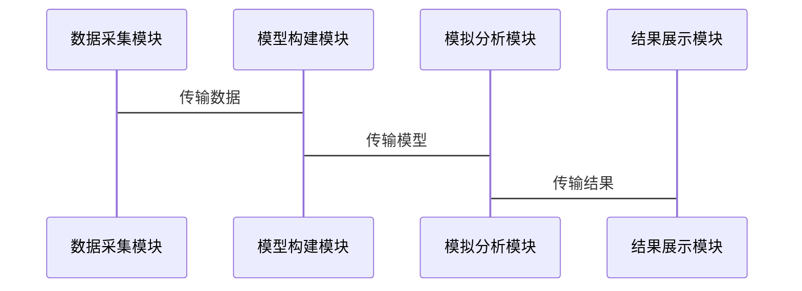

                 


# 多智能体系统在全球经济政策不确定性评估中的应用

## 关键词：多智能体系统、全球经济政策、不确定性评估、博弈论、系统动力学、分布式计算

## 摘要：  
随着全球化和经济复杂性的增加，全球经济政策的不确定性评估变得日益重要。本文探讨了多智能体系统（Multi-Agent Systems, MAS）在全球经济政策不确定性评估中的应用。通过分析MAS的基本概念、理论基础及其在经济政策中的具体应用，本文提出了一种基于MAS的经济政策不确定性评估模型。该模型结合了博弈论、系统动力学和分布式计算等方法，能够有效捕捉和分析经济系统中的复杂交互关系。文章详细阐述了MAS在经济政策不确定性评估中的优势，包括提高模型的动态性和实时性，增强系统的适应性和协作能力。通过实际案例分析，本文展示了MAS在经济政策评估中的实际应用价值，并提出了未来研究的方向。

---

# 第一部分: 多智能体系统概述

## 第1章: 多智能体系统的基本概念

### 1.1 多智能体系统的定义与特点

#### 1.1.1 多智能体系统的定义  
多智能体系统（Multi-Agent Systems, MAS）是由多个智能体（Agent）组成的复杂系统。智能体是指能够感知环境、自主决策并采取行动的实体。MAS的核心在于智能体之间的交互与协作，以实现共同目标或复杂任务。

#### 1.1.2 多智能体系统的核心特点  
- **分布式性**：智能体分布在不同的空间或计算资源中，不存在集中控制中心。  
- **自主性**：每个智能体都具有自主决策的能力，能够独立完成任务。  
- **协作性**：智能体通过通信与协作，共同完成复杂任务。  
- **动态性**：系统环境和智能体状态可能随时间动态变化。  

#### 1.1.3 多智能体系统与单智能体系统的区别  
| 特性 | 单智能体系统 | 多智能体系统 |  
|------|--------------|--------------|  
| 结构 | 单一中心 | 分布式结构 |  
| 决策 | 中央决策 | 分布式决策 |  
| 交互 | 无 | 智能体间交互 |  

---

### 1.2 多智能体系统的组成与结构

#### 1.2.1 智能体的基本组成  
智能体由以下四个核心部分组成：  
1. **感知器（Perceptor）**：感知环境状态。  
2. **推理器（Reasoner）**：处理感知信息并做出决策。  
3. **行动器（Actuator）**：执行决策动作。  
4. **通信器（Communicator）**：与其他智能体交换信息。  

#### 1.2.2 多智能体系统的层次结构  
MAS的层次结构通常包括：  
1. **物理层**：智能体的物理实现，如传感器和执行器。  
2. **逻辑层**：智能体的逻辑推理和决策过程。  
3. **通信层**：智能体之间的信息交换机制。  

#### 1.2.3 多智能体系统的通信机制  
- **同步通信**：智能体之间实时交换信息。  
- **异步通信**：智能体在需要时才交换信息。  
- **基于消息的通信**：通过消息传递实现协作。  

---

### 1.3 多智能体系统的应用领域

#### 1.3.1 人工智能与机器人  
MAS在机器人协作、自动驾驶等领域有广泛应用。  

#### 1.3.2 分布式计算与网络  
MAS用于分布式系统中的资源分配和任务调度。  

#### 1.3.3 经济学与社会学中的应用  
MAS模拟经济市场中的多方交互，如股票交易、供应链管理等。  

---

## 第2章: 多智能体系统的理论基础

### 2.1 多智能体系统的理论框架

#### 2.1.1 代理理论  
代理理论研究智能体的行为动机和决策机制，是MAS的理论基础之一。  

#### 2.1.2 博弈论基础  
博弈论研究智能体之间的策略互动，为MAS的协作机制提供了理论支持。  

#### 2.1.3 系统动力学  
系统动力学研究系统内部的动态关系，帮助理解MAS的演化过程。  

---

### 2.2 多智能体系统的协作机制

#### 2.2.1 协作的定义与分类  
- **协作定义**：智能体通过合作实现共同目标。  
- **协作分类**：基于任务需求可分为竞争协作、合作协作等。  

#### 2.2.2 协作协议的设计  
- **协商协议**：智能体之间通过协商确定任务分配。  
- **承诺协议**：智能体承诺完成特定任务。  

#### 2.2.3 协作中的冲突与解决  
- **冲突来源**：资源分配、利益冲突等。  
- **解决方法**：基于博弈论的均衡解，如纳什均衡。  

---

### 2.3 多智能体系统的通信与信息交换

#### 2.3.1 通信协议的选择  
- **同步协议**：适用于实时性要求高的场景。  
- **异步协议**：适用于非实时场景。  

#### 2.3.2 信息表示与交换标准  
- **知识表示**：使用逻辑推理或语义网络表示信息。  
- **信息交换**：通过消息队列或发布-订阅模型实现。  

#### 2.3.3 通信中的安全问题  
- **身份认证**：确保通信双方的身份真实性。  
- **数据加密**：保护通信数据的安全性。  

---

# 第二部分: 全球经济政策不确定性分析

## 第3章: 经济政策不确定性的基本概念

### 3.1 经济政策的定义与分类

#### 3.1.1 财政政策  
财政政策通过政府支出和税收调节经济运行。  

#### 3.1.2 货币政策  
货币政策通过央行调节货币供应量和利率水平。  

#### 3.1.3 贸易政策  
贸易政策涉及关税、贸易壁垒等，影响国际贸易流动。  

---

### 3.2 经济政策不确定性的来源

#### 3.2.1 政治因素  
政策制定者的变动可能导致政策不确定性。  

#### 3.2.2 经济周期  
经济波动周期性变化影响政策效果。  

#### 3.2.3 全球化与国际关系  
全球化背景下，国际经济政策的相互影响增加不确定性。  

---

### 3.3 经济政策不确定性的度量方法

#### 3.3.1 概率分布模型  
通过概率分布描述政策变量的不确定性。  

#### 3.3.2 方差与标准差分析  
方差和标准差衡量政策变量的波动性。  

#### 3.3.3 情景分析法  
通过构建不同情景分析政策的可能影响。  

---

## 第4章: 全球经济政策的不确定性建模

### 4.1 经济政策不确定性的建模框架

#### 4.1.1 系统动力学模型  
系统动力学模型描述经济系统的动态关系。  

#### 4.1.2 贝叶斯网络模型  
贝叶斯网络用于概率推理和不确定性分析。  

#### 4.1.3 多智能体模型  
MAS模拟经济系统中多方的交互与协作。  

---

### 4.2 多智能体系统在经济政策不确定性建模中的优势

#### 4.2.1 动态性  
MAS能够实时模拟经济系统的动态变化。  

#### 4.2.2 分布式计算  
MAS通过分布式计算提高模型的并行处理能力。  

#### 4.2.3 复杂性管理  
MAS能够处理经济系统中复杂的交互关系。  

---

## 第5章: 多智能体系统在经济政策中的应用

### 5.1 经济政策不确定性评估的MAS模型构建

#### 5.1.1 模型设计思路  
- **智能体设计**：每个智能体代表一个经济主体（如企业、消费者）。  
- **交互规则**：定义智能体之间的交互规则和协作机制。  
- **动态演化**：模拟经济系统的动态演化过程。  

#### 5.1.2 智能体的属性与行为  
- **属性**：资产、负债、收益等。  
- **行为**：投资、消费、生产等。  

---

### 5.2 MAS在经济政策中的具体应用

#### 5.2.1 财政政策模拟  
通过MAS模拟财政政策对经济系统的影响。  

#### 5.2.2 货币政策模拟  
通过MAS模拟货币政策对金融市场的影响。  

#### 5.2.3 贸易政策模拟  
通过MAS模拟贸易政策对国际贸易的影响。  

---

### 5.3 案例分析: 贸易政策不确定性评估

#### 5.3.1 案例背景  
某国宣布加征关税，影响国际贸易流动。  

#### 5.3.2 MAS建模过程  
- **智能体设计**：企业、消费者、政府。  
- **交互规则**：企业调整生产，消费者改变消费行为。  

#### 5.3.3 模拟结果分析  
- **企业利润变化**：关税增加导致企业成本上升。  
- **消费者行为变化**：价格上涨导致消费减少。  

---

# 第三部分: 数学模型与算法原理

## 第6章: 经济政策不确定性的数学模型

### 6.1 多智能体系统的数学模型

#### 6.1.1 智能体的决策模型  
$$ u_i = \arg\max_{a_i} \sum_{j} w_{ij}u_j $$  
其中，$u_i$ 表示智能体i的决策，$a_i$ 表示动作，$w_{ij}$ 表示智能体i和j之间的权重。  

#### 6.1.2 系统动力学模型  
$$ \frac{du}{dt} = \alpha u + \beta v $$  
其中，$u$ 和 $v$ 分别表示两个变量，$\alpha$ 和 $\beta$ 是系数。  

---

### 6.2 经济政策不确定性的贝叶斯网络模型

#### 6.2.1 贝叶斯网络的基本结构  
- **节点**：代表随机变量。  
- **边**：代表变量之间的依赖关系。  

#### 6.2.2 贝叶斯网络的推理算法  
- **信念传播算法**：用于计算后验概率。  
- **马尔可夫链蒙特卡罗方法**：用于估计参数。  

---

## 第7章: 多智能体系统的算法原理

### 7.1 基于Q-learning的多智能体协作算法

#### 7.1.1 算法原理  
Q-learning是一种强化学习算法，用于智能体的决策优化。  

#### 7.1.2 算法步骤  
1. 初始化Q表。  
2. 状态观测。  
3. 动作选择。  
4. 奖励计算。  
5. Q值更新。  

#### 7.1.3 算法实现  
```python
import numpy as np

class QLearning:
    def __init__(self, state_space, action_space, alpha=0.1, gamma=0.9):
        self.state_space = state_space
        self.action_space = action_space
        self.alpha = alpha
        self.gamma = gamma
        self.Q = np.zeros((state_space, action_space))
    
    def choose_action(self, state):
        return np.argmax(self.Q[state, :])
    
    def update_Q(self, state, action, reward, next_state):
        self.Q[state, action] = self.Q[state, action] + self.alpha * (reward + self.gamma * np.max(self.Q[next_state, :]))
```

---

### 7.2 基于博弈论的多智能体协作算法

#### 7.2.1 纳什均衡的定义  
纳什均衡是指在策略空间中，每个智能体的策略都是最佳反应。  

#### 7.2.2 纳什均衡的求解方法  
- **迭代算法**：通过不断调整策略直到收敛。  
- **拍卖算法**：通过拍卖机制确定均衡解。  

---

# 第四部分: 系统分析与架构设计

## 第8章: 经济政策不确定性评估系统的架构设计

### 8.1 项目背景与需求分析

#### 8.1.1 项目背景  
经济政策的不确定性对全球经济运行产生重要影响。  

#### 8.1.2 项目需求  
- 实时监控经济政策变化。  
- 模拟政策对经济系统的影响。  

---

### 8.2 系统功能设计

#### 8.2.1 系统功能模块  
- **数据采集模块**：采集经济数据。  
- **模型构建模块**：构建MAS模型。  
- **模拟分析模块**：进行政策模拟。  
- **结果展示模块**：可视化模拟结果。  

#### 8.2.2 系统功能流程  
1. 数据采集：获取经济指标数据。  
2. 模型构建：定义智能体及其交互规则。  
3. 模拟分析：运行模型，输出模拟结果。  
4. 结果展示：可视化模拟结果。  

---

### 8.3 系统架构设计

#### 8.3.1 系统架构图  


#### 8.3.2 系统交互流程  


---

## 第9章: 系统实现与案例分析

### 9.1 系统实现

#### 9.1.1 环境安装  
- **编程语言**：Python  
- **框架**：基于MAS框架（如Multi-Agent Systems Toolkit）  

#### 9.1.2 核心代码实现  
```python
import numpy as np

class Agent:
    def __init__(self, id):
        self.id = id
        self.state = 0
        self.goal = 0
    
    def perceive(self, environment):
        self.state = environment.get_state(self.id)
    
    def decide(self):
        if self.state < self.goal:
            return 'move_right'
        else:
            return 'stop'
    
    def act(self, environment):
        action = self.decide()
        if action == 'move_right':
            environment.move_right(self.id)
```

---

### 9.2 案例分析

#### 9.2.1 案例背景  
某国宣布实施新的货币政策，影响金融市场。  

#### 9.2.2 模拟过程  
1. 定义智能体：银行、企业和消费者。  
2. 设定交互规则：银行调整利率，企业调整投资，消费者调整消费。  
3. 运行模拟：观察政策对经济指标的影响。  

#### 9.2.3 模拟结果分析  
- **银行贷款变化**：利率调整导致贷款需求变化。  
- **企业投资变化**：利率上升导致投资减少。  
- **消费者行为变化**：利率下降导致消费增加。  

---

# 第五部分: 总结与展望

## 第10章: 总结与展望

### 10.1 MAS在经济政策不确定性评估中的优势

#### 10.1.1 提高模型的动态性  
MAS能够实时模拟经济系统的动态变化。  

#### 10.1.2 增强系统的适应性  
MAS能够适应经济环境的变化，及时调整策略。  

---

### 10.2 项目总结

#### 10.2.1 项目成果  
- 构建了MAS模型，模拟经济政策的影响。  
- 提出了MAS在经济政策评估中的应用方法。  

#### 10.2.2 项目经验  
- MAS的应用需要复杂的模型设计和参数调优。  
- 需要结合实际情况，调整模型的复杂度。  

---

### 10.3 未来研究方向

#### 10.3.1 研究方向  
- **MAS的优化算法**：研究更高效的MAS算法。  
- **经济政策的实时模拟**：开发实时模拟系统。  
- **MAS与其他技术的结合**：研究MAS与大数据、人工智能的结合。  

---

## 作者：AI天才研究院/AI Genius Institute & 禅与计算机程序设计艺术/Zen And The Art of Computer Programming

---

### 最佳实践 Tips

1. **数据来源**：确保数据的准确性和实时性。  
2. **模型调优**：根据实际情况调整模型参数。  
3. **系统优化**：优化MAS的通信效率和计算性能。  

--- 

希望这篇文章能够为读者提供关于多智能体系统在全球经济政策不确定性评估中的应用的全面了解。

