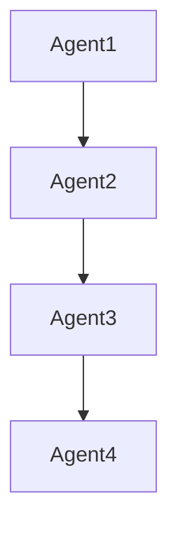
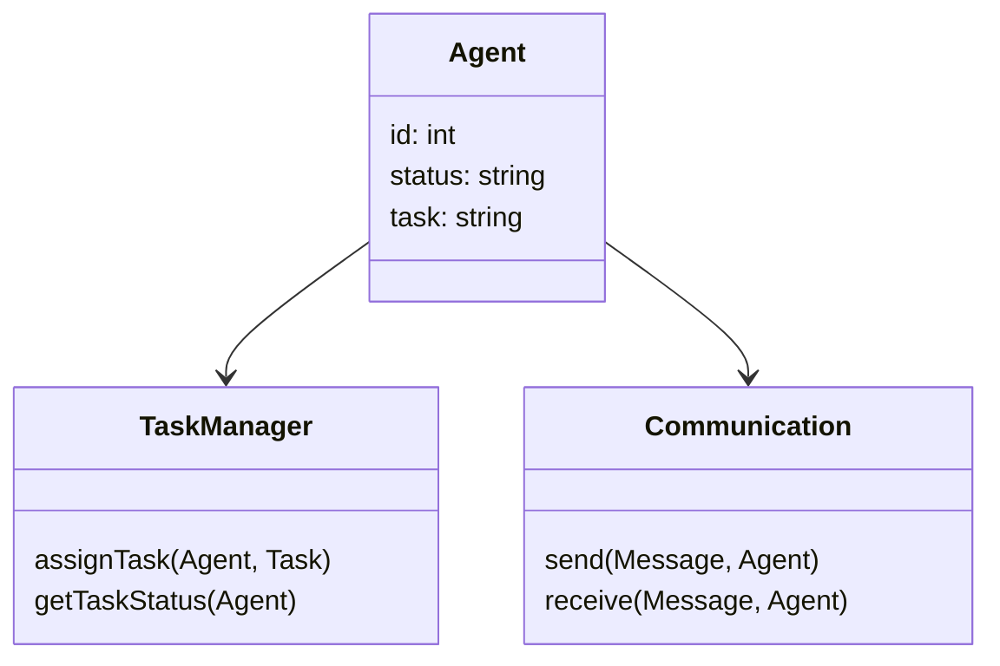
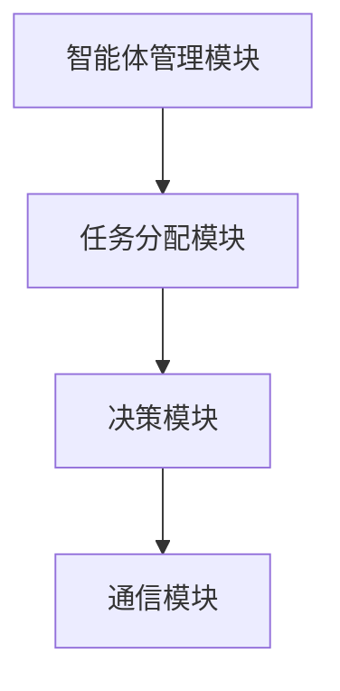
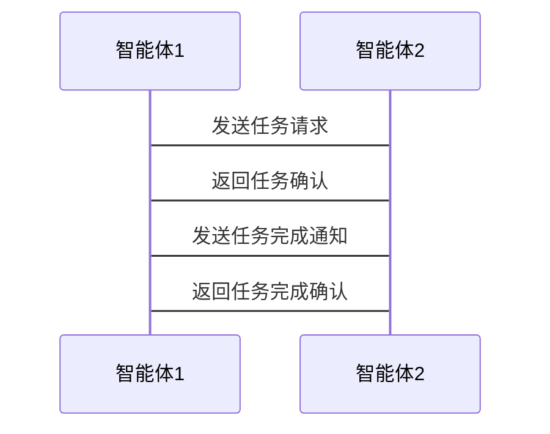

                 


# 多智能体系统如何实现智能化公司比较分析

> 关键词：多智能体系统、智能化公司、系统架构、算法原理、项目实战

> 摘要：本文从多智能体系统的定义、核心概念、算法原理、系统架构设计、项目实战等角度，全面分析多智能体系统如何实现智能化公司。通过比较分析不同公司的智能化实现路径，总结出多智能体系统在公司智能化中的重要作用和具体应用方式。

---

## 第1章: 多智能体系统与智能化公司概述

### 1.1 多智能体系统的基本概念

#### 1.1.1 多智能体系统的定义
多智能体系统（Multi-Agent System，简称MAS）是指由多个智能体（Agent）组成的分布式系统，这些智能体通过协作完成共同的目标。每个智能体都有一定的自主性、反应性和协作能力，能够感知环境并做出决策。

#### 1.1.2 多智能体系统的特征
- **自主性**：智能体能够自主决策和行动，无需外部干预。
- **反应性**：智能体能够根据环境变化实时调整行为。
- **协作性**：多个智能体之间可以通过通信和协调完成复杂任务。
- **分布式性**：智能体分布在网络中，通过通信完成任务。

#### 1.1.3 多智能体系统与单智能体系统的区别
| 特性         | 单智能体系统         | 多智能体系统         |
|--------------|----------------------|----------------------|
| 结构         | 单一智能体           | 多个智能体           |
| 协作方式     | 无协作               | 高度协作             |
| 系统复杂度   | 简单                 | 复杂                 |
| 应用场景     | 单任务               | 多任务、分布式任务   |

### 1.2 智能化公司的定义与特点

#### 1.2.1 智能化公司的定义
智能化公司是指通过引入人工智能、大数据、物联网等技术，实现公司内部业务流程自动化、决策智能化、管理优化的公司。

#### 1.2.2 智能化公司的核心特征
- **数据驱动**：公司决策基于数据而非直觉。
- **自动化**：业务流程自动化，减少人工干预。
- **智能化决策**：利用AI技术进行预测和优化决策。
- **高效协作**：部门间高效协作，提升整体效率。

#### 1.2.3 智能化公司与传统公司的区别
| 特性         | 传统公司         | 智能化公司         |
|--------------|------------------|------------------|
| 决策方式     | 依赖人工经验       | 数据驱动决策       |
| 业务流程     | 线性、低效       | 自动化、高效       |
| 技术应用     | 少或无AI技术      | 广泛应用AI技术     |

### 1.3 多智能体系统与智能化公司的关系

#### 1.3.1 多智能体系统在智能化公司中的作用
- **任务分配**：智能体可以将复杂任务分解为多个子任务，分配给不同的智能体完成。
- **协作完成**：多个智能体通过协作完成公司内的复杂业务流程。
- **实时反馈**：智能体能够实时感知环境变化，并做出相应调整。

#### 1.3.2 多智能体系统如何实现公司智能化
1. **智能化业务流程**：通过多智能体系统实现业务流程的自动化和智能化。
2. **高效协作**：智能体之间通过通信和协作，提升公司内部的协作效率。
3. **实时决策**：多智能体系统能够实时感知环境变化，快速做出决策。

#### 1.3.3 多智能体系统与公司智能化的未来发展趋势
- **智能化升级**：未来公司将进一步智能化，多智能体系统将在其中发挥重要作用。
- **技术融合**：多智能体系统将与大数据、区块链等技术深度融合，提升公司的智能化水平。
- **广泛应用**：多智能体系统将在更多领域得到应用，成为智能化公司的核心支撑技术。

### 1.4 本章小结
本章从多智能体系统的基本概念、智能化公司的定义与特点，以及两者的关系三个方面进行了详细阐述。通过对比分析，明确了多智能体系统在智能化公司中的重要性。

---

## 第2章: 多智能体系统的核心概念与联系

### 2.1 多智能体系统的核心概念

#### 2.1.1 智能体的定义与属性
智能体是指具有感知、决策、行动和协作能力的实体。其核心属性包括：
- **自主性**：能够自主决策和行动。
- **反应性**：能够感知环境变化并实时调整行为。
- **协作性**：能够与其他智能体协作完成任务。

#### 2.1.2 多智能体系统的协作机制
多智能体系统通过以下机制实现协作：
1. **通信机制**：智能体之间通过通信协议交换信息。
2. **协调机制**：通过协调算法确保智能体之间的协作。
3. **冲突解决机制**：在出现冲突时，通过协商或仲裁机制解决问题。

#### 2.1.3 多智能体系统的通信协议
通信协议是智能体之间进行信息交换的规则，常见的通信协议包括：
- **HTTP协议**：用于Web服务之间的通信。
- **MQTT协议**：轻量级协议，适用于物联网环境。
- **WebSocket协议**：支持实时双向通信。

#### 2.1.4 多智能体系统的ER实体关系图



### 2.2 多智能体系统与智能化公司的联系

#### 2.2.1 多智能体系统在公司智能化中的应用领域
多智能体系统可以应用于以下几个领域：
1. **业务流程自动化**：通过智能体实现业务流程的自动化。
2. **决策支持**：通过智能体提供数据支持，辅助公司决策。
3. **协作优化**：通过智能体优化公司内部协作效率。

#### 2.2.2 多智能体系统如何提升公司智能化水平
1. **提高效率**：通过自动化和协作，提高公司业务效率。
2. **降低成本**：减少人工干预，降低运营成本。
3. **增强灵活性**：智能体能够快速适应环境变化，提升公司灵活性。

#### 2.2.3 多智能体系统与公司智能化的协同发展
- **技术驱动**：多智能体系统通过技术创新推动公司智能化。
- **业务驱动**：公司业务需求推动多智能体系统的应用。
- **协同优化**：多智能体系统与公司其他系统协同优化，提升整体智能化水平。

### 2.3 本章小结
本章重点介绍了多智能体系统的核心概念及其与智能化公司的联系。通过分析多智能体系统的协作机制和通信协议，明确了其在公司智能化中的重要作用。

---

## 第3章: 多智能体系统的算法原理

### 3.1 多智能体系统的核心算法

#### 3.1.1 分布式计算算法
分布式计算算法是多智能体系统的核心算法之一，主要用于任务分配和资源管理。常见的分布式计算算法包括：
1. **MapReduce算法**：用于大规模数据处理。
2. **分布式一致性算法**：用于保证分布式系统的一致性。

#### 3.1.2 一致性算法
一致性算法用于保证分布式系统中数据的一致性。常见的算法包括：
1. **Paxos算法**：用于分布式系统中达成一致的协议。
2. **Raft算法**：用于分布式系统中的领导者选举。

#### 3.1.3 通信协议算法
通信协议算法用于智能体之间信息的高效传输。常见的通信协议算法包括：
1. **HTTP协议**：用于Web服务之间的通信。
2. **WebSocket协议**：用于实时双向通信。

### 3.2 算法原理的数学模型与公式

#### 3.2.1 分布式计算的数学模型
$$f(x) = x + 1$$

#### 3.2.2 一致性算法的数学公式
$$\text{一致性条件} = \text{所有节点的状态相等}$$

#### 3.2.3 通信协议的数学表达
$$\text{消息传递} = \text{节点间通过消息队列进行通信}$$

### 3.3 算法实现的Python代码示例

#### 3.3.1 分布式计算的Python代码
```python
from distributed import Client

def add_one(x):
    return x + 1

client = Client()
result = client.submit(add_one, 5)
print(result.result)  # 输出6
```

#### 3.3.2 一致性算法的Python代码
```python
import random

class Paxos:
    def __init__(self, proposers):
        self.proposers = proposers
        self.current_proposal_number = 0

    def propose(self, value):
        # 提案者发送提案
        for proposer in self.proposers:
            proposer.receive_proposal(self.current_proposal_number, value)
        self.current_proposal_number += 1

class Proposer:
    def __init__(self, number):
        self.number = number
        self.accepted_value = None

    def receive_proposal(self, proposal_number, value):
        if value is not None:
            self.accepted_value = value
```

#### 3.3.3 通信协议的Python代码
```python
import websockets
import asyncio

async def echo_server():
    async with websockets.connect('ws://localhost:8000') as websocket:
        while True:
            message = await websocket.recv()
            print(f"收到消息: {message}")
            await websocket.send(f"服务器已收到消息: {message}")

asyncio.get_event_loop().run_until_complete(echo_server())
```

### 3.4 本章小结
本章详细介绍了多智能体系统的核心算法，包括分布式计算算法、一致性算法和通信协议算法，并给出了相应的Python代码示例。通过这些算法，可以实现多智能体系统在公司智能化中的高效协作。

---

## 第4章: 多智能体系统的系统分析与架构设计

### 4.1 项目背景与需求分析

#### 4.1.1 项目背景
随着人工智能技术的发展，越来越多的公司开始采用多智能体系统来实现业务流程的智能化。

#### 4.1.2 项目需求
- **业务需求**：实现公司业务流程的自动化。
- **技术需求**：实现智能体之间的通信与协作。
- **性能需求**：确保系统高效、稳定运行。

### 4.2 系统功能设计

#### 4.2.1 系统功能模块
1. **智能体管理模块**：负责智能体的注册、管理和监控。
2. **任务分配模块**：负责任务的分解和分配。
3. **通信模块**：负责智能体之间的信息传递。
4. **决策模块**：负责基于数据的决策支持。

#### 4.2.2 系统功能设计的领域模型


### 4.3 系统架构设计

#### 4.3.1 系统架构图


#### 4.3.2 系统接口设计
1. **智能体管理接口**：用于智能体的注册和状态管理。
2. **任务分配接口**：用于任务的分解和分配。
3. **通信接口**：用于智能体之间的信息传递。

#### 4.3.3 系统交互图


### 4.4 本章小结
本章详细分析了多智能体系统的项目背景与需求，设计了系统的功能模块和架构，并通过图示展示了系统的交互过程。

---

## 第5章: 多智能体系统的项目实战

### 5.1 环境安装与配置

#### 5.1.1 安装Python
```bash
python --version
pip install --upgrade pip
```

#### 5.1.2 安装多智能体系统依赖
```bash
pip install distributed
pip install websockets
```

### 5.2 系统核心代码实现

#### 5.2.1 智能体管理模块
```python
class AgentManager:
    def __init__(self):
        self.agents = {}

    def register_agent(self, agent_id):
        self.agents[agent_id] = {'status': 'active', 'task': None}

    def get_agent_status(self, agent_id):
        return self.agents[agent_id]['status']
```

#### 5.2.2 任务分配模块
```python
class TaskAllocator:
    def __init__(self, agents):
        self.agents = agents

    def allocate_task(self, task, agent_id):
        self.agents[agent_id]['task'] = task
```

#### 5.2.3 通信模块
```python
import websockets
import asyncio

async def agent_communication(agent_id):
    async with websockets.connect('ws://localhost:8000') as websocket:
        while True:
            message = await websocket.recv()
            print(f"Agent {agent_id} 收到消息: {message}")
            await websocket.send(f"Agent {agent_id} 已收到消息: {message}")
```

### 5.3 实际案例分析

#### 5.3.1 案例背景
某公司希望利用多智能体系统实现业务流程的自动化。

#### 5.3.2 案例分析
1. **需求分析**：公司需要实现订单处理的自动化。
2. **系统设计**：设计智能体管理模块、任务分配模块和通信模块。
3. **系统实现**：编写Python代码实现各模块功能。
4. **系统测试**：测试系统功能，确保系统正常运行。

### 5.4 本章小结
本章通过实际案例分析，详细讲解了多智能体系统的项目实战过程，包括环境安装、核心代码实现和系统测试。

---

## 第6章: 多智能体系统的最佳实践

### 6.1 最佳实践 tips

#### 6.1.1 系统设计
- **模块化设计**：确保系统模块化，便于维护和扩展。
- **高可用性设计**：确保系统具有高可用性，避免单点故障。

#### 6.1.2 代码实现
- **代码规范**：遵循Python代码规范，确保代码可读性。
- **测试用例**：编写充分的测试用例，确保代码质量。

#### 6.1.3 系统优化
- **性能优化**：通过优化算法和代码，提升系统性能。
- **安全性优化**：确保系统具有良好的安全性。

### 6.2 小结
本章总结了多智能体系统的最佳实践，包括系统设计、代码实现和系统优化等方面。

### 6.3 注意事项

#### 6.3.1 系统设计
- **避免过度复杂**：避免设计过于复杂的系统，确保系统简洁高效。
- **考虑可扩展性**：确保系统具有良好的可扩展性，便于后续功能扩展。

#### 6.3.2 代码实现
- **避免代码冗余**：避免代码冗余，确保代码简洁。
- **避免过度优化**：避免过度优化，确保代码易于维护。

#### 6.3.3 系统维护
- **定期维护**：定期检查系统，确保系统稳定运行。
- **及时更新**：及时更新系统，确保系统安全性。

### 6.4 未来趋势

#### 6.4.1 技术融合
- **与大数据技术融合**：多智能体系统将进一步与大数据技术融合，提升数据分析能力。
- **与区块链技术融合**：多智能体系统将与区块链技术融合，提升系统的安全性。

#### 6.4.2 应用场景扩展
- **更多行业应用**：多智能体系统将在更多行业得到应用，如金融、医疗等。
- **智能化升级**：多智能体系统将推动公司智能化水平的进一步提升。

### 6.5 拓展阅读

#### 6.5.1 推荐书籍
1. 《分布式系统：概念与设计》
2. 《多智能体系统的理论与应用》

#### 6.5.2 推荐博客
1. [分布式系统博客](https://example.com/distributed-system)
2. [多智能体系统博客](https://example.com/multi-agent-system)

---

## 作者：AI天才研究院/AI Genius Institute & 禅与计算机程序设计艺术 /Zen And The Art of Computer Programming

