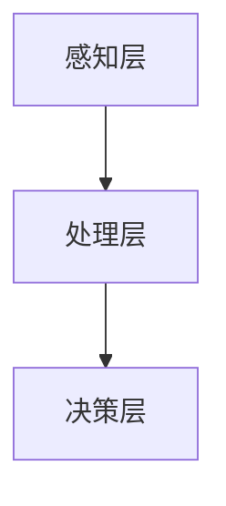
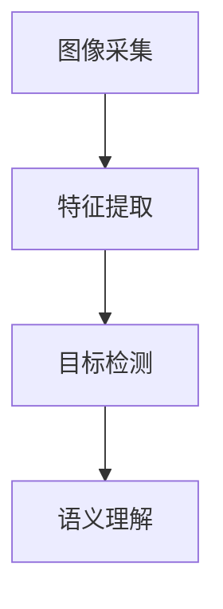

                 


# 实现AI Agent的视觉理解能力：图像识别与分析

> **关键词**：AI Agent，视觉理解，图像识别，图像分析，深度学习，计算机视觉

> **摘要**：本文详细探讨了AI Agent的视觉理解能力，重点分析了图像识别与分析的核心技术与实现方法。从AI Agent的背景与需求出发，深入解析了图像识别的基本原理、算法实现及系统架构设计，并通过实际案例展示了AI Agent在图像识别与分析中的应用。本文旨在为AI Agent的开发者和研究人员提供理论与实践相结合的指导，助力实现更智能、更高效的视觉理解能力。

---

## 第1章: AI Agent与视觉理解的背景介绍

### 1.1 问题背景与问题描述

#### 1.1.1 AI Agent的核心概念
AI Agent（人工智能代理）是指能够感知环境、自主决策并执行任务的智能实体。AI Agent的核心能力包括感知、推理、规划和执行。在实际应用中，AI Agent需要通过多种传感器（如摄像头、麦克风等）与环境交互，其中视觉感知是其最重要的能力之一。

#### 1.1.2 视觉理解在AI Agent中的重要性
视觉理解是AI Agent与环境交互的关键能力之一。通过视觉感知，AI Agent可以识别图像中的物体、场景、行为等信息，从而做出更准确的决策。例如，在智能安防系统中，AI Agent需要通过视觉理解识别入侵者；在自动驾驶中，AI Agent需要通过视觉理解识别道路、车辆和行人。

#### 1.1.3 图像识别与分析的定义与目标
图像识别是指通过计算机技术对图像中的物体、场景或文字进行识别和分类的过程。图像分析则是对图像进行更深层次的理解，包括图像分割、目标检测、语义分析等。图像识别与分析的目标是使计算机能够像人类一样理解和分析图像信息。

### 1.2 问题解决与边界

#### 1.2.1 AI Agent视觉理解的核心问题
AI Agent的视觉理解需要解决以下几个核心问题：
1. **图像特征提取**：如何从图像中提取有用的特征信息。
2. **图像分类与目标检测**：如何准确识别图像中的物体或场景。
3. **图像分割与语义理解**：如何对图像进行像素级的分割和语义分析。

#### 1.2.2 图像识别与分析的边界与外延
图像识别与分析的边界主要在于数据输入和输出的范围。输入是数字图像，输出是对图像的识别结果（如类别标签、目标位置等）。外延则包括图像生成、图像修复等任务，这些任务虽然与图像识别有交集，但不属于本文的核心内容。

#### 1.2.3 视觉理解能力的实现路径
实现AI Agent的视觉理解能力需要从以下几个方面入手：
1. **算法研究**：研究高效的图像识别与分析算法。
2. **系统设计**：设计高效的视觉理解系统架构。
3. **数据处理**：优化数据采集、预处理和标注流程。
4. **模型部署**：将模型部署到实际应用场景中。

### 1.3 概念结构与核心要素

#### 1.3.1 AI Agent的系统架构
AI Agent的系统架构通常包括以下几个模块：
1. **感知模块**：负责采集和处理环境中的感知数据（如图像、声音等）。
2. **推理模块**：负责对感知数据进行分析和理解，生成决策依据。
3. **决策模块**：根据推理结果做出决策。
4. **执行模块**：根据决策执行具体动作。

#### 1.3.2 视觉理解的关键要素
视觉理解的关键要素包括：
1. **图像特征**：图像中的纹理、形状、颜色等特征。
2. **分类模型**：用于对图像进行分类的算法（如CNN）。
3. **目标检测**：用于检测图像中的目标位置和类别。
4. **图像分割**：用于对图像进行像素级的分割和语义分析。

#### 1.3.3 图像识别与分析的流程与模块
图像识别与分析的流程通常包括以下几个模块：
1. **数据采集**：获取图像数据。
2. **数据预处理**：对图像进行归一化、增强等处理。
3. **特征提取**：提取图像的特征信息。
4. **分类与检测**：对图像进行分类或目标检测。
5. **分割与语义分析**：对图像进行分割和语义分析。

---

## 第2章: 图像识别与分析的核心概念

### 2.1 图像识别的基本原理

#### 2.1.1 图像特征提取
图像特征提取是图像识别的核心步骤。常用的特征提取方法包括：
1. **手工设计特征**：如SIFT、HOG等。
2. **深度学习特征**：如CNN的卷积层输出。

**示例**：使用SIFT算法提取图像中的关键点特征。

#### 2.1.2 图像分类与目标检测
图像分类是指将图像分类到预定义的类别中，目标检测是在图像中定位目标并进行分类。

**示例**：使用Faster R-CNN算法实现目标检测。

#### 2.1.3 图像分割与语义理解
图像分割是对图像进行像素级的划分，语义理解是对图像内容进行高层次的理解。

**示例**：使用U-Net算法进行图像分割。

### 2.2 视觉理解的算法原理

#### 2.2.1 基于CNN的图像识别
卷积神经网络（CNN）是图像识别的核心算法。CNN通过卷积层提取图像特征，通过池化层降低计算复杂度，通过全连接层进行分类。

**公式示例**：CNN的卷积层输出为：
$$
f(x) = \sum_{i=1}^{k} w_i \cdot x_i + b
$$
其中，$w_i$是权重，$x_i$是输入，$b$是偏置。

#### 2.2.2 基于Transformer的图像语义理解
Transformer模型在图像语义理解中表现出色，尤其是在图像描述生成任务中。

**公式示例**：Transformer的自注意力机制：
$$
\text{Attention}(Q, K, V) = \text{softmax}\left(\frac{QK^T}{\sqrt{d_k}}\right)V
$$

---

## 第3章: AI Agent视觉理解的系统架构

### 3.1 系统功能设计

#### 3.1.1 视觉感知模块
视觉感知模块负责采集和处理图像数据，通常包括摄像头驱动和图像预处理功能。

**代码示例**：使用OpenCV读取图像：
```python
import cv2
image = cv2.imread('input.jpg')
print(image.shape)  # 输出图像尺寸
```

#### 3.1.2 数据处理与特征提取
数据处理包括图像归一化、数据增强等步骤，特征提取通常使用CNN的卷积层输出。

**代码示例**：使用PyTorch提取图像特征：
```python
import torch
model = torch.hub.load('pytorch/faster-rcnn')
features = model.backbone(image)
```

#### 3.1.3 上下文理解与决策
上下文理解模块负责将图像特征与环境信息结合，生成决策依据。

**代码示例**：使用RNN处理序列特征：
```python
import torch.nn as nn
rnn = nn.LSTM(input_size=512, hidden_size=256)
output, (h_n, c_n) = rnn(features, None)
```

### 3.2 系统架构设计

#### 3.2.1 分层架构设计
AI Agent的视觉理解系统通常采用分层架构，包括感知层、处理层和决策层。

**Mermaid图示**：


#### 3.2.2 模块化设计
模块化设计将系统划分为多个独立模块，便于开发和维护。

**Mermaid图示**：


#### 3.2.3 高效计算与资源优化
通过模型剪枝、量化等技术优化模型，降低计算资源消耗。

**代码示例**：使用TensorFlow Lite进行模型优化：
```python
import tensorflow as tf
model = tf.keras.models.load_model('model.h5')
converter = tf.lite.TFLiteConverter.from_keras_model_file('model.h5')
tflite_model = converter.convert()
```

---

## 第4章: 图像识别与分析的算法实现

### 4.1 基于CNN的图像分类

#### 4.1.1 AlexNet网络结构
AlexNet是第一个在ImageNet大规模图像分类任务中取得突破的CNN模型。

**代码示例**：AlexNet的Python实现：
```python
import torch
class AlexNet(nn.Module):
    def __init__(self, num_classes=1000):
        super(AlexNet, self).__init__()
        self.features = nn.Sequential(
            nn.Conv2d(3, 64, kernel_size=11, stride=4, padding=2),
            nn.ReLU(inplace=True),
            nn.MaxPool2d(kernel_size=3, stride=2),
            # 更多层...
        )
        self.classifier = nn.Sequential(
            nn.Dropout(),
            nn.Linear(256, num_classes)
        )
```

#### 4.1.2 VGGNet的改进
VGGNet通过增加网络深度提高了分类性能。

**公式示例**：VGGNet的卷积层：
$$
f(x) = \max(0, x + \theta)
$$

#### 4.1.3 ResNet的残差学习机制
ResNet通过残差连接解决了深层网络的训练难题。

**代码示例**：ResNet的基本块：
```python
class BasicBlock(nn.Module):
    def __init__(self, inplanes, planes, stride=1):
        super(BasicBlock, self).__init__()
        self.conv1 = nn.Conv2d(inplanes, planes, kernel_size=3, stride=stride, padding=1)
        self.bn1 = nn.BatchNorm2d(planes)
        self.relu = nn.ReLU(inplace=True)
        self.conv2 = nn.Conv2d(planes, planes, kernel_size=3, stride=1, padding=1)
        self.bn2 = nn.BatchNorm2d(planes)
```

---

## 第5章: 图像分割与语义理解

### 5.1 图像分割算法

#### 5.1.1 FCN的全卷积网络
FCN通过全卷积网络实现像素级的分割。

**代码示例**：FCN的Python实现：
```python
import torch.nn as nn
class FCN(nn.Module):
    def __init__(self, num_classes=21):
        super(FCN, self).__init__()
        self.features = nn.Sequential(
            nn.Conv2d(3, 64, kernel_size=7, stride=2, padding=3),
            nn.ReLU(inplace=True),
            # 更多层...
        )
        self.classifier = nn.Conv2d(64, num_classes, kernel_size=1)
```

#### 5.1.2 U-Net的医学图像分割
U-Net在医学图像分割中表现出色，通过跳跃连接实现特征融合。

**代码示例**：U-Net的基本结构：
```python
class UNet(nn.Module):
    def __init__(self, n_channels, n_classes):
        super(UNet, self).__init__()
        self.conv1 = DoubleConv(n_channels, 64)
        self.pool1 = nn.MaxPool2d(kernel_size=2, stride=2)
        self.conv2 = DoubleConv(64, 128)
        # 更多层...
```

#### 5.1.3 Mask R-CNN的实例分割
Mask R-CNN在实例分割任务中表现出色。

**代码示例**：Mask R-CNN的Python实现：
```python
import detectron2
class MaskRCNN(detectron2.configs.BaseConfig):
    def __init__(self):
        super().__init__()
        self.MODEL = "mask_rcnn"
        self.IMAGES_PER_BATCH = 2
```

### 5.2 语义理解与图像描述

#### 5.2.1 图像到文本的生成模型
图像描述生成模型将图像转换为自然语言描述。

**代码示例**：使用Transformer生成图像描述：
```python
import torch
class ImageCaptionModel(nn.Module):
    def __init__(self, embedding_dim, hidden_size):
        super(ImageCaptionModel, self).__init__()
        self.embedding = nn.Embedding(vocab_size, embedding_dim)
        self.decoder = nn.TransformerDecoder(...)
```

---

## 第6章: AI Agent视觉理解的项目实战

### 6.1 环境搭建与工具安装

#### 6.1.1 Python环境配置
安装Python 3.8以上版本，建议使用Anaconda或virtualenv管理环境。

**代码示例**：使用Anaconda创建虚拟环境：
```bash
conda create -n ai-agent python=3.8
conda activate ai-agent
```

#### 6.1.2 深度学习框架的选择
TensorFlow和PyTorch是主流的深度学习框架，建议根据具体任务选择合适的框架。

**代码示例**：使用PyTorch安装 torchvision：
```bash
pip install torch torchvision
```

#### 6.1.3 数据集的准备与预处理
常用数据集包括ImageNet、COCO、PASCAL VOC等。

**代码示例**：使用OpenCV预处理图像：
```python
import cv2
import numpy as np
image = cv2.imread('input.jpg')
image = cv2.resize(image, (224, 224))
image = image.astype(np.float32)
```

### 6.2 核心算法实现

#### 6.2.1 CNN图像分类的代码实现
使用PyTorch实现一个简单的图像分类模型。

**代码示例**：
```python
import torch
class SimpleCNN(nn.Module):
    def __init__(self, num_classes=10):
        super(SimpleCNN, self).__init__()
        self.conv = nn.Sequential(
            nn.Conv2d(3, 32, 3, padding=1),
            nn.ReLU(),
            nn.MaxPool2d(2, 2),
            nn.Conv2d(32, 64, 3, padding=1),
            nn.ReLU(),
            nn.MaxPool2d(2, 2)
        )
        self.fc = nn.Linear(64*5*5, num_classes)
```

#### 6.2.2 目标检测模型的训练与部署
使用Faster R-CNN实现目标检测。

**代码示例**：
```python
from detectron2.config import get_cfg
from detectron2.data import build_train_loader
cfg = get_cfg()
cfg.merge_from_file("configs/faster_rcnn.yaml")
train_loader = build_train_loader(cfg)
```

#### 6.2.3 图像分割模型的优化与测试
使用U-Net进行图像分割，并优化模型性能。

**代码示例**：
```python
import torch
model = UNet(3, 21)
criterion = nn.CrossEntropyLoss()
optimizer = torch.optim.Adam(model.parameters(), lr=0.001)
```

### 6.3 实际案例分析

#### 6.3.1 医疗图像的分割应用
使用U-Net进行医学图像分割，如肿瘤检测。

**代码示例**：
```python
import cv2
import numpy as np
image = cv2.imread('medical.jpg', cv2.IMREAD_GRAYSCALE)
image = image.reshape(1, 1, 224, 224)
output = model(image)
```

#### 6.3.2 智能安防中的目标检测
使用Faster R-CNN进行行人检测。

**代码示例**：
```python
import detectron2
model = detectron2.configs.FasterRCNN()
model.eval()
```

#### 6.3.3 自然图像的语义理解
使用Mask R-CNN进行图像语义分析。

**代码示例**：
```python
import detectron2
model = detectron2.configs.MaskRCNN()
model.eval()
```

---

## 第7章: 最佳实践与系统优化

### 7.1 算法优化技巧

#### 7.1.1 数据增强策略
使用数据增强技术提高模型泛化能力。

**代码示例**：
```python
import albumentations
transform = albumentations.Compose([
    albumentations.Resize(224, 224),
    albumentations.Normalize(mean=(0.485, 0.456, 0.406), std=(0.229, 0.224, 0.225))
])
image = transform(image=image)['image']
```

#### 7.1.2 模型压缩与轻量化
通过模型剪枝、知识蒸馏等技术优化模型。

**代码示例**：
```python
import torch
model = torch.hub.load('pytorch/faster-rcnn', 'fasterrcnn_resnet50_fpn', pretrained=True)
model_scripted = torch.jit.script(model)
model_scripted.save('model.pt')
```

#### 7.1.3 并行计算与资源优化
利用GPU并行计算加速模型训练。

**代码示例**：
```python
import torch
device = torch.device("cuda" if torch.cuda.is_available() else "cpu")
model = model.to(device)
```

### 7.2 系统设计小结

AI Agent的视觉理解能力是一个复杂的系统工程，需要从算法研究、系统设计、数据处理等多个方面综合考虑。通过模块化设计和高效的算法实现，可以显著提升系统的性能和可维护性。

### 7.3 注意事项

1. **数据质量**：确保数据的多样性和代表性，避免过拟合。
2. **模型调优**：合理选择超参数，进行充分的验证和测试。
3. **性能优化**：通过模型剪枝、量化等技术优化计算效率。

### 7.4 拓展阅读

1. **书籍**：《Deep Learning》（Ian Goodfellow等著）
2. **论文**：ImageNet Classification with Deep Convolutional Neural Networks（AlexNet论文）
3. **教程**：官方文档和GitHub仓库（如PyTorch、TensorFlow的官方文档）

---

## 作者信息

作者：AI天才研究院/AI Genius Institute & 禅与计算机程序设计艺术 /Zen And The Art of Computer Programming

---

**本文总结**：通过本文的详细讲解，读者可以系统地理解AI Agent的视觉理解能力，掌握图像识别与分析的核心算法与系统设计方法，并通过实际案例掌握AI Agent视觉理解能力的实现技巧。

