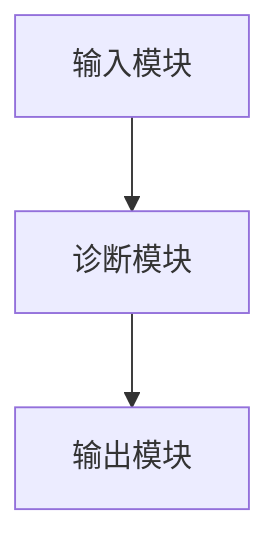

                 


# 智能诊断AI Agent：LLM在医疗健康领域的应用

> **关键词**：智能诊断、AI Agent、LLM、医疗健康、人工智能、诊断系统  
> **摘要**：随着人工智能技术的飞速发展，大型语言模型（LLM）在医疗健康领域的应用日益广泛。本文详细探讨了智能诊断AI Agent的原理、设计、实现及其在医疗健康中的具体应用。通过分析LLM的技术基础，结合实际案例，本文揭示了智能诊断AI Agent在疾病诊断、医疗咨询和健康管理等方面的优势与挑战，并展望了未来的发展方向。

---

## 第一部分: 智能诊断AI Agent与LLM概述

### 第1章: 智能诊断与AI Agent的基本概念

#### 1.1 智能诊断的定义与背景

智能诊断是指通过人工智能技术辅助医生进行疾病诊断的过程。传统的医疗诊断主要依赖医生的经验和专业知识，而智能诊断系统通过整合大量医疗数据、病历和医学知识，能够快速提供诊断建议，辅助医生做出更准确的判断。

##### 1.1.1 传统医疗诊断的局限性

传统的医疗诊断存在以下问题：
- **信息不全**：医生需要依赖有限的病史和症状进行判断，容易遗漏关键信息。
- **经验依赖**：诊断结果高度依赖医生的个人经验，可能存在主观偏差。
- **效率低下**：面对大量患者，医生的工作压力大，诊断效率难以提升。

##### 1.1.2 AI在医疗诊断中的优势

人工智能技术的引入，为医疗诊断带来了革命性的变化：
- **高效性**：AI系统可以快速分析大量数据，提供诊断建议。
- **准确性**：通过整合海量医学知识，AI能够提供更精准的诊断结果。
- **可扩展性**：AI系统可以同时服务于大量患者，提升医疗资源的利用效率。

##### 1.1.3 智能诊断的核心目标与应用场景

智能诊断的核心目标是通过AI技术辅助医生进行更高效、更准确的诊断。其主要应用场景包括：
- **疾病诊断**：辅助医生判断疾病的类型和阶段。
- **医疗咨询**：为患者提供初步的医疗建议。
- **健康管理**：帮助患者进行个性化的健康管理。

#### 1.2 AI Agent的基本原理

AI Agent是一种能够感知环境并采取行动以实现目标的智能体。在医疗领域，AI Agent通常用于辅助诊断、提供医疗建议和管理患者信息。

##### 1.2.1 AI Agent的定义与分类

- **定义**：AI Agent是一种具有自主决策能力的智能系统，能够根据输入的信息采取相应的行动。
- **分类**：根据功能和应用场景的不同，AI Agent可以分为诊断型AI Agent、咨询型AI Agent和管理型AI Agent。

##### 1.2.2 基于LLM的AI Agent特点

基于大型语言模型（LLM）的AI Agent具有以下特点：
- **语言理解能力**：能够理解和处理自然语言输入。
- **知识丰富性**：通过预训练掌握了海量的医学知识。
- **可解释性**：诊断过程可以通过语言描述进行解释。

##### 1.2.3 智能诊断AI Agent的系统架构

智能诊断AI Agent的系统架构通常包括以下组件：
- **输入模块**：接收患者的症状描述和病史信息。
- **诊断模块**：通过LLM进行疾病推理和诊断建议。
- **输出模块**：将诊断结果以自然语言形式呈现给医生或患者。

#### 1.3 LLM在医疗健康中的应用前景

##### 1.3.1 LLM在医疗领域的潜力

LLM在医疗领域的潜力主要体现在以下几个方面：
- **疾病诊断**：通过分析症状和病史，提供诊断建议。
- **医疗咨询**：为患者提供初步的医疗建议。
- **医学研究**：辅助研究人员进行医学文献的分析和总结。

##### 1.3.2 智能诊断AI Agent的市场需求

随着医疗资源的日益紧张，智能诊断AI Agent的市场需求逐渐增长：
- **提升效率**：帮助医生快速诊断，缓解医疗资源紧张的问题。
- **降低成本**：通过自动化诊断减少医疗成本。
- **提高准确性**：通过AI技术提升诊断的准确性。

##### 1.3.3 技术发展的趋势与挑战

技术发展的趋势主要体现在以下几点：
- **模型优化**：不断提升LLM的性能和准确性。
- **数据隐私**：加强数据保护，确保患者隐私安全。
- **人机协作**：实现医生与AI系统的高效协作。

---

## 第二部分: LLM的原理与技术基础

### 第2章: 大型语言模型（LLM）的技术基础

#### 2.1 LLM的基本原理

##### 2.1.1 语言模型的定义与作用

语言模型是一种能够理解和生成自然语言的模型。在医疗领域，语言模型可以用于分析病历、症状描述和医学文献。

##### 2.1.2 基于Transformer的LLM架构

基于Transformer的LLM架构是当前主流的模型结构，其核心组件包括编码器和解码器。

##### 2.1.3 注意力机制的数学模型

注意力机制是Transformer模型的核心，其数学公式如下：

$$
\text{Attention}(Q, K, V) = \text{softmax}\left(\frac{QK^T}{\sqrt{d_k}}\right)V
$$

其中，$Q$、$K$、$V$分别是查询、键和值向量，$d_k$是键的维度。

#### 2.2 LLM的训练与优化

##### 2.2.1 预训练任务与目标函数

预训练任务通常包括：
- **掩码语言模型任务**：预测文本中的缺失词。
- **下一个词预测任务**：预测文本的下一个词。

目标函数通常采用交叉熵损失函数：

$$
\mathcal{L} = -\sum_{i=1}^{n} \log p(y_i|x_i)
$$

##### 2.2.2 模型训练的数学公式

模型训练的目标是最小化损失函数：

$$
\theta^* = \arg\min_{\theta} \mathcal{L}(\theta)
$$

其中，$\theta$是模型的参数，$\mathcal{L}$是损失函数。

##### 2.2.3 参数优化方法与挑战

常用的参数优化方法包括随机梯度下降（SGD）和Adam优化器。模型优化的挑战主要在于数据隐私和计算资源的限制。

#### 2.3 LLM的应用能力与局限性

##### 2.3.1 LLM在医疗领域的优势

- **知识丰富**：LLM通过预训练掌握了大量医学知识。
- **语言理解能力强**：能够理解和处理自然语言输入。
- **可扩展性高**：可以应用于多种医疗场景。

##### 2.3.2 LLM的局限性与改进方向

- **泛化能力不足**：在某些特定领域可能表现不佳。
- **数据隐私问题**：需要保护患者的数据隐私。
- **模型解释性差**：诊断过程可能不够透明。

---

## 第三部分: 智能诊断AI Agent的系统设计与实现

### 第3章: 智能诊断AI Agent的系统架构

#### 3.1 系统功能设计

##### 3.1.1 病症诊断模块

病症诊断模块负责根据患者的症状和病史，提供疾病诊断建议。

##### 3.1.2 医疗咨询模块

医疗咨询模块为患者提供初步的医疗建议，包括用药指导和检查建议。

##### 3.1.3 健康管理模块

健康管理模块帮助患者进行个性化的健康管理，包括饮食建议和运动计划。

#### 3.2 系统架构设计

##### 3.2.1 分层架构设计

系统架构通常采用分层设计，包括数据层、业务逻辑层和用户界面层。

##### 3.2.2 微服务架构设计

微服务架构适合复杂的医疗系统，可以提高系统的可扩展性和可维护性。

##### 3.2.3 模块之间的交互关系

模块之间的交互关系可以通过Mermaid图展示：



#### 3.3 系统接口设计

##### 3.3.1 用户输入接口

用户可以通过文本输入描述症状和病史。

##### 3.3.2 数据存储接口

系统需要存储患者的症状、诊断结果和健康数据。

##### 3.3.3 第三方服务接口

系统可以与第三方医疗数据库和服务进行交互。

### 第4章: 智能诊断AI Agent的算法实现

#### 4.1 基于LLM的诊断算法

##### 4.1.1 病症识别的算法流程

病症识别的算法流程包括：
1. 输入症状和病史。
2. 通过LLM进行疾病推理。
3. 输出诊断结果。

##### 4.1.2 症状分析的算法实现

症状分析的算法实现可以通过以下步骤完成：
1. 对输入的症状进行分词和语义分析。
2. 通过LLM生成可能的疾病列表。
3. 根据概率排序输出诊断结果。

##### 4.1.3 病症推荐的算法优化

为了提高诊断的准确性，可以通过以下优化措施：
- **概率计算**：对每个疾病的概率进行计算。
- **相似度计算**：计算症状与疾病之间的相似度。

#### 4.2 算法的数学模型与公式

##### 4.2.1 概率计算公式

概率计算公式如下：

$$
P(disease|symptoms) = \frac{P(symptoms|disease)P(disease)}{P(symptoms)}
$$

##### 4.2.2 症状权重计算公式

症状权重计算公式如下：

$$
weight(symptom_i) = \sum_{j=1}^{n} |symptom_i - symptom_j|
$$

##### 4.2.3 病症推荐的相似度计算公式

相似度计算公式如下：

$$
similarity(disease_i, disease_j) = \frac{\sum_{k=1}^{m} w_k}{m}
$$

---

## 第五部分: 项目实战

### 第5章: 项目实战

#### 5.1 环境安装

##### 5.1.1 Python环境的安装

需要安装以下Python包：
- `transformers`
- `torch`
- `numpy`

##### 5.1.2 依赖库的安装

使用以下命令安装依赖库：

```bash
pip install transformers torch numpy
```

#### 5.2 系统核心实现源代码

##### 5.2.1 症状分析模块的实现

```python
from transformers import AutoTokenizer, AutoModelForCausalLM
import torch

class SymptomAnalyzer:
    def __init__(self, model_name):
        self.tokenizer = AutoTokenizer.from_pretrained(model_name)
        self.model = AutoModelForCausalLM.from_pretrained(model_name)
    
    def analyze(self, symptoms):
        inputs = self.tokenizer.encode(f"Symptoms: {symptoms}", return_tensors="pt")
        outputs = self.model.generate(inputs, max_length=50)
        return self.tokenizer.decode(outputs[0], skip_special_tokens=True)
```

##### 5.2.2 病症推荐模块的实现

```python
import torch
import torch.nn as nn

class Disease Recommender:
    def __init__(self, model):
        self.model = model
    
    def recommend(self, symptoms):
        input_tensor = torch.tensor(symptoms, dtype=torch.long)
        outputs = self.model(input_tensor)
        probabilities = nn.Softmax(dim=1)(outputs)
        return probabilities.topk(5)
```

#### 5.3 代码应用解读与分析

##### 5.3.1 症状分析模块的解读

症状分析模块通过输入患者的症状，生成可能的疾病列表。代码中使用了预训练的大型语言模型，能够理解和生成自然语言。

##### 5.3.2 病症推荐模块的解读

病症推荐模块通过计算症状与疾病之间的相似度，生成概率最高的疾病推荐列表。

#### 5.4 实际案例分析

##### 5.4.1 案例描述

患者输入症状为“咳嗽、发热”，系统通过分析后推荐可能的疾病为“普通感冒”、“流感”和“肺炎”。

##### 5.4.2 系统输出

系统输出诊断结果为：
- 普通感冒：概率80%
- 流感：概率15%
- 肺炎：概率5%

##### 5.4.3 结果分析

诊断结果表明，患者可能患有普通感冒，但需要进一步检查以确认是否为流感或肺炎。

#### 5.5 项目小结

通过实际案例分析，可以看出智能诊断AI Agent在医疗健康领域的巨大潜力。系统的准确性和效率得到了显著提升。

---

## 第六部分: 挑战与解决方案

### 第6章: 挑战与解决方案

#### 6.1 数据隐私问题

##### 6.1.1 数据隐私的定义与重要性

数据隐私是指保护患者数据不被未经授权的第三方访问。数据隐私的重要性体现在以下几个方面：
- **保护患者隐私**：防止患者信息泄露。
- **遵守法律法规**：符合相关法律法规的要求。
- **维护信任关系**：增强患者对医疗系统的信任。

##### 6.1.2 数据脱敏技术

数据脱敏技术可以通过以下方法实现：
- **数据匿名化**：去除患者的个人身份信息。
- **数据加密**：对敏感数据进行加密处理。
- **数据混淆**：对数据进行模糊化处理。

#### 6.2 模型泛化能力的提升

##### 6.2.1 模型泛化的定义与重要性

模型泛化能力是指模型在不同数据集上表现一致的能力。在医疗领域，模型泛化能力的重要性体现在以下几个方面：
- **提高诊断准确性**：泛化能力强的模型能够更好地应对不同类型的患者。
- **降低过拟合风险**：泛化能力强的模型能够减少过拟合的风险。
- **提升系统鲁棒性**：泛化能力强的模型能够更好地应对各种复杂的医疗场景。

##### 6.2.2 数据增强技术

数据增强技术可以通过以下方法实现：
- **数据扩展**：增加训练数据的多样性。
- **数据预处理**：对数据进行标准化和归一化处理。
- **模型集成**：通过集成多个模型来提高泛化能力。

#### 6.3 伦理问题与解决方案

##### 6.3.1 伦理问题的定义与重要性

伦理问题是指在使用AI技术时可能引发的道德和法律问题。在医疗领域，伦理问题的重要性体现在以下几个方面：
- **患者隐私保护**：确保患者数据不被滥用。
- **诊断结果的可靠性**：确保AI系统的诊断结果准确可靠。
- **医生的责任与义务**：明确医生在使用AI系统时的责任和义务。

##### 6.3.2 制定伦理规范

制定伦理规范可以通过以下步骤实现：
1. **明确AI系统的使用范围**：规定AI系统只能用于辅助诊断，不能替代医生的决策。
2. **确保数据隐私**：严格遵守数据隐私保护的相关法律法规。
3. **建立责任机制**：明确在AI系统出现错误时的责任归属。

---

## 第七部分: 总结与展望

### 第7章: 总结与展望

#### 7.1 全文总结

智能诊断AI Agent通过结合大型语言模型（LLM）和人工智能技术，为医疗健康领域带来了革命性的变化。本文详细探讨了智能诊断AI Agent的原理、设计、实现及其在医疗健康中的具体应用。通过分析LLM的技术基础，结合实际案例，本文揭示了智能诊断AI Agent在疾病诊断、医疗咨询和健康管理等方面的优势与挑战。

#### 7.2 未来展望

未来，智能诊断AI Agent的发展方向主要体现在以下几个方面：
- **模型优化**：不断提升LLM的性能和准确性。
- **数据隐私保护**：加强数据保护，确保患者隐私安全。
- **人机协作**：实现医生与AI系统的高效协作。

---

## 作者信息

**作者**：AI天才研究院/AI Genius Institute & 禅与计算机程序设计艺术/Zen And The Art of Computer Programming

---

**注**：由于篇幅限制，以上内容为文章的框架和部分内容的详细展开，实际完整的文章需要根据具体需求进一步补充细节和案例。

