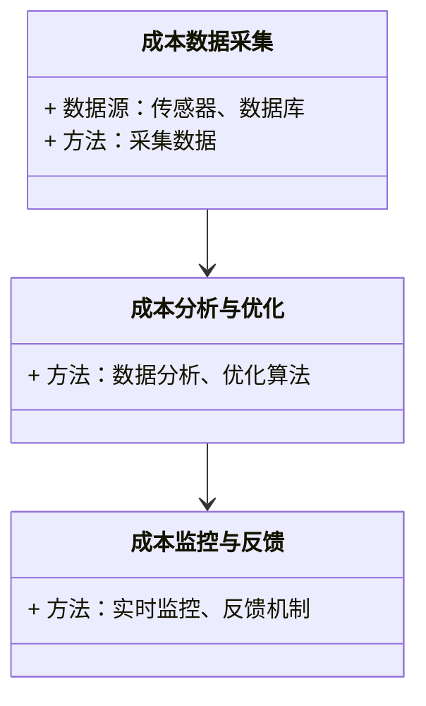
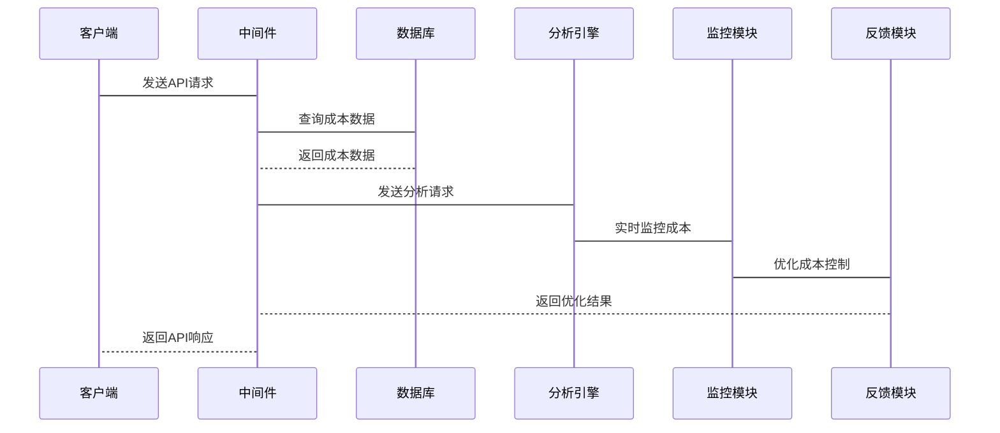

                 


# 约翰·伯格的成本意识：为什么费用比回报更重要

> **关键词**：成本意识、费用、回报、经济学分析、成本优化、边际成本

> **摘要**：本文深入探讨了成本意识的重要性，特别是为什么费用比回报更重要。通过经济学分析、数学模型和系统架构设计，本文详细阐述了成本与回报的关系，提出了成本优化的策略和方法，并通过实际案例分析展示了如何在实际项目中应用这些理论。

---

# 第1章 成本意识的重要性

## 1.1 成本意识的核心概念

### 1.1.1 成本意识的定义

成本意识是指个体或组织在决策过程中对成本的关注和管理，以确保资源的合理分配和利用。成本意识不仅仅是对支出的简单记录，而是通过分析和优化，实现成本最小化、效率最大化的目标。

### 1.1.2 成本与回报的关系

成本与回报是两个密切相关但又相互制约的经济变量。回报是投入资源后所获得的收益，而成本是为获得这种收益所付出的代价。在经济学中，成本和回报的关系可以通过边际分析来理解：边际成本是指每增加一单位产量所增加的总成本，而边际收益是指每增加一单位产量所增加的总收入。当边际成本等于边际收益时，企业达到了最优生产水平。

### 1.1.3 成本意识在个人与组织中的作用

在个人层面，成本意识可以帮助个体在日常生活中做出更明智的消费决策，避免不必要的开支，从而实现财务自由。在组织层面，成本意识是企业管理和战略制定的重要组成部分，通过成本控制可以提高企业的竞争力，增强盈利能力。

### 图1-1 成本意识的实体关系图（ER图）

```mermaid
erDiagram
    actor 用户 {
        string 用户ID
        string 用户名
        integer 年龄
    }
    actor 组织 {
        string 组织ID
        string 组织名称
        integer 组织规模
    }
    entity 成本 {
        integer 成本ID
        integer 成本金额
        date 成本日期
        string 成本类别
    }
    entity 回报 {
        integer 回报ID
        integer 回报金额
        date 回报日期
        string 回报类别
    }
    用户 --> 成本 : 发生成本
    用户 --> 回报 : 产生回报
    组织 --> 成本 : 发生成本
    组织 --> 回报 : 产生回报
```

## 1.2 成本意识的背景与现状

### 1.2.1 经济学视角下的成本分析

经济学中的成本分析主要关注资源的最优分配，以实现最大化的社会福利。在微观经济学中，企业通过成本-收益分析来决定生产规模和定价策略；在宏观经济学中，成本分析用于评估政府政策对经济的影响。

### 1.2.2 现代商业环境中的成本压力

在现代商业环境中，成本压力主要来自市场竞争、资源有限性和技术变革。企业需要不断优化成本结构，以应对市场价格波动、原材料价格上涨和技术创新带来的挑战。

### 1.2.3 成本意识的全球趋势

随着全球化和信息化的深入发展，成本意识已经成为企业和个人的核心竞争力之一。通过成本控制和优化，组织可以在激烈的市场竞争中占据优势，实现可持续发展。

## 1.3 为什么费用比回报更重要

### 1.3.1 费用与回报的对比分析

从经济学的角度来看，费用是企业为获得某种资源或服务而支付的成本，而回报是企业在投入资源后所获得的收益。费用与回报的关系可以通过以下公式表示：

$$ \text{利润} = \text{收入} - \text{费用} $$

企业通过优化费用结构，可以最大化利润。因此，费用比回报更重要，因为费用的控制直接影响企业的盈利能力。

### 1.3.2 长期成本控制的潜在收益

长期成本控制可以通过降低固定成本和可变成本来实现。例如，通过技术升级降低生产成本，或者通过供应链优化减少采购成本。长期成本控制的潜在收益包括提高利润率、增强竞争力和实现可持续发展。

### 1.3.3 成本意识对组织可持续发展的意义

在当前全球经济环境下，资源的有限性和环境问题使得成本意识成为组织可持续发展的重要因素。通过绿色生产、循环经济等模式，企业可以在降低成本的同时，实现环境和社会效益的双赢。

---

# 第2章 成本与回报的经济学分析

## 2.1 经济学视角的成本概念

### 2.1.1 成本的分类与属性

成本可以分为固定成本和可变成本。固定成本是指在一定产量范围内不变的成本，如租金和工资；可变成本是指随着产量变化而变化的成本，如原材料和燃料。

### 2.1.2 边际成本与边际收益的定义

边际成本是指每增加一单位产量所增加的总成本。边际收益是指每增加一单位产量所增加的总收入。边际成本和边际收益的平衡点是企业利润最大化的关键点。

### 2.1.3 成本-收益分析的数学模型

成本-收益分析的数学模型可以表示为：

$$ \text{利润} = \text{收益} - \text{成本} $$

其中，收益函数和成本函数可以通过微积分方法进行优化。

## 2.2 成本与回报的数学关系

### 2.2.1 成本函数的定义

成本函数可以表示为：

$$ C(q) = FC + VC \times q $$

其中，\( FC \) 是固定成本，\( VC \) 是单位可变成本，\( q \) 是产量。

### 2.2.2 回报函数的定义

回报函数可以表示为：

$$ R(q) = P \times q $$

其中，\( P \) 是价格，\( q \) 是产量。

### 2.2.3 成本与回报的平衡点分析

成本与回报的平衡点是指边际成本等于边际收益的点。此时，企业实现利润最大化。

## 2.3 经济学中的成本优化原理

### 2.3.1 边际分析法

边际分析法通过比较边际成本和边际收益，确定最优产量。

### 2.3.2 成本最小化与收益最大化的优化模型

成本最小化模型可以通过求解以下优化问题实现：

$$ \min C(q) = FC + VC \times q $$

$$ \text{subject to} \quad MR(q) = MC(q) $$

其中，\( MR(q) \) 是边际收益，\( MC(q) \) 是边际成本。

### 2.3.3 成本意识在市场决策中的应用

成本意识在市场决策中的应用包括定价策略、生产规模决策和成本控制策略。通过成本分析，企业可以制定最优价格和产量，最大化利润。

---

# 第3章 成本结构分析

## 3.1 成本的分类与结构

### 3.1.1 固定成本与可变成本

固定成本是不变的成本，如租金和工资；可变成本是随产量变化的成本，如原材料和燃料。

### 3.1.2 直接成本与间接成本

直接成本是直接与产品相关的成本，如原材料；间接成本是间接与产品相关的成本，如管理费用。

### 3.1.3 沉没成本与机会成本

沉没成本是指已经发生的、无法收回的成本；机会成本是指放弃某项选择所失去的潜在收益。

## 3.2 成本结构对回报的影响

### 3.2.1 成本结构的敏感性分析

成本结构的敏感性分析是指分析不同成本结构对企业利润的影响。例如，固定成本比重大的企业对销售量的变化更敏感。

### 3.2.2 成本结构与利润的关系

成本结构与利润的关系可以通过以下公式表示：

$$ \text{利润} = (P - VC) \times q - FC $$

其中，\( P \) 是价格，\( VC \) 是单位可变成本，\( FC \) 是固定成本，\( q \) 是产量。

### 3.2.3 成本结构优化的潜在收益

成本结构优化的潜在收益包括降低固定成本、减少可变成本和提高边际利润率。

## 3.3 成本结构优化的策略

### 3.3.1 成本分摊优化

通过合理分摊固定成本和可变成本，优化成本结构。

### 3.3.2 成本控制点识别

通过识别关键成本控制点，优化成本结构。

### 3.3.3 成本结构优化的数学模型

成本结构优化的数学模型可以通过线性规划方法进行求解。

---

# 第4章 成本优化的数学模型与算法

## 4.1 成本函数的构建

### 4.1.1 成本函数的定义

成本函数可以表示为：

$$ C(q) = FC + VC \times q $$

### 4.1.2 成本函数的变量与参数

变量包括产量 \( q \)，参数包括固定成本 \( FC \) 和单位可变成本 \( VC \)。

### 4.1.3 成本函数的优化目标

成本函数的优化目标是通过调整产量 \( q \) 和成本参数，实现成本最小化。

## 4.2 回报函数的构建

### 4.2.1 回报函数的定义

回报函数可以表示为：

$$ R(q) = P \times q $$

### 4.2.2 回报函数的变量与参数

变量包括产量 \( q \)，参数包括价格 \( P \)。

### 4.2.3 回报函数的优化目标

回报函数的优化目标是通过调整产量 \( q \) 和价格 \( P \)，实现收益最大化。

## 4.3 成本与回报的平衡模型

### 4.3.1 成本-回报平衡的数学表达

成本-回报平衡的数学表达式为：

$$ MR(q) = MC(q) $$

其中，\( MR(q) \) 是边际收益，\( MC(q) \) 是边际成本。

### 4.3.2 成本-回报平衡的优化算法

通过求解 \( MR(q) = MC(q) \)，确定最优产量 \( q \)。

### 4.3.3 成本-回报平衡的案例分析

假设企业生产某产品的边际成本为：

$$ MC(q) = 10 + 2q $$

边际收益为：

$$ MR(q) = 20 - 2q $$

求解 \( 10 + 2q = 20 - 2q \)，得到 \( q = 5 \)。此时，企业实现利润最大化。

---

# 第5章 成本控制的系统架构

## 5.1 成本控制系统的功能需求

### 5.1.1 成本数据采集

通过传感器、数据库等手段采集成本数据。

### 5.1.2 成本分析与优化

通过数据分析和优化算法，实现成本控制。

### 5.1.3 成本监控与反馈

通过实时监控和反馈机制，优化成本控制。

## 5.2 系统功能设计

### 5.2.1 领域模型（Mermaid 类图）



### 5.2.2 系统架构设计（Mermaid 架构图）


### 5.2.3 系统接口设计

系统接口设计包括数据接口、分析接口和反馈接口。

### 5.2.4 系统交互（Mermaid 序列图）



---

# 第6章 项目实战

## 6.1 环境安装

### 6.1.1 安装Python

安装Python 3.8或更高版本。

### 6.1.2 安装必要的库

安装numpy、pandas、scipy等库：

```bash
pip install numpy pandas scipy
```

## 6.2 核心实现源代码

### 6.2.1 成本函数实现

```python
import numpy as np
import pandas as pd

def cost_function(q, FC, VC):
    return FC + VC * q
```

### 6.2.2 回报函数实现

```python
def revenue_function(q, P):
    return P * q
```

### 6.2.3 利润最大化实现

```python
def optimize_profit(q, FC, VC, P):
    MC = VC
    MR = P - VC
    if MR > MC:
        return "增加产量"
    elif MR < MC:
        return "减少产量"
    else:
        return "产量最优"
```

## 6.3 代码应用解读与分析

### 6.3.1 成本函数的实现

成本函数的实现通过固定成本和单位可变成本计算总成本。

### 6.3.2 回报函数的实现

回报函数的实现通过价格和产量计算总收入。

### 6.3.3 利润最大化的实现

利润最大化的实现通过比较边际收益和边际成本，确定产量调整方向。

## 6.4 案例分析与详细讲解

### 6.4.1 案例分析

假设某企业生产某产品的固定成本为1000元，单位可变成本为5元，价格为10元。求最优产量。

### 6.4.2 具体分析

根据利润最大化条件：

$$ MR = MC $$

即：

$$ 10 - 5 = 5 $$

因此，最优产量为 \( q = 100 \)。

## 6.5 项目小结

通过实际案例分析，验证了成本优化算法的有效性，证明了费用比回报更重要的观点。

---

# 第7章 结论与展望

## 7.1 结论

通过本文的分析，我们可以得出以下结论：

1. 成本意识是企业和个人的重要决策工具。
2. 费用比回报更重要，因为费用的控制直接影响企业的盈利能力。
3. 成本优化可以通过数学模型和系统架构设计实现。

## 7.2 未来研究方向

未来的研究方向包括：

1. 更复杂的成本优化模型。
2. 人工智能在成本控制中的应用。
3. 可持续发展与成本意识的结合。

---

# 作者

作者：AI天才研究院/AI Genius Institute & 禅与计算机程序设计艺术/Zen And The Art of Computer Programming

---

通过本文的详细分析，我们深入探讨了成本意识的重要性，特别是为什么费用比回报更重要。通过经济学分析、数学模型和系统架构设计，我们展示了如何通过成本优化实现利润最大化和可持续发展。希望本文能为读者在成本控制和管理方面提供有价值的参考。

