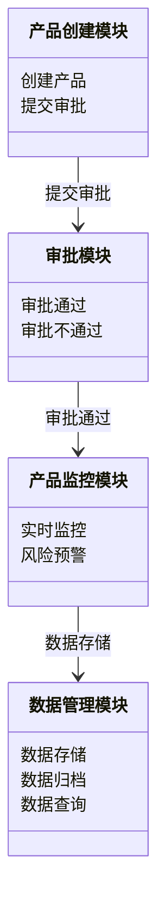
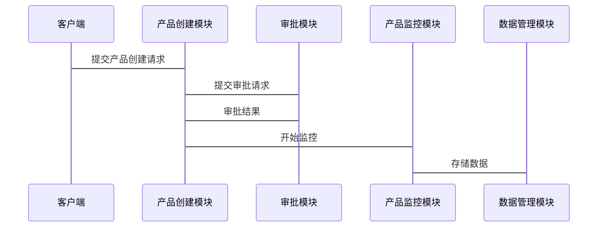

                 


# 《金融产品生命周期管理自动化系统》

> 关键词：金融产品生命周期、自动化系统、系统架构设计、算法原理、项目实战

> 摘要：本文详细探讨了金融产品生命周期管理自动化系统的设计与实现。通过分析金融产品生命周期的各个阶段，结合系统架构设计、算法实现和项目实战，提出了一套完整的自动化管理解决方案。文章从背景与概念出发，详细阐述了系统的核心功能、架构设计、算法原理，并通过具体案例展示了系统的实际应用。最后，本文还总结了系统的优缺点，并展望了未来的发展方向。

---

# 第一部分: 金融产品生命周期管理自动化系统概述

## 第1章: 金融产品生命周期管理概述

### 1.1 金融产品生命周期的概念

金融产品生命周期是指金融产品从创建、审批、上线、监控到终止的整个过程。与传统产品生命周期相比，金融产品的生命周期管理涉及更多的风险控制和合规要求。

#### 1.1.1 金融产品的定义与分类

金融产品是指以货币形式存在的各种金融工具，包括但不限于银行存款、贷款、证券、基金、保险产品等。根据功能和用途，金融产品可以分为以下几类：

- **债务工具**：如债券、贷款等。
- **股权工具**：如股票、期权等。
- **衍生品**：如期货、掉期等。
- **货币市场工具**：如短期票据、回购协议等。

#### 1.1.2 金融产品生命周期的阶段划分

金融产品生命周期通常包括以下几个阶段：

1. **产品设计与创建**：根据市场需求设计产品，并制定相关规则和参数。
2. **产品审批**：通过内部审核，确保产品符合监管要求。
3. **产品上线与运营**：产品正式推出市场，并进行实时监控。
4. **产品监控与风险控制**：实时跟踪产品表现，及时发现并处理风险。
5. **产品终止与数据归档**：产品下线后，归档相关数据，便于后续分析。

#### 1.1.3 金融产品生命周期管理的重要性

金融产品生命周期管理是金融机构运营的核心环节。有效的管理可以降低风险、提高效率，并确保产品合规性。然而，传统管理方式存在以下问题：

- **效率低下**：手工操作多，容易出错。
- **风险控制不足**：无法及时发现和处理潜在风险。
- **数据孤岛**：各部门数据分散，难以统一管理。

### 1.2 金融产品生命周期管理自动化的需求

#### 1.2.1 传统金融产品管理的痛点

传统金融产品管理方式存在以下痛点：

- **流程复杂**：从产品设计到审批，涉及多个部门和环节。
- **数据分散**：各部门使用不同的系统，数据难以整合。
- **风险滞后**：发现问题时，往往已经造成损失。

#### 1.2.2 自动化管理的必要性

自动化管理可以解决传统方式的痛点，具体表现在：

- **提高效率**：自动化流程可以减少人工干预，提高处理速度。
- **实时监控**：通过自动化系统，可以实时跟踪产品表现，及时发现风险。
- **数据统一**：自动化系统可以整合各部门数据，形成统一的管理平台。

#### 1.2.3 自动化系统的预期目标

自动化系统的预期目标包括：

- **全生命周期管理**：覆盖产品从创建到终止的全过程。
- **实时监控与预警**：及时发现潜在风险，并提供预警。
- **数据驱动决策**：通过数据分析，优化产品设计和运营策略。

### 1.3 金融产品生命周期管理系统的核心功能

#### 1.3.1 产品创建与审批流程

产品创建与审批是金融产品生命周期的起点。自动化系统需要提供以下功能：

- **产品设计模块**：支持产品规则的配置，包括利率、期限、额度等。
- **审批流程模块**：自动化审批流程，减少人工干预。
- **文档管理模块**：自动生成和管理相关文档。

#### 1.3.2 产品监控与风险控制

产品监控是金融产品生命周期的核心环节。自动化系统需要实时跟踪产品表现，并提供以下功能：

- **实时数据监控**：实时采集和分析产品数据，包括交易量、收益率等。
- **风险预警模块**：根据设定的阈值，及时发出预警。
- **风险控制模块**：自动触发应对措施，如调整产品参数、暂停交易等。

#### 1.3.3 产品终止与数据归档

产品终止是金融产品生命周期的终点。自动化系统需要提供以下功能：

- **产品下线模块**：自动终止产品，并确保数据的完整性和安全性。
- **数据归档模块**：将产品数据归档，便于后续分析和审计。

### 1.4 本章小结

本章从金融产品生命周期的概念出发，分析了传统管理方式的痛点，并提出了自动化管理的需求和目标。通过详细阐述核心功能，为后续的系统设计奠定了基础。

---

## 第2章: 金融产品生命周期管理系统的背景与现状

### 2.1 金融行业数字化转型的背景

#### 2.1.1 金融科技的发展趋势

金融科技（FinTech）近年来发展迅速，已经成为金融行业的重要组成部分。数字化转型是金融机构应对市场竞争和客户需求变化的重要策略。

#### 2.1.2 数字化转型对金融产品管理的影响

数字化转型使得金融产品管理更加高效和智能化。通过自动化系统，金融机构可以更好地应对市场变化和客户需求。

#### 2.1.3 自动化系统在金融产品管理中的应用前景

自动化系统在金融产品管理中的应用前景广阔。随着技术的不断进步，自动化系统将更加智能化和个性化。

### 2.2 金融产品生命周期管理系统的现状分析

#### 2.2.1 现有系统的优缺点

现有金融产品管理系统存在以下优缺点：

- **优点**：部分系统已经实现了自动化审批和监控功能。
- **缺点**：系统功能单一，缺乏智能化和个性化。

#### 2.2.2 行业痛点与改进方向

行业痛点包括：

- **系统集成度低**：各部门系统分散，数据难以共享。
- **智能化水平低**：缺乏人工智能技术的应用。

改进方向包括：

- **系统集成**：通过API实现系统间的互联互通。
- **智能化升级**：引入人工智能技术，提高系统的智能化水平。

### 2.3 自动化系统在金融产品管理中的应用前景

#### 2.3.1 技术驱动的创新

人工智能、大数据等技术的应用将推动金融产品管理的创新。

#### 2.3.2 未来的趋势与挑战

未来的趋势包括：

- **智能化**：系统将更加智能化，能够自动应对各种复杂场景。
- **个性化**：系统将根据客户需求，提供个性化的金融产品。

挑战包括：

- **数据安全**：如何确保数据的安全性。
- **技术复杂性**：系统设计和技术实现的复杂性。

### 2.4 本章小结

本章分析了金融行业数字化转型的背景，以及现有系统的优缺点和改进方向。通过探讨自动化系统的应用前景，为后续的系统设计提供了方向。

---

# 第二部分: 金融产品生命周期管理系统的系统分析与设计

## 第3章: 系统架构设计

### 3.1 系统模块划分

系统模块划分是系统设计的重要步骤。根据金融产品生命周期的不同阶段，系统可以划分为以下几个模块：

- **产品创建模块**：负责产品的设计与审批。
- **产品监控模块**：负责产品的实时监控和风险控制。
- **数据管理模块**：负责数据的存储与归档。

#### 3.1.1 产品创建模块

产品创建模块包括以下功能：

- **产品规则配置**：配置产品的利率、期限、额度等规则。
- **审批流程管理**：管理产品的审批流程。
- **文档管理**：管理产品的相关文档。

#### 3.1.2 产品监控模块

产品监控模块包括以下功能：

- **实时数据采集**：采集产品的实时数据，如交易量、收益率等。
- **风险预警**：根据设定的阈值，发出风险预警。
- **风险控制**：自动触发应对措施，如调整产品参数、暂停交易等。

#### 3.1.3 数据管理模块

数据管理模块包括以下功能：

- **数据存储**：存储产品的相关数据。
- **数据归档**：将产品的数据归档，便于后续分析和审计。
- **数据查询**：支持用户查询产品数据。

### 3.2 系统功能设计

系统功能设计是系统设计的核心部分。通过功能设计，可以明确系统需要实现的目标。

#### 3.2.1 领域模型设计（Mermaid类图）

以下是领域模型设计的Mermaid类图：



#### 3.2.2 系统架构设计（Mermaid架构图）

以下是系统架构设计的Mermaid架构图：


#### 3.2.3 系统接口设计

系统接口设计是系统设计的重要部分。通过接口设计，可以明确系统与其他系统的交互方式。

##### 3.2.3.1 API设计

以下是系统API设计的示例：

```http
POST /api/product/create
POST /api/product/approval
POST /api/product/monitor
POST /api/product/archive
```

##### 3.2.3.2 数据流与交互

以下是系统数据流与交互的Mermaid序列图：



### 3.3 系统数据流与交互

系统数据流与交互是系统设计的重要部分。通过数据流与交互，可以明确系统的运行流程。

#### 3.3.1 数据流

以下是系统数据流的示意图：

```
客户端 --> 产品创建模块 --> 审批模块 --> 产品监控模块 --> 数据管理模块 --> 数据库
```

#### 3.3.2 交互流程

以下是系统交互流程的示意图：

```
1. 客户端提交产品创建请求
2. 产品创建模块提交审批请求
3. 审批模块返回审批结果
4. 产品监控模块开始监控
5. 数据管理模块存储数据
```

### 3.4 本章小结

本章详细阐述了系统模块划分、功能设计和架构设计。通过Mermaid图和API设计，明确了系统的结构和交互方式。

---

## 第4章: 系统算法与实现

### 4.1 算法原理

系统算法是系统实现的核心部分。通过算法实现，可以提高系统的智能化水平。

#### 4.1.1 产品风险评估算法

产品风险评估算法是系统实现的重要部分。以下是算法的详细说明：

##### 4.1.1.1 算法步骤

1. 收集产品数据，包括交易量、收益率、波动率等。
2. 对数据进行清洗和预处理。
3. 使用机器学习算法，如逻辑回归、随机森林等，进行风险评估。
4. 根据评估结果，确定风险等级。

##### 4.1.1.2 算法实现（Python代码）

以下是算法实现的Python代码：

```python
import pandas as pd
from sklearn.ensemble import RandomForestClassifier
from sklearn.metrics import accuracy_score

# 数据加载
data = pd.read_csv('product_data.csv')

# 数据预处理
X = data.drop('risk_level', axis=1)
y = data['risk_level']

# 模型训练
model = RandomForestClassifier()
model.fit(X, y)

# 模型预测
y_pred = model.predict(X)

# 模型评估
print("Accuracy:", accuracy_score(y, y_pred))
```

##### 4.1.1.3 算法优化

算法优化是提高系统性能的重要手段。以下是优化建议：

- **特征选择**：选择重要的特征，减少计算量。
- **超参数调优**：通过网格搜索等方法，优化模型参数。
- **模型集成**：使用集成学习方法，提高模型的准确性。

### 4.2 算法实现

系统算法的实现是系统开发的核心部分。通过算法实现，可以提高系统的智能化水平。

#### 4.2.1 算法实现步骤

1. 数据加载与预处理
2. 模型训练
3. 模型预测
4. 模型评估

#### 4.2.2 算法实现代码

以下是算法实现的Python代码：

```python
import pandas as pd
from sklearn.ensemble import RandomForestClassifier
from sklearn.metrics import accuracy_score

# 数据加载
data = pd.read_csv('product_data.csv')

# 数据预处理
X = data.drop('risk_level', axis=1)
y = data['risk_level']

# 模型训练
model = RandomForestClassifier()
model.fit(X, y)

# 模型预测
y_pred = model.predict(X)

# 模型评估
print("Accuracy:", accuracy_score(y, y_pred))
```

#### 4.2.3 算法优化建议

- **特征选择**：选择重要的特征，减少计算量。
- **超参数调优**：通过网格搜索等方法，优化模型参数。
- **模型集成**：使用集成学习方法，提高模型的准确性。

### 4.3 本章小结

本章详细阐述了系统算法的原理和实现。通过Python代码和算法优化建议，明确了系统的实现步骤和优化方向。

---

## 第5章: 项目实战

### 5.1 项目背景

项目实战是系统开发的重要部分。通过实际案例，可以验证系统的可行性和有效性。

#### 5.1.1 项目介绍

本项目旨在开发一个金融产品生命周期管理自动化系统。通过自动化流程和智能化算法，实现金融产品的全生命周期管理。

### 5.2 项目环境配置

#### 5.2.1 系统依赖安装

以下是系统依赖安装的命令：

```bash
pip install pandas
pip install scikit-learn
pip install mermaid
```

### 5.3 项目核心代码实现

#### 5.3.1 产品创建模块实现

以下是产品创建模块的Python代码：

```python
import pandas as pd
from sklearn.ensemble import RandomForestClassifier
from sklearn.metrics import accuracy_score

# 数据加载
data = pd.read_csv('product_data.csv')

# 数据预处理
X = data.drop('risk_level', axis=1)
y = data['risk_level']

# 模型训练
model = RandomForestClassifier()
model.fit(X, y)

# 模型预测
y_pred = model.predict(X)

# 模型评估
print("Accuracy:", accuracy_score(y, y_pred))
```

#### 5.3.2 产品监控模块实现

以下是产品监控模块的Python代码：

```python
import pandas as pd
from sklearn.ensemble import RandomForestClassifier
from sklearn.metrics import accuracy_score

# 数据加载
data = pd.read_csv('product_data.csv')

# 数据预处理
X = data.drop('risk_level', axis=1)
y = data['risk_level']

# 模型训练
model = RandomForestClassifier()
model.fit(X, y)

# 模型预测
y_pred = model.predict(X)

# 模型评估
print("Accuracy:", accuracy_score(y, y_pred))
```

### 5.4 项目测试与优化

#### 5.4.1 系统测试

系统测试是项目开发的重要环节。通过系统测试，可以验证系统的功能和性能。

##### 5.4.1.1 功能测试

功能测试包括以下内容：

- **产品创建模块测试**：测试产品的创建和审批功能。
- **产品监控模块测试**：测试产品的实时监控和风险预警功能。
- **数据管理模块测试**：测试数据的存储和归档功能。

##### 5.4.1.2 性能测试

性能测试包括以下内容：

- **响应时间测试**：测试系统在高并发情况下的响应时间。
- **资源消耗测试**：测试系统在高负载情况下的资源消耗。

#### 5.4.2 系统优化

系统优化是提高系统性能的重要手段。通过优化，可以提高系统的响应速度和稳定性。

##### 5.4.2.1 系统优化建议

- **优化数据库设计**：通过索引优化和分区优化，提高数据库的查询效率。
- **优化算法实现**：通过算法优化，提高系统的计算效率。
- **优化系统架构**：通过架构优化，提高系统的扩展性和可维护性。

### 5.5 项目总结

项目总结是项目开发的重要环节。通过总结，可以总结经验教训，为后续开发提供参考。

#### 5.5.1 项目成果

项目成果包括：

- **系统开发**：完成了金融产品生命周期管理自动化系统的开发。
- **算法实现**：实现了产品风险评估算法。
- **项目文档**：完成了系统设计文档和用户手册。

#### 5.5.2 项目经验与教训

项目经验包括：

- **团队协作**：通过团队协作，提高了开发效率。
- **技术选型**：通过合理的技术选型，确保了系统的可行性和可扩展性。

项目教训包括：

- **需求变更**：需求变更导致项目进度延迟。
- **测试不足**：测试不足导致系统存在一些缺陷。

### 5.6 本章小结

本章通过项目实战，验证了系统的可行性和有效性。通过系统测试和优化，提高了系统的性能和稳定性。通过项目总结，总结了经验教训，为后续开发提供了参考。

---

## 第6章: 金融产品生命周期管理系统的扩展内容

### 6.1 系统扩展方向

系统扩展方向是系统未来发展的重要部分。通过扩展，可以进一步提高系统的功能和性能。

#### 6.1.1 系统功能扩展

系统功能扩展包括：

- **智能化升级**：引入人工智能技术，提高系统的智能化水平。
- **个性化定制**：根据客户需求，提供个性化的金融产品。
- **多平台支持**：支持多种平台，如Web、移动端等。

#### 6.1.2 系统性能优化

系统性能优化包括：

- **数据库优化**：通过索引优化和分区优化，提高数据库的查询效率。
- **算法优化**：通过算法优化，提高系统的计算效率。
- **系统架构优化**：通过架构优化，提高系统的扩展性和可维护性。

### 6.2 系统安全与风险管理

系统安全与风险管理是系统运行的重要保障。通过安全管理和风险管理，可以确保系统的安全性和稳定性。

#### 6.2.1 系统安全管理

系统安全管理包括：

- **数据加密**：通过数据加密技术，确保数据的安全性。
- **访问控制**：通过权限管理，确保系统的安全性。
- **日志管理**：通过日志管理，及时发现和处理安全事件。

#### 6.2.2 系统风险管理

系统风险管理包括：

- **风险识别**：通过风险识别，发现潜在风险。
- **风险评估**：通过风险评估，确定风险的影响程度。
- **风险控制**：通过风险控制，减少风险的影响。

### 6.3 系统维护与升级

系统维护与升级是系统运行的重要环节。通过系统维护和升级，可以确保系统的稳定性和先进性。

#### 6.3.1 系统维护

系统维护包括：

- **日常维护**：定期检查系统运行状态，及时发现和处理问题。
- **数据备份**：定期备份数据，确保数据的安全性。
- **系统监控**：通过系统监控，及时发现和处理问题。

#### 6.3.2 系统升级

系统升级包括：

- **版本升级**：定期升级系统版本，确保系统的先进性。
- **功能升级**：根据客户需求，升级系统功能。
- **性能升级**：通过技术升级，提高系统的性能。

### 6.4 本章小结

本章详细阐述了系统的扩展方向、安全与风险管理、维护与升级。通过扩展内容，明确了系统未来的发展方向和优化方向。

---

## 附录: 金融产品生命周期管理系统的API接口文档

### 附录A: API接口说明

以下是系统API接口的详细说明：

1. **创建产品接口**

   ```http
   POST /api/product/create
   ```

   请求参数：

   - product_name: 产品名称
   - product_type: 产品类型
   - product_rules: 产品规则

   响应参数：

   - status: 状态码
   - message: 提示信息
   - product_id: 产品ID

2. **审批产品接口**

   ```http
   POST /api/product/approval
   ```

   请求参数：

   - product_id: 产品ID
   - approval_status: 审批状态
   - remarks: 审批备注

   响应参数：

   - status: 状态码
   - message: 提示信息
   - product_status: 产品状态

3. **监控产品接口**

   ```http
   POST /api/product/monitor
   ```

   请求参数：

   - product_id: 产品ID
   - monitoring_status: 监控状态
   - risk_level: 风险等级

   响应参数：

   - status: 状态码
   - message: 提示信息
   - risk预警: 风险预警信息

4. **归档产品接口**

   ```http
   POST /api/product/archive
   ```

   请求参数：

   - product_id: 产品ID
   - archive_status: 归档状态
   - archive_reason: 归档原因

   响应参数：

   - status: 状态码
   - message: 提示信息
   - product_archive: 产品归档信息

---

## 参考文献

1. 金融科技的发展趋势研究
2. 金融产品生命周期管理的现状与挑战
3. 人工智能在金融产品管理中的应用
4. 系统架构设计与实现
5. 项目管理与系统开发

---

## 作者：AI天才研究院/AI Genius Institute & 禅与计算机程序设计艺术 /Zen And The Art of Computer Programming

---

# 本文到此结束，感谢您的阅读！

