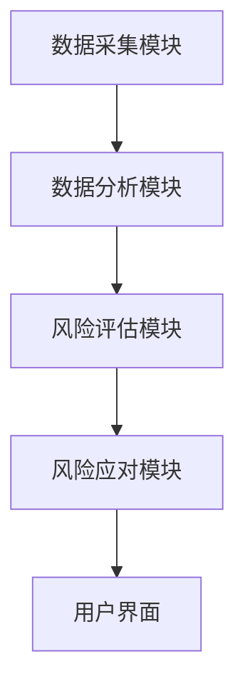
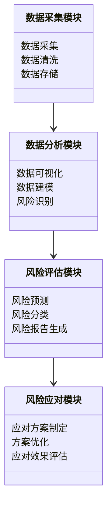
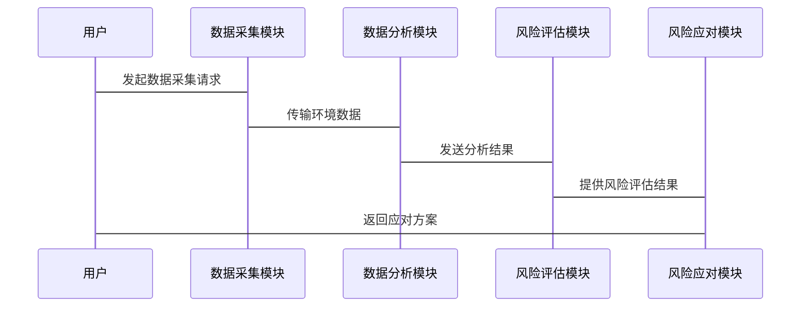

                 


# AI agents在公司环境风险评估中的应用

> 关键词：AI代理, 环境风险评估, 风险管理, 人工智能, 企业风险管理

> 摘要：本文详细探讨了AI代理在公司环境风险评估中的应用，从基本概念到算法原理，再到系统架构和项目实战，全面分析了AI代理在环境风险管理中的核心作用及其对企业决策的支持能力。文章结合实际案例，深入解析了AI代理如何通过智能化手段提升企业环境风险管理的效率和准确性，为企业构建智能化的风险评估体系提供了理论依据和实践指导。

---

# 第一部分: AI代理与环境风险评估的背景与基础

## 第1章: AI代理与环境风险评估概述

### 1.1 AI代理的基本概念

#### 1.1.1 AI代理的定义与特点
AI代理（Artificial Intelligence Agent）是一种能够感知环境、自主决策并采取行动的智能体。其特点包括：
- **自主性**：无需外部干预，自主完成任务。
- **反应性**：能够实时感知环境变化并做出响应。
- **目标导向**：基于预设目标或学习目标进行决策。
- **可扩展性**：能够适应不同规模和复杂度的任务。

#### 1.1.2 环境风险评估的基本概念
环境风险评估是对企业运营过程中可能面临的环境风险进行识别、量化和应对的系统性过程。主要关注点包括：
- 环境污染风险
- 资源消耗风险
- 气候变化风险
- 社会责任风险

#### 1.1.3 AI代理在环境风险评估中的作用
AI代理通过智能化手段，能够显著提升环境风险评估的效率和准确性。其主要作用包括：
- **数据收集与处理**：实时采集环境数据，进行清洗和预处理。
- **风险识别**：基于历史数据和实时信息，识别潜在环境风险。
- **风险量化**：利用数学模型对风险进行量化评估。
- **风险应对**：提供决策支持，优化风险应对策略。

### 1.2 AI代理与环境风险评估的演进

#### 1.2.1 传统环境风险评估方法
传统的环境风险评估主要依赖于人工分析和统计方法，存在以下问题：
- **效率低下**：数据处理和分析耗时长，难以应对海量数据。
- **准确性有限**：依赖人工经验，存在主观性和片面性。
- **响应速度慢**：面对突发环境事件，难以快速做出反应。

#### 1.2.2 AI代理技术的引入
随着AI技术的快速发展，AI代理逐渐被引入环境风险评估领域。其优势体现在：
- **智能化**：能够自动处理数据，发现潜在风险。
- **实时性**：实时监控环境数据，快速响应。
- **准确性**：通过机器学习算法，提升风险评估的准确性。

#### 1.2.3 环境风险评估的智能化转型
智能化转型的核心在于将AI代理与传统风险评估方法相结合，构建智能化的风险评估体系。这一过程包括：
1. 数据采集与整合
2. 智能化分析与建模
3. 风险预测与决策支持
4. 实时监控与动态调整

### 1.3 AI代理在企业中的应用背景

#### 1.3.1 企业环境风险的主要来源
企业环境风险主要来源于以下几个方面：
- **环境污染**：生产过程中产生的废气、废水、固体废物等。
- **资源消耗**：能源、水资源等的过度消耗。
- **气候变化**：极端天气事件对企业运营的影响。
- **社会责任**：公众对企业环境表现的关注和要求。

#### 1.3.2 AI代理在环境风险管理中的优势
AI代理在环境风险管理中的优势包括：
- **高效性**：能够快速处理大量数据，提高风险评估效率。
- **准确性**：通过机器学习算法，提升风险预测的准确性。
- **实时性**：实时监控环境数据，快速响应突发风险。
- **可扩展性**：能够适应不同规模和复杂度的环境风险管理需求。

#### 1.3.3 企业采用AI代理的风险与挑战
尽管AI代理在环境风险管理中具有诸多优势，但在实际应用中也面临一些挑战：
- **数据隐私**：环境数据涉及企业机密，数据隐私问题需要妥善处理。
- **技术门槛**：AI代理的开发和应用需要较高的技术门槛。
- **成本问题**：AI代理的开发和维护成本较高，中小企业可能难以负担。

### 1.4 本章小结
本章主要介绍了AI代理的基本概念、环境风险评估的核心内容以及AI代理在环境风险管理中的作用和优势。同时，也探讨了企业在采用AI代理进行环境风险管理时可能面临的挑战。

---

# 第二部分: AI代理与环境风险评估的核心概念

## 第2章: AI代理与环境风险评估的核心概念

### 2.1 AI代理的核心原理

#### 2.1.1 AI代理的基本原理
AI代理通过感知环境、处理信息、制定决策并采取行动来完成特定任务。其核心流程包括：
1. **感知环境**：通过传感器或数据源获取环境信息。
2. **信息处理**：对获取的数据进行清洗、分析和建模。
3. **决策制定**：基于分析结果制定应对策略。
4. **行动执行**：根据决策结果采取相应行动。

#### 2.1.2 知识表示与推理
知识表示是AI代理的核心能力之一，主要通过以下方式实现：
- **规则表示**：利用if-then规则表示知识。
- **本体论表示**：通过本体论建模实现知识的语义表示。
- **概率推理**：基于概率论进行不确定性推理。

#### 2.1.3 行为决策机制
行为决策机制是AI代理的关键组成部分，主要包括：
- **基于规则的决策**：根据预设规则进行决策。
- **基于案例的推理**：通过类比历史案例进行决策。
- **基于模型的推理**：利用数学模型进行决策。

### 2.2 环境风险评估的数学模型

#### 2.2.1 风险评估的基本公式
环境风险评估的基本公式可以表示为：
$$
\text{风险值} = f(\text{风险因素}, \text{影响程度}, \text{概率分布})
$$
其中，$f$表示风险评估函数，$\text{风险因素}$表示影响环境风险的具体因素，$\text{影响程度}$表示风险因素对环境的影响程度，$\text{概率分布}$表示风险发生的概率。

#### 2.2.2 风险评估的指标体系
环境风险评估的指标体系通常包括以下几个方面：
- **环境影响指标**：如碳排放量、水资源消耗量等。
- **经济影响指标**：如治理成本、损失价值等。
- **社会影响指标**：如公众满意度、社会责任履行情况等。

#### 2.2.3 风险评估的层次分析法（AHP）
层次分析法（AHP）是一种常用的决策分析方法，可以将复杂的决策问题分解为多个层次，通过权重分配和综合评估来确定最优方案。其基本步骤包括：
1. **构建层次结构**：将决策问题分解为目标层、准则层和方案层。
2. **确定各层权重**：通过专家评分法确定各层的权重。
3. **计算综合得分**：根据各层权重计算方案的综合得分，确定最优方案。

### 2.3 AI代理与环境风险评估的关联性

#### 2.3.1 AI代理在风险识别中的应用
AI代理通过实时监控环境数据，能够快速识别潜在风险。例如，利用机器学习算法对环境数据进行分析，识别异常数据点，及时发出预警。

#### 2.3.2 AI代理在风险量化中的应用
AI代理可以通过数学模型对环境风险进行量化评估。例如，利用回归分析模型预测环境事件的发生概率和影响程度。

#### 2.3.3 AI代理在风险应对中的应用
AI代理可以在风险发生时，根据预设的应对策略，自动采取相应的措施。例如，利用决策树算法优化应对方案，降低风险影响。

### 2.4 核心概念对比与ER实体关系图

#### 2.4.1 核心概念对比表格
以下是AI代理和环境风险评估的核心概念对比表：

| 概念 | 定义 | 属性 | 示例 |
|------|------|------|------|
| AI代理 | 智能体 | 智能、自主、反应式 | 自然语言处理、决策支持 |
| 环境风险 | 风险类型 | 环境、经济、社会 | 污染、气候变化 |
| 风险评估 | 方法 | 数据驱动、模型驱动 | 层次分析法、回归分析法 |

#### 2.4.2 ER实体关系图
以下是AI代理与环境风险评估的ER实体关系图：

```mermaid
er
actor(AI代理) -[驱动]-> risk_assessment(环境风险评估)
risk_assessment --[基于]-> model(数学模型)
model <--> data(环境数据)
```

### 2.5 本章小结
本章主要介绍了AI代理的核心原理、环境风险评估的数学模型以及AI代理与环境风险评估的关联性。通过对比分析和实体关系图，明确了AI代理在环境风险管理中的作用和价值。

---

# 第三部分: AI代理在环境风险评估中的算法原理

## 第3章: AI代理与环境风险评估的算法原理

### 3.1 AI代理的核心算法

#### 3.1.1 基于规则的AI代理算法
基于规则的AI代理算法通过预设的规则来进行决策。例如，当检测到某种环境数据异常时，触发相应的预警机制。

#### 3.1.2 基于机器学习的AI代理算法
基于机器学习的AI代理算法能够通过学习历史数据，自动生成决策规则。例如，利用支持向量机（SVM）或随机森林（Random Forest）算法进行风险预测。

### 3.2 环境风险评估的算法实现

#### 3.2.1 风险评估的特征工程
特征工程是风险评估的关键步骤，主要包括：
- 数据清洗：去除噪声数据，处理缺失值。
- 数据转换：将数据转换为适合模型输入的形式。
- 特征选择：选择对风险评估影响较大的特征。

#### 3.2.2 风险评估的模型训练
模型训练是利用特征工程后的数据，训练风险评估模型。常用的模型包括：
- 线性回归模型：用于风险值的预测。
- 逻辑回归模型：用于风险分类。
- 支持向量机（SVM）：用于风险分类和回归。
- 随机森林：用于风险分类和回归。

#### 3.2.3 风险评估的模型部署
模型部署是将训练好的模型应用于实际环境风险评估中。通过实时数据输入，模型可以输出风险评估结果。

### 3.3 AI代理与环境风险评估的算法融合

#### 3.3.1 算法融合的基本思路
算法融合的基本思路是将基于规则的AI代理算法与基于机器学习的算法相结合，充分利用两种算法的优势。例如，利用规则算法进行初步筛选，再利用机器学习算法进行深度分析。

#### 3.3.2 算法融合的实现步骤
算法融合的实现步骤包括：
1. 数据预处理：对环境数据进行清洗和转换。
2. 规则筛选：利用基于规则的算法进行初步筛选。
3. 模型训练：利用机器学习算法进行深度分析。
4. 结果融合：将规则筛选和模型训练的结果进行融合，输出最终的评估结果。

### 3.4 算法实现的代码示例

#### 3.4.1 环境风险评估的特征工程代码
以下是环境风险评估的特征工程代码示例：

```python
import pandas as pd
import numpy as np

# 数据加载
data = pd.read_csv('environment_data.csv')

# 数据清洗
data.dropna(inplace=True)

# 数据转换
data['date'] = pd.to_datetime(data['date'])

# 特征选择
selected_features = ['temperature', 'humidity', 'wind_speed']
data = data[selected_features]
```

#### 3.4.2 风险评估的模型训练代码
以下是风险评估的模型训练代码示例：

```python
from sklearn.ensemble import RandomForestClassifier
from sklearn.model_selection import train_test_split
from sklearn.metrics import accuracy_score

# 数据分割
X_train, X_test, y_train, y_test = train_test_split(data, labels, test_size=0.2)

# 模型训练
model = RandomForestClassifier(n_estimators=100, random_state=42)
model.fit(X_train, y_train)

# 模型评估
y_pred = model.predict(X_test)
print("Accuracy:", accuracy_score(y_test, y_pred))
```

### 3.5 本章小结
本章主要介绍了AI代理的核心算法、环境风险评估的算法实现以及AI代理与环境风险评估的算法融合。通过代码示例，详细展示了如何利用机器学习算法进行环境风险评估。

---

# 第四部分: AI代理驱动的环境风险评估系统架构

## 第4章: AI代理驱动的环境风险评估系统架构

### 4.1 系统功能设计

#### 4.1.1 数据采集模块
数据采集模块负责从各种环境数据源（如传感器、数据库）中获取环境数据。主要功能包括：
- 数据采集
- 数据清洗
- 数据存储

#### 4.1.2 数据分析模块
数据分析模块负责对采集到的环境数据进行分析，主要包括：
- 数据可视化
- 数据建模
- 风险识别

#### 4.1.3 风险评估模块
风险评估模块基于数据分析结果，进行风险量化和评估。主要功能包括：
- 风险预测
- 风险分类
- 风险报告生成

#### 4.1.4 风险应对模块
风险应对模块负责制定和优化风险应对策略。主要功能包括：
- 应对方案制定
- 方案优化
- 应对效果评估

### 4.2 系统架构设计

#### 4.2.1 系统架构图
以下是AI代理驱动的环境风险评估系统架构图：



#### 4.2.2 系统功能模块图
以下是系统功能模块图：



### 4.3 系统接口设计

#### 4.3.1 数据接口
数据接口负责与环境数据源进行交互，主要包括：
- 数据采集接口
- 数据传输接口
- 数据存储接口

#### 4.3.2 用户接口
用户接口是用户与系统交互的界面，主要包括：
- 数据可视化界面
- 风险评估结果展示界面
- 风险应对方案制定界面

### 4.4 系统交互流程

#### 4.4.1 系统交互流程图
以下是系统交互流程图：



### 4.5 本章小结
本章主要介绍了AI代理驱动的环境风险评估系统的功能设计、架构设计、接口设计和交互流程。通过系统架构图和交互流程图，明确了系统的各个组成部分及其相互关系。

---

# 第五部分: AI代理驱动的环境风险评估系统项目实战

## 第5章: 项目实战

### 5.1 项目背景

#### 5.1.1 项目背景介绍
本项目旨在开发一个基于AI代理的环境风险评估系统，帮助企业识别和应对环境风险。项目的核心目标包括：
- 提升环境风险管理效率
- 提高环境风险评估的准确性
- 实现环境风险管理的智能化

#### 5.1.2 项目目标
项目目标包括：
1. 实现环境数据的实时采集与分析
2. 构建环境风险评估模型
3. 开发风险应对方案优化模块
4. 提供用户友好的风险评估报告

### 5.2 项目实现

#### 5.2.1 环境数据采集与预处理
以下是环境数据采集与预处理的代码示例：

```python
import pandas as pd
import numpy as np

# 数据加载
data = pd.read_csv('environment_data.csv')

# 数据清洗
data.dropna(inplace=True)

# 数据转换
data['date'] = pd.to_datetime(data['date'])
```

#### 5.2.2 风险评估模型开发
以下是风险评估模型开发的代码示例：

```python
from sklearn.ensemble import RandomForestClassifier
from sklearn.model_selection import train_test_split
from sklearn.metrics import accuracy_score

# 数据分割
X_train, X_test, y_train, y_test = train_test_split(data, labels, test_size=0.2)

# 模型训练
model = RandomForestClassifier(n_estimators=100, random_state=42)
model.fit(X_train, y_train)

# 模型评估
y_pred = model.predict(X_test)
print("Accuracy:", accuracy_score(y_test, y_pred))
```

#### 5.2.3 风险应对方案优化
以下是风险应对方案优化的代码示例：

```python
import numpy as np
from sklearn.metrics import mean_squared_error

# 数据加载
data = pd.read_csv('risk_assessment.csv')

# 数据分割
X_train, X_test, y_train, y_test = train_test_split(data.drop('label', axis=1), data['label'], test_size=0.2)

# 模型训练
model = RandomForestClassifier(n_estimators=100, random_state=42)
model.fit(X_train, y_train)

# 风险应对方案优化
optimized_plan = []
for i in range(len(X_test)):
    prediction = model.predict(X_test.iloc[i:i+1])
    optimized_plan.append(prediction[0])
```

### 5.3 项目实战案例分析

#### 5.3.1 案例背景
某制造企业面临严重的环境污染问题，希望通过AI代理进行环境风险评估和应对方案优化。

#### 5.3.2 数据分析与建模
通过对企业的环境数据进行分析，构建环境风险评估模型，预测未来可能出现的环境风险，并制定相应的应对方案。

#### 5.3.3 应对方案优化
基于模型预测结果，优化应对方案，降低环境风险的影响。

### 5.4 项目小结
本章通过实际案例，详细展示了AI代理在环境风险评估中的应用。从数据采集到模型开发，再到方案优化，全面解析了项目的实施过程和关键步骤。

---

# 第六部分: AI代理驱动的环境风险评估系统最佳实践与总结

## 第6章: 最佳实践与总结

### 6.1 最佳实践

#### 6.1.1 数据质量管理
数据质量是环境风险评估的基础，需要从以下几个方面进行管理：
- 数据准确性：确保数据来源可靠，数据采集准确。
- 数据完整性：保证数据的完整性和一致性。
- 数据及时性：确保数据能够实时更新，及时反映环境变化。

#### 6.1.2 模型优化
模型优化是提升环境风险评估准确性的关键。可以通过以下方法进行优化：
- 参数调优：调整模型参数，提升模型性能。
- 特征工程：选择对风险评估影响较大的特征，提升模型的预测能力。
- 模型融合：结合多种模型的优势，提升预测结果的准确性。

#### 6.1.3 系统维护
系统的维护和更新是确保环境风险评估系统长期稳定运行的重要保障。需要定期进行：
- 系统检查：检查系统运行状态，及时发现和解决问题。
- 数据更新：定期更新环境数据，保持模型的准确性。
- 模型更新：根据环境变化，及时更新风险评估模型。

### 6.2 项目总结

#### 6.2.1 项目成果
本项目成功开发了一个基于AI代理的环境风险评估系统，实现了环境数据的实时采集、风险评估和应对方案优化。

#### 6.2.2 项目经验
项目实施过程中，总结了以下几点经验：
- 数据质量管理是环境风险评估的基础。
- 模型优化是提升评估准确性的关键。
- 系统维护是确保系统长期稳定运行的重要保障。

#### 6.2.3 项目意义
本项目的实施不仅提升了企业的环境风险管理能力，还为其他企业提供了可借鉴的经验，推动了环境风险管理的智能化转型。

### 6.3 项目注意事项

#### 6.3.1 数据隐私保护
在环境数据的采集和处理过程中，需要特别注意数据隐私保护，避免数据泄露和滥用。

#### 6.3.2 系统安全性
系统的安全性是确保环境风险评估系统稳定运行的重要保障。需要采取多种措施，防止系统被攻击和破坏。

#### 6.3.3 技术更新
随着技术的不断发展，环境风险评估系统需要定期进行技术更新，以适应新的环境变化和技术挑战。

### 6.4 拓展阅读

#### 6.4.1 推荐书籍
- 《人工智能：一种现代方法》（"Artificial Intelligence: A Modern Approach"）
- 《环境风险管理：理论与实践》（"Environmental Risk Management: Theory and Practice"")

#### 6.4.2 推荐技术博客
- AI代理与环境风险管理
- 机器学习在环境风险评估中的应用

### 6.5 本章小结
本章总结了AI代理在环境风险评估中的最佳实践，包括数据质量管理、模型优化和系统维护等方面。同时，通过项目总结和拓展阅读，为读者提供了进一步学习和实践的方向。

---

# 作者：AI天才研究院/AI Genius Institute & 禅与计算机程序设计艺术 /Zen And The Art of Computer Programming

