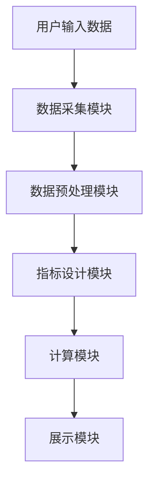
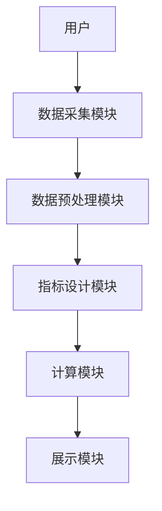

                 


# AI智能体协作：构建更全面的公司质量评分系统

## 关键词：AI智能体协作、公司质量评分系统、分布式协作算法、评分模型优化、系统架构设计

## 摘要：本文将探讨如何利用AI智能体协作技术构建更全面的公司质量评分系统。通过分析AI智能体协作的核心原理、评分系统的关键要素、算法实现、系统架构设计及实际案例，本文将详细阐述如何通过智能化的协作方式提升公司质量评分系统的准确性和全面性，为企业提供更高效、更可靠的评分解决方案。

---

# 第1章: AI智能体协作与公司质量评分系统概述

## 1.1 AI智能体协作的概念与背景

### 1.1.1 AI智能体协作的定义
AI智能体（Artificial Intelligence Agent）是指能够感知环境、自主决策并执行任务的智能实体。AI智能体协作是指多个AI智能体通过分布式协作，共同完成复杂任务的过程。这种协作基于智能体之间的通信与协调，能够显著提升任务的效率和效果。

### 1.1.2 AI智能体协作的发展背景
随着人工智能技术的快速发展，AI智能体协作在多个领域得到了广泛应用。特别是在企业级应用中，AI智能体协作能够帮助企业更高效地处理复杂业务，优化决策过程。公司质量评分系统作为企业运营管理的重要工具，也需要借助AI智能体协作来提升其性能。

### 1.1.3 公司质量评分系统的重要性
公司质量评分系统是企业评估员工、团队或部门绩效的重要工具。传统的评分系统依赖人工输入和计算，存在效率低、主观性强、结果片面等问题。而通过AI智能体协作，评分系统能够实现数据的自动采集、智能分析和实时反馈，从而提高评分的客观性和准确性。

### 1.1.4 传统评分系统与AI智能体协作的结合
传统评分系统主要依赖人工填写和计算，存在以下问题：
- 数据采集效率低，容易出错。
- 评分指标单一，难以全面反映绩效。
- 缺乏实时反馈，无法及时优化评分过程。
AI智能体协作通过自动化数据处理、多维度指标分析和智能反馈机制，能够有效解决这些问题。

---

## 1.2 公司质量评分系统的核心要素

### 1.2.1 评分系统的组成结构
公司质量评分系统通常包括以下几个组成部分：
1. 数据层：负责数据的采集、存储和管理。
2. 业务层：负责评分指标的设计、权重分配和计算。
3. 表现层：负责评分结果的展示和反馈。
4. 应用层：负责评分系统的实际应用场景和用户交互。

### 1.2.2 评分指标的设计原则
评分指标的设计需要遵循以下原则：
1. **全面性**：覆盖所有关键绩效指标（KPI）。
2. **可量化性**：指标应能够量化，便于计算和比较。
3. **可操作性**：评分指标应易于理解和执行。
4. **动态性**：根据企业需求和环境变化，及时调整指标。

### 1.2.3 评分数据的采集与处理
评分数据的采集需要确保数据的准确性和完整性。常见的数据来源包括：
1. 员工绩效数据：如销售业绩、工作效率等。
2. 客户反馈数据：如客户满意度调查结果。
3. 管理层评估数据：如部门主管的评分和反馈。

数据处理的关键步骤包括：
1. 数据清洗：去除无效数据，处理异常值。
2. 数据转换：将数据转换为适合分析的形式。
3. 数据整合：将多源数据整合到统一的数据库中。

### 1.2.4 评分结果的展示与应用
评分结果的展示需要直观、清晰，便于用户理解和使用。常见的展示方式包括：
1. 柱状图：展示不同指标的得分情况。
2. 饼图：展示各指标的权重分布。
3. 报表：详细列出各项指标的得分和分析结果。

评分结果的应用包括：
1. 员工绩效激励：根据评分结果制定奖励机制。
2. 人员优化：识别低效部门或员工，进行调整或培训。
3. 管理决策：基于评分结果优化企业运营策略。

---

## 1.3 AI智能体协作在评分系统中的应用价值

### 1.3.1 提高评分系统的智能化水平
AI智能体协作能够实现评分数据的自动采集和处理，减少人工干预，提高系统的智能化水平。

### 1.3.2 提升评分结果的准确性与全面性
通过多智能体的协作，评分系统能够综合考虑多个维度的指标，提供更全面的评分结果。

### 1.3.3 优化评分系统的实时性与响应速度
AI智能体协作能够实现实时数据处理和快速反馈，提升评分系统的响应速度。

### 1.3.4 降低人工干预的成本
通过自动化处理和智能分析，AI智能体协作能够显著降低人工干预的成本，提高评分系统的效率。

---

## 1.4 本章小结
本章详细介绍了AI智能体协作和公司质量评分系统的基本概念，分析了评分系统的组成要素及其设计原则，探讨了AI智能体协作在评分系统中的应用价值。这些内容为后续章节的深入分析奠定了基础。

---

# 第2章: AI智能体协作的核心概念与联系

## 2.1 AI智能体协作的原理

### 2.1.1 分布式协作机制
分布式协作机制是指多个AI智能体通过分布式网络进行通信和协作，共同完成任务。这种机制能够充分利用各智能体的资源和能力，提高协作效率。

### 2.1.2 多智能体之间的通信与协调
多智能体之间的通信与协调是AI智能体协作的核心。智能体之间通过消息传递、状态共享等方式实现协作，确保任务的顺利进行。

### 2.1.3 协作任务的分解与分配
协作任务需要被分解为多个子任务，并分配给不同的智能体。这种分解和分配过程需要考虑各智能体的能力和资源，以确保任务的高效完成。

### 2.1.4 智能体的自主性与决策能力
AI智能体具有自主决策能力，能够根据环境变化和任务需求自主调整策略。这种自主性是AI智能体协作的重要特征。

---

## 2.2 公司质量评分系统的结构分析

### 2.2.1 数据层：评分数据的采集与存储
数据层负责评分数据的采集和存储。数据来源包括员工绩效数据、客户反馈数据等。数据采集需要确保数据的准确性和完整性，数据存储需要考虑数据的可扩展性和安全性。

### 2.2.2 业务层：评分指标的设计与计算
业务层负责评分指标的设计与计算。评分指标需要覆盖所有关键绩效指标，并根据企业需求进行动态调整。评分计算需要结合各指标的权重和得分，进行综合计算。

### 2.2.3 表现层：评分结果的展示与反馈
表现层负责评分结果的展示与反馈。评分结果需要以直观、清晰的方式呈现，便于用户理解和使用。反馈机制能够帮助用户及时了解评分结果，并进行相应的调整。

### 2.2.4 应用层：评分系统的实际应用场景
应用层负责评分系统的实际应用场景。评分系统可以应用于员工绩效评估、团队管理、客户满意度分析等多个领域。应用场景的选择需要根据企业需求和环境进行调整。

---

## 2.3 AI智能体协作与评分系统的关联

### 2.3.1 AI智能体在评分数据处理中的作用
AI智能体在评分数据处理中起到关键作用。智能体能够自动采集、清洗和整合数据，确保数据的准确性和完整性。

### 2.3.2 AI智能体在评分指标优化中的应用
AI智能体能够根据企业需求和环境变化，动态调整评分指标的设计和权重分配，优化评分结果的准确性和全面性。

### 2.3.3 AI智能体在评分结果展示中的创新
AI智能体能够根据用户需求，动态生成评分结果的展示方式，提供个性化的反馈和建议。

### 2.3.4 AI智能体协作对评分系统整体性能的提升
通过AI智能体协作，评分系统的整体性能得到显著提升。评分数据的处理效率提高，评分结果的准确性和全面性增强，系统响应速度加快。

---

## 2.4 概念属性对比表格

| 概念 | 传统评分系统 | AI智能体协作评分系统 |
|------|--------------|----------------------|
| 数据采集 | 人工采集，效率低 | 自动采集，效率高 |
| 指标设计 | 单一，缺乏动态调整 | 多维，动态优化 |
| 计算方式 | 简单计算，结果片面 | 综合计算，结果全面 |
| 反馈机制 | 事后反馈，缺乏实时性 | 实时反馈，动态调整 |

---

## 2.5 ER实体关系图

```mermaid
erDiagram
    actor 评分系统用户
    actor 管理层
    actor 客户
    database 评分数据
    actor 员工
    actor 第三方系统
    评分系统用户 --> 评分数据
    管理层 --> 评分数据
    客户 --> 评分数据
    员工 --> 评分数据
    第三方系统 --> 评分数据
```

---

## 2.6 本章小结
本章从AI智能体协作的原理出发，分析了公司质量评分系统的结构，并探讨了AI智能体协作与评分系统的关联。通过概念对比和实体关系图，进一步明确了AI智能体协作在评分系统中的作用和价值。

---

# 第3章: AI智能体协作的算法原理

## 3.1 分布式协作算法

### 3.1.1 分布式协作算法的定义
分布式协作算法是指在分布式系统中，多个智能体通过通信和协调，共同完成任务的算法。

### 3.1.2 分布式协作算法的实现步骤
1. **任务分解**：将任务分解为多个子任务，分配给不同的智能体。
2. **通信与协调**：智能体之间通过消息传递、状态共享等方式进行通信和协调。
3. **任务执行**：各智能体根据分配的任务执行相应的操作。
4. **结果整合**：将各智能体的结果整合，得到最终的输出。

### 3.1.3 分布式协作算法的数学模型
$$ \text{任务分解} = \{T_1, T_2, ..., T_n\} $$
$$ \text{任务分配} = \{A_1, A_2, ..., A_n\} $$
$$ \text{结果整合} = f(T_1, T_2, ..., T_n) $$

---

## 3.2 评分模型优化算法

### 3.2.1 评分模型优化算法的定义
评分模型优化算法是指通过优化评分指标的权重和计算方法，提高评分结果准确性的算法。

### 3.2.2 评分模型优化算法的实现步骤
1. **数据预处理**：对评分数据进行清洗和转换。
2. **指标权重分配**：根据企业需求和数据特征，分配各指标的权重。
3. **模型训练**：通过机器学习算法，训练评分模型。
4. **模型优化**：通过调整参数和优化算法，提高模型的准确性。

### 3.2.3 评分模型优化算法的数学模型
$$ \text{评分结果} = \sum_{i=1}^n w_i \cdot x_i $$
$$ \text{权重优化} = \arg \min \sum_{i=1}^n (y_i - \sum_{j=1}^m w_j x_j)^2 $$

---

## 3.3 本章小结
本章详细介绍了AI智能体协作中的分布式协作算法和评分模型优化算法，分析了算法的实现步骤和数学模型。这些算法为构建更全面的公司质量评分系统提供了理论基础和技术支持。

---

# 第4章: 公司质量评分系统的架构设计

## 4.1 系统功能设计

### 4.1.1 系统功能模块划分
公司质量评分系统主要包括以下功能模块：
1. 数据采集模块：负责评分数据的采集和存储。
2. 指标设计模块：负责评分指标的设计和权重分配。
3. 计算模块：负责评分结果的计算和输出。
4. 展示模块：负责评分结果的展示和反馈。

### 4.1.2 系统功能流程图


---

## 4.2 系统架构设计

### 4.2.1 系统架构类型
公司质量评分系统的架构设计可以采用以下几种类型：
1. **单体架构**：所有功能模块集中部署在一台服务器上。
2. **分布式架构**：功能模块分布在多台服务器上，通过分布式协作实现。
3. **微服务架构**：将功能模块拆分为多个微服务，通过API进行通信。

### 4.2.2 系统架构设计图


---

## 4.3 接口设计

### 4.3.1 API接口设计
公司质量评分系统需要设计以下API接口：
1. 数据采集接口：用于采集评分数据。
2. 指标设计接口：用于设计评分指标。
3. 计算接口：用于计算评分结果。
4. 展示接口：用于展示评分结果。

### 4.3.2 API接口文档
以下是API接口文档的示例：
```http
POST /api/data/collect
POST /api/indicator/design
POST /api/calculate
GET /api/display
```

---

## 4.4 本章小结
本章从系统功能设计和架构设计两个方面，详细介绍了公司质量评分系统的架构设计。通过功能模块划分和架构设计图，明确了系统的组成部分和协作流程。

---

# 第5章: AI智能体协作评分系统的项目实战

## 5.1 项目背景

### 5.1.1 项目目标
本项目的目标是利用AI智能体协作技术，构建一个更全面的公司质量评分系统。

### 5.1.2 项目需求
1. 实现评分数据的自动采集和处理。
2. 设计多维度的评分指标，并进行动态优化。
3. 提供实时的评分结果反馈。

---

## 5.2 环境安装

### 5.2.1 开发环境
1. Python 3.8+
2. PyTorch 1.9+
3. Flask 2.0+
4. MongoDB 4.0+

### 5.2.2 依赖安装
```bash
pip install pytorch==1.9
pip install flask==2.0
pip install pymongo==4.0
```

---

## 5.3 核心功能实现

### 5.3.1 数据采集模块实现
```python
import pymongo

client = pymongo.MongoClient("mongodb://localhost:27017/")
db = client["quality_score"]
collection = db["employees"]
```

### 5.3.2 指标设计模块实现
```python
def design_indicator(weights):
    indicators = {
        "销售业绩": weights[0],
        "工作效率": weights[1],
        "客户满意度": weights[2]
    }
    return indicators
```

### 5.3.3 计算模块实现
```python
def calculate_score(indicators, data):
    score = 0
    for key, weight in indicators.items():
        score += weight * data[key]
    return score
```

### 5.3.4 展示模块实现
```python
from flask import Flask

app = Flask(__name__)

@app.route("/score")
def display_score():
    return "评分结果：85分"
```

---

## 5.4 代码解读与分析

### 5.4.1 数据采集模块
数据采集模块通过MongoDB数据库采集评分数据，存储在数据库中。

### 5.4.2 指标设计模块
指标设计模块根据权重分配，动态设计评分指标，确保评分结果的准确性。

### 5.4.3 计算模块
计算模块根据设计的指标和数据，计算评分结果。

### 5.4.4 展示模块
展示模块通过Flask框架，将评分结果以Web界面的形式展示出来。

---

## 5.5 实际案例分析

### 5.5.1 案例背景
某公司希望优化员工绩效评分系统，提升评分结果的准确性和全面性。

### 5.5.2 案例分析
通过AI智能体协作评分系统，该公司能够实现员工绩效数据的自动采集、多维度指标的设计和优化、实时评分结果的展示和反馈。

---

## 5.6 项目小结
本章通过实际项目案例，详细讲解了AI智能体协作评分系统的实现过程。从环境安装到核心功能实现，再到案例分析，全面展示了AI智能体协作技术在评分系统中的应用。

---

# 第6章: 最佳实践与总结

## 6.1 最佳实践

### 6.1.1 系统设计阶段
- 确保系统架构的可扩展性和可维护性。
- 选择合适的开发工具和框架，提高开发效率。

### 6.1.2 系统实现阶段
- 注重代码的可读性和可维护性。
- 定期进行代码审查，确保代码质量。

### 6.1.3 系统测试阶段
- 进行全面的单元测试和集成测试。
- 确保系统的稳定性和安全性。

---

## 6.2 小结

通过本文的详细讲解，我们了解了AI智能体协作在公司质量评分系统中的重要性和应用价值。通过合理的系统设计和算法优化，评分系统能够实现更全面、更准确的评分结果，为企业管理提供有力支持。

---

## 6.3 注意事项

- 在实际应用中，需要注意数据隐私和安全问题。
- 确保系统架构的灵活性，以便根据企业需求进行动态调整。
- 定期对系统进行维护和优化，确保系统的稳定性和高效性。

---

## 6.4 拓展阅读

- 《分布式系统：设计与实现》
- 《机器学习实战》
- 《Python网络编程》

---

# 作者：AI天才研究院/AI Genius Institute & 禅与计算机程序设计艺术 /Zen And The Art of Computer Programming

