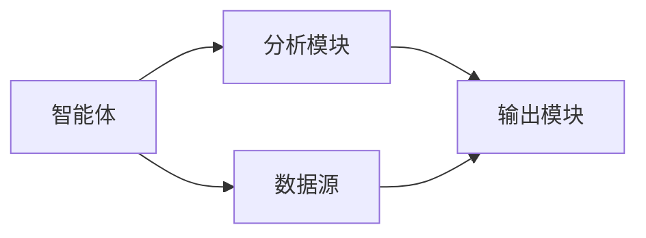

                 


# 基于多智能体的自动化公司财务压力测试系统

## 关键词：多智能体系统, 财务压力测试, 自动化, 系统架构, 算法原理, 项目实战

## 摘要

本文详细探讨了基于多智能体的自动化公司财务压力测试系统的构建与实现。从问题背景到系统设计，从算法原理到项目实战，系统地分析了多智能体系统在财务压力测试中的应用。通过理论分析与实践结合，展示了如何利用多智能体系统实现高效的财务压力测试，为企业的风险管理提供了新的思路和解决方案。

---

## 第一部分: 背景介绍

## 第1章: 财务压力测试系统概述

### 1.1 问题背景与目标

#### 1.1.1 传统财务压力测试的局限性
传统的财务压力测试方法依赖于人工分析和静态模型，存在以下问题：
- 数据处理效率低，难以应对大规模数据。
- 模型缺乏动态性，难以适应市场变化。
- 分析结果的主观性较高，难以保证准确性。

#### 1.1.2 多智能体系统的优势
多智能体系统具有以下优势：
- 高度的并行性和分布式计算能力，能够处理大规模数据。
- 系统动态适应性强，能够实时响应市场变化。
- 智能体之间的协作与竞争机制，能够模拟复杂的市场环境。

#### 1.1.3 系统目标与核心问题
系统目标：
- 构建一个基于多智能体的自动化财务压力测试系统。
- 提高压力测试的效率和准确性。
- 实现系统的动态适应性和可扩展性。

核心问题：
- 如何构建高效的多智能体系统。
- 如何实现智能体之间的协作与竞争。
- 如何保证系统的实时性和准确性。

### 1.2 问题描述与解决思路

#### 1.2.1 财务压力测试的核心问题
财务压力测试的核心问题是评估公司在不同市场条件下的财务健康状况，包括：
- 公司的资产质量。
- 公司的流动性风险。
- 公司的信用风险。

#### 1.2.2 多智能体系统在压力测试中的应用
多智能体系统在压力测试中的应用包括：
- 模拟市场环境的变化。
- 分析公司财务状况的变化。
- 提供风险预警和决策支持。

#### 1.2.3 系统边界与外延
系统边界：
- 输入：市场数据、公司财务数据。
- 输出：压力测试结果、风险评估报告。
- 边界外延：与外部数据源、用户界面的交互。

### 1.3 系统核心要素与概念结构

#### 1.3.1 系统核心要素分析
系统核心要素包括：
- 数据源：市场数据、公司财务数据。
- 智能体：负责数据处理、分析和决策。
- 分析模块：负责压力测试和风险评估。
- 输出模块：生成压力测试结果和报告。

#### 1.3.2 概念结构图
以下是概念结构图的简要描述：

```plaintext
+-------------------+
|                   |
|    数据源          |
|                   |
+-------------------+
          |
          v
+-------------------+
|                   |
|    智能体          |
|                   |
+-------------------+
          |
          v
+-------------------+
|                   |
| 分析模块          |
|                   |
+-------------------+
          |
          v
+-------------------+
|                   |
| 输出模块          |
|                   |
+-------------------+
```

#### 1.3.3 核心要素对比表

| 核心要素 | 描述                   |
|----------|------------------------|
| 数据源   | 市场数据和公司财务数据 |
| 智能体   | 负责数据处理和分析     |
| 分析模块 | 执行压力测试           |
| 输出模块 | 生成测试结果和报告     |

---

## 第二部分: 核心概念与联系

## 第2章: 多智能体系统原理

### 2.1 多智能体系统基本原理

#### 2.1.1 多智能体系统的定义
多智能体系统是由多个智能体组成的系统，智能体之间通过协作与竞争完成任务。

#### 2.1.2 系统的组成部分
系统组成部分包括：
- 智能体：负责数据处理和分析。
- 协调机制：负责智能体之间的协作与竞争。
- 数据源：提供输入数据。
- 输出模块：生成测试结果和报告。

#### 2.1.3 智能体之间的关系
智能体之间的关系包括：
- 协作关系：智能体之间互相协作。
- 竞争关系：智能体之间互相竞争。

### 2.2 实体关系分析

#### 2.2.1 ER实体关系图
以下是实体关系图的简要描述：

```plaintext
+-------------------+
|                   |
|    智能体          |
|                   |
+-------------------+
          |
          v
+-------------------+
|                   |
| 分析模块          |
|                   |
+-------------------+
          |
          v
+-------------------+
|                   |
| 数据源          |
|                   |
+-------------------+
```

#### 2.2.2 实体关系分析表

| 实体 | 描述                   |
|------|------------------------|
| 智能体 | 负责数据处理和分析     |
| 分析模块 | 执行压力测试           |
| 数据源 | 提供输入数据           |

#### 2.2.3 实体关系图（Mermaid）



## 第3章: 多智能体系统与财务压力测试的结合

### 3.1 财务压力测试的多智能体模型

#### 3.1.1 多智能体模型的构建
多智能体模型的构建包括：
- 确定智能体的数量和类型。
- 设定智能体的行为规则。
- 设定智能体之间的交互规则。

#### 3.1.2 模型的输入与输出
模型的输入包括：
- 市场数据。
- 公司财务数据。

模型的输出包括：
- 压力测试结果。
- 风险评估报告。

#### 3.1.3 模型的验证与优化
模型的验证包括：
- 模拟测试。
- 实际应用测试。

模型的优化包括：
- 参数调整。
- 行为规则优化。

### 3.2 多智能体系统与财务压力测试的关系

#### 3.2.1 系统功能分析
系统功能包括：
- 数据处理。
- 压力测试。
- 风险评估。

#### 3.2.2 系统与压力测试的交互
系统与压力测试的交互包括：
- 数据输入。
- 模型运行。
- 结果输出。

#### 3.2.3 系统的动态性与适应性
系统的动态性与适应性包括：
- 实时数据处理。
- 灵活的模型调整。

---

## 第三部分: 算法原理讲解

## 第4章: 多智能体系统算法原理

### 4.1 分布式计算与协调机制

#### 4.1.1 分布式计算的基本原理
分布式计算的基本原理是将任务分解成多个子任务，分别在不同的智能体上执行。

#### 4.1.2 协调机制的实现
协调机制的实现包括：
- 任务分配。
- 子任务结果汇总。
- 系统决策。

#### 4.1.3 算法流程图（Mermaid）


### 4.2 智能体行为决策算法

#### 4.2.1 行为决策的基本算法
行为决策的基本算法包括：
- 随机选择。
- 基于规则的决策。
- 基于优先级的决策。

#### 4.2.2 算法实现的步骤
算法实现的步骤包括：
- 初始化智能体。
- 设置行为规则。
- 执行行为决策。
- 更新系统状态。

#### 4.2.3 算法实现的代码示例

```python
class Agent:
    def __init__(self, id):
        self.id = id
        self.state = "idle"
    
    def decide_action(self):
        if self.state == "idle":
            return "allocate_task"
        else:
            return "process_task"
    
    def update_state(self, action):
        if action == "allocate_task":
            self.state = "processing"
        elif action == "process_task":
            self.state = "idle"
```

### 4.3 算法实现的数学模型

#### 4.3.1 系统模型的数学表达

$$
\text{System State} = \sum_{i=1}^{n} \text{Agent}_i \text{的行为}
$$

#### 4.3.2 算法实现的数学推导

$$
\text{决策结果} = f(\text{行为规则}, \text{系统状态})
$$

---

## 第五部分: 系统分析与架构设计

## 第6章: 系统分析与架构设计

### 6.1 项目背景与目标

#### 6.1.1 项目背景
本项目旨在构建一个基于多智能体的自动化财务压力测试系统，提高压力测试的效率和准确性。

#### 6.1.2 项目目标
项目的最终目标是实现一个高效、准确、动态适应性强的财务压力测试系统。

### 6.2 系统功能设计

#### 6.2.1 功能模块划分
功能模块包括：
- 数据采集模块。
- 智能体处理模块。
- 分析模块。
- 输出模块。

#### 6.2.2 功能模块的交互关系
功能模块的交互关系包括：
- 数据采集模块向智能体处理模块提供数据。
- 智能体处理模块向分析模块提供处理结果。
- 分析模块向输出模块提供测试结果。
- 输出模块向用户展示测试报告。

#### 6.2.3 功能模块的实现方式
功能模块的实现方式包括：
- 数据采集模块：通过API获取数据。
- 智能体处理模块：实现智能体的行为决策。
- 分析模块：执行压力测试和风险评估。
- 输出模块：生成测试报告。

### 6.3 系统架构设计

#### 6.3.1 系统架构图（Mermaid）


#### 6.3.2 系统接口设计
系统接口设计包括：
- 数据接口：提供数据采集模块与智能体处理模块之间的接口。
- 分析接口：提供智能体处理模块与分析模块之间的接口。
- 输出接口：提供分析模块与输出模块之间的接口。

#### 6.3.3 系统交互流程图（Mermaid）


### 6.4 系统实现细节

#### 6.4.1 系统实现的代码示例

```python
class System:
    def __init__(self):
        self.data_collector = DataCollector()
        self.agent_processor = AgentProcessor()
        self.analyzer = Analyzer()
        self.output_module = OutputModule()
    
    def run(self):
        data = self.data_collector.collect_data()
        processed_data = self.agent_processor.process_data(data)
        result = self.analyzer.analyze(processed_data)
        self.output_module.generate_report(result)
```

---

## 第六部分: 项目实战

## 第7章: 项目实战

### 7.1 环境安装与配置

#### 7.1.1 环境需求
项目运行环境包括：
- Python 3.8+
- Mermaid工具
- 数据库支持

#### 7.1.2 安装步骤
安装步骤包括：
1. 安装Python。
2. 安装必要的库。
3. 安装Mermaid工具。

### 7.2 核心代码实现

#### 7.2.1 核心代码示例

```python
class Agent:
    def __init__(self, id):
        self.id = id
        self.state = "idle"
    
    def decide_action(self):
        if self.state == "idle":
            return "allocate_task"
        else:
            return "process_task"
    
    def update_state(self, action):
        if action == "allocate_task":
            self.state = "processing"
        elif action == "process_task":
            self.state = "idle"
```

#### 7.2.2 代码实现的详细解读
代码实现的详细解读包括：
- Agent类的初始化方法。
- decide_action方法的实现。
- update_state方法的实现。

### 7.3 实际案例分析与代码实现

#### 7.3.1 案例分析
案例分析包括：
- 数据采集。
- 智能体行为决策。
- 分析模块的压力测试。

#### 7.3.2 代码实现

```python
class System:
    def __init__(self):
        self.data_collector = DataCollector()
        self.agent_processor = AgentProcessor()
        self.analyzer = Analyzer()
        self.output_module = OutputModule()
    
    def run(self):
        data = self.data_collector.collect_data()
        processed_data = self.agent_processor.process_data(data)
        result = self.analyzer.analyze(processed_data)
        self.output_module.generate_report(result)
```

### 7.4 项目总结与优化建议

#### 7.4.1 项目总结
项目总结包括：
- 项目目标的实现情况。
- 系统的性能表现。
- 用户反馈。

#### 7.4.2 优化建议
优化建议包括：
- 提高系统的处理效率。
- 增强系统的适应性。
- 改善系统的用户界面。

---

## 第七部分: 最佳实践与总结

## 第8章: 最佳实践与总结

### 8.1 最佳实践 tips

#### 8.1.1 系统设计 tips
系统设计 tips包括：
- 系统的模块化设计。
- 智能体的行为规则设计。
- 系统的动态适应性设计。

#### 8.1.2 代码实现 tips
代码实现 tips包括：
- 代码的可读性。
- 代码的可维护性。
- 代码的效率优化。

### 8.2 小结

#### 8.2.1 系统设计的小结
系统设计的小结包括：
- 系统的设计目标。
- 系统的设计方法。
- 系统的设计成果。

#### 8.2.2 项目实现的小结
项目实现的小结包括：
- 项目实现的步骤。
- 项目实现的成果。
- 项目实现的经验。

### 8.3 注意事项

#### 8.3.1 系统设计中的注意事项
系统设计中的注意事项包括：
- 系统的可扩展性。
- 系统的可维护性。
- 系统的可测试性。

#### 8.3.2 项目实现中的注意事项
项目实现中的注意事项包括：
- 代码的规范性。
- 代码的可测试性。
- 代码的效率优化。

### 8.4 拓展阅读与学习资源

#### 8.4.1 拓展阅读
拓展阅读包括：
- 多智能体系统的相关书籍。
- 财务压力测试的相关书籍。
- 算法原理的相关书籍。

#### 8.4.2 学习资源
学习资源包括：
- 在线课程。
- 技术博客。
- 开源项目。

---

## 作者：AI天才研究院/AI Genius Institute & 禅与计算机程序设计艺术 /Zen And The Art of Computer Programming

---

这篇文章详细介绍了基于多智能体的自动化公司财务压力测试系统的构建与实现，从理论到实践，从系统设计到代码实现，全面涵盖了系统的各个方面。希望本文能够为相关领域的研究和实践提供有价值的参考和指导。

