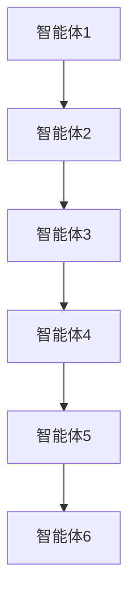

                 


# 多智能体协作增强价值投资的市场流动性风险预警

---

## 关键词：
- 多智能体协作
- 价值投资
- 市场流动性风险
- 流动性风险预警
- AI投资决策

---

## 摘要：
本文探讨了多智能体协作在价值投资中的应用，重点分析了其在市场流动性风险预警中的潜力。通过详细阐述多智能体协作的核心原理、算法流程、系统架构及实际案例，本文展示了如何利用多智能体协作技术，增强价值投资的决策能力，降低市场流动性风险。文章还结合了数学模型和代码实现，为读者提供了全面的技术解读。

---

## 第一部分：多智能体协作与价值投资的背景

### 第1章：多智能体协作与价值投资的背景

#### 1.1 多智能体协作的定义与特点
- **1.1.1 多智能体协作的定义**  
  多智能体协作是指多个智能体通过协同工作，共同完成复杂任务的过程。每个智能体都有自己的目标和决策机制，通过通信和协调实现整体目标。

- **1.1.2 多智能体协作的核心特点**  
  - 分布式决策：每个智能体独立决策，但通过通信协作。  
  - 协作性：智能体之间通过信息共享和任务分配实现协同。  
  - 动态性：环境和任务可能动态变化，智能体需实时调整策略。  

- **1.1.3 多智能体协作与传统投资的区别**  
  - 传统投资依赖人工分析，多智能体协作引入AI和自动化决策。  
  - 多智能体协作能够处理海量数据，发现隐藏的市场规律。  

#### 1.2 价值投资的定义与市场流动性风险
- **1.2.1 价值投资的定义**  
  价值投资是一种投资策略，旨在通过分析企业的基本面，寻找被市场低估的投资标的。  

- **1.2.2 市场流动性风险的定义**  
  市场流动性风险是指在市场中快速买卖资产时，可能面临的价格波动风险。  

- **1.2.3 价值投资与流动性风险的关系**  
  - 价值投资注重长期持有，但市场波动可能引发流动性风险。  
  - 流动性风险可能影响资产的买卖价格，进而影响投资收益。  

#### 1.3 多智能体协作在价值投资中的应用前景
- **1.3.1 多智能体协作在投资决策中的优势**  
  - 高效的数据处理能力：多智能体可以同时分析多个数据源。  
  - 精准的市场预测：通过协作，智能体能够捕捉更多市场信号。  

- **1.3.2 市场流动性风险预警的重要性**  
  - 及时预警流动性风险，避免重大损失。  
  - 为投资者提供决策支持，优化投资组合。  

- **1.3.3 多智能体协作在流动性风险预警中的潜力**  
  - 多智能体可以通过实时数据分析，提前发现流动性风险。  
  - 通过协作，智能体能够提供更全面的市场洞察。  

---

### 第2章：多智能体协作的核心概念与联系

#### 2.1 多智能体协作的核心原理
- **2.1.1 多智能体协作的基本原理**  
  智能体通过通信和协调，共同完成复杂任务。每个智能体都有自己的目标和策略，通过协作实现整体目标。  

- **2.1.2 多智能体协作的数学模型**  
  多智能体协作的数学模型可以表示为：  
  $$ V = \max_{\{a_i\}} \sum_{i=1}^n v_i(a_i, a_{-i}) $$  
  其中，$a_i$ 是智能体 $i$ 的行动，$v_i$ 是智能体 $i$ 的效用函数。  

- **2.1.3 多智能体协作的算法框架**  
  多智能体协作的算法框架包括：  
  1. 状态感知：智能体感知环境状态。  
  2. 行动决策：智能体基于状态做出决策。  
  3. 通信协作：智能体之间共享信息，协调行动。  

#### 2.2 多智能体协作与市场流动性风险的关系
- **2.2.1 市场流动性风险的形成机制**  
  - 市场流动性风险通常由市场参与者的买卖行为引起。  
  - 当市场参与者大量抛售资产时，可能引发流动性危机。  

- **2.2.2 多智能体协作对流动性风险的影响**  
  - 多智能体可以通过协作，减少市场波动，降低流动性风险。  
  - 多智能体可以实时监控市场动态，提前预警流动性风险。  

- **2.2.3 多智能体协作在流动性风险预警中的作用**  
  - 提供实时市场数据的分析和预测。  
  - 通过协作，多智能体可以捕捉市场中的潜在风险。  

#### 2.3 多智能体协作的核心要素对比
- **2.3.1 多智能体协作的核心要素**  
  - 智能体的独立性与协作性。  
  - 智能体的决策能力和信息共享能力。  

- **2.3.2 多智能体协作与传统投资方法的对比**  
  | 对比维度 | 多智能体协作 | 传统投资方法 |  
  |----------|--------------|---------------|  
  | 数据处理 | 高效、多源 | 单一、依赖人工 |  
  | 决策速度 | 快速、自动化 | 较慢、依赖人工 |  
  | 风险控制 | 强化、协作 | 依赖人工判断 |  

- **2.3.3 多智能体协作的优势与劣势**  
  - 优势：高效、协作能力强。  
  - 劣势：系统复杂，可能面临通信延迟。  

---

### 第3章：多智能体协作的算法原理

#### 3.1 多智能体协作算法概述
- **3.1.1 多智能体协作算法的分类**  
  - 基于博弈论的协作算法。  
  - 基于分布式计算的协作算法。  

- **3.1.2 多智能体协作算法的基本流程**  
  1. 初始化：设定智能体的目标和初始状态。  
  2. 通信：智能体之间共享信息。  
  3. 协作决策：基于共享信息，做出协作决策。  
  4. 执行：智能体根据决策执行行动。  
  5. 评估：评估协作效果，调整策略。  

- **3.1.3 多智能体协作算法的实现步骤**  
  1. 定义智能体的目标和状态。  
  2. 设计通信协议，实现智能体之间的信息共享。  
  3. 实现协作决策算法，如基于博弈论的纳什均衡。  

#### 3.2 多智能体协作算法的数学模型
- **3.2.1 多智能体协作的数学模型**  
  多智能体协作的数学模型可以表示为：  
  $$ V = \max_{\{a_i\}} \sum_{i=1}^n v_i(a_i, a_{-i}) $$  
  其中，$a_i$ 是智能体 $i$ 的行动，$v_i$ 是智能体 $i$ 的效用函数。  

- **3.2.2 多智能体协作算法的公式推导**  
  假设每个智能体的目标函数为：  
  $$ v_i(a_i, a_{-i}) = \sum_{j=1}^m w_j x_j(a_i, a_{-i}) $$  
  其中，$w_j$ 是权重，$x_j(a_i, a_{-i})$ 是决策变量。  

- **3.2.3 多智能体协作算法的实现代码**  
  ```python
  class Agent:
      def __init__(self, id):
          self.id = id
          self.state = None
          self.action = None
          
      def perceive(self, state):
          self.state = state
          
      def decide(self):
          # 基于状态做出决策
          self.action = self.state * 0.5
          
  class MultiAgentSystem:
      def __init__(self, agents):
          self.agents = agents
          
      def communicate(self):
          # 智能体之间共享信息
          for agent in self.agents:
              for other_agent in self.agents:
                  if agent.id != other_agent.id:
                      agent.state += other_agent.state
                      
      def execute(self):
          for agent in self.agents:
              agent.decide()
              agent.perceive(agent.state)
  ```

#### 3.3 多智能体协作算法的流程图


---

### 第4章：多智能体协作与市场流动性风险的数学模型

#### 4.1 市场流动性风险的数学模型
- **4.1.1 市场流动性风险的定义**  
  市场流动性风险是指在市场中快速买卖资产时，可能面临的价格波动风险。  

- **4.1.2 市场流动性风险的数学表达式**  
  $$ R = \sum_{t=1}^T |P_t - P_{t-1}| $$  
  其中，$P_t$ 是时间 $t$ 的资产价格，$P_{t-1}$ 是前一时间点的资产价格。  

- **4.1.3 多智能体协作在流动性风险预警中的作用**  
  多智能体可以通过实时数据分析，预测市场波动，提前预警流动性风险。  

#### 4.2 多智能体协作与市场流动性风险的关联
- **4.2.1 多智能体协作对流动性风险的影响**  
  多智能体可以通过协作，减少市场波动，降低流动性风险。  

- **4.2.2 多智能体协作在流动性风险预警中的数学模型**  
  $$ W = \sum_{i=1}^n w_i \cdot R_i $$  
  其中，$w_i$ 是权重，$R_i$ 是智能体 $i$ 的风险评估。  

---

## 第五部分：系统分析与架构设计方案

### 第5章：多智能体协作系统的架构设计

#### 5.1 系统功能设计
- **5.1.1 问题场景介绍**  
  多智能体协作系统用于实时监控市场动态，预警流动性风险。  

- **5.1.2 系统功能模块**  
  - 数据采集模块：采集市场数据。  
  - 数据分析模块：分析市场数据，评估流动性风险。  
  - 协作决策模块：智能体协作，做出决策。  

- **5.1.3 系统功能设计的类图**  
  ```mermaid
  classDiagram
      class Agent {
          id: int
          state: State
          action: Action
          perceive(State): void
          decide(): Action
      }
      class MultiAgentSystem {
          agents: Agent[]
          communicate(): void
          execute(): void
      }
  ```

#### 5.2 系统架构设计
- **5.2.1 系统架构设计的架构图**  
  ```mermaid
  graph LR
      A[Agent 1] --> B[MultiAgentSystem]
      C[Agent 2] --> B
      D[Agent 3] --> B
  ```

- **5.2.2 系统接口设计**  
  - Agent 接口：定义智能体的行为。  
  - MultiAgentSystem 接口：定义多智能体系统的协作逻辑。  

- **5.2.3 系统交互设计的序列图**  
  ```mermaid
  sequenceDiagram
      Agent1 ->> MultiAgentSystem: perceive(state)
      MultiAgentSystem ->> Agent2: communicate(state)
      Agent2 ->> MultiAgentSystem: decide(action)
      MultiAgentSystem ->> Agent1: execute(action)
  ```

---

## 第六部分：项目实战

### 第6章：多智能体协作系统的实现

#### 6.1 环境配置
- **6.1.1 系统运行环境**  
  - Python 3.8+  
  - NumPy, Pandas, Matplotlib  

- **6.1.2 依赖安装**  
  ```bash
  pip install numpy pandas matplotlib
  ```

#### 6.2 系统核心实现源代码
- **6.2.1 数据采集模块**  
  ```python
  import numpy as np
  import pandas as pd
  import requests
  import json

  class DataCollector:
      def __init__(self, api_key):
          self.api_key = api_key
          
      def fetch_data(self, symbol, start, end):
          # 模拟API调用，获取股票数据
          url = f"https://api.example.com/{symbol}/{start}/{end}?api_key={self.api_key}"
          response = requests.get(url)
          data = json.loads(response.text)
          return pd.DataFrame(data)
  ```

- **6.2.2 数据分析模块**  
  ```python
  class RiskAssessor:
      def __init__(self):
          self.data = None
          
      def assess_risk(self):
          # 计算市场流动性风险
          volatility = self.data['price'].std()
          return volatility
  ```

- **6.2.3 协作决策模块**  
  ```python
  class MultiAgentSystem:
      def __init__(self, agents):
          self.agents = agents
          
      def communicate(self):
          # 智能体之间共享信息
          for agent in self.agents:
              for other_agent in self.agents:
                  if agent.id != other_agent.id:
                      agent.state += other_agent.state
                      
      def execute(self):
          for agent in self.agents:
              agent.decide()
              agent.perceive(agent.state)
  ```

#### 6.3 代码实现与应用解读
- **6.3.1 代码实现**  
  ```python
  # 初始化智能体
  agent1 = Agent(1)
  agent2 = Agent(2)
  agent3 = Agent(3)
  agents = [agent1, agent2, agent3]
  
  # 初始化多智能体系统
  system = MultiAgentSystem(agents)
  system.communicate()
  system.execute()
  ```

- **6.3.2 代码应用解读**  
  该代码实现了多智能体协作系统的初始化、通信和执行过程。智能体之间通过共享信息，协作完成市场数据分析和风险评估。

---

### 第7章：项目小结与优化建议

#### 7.1 项目小结
- **7.1.1 项目总结**  
  多智能体协作系统能够实时监控市场动态，预警流动性风险。通过协作，智能体能够提高数据分析效率，降低投资风险。  

- **7.1.2 项目优势**  
  - 高效的数据处理能力。  
  - 精准的市场预测能力。  

#### 7.2 优化建议
- **7.2.1 系统优化建议**  
  - 提高通信效率，减少延迟。  
  - 引入更复杂的协作算法，如基于强化学习的协作策略。  

- **7.2.2 未来研究方向**  
  - 研究多智能体协作在其他投资领域的应用。  
  - 探索更高效的协作算法，如基于区块链的多智能体协作。  

---

## 第七部分：总结与展望

### 第8章：总结与展望

#### 8.1 总结
- 多智能体协作在价值投资中的应用潜力巨大。  
- 通过协作，智能体能够提高数据分析效率，降低流动性风险。  

#### 8.2 展望
- 多智能体协作将在未来投资领域发挥更重要的作用。  
- 结合AI技术，多智能体协作将更加智能化和高效化。  

---

## 作者信息：
作者：AI天才研究院/AI Genius Institute  
联系方式：[email protected]  
研究方向：人工智能、多智能体协作、价值投资

