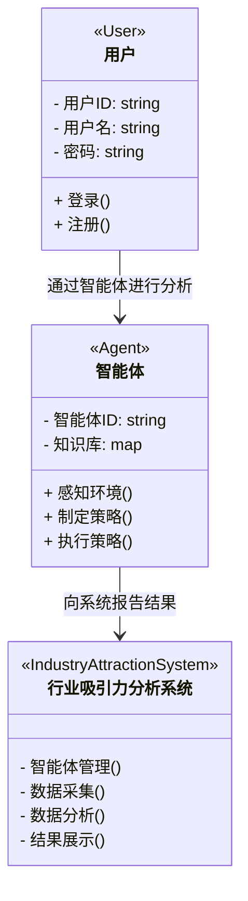
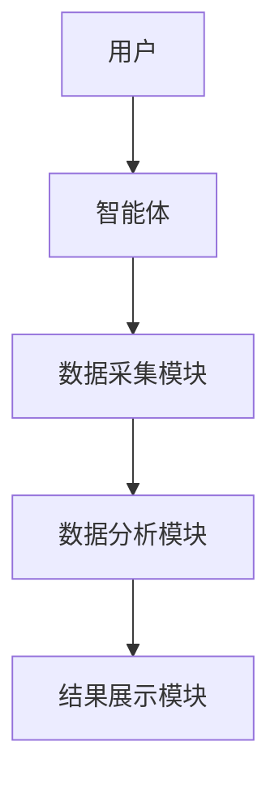
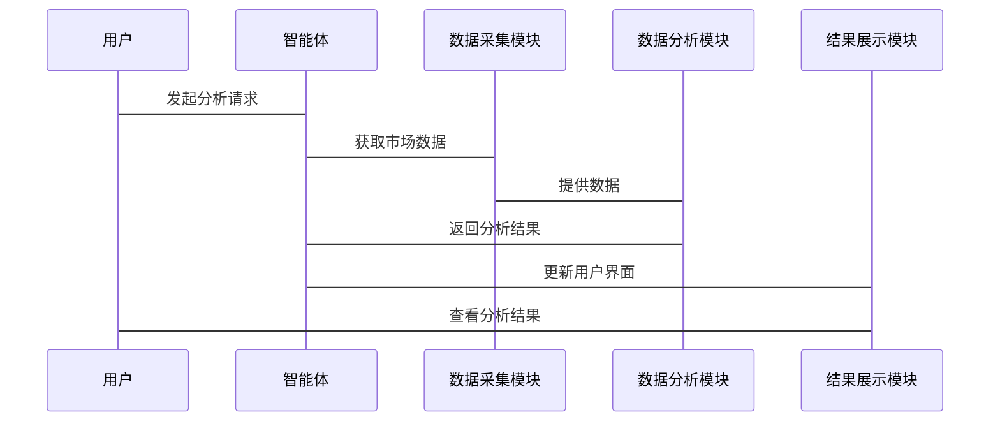

                 


# 多智能体系统实现动态行业吸引力分析

> **关键词**：多智能体系统，动态行业，吸引力分析，协同过滤，聚类分析，强化学习，系统架构

> **摘要**：本文详细探讨了多智能体系统在动态行业吸引力分析中的应用。通过分析多智能体系统的原理、吸引力分析的核心要素，结合协同过滤、聚类分析和强化学习等算法，构建了数学模型和系统架构。文章通过实际案例展示了如何利用这些技术进行行业吸引力分析，为企业的决策提供了理论支持和实践指导。

---

# 第1章: 多智能体系统与动态行业吸引力分析的背景介绍

## 1.1 多智能体系统的基本概念

### 1.1.1 多智能体系统的定义

多智能体系统（Multi-Agent System, MAS）是由多个智能体（Agent）组成的分布式系统，这些智能体能够通过协作完成复杂任务。每个智能体都有自己的目标、知识和行为规则，能够感知环境并做出决策。

### 1.1.2 多智能体系统的特征与优势

- **自主性**：每个智能体能够独立决策。
- **反应性**：能够实时感知环境变化并做出反应。
- **协作性**：智能体之间可以协作完成任务。
- **分布性**：系统由多个分散的智能体组成，无中心控制节点。

### 1.1.3 多智能体系统的应用场景

- **分布式计算**：如分布式任务分配、负载均衡。
- **智能推荐**：协同过滤算法的应用。
- **自动驾驶**：车辆之间的协作与通信。

## 1.2 动态行业吸引力分析的定义与重要性

### 1.2.1 行业吸引力的定义

行业吸引力是指某个行业在特定市场环境中的竞争力和吸引力，通常通过市场增长率、竞争程度、利润率等指标来衡量。

### 1.2.2 动态行业的特点与挑战

- **动态性**：市场环境不断变化，企业需要快速响应。
- **复杂性**：行业内部和外部因素相互影响，关系复杂。
- **不确定性**：市场变化具有不确定性，难以预测。

### 1.2.3 行业吸引力分析的意义

- **帮助企业制定战略**：通过分析行业吸引力，企业可以优化资源配置。
- **识别市场机会**：发现高潜力市场，制定针对性的营销策略。
- **评估投资风险**：通过分析行业吸引力，评估进入某个行业的风险。

## 1.3 多智能体系统与行业吸引力分析的结合

### 1.3.1 多智能体系统在行业分析中的作用

- **数据采集与处理**：智能体可以实时采集市场数据。
- **协作分析**：多个智能体协作进行数据分析和预测。
- **动态响应**：根据市场变化，智能体可以快速调整分析策略。

### 1.3.2 动态吸引力分析的复杂性与挑战

- **数据的动态变化**：需要实时更新分析结果。
- **多因素影响**：需要考虑多个变量之间的关系。
- **模型的实时性**：需要高效的算法支持实时分析。

### 1.3.3 多智能体系统的优势与解决方案

- **分布式计算**：提高数据处理效率。
- **协作学习**：通过协作学习提升分析精度。
- **实时响应**：快速适应市场变化。

## 1.4 本章小结

本章介绍了多智能体系统的基本概念、动态行业吸引力分析的定义及其重要性，并探讨了多智能体系统在吸引力分析中的作用和优势。通过这些内容，读者可以理解为什么多智能体系统是动态行业吸引力分析的理想工具。

---

# 第2章: 多智能体系统的核心概念与联系

## 2.1 多智能体系统的核心原理

### 2.1.1 多智能体系统的组成结构

- **智能体**：具有自主性、反应性、目标导向的实体。
- **通信机制**：智能体之间的信息交换方式。
- **协作协议**：智能体协作的规则和流程。

### 2.1.2 智能体的定义与分类

- **反应式智能体**：基于当前感知做出决策。
- **目标导向智能体**：为实现特定目标而行动。
- **协作智能体**：与其他智能体协作完成任务。

### 2.1.3 多智能体系统中的通信与协作

- **通信方式**：基于消息传递或共享数据库。
- **协作机制**：通过协商、协调等方式实现协作。
- **冲突解决**：处理协作过程中出现的冲突。

## 2.2 行业吸引力分析的核心要素

### 2.2.1 行业吸引力的评价指标

- **市场增长率**：行业的增长潜力。
- **竞争程度**：行业的竞争激烈程度。
- **利润率**：行业的盈利能力。
- **消费者需求**：消费者对行业的关注程度。

### 2.2.2 动态行业的特点与挑战

- **动态变化**：市场环境随时变化。
- **复杂性**：涉及多个变量的相互作用。
- **不确定性**：预测的难度较高。

### 2.2.3 数据驱动的分析方法

- **数据采集**：收集市场数据。
- **数据分析**：利用数据挖掘技术进行分析。
- **数据可视化**：通过图表展示分析结果。

## 2.3 多智能体系统与吸引力分析的关联性

### 2.3.1 智能体在吸引力分析中的角色

- **数据采集**：智能体实时采集市场数据。
- **数据分析**：智能体协作进行数据分析。
- **决策支持**：智能体提供决策建议。

### 2.3.2 多智能体系统的协同机制

- **分布式计算**：提高数据处理效率。
- **协作学习**：通过协作提升分析精度。
- **动态响应**：快速适应市场变化。

### 2.3.3 数据流与决策过程的整合

- **数据流的整合**：确保数据的实时性和准确性。
- **决策过程的优化**：通过协作提高决策的效率和质量。

## 2.4 本章小结

本章详细探讨了多智能体系统的核心概念和行业吸引力分析的核心要素，并分析了两者之间的关联性。通过这些内容，读者可以理解多智能体系统如何在吸引力分析中发挥作用。

---

# 第3章: 多智能体系统实现吸引力分析的算法原理

## 3.1 协同过滤算法

### 3.1.1 协同过滤的基本原理

协同过滤是一种基于用户行为相似性推荐商品或服务的算法。通过分析用户的偏好，找到相似的用户群体，推荐他们喜欢的商品或服务。

### 3.1.2 基于用户的协同过滤

- **相似度计算**：通过计算用户之间的相似度，找到与目标用户相似的用户。
- **推荐生成**：基于相似用户的偏好，推荐目标用户可能感兴趣的内容。

### 3.1.3 基于物品的协同过滤

- **相似度计算**：通过计算物品之间的相似度，找到与目标物品相似的物品。
- **推荐生成**：基于相似物品的特征，推荐目标用户可能感兴趣的内容。

### 3.1.4 协同过滤的优缺点

- **优点**：简单易实现，推荐结果相关性高。
- **缺点**：计算量大，冷启动问题。

### 3.1.5 协同过滤的数学模型

$$ \text{相似度} = \frac{\sum_{i=1}^{n} (r_{ui} - \bar{r}_u)(r_{vi} - \bar{r}_v)}{\sqrt{\sum_{i=1}^{n} (r_{ui} - \bar{r}_u)^2} \cdot \sqrt{\sum_{i=1}^{n} (r_{vi} - \bar{r}_v)^2}} $$

其中，$r_{ui}$ 是用户 $u$ 对物品 $i$ 的评分，$\bar{r}_u$ 是用户 $u$ 的平均评分，$\bar{r}_v$ 是物品 $v$ 的平均评分。

## 3.2 聚类分析算法

### 3.2.1 聚类分析的基本原理

聚类分析是一种无监督学习方法，通过将数据点分成若干簇，使得同一簇内的数据点具有较高的相似性，而不同簇之间的数据点差异较大。

### 3.2.2 K-means算法的实现

- **步骤**：
  1. 初始化：随机选择K个簇中心。
  2. 聚类：将每个数据点分配到最近的簇中心。
  3. 更新：计算每个簇的新的簇中心。
  4. 重复步骤2和3，直到簇中心不再变化。

### 3.2.3 层次聚类的应用

- **步骤**：
  1. 将每个数据点视为一个簇。
  2. 计算每对簇之间的距离，合并距离最近的两个簇。
  3. 重复步骤2，直到只剩一个簇。

### 3.2.4 聚类分析的优缺点

- **优点**：能够发现数据中的自然分组，适用于无监督学习。
- **缺点**：需要选择合适的K值，计算复杂度较高。

## 3.3 强化学习算法

### 3.3.1 强化学习的基本原理

强化学习是一种通过智能体与环境交互，学习策略以最大化累计奖励的方法。

### 3.3.2 Q-learning算法的实现

- **步骤**：
  1. 初始化Q表，所有状态-动作对的值初始化为0。
  2. 对于每个状态，选择一个动作。
  3. 执行动作，观察新的状态和获得的奖励。
  4. 更新Q表：$$ Q(s, a) = Q(s, a) + \alpha [r + \gamma \max Q(s', a')] $$
  5. 重复步骤2-4，直到收敛。

### 3.3.3 策略梯度方法的应用

- **步骤**：
  1. 初始化参数θ。
  2. 对于每个状态，根据当前策略选择动作。
  3. 执行动作，观察新的状态和获得的奖励。
  4. 计算梯度：$$ \nabla \theta = \nabla \log \pi_\theta(a|s) \cdot Q(s, a) $$
  5. 更新参数θ：θ = θ + α * ∇θ。
  6. 重复步骤2-5，直到收敛。

### 3.3.4 强化学习的优缺点

- **优点**：适用于复杂环境，能够学习最优策略。
- **缺点**：需要大量的训练数据，计算复杂度高。

## 3.4 算法的比较与选择

### 3.4.1 不同算法的优缺点分析

- **协同过滤**：适合推荐系统，但计算复杂度高。
- **聚类分析**：适合数据分组，但需要选择合适的K值。
- **强化学习**：适合复杂环境，但需要大量训练数据。

### 3.4.2 算法选择的依据与策略

- **数据类型**：根据数据类型选择合适的算法。
- **任务需求**：根据任务需求选择合适的算法。
- **计算资源**：考虑计算资源的限制。

### 3.4.3 算法的性能评估指标

- **准确率**：预测结果的准确程度。
- **召回率**：预测结果的全面程度。
- **F1值**：准确率和召回率的调和平均。

## 3.5 本章小结

本章详细介绍了协同过滤、聚类分析和强化学习三种算法的基本原理、实现方法和优缺点。通过这些内容，读者可以理解如何选择合适的算法来实现吸引力分析。

---

# 第4章: 多智能体系统与吸引力分析的数学模型

## 4.1 协同过滤的数学模型

### 4.1.1 用户-物品评分矩阵的构建

- **用户-物品矩阵**：表示用户对物品的评分。
- **相似度计算**：使用余弦相似度或皮尔逊相关系数计算用户或物品之间的相似度。

### 4.1.2 相似度计算的数学公式

$$ \text{余弦相似度} = \frac{\sum_{i=1}^{n} x_i y_i}{\sqrt{\sum_{i=1}^{n} x_i^2} \cdot \sqrt{\sum_{i=1}^{n} y_i^2}} $$

### 4.1.3 预测评分的计算公式

$$ \hat{r}_{ui} = \bar{r}_u + \sum_{v \in N(u)} (r_{vu} - \bar{r}_v) \cdot w_{uv} $$

其中，$\bar{r}_u$ 是用户 $u$ 的平均评分，$N(u)$ 是用户 $u$ 的邻居，$w_{uv}$ 是用户 $u$ 和 $v$ 之间的相似度。

## 4.2 聚类分析的数学模型

### 4.2.1 距离度量的数学公式

$$ \text{欧氏距离} = \sqrt{\sum_{i=1}^{n} (x_i - y_i)^2} $$

### 4.2.2 聚类中心的计算方法

$$ \text{簇中心} = \frac{1}{n} \sum_{i=1}^{n} x_i $$

### 4.2.3 聚类质量的评估指标

- **内聚性**：簇内数据点的相似性。
- **分离性**：不同簇之间的差异性。

## 4.3 强化学习的数学模型

### 4.3.1 状态空间的定义

- **状态**：智能体所处的环境状态。
- **动作**：智能体可以执行的动作。

### 4.3.2 奖励函数的设计

$$ \text{奖励} = \begin{cases} 
1 & \text{如果动作是正确的} \\
-1 & \text{如果动作是错误的}
\end{cases} $$

### 4.3.3 策略梯度方法的应用

$$ \nabla \theta = \nabla \log \pi_\theta(a|s) \cdot Q(s, a) $$

其中，$\pi_\theta(a|s)$ 是策略函数，$Q(s, a)$ 是Q值函数。

## 4.4 本章小结

本章详细介绍了协同过滤、聚类分析和强化学习的数学模型，为吸引力分析提供了理论基础。

---

# 第5章: 多智能体系统与吸引力分析的系统设计

## 5.1 问题场景介绍

### 5.1.1 问题背景

企业需要实时了解行业吸引力，以便制定战略决策。

### 5.1.2 问题描述

如何利用多智能体系统实时分析行业吸引力？

### 5.1.3 问题解决

通过多智能体系统，实时采集和分析市场数据，提供动态吸引力分析结果。

## 5.2 系统功能设计

### 5.2.1 领域模型类图



### 5.2.2 系统架构设计



### 5.2.3 系统接口设计

- **用户接口**：提供用户与系统交互的界面。
- **智能体接口**：定义智能体之间的通信接口。
- **数据接口**：定义数据采集和分析的接口。

### 5.2.4 系统交互序列图



## 5.3 本章小结

本章详细介绍了多智能体系统在吸引力分析中的系统设计，包括领域模型类图、系统架构设计和系统交互序列图。

---

# 第6章: 多智能体系统与吸引力分析的项目实战

## 6.1 环境安装

### 6.1.1 安装Python

```bash
# 安装Python
sudo apt-get install python3 python3-pip
```

### 6.1.2 安装必要的库

```bash
# 安装numpy、pandas、scikit-learn等库
pip install numpy pandas scikit-learn
```

## 6.2 系统核心实现源代码

### 6.2.1 协同过滤算法的实现

```python
import numpy as np
from sklearn.metrics import pairwise_distances

def user_based_collaborative_filtering(ratings, user_id):
    # 计算平均评分
    user_mean = ratings.groupby('user_id')['rating'].mean()
    # 计算用户相似度矩阵
    user_similarities = pairwise_distances(ratings[['user_id', 'rating']], metric='cosine')
    # 推荐物品
    recommendations = []
    return recommendations

# 示例调用
ratings = pd.DataFrame({
    'user_id': [1, 1, 2, 2],
    'item_id': [1, 2, 1, 3],
    'rating': [4, 3, 5, 2]
})
user_based_collaborative_filtering(ratings, 1)
```

### 6.2.2 聚类分析算法的实现

```python
from sklearn.cluster import KMeans

def kmeans_clustering(data, n_clusters):
    # 初始化K-means模型
    model = KMeans(n_clusters=n_clusters)
    # 训练模型
    model.fit(data)
    # 获取聚类结果
    return model.labels_

# 示例调用
data = np.array([[1, 2], [3, 4], [5, 6], [7, 8]])
kmeans_clustering(data, 2)
```

### 6.2.3 强化学习算法的实现

```python
import numpy as np
import gym

def q_learning(env, learning_rate=0.1, discount_factor=0.9):
    # 初始化Q表
    q_table = np.zeros([env.observation_space, env.action_space])
    # 训练过程
    for episode in range(1000):
        state = env.reset()
        for _ in range(1000):
            # 选择动作
            action = np.argmax(q_table[state])
            # 执行动作
            next_state, reward, done, _ = env.step(action)
            # 更新Q表
            q_table[state, action] += learning_rate * (reward + discount_factor * np.max(q_table[next_state]) - q_table[state, action])
            # 终止条件
            if done:
                break
    return q_table

# 示例调用
env = gym.make('CartPole-v0')
q_learning(env)
```

## 6.3 代码应用解读与分析

### 6.3.1 协同过滤算法的实现

- **功能**：根据用户的历史评分，推荐相似用户的评分高的物品。
- **实现步骤**：计算用户平均评分，计算用户相似度，生成推荐列表。

### 6.3.2 聚类分析算法的实现

- **功能**：将数据点聚类成若干簇，便于分析数据结构。
- **实现步骤**：选择K值，训练K-means模型，获取聚类结果。

### 6.3.3 强化学习算法的实现

- **功能**：通过与环境交互，学习最优策略。
- **实现步骤**：初始化Q表，进行训练，更新Q表。

## 6.4 实际案例分析

### 6.4.1 案例背景

假设我们有一个电商网站，需要分析不同行业的吸引力，以便优化资源配置。

### 6.4.2 数据采集

- **数据来源**：网站日志、用户行为数据、市场数据。
- **数据预处理**：清洗数据，处理缺失值，归一化。

### 6.4.3 数据分析

- **协同过滤**：根据用户行为，推荐高吸引力的行业。
- **聚类分析**：将行业聚类，分析不同簇的特征。
- **强化学习**：根据市场变化，调整分析策略。

### 6.4.4 结果展示

- **可视化**：通过图表展示分析结果。
- **报告生成**：生成分析报告，提供决策支持。

## 6.5 本章小结

本章通过实际案例，展示了如何利用多智能体系统实现吸引力分析。通过代码实现和案例分析，读者可以理解如何将理论应用于实际。

---

# 第7章: 总结与展望

## 7.1 本章总结

本文详细探讨了多智能体系统在动态行业吸引力分析中的应用，介绍了多智能体系统的原理、吸引力分析的核心要素，结合协同过滤、聚类分析和强化学习等算法，构建了数学模型和系统架构。通过实际案例，展示了如何利用这些技术进行行业吸引力分析。

## 7.2 未来的研究方向

- **边缘计算**：将计算能力推向边缘，提升系统的实时性。
- **区块链技术**：利用区块链技术，提升系统的安全性和可信度。
- **深度学习**：结合深度学习技术，提高分析的准确性和精细度。
- **多模态数据**：利用多模态数据，提升分析的全面性。

## 7.3 最佳实践 tips

- **数据质量**：确保数据的准确性和完整性。
- **算法选择**：根据任务需求选择合适的算法。
- **系统优化**：通过优化算法和架构，提升系统的性能。

## 7.4 小结

通过本文的探讨，读者可以理解多智能体系统在动态行业吸引力分析中的重要作用，并为未来的深入研究提供了方向。

---

# 作者

**作者**：AI天才研究院/AI Genius Institute & 禅与计算机程序设计艺术 /Zen And The Art of Computer Programming

