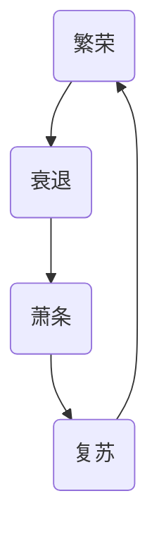
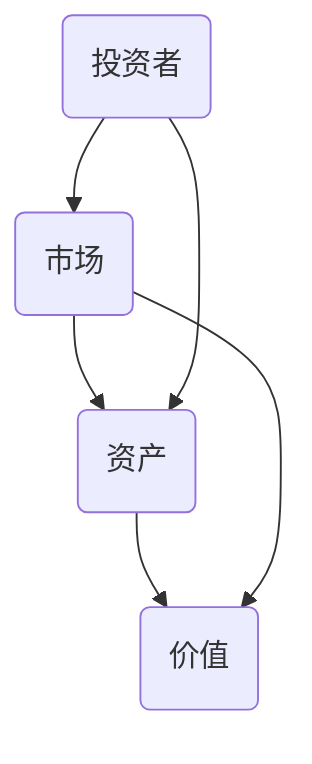
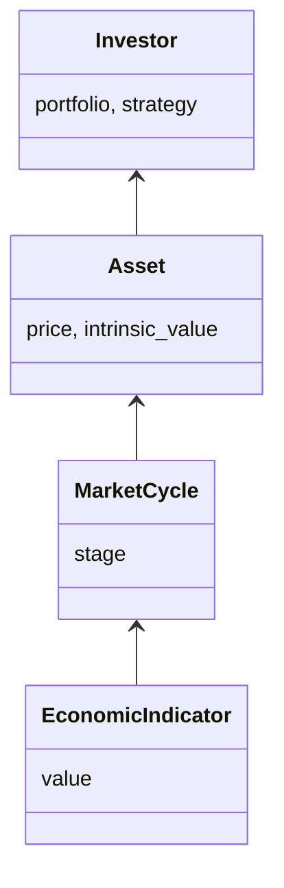
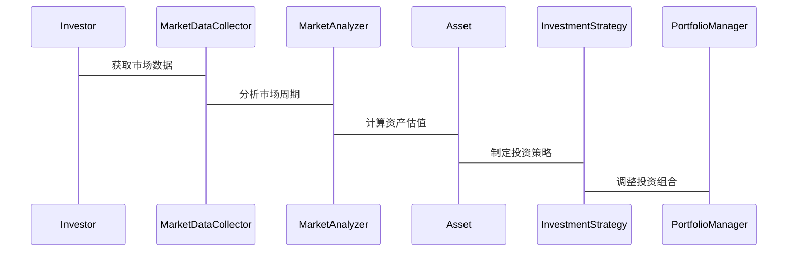

                 


# 巴菲特的反周期投资方法：在恐慌中买入

---

## 关键词：
- 巴菲特投资理念
- 反周期投资
- 市场周期
- 投资者心理
- 资产配置

---

## 摘要：
本文将深入探讨巴菲特的反周期投资方法，特别是他在市场恐慌时买入优质资产的投资策略。通过分析市场周期、投资者心理和资产价值之间的关系，结合技术语言和算法原理，本文将为读者提供一套系统化的反周期投资框架。从理论到实践，从策略到算法，我们将一步步拆解巴菲特的投资智慧，并结合实际案例和技术工具，帮助读者在市场波动中找到投资机会。

---

## 第一部分：巴菲特投资理念与反周期投资基础

### 第1章：巴菲特投资理念概述

#### 1.1 巴菲特投资哲学的核心思想
##### 1.1.1 价值投资的定义与核心理念
价值投资是一种以内在价值为导向的投资方法，强调通过分析企业的基本面（如盈利能力、财务状况、行业地位等）来确定其合理估值。巴菲特的价值投资理念强调长期持有优质资产，避免短期市场波动的干扰。

**数学模型：**
$$
\text{内在价值} = \frac{\text{未来现金流的现值}}{\text{折现率}}
$$

##### 1.1.2 巴菲特的价值投资体系
巴菲特的价值投资体系可以总结为“三步走”：
1. **寻找具有持续竞争优势的企业**：关注企业的商业模式、管理层和行业地位。
2. **等待市场先生的错误定价**：当市场恐慌时，优质资产的价格往往被低估，此时是买入的好机会。
3. **长期持有，避免频繁交易**：通过时间的积累，优质资产的价值终将体现。

##### 1.1.3 巴菲特投资理念的演变与实践
巴菲特的投资理念从早期的“烟屁股”策略（关注低增长但高分红的公司）逐渐演变为“护城河”策略（关注具有强大竞争优势的企业）。这种演变体现了他对市场周期和企业价值的深刻理解。

---

#### 1.2 反周期投资的基本概念
##### 1.2.1 什么是反周期投资
反周期投资是指在市场周期的低谷期（如恐慌、衰退阶段）买入资产，在高峰期卖出资产的投资策略。与传统的周期性投资不同，反周期投资强调逆向思维，利用市场的非理性波动获取超额收益。

##### 1.2.2 反周期投资的核心特征
- **逆向思维**：在市场恐慌时买入，在市场狂热时卖出。
- **安全边际**：买入价格低于内在价值，确保投资的安全性。
- **长期视角**：关注企业的长期价值，而非短期市场波动。

##### 1.2.3 反周期投资与周期性波动的关系
反周期投资的核心在于识别市场周期的不同阶段，并根据阶段特点调整投资策略。例如，在市场恐慌阶段，投资者可以通过买入低估资产来对冲周期性风险。

---

### 第2章：反周期投资的基本原理

#### 2.1 市场周期与投资机会
##### 2.1.1 市场周期的定义与特征
市场周期通常分为四个阶段：繁荣、衰退、萧条和复苏。每个阶段都有其独特的市场特征和投资机会。

**图表：市场周期的循环图**



##### 2.1.2 不同市场周期阶段的投资策略
- **繁荣阶段**：避免高估资产，寻找估值合理的企业。
- **衰退阶段**：买入低估资产，关注优质企业的长期价值。
- **萧条阶段**：继续增持低估资产，耐心等待市场复苏。
- **复苏阶段**：逐步卖出高估资产，锁定利润。

##### 2.1.3 市场周期的预测与判断
市场周期的预测难度较大，但可以通过分析经济指标（如GDP增长率、失业率、消费者信心指数等）和市场指标（如市盈率、市净率等）来辅助判断。

---

#### 2.2 投资者心理与市场波动
##### 2.2.1 投资者心理的周期性变化
投资者心理通常表现出周期性变化，从乐观到悲观，再从悲观到乐观，循环往复。这种心理变化往往导致市场的非理性波动。

**图表：投资者情绪的分布图**


##### 2.2.2 市场恐慌情绪的传播机制
市场恐慌情绪通常通过媒体传播、投资者行为和市场反馈相互作用。例如，当市场出现恐慌性抛售时，恐慌情绪会进一步放大市场下跌幅度。

##### 2.2.3 市场情绪与资产价格的关系
市场情绪与资产价格呈现负相关关系。当市场情绪过于乐观时，资产价格可能被高估；当市场情绪过于悲观时，资产价格可能被低估。

---

#### 2.3 巴菲特的恐慌中买入策略
##### 2.3.1 什么是恐慌中的买入机会
恐慌性抛售通常发生在市场低谷期，此时优质资产的价格往往低于其内在价值，为投资者提供了买入的好机会。

##### 2.3.2 巴菲特恐慌中买入的经典案例
- **2008年金融危机**：巴菲特在市场恐慌时大量买入高盛和摩根士丹利的股票，最终获得丰厚回报。
- **2020年新冠疫情**：巴菲特在市场下跌期间增持股票，展现了其对市场周期的深刻理解。

##### 2.3.3 如何识别恐慌中的买入信号
- **市场恐慌指数（VIX指数）**：当VIX指数显著高于长期平均水平时，可能意味着市场恐慌情绪浓厚。
- **资产价格与内在价值的偏离**：当资产价格远低于其内在价值时，可能是买入信号。

---

### 第3章：反周期投资的核心概念与联系

#### 3.1 反周期投资的核心概念
##### 3.1.1 市场周期模型
市场周期模型是反周期投资的核心工具之一。通过分析市场周期的不同阶段，投资者可以制定相应的投资策略。

**图表：市场周期模型**


##### 3.1.2 投资者情绪指数
投资者情绪指数是衡量市场情绪的重要指标。通过分析情绪指数，投资者可以更好地判断市场的非理性波动。

##### 3.1.3 资产安全边际
资产安全边际是指资产的市场价格低于其内在价值的部分。巴菲特强调在买入时要留有安全边际，以应对市场的不确定性。

$$
\text{安全边际} = \text{内在价值} - \text{市场价格}
$$

#### 3.2 反周期投资的概念属性对比
##### 3.2.1 周期性 vs 非周期性资产
- **周期性资产**：如大宗商品、房地产等，其价格波动与经济周期密切相关。
- **非周期性资产**：如优质股票、债券等，其价格波动相对独立于经济周期。

##### 3.2.2 市场波动 vs 资产价值
- **市场波动**：短期市场波动受投资者情绪和市场周期影响。
- **资产价值**：长期资产价值取决于企业的基本面和内在价值。

##### 3.2.3 投资者心理 vs 市场趋势
- **投资者心理**：投资者情绪通常表现出周期性变化，影响市场波动。
- **市场趋势**：市场趋势是多种因素共同作用的结果，包括经济基本面、政策变化等。

#### 3.3 反周期投资的ER实体关系图



---

### 第4章：反周期投资的算法原理

#### 4.1 反周期投资的算法模型
##### 4.1.1 算法概述
反周期投资的算法模型通常包括以下几个步骤：
1. **市场周期判断**：通过分析经济指标和市场指标，判断当前市场所处的周期阶段。
2. **资产估值**：计算资产的内在价值，确定其是否被低估或高估。
3. **投资决策**：根据市场周期和资产估值，制定买入或卖出的策略。

##### 4.1.2 算法实现
以下是一个简单的反周期投资算法的Python代码示例：

```python
import pandas as pd
import numpy as np

# 假设我们有一个包含资产价格和经济指标的数据集
data = pd.DataFrame({
    'price': [100, 90, 80, 70, 60, 50, 40, 30, 20, 10],
    'economic_indicator': [5, 4, 3, 2, 1, 0, 1, 2, 3, 4]
})

# 计算资产的内在价值
def calculate_intrinsic_value(price, economic_indicator):
    # 简单的线性回归模型
    slope, intercept = np.polyfit(economic_indicator, price, 1)
    intrinsic_value = slope * economic_indicator + intercept
    return intrinsic_value

# 判断市场周期阶段
def determine_market_phase(price, intrinsic_value):
    if price < intrinsic_value * 0.8:
        return '恐慌阶段'
    elif price < intrinsic_value:
        return '萧条阶段'
    elif price > intrinsic_value * 1.2:
        return '繁荣阶段'
    else:
        return '复苏阶段'

# 应用算法
data['intrinsic_value'] = data['price'].apply(lambda x: calculate_intrinsic_value(x, data['economic_indicator']))
data['market_phase'] = data.apply(lambda row: determine_market_phase(row['price'], row['intrinsic_value']), axis=1)

print(data)
```

##### 4.1.3 算法优势
- **数据驱动**：通过分析数据，减少人为情绪干扰。
- **自动化决策**：算法可以实时监控市场变化，提供客观的投资建议。
- **风险控制**：通过安全边际的计算，降低投资风险。

---

## 第二部分：系统分析与架构设计

### 第5章：系统分析与架构设计方案

#### 5.1 问题场景介绍
反周期投资系统需要解决以下问题：
1. 如何实时监控市场周期和资产价格？
2. 如何计算资产的内在价值和安全边际？
3. 如何根据市场周期和资产估值制定投资策略？

#### 5.2 系统功能设计
##### 5.2.1 领域模型（mermaid 类图）



##### 5.2.2 系统架构设计（mermaid 架构图）


##### 5.2.3 系统接口设计
- **市场数据接口**：从数据源获取市场数据，如股票价格、经济指标等。
- **资产估值接口**：计算资产的内在价值和安全边际。
- **投资策略接口**：根据市场周期和资产估值制定投资策略。

##### 5.2.4 系统交互（mermaid 序列图）



---

### 第6章：项目实战

#### 6.1 环境安装
要运行以下代码，需要安装以下Python库：
```bash
pip install pandas numpy matplotlib
```

#### 6.2 系统核心实现源代码
以下是一个简单的反周期投资系统的Python实现：

```python
import pandas as pd
import numpy as np
import matplotlib.pyplot as plt

# 数据准备
data = pd.DataFrame({
    'date': pd.date_range(start='2020-01-01', periods=10),
    'price': [100, 90, 80, 70, 60, 50, 40, 30, 20, 10],
    'economic_indicator': [5, 4, 3, 2, 1, 0, 1, 2, 3, 4]
})

# 计算内在价值
def calculate_intrinsic_value(price, economic_indicator):
    # 简单线性回归模型
    slope, intercept = np.polyfit(economic_indicator, price, 1)
    intrinsic_value = slope * economic_indicator + intercept
    return intrinsic_value

# 判断市场周期阶段
def determine_market_phase(price, intrinsic_value):
    if price < intrinsic_value * 0.8:
        return '恐慌阶段'
    elif price < intrinsic_value:
        return '萧条阶段'
    elif price > intrinsic_value * 1.2:
        return '繁荣阶段'
    else:
        return '复苏阶段'

# 应用算法
data['intrinsic_value'] = data['price'].apply(lambda x: calculate_intrinsic_value(x, data['economic_indicator']))
data['market_phase'] = data.apply(lambda row: determine_market_phase(row['price'], row['intrinsic_value']), axis=1)

# 可视化
plt.figure(figsize=(10, 6))
plt.plot(data['date'], data['price'], label='Price')
plt.plot(data['date'], data['intrinsic_value'], label='Intrinsic Value')
plt.title('Price vs Intrinsic Value Over Time')
plt.xlabel('Date')
plt.ylabel('Value')
plt.legend()
plt.show()
```

#### 6.3 代码应用解读与分析
上述代码实现了以下功能：
1. **数据准备**：从2020年1月1日到2020年10月1日的每日数据，包括资产价格和经济指标。
2. **内在价值计算**：使用线性回归模型，根据经济指标预测资产的内在价值。
3. **市场周期判断**：根据资产价格和内在价值的关系，判断当前市场所处的周期阶段。
4. **可视化**：绘制资产价格和内在价值的时序图，帮助投资者直观理解市场波动。

#### 6.4 实际案例分析
以下是一个实际案例的分析：
- **数据来源**：假设我们有某只股票的每日收盘价和宏观经济指标（如GDP增长率）。
- **内在价值计算**：使用线性回归模型，根据宏观经济指标预测股票的内在价值。
- **市场周期判断**：根据股票价格和内在价值的关系，判断当前市场所处的周期阶段。
- **投资决策**：在市场恐慌阶段，买入低估资产；在市场繁荣阶段，卖出高估资产。

#### 6.5 项目小结
通过上述项目的实战，我们可以看到反周期投资算法的核心在于：
1. **数据驱动**：通过分析市场数据，判断市场周期和资产估值。
2. **算法辅助**：利用技术手段辅助投资决策，减少人为情绪干扰。
3. **可视化工具**：通过图表直观展示市场波动和资产价值，帮助投资者更好地理解市场。

---

## 第三部分：最佳实践与总结

### 第7章：最佳实践

#### 7.1 投资策略
- **长期视角**：关注企业的长期价值，避免短期市场波动的干扰。
- **安全边际**：在买入时留有安全边际，以应对市场的不确定性。
- **逆向思维**：在市场恐慌时买入，在市场狂热时卖出。

#### 7.2 技术工具
- **数据分析工具**：如Python、R等，用于市场数据的分析和建模。
- **可视化工具**：如Matplotlib、Tableau等，用于市场数据的可视化展示。
- **算法工具**：如机器学习算法，用于市场周期的预测和资产估值的计算。

#### 7.3 风险管理
- **分散投资**：通过分散投资降低单一资产的风险。
- **定期复盘**：定期检查投资组合，根据市场变化调整投资策略。
- **风险管理**：设定止损点，避免过度亏损。

---

### 第8章：小结

反周期投资是一种通过逆向思维在市场恐慌时买入优质资产的投资策略。巴菲特的反周期投资方法为我们提供了一套系统化的投资框架，从市场周期的判断到资产估值的计算，再到投资决策的制定，每一步都需要严谨的分析和科学的工具支持。通过本文的分析，我们希望读者能够更好地理解反周期投资的精髓，并在实际投资中灵活运用。

---

### 第9章：注意事项

#### 9.1 投资风险
- 市场周期的判断具有不确定性，投资者需要具备一定的市场分析能力。
- 资产估值的计算依赖于数据的准确性和模型的合理性，模型的错误可能导致投资决策的失误。

#### 9.2 技术局限性
- 数据的获取和处理可能受到限制，特别是在某些市场环境下，数据的准确性和完整性可能存在问题。
- 模型的预测能力有限，市场周期的复杂性可能导致模型失效。

#### 9.3 心理因素
- 投资者心理的非理性波动可能影响投资决策，尤其是在市场恐慌阶段，投资者容易受到情绪的干扰。

---

### 第10章：拓展阅读

#### 10.1 推荐书籍
- 《巴菲特传：一个美国资本家的成功之路》
- 《价值投资实战手册》
- 《投资心理学》

#### 10.2 推荐博客与网站
- [巴菲特投资理念博客](https://www Warren Buffett's investment philosophy)
- [数据驱动投资](https://www.quantitative investing.com)
- [市场周期分析](https://www.market cycle analysis.com)

---

## 作者：AI天才研究院/AI Genius Institute & 禅与计算机程序设计艺术/Zen And The Art of Computer Programming

