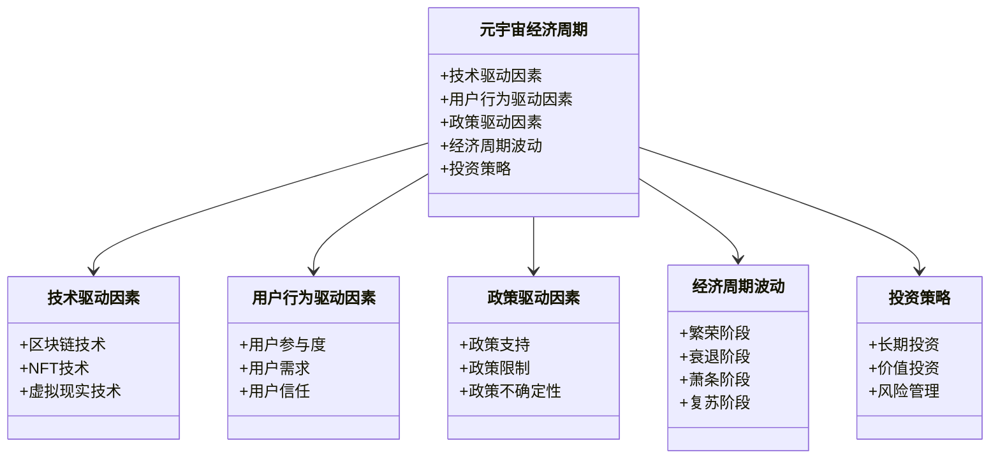
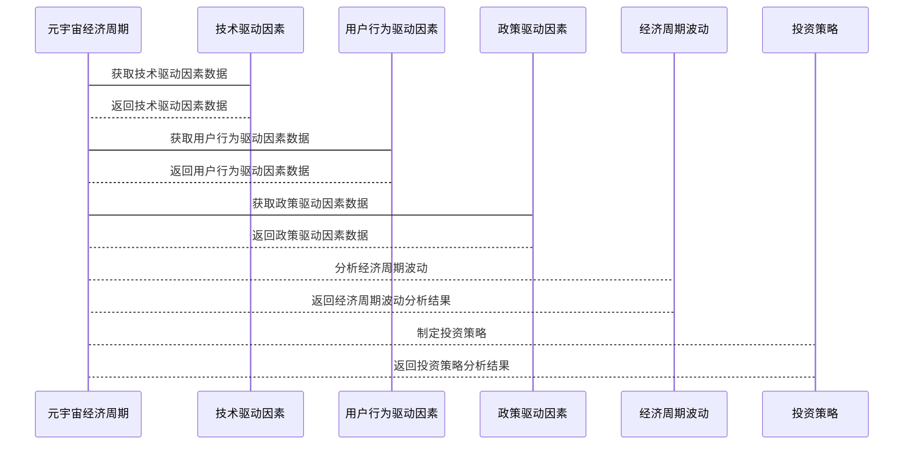

                 


# 巴菲特的经济周期投资法则：元宇宙经济周期的特点

## 关键词：
- 巴菲特投资法则
- 元宇宙经济
- 经济周期
- 价值投资
- NFT
- 区块链技术
- 虚拟现实

## 摘要：
本文探讨了巴菲特的经济周期投资法则及其在元宇宙经济周期中的应用。首先，分析了经济周期的基本概念及其对投资的影响。接着，详细介绍了元宇宙的经济模型、经济周期的特点及其与传统经济周期的差异。最后，结合巴菲特的投资理念，提出了在元宇宙经济周期中的投资策略和风险管理方法，为投资者提供了理论支持和实践指导。

---

# 第一部分：巴菲特的经济周期投资法则

## 第1章：经济周期与巴菲特投资法则概述

### 1.1 经济周期的基本概念

#### 1.1.1 经济周期的定义与特点
经济周期是指经济活动在长期趋势中的波动，通常分为四个阶段：繁荣、衰退、萧条和复苏。每个阶段的特点如下：
- **繁荣阶段**：经济增长迅速，企业利润增加，市场活跃。
- **衰退阶段**：经济增长放缓，企业利润下降，市场信心不足。
- **萧条阶段**：经济陷入低谷，失业率上升，消费者信心下降。
- **复苏阶段**：经济开始逐步恢复，企业逐步恢复正常运营。

#### 1.1.2 经济周期的分类与阶段
经济周期的分类主要基于其波动的频率和持续时间：
- **短期周期**：通常持续几个月到几年，受政策、市场情绪等因素影响。
- **长期周期**：持续时间较长，受技术创新、结构性变化等因素影响。

#### 1.1.3 经济周期对投资的影响
经济周期对投资的影响深远：
- 在繁荣阶段，高风险资产（如股票）表现较好。
- 在衰退阶段，防御性资产（如债券、黄金）更受青睐。
- 在萧条阶段，投资者应寻找价值被低估的资产。
- 在复苏阶段，应逐步增加对高风险资产的配置。

### 1.2 巴菲特投资法则的核心理念

#### 1.2.1 价值投资的定义与特点
价值投资是一种以内在价值为基础的投资策略，强调购买价格低于内在价值的资产。巴菲特的价值投资理念包括：
- **长期投资**：关注企业的长期价值，而非短期波动。
- **安全边际**：购买价格低于内在价值，以降低风险。
- **企业分析**：研究企业的财务状况、竞争优势和管理团队。

#### 1.2.2 巴菲特的投资策略与经济周期的关系
巴菲特的投资策略与经济周期密切相关：
- 在繁荣阶段，巴菲特倾向于投资于那些能够持续增长的企业。
- 在衰退阶段，巴菲特寻找那些被市场低估的优质企业进行投资。
- 在萧条阶段，巴菲特增加对防御性资产的配置，以规避风险。

#### 1.2.3 巴菲特投资法则的长期有效性
巴菲特的投资法则长期有效的原因：
- 价值投资的核心理念适用于不同经济周期。
- 长期投资策略能够穿越短期波动，实现资产增值。
- 安全边际策略能够降低投资风险。

### 1.3 巴菲特投资法则的实践案例

#### 1.3.1 巴菲特在不同经济周期中的投资策略
巴菲特在不同经济周期中的投资策略：
- **繁荣阶段**：投资于那些具有强大竞争优势的企业。
- **衰退阶段**：寻找那些被市场低估的优质企业。
- **萧条阶段**：增加对防御性资产的配置。
- **复苏阶段**：逐步增加对高风险资产的配置。

#### 1.3.2 巴菲特投资成功的关键因素
巴菲特投资成功的关键因素：
- **长期投资**：关注企业的长期价值。
- **安全边际**：购买价格低于内在价值。
- **企业分析**：深入研究企业的财务状况和竞争优势。

#### 1.3.3 巴菲特投资法则的局限性与改进
巴菲特投资法则的局限性：
- **短期波动**：无法完全规避短期市场波动。
- **市场变化**：新兴技术和商业模式可能改变企业竞争优势。

---

## 第2章：元宇宙经济周期的特点

### 2.1 元宇宙的基本概念与经济模型

#### 2.1.1 元宇宙的定义与技术基础
元宇宙是一种虚拟的、去中心化的数字世界，基于区块链技术、虚拟现实（VR）和增强现实（AR）等技术构建。元宇宙的经济模型包括：
- **虚拟货币**：如比特币、以太坊等。
- **NFT（非同质化代币）**：用于表示独特的数字资产。
- **虚拟资产**：如虚拟土地、虚拟物品等。

#### 2.1.2 元宇宙的经济体系与货币形式
元宇宙的经济体系具有以下特点：
- **去中心化**：基于区块链技术，无须中央机构控制。
- **可编程性**：通过智能合约实现自动化的经济活动。
- **通货膨胀控制**：通过技术手段限制货币供应，防止通货膨胀。

#### 2.1.3 元宇宙经济周期的特殊性
元宇宙经济周期的特殊性：
- **技术驱动**：经济波动受技术创新影响较大。
- **用户行为驱动**：用户行为对经济活动有直接影响。
- **政策不确定性**：监管政策的变化可能对经济周期产生重大影响。

### 2.2 元宇宙经济周期的影响因素

#### 2.2.1 技术进步对元宇宙经济周期的影响
技术进步对元宇宙经济周期的影响：
- **区块链技术**：提升交易效率和安全性，促进经济活动。
- **NFT技术**：推动数字艺术、虚拟资产的交易和收藏。
- **虚拟现实技术**：增强用户体验，推动虚拟经济的发展。

#### 2.2.2 用户行为与社交网络对元宇宙经济周期的影响
用户行为与社交网络对元宇宙经济周期的影响：
- **社交网络**：用户之间的互动和社交行为促进虚拟资产的交易。
- **用户参与度**：用户参与度的高低直接影响经济活动的活跃程度。
- **用户需求**：用户需求的变化推动经济周期的波动。

#### 2.2.3 政策与监管对元宇宙经济周期的影响
政策与监管对元宇宙经济周期的影响：
- **政策支持**：政府政策的支持可以促进元宇宙经济的发展。
- **政策限制**：严格的监管政策可能抑制元宇宙经济的活跃度。
- **政策不确定性**：政策的不确定性可能导致市场波动。

### 2.3 元宇宙经济周期的波动性与风险

#### 2.3.1 元宇宙经济周期的波动性分析
元宇宙经济周期的波动性分析：
- **技术波动**：技术创新可能导致经济周期的波动。
- **用户行为波动**：用户行为的变化可能导致经济活动的波动。
- **政策波动**：政策的变化可能导致经济周期的波动。

#### 2.3.2 元宇宙经济周期中的风险因素
元宇宙经济周期中的风险因素：
- **技术风险**：技术缺陷可能导致经济活动的中断。
- **市场风险**：市场波动可能导致资产价值的下降。
- **政策风险**：政策变化可能导致经济活动的不确定性。

#### 2.3.3 元宇宙经济周期中的风险管理策略
元宇宙经济周期中的风险管理策略：
- **分散投资**：通过分散投资降低风险。
- **风险管理**：通过技术手段实现风险管理。
- **政策跟踪**：密切关注政策变化，及时调整投资策略。

---

## 第3章：巴菲特投资法则在元宇宙中的应用

### 3.1 元宇宙中的价值投资机会

#### 3.1.1 元宇宙中具有长期价值的企业分析
元宇宙中具有长期价值的企业分析：
- **技术创新企业**：如区块链技术、NFT技术等。
- **虚拟资产平台**：如虚拟货币交易所、NFT交易平台等。
- **虚拟现实设备制造商**：如VR头显制造商等。

#### 3.1.2 元宇宙中价值投资的关键指标
元宇宙中价值投资的关键指标：
- **技术创新能力**：企业的技术创新能力是长期价值的核心。
- **市场占有率**：企业的市场占有率是长期价值的重要指标。
- **财务状况**：企业的财务状况是长期价值的重要保障。

#### 3.1.3 元宇宙中价值投资的潜在回报与风险
元宇宙中价值投资的潜在回报与风险：
- **潜在回报**：技术创新和市场增长可能带来高回报。
- **风险**：市场波动和技术不确定性可能导致投资失败。

### 3.2 元宇宙经济周期中的投资策略

#### 3.2.1 不同经济周期阶段下的投资策略
不同经济周期阶段下的投资策略：
- **繁荣阶段**：投资于技术创新能力强、市场占有率高的企业。
- **衰退阶段**：寻找那些被市场低估的优质企业。
- **萧条阶段**：增加对防御性资产的配置，规避风险。
- **复苏阶段**：逐步增加对高风险资产的配置。

#### 3.2.2 元宇宙经济周期中的资产配置策略
元宇宙经济周期中的资产配置策略：
- **资产分散**：通过分散投资降低风险。
- **资产轮动**：根据经济周期的变化调整资产配置。
- **风险管理**：通过技术手段实现风险管理。

#### 3.2.3 元宇宙经济周期中的风险管理策略
元宇宙经济周期中的风险管理策略：
- **风险评估**：定期评估投资组合的风险。
- **风险对冲**：通过对冲策略降低投资风险。
- **风险预警**：建立风险预警机制，及时发现和应对风险。

### 3.3 元宇宙中的长期投资与价值创造

#### 3.3.1 长期投资在元宇宙中的重要性
长期投资在元宇宙中的重要性：
- **技术创新**：长期投资能够捕捉技术创新带来的长期收益。
- **市场增长**：长期投资能够分享市场的长期增长。

#### 3.3.2 元宇宙中长期投资的实现路径
元宇宙中长期投资的实现路径：
- **技术创新企业**：投资于技术创新能力强的企业。
- **市场领导企业**：投资于市场占有率高的企业。
- **财务稳健企业**：投资于财务状况稳健的企业。

#### 3.3.3 元宇宙中长期投资的成功案例分析
元宇宙中长期投资的成功案例分析：
- **比特币投资**：长期持有比特币，获得高回报。
- **NFT投资**：投资于具有长期价值的NFT资产，获得高回报。

---

## 第4章：元宇宙经济周期中的技术分析

### 4.1 元宇宙经济周期的技术驱动因素

#### 4.1.1 区块链技术对元宇宙经济周期的影响
区块链技术对元宇宙经济周期的影响：
- **去中心化**：区块链技术实现去中心化的经济体系。
- **安全性**：区块链技术提高经济活动的安全性。
- **可追溯性**：区块链技术实现经济活动的可追溯性。

#### 4.1.2 NFT技术对元宇宙经济周期的影响
NFT技术对元宇宙经济周期的影响：
- **数字资产**：NFT技术推动数字资产的交易和收藏。
- **虚拟资产**：NFT技术推动虚拟资产的交易和收藏。
- **数字艺术**：NFT技术推动数字艺术的发展。

#### 4.1.3 虚拟现实技术对元宇宙经济周期的影响
虚拟现实技术对元宇宙经济周期的影响：
- **用户体验**：虚拟现实技术提升用户体验。
- **经济活动**：虚拟现实技术推动经济活动的虚拟化。
- **市场扩展**：虚拟现实技术扩展虚拟经济的市场规模。

### 4.2 元宇宙经济周期中的技术指标分析

#### 4.2.1 元宇宙经济周期中的技术趋势分析
元宇宙经济周期中的技术趋势分析：
- **区块链技术**：区块链技术的普及和应用。
- **NFT技术**：NFT技术的普及和应用。
- **虚拟现实技术**：虚拟现实技术的普及和应用。

#### 4.2.2 元宇宙经济周期中的技术风险评估
元宇宙经济周期中的技术风险评估：
- **技术缺陷**：技术缺陷可能导致经济活动的中断。
- **技术不确定性**：技术不确定性可能导致经济活动的波动。
- **技术变化**：技术变化可能导致经济活动的波动。

#### 4.2.3 元宇宙经济周期中的技术机会识别
元宇宙经济周期中的技术机会识别：
- **技术创新**：技术创新带来的投资机会。
- **技术应用**：技术应用带来的投资机会。
- **技术趋势**：技术趋势带来的投资机会。

### 4.3 元宇宙经济周期中的技术与投资结合

#### 4.3.1 技术进步对投资策略的影响
技术进步对投资策略的影响：
- **技术创新**：技术创新推动投资策略的调整。
- **技术应用**：技术应用推动投资策略的调整。
- **技术趋势**：技术趋势推动投资策略的调整。

#### 4.3.2 元宇宙经济周期中的技术分析
元宇宙经济周期中的技术分析：
- **技术趋势分析**：分析技术趋势，预测经济周期。
- **技术风险评估**：评估技术风险，制定投资策略。
- **技术机会识别**：识别技术机会，制定投资策略。

#### 4.3.3 技术驱动的元宇宙投资机会
技术驱动的元宇宙投资机会：
- **技术创新企业**：投资于技术创新能力强的企业。
- **技术应用企业**：投资于技术应用能力强的企业。
- **技术趋势企业**：投资于技术趋势明显的企业。

---

## 第5章：元宇宙经济周期中的系统分析与架构设计方案

### 5.1 问题场景介绍

#### 5.1.1 问题背景
元宇宙经济周期中的问题背景：
- **技术驱动**：技术进步推动元宇宙经济周期的变化。
- **用户行为驱动**：用户行为影响元宇宙经济周期的变化。
- **政策驱动**：政策变化影响元宇宙经济周期的变化。

#### 5.1.2 问题描述
元宇宙经济周期中的问题描述：
- **技术不确定性**：技术变化可能导致经济周期的波动。
- **用户行为不确定性**：用户行为变化可能导致经济周期的波动。
- **政策不确定性**：政策变化可能导致经济周期的波动。

#### 5.1.3 问题解决
元宇宙经济周期中的问题解决：
- **技术分析**：通过技术分析预测经济周期的变化。
- **用户行为分析**：通过用户行为分析预测经济周期的变化。
- **政策分析**：通过政策分析预测经济周期的变化。

### 5.2 项目介绍

#### 5.2.1 项目目标
项目目标：
- **技术分析**：分析元宇宙经济周期中的技术驱动因素。
- **用户行为分析**：分析元宇宙经济周期中的用户行为驱动因素。
- **政策分析**：分析元宇宙经济周期中的政策驱动因素。

#### 5.2.2 项目范围
项目范围：
- **技术分析**：分析区块链技术、NFT技术、虚拟现实技术对经济周期的影响。
- **用户行为分析**：分析用户行为对经济周期的影响。
- **政策分析**：分析政策对经济周期的影响。

#### 5.2.3 项目里程碑
项目里程碑：
- **第一阶段**：完成技术分析。
- **第二阶段**：完成用户行为分析。
- **第三阶段**：完成政策分析。

### 5.3 系统功能设计

#### 5.3.1 领域模型（Mermaid 类图）
以下是元宇宙经济周期的领域模型：



#### 5.3.2 系统架构设计（Mermaid 架构图）
以下是元宇宙经济周期的系统架构设计：

```mermaid
archimate

排列方式：水平

元宇宙经济周期 <--> 技术驱动因素
元宇宙经济周期 <--> 用户行为驱动因素
元宇宙经济周期 <--> 政策驱动因素
元宇宙经济周期 <--> 经济周期波动
元宇宙经济周期 <--> 投资策略
```

#### 5.3.3 系统接口设计
系统接口设计：
- **输入接口**：接收技术驱动因素、用户行为驱动因素、政策驱动因素的数据。
- **输出接口**：输出经济周期波动和投资策略的分析结果。

#### 5.3.4 系统交互（Mermaid 序列图）
以下是元宇宙经济周期的系统交互序列图：



---

## 第6章：元宇宙经济周期中的项目实战

### 6.1 环境安装

#### 6.1.1 系统要求
系统要求：
- **操作系统**：Windows 10 或更高版本，或 macOS 10.15 或更高版本，或 Linux 系统。
- **Java**：JDK 1.8 或更高版本。
- **Python**：Python 3.6 或更高版本。
- **区块链开发环境**：如Solidity、Web3.js等。
- **虚拟现实开发环境**：如Unity、Unreal Engine等。

#### 6.1.2 安装步骤
安装步骤：
1. **安装JDK**：下载并安装JDK 1.8或更高版本。
2. **安装Python**：下载并安装Python 3.6或更高版本。
3. **安装区块链开发环境**：下载并安装Solidity、Web3.js等。
4. **安装虚拟现实开发环境**：下载并安装Unity、Unreal Engine等。

### 6.2 系统核心实现源代码

#### 6.2.1 区块链技术实现
以下是一个简单的区块链实现代码（Python）：

```python
class Block:
    def __init__(self, index, timestamp, data, previous_hash):
        self.index = index
        self.timestamp = timestamp
        self.data = data
        self.previous_hash = previous_hash
        self.hash = self.compute_hash()

    def compute_hash(self):
        import hashlib
        hash_str = f"{self.index}{self.timestamp}{self.data}{self.previous_hash}".encode()
        return hashlib.sha256(hash_str).hexdigest()

class Blockchain:
    def __init__(self):
        self.blocks = []
        selfGenesisBlock = Block(0, "01/01/2023", "Genesis Block", "0")
        self.blocks.append(selfGenesisBlock)

    def add_block(self, data):
        previous_block = self.blocks[-1]
        new_block = Block(len(self.blocks), "01/01/2024", data, previous_block.hash)
        self.blocks.append(new_block)

# 创建区块链实例
blockchain = Blockchain()
blockchain.add_block("First transaction")
blockchain.add_block("Second transaction")
```

#### 6.2.2 NFT技术实现
以下是一个简单的NFT实现代码（Solidity）：

```solidity
// SPDX-License-Identifier: MIT
pragma solidity ^0.8.0;

contract NFT {
    uint256 public tokenId = 0;
    mapping(uint256 => address) public tokenOwners;

    function mintNFT(address owner) public {
        tokenId++;
        tokenOwners[tokenId] = owner;
    }

    function ownsNFT(address owner, uint256 tokenId) public view returns (bool) {
        return tokenOwners[tokenId] == owner;
    }
}
```

#### 6.2.3 虚拟现实技术实现
以下是一个简单的虚拟现实场景代码（Unity）：

```csharp
using UnityEngine;
using UnityEngine.SceneManagement;

public class SceneLoader : MonoBehaviour
{
    public void LoadScene(int sceneIndex)
    {
        SceneManager.LoadScene(sceneIndex);
    }
}
```

### 6.3 代码应用解读与分析

#### 6.3.1 区块链技术实现解读
区块链技术实现解读：
- **Block类**：定义了一个区块链块，包含索引、时间戳、数据和哈希值。
- **Blockchain类**：管理区块链块，提供添加新块的功能。

#### 6.3.2 NFT技术实现解读
NFT技术实现解读：
- **NFT合约**：定义了一个NFT合约，提供铸造NFT和查询NFT所有权的功能。
- **MintNFT函数**：铸造一个新的NFT。
- **ownsNFT函数**：查询某个地址是否拥有某个NFT。

#### 6.3.3 虚拟现实技术实现解读
虚拟现实技术实现解读：
- **SceneLoader脚本**：定义了一个加载场景的脚本，用于在虚拟现实中加载不同的场景。

### 6.4 实际案例分析和详细讲解剖析

#### 6.4.1 案例分析：虚拟货币交易所
虚拟货币交易所案例分析：
- **问题背景**：虚拟货币交易所的交易量受经济周期波动影响较大。
- **技术分析**：通过区块链技术实现去中心化的交易。
- **投资策略**：在繁荣阶段增加对虚拟货币交易所的投资，在衰退阶段减少对虚拟货币交易所的投资。

#### 6.4.2 案例分析：NFT交易平台
NFT交易平台案例分析：
- **问题背景**：NFT交易平台的交易量受经济周期波动影响较大。
- **技术分析**：通过NFT技术实现数字资产的交易和收藏。
- **投资策略**：在繁荣阶段增加对NFT交易平台的投资，在衰退阶段减少对NFT交易平台的投资。

#### 6.4.3 案例分析：虚拟现实设备制造商
虚拟现实设备制造商案例分析：
- **问题背景**：虚拟现实设备制造商的销售量受经济周期波动影响较大。
- **技术分析**：通过虚拟现实技术提升用户体验。
- **投资策略**：在繁荣阶段增加对虚拟现实设备制造商的投资，在衰退阶段减少对虚拟现实设备制造商的投资。

### 6.5 项目小结

#### 6.5.1 项目总结
项目总结：
- **技术实现**：通过区块链技术、NFT技术和虚拟现实技术实现元宇宙经济周期的系统分析。
- **投资策略**：通过技术分析和用户行为分析制定投资策略。
- **风险管理**：通过技术分析和政策分析制定风险管理策略。

#### 6.5.2 项目经验
项目经验：
- **技术驱动**：技术进步是元宇宙经济周期变化的重要驱动力。
- **用户行为驱动**：用户行为是元宇宙经济周期变化的重要驱动力。
- **政策驱动**：政策变化是元宇宙经济周期变化的重要驱动力。

#### 6.5.3 项目挑战
项目挑战：
- **技术不确定性**：技术变化可能导致经济周期的波动。
- **用户行为不确定性**：用户行为变化可能导致经济周期的波动。
- **政策不确定性**：政策变化可能导致经济周期的波动。

---

## 第7章：元宇宙经济周期中的最佳实践

### 7.1 投资策略与风险管理

#### 7.1.1 长期投资与价值创造
长期投资与价值创造：
- **长期投资**：关注企业的长期价值，而非短期波动。
- **价值创造**：通过技术创新和市场扩展实现价值创造。

#### 7.1.2 分散投资与资产配置
分散投资与资产配置：
- **分散投资**：通过分散投资降低风险。
- **资产配置**：根据经济周期的变化调整资产配置。

#### 7.1.3 风险管理与安全边际
风险管理与安全边际：
- **风险管理**：通过技术手段实现风险管理。
- **安全边际**：购买价格低于内在价值，以降低风险。

### 7.2 投资策略的注意事项

#### 7.2.1 市场波动与投资策略
市场波动与投资策略：
- **市场波动**：市场波动可能导致投资策略的调整。
- **投资策略**：根据市场波动调整投资策略。

#### 7.2.2 政策变化与投资策略
政策变化与投资策略：
- **政策变化**：政策变化可能导致投资策略的调整。
- **投资策略**：根据政策变化调整投资策略。

#### 7.2.3 技术进步与投资策略
技术进步与投资策略：
- **技术进步**：技术进步可能导致投资策略的调整。
- **投资策略**：根据技术进步调整投资策略。

### 7.3 未来展望与拓展阅读

#### 7.3.1 未来展望
未来展望：
- **技术进步**：技术进步将继续推动元宇宙经济周期的变化。
- **用户行为变化**：用户行为变化将继续影响元宇宙经济周期的变化。
- **政策变化**：政策变化将继续影响元宇宙经济周期的变化。

#### 7.3.2 拓展阅读
拓展阅读：
- **区块链技术**：深入学习区块链技术，了解其在元宇宙经济周期中的应用。
- **NFT技术**：深入学习NFT技术，了解其在元宇宙经济周期中的应用。
- **虚拟现实技术**：深入学习虚拟现实技术，了解其在元宇宙经济周期中的应用。

---

## 第8章：元宇宙经济周期中的总结与展望

### 8.1 总结
元宇宙经济周期的特点：
- **技术驱动**：技术进步是元宇宙经济周期变化的重要驱动力。
- **用户行为驱动**：用户行为是元宇宙经济周期变化的重要驱动力。
- **政策驱动**：政策变化是元宇宙经济周期变化的重要驱动力。

巴菲特投资法则的应用：
- **长期投资**：关注企业的长期价值，而非短期波动。
- **价值投资**：购买价格低于内在价值，以降低风险。
- **风险管理**：通过技术手段实现风险管理。

### 8.2 未来展望
未来展望：
- **技术进步**：技术进步将继续推动元宇宙经济周期的变化。
- **用户行为变化**：用户行为变化将继续影响元宇宙经济周期的变化。
- **政策变化**：政策变化将继续影响元宇宙经济周期的变化。

### 8.3 致谢
感谢读者的耐心阅读，感谢技术专家的支持，感谢所有为元宇宙经济周期研究做出贡献的人。

---

## 作者信息

作者：AI天才研究院/AI Genius Institute & 禅与计算机程序设计艺术 /Zen And The Art of Computer Programming

