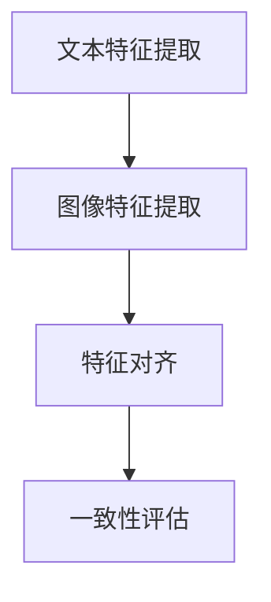
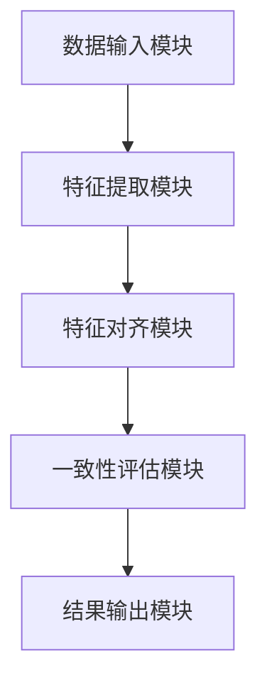
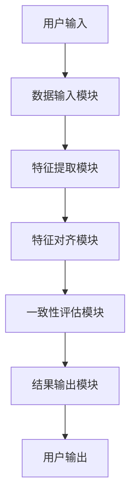

                 


# 开发AI Agent的跨模态情感一致性检测

> 关键词：AI Agent，跨模态情感一致性检测，多模态数据，情感分析，深度学习

> 摘要：  
本文深入探讨了AI Agent在跨模态情感一致性检测中的核心问题、技术挑战及解决方案。通过分析多模态数据的特性、情感一致性检测的原理以及AI Agent的架构设计，本文详细阐述了如何实现跨模态情感一致性检测，包括算法原理、系统架构、项目实战等内容，为AI Agent的开发提供了理论基础和实践指导。

---

## 第1章: 跨模态情感一致性检测的背景与问题定义

### 1.1 跨模态情感一致性检测的背景

#### 1.1.1 多模态数据的兴起  
随着人工智能技术的快速发展，AI Agent（智能体）在各个领域的应用日益广泛。AI Agent需要处理多种模态的数据，例如文本、图像、语音等，以提供更智能的服务。然而，不同模态的数据具有不同的特征和表达方式，如何在多模态数据中保持情感一致性成为了一个重要的挑战。

#### 1.1.2 情感一致性检测的重要性  
情感一致性检测是指在不同模态的数据中，情感表达是否一致。例如，在一个对话中，用户的文本表达和语音语调应一致，以避免信息冲突。这种一致性检测对于提升用户体验、增强AI Agent的智能性具有重要意义。

#### 1.1.3 AI Agent的发展与挑战  
AI Agent的发展依赖于多模态数据的处理能力。然而，不同模态的数据具有不同的特征，如何将它们统一到一个模型中，并保持情感一致性，是当前技术的主要挑战之一。

### 1.2 跨模态情感一致性检测的定义与特点

#### 1.2.1 跨模态数据的定义  
跨模态数据是指来自不同感官渠道的数据，例如文本、图像、语音、视频等。这些数据具有不同的特征，但它们可以共同描述一个场景或情感。

#### 1.2.2 情感一致性检测的核心概念  
情感一致性检测是指在不同模态的数据中，情感表达是否一致。例如，文本表达“我感到开心”，而语音语调却表现出悲伤，这种不一致需要被检测出来。

#### 1.2.3 跨模态情感一致性检测的独特性  
跨模态情感一致性检测的独特性在于它需要同时处理多个模态的数据，并在这些数据之间建立情感一致性关系。这需要多模态数据的特征提取、对齐和融合技术。

### 1.3 跨模态情感一致性检测的技术挑战

#### 1.3.1 多模态数据的异构性  
不同模态的数据具有不同的特征和表示方式，例如文本是序列数据，图像则是二维数据。这种异构性增加了数据处理的复杂性。

#### 1.3.2 情感表达的多样性  
情感表达在不同模态中具有多样性。例如，文本中的情感可以通过词汇和语调来表达，而图像中的情感则需要通过颜色、形状等视觉特征来表达。

#### 1.3.3 一致性评估的复杂性  
如何在不同模态的数据之间建立一致性关系是一个复杂的任务。需要考虑数据的特征差异、情感表达的多样性以及一致性评估的准确性。

### 1.4 跨模态情感一致性检测的应用场景

#### 1.4.1 AI Agent在人机交互中的应用  
AI Agent需要通过多模态数据与用户进行交互，例如通过文本、语音、图像等多种方式理解用户的情感状态。

#### 1.4.2 情感一致性检测在智能客服中的应用  
在智能客服中，情感一致性检测可以帮助系统更好地理解用户的情感状态，提供更个性化的服务。

#### 1.4.3 跨模态情感一致性检测在社交媒体分析中的应用  
在社交媒体分析中，跨模态情感一致性检测可以帮助识别用户的真正情感，避免虚假信息的传播。

### 1.5 本章小结  
本章介绍了跨模态情感一致性检测的背景、定义、技术挑战和应用场景。通过这些内容，读者可以理解跨模态情感一致性检测的重要性和复杂性。

---

## 第2章: 跨模态情感一致性检测的核心概念与联系

### 2.1 跨模态数据的处理

#### 2.1.1 文本数据的处理  
文本数据的处理包括分词、词嵌入、句法分析等步骤。例如，可以使用BERT模型提取文本的情感特征。

#### 2.1.2 图像数据的处理  
图像数据的处理包括图像分类、目标检测、图像分割等步骤。例如，可以使用ResNet模型提取图像的情感特征。

#### 2.1.3 音频数据的处理  
音频数据的处理包括语音识别、语音特征提取等步骤。例如，可以使用Mel频谱提取语音的情感特征。

### 2.2 情感分析与一致性评估

#### 2.2.1 文本情感分析  
文本情感分析是通过自然语言处理技术，判断文本的情感倾向。例如，可以使用SVM、LSTM等模型进行情感分类。

#### 2.2.2 图像情感分析  
图像情感分析是通过计算机视觉技术，判断图像的情感倾向。例如，可以使用CNN模型提取图像的情感特征，并进行分类。

#### 2.2.3 音频情感分析  
音频情感分析是通过语音处理技术，判断音频的情感倾向。例如，可以使用GMM模型提取语音的情感特征，并进行分类。

### 2.3 跨模态一致性检测的原理

#### 2.3.1 跨模态特征提取  
跨模态特征提取是指从不同模态的数据中提取特征。例如，从文本中提取词向量，从图像中提取物体特征。

#### 2.3.2 跨模态特征对齐  
跨模态特征对齐是指将不同模态的特征对齐到一个共同的表示空间。例如，使用对抗训练对齐文本和图像的特征。

#### 2.3.3 情感一致性评估  
情感一致性评估是指判断不同模态的特征是否一致。例如，计算文本和图像的情感相似度，判断是否一致。

### 2.4 跨模态情感一致性检测的数学模型

#### 2.4.1 多模态特征融合模型  
多模态特征融合模型是指将不同模态的特征进行融合，以得到一个统一的表示。例如，使用加法、乘法或注意力机制进行特征融合。

#### 2.4.2 情感一致性评分模型  
情感一致性评分模型是指根据融合后的特征，计算情感一致性评分。例如，使用回归模型预测一致性评分。

#### 2.4.3 基于深度学习的模型  
基于深度学习的模型是指使用深度神经网络进行跨模态情感一致性检测。例如，使用多模态Transformer模型进行特征提取和一致性评估。

### 2.5 本章小结  
本章介绍了跨模态数据的处理、情感分析和一致性检测的原理。通过这些内容，读者可以理解跨模态情感一致性检测的核心技术。

---

## 第3章: 跨模态情感一致性检测的算法原理

### 3.1 算法原理概述

#### 3.1.1 算法流程  
跨模态情感一致性检测的算法流程包括特征提取、特征对齐、一致性评估三个步骤。

#### 3.1.2 算法目标  
算法的目标是通过多模态数据的特征提取和对齐，实现情感一致性检测。

### 3.2 特征提取与对齐

#### 3.2.1 文本特征提取  
文本特征提取可以使用词向量模型（如Word2Vec、GloVe）或预训练模型（如BERT）。

#### 3.2.2 图像特征提取  
图像特征提取可以使用卷积神经网络（如ResNet、VGG）提取图像特征。

#### 3.2.3 音频特征提取  
音频特征提取可以使用梅尔频谱或MFCC特征。

#### 3.2.4 特征对齐方法  
特征对齐方法包括线性变换、对抗训练、自对齐网络等。

### 3.3 情感一致性评估

#### 3.3.1 情感一致性评分模型  
情感一致性评分模型可以使用相似度计算（如余弦相似度）、回归模型（如线性回归、神经网络）。

#### 3.3.2 基于深度学习的模型  
基于深度学习的模型可以使用多模态Transformer、对比学习等方法进行一致性评估。

### 3.4 算法实现

#### 3.4.1 算法流程图  
使用Mermaid绘制算法流程图：



#### 3.4.2 Python代码示例  
以下是跨模态情感一致性检测的Python代码示例：

```python
import torch
import torch.nn as nn

# 文本特征提取
class TextEncoder(nn.Module):
    def __init__(self, vocab_size, embedding_dim):
        super(TextEncoder, self).__init__()
        self.embedding = nn.Embedding(vocab_size, embedding_dim)
        self.dropout = nn.Dropout(0.5)
    
    def forward(self, input):
        embed = self.embedding(input)
        return self.dropout(embed)

# 图像特征提取
class ImageEncoder(nn.Module):
    def __init__(self, input_dim, hidden_dim):
        super(ImageEncoder, self).__init__()
        self.fc = nn.Linear(input_dim, hidden_dim)
    
    def forward(self, input):
        return torch.relu(self.fc(input))

# 特征对齐
class Aligner(nn.Module):
    def __init__(self, input_dim, hidden_dim):
        super(Aligner, self).__init__()
        self.fc = nn.Linear(input_dim, hidden_dim)
    
    def forward(self, text_feat, image_feat):
        aligned_text = torch.relu(self.fc(text_feat))
        aligned_image = torch.relu(self.fc(image_feat))
        return aligned_text, aligned_image

# 一致性评估
class ConsistencyModel(nn.Module):
    def __init__(self, input_dim):
        super(ConsistencyModel, self).__init__()
        self.fc = nn.Linear(input_dim, 1)
    
    def forward(self, aligned_text, aligned_image):
        concatenated = torch.cat([aligned_text, aligned_image], dim=1)
        return torch.sigmoid(self.fc(concatenated))
```

### 3.5 算法数学模型

#### 3.5.1 特征提取模型  
文本特征提取模型可以表示为：
$$ f_t(x) = g_t(x) $$
图像特征提取模型可以表示为：
$$ f_i(x) = g_i(x) $$

#### 3.5.2 特征对齐模型  
特征对齐模型可以表示为：
$$ h_t(x) = a_t(f_t(x)) $$
$$ h_i(x) = a_i(f_i(x)) $$

#### 3.5.3 一致性评估模型  
一致性评估模型可以表示为：
$$ s(x) = \text{score}(h_t(x), h_i(x)) $$

### 3.6 本章小结  
本章详细讲解了跨模态情感一致性检测的算法原理，包括特征提取、对齐和一致性评估的数学模型和实现方法。

---

## 第4章: 跨模态情感一致性检测的系统分析与架构设计

### 4.1 系统分析

#### 4.1.1 系统目标  
系统的目标是实现跨模态情感一致性检测，提升AI Agent的智能性。

#### 4.1.2 系统功能需求  
系统需要支持文本、图像、语音等多种模态的数据处理，实现情感一致性检测。

### 4.2 系统架构设计

#### 4.2.1 系统功能模块  
系统功能模块包括：
1. 数据输入模块：接收多模态数据
2. 特征提取模块：提取各模态的特征
3. 特征对齐模块：对齐各模态的特征
4. 一致性评估模块：评估情感一致性
5. 结果输出模块：输出一致性评分

#### 4.2.2 系统架构图  
使用Mermaid绘制系统架构图：



### 4.3 接口设计

#### 4.3.1 输入接口  
输入接口需要接收文本、图像、语音等多种模态的数据。

#### 4.3.2 输出接口  
输出接口需要返回一致性评分和相关结果。

### 4.4 交互流程图

使用Mermaid绘制交互流程图：



### 4.5 本章小结  
本章分析了跨模态情感一致性检测系统的功能需求和架构设计，展示了系统的整体结构和交互流程。

---

## 第5章: 跨模态情感一致性检测的项目实战

### 5.1 环境安装

#### 5.1.1 安装Python  
安装Python 3.8以上版本。

#### 5.1.2 安装深度学习框架  
安装TensorFlow或PyTorch框架。

#### 5.1.3 安装其他依赖  
安装必要的库，例如numpy、scikit-learn、Pillow等。

### 5.2 系统核心实现

#### 5.2.1 文本特征提取  
使用预训练的BERT模型提取文本特征。

#### 5.2.2 图像特征提取  
使用预训练的ResNet模型提取图像特征。

#### 5.2.3 音频特征提取  
使用Mel频谱提取语音特征。

#### 5.2.4 特征对齐  
使用自对齐网络对齐文本、图像和音频的特征。

#### 5.2.5 一致性评估  
使用一致性模型评估情感一致性。

### 5.3 代码实现

#### 5.3.1 数据预处理  
编写数据预处理代码，将文本、图像和音频数据转换为模型所需的格式。

#### 5.3.2 模型训练  
编写模型训练代码，使用深度学习框架训练跨模态情感一致性检测模型。

#### 5.3.3 模型评估  
编写模型评估代码，计算模型的情感一致性检测准确率。

### 5.4 实际案例分析

#### 5.4.1 案例背景  
以一个具体的案例为例，展示跨模态情感一致性检测的应用场景。

#### 5.4.2 数据准备  
准备多模态数据，包括文本、图像和音频。

#### 5.4.3 模型应用  
使用训练好的模型进行情感一致性检测，并分析结果。

### 5.5 本章小结  
本章通过项目实战，展示了跨模态情感一致性检测的具体实现过程，包括环境安装、数据处理、模型训练和案例分析。

---

## 第6章: 跨模态情感一致性检测的最佳实践与总结

### 6.1 最佳实践

#### 6.1.1 数据预处理技巧  
在数据预处理阶段，建议进行数据增强和标准化处理。

#### 6.1.2 模型优化技巧  
在模型优化阶段，建议使用正则化、学习率调整等技术。

#### 6.1.3 一致性评估指标  
建议使用准确率、召回率、F1分数等指标评估模型性能。

### 6.2 小结

#### 6.2.1 本文总结  
本文详细讲解了跨模态情感一致性检测的核心技术，包括背景、算法原理、系统架构和项目实战。

#### 6.2.2 未来展望  
未来的研究方向包括更高效的特征对齐方法、更准确的情感一致性评估模型，以及多模态数据的实时处理。

### 6.3 注意事项

#### 6.3.1 数据隐私问题  
在处理多模态数据时，需要注意数据隐私和安全问题。

#### 6.3.2 模型泛化能力  
模型的泛化能力需要通过大量的数据进行训练，以提高检测的准确性。

### 6.4 拓展阅读

#### 6.4.1 相关技术领域  
建议阅读多模态数据处理、深度学习、自然语言处理等相关领域的书籍和论文。

#### 6.4.2 推荐书籍与论文  
推荐以下书籍和论文：
- 《Deep Learning》
- 《Neural Networks and Deep Learning》
- 《Multi-modal Data Processing with Deep Learning》

### 6.5 本章小结  
本章总结了跨模态情感一致性检测的最佳实践，并展望了未来的研究方向，为读者提供了进一步学习和研究的参考。

---

## 作者：AI天才研究院/AI Genius Institute & 禅与计算机程序设计艺术 /Zen And The Art of Computer Programming

