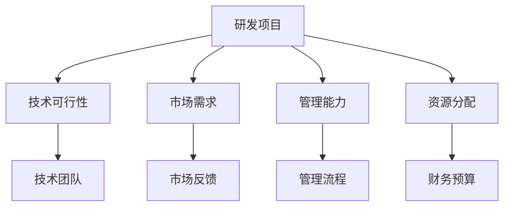
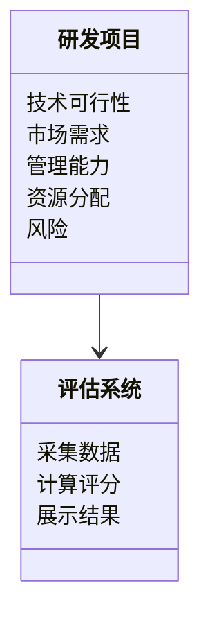
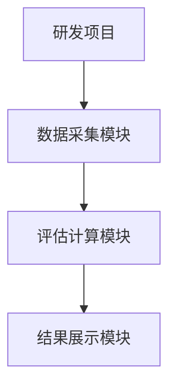
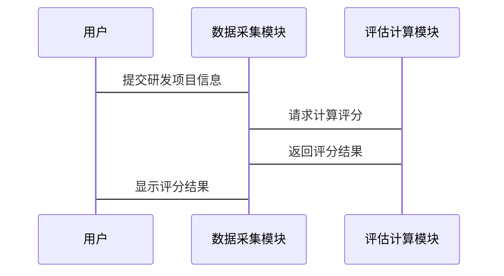

                 


# 彼得林奇对公司研发管线质量的评估

> 关键词：研发管线质量评估、彼得·林奇、技术可行性、市场需求、管理能力、评分模型、系统架构

> 摘要：本文深入探讨了彼得·林奇对公司研发管线质量评估的方法，从背景介绍、核心概念、算法原理、系统架构到项目实战，详细分析了研发管线质量评估的重要性和实现路径。通过加权评分模型、ER实体关系图、系统架构图等工具，全面解析了研发管线质量评估的核心要素和应用场景，为公司制定研发战略提供了有力支持。

---

## 第一部分：背景介绍与核心概念

### 第1章：研发管线质量评估的背景与核心概念

#### 1.1 研发管线质量评估的重要性

##### 1.1.1 研发管线的定义与作用
研发管线（R&D Pipeline）是公司研发部门的核心资产，它代表着公司未来的产品方向和技术储备。研发管线的质量直接影响公司的创新能力、市场竞争力和长期发展潜力。

##### 1.1.2 研发管线质量评估的必要性
- **投资决策**：研发管线质量评估是公司高层制定研发预算和投资决策的重要依据。
- **资源分配**：通过评估研发项目的质量，公司可以优化资源分配，确保高价值项目获得更多的支持。
- **风险控制**：评估研发管线质量有助于识别高风险项目，提前采取措施降低风险。

##### 1.1.3 彼得·林奇的评估视角
彼得·林奇（Peter Lynch）作为全球知名的投资经理，他在评估公司研发管线时，注重技术可行性、市场需求匹配度和管理能力三个核心要素。他认为，只有在技术可行、市场需求明确且管理能力强大的情况下，研发项目才有可能成功。

#### 1.2 研发管线质量评估的核心要素

##### 1.2.1 技术可行性分析
- 技术可行性是研发项目成功的基础，包括技术实现的难度、现有技术储备和团队能力。
- **技术实现难度**：评估项目是否具备可行的技术路径，是否需要突破现有技术瓶颈。
- **技术储备**：公司是否具备相关技术储备，是否需要外部合作或引进技术。
- **团队能力**：研发团队是否具备完成项目的技术能力和经验。

##### 1.2.2 市场需求匹配度
- 市场需求匹配度是研发项目成功的关键，包括市场规模、竞争态势和用户需求。
- **市场规模**：评估目标市场的容量和增长潜力，确保项目有足够的市场空间。
- **竞争态势**：分析市场上现有产品的优劣势，确定项目的差异化竞争优势。
- **用户需求**：通过用户调研和反馈，验证项目的市场需求是否明确。

##### 1.2.3 管理能力
- 管理能力是研发项目成功的重要保障，包括项目管理、团队协作和进度控制。
- **项目管理**：评估公司是否具备科学的项目管理体系，能否按计划推进项目。
- **团队协作**：团队成员之间的沟通与协作是否顺畅，能否高效解决问题。
- **进度控制**：公司是否具备有效的进度监控机制，能否及时发现并解决问题。

##### 1.2.4 财务与资源分配
- 财务与资源分配是研发项目成功的重要保障，包括预算控制、资源分配和财务健康。
- **预算控制**：评估公司是否具备合理的预算分配机制，能否确保项目资金到位。
- **资源分配**：公司是否能够合理分配人力、物力和财力资源，确保项目顺利推进。
- **财务健康**：公司整体财务状况是否健康，能否支撑研发项目的持续投入。

##### 1.2.5 风险与不确定性
- 风险与不确定性是研发项目成功的重要挑战，包括技术风险、市场风险和管理风险。
- **技术风险**：评估项目在技术实现过程中可能遇到的风险，如技术瓶颈、技术路线变化等。
- **市场风险**：评估市场需求变化对项目的影响，如政策变化、市场竞争加剧等。
- **管理风险**：评估项目管理过程中可能遇到的风险，如团队变动、进度延误等。

#### 1.3 研发管线质量评估的边界与外延

##### 1.3.1 评估范围的界定
研发管线质量评估的范围包括技术研发、产品开发和市场推广三个阶段。评估的重点是技术研发和产品开发阶段的项目质量。

##### 1.3.2 与其他评估方法的对比
- 与财务评估的对比：研发管线质量评估注重项目的技术可行性和市场需求，而财务评估注重项目的盈利能力。
- 与市场竞争评估的对比：研发管线质量评估注重项目的竞争优势，而市场竞争评估注重市场整体情况。
- 与团队能力评估的对比：研发管线质量评估注重团队的技术能力和项目管理能力，而团队能力评估注重团队的整体素质。

##### 1.3.3 评估结果的应用场景
- 投资决策：根据评估结果决定是否投资该项目。
- 资源分配：根据评估结果合理分配资源。
- 风险控制：根据评估结果制定风险应对策略。

#### 1.4 核心概念的结构与组成

##### 1.4.1 评估模型的组成要素
研发管线质量评估模型由技术可行性、市场需求匹配度、管理能力、财务与资源分配和风险与不确定性五个要素组成。

##### 1.4.2 各要素之间的关系
- 技术可行性是研发项目的基础，市场需求匹配度是研发项目的导向，管理能力是研发项目的保障，财务与资源分配是研发项目的支撑，风险与不确定性是研发项目的风险因素。
- 各要素相互影响，共同决定研发项目的质量。

##### 1.4.3 模型的可扩展性与适应性
研发管线质量评估模型具有较强的可扩展性，可以根据不同行业和不同公司的需求进行调整和优化。例如，对于技术密集型行业，可以增加技术可行性评估的权重；对于市场驱动型行业，可以增加市场需求匹配度评估的权重。

---

## 第二部分：核心概念与联系

### 第2章：研发管线质量评估的核心原理

#### 2.1 核心概念的原理分析

##### 2.1.1 技术评估的逻辑
- 技术评估的核心是判断项目的技术可行性，包括技术实现的难度、技术储备和团队能力。
- 通过技术可行性分析，确保项目的技术基础扎实，团队具备相应的技术能力。

##### 2.1.2 市场需求匹配的机制
- 市场需求匹配的核心是判断项目是否符合市场需求，包括市场规模、竞争态势和用户需求。
- 通过市场需求分析，确保项目具有明确的市场定位和竞争优势。

##### 2.1.3 管理能力的评估标准
- 管理能力评估的核心是判断公司是否具备科学的项目管理体系和高效的团队协作能力。
- 通过管理能力评估，确保项目能够按计划推进，及时发现和解决问题。

#### 2.2 核心概念的属性特征对比

##### 2.2.1 技术可行性与市场需求的对比
- 技术可行性注重项目的技术基础，市场需求注重项目的市场定位。
- 技术可行性是项目成功的必要条件，市场需求是项目成功的充分条件。

##### 2.2.2 管理能力与资源分配的对比
- 管理能力注重项目执行的效率和效果，资源分配注重项目推进的资源保障。
- 管理能力是资源分配的执行者，资源分配是管理能力的支撑。

##### 2.2.3 风险与不确定性的对比
- 风险是项目可能遇到的负面因素，不确定性是项目可能遇到的未知因素。
- 风险可以通过风险评估和管理来降低，不确定性则需要通过灵活的应对策略来处理。

#### 2.3 ER实体关系图架构



---

## 第三部分：算法原理讲解

### 第3章：研发管线质量评估的算法原理

#### 3.1 算法原理概述

##### 3.1.1 评估模型的输入与输出
- **输入**：研发项目的相关信息，包括技术可行性、市场需求匹配度、管理能力、资源分配和风险与不确定性。
- **输出**：研发项目的综合评分和质量等级。

##### 3.1.2 算法的逻辑流程
1. 收集研发项目的相关信息。
2. 分别对技术可行性、市场需求匹配度、管理能力、资源分配和风险与不确定性进行评估。
3. 根据各要素的权重计算综合评分。
4. 根据综合评分确定研发项目的质量等级。

##### 3.1.3 算法的核心公式
$$
\text{总评分} = \sum_{i=1}^{n} w_i \times s_i
$$
其中，$w_i$ 是第 $i$ 个要素的权重，$s_i$ 是第 $i$ 个要素的评分。

#### 3.2 算法的数学模型与公式

##### 3.2.1 加权评分模型
$$
\text{总评分} = (0.3 \times \text{技术可行性评分}) + (0.3 \times \text{市场需求评分}) + (0.2 \times \text{管理能力评分}) + (0.1 \times \text{资源分配评分}) + (0.1 \times \text{风险评分})
$$

##### 3.2.2 算法的实现流程
1. 确定各要素的权重。
2. 对各要素进行评分。
3. 根据权重和评分计算总评分。
4. 根据总评分确定质量等级。

#### 3.3 算法的实现流程

##### 3.3.1 算法的实现步骤
1. 收集研发项目的相关信息。
2. 对技术可行性、市场需求匹配度、管理能力、资源分配和风险与不确定性进行评分。
3. 根据权重计算总评分。
4. 根据总评分确定研发项目的质量等级。

##### 3.3.2 算法的代码实现
```python
def calculate_score(tech_feasibility, market_demand, management_capability, resource Allocation, risk):
    weights = [0.3, 0.3, 0.2, 0.1, 0.1]
    scores = [tech_feasibility, market_demand, management_capability, resource Allocation, risk]
    total_score = sum(w * s for w, s in zip(weights, scores))
    return total_score

# 示例
tech_feasibility = 80
market_demand = 75
management_capability = 85
resource_Allocation = 90
risk = 20

score = calculate_score(tech_feasibility, market_demand, management_capability, resource_Allocation, risk)
print("研发项目总评分为:", score)
```

---

## 第四部分：系统分析与架构设计方案

### 第4章：研发管线质量评估的系统架构

#### 4.1 问题场景介绍
研发管线质量评估系统需要支持多个研发项目的评估，包括数据采集、评估计算和结果展示。

#### 4.2 系统功能设计

##### 4.2.1 领域模型（Mermaid 类图）


##### 4.2.2 系统架构（Mermaid 架构图）


##### 4.2.3 系统接口设计
- 数据采集接口：负责采集研发项目的相关信息。
- 评估计算接口：负责根据采集的数据计算研发项目的综合评分。
- 结果展示接口：负责展示研发项目的评估结果。

##### 4.2.4 系统交互（Mermaid 序列图）


---

## 第五部分：项目实战

### 第5章：研发管线质量评估的项目实战

#### 5.1 环境安装

##### 5.1.1 系统环境
- 操作系统：Windows 10 或更高版本，macOS 10.15 或更高版本
- 开发工具：Python 3.8 或更高版本，Jupyter Notebook 或 VS Code
- 依赖库：numpy、pandas、matplotlib、mermaid-py

##### 5.1.2 安装步骤
1. 安装 Python 和 pip。
2. 安装依赖库：
   ```
   pip install numpy pandas matplotlib mermaid-py
   ```

#### 5.2 系统核心实现源代码

##### 5.2.1 数据采集模块
```python
import pandas as pd

def collect_data(project_info):
    # 数据采集模块
    data = pd.DataFrame({
        '项目名称': [project_info['name']],
        '技术可行性': [project_info['tech_feasibility']],
        '市场需求': [project_info['market_demand']],
        '管理能力': [project_info['management_capability']],
        '资源分配': [project_info['resource_allocation']],
        '风险': [project_info['risk']]
    })
    return data

# 示例
project_info = {
    'name': '项目A',
    'tech_feasibility': 80,
    'market_demand': 75,
    'management_capability': 85,
    'resource_allocation': 90,
    'risk': 20
}

data = collect_data(project_info)
print(data)
```

##### 5.2.2 评估计算模块
```python
import numpy as np

def calculate_score(data):
    # 权重
    weights = np.array([0.3, 0.3, 0.2, 0.1, 0.1])
    # 评分
    scores = data[['技术可行性', '市场需求', '管理能力', '资源分配', '风险']].values
    # 计算总评分
    total_score = np.sum(weights * scores, axis=1)
    return total_score

# 示例
data = pd.DataFrame({
    '技术可行性': [80],
    '市场需求': [75],
    '管理能力': [85],
    '资源分配': [90],
    '风险': [20]
})

score = calculate_score(data)
print("研发项目总评分为:", score)
```

##### 5.2.3 结果展示模块
```python
import matplotlib.pyplot as plt

def visualize_result(score):
    plt.figure(figsize=(10, 6))
    plt.bar(['项目A'], score, color='blue')
    plt.title('研发项目质量评估结果')
    plt.ylabel('评分')
    plt.show()

# 示例
score = [80]
visualize_result(score)
```

#### 5.3 代码应用解读与分析

##### 5.3.1 数据采集模块
- 该模块负责将研发项目的相关信息采集到数据框中，便于后续计算和分析。

##### 5.3.2 评估计算模块
- 该模块根据采集的数据计算研发项目的综合评分，评分公式为加权评分模型。

##### 5.3.3 结果展示模块
- 该模块负责将计算结果以图表的形式展示出来，便于直观查看。

#### 5.4 实际案例分析和详细讲解剖析

##### 5.4.1 案例背景
假设我们有一个名为“项目A”的研发项目，其相关信息如下：
- 技术可行性：80
- 市场需求：75
- 管理能力：85
- 资源分配：90
- 风险：20

##### 5.4.2 评估计算过程
1. 数据采集模块采集项目信息并生成数据框。
2. 评估计算模块根据加权评分模型计算总评分：
   $$
   \text{总评分} = (0.3 \times 80) + (0.3 \times 75) + (0.2 \times 85) + (0.1 \times 90) + (0.1 \times 20) = 24 + 22.5 + 17 + 9 + 2 = 74.5
   $$
3. 结果展示模块将评分结果以图表形式展示。

##### 5.4.3 结果分析
- 项目A的总评分为74.5，属于中等偏上水平。
- 从评分结果来看，项目A在管理能力和资源分配方面表现较好，但在技术可行性和市场需求方面存在一定的提升空间。

#### 5.5 项目小结
通过该项目实战，我们验证了研发管线质量评估模型的可行性和有效性。通过数据采集、评估计算和结果展示三个模块的协同工作，我们可以快速、准确地评估研发项目的质量，为公司制定研发战略提供有力支持。

---

## 第六部分：总结与展望

### 第6章：研发管线质量评估的总结与展望

#### 6.1 总结
研发管线质量评估是公司制定研发战略的重要工具，通过技术可行性、市场需求匹配度、管理能力、资源分配和风险与不确定性五个要素的综合评估，可以有效识别高价值研发项目，优化资源分配，降低研发风险。

#### 6.2 未来展望
未来，研发管线质量评估将更加智能化和自动化。通过引入人工智能技术，可以实现对研发项目的智能评估和预测，进一步提高评估的准确性和效率。

---

## 作者：AI天才研究院 & 禅与计算机程序设计艺术

---

通过本文的详细分析，我们深入探讨了彼得·林奇对公司研发管线质量评估的方法，从背景介绍、核心概念、算法原理到系统架构和项目实战，全面解析了研发管线质量评估的重要性和实现路径。希望本文能够为公司制定研发战略提供有力支持，帮助公司在激烈的市场竞争中占据优势地位。

