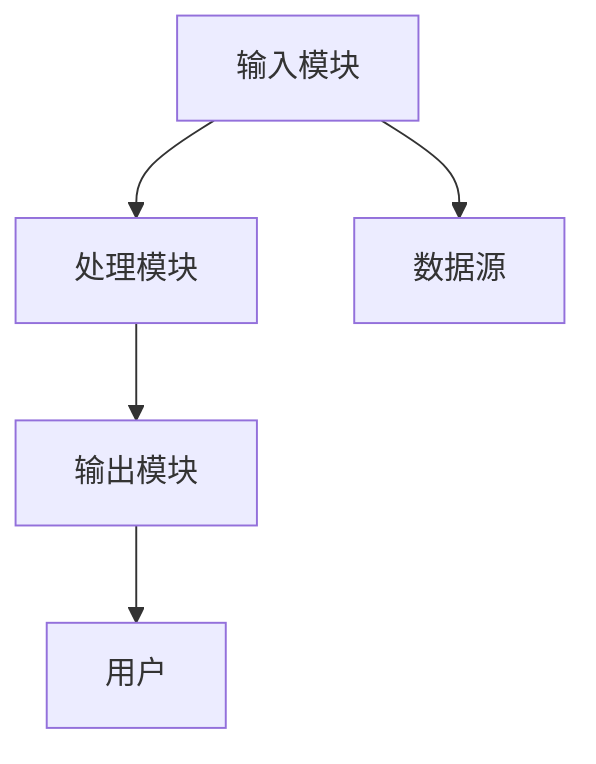
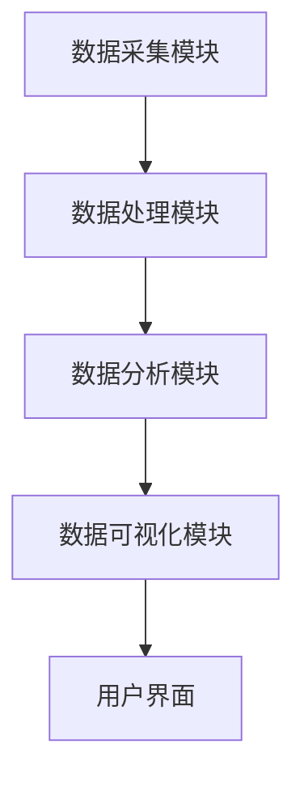

                 


# 彼得林奇对公司营运效率的跨行业比较

## 关键词：彼得林奇、公司营运效率、跨行业比较、投资分析、行业分析

## 摘要：本文通过彼得林奇的投资理念和方法，分析不同行业中的公司营运效率，探讨如何通过跨行业比较找到高效运营的模式和策略。文章结合理论与实践，详细阐述了营运效率的核心要素、分析框架、系统模型以及实际案例，为读者提供了全面的分析工具和方法。

---

# 第一部分：引言

## 第1章：彼得林奇与公司营运效率分析

### 1.1 彼得林奇的背景与投资理念
#### 1.1.1 彼得林奇的生平简介
- 彼得·林奇（Peter Lynch）是美国著名的投资经理人，曾管理富达麦哲伦基金（Fidelity Magellan），创造了卓越的投资业绩。
- 林奇的投资哲学强调基本面分析，尤其是对公司营运效率的深入研究。

#### 1.1.2 彼得林奇的投资哲学
- **价值投资**：林奇认为，投资的核心是寻找那些被市场低估的优秀公司。
- **长期视角**：关注公司的长期盈利能力，而非短期市场波动。
- **行业深度分析**：通过深入研究行业，发现那些在竞争中具备优势的公司。

#### 1.1.3 彼得林奇对公司营运效率的重视
- 林奇认为，营运效率是决定公司长期盈利能力的关键因素。
- 通过跨行业比较，可以识别出哪些行业的公司在效率上表现优异，从而为投资者提供决策依据。

### 1.2 跨行业比较的必要性
#### 1.2.1 跨行业比较的定义
- 跨行业比较是指在不同行业中，对同类指标进行横向对比，以发现行业间的差异和共性。
- 通过比较，可以识别出哪些行业在效率上具有优势，哪些行业存在改进空间。

#### 1.2.2 跨行业比较的分析框架
- 比较维度：包括利润率、周转率、成本控制、管理效率等。
- 比较对象：选择具有代表性的公司作为样本。
- 比较标准：基于行业特点设定统一的评价指标。

#### 1.2.3 跨行业比较的分析目标
- 找到行业间的效率差异。
- 发现高效率公司的共同特征。
- 为投资决策提供依据。

### 1.3 本书的核心内容与结构
#### 1.3.1 本书的主要分析方法
- 通过彼得林奇的投资方法，结合跨行业比较的分析框架，对公司的营运效率进行系统性研究。
- 结合实际案例，分析不同行业中的高效运营模式。

#### 1.3.2 本书的章节安排
- 引言：介绍彼得林奇的投资理念和跨行业比较的必要性。
- 理论基础：定义营运效率，分析其核心要素。
- 方法论：介绍跨行业比较的分析框架和指标体系。
- 系统分析：构建营运效率的系统模型。
- 项目实战：通过具体案例，展示如何进行跨行业比较。
- 总结：总结分析成果，提出投资建议。

#### 1.3.3 本书的阅读建议
- 适合对投资分析和公司运营感兴趣的专业人士。
- 需要具备一定的财务分析和行业分析基础。

---

# 第二部分：公司营运效率的理论基础

## 第2章：公司营运效率的定义与核心要素

### 2.1 公司营运效率的定义
#### 2.1.1 营运效率的多维度定义
- 营运效率是指公司在资源利用、成本控制、产出效率等方面的综合表现。
- 包括生产效率、管理效率、营销效率等多个维度。

#### 2.1.2 营运效率的核心指标
- 净资产收益率（ROE）：衡量公司资产的使用效率。
- 营业利润率：衡量公司的盈利能力。
- 存货周转率：衡量公司的库存管理效率。

#### 2.1.3 营运效率的行业差异
- 不同行业的营运效率受到行业特点的影响。
- 例如，制造业注重生产效率，而服务业更关注管理效率。

### 2.2 营运效率的核心要素
#### 2.2.1 营销效率
- 包括市场占有率、客户获取成本、客户保留率等指标。
- 高营销效率意味着公司能够在市场竞争中占据优势。

#### 2.2.2 生产效率
- 包括单位产品的生产成本、生产周期、设备利用率等指标。
- 高生产效率意味着公司能够以更低的成本生产出更多的产品。

#### 2.2.3 管理效率
- 包括管理团队的决策效率、组织架构的合理性、内部控制系统等。
- 高管理效率意味着公司能够快速响应市场变化，优化资源配置。

### 2.3 彼得林奇视角下的营运效率
#### 2.3.1 彼得林奇对营运效率的评价标准
- 林奇认为，营运效率是公司长期盈利能力的核心因素。
- 他特别关注那些在行业内具有高营运效率的公司。

#### 2.3.2 彼得林奇对营运效率的动态分析
- 林奇强调动态分析，即关注公司的营运效率是否在持续改进。
- 他通过分析公司历史数据，预测未来营运效率的变化趋势。

#### 2.3.3 彼得林奇对营运效率的行业比较
- 林奇通过跨行业比较，发现那些在效率上表现优异的公司。
- 他将这些公司作为投资目标，以实现超额收益。

---

# 第三部分：跨行业比较的方法论

## 第3章：跨行业比较的分析框架

### 3.1 跨行业比较的基本步骤
#### 3.1.1 确定比较维度
- 选择能够反映公司营运效率的核心指标。
- 例如，净利润率、周转率、成本控制等。

#### 3.1.2 选择比较对象
- 根据行业特点，选择具有代表性的公司作为样本。
- 确保样本公司在规模、市场地位等方面具有可比性。

#### 3.1.3 设定比较标准
- 根据行业特点，设定统一的评价标准。
- 例如，制造业的比较标准与服务业不同。

### 3.2 跨行业比较的指标体系
#### 3.2.1 财务指标
- 净资产收益率（ROE）：衡量公司资产的使用效率。
- 营业利润率：衡量公司的盈利能力。
- 净利率：衡量公司的成本控制能力。

#### 3.2.2 运营指标
- 存货周转率：衡量公司的库存管理效率。
- 应收账款周转率：衡量公司的应收账款管理效率。
- 供应链效率：衡量公司供应链的运作效率。

#### 3.2.3 管理指标
- 管理团队的决策效率：衡量公司管理团队的决策能力。
- 组织架构的合理性：衡量公司管理结构的优化程度。

### 3.3 彼得林奇的行业比较方法
#### 3.3.1 行业生命周期分析
- 林奇通过分析行业所处的生命周期阶段，判断行业的竞争结构。
- 例如，成熟行业的竞争更加激烈，营运效率成为制胜的关键。

#### 3.3.2 行业竞争结构分析
- 林奇分析行业的竞争结构，包括供应商的议价能力、客户的议价能力、新进入者的威胁等。
- 通过分析竞争结构，判断行业内的营运效率差异。

#### 3.3.3 行业关键成功因素分析
- 林奇识别行业内成功公司的共同特征。
- 例如，某些公司在成本控制、技术创新等方面具有显著优势。

---

# 第四部分：跨行业比较的系统分析

## 第4章：营运效率的系统分析模型

### 4.1 系统分析的基本概念
#### 4.1.1 系统分析的定义
- 系统分析是一种通过分析系统的各个组成部分及其相互关系，优化系统整体性能的方法。

#### 4.1.2 系统分析的目标
- 通过系统分析，识别影响公司营运效率的关键因素。
- 优化系统结构，提升整体效率。

#### 4.1.3 系统分析的方法
- 输入-输出分析：分析系统的输入和输出，识别关键路径。
- 结构功能分析：分解系统结构，分析各部分的功能和相互关系。
- 模型构建：通过建立数学模型，模拟系统的运行状态。

### 4.2 营运效率的系统架构
#### 4.2.1 营运效率的系统模块划分
- 输入模块：包括公司内外部环境的数据输入。
- 处理模块：包括数据的处理、分析和计算。
- 输出模块：包括分析结果的输出和可视化。

#### 4.2.2 营运效率的系统功能描述
- 数据采集：从公司财务报表和行业报告中获取数据。
- 数据分析：使用统计方法和数学模型，分析公司的营运效率。
- 结果输出：生成分析报告，提出改进建议。

#### 4.2.3 营运效率的系统交互流程
- 用户输入数据：包括公司财务数据和行业数据。
- 系统处理数据：进行数据分析和计算。
- 系统输出结果：生成分析报告和可视化图表。

### 4.3 营运效率的系统架构图
#### 4.3.1 系统架构图的绘制


#### 4.3.2 系统架构图的解释
- 输入模块从数据源获取数据，传递给处理模块。
- 处理模块对数据进行分析和计算，生成结果。
- 输出模块将结果传递给用户。

#### 4.3.3 系统架构图的应用
- 通过系统架构图，可以清晰地了解系统的运行流程。
- 有助于优化系统结构，提升整体效率。

---

# 第五部分：跨行业比较的项目实战

## 第5章：项目环境与数据准备

### 5.1 项目环境的配置
#### 5.1.1 操作系统要求
- 支持Windows、MacOS、Linux系统。

#### 5.1.2 软件工具安装
- Python：用于数据分析和编程。
- Pandas：用于数据处理。
- Matplotlib：用于数据可视化。
- Jupyter Notebook：用于数据分析和建模。

#### 5.1.3 数据库配置
- 使用MySQL或MongoDB存储数据。
- 数据库连接配置：包括用户名、密码、数据库名称等。

### 5.2 数据来源与采集
#### 5.2.1 数据来源
- 公司财务报表：包括收入、成本、利润等数据。
- 行业报告：包括行业市场规模、竞争结构等信息。
- 新闻报道：包括公司运营动态、市场变化等信息。

#### 5.2.2 数据采集方法
- 网络爬虫：从公司官网或行业报告中抓取数据。
- 数据接口：通过API获取实时数据。
- 数据库查询：从公司内部数据库中提取数据。

### 5.3 数据清洗与预处理
#### 5.3.1 数据清洗
- 删除重复数据。
- 填补缺失值。
- 处理异常值。

#### 5.3.2 数据预处理
- 数据标准化：将数据转换为统一的格式。
- 数据归一化：将数据缩放到统一的范围内。
- 数据分类：根据行业特点对数据进行分类。

---

## 第6章：数据分析与建模

### 6.1 数据分析方法
#### 6.1.1 描述性分析
- 使用统计方法描述数据的基本特征。
- 例如，计算平均值、标准差等。

#### 6.1.2 回归分析
- 通过回归分析，识别影响公司营运效率的关键因素。
- 例如，建立线性回归模型，分析各变量对净利润率的影响。

#### 6.1.3 聚类分析
- 将公司分为不同的类别，分析各类别的营运效率差异。
- 例如，将公司按行业、规模等特征进行聚类。

### 6.2 数据建模方法
#### 6.2.1 时间序列分析
- 分析公司营运效率的历史数据，预测未来趋势。
- 例如，使用ARIMA模型预测公司的净利润率。

#### 6.2.2 机器学习模型
- 使用机器学习算法，如随机森林、神经网络等，进行数据挖掘和预测。
- 例如，使用随机森林算法，识别影响公司营运效率的关键指标。

#### 6.2.3 可视化分析
- 使用数据可视化工具，如Matplotlib、Seaborn等，绘制图表。
- 例如，绘制行业营运效率对比图，直观展示各行业的效率差异。

### 6.3 数据建模的代码实现
#### 6.3.1 数据加载与预处理
```python
import pandas as pd
import numpy as np

# 加载数据
data = pd.read_csv('company_efficiency.csv')

# 删除重复数据
data = data.drop_duplicates()

# 填补缺失值
data = data.fillna(0)

# 数据归一化
from sklearn.preprocessing import MinMaxScaler
scaler = MinMaxScaler()
data_normalized = scaler.fit_transform(data)
```

#### 6.3.2 建立回归模型
```python
from sklearn.linear_model import LinearRegression

# 建立回归模型
model = LinearRegression()
model.fit(X_train, y_train)

# 预测结果
y_pred = model.predict(X_test)
```

#### 6.3.3 可视化分析
```python
import matplotlib.pyplot as plt

# 绘制行业营运效率对比图
plt.figure(figsize=(10, 6))
plt.bar(data['行业'], data['营运效率'], color='blue')
plt.title('行业营运效率对比图')
plt.xlabel('行业')
plt.ylabel('营运效率')
plt.show()
```

---

## 第7章：案例分析与实际应用

### 7.1 案例分析
#### 7.1.1 案例背景
- 选择一个具体行业，例如制造业，分析其营运效率。
- 选取几家典型公司作为样本，进行深入分析。

#### 7.1.2 数据分析
- 使用上述建模方法，分析公司的营运效率。
- 例如，分析某制造公司的生产效率、管理效率等。

#### 7.1.3 结果解读
- 解读分析结果，识别高效率公司的共同特征。
- 提出改进建议，优化公司的营运效率。

### 7.2 实际应用
#### 7.2.1 投资决策
- 通过分析不同行业的营运效率，选择具有高效率的公司进行投资。
- 例如，选择那些营运效率高、估值合理的公司。

#### 7.2.2 管理优化
- 通过分析公司内部的营运效率，优化管理流程。
- 例如，优化生产流程，降低生产成本。

#### 7.2.3 行业趋势预测
- 通过分析行业的营运效率变化趋势，预测未来的发展方向。
- 例如，预测制造业的自动化趋势，提前布局相关产业。

---

## 第8章：系统架构与代码实现

### 8.1 系统架构设计
#### 8.1.1 系统功能模块
- 数据采集模块：从数据库中提取数据。
- 数据处理模块：清洗和预处理数据。
- 数据分析模块：进行统计分析和建模。
- 数据可视化模块：生成图表和报告。

#### 8.1.2 系统架构图


### 8.2 系统实现
#### 8.2.1 环境配置
- 安装必要的软件和库：Python、Pandas、Matplotlib等。

#### 8.2.2 核心代码实现
```python
# 数据采集模块
import requests
from bs4 import BeautifulSoup

# 从网页上抓取数据
url = 'https://example.com/financial_reports'
response = requests.get(url)
soup = BeautifulSoup(response.text, 'html.parser')
data = soup.find_all('table')[0].get_text()
```

#### 8.2.3 系统交互设计
- 用户通过输入模块提交数据请求。
- 系统处理数据后，生成分析报告。
- 用户查看报告并进行下一步操作。

### 8.3 项目总结
#### 8.3.1 项目成果
- 成功构建了营运效率分析系统。
- 提供了跨行业比较的分析工具。

#### 8.3.2 项目经验
- 强调数据质量和模型选择的重要性。
- 提出优化建议，如增加更多的数据来源、优化算法等。

---

# 第六部分：总结与展望

## 第9章：总结与展望

### 9.1 核心观点总结
- 彼得林奇的投资理念强调对公司营运效率的深入分析。
- 跨行业比较是发现高效运营模式的重要方法。

### 9.2 投资建议
- 投资者应关注那些在行业内具有高营运效率的公司。
- 通过跨行业比较，识别出具有竞争优势的公司。

### 9.3 未来展望
- 随着人工智能技术的发展，数据分析和建模将更加精准。
- 跨行业比较的应用将更加广泛，为投资决策提供更有力的支持。

---

# 作者：AI天才研究院/AI Genius Institute & 禅与计算机程序设计艺术 /Zen And The Art of Computer Programming

---

> 本文通过彼得林奇的投资理念，结合跨行业比较的方法，深入分析了公司营运效率的核心要素和系统模型。通过实际案例和系统实现，为读者提供了全面的分析工具和方法。希望本文能够为投资者和企业管理者提供有价值的参考和启发。

